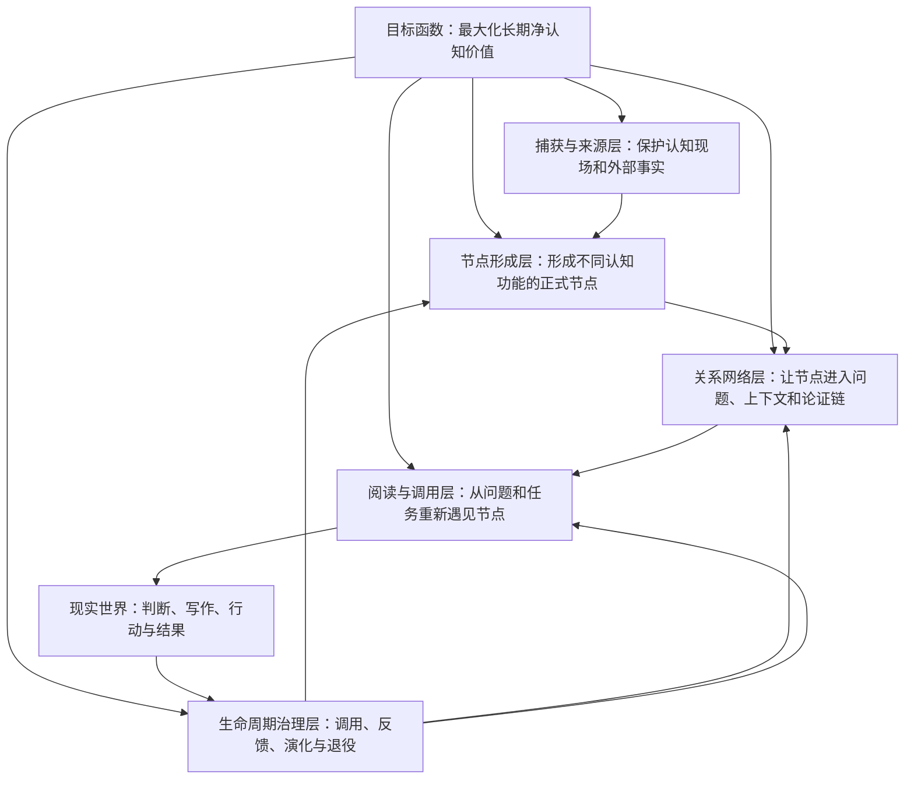

# Good idea 系统演化实时方案

> 文档性质：持续修订的工作方案，不是正式永久卡片，不是已经生效的系统规范，也不构成实施授权。
>
> 当前版本：v0.1-draft<br>
> 首次整理：2026-08-10<br>
> 当前阶段：方案雏形，等待用户讨论与外部 Agent 审查

## 一、这份文档如何使用

本文用于承接 Good idea 的系统级演化讨论。后续关于永久卡片、关系网络、生命周期、检索调用和维护机制的分析，原则上都在本文中继续修订，避免判断分散在不同对话和临时报告中。

本文与《[永久卡片整体设计逻辑](永久卡片整体设计逻辑.md)》分工如下：

- 《永久卡片整体设计逻辑》是概念基础，回答为什么需要永久卡片，以及永久卡片的目标函数、节点、网络和生命周期分别是什么。
- 本文是系统方案，回答当前 Good idea 与上述目标之间存在什么差距，以及整个系统可能如何演化。

本文中的内容使用以下状态标记：

| 状态 | 含义 |
|---|---|
| `已确认` | 用户已经明确认可，可以作为后续设计约束；不等于已经实现。 |
| `事实已核实` | 已从当前仓库文件、实现、测试或运行结果中取得证据。 |
| `分析判断` | 基于已核实事实作出的解释，仍可被反例推翻。 |
| `方案候选` | 值得讨论的设计方向，尚未取得用户实施授权。 |
| `待核实` | 证据不足，需进一步检查实现、真实使用或外部理论。 |
| `待用户决定` | 涉及系统规则、作者权、状态、目录或工作流，需要用户明确决策。 |
| `暂不处理` | 当前不值得投入实施成本，但不代表永久放弃。 |

除非相关内容已经同步进入 `AGENTS.md`、`schema.md`、项目 Skills、实现和测试，否则本文中的方案都不能被视为当前有效契约。若本文与上述权威文件冲突，以当前 `AGENTS.md` 和 `schema.md` 为准，并把冲突留作待决事项。

---

## 二、执行摘要

### 1. 当前核心判断

`已确认`：Good idea 下一步要解决的，不只是永久卡片 Skill 的对话结构，也不只是永久卡片 Markdown 模板的字段设计。

从第一性原理看，永久卡片的价值实现至少依赖四个彼此咬合的系统部分：

1. **目标函数**：系统为什么存在，最终优化什么。
2. **节点**：什么内容值得成为长期认知节点，节点如何保持独立、可理解和可调用。
3. **网络**：节点如何进入具体问题和论证链，从而获得生命力。
4. **生命周期**：系统如何用有限维护成本持续提高节点和网络的有效性。

当前 Good idea 已经较好地解决了“认知材料怎样被安全捕获、由谁确认、如何确定性写入”的问题，但还没有充分解决“正式节点怎样持续参与问题、在使用中演化并产生可验证价值”的问题。

因此，本轮演化的对象应当是：

> 从一套可靠的认知材料捕获与写入系统，继续演化为一套能够让节点、关系、任务和现实反馈共同循环的个人认知系统。

### 2. 不宜只改永久卡片 Skill 的原因

`分析判断`：如果只优化永久卡片 Skill，可能改善形成卡片时的提问质量，却无法独立解决以下问题：

- 卡片形成以后是否会在未来问题中被找到；
- 同一张卡片在不同上下文中承担什么论证功能；
- 一条丰富闪念能否继续生成多张不同类型的正式卡片；
- 卡片内容发生演化时，当前判断与历史判断如何区分；
- 卡片是否被实际使用、使用后是否改善结果；
- 系统如何识别失效、孤立、长期未调用或维护成本过高的节点；
- 阅读界面如何从“按类型列文件”转向“从问题进入一组可用节点”。

这些问题跨越 Schema、Skills、CLI、状态模型、关系存储、索引视图、Obsidian 阅读界面和测试契约。永久卡片 Skill 只是节点形成阶段的人机协作入口，不是完整系统本身。

### 3. 当前建议

`方案候选`：先不立即改实现，而是按以下顺序推进：

1. 确认 v0.2 的概念契约，尤其是四类正式卡片各自的职责、关系语义和生命周期。
2. 选择一条真实认知材料，完整走通“丰富闪念 → 一个或多个正式节点 → 语义关系 → 现实任务调用 → 反馈与修订”的纵向案例。
3. 用真实案例暴露最小必要字段、关系和状态，而不是先设计完整分类体系。
4. 用户确认后，再同步修改权威文档、Skills、实现、测试和阅读界面。

---

## 三、第一性原理：系统究竟要优化什么

### 1. 目标函数

`已确认`：Good idea 不是以卡片数量、目录整齐程度或元数据完整度为最终目标，而是在有限的时间、注意力和维护成本下，最大化整个认知网络对未来判断、行动和创作的长期净价值。

单个节点的期望价值可以表达为：

$$
EV(n)=机会\times可找到性\times有效性\times可理解性\times可应用性\times结果贡献
$$

进一步扣除生命周期成本：

$$
NCV(n)=EV(n)-C(生命周期)
$$

系统级目标则是：

$$
\max \sum_{i=1}^{n}NCV_i
$$

约束条件是人的认知预算有限：

$$
捕获成本+形成成本+连接成本+维护成本+调用成本\leq有限认知预算
$$

这意味着：

- 不是所有记录都应该升级为永久节点；
- 不是所有节点都需要相同的完成度和维护投入；
- 零连接节点可以合法存在，但长期零调用节点值得重新评估；
- 结构和元数据只有在降低价值链阻力时才值得存在；
- 系统优化对象是整个网络的净价值，而不是每张卡片的形式完美。

### 2. 价值载体：节点

`已确认`：永久卡片首先是一张能够脱离原始材料、被独立理解和跨场景调用的思维单元。

一个合格节点至少需要回答：

- 它表达的核心判断、问题、行动或组织意图是什么；
- 它是否只承担一个主要认知功能；
- 哪些内容是事实、推论、边界、反例或待解决问题；
- 它在脱离原始对话和来源后是否仍可理解；
- 未来什么变化会使它失效或需要修订。

节点的“原子性”不是字数越少越好，而是它能否作为一个独立单元进入新的论证和任务。若一张卡片包含两个可以分别成立、分别连接或分别失效的核心判断，就存在拆分的理由。

### 3. 生命机制：关系网络

`已确认`：卡片的生命力不来自它被放进某个静态分类，而来自它能进入新的问题、上下文和论证链。

例如，“AI 不应消除全部认知摩擦，而应重新分配认知摩擦”并不只是同时属于 AI、教育和组织三个主题。它可能在不同上下文中分别承担：

- 在 AI 产品设计中，反对无摩擦自动化；
- 在教育中，解释必要困难如何参与能力形成；
- 在组织委托中，解释长期外包为什么损害判断权。

系统需要保存的不只是“它和哪些主题有关”，还应能够表达“它在这个问题中起什么作用”。关系由此不再只是文件之间的静态连线，而是节点参与问题和论证的功能记录。

### 4. 治理机制：生命周期

`已确认`：生命周期不是为了把系统维护得漂亮，而是为了持续优化目标函数。

生命周期至少需要覆盖：

1. 捕获：保护认知现场，不要求立即完成所有判断。
2. 形成：决定什么值得成为何种正式节点。
3. 接入：让节点能够通过关系和入口被重新发现。
4. 调用：在真实问题、写作、决策或行动中使用节点。
5. 反馈：记录使用结果是否改善判断或行动。
6. 演化：修订、分叉、替代、合并或退役节点。
7. 清理：停止维护低价值内容，控制噪声和系统成本。

生命周期的目标不是确保每张卡片永远活跃，而是让维护资源向高机会、高贡献、高风险或高复用的节点倾斜。

---

## 四、当前系统事实快照

> 快照日期：2026-08-10。以下事实描述当前仓库，不代表长期不变；外部 Agent 审查时应重新核实。

### 1. 当前已经具备的能力

`事实已核实`：

- `AGENTS.md` 明确区分用户、Agent/Skills 和 CLI 的权责。
- 五个内容空间及永久空间四类卡片已经建立稳定目录和状态契约。
- 捕获会话先写入 Git 忽略的运行时目录，正式生成前允许用户补充、修正、拆分、合并和删除。
- 外部来源使用受保护的 Markdown 原文快照、哈希校验和可恢复后台维护。
- 永久卡片采用“完整草稿确认 → 隐藏提案 → 明确接受”的两阶段门禁。
- 正式卡片进入永久空间和索引后即被视为网络节点，零语义边节点合法。
- 正式写事务由 CLI 负责原子写入、索引、日志、Git 提交和非破坏性回滚。
- 当前阅读入口为 Obsidian 和 CLI 生成的 `index.md`。

### 2. 当前真实内容形态

`事实已核实`：当前人类可读索引显示：

- 永久卡片 1 张；
- 母题卡片 0 张；
- 行动卡片 0 张；
- 索引卡片 0 张；
- 当前正式卡片网络没有已接受的语义连接。

这意味着当前系统的事务能力和类型设计已经存在，但尚未通过足够多的真实正式节点验证网络和生命周期设计。

### 3. 证据索引

以下位置是当前判断的主要核实入口：

| 证据 | 当前可核实内容 |
|---|---|
| `AGENTS.md` 的“权责边界”“不可破坏的规则”“Agent 操作顺序” | 用户作者权、两阶段确认、零边节点、CLI 写入边界。 |
| `schema.md` 的“各类型字段”“状态机与命令门禁” | 四类正式卡片共享字段，现有状态和命令契约。 |
| `.agents/skills/goodidea-form-permanent/SKILL.md` | 正式卡片形成阶段的对话职责。 |
| `.agents/skills/goodidea-connect-cards/SKILL.md` | 当前语义连接候选与用户确认流程。 |
| `.agents/skills/goodidea-lint/SKILL.md` | 当前巡检的声明范围。 |
| `src/goodidea/service.py` 中 `_validate_user_draft` | CLI 只做草稿语法和最低长度校验，语义质量留给人和 Skill。 |
| `src/goodidea/service.py` 中 `permanent_propose` | `source_ids` 和 `from_ids` 当前主要校验对象是否存在。 |
| `src/goodidea/service.py` 中 `permanent_accept` | 正式卡片接纳后会把引用的闪念自动标记为 `processed`。 |
| `src/goodidea/service.py` 中 `permanent_revise` | 通用修订当前以追加“演化记录”为主。 |
| `src/goodidea/service.py` 中 `connect_propose` / `connect_accept` | 关系和理由当前是自由文本，并写入关系状态及两端卡片。 |
| `src/goodidea/service.py` 中 `review` / `lint` | review 当前主要覆盖中间材料；lint 以机械完整性检查为主。 |
| `src/goodidea/repository.py` 中 `generate_index` | `index.md` 主要按类型展示标题和状态。 |
| `tests/test_cli.py` 的四类卡片流程测试 | 当前类型间关系字段的语义边界尚未被严格锁定。 |
| 当前唯一永久卡片 | 可用于检验粒度、开放问题和多节点拆分的真实样本。 |

---

## 五、必须保留的系统优势

以下内容不是本轮优化的障碍，而是系统可信度的基础。

### 1. 用户作者权

`已确认`：永久认识必须来自用户本人表达或用户确认后的结构化整理。Agent 可以提问、寻找反例、调整顺序和提炼标题，但不能静默新增用户没有表达的判断。

演化系统时，不能为了提高自动化程度而削弱这一边界。尤其不能让模型自动生成永久卡片、自动接受语义关系或把推测写成用户判断。

### 2. 确定性执行边界

`分析判断`：CLI 对写入、状态、索引、日志、事务和回滚的负责方式应保留。认知判断可以开放，机械执行应继续确定。

### 3. 来源与个人认识分离

`已确认`：溯源空间只保存外部世界说过什么；人的即时念头进入闪念空间；对多个念头进一步思考形成的认识进入永久空间。来源不应因为系统升级而变成自动摘要或伪装成用户理解。

### 4. 两阶段确认与零边合法性

`已确认`：正式卡片先形成提案，再由用户明确接受。卡片一旦正式进入永久空间就是节点，不需要为了形式上的“入网”强行制造连接。

### 5. 事务、快照和回滚保护

`分析判断`：快照哈希、聚焦提交、失败无部分状态、非破坏性回滚等机制应该继续作为后续演化的底座，而不是在重构认知模型时被绕开。

---

## 六、问题地图：当前价值链在哪里受阻

### A. 节点形成层

#### A1. 四类正式卡片的机器契约过于同质

`事实已核实`：永久、母题、行动和索引四类卡片目前共享 `authoring_mode`、`source_ids` 和 `derived_from` 三类主要字段；形成流程也主要复用同一套永久卡片 Skill 和 CLI 入口。

`分析判断`：目录和名称已经表达了四种不同认知功能，但数据与对话契约还没有充分体现差异：

- 永久卡片应强调一个可独立成立的判断及其边界；
- 母题卡片应强调持续追问、当前张力和阶段性进展；
- 行动卡片应强调假设、行动、观察和结果反馈；
- 索引卡片应强调组织目的、进入问题的路径和所编排节点的功能。

如果四类卡片只在标题和目录上不同，类型可能退化为静态分类，而不是不同认知功能的契约。

#### A2. CLI 只校验形式，不校验节点认知质量

`事实已核实`：当前草稿校验主要确保只有一个一级标题、正文非空且达到最低长度，并明确把语义质量交给人和 Skill。

`分析判断`：这一分工本身合理，但它使 Skill 的审查问题和类型契约成为关键。如果 Skill 没有稳定检查原子性、独立可理解性、边界、反例和未来调用场景，CLI 无法补救。

#### A3. 当前真实卡片已经暴露粒度问题

`事实已核实`：当前唯一永久卡片同时讨论传统知识库、持续生成、AI 幻觉、人的认知分工、“西西弗斯式维护”和“金字塔式思考”，并在末尾保留“持续生成如何形成增长机制”的开放问题。

`分析判断`：这些内容有完整内在逻辑，但也可能包含多个能够分别连接、分别失效的判断；末尾开放问题还可能具有母题卡片功能。它适合作为纵向试验样本，而不是直接判定为“不合格”。

#### A4. 丰富闪念可能被一次性“消费完”

`事实已核实`：正式卡片接纳后，当前实现会把 `from_ids` 中的闪念自动标记为 `processed`。

`分析判断`：如果一条闪念是一整次认知激活事件，它可能继续生成永久、母题和行动等多个节点。第一张正式卡片形成后立即把闪念视为处理完成，可能过早关闭继续演化的入口。

### B. 关系网络层

#### B1. 当前关系表达不足以描述上下文功能

`事实已核实`：当前连接候选保存起点、终点、自由文本关系和自由文本理由。

`分析判断`：这能表达“两张卡片为何有关”，但不稳定地表达“某张卡片在某个问题中承担什么角色”。随着卡片增加，自由文本会增加同义词漂移，也难以生成可靠的任务视图和关系巡检。

#### B2. 关系事实存在重复保存

`事实已核实`：接受连接时，关系既进入内部状态，也进入两端卡片的人类可读连接区。

`分析判断`：如果没有清晰的唯一事实源与派生视图规则，后续修订、断开和迁移容易出现三处内容不一致。需要决定哪一处是规范事实，其他位置只机械生成。

#### B3. ID 字段只保证“存在”，没有充分保证“角色正确”

`事实已核实`：当前 `permanent_propose` 会检查 `source_ids` 和 `from_ids` 指向的对象是否存在，但没有在同一入口中严格限定每组 ID 必须对应何种对象类型。现有测试甚至把正式卡片 ID 传入索引卡片的 `source_ids`。

`分析判断`：这说明系统尚未明确区分“外部来源”“生成依据”“编排成员”“语义关系”等不同关系。它们不应被一个宽泛 ID 列表长期承载。

#### B4. 当前网络尚未接受真实规模验证

`事实已核实`：当前只有一张正式卡片和零条语义边。

`分析判断`：因此，现在不适合直接设计庞大的关系本体或引入向量数据库。更可靠的方式是先让少量真实节点形成多条不同用途的论证链，再从使用中提炼最小稳定关系词表。

### C. 生命周期治理层

#### C1. “修订状态”和“有效状态”可能混在一起

`事实已核实`：永久卡片和索引卡片允许 `active`、`revised`、`retired`；通用修订主要追加“演化记录”，默认把状态转为 `revised`。

`分析判断`：`revised` 描述“发生过什么”，`active/retired` 描述“现在是否有效”，两者属于不同维度。把二者放在同一状态轴上，可能使当前有效判断不够清楚。

#### C2. 通用修订难以表达当前主张的替代关系

`事实已核实`：当前 `permanent revise` 以追加用户确认的演化记录为主，不直接重写原判断。

`分析判断`：追加历史有利于审计，但当原判断被纠正时，阅读者需要知道“当前应相信什么”。未来可能需要区分补充、修正、否定、被新卡替代和分叉，而不仅是不断追加记录。

#### C3. 正式节点缺少持续回顾入口

`事实已核实`：当前 `review` 主要扫描闪念、有意思、待办和来源，没有把正式卡片的长期健康纳入同一回顾结果。

`分析判断`：系统能提醒中间材料待处理，却不能系统性暴露长期未调用、可能失效、存在未解决冲突或行动反馈缺失的正式节点。

#### C4. 机械巡检与认知巡检尚未真正分层

`事实已核实`：当前 `lint` 主要验证元数据、目录、状态、哈希、索引和关系完整性；实现中虽然初始化了 `warnings`，但当前没有形成完整的认知健康信号。

`分析判断`：机械完整性应继续由确定性 lint 负责；“这张卡片是否臃肿、过时、孤立、矛盾或长期无用”则需要可解释的认知巡检。两者不应混成同一种错误，也不应让模型建议自动修改内容。

#### C5. 使用反馈只在行动卡片上较为明确

`事实已核实`：行动卡片已有结构化结果与调整反馈入口，普通永久卡片没有同等明确的“在哪里被使用、是否有帮助、结果如何”的记录机制。

`分析判断`：如果目标函数包含可应用性和结果贡献，系统需要某种低摩擦使用反馈，否则长期价值只能靠主观预估，无法从实际调用反哺节点质量。

### D. 阅读与调用层

#### D1. `index.md` 是完整目录，不是问题入口

`事实已核实`：当前索引按类型展示标题和状态，并刻意不保存摘要。

`分析判断`：这一设计适合作为完整性入口，但不足以单独承担任务调用。未来可能需要在不引入自动摘要的前提下，增加由关系和用户确认内容派生的视图，例如：

- 按母题进入当前判断、冲突和行动；
- 按现实问题查看可调用节点；
- 查看等待验证、长期未使用或已被替代的节点；
- 查看某张卡片在不同论证链中的功能。

#### D2. 五个空间在使用体验上可能重新变成分类桶

`分析判断`：五个空间在数据治理上有明确职责，但如果用户主要通过目录寻找知识，它们仍可能被体验为静态分类。更合适的理解是：这些空间是不同处理阶段和对象责任的工作队列，真正的认知入口由问题、关系和任务视图提供。

这不意味着现在要合并或改名目录。当前宪法明确禁止这样做，且没有证据说明目录本身是核心瓶颈。

### E. 文档与实现一致性

#### E1. README 的流程图存在轻微语义歧义

`事实已核实`：README 流程图画成“永久卡片 → 可选语义连接 → 卡片网络”，而正文又明确说正式卡片进入永久空间后已经是网络节点，零连接合法。

`分析判断`：流程图可能让人误解为必须连接后才算入网，应在未来同步规则时修正表达。

#### E2. 项目说明与实际结构存在局部漂移

`事实已核实`：README 的项目树与当前实现、运行时捕获结构和部分模块并不完全同步；`AGENTS.md` 的永久卡片任务路由存在重复行；`schema.md` 对内部状态账本的部分描述与前文“移除镜像”的规则也存在需要复核的地方。

`分析判断`：这些问题不是认知架构的根因，但会增加外部 Agent 审查和后续实施时的误解成本。进入实现阶段前应做一次契约一致性整理。

---

## 七、目标系统架构候选

`方案候选`：在不破坏当前权责和事务底座的前提下，将 Good idea 理解为五个协同层，而不是若干文件夹和 Skills 的集合。



### 1. 捕获与来源层

主要职责：

- 低摩擦保护用户表达；
- 保存认知激活事件及其触发情境；
- 保持外部事实与个人判断分离；
- 在正式形成节点前允许未完成和不确定。

当前判断：`大体保留`。这一层近期刚完成重要演化，不应在缺少真实问题时再次大改。

### 2. 节点形成层

主要职责：

- 判断一份材料是否值得成为正式节点；
- 判断应形成永久、母题、行动还是索引卡片；
- 保障每类节点具有最小充分结构；
- 识别一份丰富材料能否形成多个节点。

当前判断：`本轮重点`。

### 3. 关系网络层

主要职责：

- 记录节点之间稳定、可解释的语义关系；
- 表达节点在具体问题或论证链中的角色；
- 支持从一个节点发现相关节点；
- 为任务视图和网络健康检查提供结构化基础。

当前判断：`本轮重点`，但应从真实关系中提炼最小词表，避免先造复杂本体。

### 4. 生命周期治理层

主要职责：

- 区分当前有效性和历史变化；
- 收集真实调用和结果反馈；
- 发现失效、矛盾、重复、长期未用和维护成本过高的节点；
- 支持修订、分叉、替代、合并、断连和退役；
- 将维护资源分配给更可能产生价值的部分。

当前判断：`本轮重点`，但认知巡检只应提出候选，不能自动修改用户判断。

### 5. 阅读与调用层

主要职责：

- 保留完整目录；
- 提供从问题、母题、任务和关系进入网络的路径；
- 降低“记录过但找不到”和“找到却不知道如何使用”的阻力；
- 让使用反馈自然回流生命周期。

当前判断：`需要设计`。在真实节点很少时，先做简单派生视图，不急于引入语义搜索或复杂图数据库。

---

## 八、分项演化方案候选

### 方案 1：为四类正式卡片建立不同的最小充分契约

状态：`方案候选`、`待用户决定`

建议不是给每类卡片堆更多字段，而是明确每一类不可替代的认知功能：

| 类型 | 最小认知功能 | 可能需要显式表达的内容 |
|---|---|---|
| 永久卡片 | 可跨场景调用的独立判断 | 核心主张、成立依据或推理、适用边界、可能失效条件、未来调用线索。 |
| 母题卡片 | 跨时间持续追问的问题容器 | 核心问题、为何重要、当前张力、已有子问题、阶段性进展、尚缺什么。 |
| 行动卡片 | 把认识送入现实检验 | 前置判断、预期、具体行动、观察指标、结果、调整。 |
| 索引卡片 | 带着目的进入一组节点 | 组织目的、进入条件、成员节点、各节点在当前主题中的功能、当前阅读路径。 |

需要进一步讨论：哪些内容属于正文提示，哪些属于 Frontmatter，哪些只属于 Skill 的审查问题。默认原则是：能由正文清楚表达的内容，不为了机器便利强制元数据化。

### 方案 2：把“闪念已处理”从单次消费改为显式完成判断

状态：`方案候选`、`待用户决定`

可能方向：

- 正式卡片接纳后只记录“已产生某节点”，不自动等同于闪念已经穷尽；
- 由用户在看完可能去向后确认该闪念是否处理完成；
- 或区分“已有产出”和“处理完成”两个维度；
- 回顾时显示一条闪念已经形成哪些正式节点、还保留哪些开放方向。

需要验证：这样做是否会显著增加积压感和维护成本。

### 方案 3：建立小而稳定的关系词表，同时保留具体理由

状态：`方案候选`、`待真实案例验证`

可从少量高价值关系开始，例如：

- 支持；
- 反驳或冲突；
- 限定边界；
- 解释机制；
- 提供例证；
- 演化或替代；
- 导向行动；
- 归入某一问题入口。

关系类型用于稳定检索和巡检，具体理由仍需由用户确认，用来说明为什么在当前上下文中成立。是否需要方向性、上下文角色和独立“问题节点”，应通过真实案例决定。

### 方案 4：明确关系的唯一事实源

状态：`方案候选`、`待技术评估`

原则：关系只能有一个规范事实源；卡片正文、反链、索引和图视图都由它机械生成。需要比较以下选项：

1. 以内部结构化状态为规范源，卡片连接区为生成视图；
2. 以卡片中的结构化关系区为规范源，内部状态只做索引；
3. 每条关系成为独立对象，卡片只显示投影视图。

选择标准不是技术优雅，而是原子事务、可读性、Git 可审计性、断连成本和未来上下文关系表达能力。

### 方案 5：把有效性与演化事件拆成两个维度

状态：`方案候选`、`待用户决定`

可能模型：

- 当前有效状态：有效、待核验、已失效或退役；
- 演化事件：补充、修正、否定、分叉、合并、被替代；
- 当前主张：阅读卡片时首先看到当前应采用的认识；
- 历史记录：保留原判断如何变化，不覆盖用户认知历史。

该方案会改变状态契约和修订流程，必须在真实修订案例中验证后再决定。

### 方案 6：把“被使用”纳入永久节点生命周期

状态：`方案候选`

永久节点的使用反馈可以尽量低摩擦地记录：

- 在什么问题、文章、决策或行动中被调用；
- 当时承担什么功能；
- 是否改变了判断或行动；
- 结果是否得到改善；
- 使用后暴露了什么边界、错误或新问题。

不建议立即设计精确评分体系。早期先保留可核实的使用事件，等真实数据出现后再决定是否需要机会、贡献或维护成本指标。

### 方案 7：分离机械 lint 与认知/网络 review

状态：`方案候选`

建议边界：

- `lint/verify`：确定性检查格式、哈希、断链、镜像一致性、非法状态和索引漂移；可以阻止写入。
- 认知 review：提示卡片可能臃肿、长期未调用、与新卡冲突、来源可能过时、行动长期无反馈等；只生成候选，不自动改变内容或状态。
- 网络 review：提示孤立节点、关系理由缺失、关系词漂移、入口覆盖不足等；是否连接仍由用户确认。

是否新增独立 Skill，还是扩展现有 `goodidea-review-process`，需要结合路由复杂度进一步评估。初步倾向于避免让“处理中间材料”和“治理正式网络”继续混在同一输出里。

### 方案 8：增加面向问题和任务的派生视图

状态：`方案候选`、`后置实施`

在不改变 `index.md` 完整目录职责的前提下，可以增加：

- 母题视图：一个长期问题下的当前判断、冲突、行动和反馈；
- 任务视图：面对某个现实任务时，可调用哪些节点以及各自作用；
- 演化视图：哪些节点被修订、替代、分叉或退役；
- 健康视图：哪些节点长期未使用、等待核验或缺少反馈。

这些视图应尽量由用户确认的节点与关系机械生成，不依赖 Agent 自动编写摘要。

### 方案 9：先修正文档契约漂移，再实施架构变化

状态：`方案候选`

进入实现阶段时，应同步检查：

- `AGENTS.md` 是否存在重复或相互覆盖的任务路由；
- `schema.md` 对状态账本、来源映射和候选镜像的描述是否一致；
- README 流程图是否准确表达零边节点已经入网；
- README 项目树是否覆盖当前模块、运行时捕获和实际 Skills；
- Skill 的 description、正文流程、CLI 参数和测试是否表达同一契约。

---

## 九、暂不建议现在做的事情

### 1. 不立即合并或重命名五个内容空间

状态：`暂不处理`

理由：当前空间承担来源、捕获、待处理和正式内容的不同治理职责；目录可能造成分类桶体验，但问题更可能出在调用入口，而不是目录名称本身。当前宪法也明确禁止合并和改名。

### 2. 不立即引入完整知识图谱本体

状态：`暂不处理`

理由：当前只有一个正式节点和零关系，缺少足够真实样本。过早定义复杂关系类型会增加维护成本，并把未来思想强行裁进预设框架。

### 3. 不立即引入向量数据库或自动语义搜索

状态：`暂不处理`

理由：当前首先要解决的是节点质量、关系语义和生命周期闭环。检索技术无法弥补节点不独立、关系无上下文或使用反馈缺失。

### 4. 不让 Agent 自动接受永久卡片或关系

状态：`已确认不做`

理由：这会改变用户作者权和判断责任，直接破坏 Good idea 的系统宪法。

### 5. 不把所有认知质量要求都变成强制字段

状态：`方案原则`

理由：字段越多，形成和维护成本越高。应先区分“节点必须表达什么”和“机器必须结构化什么”。Skill 可以用问题帮助澄清，但未必需要把每个问题的答案都固化为 Frontmatter。

---

## 十、建议的推进阶段

### 阶段 0：确认方案文档的角色

状态：`已完成`

- 建立本文作为持续讨论和外部审查的共同对象；
- 区分概念基础、工作方案和有效系统契约；
- 未取得明确授权前不实施方案。

### 阶段 1：确认 v0.2 概念契约

状态：`待讨论`

优先确认：

1. 四类正式卡片的不可替代功能和最小充分结构；
2. 一条丰富闪念何时算处理完成；
3. 关系究竟表达卡片间语义，还是卡片在问题中的功能，或同时表达两者；
4. 当前有效状态与历史演化事件如何区分；
5. 什么叫一次有效调用，是否值得记录。

### 阶段 2：走通一条真实纵向案例

状态：`待执行`

建议使用当前“永久卡片整体设计逻辑”及相关闪念作为试验材料，但不预设最后一定形成几张卡片。

完整路径：

```text
认知材料
→ 识别多个可能节点
→ 用户确认卡片类型和内容
→ 建立真实关系
→ 放入一个现实问题或写作任务
→ 记录是否被采用及结果
→ 回看节点、关系和生命周期缺失了什么
```

试验目标不是多产卡片，而是发现现有系统在每一环的真实阻力。

### 阶段 3：形成最小变更集

状态：`待阶段 2 结果`

按影响面形成同步变更方案：

- `decisions-v0.1.md`：追加用户确认的设计决策；
- `AGENTS.md`：同步权责、任务路由和不可破坏规则；
- `schema.md`：同步类型、字段、关系、状态和事务契约；
- 项目 Skills：同步触发、提问、审查、确认和交接；
- `src/goodidea/` 与 CLI：实现确定性门禁和写入；
- Obsidian 与生成视图：提供新的阅读和调用入口；
- 测试与评测：锁定契约、回归事务和 Skill 路由。

### 阶段 4：小规模运行与回顾

状态：`待后续`

用少量真实卡片运行一段时间，重点观察：

- 形成卡片的时间是否下降或上升；
- 卡片是否更容易在真实任务中被找到；
- 关系是否帮助推理，而不是制造连接负担；
- 使用反馈是否真的发生；
- review 是否带来有效维护，还是制造新的整理黑洞；
- 新机制是否保持用户作者权和系统可恢复性。

---

## 十一、当前待决问题

以下问题尚未由用户确认，不能写入有效契约：

1. 四类正式卡片是否都需要不同正文模板，还是只需要不同的审查问题？
2. 永久卡片的“一个核心想法”应如何判断，何时允许一个完整论证包含多个子判断？
3. 当前唯一永久卡片应拆为几张卡片，开放问题是否应成为母题卡片？
4. 闪念的 `processed` 应表示“至少形成一个正式节点”，还是“本轮已无剩余去向”？
5. `source_ids`、`derived_from`、索引成员和语义关系应如何明确分工？
6. 关系需要哪些最小稳定类型？是否需要方向、强度、上下文和论证角色？
7. 关系的唯一事实源应该放在哪里？
8. “有效、待核验、失效”和“修订、替代、分叉”应如何构成状态模型？
9. 普通永久卡片的使用反馈是否进入卡片正文、独立事件账本，还是行动/任务对象？
10. 正式网络回顾应由新 Skill 承担，还是扩展现有 review Skill？
11. 哪些认知健康信号可以确定性计算，哪些只能由 Agent 提出候选？
12. 除完整索引外，第一批最有价值的任务或问题视图是什么？

---

## 十二、外部 Agent 审查清单

其他 Agent 审查本文时，不应直接修改有效规则或正式内容。建议分别完成以下审查，并明确区分事实与建议。

### A. 事实核查

- 逐条核实“当前系统事实快照”和“问题地图”引用的代码、Schema、Skill 和真实内容；
- 标记已经变化、证据不足或被误读的判断；
- 检查是否遗漏现有 CLI、状态迁移、测试和保护机制；
- 特别核查关系存储、修订语义、闪念处理和 ID 类型校验。

### B. 第一性原理审查

- 目标函数是否遗漏重要收益或成本；
- 节点、网络和生命周期是否足以解释卡片价值；
- “问题与任务中的功能”是否比静态标签更接近真实调用；
- 是否存在更简单、解释力更强的替代框架。

### C. 反例与风险审查

- 原子化是否可能破坏完整论证；
- 记录上下文角色是否会制造过高维护成本；
- 延迟把闪念标记为完成是否会造成永久积压；
- 使用反馈是否会把知识系统变成绩效记录系统；
- 关系词表是否会重新形成僵化分类；
- 生命周期回顾是否会制造新的整理黑洞。

### D. 架构审查

- 五层目标架构是否职责重叠；
- 哪些改动属于文档、Skill、Schema、CLI、状态仓库或阅读视图；
- 哪些规则必须强一致，哪些可以只作为启发式建议；
- 如何保留原子事务、幂等、Git 审计和回滚能力；
- 如何迁移既有卡片而不静默重写用户内容。

### E. 最小方案审查

- 哪些问题可以通过调整 Skill 解决；
- 哪些问题必须改变数据契约；
- 哪些问题应通过真实使用而不是继续设计来验证；
- 能否提出比本文更小、但能闭合“形成—连接—调用—反馈”循环的方案。

建议外部审查输出格式：

```markdown
## 审查结论

## 已核实事实

## 不成立或证据不足的判断

## 被遗漏的问题

## 可选方案与权衡

## 建议优先验证的真实案例

## 不建议修改的系统基础
```

---

## 十三、决策与版本记录

### 2026-08-10｜v0.1-draft

已确认：

- 目标函数回答为什么建立系统；
- 节点回答一张知识卡片是什么、如何写；
- 网络回答节点为何具有生命力；
- 生命周期治理节点和网络，以尽可能优化目标函数；
- 本轮优化对象可能超出永久卡片 Skill 和卡片模板，需要从整个 Good idea 系统重新检查；
- 建立本文作为可持续修订、可交给其他 Agent 核实和审查的实时方案。

尚未确认：

- 本文提出的具体类型契约、关系模型、状态模型、反馈机制和实施阶段；
- 任何对 `AGENTS.md`、`schema.md`、Skills、CLI、卡片、索引或 Obsidian 配置的修改。

后续每次修订应至少记录：

- 修改日期和版本；
- 新确认的决策；
- 被推翻或修正的判断；
- 新增证据；
- 对实施范围和风险的影响。
