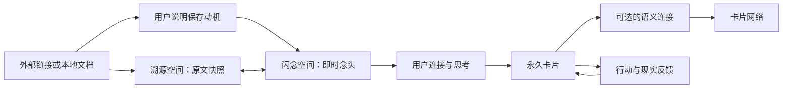

# Good Idea：AI 原生个人认知系统

Good Idea 是一套只服务当前用户、运行在本机 macOS 上的 Markdown 个人认知系统。它不是把资料不断收进文件夹，也不是让 AI 自动替人生成知识；它要建立一条持续可改进的认知流水线：保存外部依据，留下人的即时念头，再由人连接、判断并形成可以继续演化的永久卡片。

本项目当前版本为 v0.1。Obsidian 是正式阅读和导航界面，Agent/Skills 负责对话与判断协作，`goodidea` CLI 负责确定性写入，Git 负责记录每次变化并提供非破坏性回滚。

## 核心原则

### 人负责判断，AI 负责机械维护

人负责说明为什么保存、表达自己的观点、决定是否形成永久卡片、确认卡片关系，并对行动结果负责。AI 可以预读、追问、检查、整理已经表达的内容，但不能把自己的推断伪装成用户的认识。

重复整理、归档、维护链接、更新索引、检查格式和保存版本属于“西西弗斯式工作”，可以交给 AI 和 CLI。连接闪念、形成判断、发现边界并让每一次思考成为后续思考基础，属于“金字塔式工作”，必须保留人的认知烙印。

### 持续生成需要约束

AI 原生不等于让模型任意生成。系统只约束一个大的可能性空间，让模型在局部协作中发挥能力，同时通过来源快照、用户确认、状态门禁、哈希校验、测试和 Git 历史防止幻觉与噪声进入长期知识网络。

### 外部世界与个人认识分层

- `溯源空间/` 回答“外部世界原本说了什么”。
- `闪念空间/` 回答“我看到它时产生了什么念头”。
- `永久空间/` 回答“我连接并思考这些念头后，形成了什么认识”。

溯源空间不设置“文献笔记”中间层，也不自动生成摘要、作者观点或用户理解。五个空间的正式内容都不保存 `summary` 元数据；Git 日志中的操作说明只是事务记录，不是卡片摘要。

## 认知流转



捕获闪念时，用户想法是主信息，随附链接和文件只是上下文。系统先在不进入 Git 的运行时会话中保护多轮表达，只检查上下文能否读取并按需使用；随后生成一张或多张闪念候选，允许用户补充、修正、合并、拆分、删除或返回讨论。只有用户确认最新清单已经覆盖本轮该记录的内容后，CLI 才正式创建闪念，并把来源快照、图片和关系交给可恢复后台任务。

用户只要求保存资料、没有发起闪念讨论时，仍使用来源流程：Agent 临时预读并询问内容相关的保存动机，用户回答后才持久化来源和保存动机闪念。两种场景不因输入都包含链接而混为一谈。

永久卡片必须由用户主动发起。Agent 通过一次一个问题的苏格拉底式交流帮助澄清观点；经用户授权后，可以删除口语停顿和重复、调整已有表达顺序、提炼标题，但不能增加新观点。完整草稿必须先展示给用户，只有用户确认全文并明确要求正式创建后才能写入。

正式卡片一旦进入永久空间、索引和状态账本，就已经是卡片网络节点。第一张卡片或者暂时没有合适关系的卡片可以保持零连接；不能为了“接入网络”强行制造语义边。

## 内容空间

| 目录 | 保存什么 | 常见状态 |
|---|---|---|
| `闪念空间/` | 用户当下产生的观点、疑问、注意和念头 | 待处理、已处理、已失效、已放弃 |
| `溯源空间/` | 外部来源的元数据、受保护原文快照、本地图片和关联闪念 | 完整、部分、失败、有更新候选 |
| `有意思空间/` | 暂时无法解释但值得保留的外部现象或片段 | 待处理、已处理、已放弃 |
| `待办空间/` | 未来需要完成的事务 | 待办、完成、取消 |
| `永久空间/` | 用户确认后进入长期认知系统的卡片 | 由卡片类型决定 |

所有内容文件统一使用 `YYYY-MM-DD-标题.md`。日期和标题服务人的阅读，内部 ID 负责去重、状态关系和改名后的稳定识别；ID 不放在文件名、标题或人类可读索引里。

### 永久空间的四种卡片

| 子目录 | 作用 |
|---|---|
| `永久空间/永久卡片/` | 保存一个能够脱离当前对话独立理解的用户判断 |
| `永久空间/母题卡片/` | 保存需要跨时间持续追问、尚未封闭的问题 |
| `永久空间/行动卡片/` | 保存要进入现实验证的行动，以及后续结果和修正 |
| `永久空间/索引卡片/` | 由用户定义组织目的，作为进入一组相关卡片的认知入口 |

## 项目目录

```text
good-idea/
├── README.md                           # 面向人的项目说明和使用入口
├── AGENTS.md                           # Agent 必须遵守的系统宪法
├── schema.md                           # 数据结构、状态和事务技术契约
├── index.md                            # CLI 自动生成的人类可读内容索引
├── log.md                              # CLI 只追加的操作日志
├── 闪念空间/
│   └── <YYYY-MM-DD-标题>.md          # 用户的即时观点、疑问和念头
├── 溯源空间/
│   └── <YYYY-MM-DD-来源标题>.md      # 单层来源元数据、原文快照和关联闪念
├── 有意思空间/
│   └── <YYYY-MM-DD-标题>.md          # 暂时无法解释但值得保留的外部现象
├── 待办空间/
│   └── <YYYY-MM-DD-标题>.md          # 未来需要完成的事务
├── 永久空间/
│   ├── 永久卡片/
│   │   └── <YYYY-MM-DD-标题>.md      # 用户确认的长期判断
│   ├── 母题卡片/
│   │   └── <YYYY-MM-DD-标题>.md      # 跨时间持续追问的开放问题
│   ├── 行动卡片/
│   │   └── <YYYY-MM-DD-标题>.md      # 行动、现实结果和修正
│   └── 索引卡片/
│       └── <YYYY-MM-DD-标题>.md      # 由用户定义组织目的的认知入口
├── .agents/
│   └── skills/
│       ├── goodidea-capture-flash/
│       │   ├── SKILL.md
│       │   └── agents/
│       │       └── openai.yaml
│       ├── goodidea-record-literature/
│       │   ├── SKILL.md
│       │   └── agents/
│       │       └── openai.yaml
│       ├── goodidea-review-process/
│       │   ├── SKILL.md
│       │   └── agents/
│       │       └── openai.yaml
│       ├── goodidea-form-permanent/
│       │   ├── SKILL.md
│       │   └── agents/
│       │       └── openai.yaml
│       │   ├── SKILL.md
│       │   └── agents/
│       │       └── openai.yaml
│       ├── goodidea-connect-cards/
│       │   ├── SKILL.md
│       │   └── agents/
│       │       └── openai.yaml
│       └── goodidea-lint/
│           ├── SKILL.md
│           └── agents/
│               └── openai.yaml
├── .goodidea/
│   ├── state.json                       # 事务、连接与回滚事实账本
│   ├── assets/
│   │   └── <内容哈希>.<扩展名>          # 来源快照的本地图片
│   ├── baseline/
│   │   ├── concept-v0.1.md            # 冻结的 v0.1 概念说明
│   │   └── decisions-v0.1.md          # 已确认决策和覆盖关系
│   ├── proposals/
│   │   ├── permanent/
│   │   │   └── <PRP-ID>.md             # 待确认的永久卡片候选
│   │   ├── connections/
│   │   │   └── <关系候选>.md           # 待确认的语义连接
│   │   └── source-updates/
│   │       └── <来源更新候选>.md       # 待确认的来源刷新
│   ├── transactions/
│   │   ├── .gitkeep
│   │   └── <transaction-id>/
│   │       └── backup/
│   │           └── <原相对路径>         # 原子替换前的本地恢复副本
│   └── tmp/                             # 运行时临时文件，不纳入 Git
├── .obsidian/
│   ├── app.json                         # 文件、链接和属性显示规则
│   ├── appearance.json                  # 阅读外观与 CSS 片段开关
│   ├── core-plugins.json                # 核心插件配置
│   ├── snippets/
│   │   └── goodidea.css                 # Good Idea 阅读样式
│   ├── workspace.json                  # 本机窗口状态，不纳入 Git
│   └── workspace-mobile.json           # 移动端窗口状态，不纳入 Git
├── src/
│   └── goodidea/
│       ├── __init__.py                  # Python 包入口
│       ├── cli.py                       # CLI 命令与参数
│       ├── service.py                   # 产品流程和状态转换
│       ├── repository.py                # 原子事务、索引、日志和 Git
│       ├── notes.py                     # 笔记结构、状态标签和 Wiki 链接
│       ├── metadata.py                  # Frontmatter 解析与生成
│       ├── web.py                       # URL 规范化、网页正文与本地文档预览
│       └── errors.py                    # 领域错误类型
├── scripts/
│   ├── validate-skills.py               # 项目 Skills 的官方结构校验
│   └── evaluate-skill-routing.py         # 触发重叠、场景路由与冲突评测
├── tests/
│   ├── fixtures/
│   │   └── skill-routing-cases.json     # 唯一路由、近邻、串联和不触发案例
│   ├── test_cli.py                      # 公开 CLI 端到端测试
│   ├── test_core.py                     # 核心状态、事务和回滚测试
│   ├── test_web.py                      # 网页清洗和失败状态测试
│   ├── test_skills.py                   # 项目 Skills 的流程契约测试
│   ├── test_skill_validator.py          # 官方校验器调用测试
│   └── test_skill_routing.py            # 路由契约、冲突门禁和报告时效测试
├── reports/
│   └── skill-routing/
│       └── latest.json                  # 机器可读的最新路由评测证据
├── pyproject.toml                      # Python 项目、命令入口和依赖声明
├── uv.lock                             # 可复现开发环境锁文件
├── .python-version                     # 项目使用的 Python 版本
├── .gitignore                          # 不进入 Git 的文件规则
├── .git/                               # 本地 Git 对象和历史
├── .venv/                              # 可重建的 Python 虚拟环境
├── .gstack/                            # 本机工具状态，不属于内容模型
└── .DS_Store                           # macOS 生成的本地文件
```

尖括号表示按规则生成的文件名或目录名，不代表一个名为尖括号内容的真实文件。`.git/`、`.venv/`、事务备份和哈希图片内部可能包含大量机器生成文件；上图已经展开到 Good Idea 对其有明确语义的最深层级，不逐个罗列 Git 对象、依赖包、历史事务实例或图片实例。

### 根目录文档

| 文件 | 作用 | 是否手工编辑 |
|---|---|---|
| `README.md` | 面向人的总说明，帮助理解和使用项目 | 可以，经确认后维护 |
| `AGENTS.md` | 规定用户、Agent、Skills 和 CLI 的权责及不可破坏规则 | 产品规则变化时谨慎修改 |
| `schema.md` | 规定目录、Frontmatter、状态、文件名、快照、索引、日志和事务 | 数据契约变化时同步代码和测试 |
| `index.md` | 按空间列出标题链接和中文状态，不展示摘要 | 不要手工改，由 CLI 生成 |
| `log.md` | 记录每次成功写事务的时间、动作和事务 ID | 不要手工改，只允许 CLI 追加 |

文档发生冲突时，权威顺序是：`AGENTS.md` 的人机权责高于 `schema.md` 的机器契约，项目 Skills 只能在二者边界内定义对话流程，`README.md` 只负责解释，`.goodidea/baseline/` 保存历史依据。冲突必须先交给用户决定，不能由 Agent 选择性执行。

### `.agents/skills/`：Agent 协作流程

项目级 Skills 位于 `.agents/skills/<skill-name>/`。每个 Skill 的核心文件是 `SKILL.md`；`agents/openai.yaml` 保存 Codex UI 使用的名称、简介和默认提示。不要在每个 Skill 里另建 README，共享说明集中维护在本文件，具体工作流留在对应 `SKILL.md`。

| Skill | 什么时候使用 | 主要边界 |
|---|---|---|
| `goodidea-capture-flash` | 用户正在表达、补充、修正或审阅本轮想法；即使附带链接或文件 | 保护认知前台；附件只作上下文，直到用户确认最新闪念清单 |
| `goodidea-record-literature` | 用户单纯保存/刷新外部来源，或捕获完成后的后台来源维护 | 纯来源先预读和询问动机；后台只关联已有闪念，不创建重复动机闪念 |
| `goodidea-review-process` | 回顾待处理材料、识别陈旧闪念 | 组织处理节奏，不替用户判断内容正确性 |
| `goodidea-form-permanent` | 用户主动发起、审查或形成永久、母题、行动或索引卡片 | 一次只问一个关键问题；只整理已表达内容，全文确认后才写入 |
| `goodidea-connect-cards` | 判断正式卡片之间是否值得建立关系 | 先提候选、后由用户确认；允许零连接节点 |
| `goodidea-lint` | 检查快照、断链、状态、索引或 Git | 默认只报告，认知判断问题不自动修复 |

`goodidea-record-literature` 中的 `literature` 指外部文献或来源，名称为了兼容现有调用而保留，并不表示系统仍有“文献笔记”这一层。

修改 Skill 后运行：

```bash
uv sync --group dev --locked
uv run python scripts/validate-skills.py
```

第一条命令准备锁定的开发依赖，第二条命令使用 skill-creator 官方校验器检查全部项目级 Skills。PyYAML 只用于开发和验收，不属于 Good Idea 产品运行依赖。

### `.goodidea/`：系统内部状态

| 路径 | 作用 | 是否直接操作 |
|---|---|---|
| `.goodidea/state.json` | 保存事务幂等、已确认语义连接和回滚事实 | 不直接编辑，由 CLI 维护 |
| `.goodidea/assets/` | 保存来源快照下载到本地的图片，文件名使用内容哈希 | 通常不直接操作 |
| `.goodidea/proposals/permanent/` | 只保存尚未接纳的永久卡片候选 | 通过 CLI 流转；接纳或撤销后删除 |
| `.goodidea/proposals/connections/` | 保存待用户确认的语义连接候选 | 通过 CLI 流转 |
| `.goodidea/proposals/source-updates/` | 保存来源刷新候选 | 通过 CLI 流转 |
| `.goodidea/baseline/concept-v0.1.md` | 冻结的 v0.1 概念基线 | 用于回溯，不随日常想法漂移 |
| `.goodidea/baseline/decisions-v0.1.md` | v0.1 实施期间确认的关键决策和覆盖关系 | 用于回溯设计原因 |
| `.goodidea/transactions/` | 原子事务执行前的本地恢复备份 | 临时内部目录，不作为最终知识内容 |
| `.goodidea/tmp/` | 运行时临时文件 | 不纳入 Git |

来源原文快照有内容哈希保护。任何普通写操作开始前都会校验快照；哈希异常时系统停止写入，防止外部资料被静默篡改。来源网页中的提示词、命令和工具建议始终只作为不可信数据保存，不能被执行。

### `.obsidian/`：正式阅读界面

| 路径 | 作用 |
|---|---|
| `.obsidian/app.json` | 显示卡片属性、使用绝对库内链接、自动更新链接、指定附件目录 |
| `.obsidian/appearance.json` | 启用 Good Idea 样式片段和稳定阅读外观 |
| `.obsidian/core-plugins.json` | 配置反链、图谱、搜索、页面预览等核心插件 |
| `.obsidian/snippets/goodidea.css` | 隐藏内部目录等阅读样式 |
| `.obsidian/workspace*.json` | 当前窗口与布局状态，只属于本机临时状态，不纳入 Git |

Obsidian 是阅读、搜索、反链和图谱导航界面，不负责绕过 CLI 修改受保护快照、状态账本或生成式索引。

### `src/goodidea/`：确定性执行内核

| 文件 | 作用 |
|---|---|
| `cli.py` | 定义 `goodidea` 命令及参数入口 |
| `service.py` | 实现捕捉、来源、永久卡片、连接、维护、检查和回滚流程 |
| `repository.py` | 负责原子文件事务、索引、日志和精确 Git 提交 |
| `contracts.py` | 集中定义类型、状态、ID、时限和必填字段契约 |
| `notes.py` | 定义内容空间、状态标签、来源快照结构和 Wiki 链接处理 |
| `metadata.py` | 解析、校验和生成 Frontmatter |
| `web.py` | 规范化 URL、清理网页正文，并为网页或受支持的本地文档准备 Markdown 预览 |
| `errors.py` | 定义校验、完整性、事务和 Git 错误 |
| `__init__.py` | Python 包版本与入口信息 |

Skills 只负责对话、判断和选择何时调用命令。脆弱写入、状态转换、快照保护、索引、日志与 Git 操作必须留在这一确定性执行层。

闪念按“一次认知激活事件”组织，不强制拆成一事一卡。正式候选既保存去除口语噪声后的完整研究脉络，也保存来源与论证、现实触发情境和内容间的激活逻辑；运行时原始表达仍保留到恢复窗口结束，避免结构化结果取代认知现场。

### `scripts/`：开发工具

| 文件 | 作用 |
|---|---|
| `validate-skills.py` | 找到官方校验器并逐一验证项目级 Skills |
| `evaluate-skill-routing.py` | 静态扫描 description 重叠，并可选调用只读 Codex 对中文场景做批量路由评测 |
闪念是否陈旧在回顾时根据创建时间计算，不需要常驻进程或定时改写仓库。

### `tests/`：自动化证据

| 文件 | 主要覆盖 |
|---|---|
| `test_cli.py` | 真实命令入口和各类公开命令 |
| `test_core.py` | 原子事务、状态门禁、永久卡片、连接、快照、文件名、索引和回滚 |
| `test_web.py` | URL 规范化、正文清洗、登录限制、抓取失败和提示注入隔离 |
| `test_skills.py` | 项目 Skills 是否暴露正确流程与 CLI 契约 |
| `test_skill_validator.py` | 官方 Skill 校验器的发现、成功和错误报告 |
| `test_skill_routing.py` | Skill 案例覆盖、允许交接、同阶段冲突门禁及报告是否过期 |
| `fixtures/` | 自动化测试使用的本地输入样本 |

运行全部自动化测试：

```bash
uv run python -m unittest discover -s tests -v
```

Skill 触发路由另有一套专门评测。完全本地的静态扫描运行：

```bash
uv run python scripts/evaluate-skill-routing.py
```

它会检查 Skill description 的重复和高相似度，并验证当前案例契约是否覆盖唯一主路由、近邻排除、正常顺序协作和不应触发。需要模型语义判断时，在明确允许把 descriptions 与这些合成案例发送给 Codex 后运行：

```bash
uv run python scripts/evaluate-skill-routing.py --codex
```

机器报告保存为 `reports/skill-routing/latest.json`；需要临时阅读版时可输出到仓库外。静态扫描只能证明文本重叠风险，不能冒充真实模型触发；`--codex` 当前使用一次批量只读分类，不是 Codex 原生 Skill 激活遥测，也不等同于多个独立会话。

### 其他环境与版本文件

| 路径 | 作用 |
|---|---|
| `pyproject.toml` | 声明 Python 3.13、`goodidea` 命令入口、构建方式和开发依赖 |
| `uv.lock` | 锁定开发环境版本，保证验证可复现 |
| `.python-version` | 告诉 Python 版本管理工具使用 3.13 |
| `.gitignore` | 排除虚拟环境、缓存、临时事务备份和 Obsidian 临时布局 |
| `.git/` | 本地 Git 历史；当前项目不配置远程仓库 |
| `.venv/` | 本地 Python 虚拟环境，可由 `uv` 重建，不属于产品内容 |
| `.gstack/` | 本机工具产生的项目状态，不属于 Good Idea 内容模型 |
| `.DS_Store`、`__pycache__/` | macOS 或 Python 生成的临时文件，不属于产品内容 |

## 日常使用

日常使用优先直接向 Agent 表达意图，不需要记住内部 ID 或命令。例如：

- “记一个闪念：……”
- “把这篇文章保存下来，它让我想到……”
- “把这份外部 Markdown 文档作为来源快照保存，它让我想到……”
- “回顾一下还没有处理的闪念。”
- “我想基于这几张闪念写一张永久卡片。”
- “检查这张卡片有没有表达清楚。”
- “看看这两张正式卡片之间有没有值得建立的关系。”
- “检查一下 Good Idea 仓库。”

Agent 负责触发合适的 Skill，并在需要人的判断时停下来询问；CLI 负责真正写文件。

## CLI 命令

项目使用 Python 3.13 和 `uv`。进入仓库后，可以使用：

```bash
uv run goodidea --root /Users/apple/Documents/Claude/good-idea <命令>
```

已准备好项目虚拟环境时，也可以直接运行：

```bash
.venv/bin/goodidea --root /Users/apple/Documents/Claude/good-idea <命令>
```

| 命令 | 作用 | 是否写仓库 |
|---|---|---|
| `goodidea capture flash|interesting|todo` | 创建轻量记录 | 是 |
| `goodidea capture start|append|propose` | 保护和推进一轮临时闪念会话 | 仅运行时，不进入 Git |
| `goodidea capture maintenance-check|maintenance-update` | 比较上下文漂移并推进可恢复来源任务 | 不回滚已创建闪念；重试最多三次 |
| `goodidea capture cleanup` | 清理超过恢复窗口且任务已终结的临时完成会话 | 不删除正式内容 |
| `goodidea capture pause|resume|status|discard` | 暂停、恢复、查看或放弃临时会话 | 仅运行时 |
| `goodidea capture finalize` | 用户确认最新清单后原子创建多张正式闪念 | 是 |
| `goodidea capture revise` | 向既有轻量记录追加用户确认的演化内容 | 是 |
| `goodidea capture transition` | 流转轻量记录（闪念/有意思/待办）的生命周期状态 | 是 |
| `goodidea capture revise-source-anchors` | 按用户确认把来源链接和论证说明合并为统一锚点 | 是 |
| `goodidea source preview --url <URL>` | 在仓库外准备网页来源预览 | 否 |
| `goodidea source preview --local-file <PATH>` | 在仓库外准备 UTF-8 `.md` / `.markdown` / `.txt` 来源预览 | 否 |
| `goodidea source commit` | 用户给出保存动机后原子创建来源和闪念 | 是 |
| `goodidea source refresh` | 创建或接受来源更新候选 | 视阶段而定 |
| `goodidea review` | 只读回顾中间材料，并按创建时间标记陈旧闪念 | 否 |
| `goodidea maintain filenames` | 统一日期加标题文件名并修复链接 | 是，记录维护事务 |
| `goodidea maintain sources` | 规范来源快照结构 | 是，记录维护事务 |
| `goodidea maintain index` | 重新生成只含标题和状态的索引 | 是，记录维护事务 |
| `goodidea maintain metadata` | 从正式内容移除已废弃的 `summary` 字段 | 是，记录维护事务 |
| `goodidea maintain contracts` | 移除旧状态镜像、旧关系字段和已终结候选 | 是，记录维护事务 |
| `goodidea permanent propose` | 提交用户确认后的永久卡片候选 | 是 |
| `goodidea permanent accept` | 用户明确确认后发布正式卡片 | 是 |
| `goodidea permanent withdraw` | 撤销错误或过时候选 | 是 |
| `goodidea permanent revise` | 追加用户亲自写下的修订 | 是 |
| `goodidea permanent feedback` | 追加用户亲自写下的行动结果和修正 | 是 |
| `goodidea connect propose` | 创建两张正式卡片的关系候选 | 是 |
| `goodidea connect accept` | 用户确认后写入双向语义连接 | 是 |
| `goodidea connect withdraw` | 撤回仍待确认的连接候选 | 是 |
| `goodidea connect disconnect` | 断开已接受的语义连接并更新账本 | 是 |
| `goodidea lint` | 检查结构、快照、链接、状态和索引 | 否 |
| `goodidea verify` | 在 lint 基础上检查 Git 工作区 | 否 |
| `goodidea rollback` | 使用 `git revert` 非破坏性回滚指定事务提交 | 是 |

## Git 与事务

每次成功的持久化操作都是一个原子事务。CLI 会校验仓库和来源快照，准备本地备份，写入本次相关内容，重新生成索引，追加日志，更新状态账本，最后只暂存并提交本次事务涉及的文件。

CLI 不会把其他未提交修改顺便混入自动提交。如果目标文件已有未提交变化，或调用前已有暂存文件，事务会拒绝执行。失败事务不得留下部分状态。

预读、普通回顾、lint 和 verify 是只读操作，不创建提交。回滚使用 `git revert` 产生新的反向提交，保留完整历史，不使用破坏性的 `git reset --hard`。

当前仓库没有配置远程地址；Git 提交只保存在这台 Mac 上，不会自动上传到 GitHub 或云端。

## 来源快照与刷新

一份网页或外部本地来源对应 `溯源空间/` 中一个 Markdown 文件。正文顺序固定为：

```text
来源标题
原文快照
关联闪念
```

网页只持久化去掉分享和追踪参数后的规范链接。原始分享链接只用于当次抓取，不保存。网页原文快照只保留标题、作者、日期、正文和本地化图片，排除导航、广告、评论和脚本。

本地来源当前只支持外部 UTF-8 `.md`、`.markdown` 和 `.txt` 文档。正式文件只保存 `origin_filename` 和首次导入的 `origin_sha256`，不保存本机绝对路径，也不伪造 `canonical_url`；Markdown 开头的 YAML Frontmatter 只用于提取允许的来源元数据，随后从正文快照移除；如果开头一级标题与最终来源标题相同，也会机械去重，正文其他内容与顺序保持不变。Markdown 中的可读相对图片会复制到 `.goodidea/assets/` 并改写为内容寻址的库内链接。同一内容被移动或复制后仍识别为同一来源；文档内容变化时，必须对既有来源走 `source refresh` 候选和用户确认，不静默覆盖。v0.1 不直接摄取本地 PDF。

来源刷新先比较内容并生成更新候选，状态变为 `update_available`；只有用户确认后才替换同一个来源文件。旧版本由 Git 保存，不会被静默覆盖。

## 状态与确认门禁

- 没有用户保存动机，网页或本地来源和关联闪念都不能持久化。
- 永久卡片只能由用户主动发起。
- Agent 结构化后的全文必须先由用户确认。
- “同意”“可以”“确认”等纯确认文本不能代替用户的卡片内容。
- 正式创建和语义连接是两个独立判断；卡片可以先以零连接节点进入网络。
- 来源更新必须先形成候选，再由用户确认。
- 快照哈希异常会阻止后续写入。

## 检查、维护与恢复

常用只读检查：

```bash
uv run goodidea --root /Users/apple/Documents/Claude/good-idea lint
uv run goodidea --root /Users/apple/Documents/Claude/good-idea verify
```

Skill 结构验证：

```bash
uv sync --group dev --locked
uv run python scripts/validate-skills.py
```

自动化测试：

```bash
uv run python -m unittest discover -s tests -v
```

需要撤销某个成功事务时，先确认工作区干净，再执行：

```bash
uv run goodidea --root /Users/apple/Documents/Claude/good-idea rollback --commit <提交哈希> --yes
```

该命令创建新的 revert 提交，不删除原历史。

## 修改项目时应该改哪里

| 想改变什么 | 主要修改位置 | 还应同步检查 |
|---|---|---|
| 产品目的、人的作者权或不可越过的边界 | `AGENTS.md` | `README.md`、相关 Skills、Schema 和测试 |
| 内容类型、Frontmatter、状态或目录结构 | `schema.md` | CLI、测试、README 和迁移路径 |
| 某种对话触发方式或协作流程 | 对应 `SKILL.md` | `agents/openai.yaml`、Skill 校验和场景测试 |
| 确定性写入、状态转换或 Git 行为 | `src/goodidea/` | Schema、自动化测试和回滚路径 |
| Obsidian 阅读体验 | `.obsidian/` | Schema 中的产品基线和 `goodidea verify` |
| 人类项目说明 | `README.md` | 避免复制或覆盖 AGENTS、Schema 的精确契约 |
| v0.1 历史设计依据 | `.goodidea/baseline/` | 只记录已确认的覆盖关系，不静默改写历史 |

修改时先判断这是产品原则、数据契约、对话工作流、确定性执行还是阅读呈现问题，再在对应层解决。不要把所有规则复制到每个 Skill，也不要让 Skills 直接承担脆弱文件写入。

## 文档阅读顺序

第一次了解项目，建议按下面顺序阅读：

1. `README.md`：理解项目目标、目录和日常使用；
2. `AGENTS.md`：理解人、Agent、Skills 和 CLI 的权责边界；
3. `schema.md`：理解数据结构、状态和事务契约；
4. `.agents/skills/*/SKILL.md`：理解具体场景下的协作流程；
5. `src/goodidea/` 与 `tests/`：在修改实现时查看确定性行为和证据。
