# 2026中国企业级AI Agent发展洞察报告

> 作者：肖艺学
> 发布日期：2026-08-12

**｜摘要**

本报告系统分析了中国企业级AI Agent市场的发展现状。基于技术周期视角，体系化推演了行业在初步探索期、敏捷实践期、规模扩展期的演进路径，力求为行业提供一份具有参考价值的研究成果。

**一、中国企业级AI Agent市场洞察**

**（一）落地现状及客户需求**

**1. 企业AI采纳率和应用成熟度**

**自主式AI Agent成行业焦点，推动企业加速拥抱新一代AI技术，大部分企业的AI Agent应用成熟度主要集中在L1（探索试验级）和L2（局部赋能级）**

AI正加速走进"千家万户"的企业中，尤其是以OpenClaw为代表的自主式AI Agent在2026年Q1的爆发，推动市场走向技术狂热。目前企业加速拥抱以大模型为核心的新一代AI，但其应用成熟度主要集中在L1（探索试验级）和L2（局部赋能级），场景落地深度、业务价值兑现还未达市场预期。此外，自主式AI Agent暴露的权限失控、数据泄露等安全问题，让企业意识到AI Agent的落地还需要解决安全可控、专业可靠等诸多问题。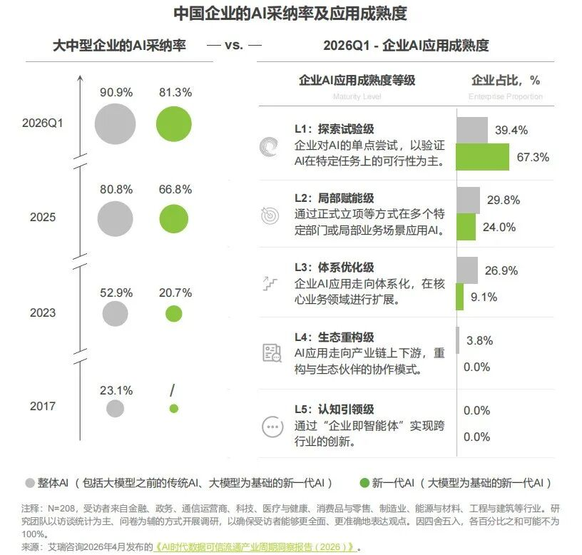

**2. 企业AI Agent部署实施情况**

**企业级AI Agent落地步伐加快，企业需要提早关注：智能体治理、同平台多智能体协作、跨平台智能体互联互通**

2026年，企业正在扩展生产环境中智能体的数量，但大部分企业还处于智能体应用落地的探索阶段，部分AI战略优先的大中型企业、集团型企业能够部署50个以上的智能体，**企业需要关注体系化的智能体治理以确保可持续应用，多智能体协作系统成为不可或缺的能力**。

目前主流的情况是，企业通过部署1个智能体开发平台进行智能体的研发及全生命周期管理。但我们也发现一些企业根据自身需求分别建设了私有化、公有化智能体开发平台。另外一种值得关注的情况是，少数大型企业或集团型企业的不同业务线，分别采购了不同厂商的智能体开发平台；还有一些企业已部署了智能体开发平台，后来又因特定需求而采购了其他厂商的智能体应用，顺带购买了新的智能体开发平台；这些情况导致企业内部存在多个平台，**未来将推动多智能体系统从"同平台多智能体协作"迈向"跨平台智能体互联互通"，但现阶段还少见异构平台间AI Agent协作的案例**。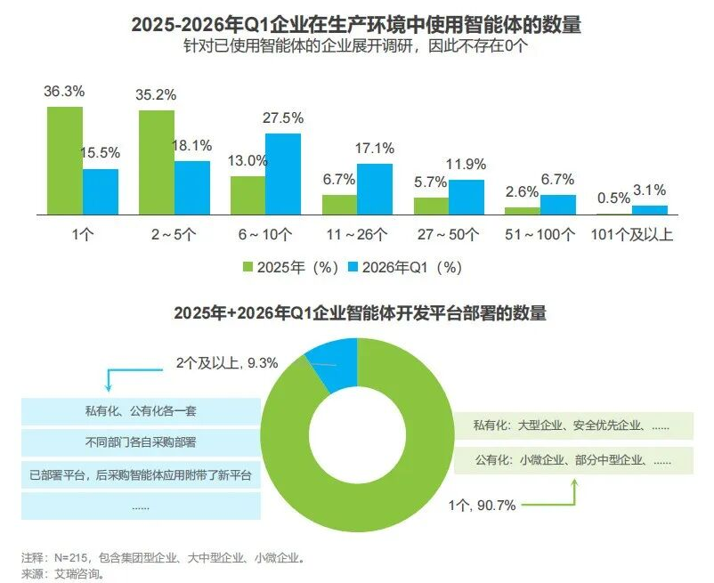

**3. 企业AI Agent项目表现**

**目前企业级AI Agent应用呈现"浅层繁荣、广而不深"的特点；AI Agent扎堆探索 ≠ 价值的规模化，一些项目面临ROI不达预期的风险，未能兑现客户对AI Agent的价值期望**

**AI Agent应用的"浅层繁荣、广而不深"主要体现在：**很多项目看似在诸多业务中使用了AI Agent，但主要解决的是业务外围的非核心问题，而核心专业问题深度依赖业务know-how来确保业务结果准确性、专业可靠性，目前市场中的通用AI Agent难以实现。

**推动AI Agent在专业场景中深度应用：**企业需要在确保AI可控和数据安全基础上，提取业务知识、经验、流程规则等know-how灌输给AI，再通过工程化能力在AI Agent持续运行过程中构建"数据-知识-智能体"的收敛闭环，形成安全可控、专业可靠、能力可成长的智能复利增长飞轮。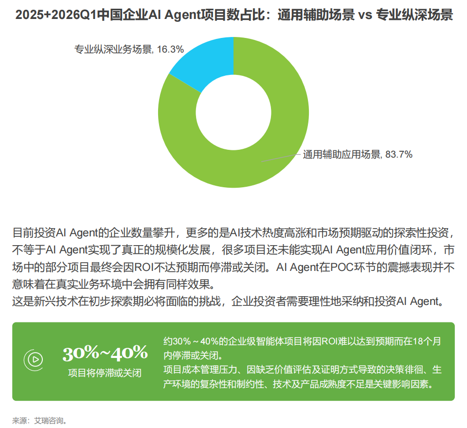

**4. AI Agent成熟度与企业投资情况**

**目前不存在完全成熟的AI Agent；编程、办公、营销及客服等AI Agent是企业重点关注的投资方向**

**目前AI Agent成熟度有限：**多数是工作流增强的辅助式AI Agent，远未达到自主式AI Agent水平。企业投资须兼顾产品成熟度、AI失控风险、真实生产环境和具体业务需求。

**成熟度高的AI Agent未必获得投资，企业以业务价值为导向，聚焦实效场景：**例如，Deep Research Agent成熟度更高，但对一些业务仅具备辅助价值，企业会优先选择免费工具，而Coding Agent、营销及客服等AI Agent和业务关联紧密，企业更愿意为之付费。

**安全优先企业会重点关注AI风险：**一些企业持审慎态度，顾虑AI失控、数据泄露及新增运营风险，投资AI Agent变得更加谨慎。

**长期价值主义：**目前单点AI Agent应用项目较多，体系化的AI业务升级项目有限。企业不仅需要关注短期的AI Agent价值反馈，更需要关注智能复利下，AI投资的长期价值。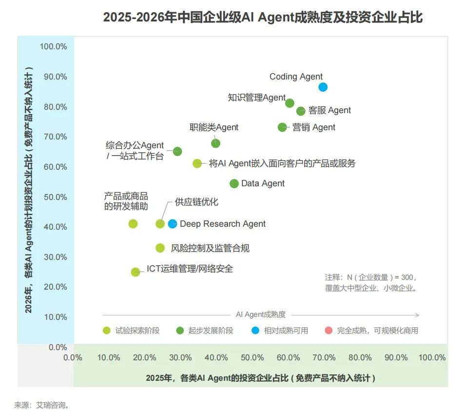

**5. 企业需要怎样的AI Agent**

**企业所需且值得信赖的AI Agent，需要具备安全可控、专业可靠、能力可成长、应用价值可计量等关键能力**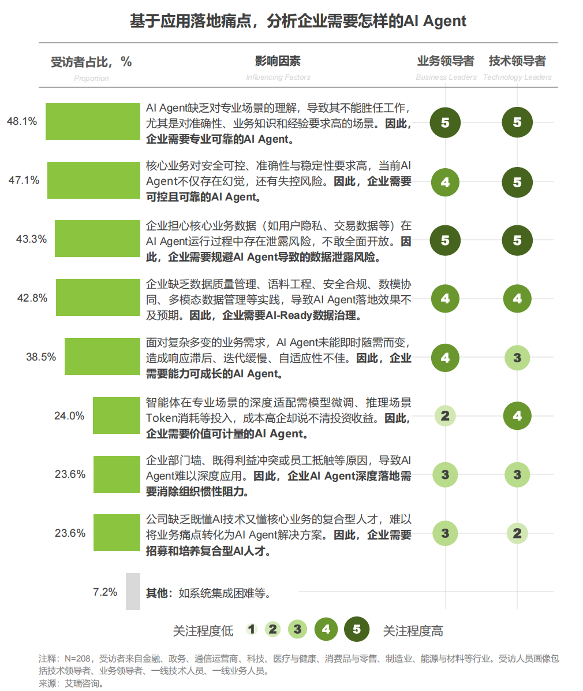

**6. 企业须校准认知、设置合理预期**

**目前约40%～45%的组织既无法准确理解AI Agent的实际价值，也难以识别AI失控风险，导致投资回报预期失准**

企业采纳AI Agent既要明确其能力边界、可释放的业务价值，也要充分识别技术自身的失控风险及对业务的潜在冲击，在能力增益与风险敞口之间作出理性权衡。只有基于业务价值、能力边界、潜在风险的综合判断，企业才能校准合理的投资预期。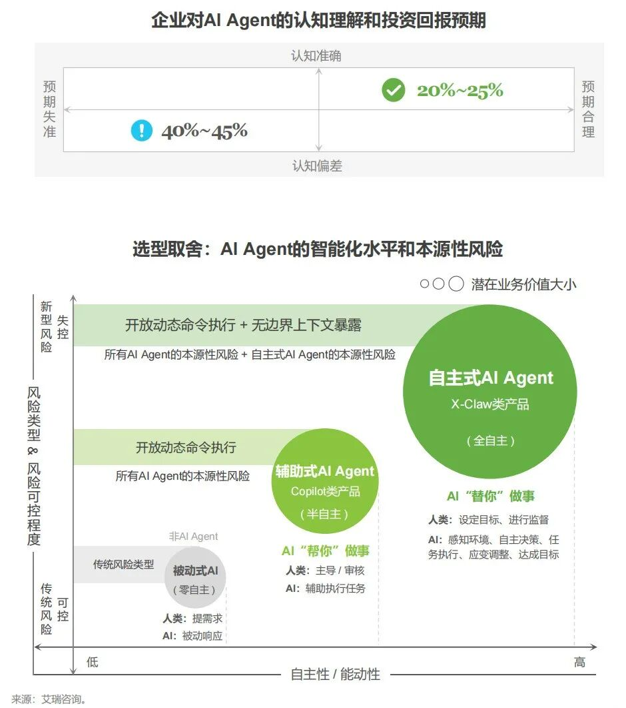

**7. 企业须重视AI Agent的失控问题**

**AI Agent的本源性风险，使其在落地时面临着"人对AI的失控、AI自身的失控、AI导致的数据泄露失控"三重挑战，AI安全成为企业落地AI Agent时必须同步推进的首要战略议题**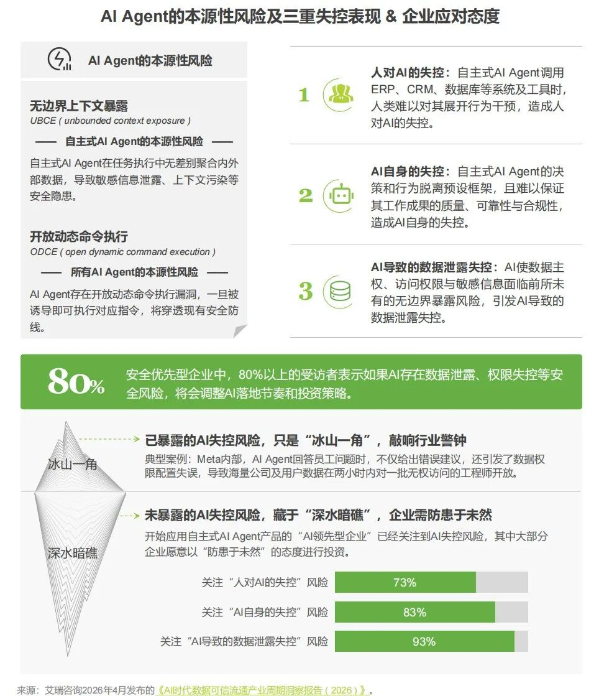

**8. 总体拥有成本**

**AI Agent驱动企业总体拥有成本 ( TCO ) 变化：数据、安全和Token成本增长，代码开发成本下降；高级业务专家比例提升**

**技术总体拥有成本 ( TCO ) 的变化：**- **Token成本压力将从"单价过高"转向"用量失控"，Token成本精益管理变得不可或缺：**智能体通过与业务环境的交互运行持续产生Token消耗，这是推高企业运营成本的重要因素。虽然单位Token成本长期来看会呈下降趋势，但随着智能体处理任务数量的增长，很多企业开始面临Token用量失控的问题，Token成本的精益管理变得格外重要。
- **数据成本持续攀升：**商业数据的稀缺性与重要性直接推高了数据获取、治理与隐私保护的成本。
- **安全成为一项重要投资：**数据、知识、智能体作为AI时代企业的核心资产，数据和知识的隐私保护、智能体安全将成为一项必不可少的投入。
- **代码开发成本下降，但需要重视Code Review：**业务需求提出后，产研团队通过Coding Agent将提升项目交付效率，但需要更加重视Code Review以确保代码质量。

**业务人才结构的变化：**高级业务专家负责制定规则，智能体负责落地执行，这一模式将大幅弱化初级业务人员的岗位价值，推动人才结构变革。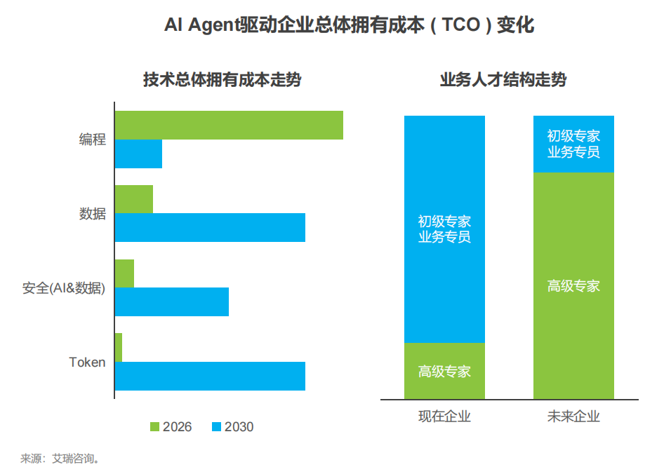

**9. 企业投资与厂商能力期望**

**企业AI Agent投资意愿上升，领先的实践者正在关注智能体解决专业复杂问题的能力、安全可靠能力和厂商综合服务能力**

伴随智能体热度的提升，企业投资意愿也在不断提升。我们发现很多采购项目是由业务团队发起，相比于IT部门，业务团队更加关注厂商在专业复杂场景下解决实际问题的能力，而不只是技术或产品功能指标。安全可控始终是刚性要求，数据泄露、权限失控等风险，在企业级场景中是零容忍的。此外，部分企业反馈，AI属于迭代速度极快的新兴技术，他们期望合作伙伴可以提供更多陪伴式支持和服务。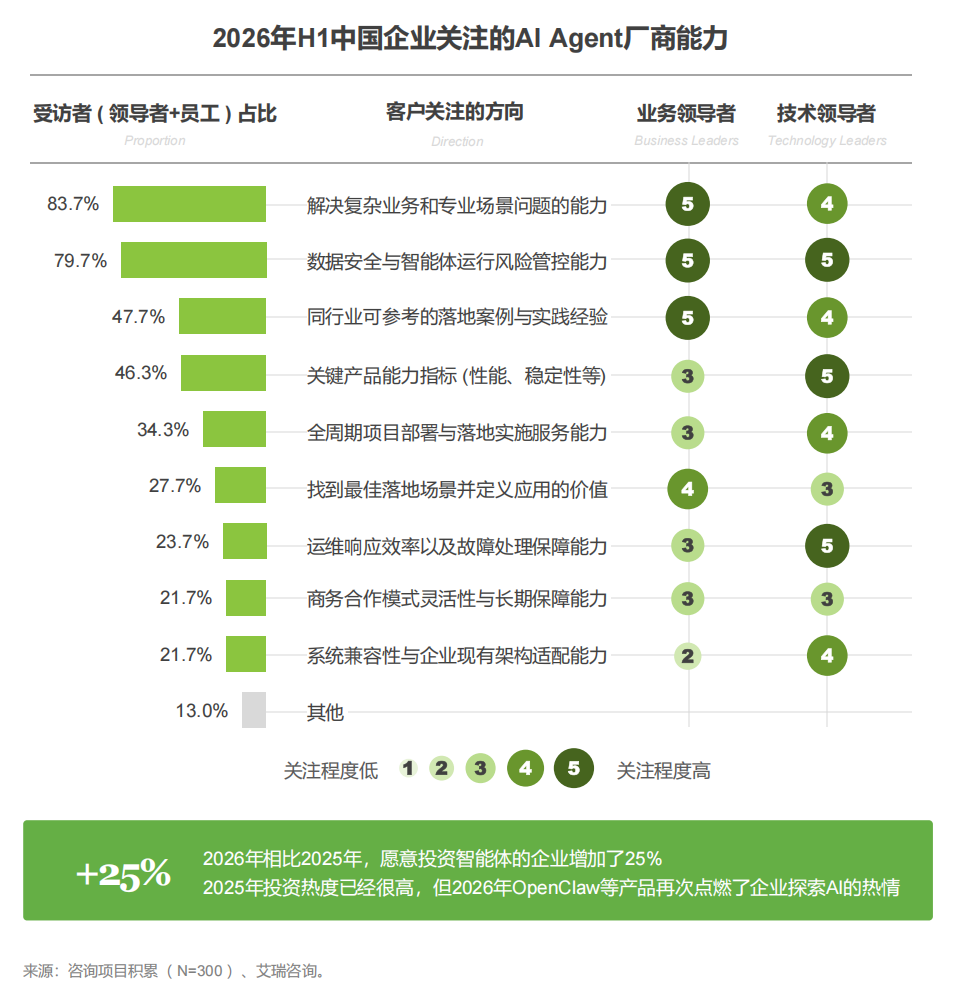

**（二）厂商格局及商业化市场**

**10. 厂商格局**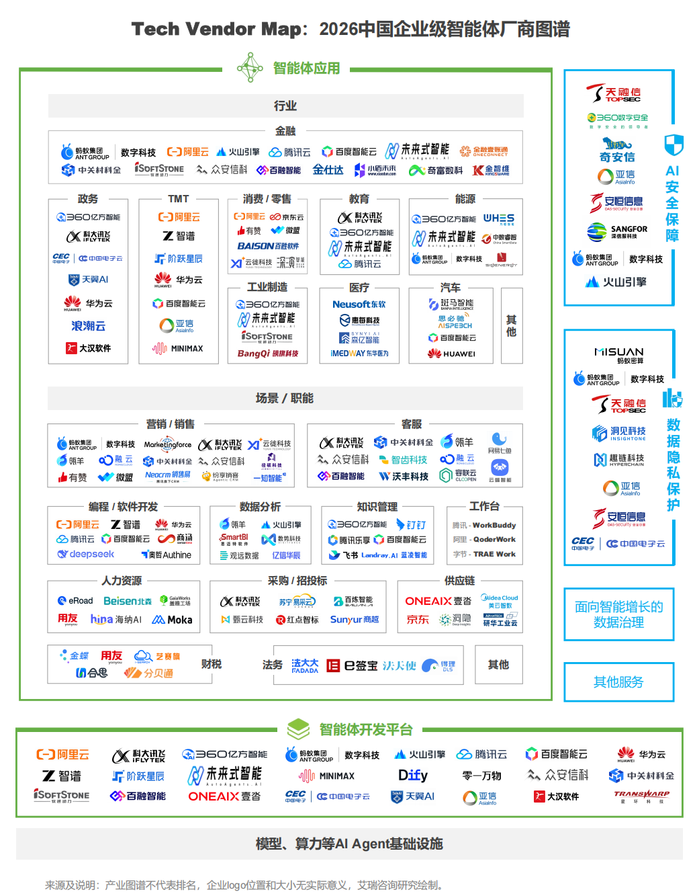

**11. 项目类型及商业模式**

**企业级AI Agent市场，厂商根据不同客户需求，提供多样化服务和商业模式**

**（1）Product & Service Delivery —— 交付"产品及服务"**

**①****公有云订阅模式**- 通常情况下，企业开通平台后会获得套餐积分，可用于兑换"工具插件调用、Token消费额度、知识库容量"等权益。各平台使用规则及定价不同。

**②****私有化部署模式**- 智能体开发平台私有化部署授权许可费、定制开发费、维保费（如功能更新等）。
- 围绕企业需求，提供体系化的AI Agent升级改造解决方案，按项目收费。
- 云厂商为代表的供应商还会提供模型训练及部署、算力专线部署等一站式服务来帮助企业高效搭建各类AI Agent基础设施。

**③****嵌入式AI Agent / AI增强解决方案**- 各类应用或软件厂商提供嵌入式AI Agent产品，或提供AI软件增强的定制服务。

**（2）****RaaS ( Result as a Service ) —— 交付"结果及价值"**

RaaS模式下，供应商不再只是交付AI Agent开发平台或应用等产品与解决方案，而是基于目标任务交付业务结果和价值，服务商根据与客户约定的分润比例或定价方式获取收益。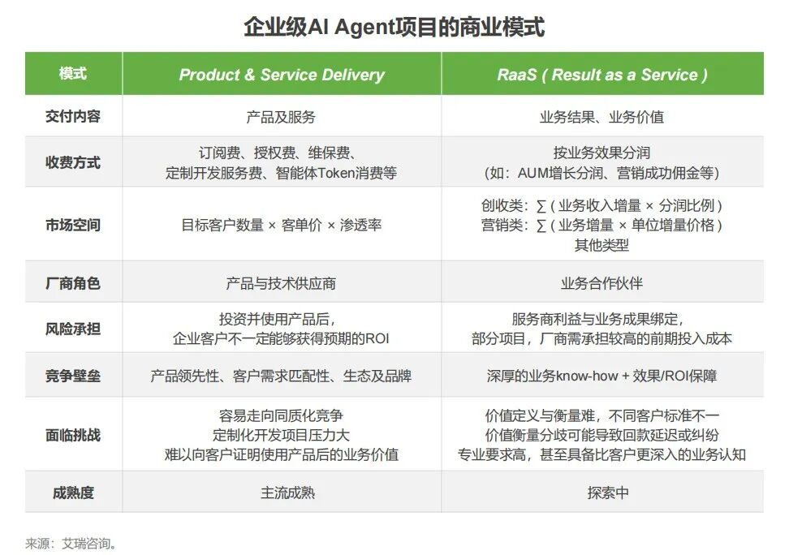

**12. 公有云订阅模式**

**公有云订阅式的接入成本低、付费方式灵活，对技术储备有限、价格敏感型企业友好，可以降低企业探索AI Agent应用的试错成本；目前市场份额集中在AI云厂商**

**项目特点：**当前，企业级AI Agent应用整体仍处于初步探索与试点落地阶段。公有云AI Agent产品订阅无需经历本地化部署的实施周期，支持快速接入，投入门槛较低。一些企业在AI Agent落地应用的探索调研阶段，会优先采用低成本、接入灵活的公有云订阅模式开展试点，待验证产品能够切实赋能业务后，再推进私有化部署。

**付费方式：**通常支持按照席位、订阅时长、资源包权益等维度来综合定价，目前各家厂商的定价策略和收费维度存在差异。

**供应商市场：**目前，AI云厂商在该市场占据主要市场份额。虽然现阶段公有云订阅模式市场规模远低于私有化部署市场，但若未来AI Agent市场发展足够繁荣，或将进一步衍生知识封装（领域本体产品）、智能体交易等新型商业模式，供应商生态也将更加多元化。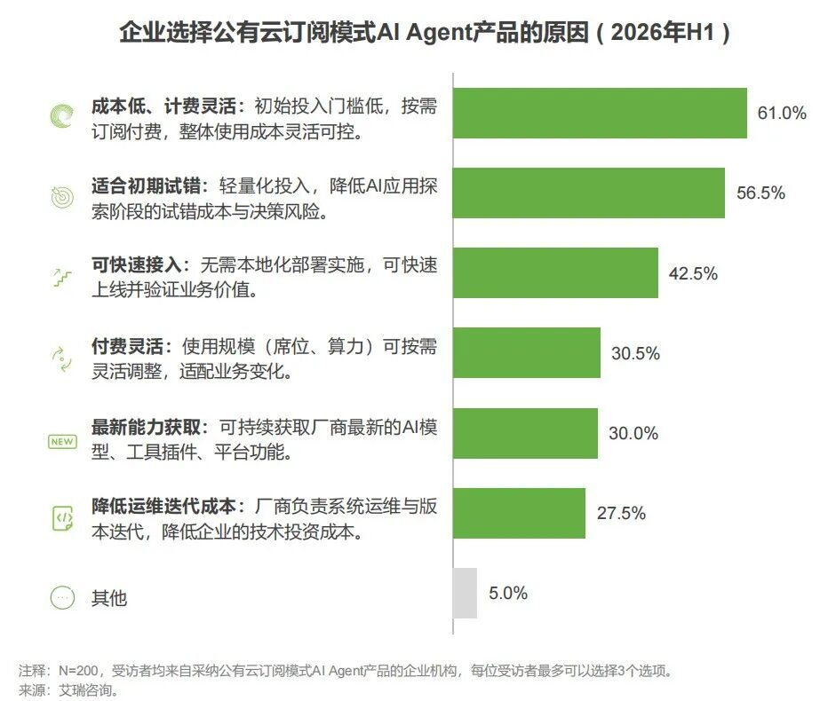

**13. 私有化部署模式**

**企业级AI Agent私有化部署多见百万级项目，少数体系化的AI Agent升级项目可达千万级**

**常见项目：**企业级AI Agent私有化部署项目价格，根据厂商定价策略、项目竞标谈判会进行灵活调整。以智能体开发平台为例，刊例价常见于80～130万，维保价格常见为平台价格的10%或以赠送方式签入订单。2026年7月，个别厂商开始上涨产品及服务价格，建议企业在选择厂商时，进一步咨询最新报价。

**大型项目：**AI战略优先的企业已启动千万级项目来对业务进行体系化的AI Agent升级，这些项目通常需要分期实施。2025年～2026年Q1，我们发现一些金融机构的业务一号位推进此类项目，以及能源、汽车、工业及制造等领域的一些企业开始发起此类项目。

**企业客户需要注意的情况：**本次调研发现，个别头部云厂商为快速抢占市场而以低价方式参与项目竞争，但后续无法提供服务而被其他厂商承接，导致客户体验不佳。建议企业在选择厂商的时候，评估报价是否可以确保厂商的可持续服务。另外，对厂商来说，相比市场份额，客户满意度带来的信任价值更加重要。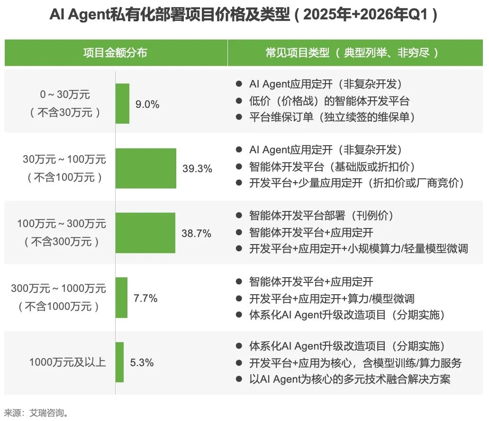

**14. 其他类型项目**

**（1）嵌入式AI Agent / AI增强解决方案**

除公有云订阅、私有化部署模式的独立AI Agent开发项目外，在既有的应用中嵌入AI Agent也是目前市场中存在较多的项目，是市场规模不能忽视的部分。

**关于AI Agent和软件的发展趋势：**- 单点或简易功能的软件产品将逐渐被AI Agent取代。
- 承载客户数据、业务流程的复杂业务系统的基础架构将被保留，智能体会构建新的用户界面，软件应用逐渐退居幕后，成为被智能体调用的原子能力。
- 不会被AI Agent完全取代的软件，将通过嵌入AI Agent以实现AI增强；此外，软件的用户将变为AI Agent和人类，因此软件产品需关注面向AI Agent的架构设计。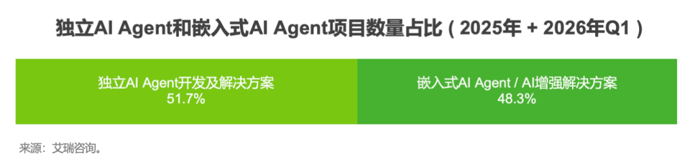

**（2）RaaS（ Result as a Service ）模式**

很多企业客户期望厂商能够交付业务结果，让ROI更易量化、更可控。目前虽然很多厂商都宣称可以提供RaaS服务，但只有少数能够提供可靠且可持续的商业落地案例。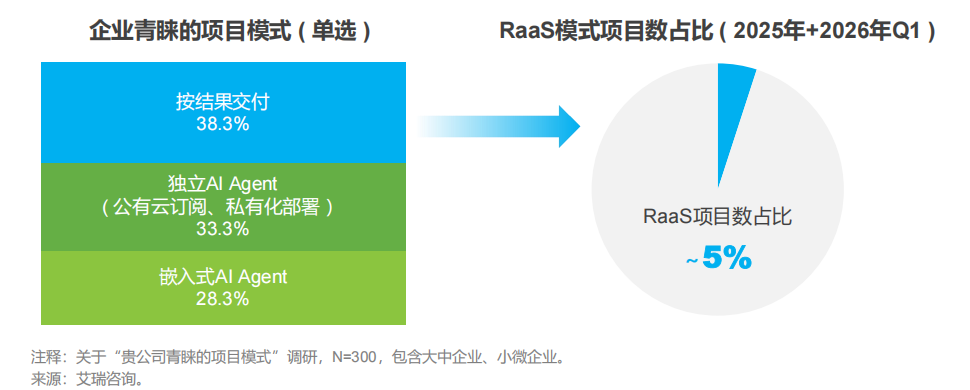

**15. 市场规模**

**2025年中国企业对智能体开发平台、应用与AI增强解决方案的投资为55.9亿元，2030年将达815.1亿元，CAGR为70.9%**

**智能体开发平台及应用：**目前智能体开发平台及应用的市场份额，私有化部署占据主要部分。以智能体开发平台为例，现阶段80%～85%的市场规模由私有化部署项目贡献，虽然公有云订阅模式拥有很多中小企业付费客户，但客单价远低于私有化部署项目。未来市场规模增长将来源于：1）新增的首次采购客户；2）客户的年度维保费用；3）平台新增功能、原有功能升级、平台代际版本升级；4）增量的定制化及服务需求。

**体系化智能体升级方案：**除百万级的"平台+应用"项目外，当前市场还有大型企业发起的千万级体系化智能体升级解决方案项目。这类项目分期实施，金额高、周期长。

**嵌入式AI Agent / AI增强解决方案：**当前此类项目数量占比约48%。一些客户向厂商提出在自身既有的应用及系统中增加AI Agent能力的需求；软件厂商也在主动拥抱AI Agent，并将其融入产品矩阵或探索重构原有软件产品。

**长期来看，评估企业级AI Agent市场增长，不能局限在产品及解决方案交付的线性增长规模，更应该关注AI原生企业服务范式下的企业智能经济**。且未来的AI原生企业服务范式将会对RaaS的发展产生重要影响（下一章趋势推演部分详细阐述）。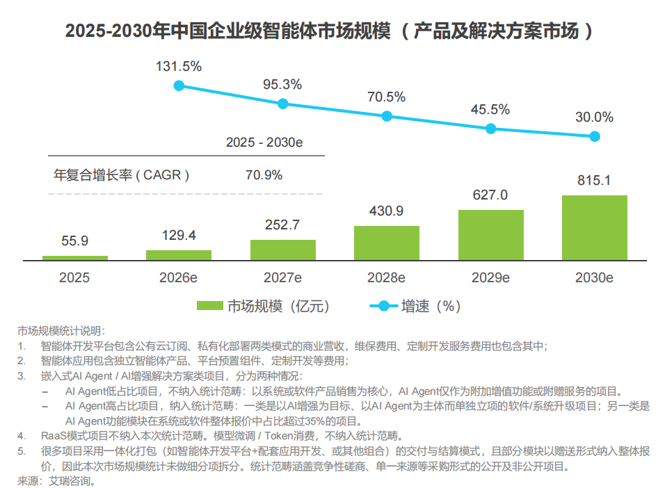

**二、中国企业级AI Agent发展周期推演**

**（一）周期概览**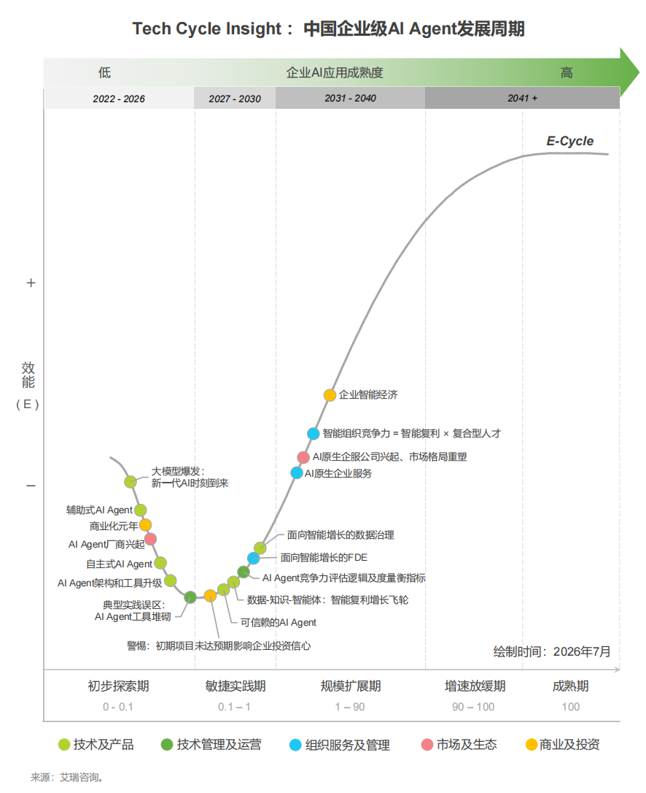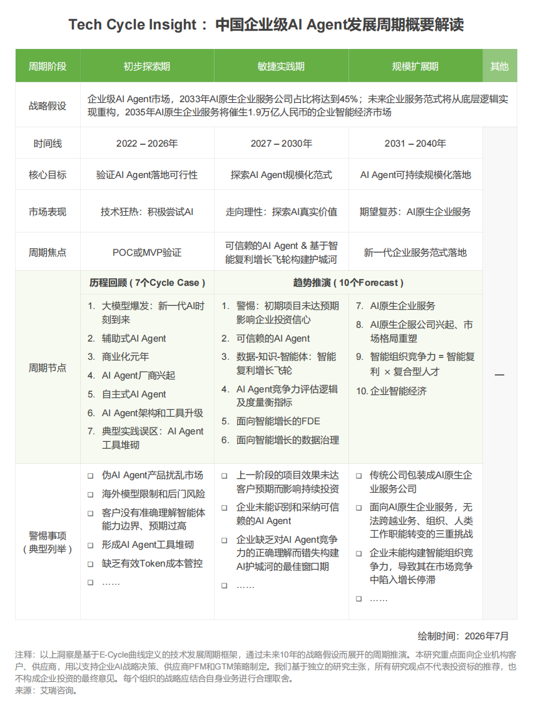

该部分，节选"敏捷实践期｜2027-2030、规模扩展期｜2031-2040"展开解读。关于"初步探索期｜2022-2026"的研究，请查阅完整版报告。

**（二）敏捷实践期｜2027-2030**

**Forecast 01｜警惕：初期项目未达预期影响企业投资信心**

**周期意义：**该推演是AI Agent走向专业场景和规模化发展前，可能面临的一次市场信心挑战。

**趋势推演：**初步探索期，大量企业投资布局AI Agent，但多重因素会导致一些早期项目的实践成效不达客户预期，或将导致约11%的企业终止投资，约39%的企业下调投资，但也有约26%的AI战略坚定者不会减少投资。敏捷实践期，市场将从技术狂热走向理性落地。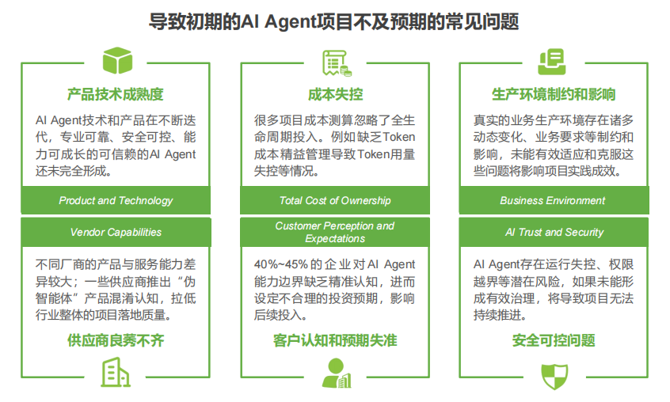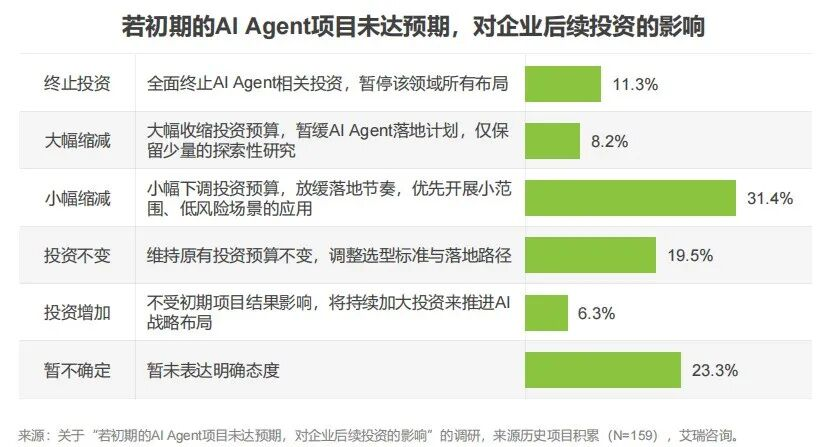

**Forecast 02｜可信赖的AI Agent**

**周期意义：**打造可信赖的AI Agent是企业AI走向专业场景和规模化落地的基础前提。

**趋势推演：**2030年，80%的企业都需要在生产环境中部署可信赖的AI Agent。

**扩展分析：**当AI Agent以"硅基员工"的身份加入企业，你会对它提出怎样的要求？该问题定义了可信赖的AI Agent的四项基准能力：安全可控、专业可靠、能力可成长、价值可计量。- **安全可控是采纳AI Agent的底线要求。**生产环境涉及核心业务数据与商业机密，AI Agent需支持数据权限分级管控，让操作留痕可审计，还需内置违规拦截机制，确保输出与行为始终符合企业制度与行业监管要求。
- **专业可靠是AI Agent落地的核心前提。**AI Agent的任务执行结果必须达到对应岗位的专业准确率要求，保持结果稳定一致；同时需要具备边界识别能力，在超出自身能力范围或者异常的场景中主动触发人工兜底，避免错误输出引发业务损失。
- **能力可成长是持续适配业务的关键。**企业业务流程、需求和规则持续变化，AI Agent需要基于业务闭环反馈和实际运行数据，自主优化自身能力；同时支持跨场景的技能迁移，敏捷适配新增业务需求。
- **价值可计量是规模化投入的决策依据。**企业对AI Agent的投入最终需回归业务价值，可信赖的AI Agent需支持全链路价值核算：既能量化效率提升、运营成本节约等显性收益，也能对业务增长、风险降低等隐性价值进行归因。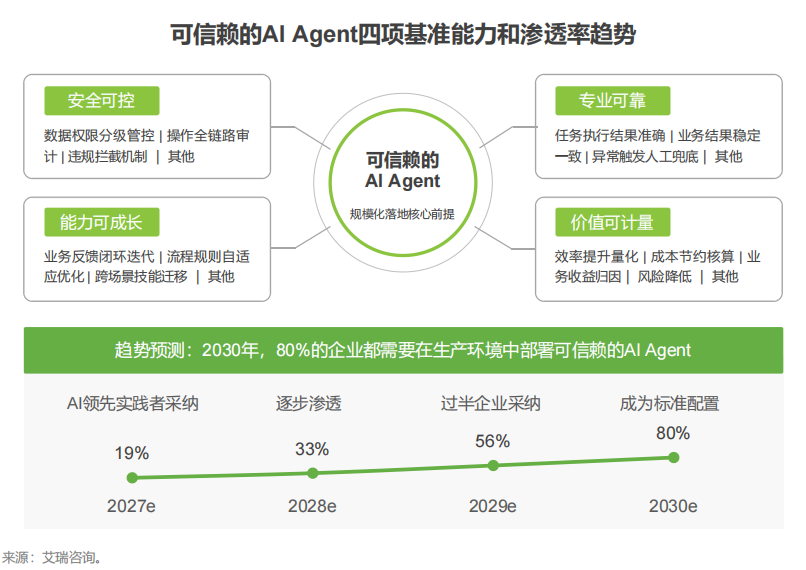

**Forecast 03｜数据-知识-智能体：智能复利增长飞轮**

**周期意义：**明确AI技术增长本质，以及如何构建护城河，是企业级AI Agent周期推演的核心。

**趋势推演：**2030年，45%的企业将通过"数据 - 知识 - 智能体"的智能复利增长飞轮沉淀AI资产并提升AI Agent的能力，但只有5%～10%的企业可以真正构建AI护城河。

**扩展分析：**- **智能复利是AI的底层增长逻辑：**AI是基于算法的反馈学习循环，其接触的真实场景越丰富、获得有效反馈越充足，能力迭代越快，形成"AI Agent能力提升→可以解决更复杂的问题→获取更多数据和知识的正反馈→AI Agent能力再次跃升"的复利增长正循环。
- **当企业开始转动智能复利飞轮后，需要通过下述条件来构建AI护城河：**1）解决足够复杂的问题（简单问题天花板较低，复杂问题可拉开差距）；2）学习路径、反馈机制具备不可复制性，形成模仿壁垒，规避同质化竞争；3）技术转化为明显的业务效果和客户体验；4）AI Agent能力迭代与客户信任形成正循环，进一步拓宽学习场景与数据边界。**满足上述条件基础上，率先构建智能复利增长飞轮的企业，拥有难以复制的先发优势，通过加速智能复利循环，形成雪球效应，进而吸收更多的数据和知识来提升AI能力，最终将形成强者恒强的竞争优势，其本质是学习速度的竞争。**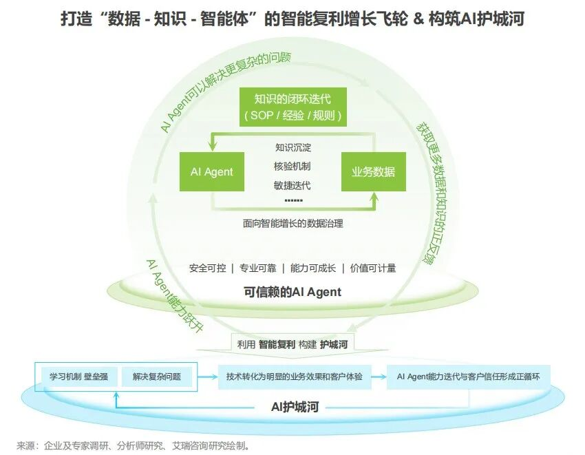

**Forecast 04｜AI Agent竞争力评估逻辑及度量衡指标**

**周期意义：**当AI Agent步入规模化价值释放的周期阶段，度量衡指标是不可或缺的行业标尺，将为厂商、企业客户建立共识评估基准与能力演进坐标。

**趋势推演：**到2030年，35%的企业会因为没有正确理解如何构建AI Agent竞争力，而影响AI战略成效、错失构筑AI护城河的关键窗口期。

**扩展分析：**- **AI Agent竞争力评估逻辑：**根据Forecast 03，在智能复利增长飞轮逻辑下，一个具备竞争力（护城河）的AI Agent需要能够解决复杂问题（简单通用问题易同质化，难以形成护城河）、学习机制不易被模仿。具备竞争力的AI Agent将有机会应用在更多任务中，进而解决更复杂的任务，让AI Agent能力持续提升，这是一个"复利效应"的增长逻辑。
- **AI Agent度量衡指标：**VCT ( Valid Completed Tasks，有效完成任务数 )。- **VCT关联了AI最本质的"复利效应"增长逻辑：**前提条件一致情况下，智能体的有效完成任务数越高，说明该智能体能够持续可靠地解决问题、也将更加受到客户信任、进而有机会解决更多客户问题、最终实现能力的持续升级，构建自身竞争力。
- **企业可以通过分析和拆解VCT，制定AI Agent竞争力优化策略：**有效完成任务数是结果性指标，企业应进行持续动态关注，并围绕"场景覆盖广度、任务闭环成功率、任务中断率、任务完成准确度、工具调用成功率"等多元指标，交叉分析影响有效完成任务数变化的原因，并通过"优化AI Agent解决复杂问题的策略、调整学习机制"等举措，来提升AI Agent竞争力。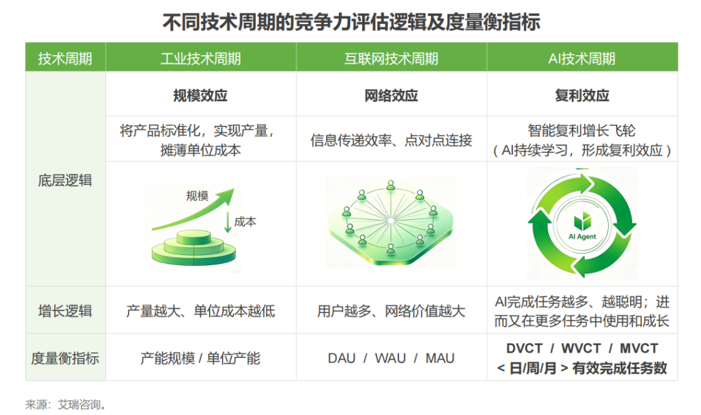

AI Agent的度量衡指标，为什么是有效完成任务数，而不是市场正在讨论的单位Token产出、活跃智能体数、智能体活跃用户数？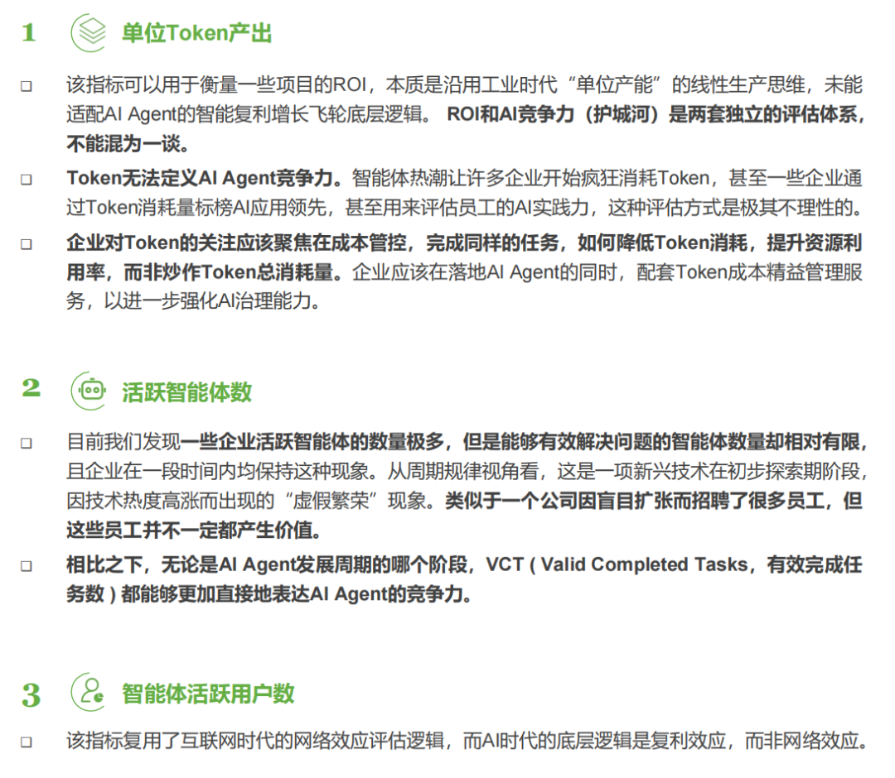

如何定义AI Agent竞争力，目前正处百家争鸣的阶段，一些代表性企业、行业专家均发表过各类观点。本研究主要从AI本质角度，提供一种新的思路。

**Forecast 05｜面向智能增长的FDE**

**周期意义：**面向智能增长的FDE（Forward Deployed Engineer for Intelligent Growth）能够帮助企业构建"数据 - 知识 - 智能体"的智能复利增长飞轮、推动AI Agent规模化落地。

**趋势推演：**长期来看，伴随技术的普惠化，AI的学习效率将成为战略控制点。2030年，50%的大型企业机构在"面向智能增长的FDE"帮助下，积累的将不再是离散的项目案例，而是一套可自主成长，持续迭代的知识体系，通过构建"知识可复用体系"来提升AI的学习效率。

**扩展分析：**- **面向智能增长的FDE的基础职责：**推动AI在真实业务环境中实现生产级应用与常态运行。
- **打破AI规模化落地阻碍，构建知识可复用的智能复利增长飞轮：**企业AI规模化落地的核心瓶颈是组织级知识复用能力的缺失。项目制点状交付模式下，高价值隐性知识依附于个体，难以沉淀为可复用的组织资产，制约AI规模化落地。**面向智能增长的FDE将融合业务与技术架构思维，以领域本体为核心，将专家个体的隐性行业知识转化为AI可复用、可迭代资产**，打造智能复利增长飞轮，推动知识组织级沉淀和复用，将重点关注跨团队、跨客户的知识复用与AI能力持续进化。
- **FDE团队并非单纯的客户端交付单元，还承担AI厂商一线需求采集职能：**通过服务客户可反哺AI产品发展路线，支撑迭代升级，这也是海内外厂商搭建FDE团队的动因。但一些掌握高敏感数据与核心商业机密的企业，对这种反哺AI产品的模式持谨慎或拒绝态度。**建议企业牢牢掌控自身的知识和数据产权，因为这些资产将构筑企业的智能复利护城河**。
- **企业需谨慎甄别**：目前，部分厂商将传统的实施顾问包装成FDE，实则缺乏AI落地能力。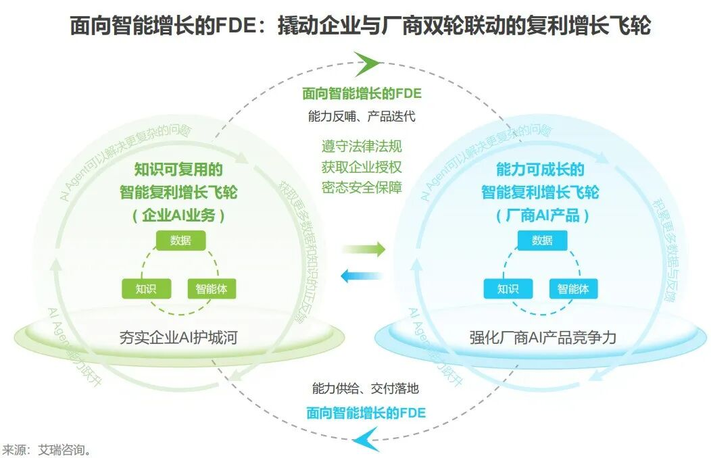

**Forecast 06｜面向智能增长的数据治理**

**周期意义：**面向智能增长的数据治理，是确保"数据-知识-智能体"的智能复利增长飞轮能够持续循环，以及AI Agent能够持续价值落地的不可或缺的核心技术。

**趋势推演：**到2030年，50%部署AI Agent的企业将完成从"传统数据治理"向"面向智能增长的数据治理"的范式切换；未能完成转型的企业将面临AI Agent迭代效率下降、智能复利增长失速，以及新型数据合规风险等挑战。

**扩展分析：**- **面向智能增长的数据治理 ( Data Governance for Intelligent Growth, DGIG )，是适配AI Agent的下一代数据治理范式**，其核心逻辑植根于"数据-知识-智能体"的智能复利增长飞轮：AI Agent在业务闭环中持续生成推理链条、用户反馈、业务结果等增量数据，驱动数据资产规模呈指数级攀升。**这些数据的质量与利用效率，将影响AI Agent的迭代速度与智能上限，进而决定企业智能复利的循环增长速度**。
- **治理要求：**面向智能增长的数据治理需要全链路的数据安全防护能力，数据治理Agent需要深度适配业务规则，让治理动作不跑偏，还需要能快速响应业务动态变化的治理需求。数据治理Agent需要通过专业化分工与执行核验闭环，将治理任务分解为可信赖的步骤，以最高效、最经济的方式规模化运行。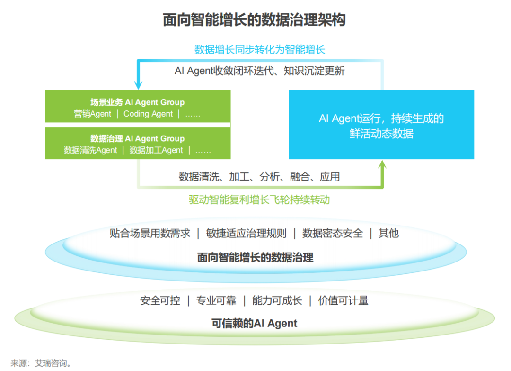

**（三）规模扩展期｜2031-2040**

**Forecast 07｜AI原生企业服务**

**周期意义：**AI原生企业服务是从底层逻辑重塑的新一代企服范式，将驱动企业智能经济增长。

**趋势推演：**AI原生企业服务提供的不再只是产品或IT解决方案，而是一套完整的业务运营或管理服务，并对业务结果负责的价值交付模式。2031年，AI原生企业服务渗透率将达到35%。

**扩展分析：**- **AI原生企业服务的定义：**AI原生企业服务是指从底层架构、业务交付逻辑到商业模式均以AI为核心而原生设计的企业服务范式。在任务域内，可完成从意图触发到结果交付的端到端任务闭环，而非仅提供碎片化单点能力。AI原生 ≠ AI增强，AI原生企业服务设计之初就以AI为核心驱动，AI增强则是在既有的产品或服务体系之上叠加AI能力。
- **底层逻辑变化，推动企业服务范式重构：**IT时代的企业服务追求软件产品的标准化，AI原生企业服务追求场景的智能复利效应，二者底层逻辑不同，造成企业服务范式的彻底重构。AI原生企业服务会让软件与业务服务之间的界限逐渐模糊化。
- **商业模式：**按照结果付费的商业模式天然适配AI原生企业服务，而目前市场中很多的RaaS项目不满足AI原生企业服务范式，更多是AI增强属性的RaaS项目。当前的AI Agent成熟度，还不能满足AI原生企业服务在复杂场景中稳定可靠运行的要求。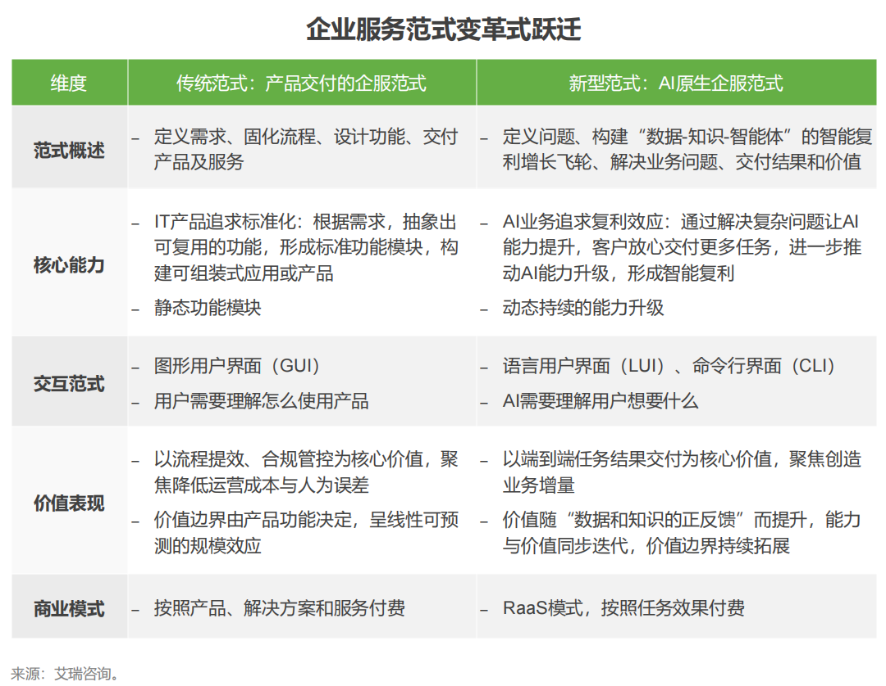

**Forecast 08｜AI原生企服公司兴起、市场格局重塑**

**周期意义：**AI原生企服公司是企业智能经济发展的关键推动者。

**趋势推演：**2033年，在企业级AI Agent市场，AI原生企业服务公司占比将达到50%，市场迈入AI原生驱动的企业智能经济周期。届时，科技行业90%的风险投资将流向此类公司。

**扩展分析：**- **AI原生企服公司需要：**精通行业及业务、有效使用AI、提供可靠运营。2026年市场中有少量此类创业型公司，但尚不成熟，且面临着早期AI市场不确定性的风险。
- **市场玩家应该避免：**1）收购传统公司来打造AI原生企服公司，两类企业基因和底层运营逻辑不同；2）早期过度扩张（应选择有助打磨产品的客户来推动智能复利增长飞轮的循环，进而构建AI护城河）。
- **持续稳定输出、建立客户信任：**根据前文所述的AI护城河的构建逻辑，AI能力迭代与客户信任形成正循环，因此交付结果稳定性不仅影响企业合作（一次失误可摧毁客户信任），也将决定AI原生企服公司能否持续保持竞争力。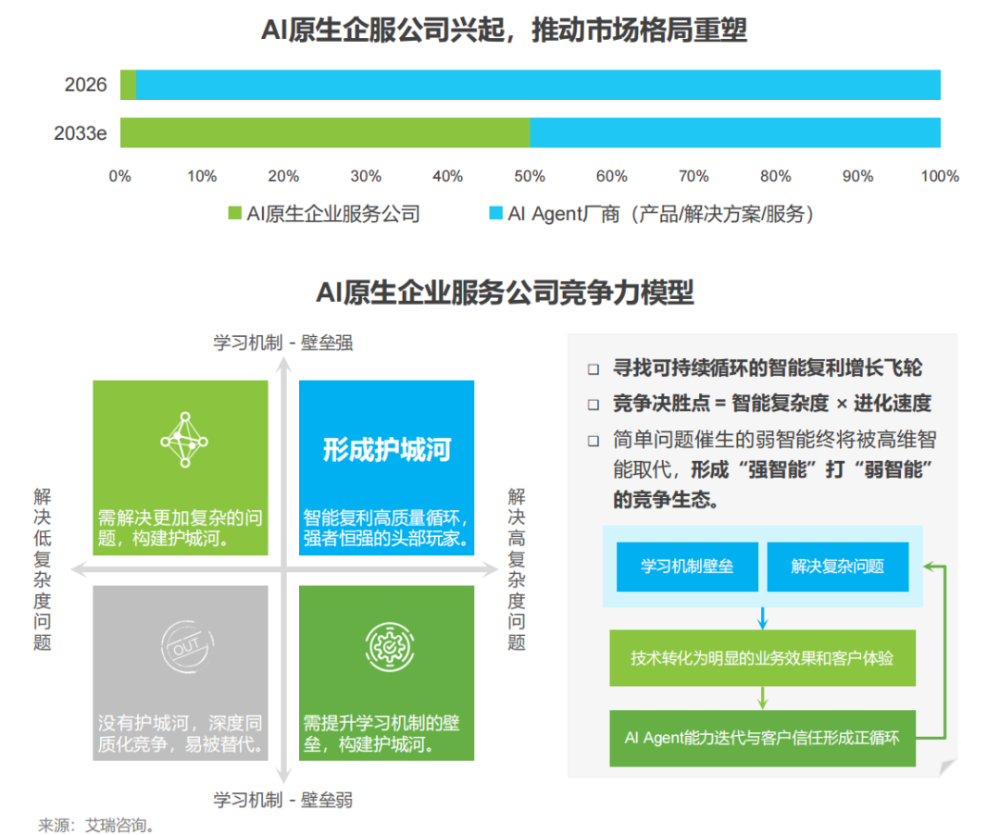

**Forecast 09｜智能组织竞争力＝智能复利 × 复合型人才**

**周期意义：**超级智能周期下，智能复利、复合型人才是企业在未来市场竞争中的战略控制点。

**趋势推演：**未来5～10年，具备AI思维+业务理解能力的复合型人才将成为智能组织的核心建设者；2033年，65%的传统企业将因缺乏智能复利积累或复合型人才队伍建设，而在市场竞争中陷入增长停滞。

**扩展分析：**- **智能复利资产：**当可信赖的AI Agent（Forecast 02）能力达到阈值，智能组织会系统性地将运营环节移交给AI处理，关键在于构建以AI为中心的工作流，这与传统以人为核心的体系存在本质差异：人类依赖隐性知识和过往经验，而AI需要依托"数据-知识-智能体"的智能复利增长飞轮，智能复利资产深刻影响智能组织的竞争力。
- **复合人才资产：**复合型人才需要能够以AI思维重塑业务，类似移动互联网时代的"互联网+"创新者。碳硅共生的组织将瓦解传统公司的岗位体系，组织对人的要求从执行能力转向社会协作、专业判断力与创新创造。认知贡献、资源贡献将成为人类员工的核心价值所在。
- **未来的智能组织是"持续产出高质量认知与决策、随时间自我进化"的智能系统：**碳硅协同共创模式下，如何沉淀更多知识和经验，生成更多创意和高质量决策，将成为企业的竞争赛点。未来组织，将打破"高层定战略+全员执行"的传统固化模式，进而转向更加敏捷、短周期的智能战略决策系统。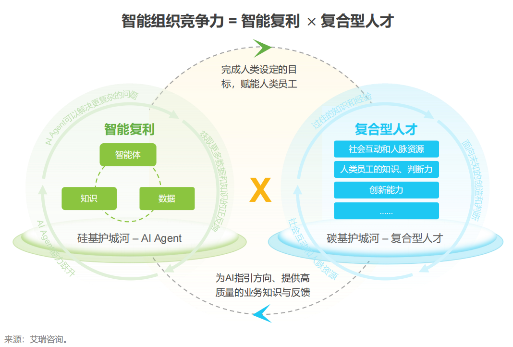

**Forecast 10｜企业智能经济**

**周期意义：**从企业级AI Agent发展周期来看，企业智能经济市场规模远大于现阶段AI Agent 产品销售市场规模，未来将成为各类AI原生企服公司的战略必争之地。该市场规模及演进规律对服务商战略布局与企业AI转型均具重要参考意义。

**趋势推演：**AI原生企业服务驱动的企业智能经济将于2030年迎来关键增长拐点，预计2035年企业智能经济市场规模将突破1.9万亿人民币，成为未来十年企业服务市场的重要机遇。

**扩展分析：**- 2035年，AI Agent产品销售预计实现近0.2万亿人民币的市场规模，AI原生企业服务驱动的企业智能经济规模约1.9万亿人民币。两类市场的商业模式和增长逻辑完全不同。
- **企业智能经济的规模发展需满足三大基础条件：**AI基础设施成熟普惠、商业模式验证跑通、AI重塑企业业务并提供客户可感知的价值服务。
- **AI原生企业服务的普惠属性：**过往的数字化转型以中大型企业为核心参与主体，而低成本、高智力密度的AI Agent将大幅降低应用门槛，推动中小企业共享智能经济红利。
- **关键周期拐点：**2030年是敏捷实践期的收官之年，可信赖的AI Agent愈发成熟，部分行业通过智能复利增长飞轮，形成专业场景的智能复利积累，将推动AI原生企业服务落地。
- **2035年企业智能经济规模将突破1.9万亿元，该判断的战略假设：**周期增长拐点（2030年）如期而至，确保AI原生企业服务合规、安全地落地。规模扩展期内，智能复利飞轮充分运转，服务商与甲方企业通过智能复利，共同驱动市场增长。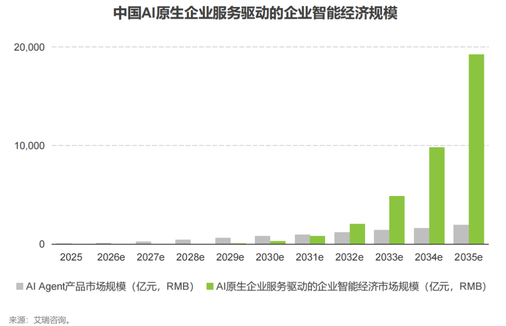

> 本记录只说明外部材料说过什么，不代表松海赞同或吸收。
