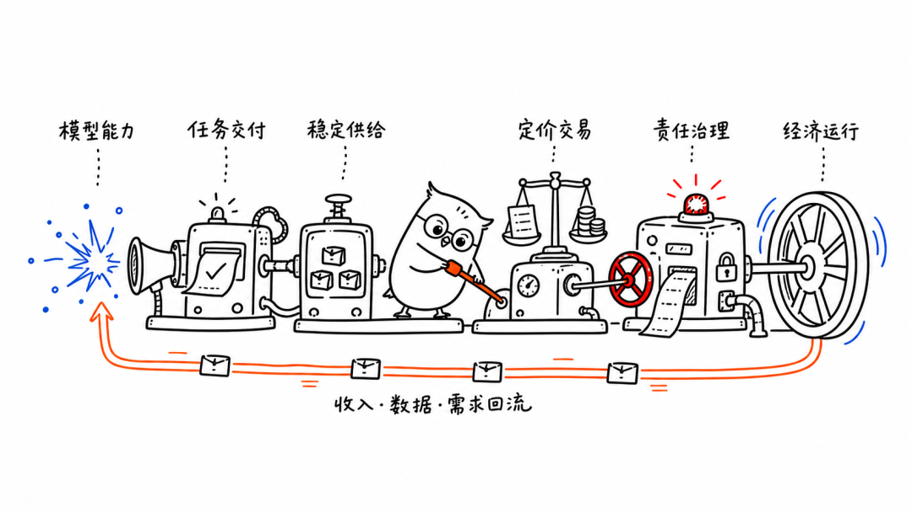

# "北京智能体新政"解读

> 作者：是故，无之以为用
> 发布日期：2026-07-23

今天北京市发改委的政策，我看了好几遍。

《北京市关于加快智能体引领发展的若干措施》。

第一遍看，它很像一份标准的人工智能产业政策。模型、算力、应用场景、人才、资金，熟悉的内容几乎都有。

但继续往下读，几个词让我停了下来。

驾驭层。OPC。Token经济。还有RaaS（结果即服务）。

这几个词居然同时出现在一份政策里。。。

它们原本像是来自不同领域。驾驭层偏工程，OPC讨论企业组织，Token经济和RaaS关心成本、交易和结果。文件后面还有身份、权限和分级监管，处理智能体做错事情以后，系统怎么停下来，责任又该落在哪里。

说真的，我当时就有点愣住了。

怎么说呢，我把这些词重新放在一起看了一遍，才慢慢意识到，它们可能不是几项并列措施。

北京想讨论的，也不只是怎样造出更强的智能体。它在试着回答一个更难的问题。

当智能体真的开始干活，我们准备怎么接住它？

理解这个问题，可以先从驾驭层说起。

过去几年，我们谈人工智能，最常看的还是模型能力。参数有多大，推理有多强，能不能写文章，能不能生成代码。

可是，模型会做一件事，和它能够把一件事真正做完，中间隔着很远。

你想想看，让模型写一封邮件，它交出一段不错的文字，任务看起来就结束了。但如果让智能体完成一次真实的报销，事情会突然变得复杂。

它要识别发票，理解公司的报销规则，判断费用科目，登录系统，填写字段，处理异常，提交审批，还要确认任务究竟有没有成功。任何一个环节中断，报销都没有完成。

真实任务要求的，是在目标明确、权限受控、状态持续保存的情况下，稳定地交出一个可以验收的结果，而且整个过程必须可控。中途出现问题，它还要知道应该重试、回退，还是停下来找人。

模型能力证明的是技术上的可能。

任务能力交付的是可以确认的结果。

驾驭层处理的，正是两者之间那段不够显眼，却决定智能体能否被托付的距离。上下文怎样管理，工具怎样调用，错误怎样恢复，执行过程怎样监控，都属于这一层。

它要把模型偶尔表现出来的聪明，组织成相对稳定的执行能力。这也解释了为什么政策没有只盯着更大的模型，还专门提出驾驭层工程、中间软件栈和开发框架。

不过，一个智能体成功完成一次报销，或者一家企业做出一个漂亮的演示，仍然不能称为产业。

产业要求一件事能够稳定、可控地执行。换一家企业还能不能用，用户多起来以后成本会不会失控，一套能力做出来以后能不能被封装、复用，再组合进新的产品。

所以，驾驭层之后，政策开始谈开发平台、互联协议、技能市场、原生应用和标杆场景。它们都在把一次做成，推向以后还能不断做成。

政策甚至提到了前沿部署工程师。因为智能体进入企业以后，真正难处理的往往不是标准流程，而是那些藏在员工经验和部门默契里的例外。

走到这里，模型能力才开始变成稳定、可复制的产业供给。

但产业供给出现以后，经济还没有自动运转起来。

接下来要回答的问题更现实。谁来组织这些能力，谁以市场主体的身份提供服务，客户购买的究竟是算力、智能体，还是最终结果，这些结果又该怎样计量和定价。

也正是在这里，OPC、Token经济、TaaS、AaaS和RaaS开始进入同一张图。

OPC讨论谁来生产，TaaS、AaaS和RaaS讨论卖什么，Token经济则试着为成本和价值找到一种可以被观察的尺度。

很多朋友可能不知道，OPC指的是一人公司。真正有意思的，不只是一个人出来创业，而是当一个人能够调度多个智能体以后，他能不能成为一个新的生产单元。

可技术能够放大个人能力，不代表这个生产单元已经能够稳定生存。它仍然需要算力、注册、合规、财税和知识产权服务，也需要客户、信用和融资。所以政策支持OPC的同时，也在建设公共服务平台和配套服务。

技术已经允许一个人做更多事，承载他的企业服务和制度安排却未必准备好了。

回到Token经济这块。

Token能够记录一次模型调用消耗了多少资源，但它不能直接告诉我们，这项工作创造了多少价值。一份耗费大量Token却无人使用的报告，成本可能很高，价值却很低。

从Token即服务，到智能体即服务，再到结果即服务，交易对象正在发生变化。最初，人们购买计算资源。随后，人们购买一项可以调用的智能能力。再往后，客户可能只关心事情有没有做成，而不关心背后用了多少模型和Token。

这一步很关键。当客户购买的是结果，计价就不能只围绕消耗展开。结果怎样定义，质量怎样验收，失败以后怎样退款，不同参与者之间怎样分配收益，都需要新的规则。

所以政策使用的是探索、培育和建立评价体系。它没有宣布Token已经成为成熟的价值尺度，也没有把RaaS写成现成的商业制度。更准确地说，智能体的成本与价值之间，还缺少一套能被市场共同使用的语言。

一旦智能体从生成内容走向执行行动，治理问题也会跟着出现。

大模型说错一句话，风险多数停留在内容层面。智能体如果可以访问数据库、提交订单和操作设备，风险就会从说错走向做错。

谁给它授权，它能访问什么，什么时候必须停下来等待人工确认，事故发生后怎样还原责任链条，这些都不再是附加问题。可信沙箱、安全平台和分级监管，也不是发展之后再补上的刹车，而是智能体进入真实经济活动的前提。

读到这里，我自己的感受是，整份政策的系统性才真正显现出来。

它在尝试完成一系列转换。

从模型会回答问题，到智能体能够交付任务。

从一次任务被完成，到能力可以稳定复制，成为产业供给。

从产业供给进入市场，到它能够被定价、交易，也能够在出问题时找到责任。

再让收入、数据和需求回到下一轮生产，推动能力继续进化。

我后来才想明白，真正打动我的，不是这份政策覆盖得有多广，而是它没有把模型能力直接当成生产力。它看见了中间那些麻烦、具体，却又绕不过去的环节。

怎样把智能组织成执行，把执行变成交付，把交付变成供给，再让供给进入市场，接受计价、交易和责任约束。

这才是我在这份政策里看到的系统性。

沿着这条线，所谓生产关系的变化也变得具体起来。智能体正在把一部分原本依附于人的认知能力，转化为可以被封装、复制、调用和组合的能力单元。能力的载体变了，围绕它形成的企业组织、交易方式和责任关系，也会被迫调整。

OPC在探索新的生产组织，技能市场在探索新的能力流通方式，Token即服务、智能体即服务和结果即服务在探索新的交换方式，Token评价体系尝试提供成本观察尺度，安全治理则开始处理新的行动权与责任关系。

沿着这条线看，北京已经率先踏出了这一步，开始把技术、组织、交易和治理放进同一个框架里探索。它的意义，可能不在于现在就给出一套成熟方案，而在于先搭起一个可以进入真实场景、接受市场检验、再不断试错和调整的框架。

下一阶段，一个地方的人工智能实力，可能不能只看它有多少模型、算力、人才和融资。

真正的竞争，也许不只是谁能造出更强的智能体，而是谁能更早建立一套适配新质生产力的环境，让它可以工作，可以交易，也可以被治理。

我把整份政策按照算力、模型、驾驭、平台、应用、市场、制度和生态进行了分析。

表中的「现状」归纳自政策明确表述，「问题」是我根据政策重点做的保守反推，并不是官方原文。具体内容以北京市人民政府门户网站发布的政策文件为准。

### 图片文字版：北京市智能体政策分析

通过算力、模型和驾驭层解决“智能体能不能工作”，通过平台和应用层解决“智能体能不能规模落地”，通过市场和制度层解决“智能体如何进入经济运行”，再通过生态层解决“这套体系能否自我繁荣并向外扩展”。

图中标注分为三类：**官方阶段**、**保守反推**、**政策应对**。

#### 01 算力层（第六条、第八条）

- **现状：** 智能体系统调用、复杂任务调度和高频决策，对算力提出低延迟、高吞吐、高频并发的新要求。政策同时关注推理芯片、推理架构、存量算力、公共算力与通信网络协同。
- **问题：** 算力供给形态、调度效率和成本结构仍需适配智能体运行方式；存量和小散算力需要聚合利用，中小企业及 OPC 需要更低成本、标准化、弹性的算力服务。
- **策略：** 研发通用处理器和专用推理芯片，以异构协同、存算协同、智能调度、缓存复用和任务路由降低成本；实施“银河算廊”，推进算网、算电协同和“零存整取”，探索 Token 工厂及三类服务券。

#### 02 模型层（第一条）

- **现状：** 基础模型正在向代理式人工智能、在线学习、持续学习、自主进化、世界模型和群体智能等方向发展，政策将“实际任务完成能力”作为重要目标。
- **问题：** 在线学习、持续学习、自主进化、超长程任务、复杂推理与规划、工具调用、长上下文、多智能体协同和记忆等能力仍需要技术突破。
- **策略：** 推动 Agentic AI 创新，支持模型新架构、新训练范式、原生融合智能体大模型、世界模型与群体智能；强化工具调用、长上下文、多智能体协同和记忆能力。

#### 03 驾驭层（第二条）

- **现状：** 政策将驾驭层工程正式列为智能体底层共性技术，关注点已经由单一模型能力延伸至模型之外的系统组织与运行能力。
- **问题：** 上下文工程、任务持久化、多智能体协作、系统可扩展、跨模型跨芯片适配，以及复杂任务链路和长程任务的执行稳定性，仍是规模运行需要补齐的共性能力。
- **策略：** 实施驾驭层工程，优化上下文工程、任务持久化、多智能体协作与系统扩展；开展跨模型跨芯片攻关，完善中间软件栈、关键算子和框架，并建设安全可控技术栈。

#### 04 平台层（第二条、第三条、第七条）

- **现状：** 智能体开发、部署和运行需要服务接口、能力编排、运行管理、技能资源、开发框架、软件商店和 AI OS 等平台型能力。
- **问题：** 跨模型、跨框架能力的互通复用，以及开发部署、运行管理、跨框架集成、场景接入和规模部署能力仍需提升；高价值组件需要标准化、平台化和共享化。
- **策略：** 构建自主协议、开发框架和工具链，推动关键组件开源；建设能力资源共享平台、技能市场、开发平台和软件商店，研发企业级、行业级 AI OS。

#### 05 应用层（第三条、第四条）

- **现状：** 政策支持对象已由一般应用扩展到原生 AI 软件、超级软件、科学智能助手、“智能科学家”、自主实验室、行业解决方案、标杆场景和智能终端。
- **问题：** 政策反复强调重构架构、重塑流程、应用验证和可复制推广，可以保守反推，当前应用仍需解决与真实业务深度融合、验证、复制和规模推广问题。
- **策略：** 推动软件智能化技改，开发原生 AI 软件和超级软件，建设科研助手与自主实验室；重构 EDA、质检和供应链流程，以真实需求、标杆场景、FDE 共创和芯模云端用协同促进落地。

#### 06 市场层（第五条、第六条、第八条）

- **现状：** 政策开始培育 OPC、TaaS、AaaS、RaaS，以及智能体技能市场、软件商店和服务券等新主体、新产品和新交易形式。
- **问题：** 围绕智能体形成的创业服务、供需匹配、能力交易、服务质量评价和计费方式仍需完善；Token 消耗量与服务价值之间需要更合理的转换和定价机制。
- **策略：** 建设 OPC 公共服务平台、运营团队、社区和服务站，支持 OPC 与头部企业合作；培育 TaaS、AaaS、RaaS，探索 Token 质量评估、计费规范和价值计费，并配套服务券、供需平台、技能市场与金融产品。

#### 07 制度层（第二条、第五条、第六条、第七条、第八条、第十条）

- **现状：** 政策已覆盖技术标准、身份标识、性能评测、计费规范、产业监测、企业登记、安全监管、产业立法、人才评价与财政金融支持等制度安排。
- **问题：** 智能体的技术接口、身份、性能、安全、计费、统计监测和监管方式仍需规范；新型创业主体与新兴职业能力需要和现有登记、人才评价及公共支持制度衔接。
- **策略：** 研制交互、接口、身份、性能评测和安全标准，推广 AIP 等标准；探索 Token 评价体系，建立分级分类监管并推动立法，配套 OPC 登记、人才评价与财政金融支持。

#### 08 生态层（第四条、第九条、第十条）

- **现状：** 北京提出建设自主产业生态、开源平台、技术社区和国际合作体系，通过上下游协同、开源贡献评价、项目孵化和出海服务扩大生态影响。
- **问题：** 开源项目的贡献评价、资金支持、合规应用和商业化机制需要完善；出海需要政策咨询、合规、知识产权和风险预警服务，产业上下游也需要加强协同。
- **策略：** 推动芯片、模型与终端企业协同，建设开源平台和社区，支持协议、框架、操作系统与硬件公版开源；建立贡献评价和资本支持，建设上合合作中心并实施“一国一策”。

> **阅读边界：** “现状”归纳自政策明确表述；“问题”仅为依据政策重点进行的保守反推。来源为北京市人民政府门户网站发布的政策文件。

> 本记录只说明外部材料说过什么，不代表松海赞同或吸收。
