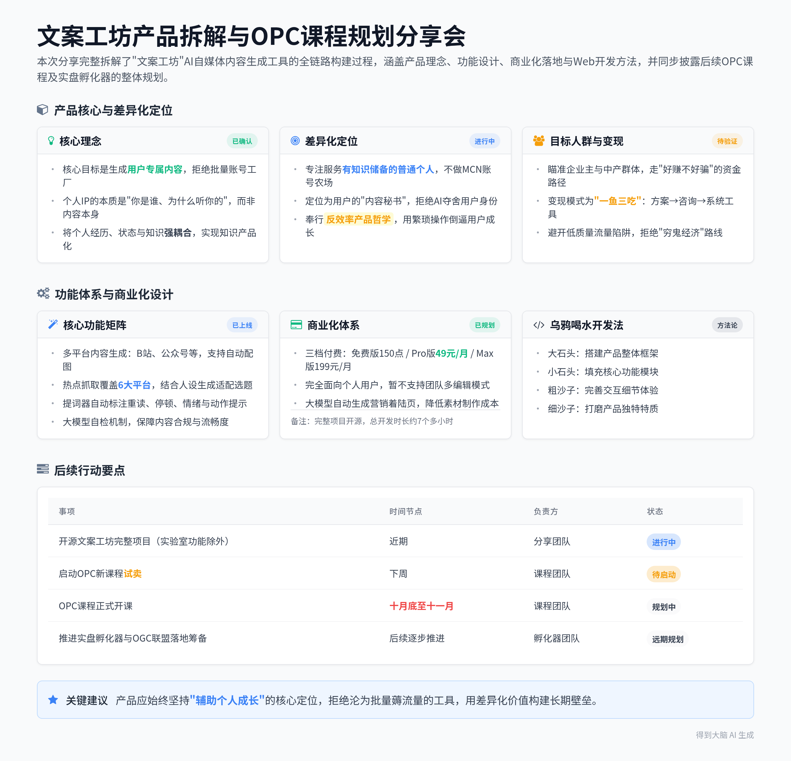

# AI文案工坊产品构建思路分享

> 发布日期：2026-09-16

> 录音时间：2026-09-16 20:02:13 ~ 22:11:27（约 2 小时 9 分钟）
> 笔记来源：得到大脑（Get笔记）录音笔记，约 2 人参与，产品分享 + 课程讲解
> 正文结构：前半为产品生成的 AI 智能笔记（智能总结／章节概要／金句精选／待办事项），后半为完整逐字稿（含说话人与时间戳）。

### 📑 智能总结

#### 录音信息
- **录音时间**：2026-09-16 20:02:13 ~ 2026-09-16 22:11:27
- **时长**：约 2 小时 9 分钟
- **参与人数**：约 2 人
- **内容类型**：产品分享 + 课程讲解

#### 录音总结
本次分享完整拆解了名为“文案工坊”的AI自媒体内容生成工具的全链路构建过程，从项目缘起、核心理念、功能设计到商业化落地逐一展开，还同步分享了Web开发的实用方法、后续OPC课程的规划以及实盘孵化器的构想。

**文案工坊产品基础介绍**
* **产品核心功能说明**：这款名为文案工坊的AI工具，支持生成B站、公众号等多平台内容，公众号内容可直接自动配图，还具备个性化设置、热点抓取分析、创意选题、AI辅助内容编辑、多平台适配、讲演稿提词器等功能。
* **产品构建六维度框架**：产品完整构建思路分为六个部分，分别是起源、利益、差异化、基础构建、亮点和完善，覆盖从项目启动到最终落地的全流程。

**文案工坊项目缘起说明**
* **课程随口承诺引发项目**：项目起源于一次课程上的随口提议，当时提出让学员做企业AI转型组织变革方向的账号，后续有60多位学员追着要对应的辅助工具，最终促成了这款产品的落地。
* **目标人群定位逻辑**：选择做企业AI转型组织变革方向的账号，核心是吸引企业主粉丝，这类粉丝对应的商业变现路径更清晰，可实现“一鱼三吃”，先后售卖方案、提供咨询服务、交付系统工具。
* **两类资金属性区分**：明确区分两类资金属性，穷鬼的钱属于好骗不好赚的类型，企业主和中产的钱属于好赚不好骗的类型，做账号优先瞄准后者，避免陷入低质量流量的变现困境。

**文案工坊核心理念阐述**
* **核心目标是生成专属内容**：产品核心并非通用内容生成，而是生成完全属于用户的专属内容，拒绝做批量账号工厂，要打造贴合用户个人特质的专属账号。
* **个人IP内容底层逻辑**：个人IP账号的核心从来不是内容本身，而是“你是谁、为什么要听你的”，需要将个人经历、个人状态和知识强耦合，实现知识产品化。
* **财商IP定制案例分享**：分享了为年营收上亿的财商课苏姓老师定制IP内容动线的案例，结合其苏东坡后人的身份，将投资过程类比为狩猎，关联苏轼“老夫聊发少年狂”的诗词典故，打造出独属于他的差异化内容体系。

**文案工坊差异化定位说明**
* **目标用户精准锁定**：产品完全不做MCN账号农场、批量发布、大号辅助类需求，专注服务有知识储备的普通个人，作为他们的自媒体创作辅助小工具。
* **拒绝AI夺舍用户**：产品定位是用户的内容秘书，不会生成不符合用户身份、认知和经历的内容，全程以用户为核心，辅助用户产出带有个人印记的内容。
* **反效率产品哲学**：产品操作流程刻意设计得较为繁琐，每个环节都让用户自主选择确认，放弃极致效率，倒逼用户全程参与决策，在使用过程中获得个人成长。

**文案工坊基础构建方法**
* **乌鸦喝水Web开发法**：分享了Web开发的“乌鸦喝水”方法，先放大石头搭建产品大框架，再放小石头填充功能，最后用粗沙子、细沙子打磨细节特质，按优先级逐步推进开发。
* **多线程思维模式说明**：自身日常思考和表达时，大脑同时运行至少四五个不同的线程，分别负责把控主题、捕捉互动反馈、制造梗点、审核内容、记忆回溯，多线程并行输出内容。
* **分层功能迭代路径**：产品功能按分层逻辑逐步迭代，先做基础选题生成框架，再增加账号设定功能，接着补充个人人设设定，后续加入内容编辑和语气学习功能，逐步强化个性化效果。
* **降低启动门槛设计**：产品的“方便”并非减少操作步骤，而是降低用户启动难度，用户进入界面后默认展示3条未使用过的选题，避免用户因无思路而断更。

**文案工坊热点抓取功能说明**
* **多平台热点源覆盖**：热点抓取功能覆盖微博热搜、百度热搜、抖音热榜、今日头条、36氪热榜、B站排行6个平台，因知乎反爬机制严格暂不支持抓取知乎内容。
* **热点选题适配逻辑**：抓取到热点后会结合对应账号的定位生成适配的选题，不同人设的账号针对同一热点产出的内容风格完全不同，支持单个注册账号下创建多个不同定位的子账号。
* **大模型自检机制设计**：针对大模型输出内容混乱的bug，设计了大模型自检机制，让大模型自行检查生成内容的错别字、流畅度、调性匹配度和潜在法律风险，保障内容合规可用。

**文案工坊后台与商业化设计**
* **管理员后台功能配置**：产品内置管理员后台，支持查看用户使用量、单独管理提示词、进行prompt AB测试，用户可自行在后台调整提示词，无需修改底层代码。
* **三档付费套餐设置**：商业化版本分为三档，免费版含150点数，Pro版49元/月含2000点数，Max版199元/月含9000点数，完全面向个人用户设计，暂不支持团队多编辑账号模式。
* **营销着陆页自动生成**：借助大模型自动生成产品营销着陆页，提炼出“账号语境越用越准”“同一条选题产出多平台适配内容”等核心卖点，降低营销素材制作成本。
* **全流程开源交付**：产品完整开发过程的所有提示词、功能逻辑、产品设计思路全部开源，总开发时长约7个多小时，拿到完整项目后可直接部署上线用于商业变现。

**文案工坊亮点功能演示**
* **提词器功能实操演示**：演示了提词器功能，生成的口播文案会自动标注重读、停顿、情绪、动作提示，搭配百元级的提词器支架和蓝牙翻页踏板，单人即可完成口播录制。
* **不同人设内容效果对比**：演示了“老高谈组织变化”和“22岁产品实习生小白谈组织”两个不同人设账号，针对同一热点生成的内容风格差异极大，充分体现个性化生成效果。
* **公众号配图功能说明**：产品支持对接图像大模型，自动识别公众号文案中适合配图的位置，直接生成适配的配图，产出完整的带图公众号长文。
* **内容效果复盘功能**：产品内置内容效果回填功能，用户可手动录入发布后的阅读量、播放量、点赞量、涨粉量等数据，系统自动生成内容复盘报告，持续优化后续内容方向。

**文案工坊扩展功能规划**
* **TTS配音功能开发**：尝试接入阿里云百炼的TTS服务，支持录制日常、激动、沉稳、吐槽、温柔5种不同情绪的语音样本完成声音克隆，生成带有个人音色的配音内容。
* **数字人功能开发说明**：数字人功能采用录制20秒到2分钟的个人视频后替换嘴型的方案，生成口播视频，该功能仅做教学演示用，不会放入开源版本中。
* **扩展功能取舍逻辑**：明确拒绝做自动剪辑、全自动账号流水线等功能，避免产品沦为批量薅流量的账号工厂，坚持以辅助用户个人成长为核心目标。
* **后续功能迭代方向**：后续可拓展的方向包括完善商业化细节、做多账号体系、基于ASR做口播内容分析指导用户提升表达能力等。

**后续OPC课程规划说明**
* **四条核心路径设计**：后续OPC课程将覆盖产品型、服务型、内容型、中介型四条核心个人创业路径，内容细化到沟通话术、反馈收集、异议处理、报价策略等实操细节。
* **20+海外案例分享**：课程准备了20多个海外OPC实操案例，通过方向、动作、细节、案例的四层逻辑讲解，覆盖商业逻辑、Web开发、项目操盘等多维度内容。
* **试卖时间安排**：课程计划下周启动试卖，正式开课时间在十月底十一月，每周仅安排一节课，避免过度消耗精力，试卖后如果效果不佳会全额退款。

**实盘孵化器与联盟构想**
* **拒绝沙盘选择实盘**：完全不做模拟性质的商业沙盘，直接推进实盘项目，学员跑出MVP和POC验证后即可申请加入孵化器，获得资源扶持。
* **孵化器扶持内容**：孵化器提供的扶持不限于资金，还包括技术梳理、资质背书、客户资源对接等多维度支持，帮助学员加速项目落地。
* **OGC联盟长期目标**：最终目标是打造OGC联盟，践行“独行者快，众行者远”的理念，让不同特质的学员发挥各自优势，互相联动协作，实现共同长期发展。

### 📅 章节概要
[00:00:00](https://getnotes.seek:0) **文案工坊产品基础介绍**
开场介绍名为“文案工坊”的AI自媒体内容生成工具，罗列其覆盖多平台内容生成、公众号自动配图、热点抓取、AI辅助编辑、提词器等核心功能，说明将从起源、利益、差异化、基础构建、亮点、完善六个维度拆解产品完整构建思路。

[00:01:09](https://getnotes.seek:69) **项目缘起与目标人群定位**
讲述项目起源于课程上的随口提议，60多位学员追着索要对应的辅助工具，明确做企业AI转型组织变革方向账号的核心目标是吸引企业主粉丝，实现“一鱼三吃”的变现路径，同时区分两类资金属性，指出做账号优先瞄准企业主和中产群体，避开低质量流量的变现陷阱。

[00:08:00](https://getnotes.seek:480) **产品核心理念与IP定制案例**
明确产品核心并非通用内容生成，而是生成完全属于用户的专属内容，拒绝做批量账号工厂，讲解个人IP账号的核心是个人特质与知识的强耦合，分享为年营收上亿的苏姓财商课老师定制IP内容动线的案例，结合其苏东坡后人的身份打造出独有的差异化内容体系。

[00:25:39](https://getnotes.seek:1539) **产品差异化定位与反效率哲学**
说明产品精准定位服务有知识储备的普通个人，完全不做MCN账号农场类需求，定位是用户的内容秘书，不会生成不符合用户身份的内容，产品操作流程刻意设计得较为繁琐，放弃极致效率，倒逼用户全程参与决策，在使用过程中获得个人成长。

[00:32:15](https://getnotes.seek:1935) **Web开发方法与分层迭代逻辑**
分享“乌鸦喝水”Web开发法，按先搭大框架、再填功能、最后打磨细节的优先级推进开发，讲解自身多线程并行思考的模式，说明产品功能按分层逻辑逐步迭代，从基础选题框架到人设设定再到语气学习，逐步强化个性化效果，同时设计默认展示3条未使用选题的功能，降低用户启动难度。

[00:53:42](https://getnotes.seek:3222) **热点抓取功能与大模型自检机制**
介绍热点抓取功能覆盖6个主流内容平台，因知乎反爬严格暂不支持抓取，热点内容会结合账号定位生成适配选题，支持单个账号下创建多个不同定位的子账号，针对大模型输出混乱的bug，设计大模型自检机制，让大模型自行检查内容的合规性与流畅度。

[01:03:41](https://getnotes.seek:3821) **后台功能与商业化体系设计**
讲解产品内置管理员后台，支持用户自行调整提示词和做AB测试，设置三档梯度付费套餐，完全面向个人用户设计，借助大模型自动生成营销着陆页提炼核心卖点，产品完整开发过程的所有资料全部开源，总开发时长约7个多小时，拿到后可直接部署上线。

[01:09:22](https://getnotes.seek:4162) **核心功能实操效果演示**
现场演示提词器功能，生成的口播文案自动标注各类提示信息，搭配百元级硬件即可单人完成录制，对比两个不同人设账号针对同一热点生成的内容风格差异，展示公众号自动配图、内容效果复盘等亮点功能的实际效果。

[02:17:55](https://getnotes.seek:8275) **扩展功能开发与取舍逻辑**
介绍TTS声音克隆功能支持录制5种不同情绪的语音样本生成个人音色配音，数字人功能采用视频嘴型替换方案，该功能仅做教学演示不放入开源版本，明确拒绝做全自动账号流水线类功能，后续可拓展口播分析指导等方向。

[02:58:19](https://getnotes.seek:10699) **后续OPC课程规划说明**
讲解后续OPC课程将覆盖产品型、服务型、内容型、中介型四条核心个人创业路径，内容细化到各类实操细节，准备了20多个海外实操案例，课程计划下周试卖，十月底十一月正式开课，每周仅安排一节课。

[03:02:04](https://getnotes.seek:10924) **实盘孵化器与联盟构想**
说明完全放弃模拟商业沙盘，直接推进实盘项目，学员跑出验证后可申请加入孵化器，获得技术、资质、客户等多维度扶持，最终目标是打造OGC联盟，让不同特质的学员联动协作，实现长期共同发展。

### ✨ 金句精选
- “这个世界上有两种钱，一种叫好赚不好骗的钱，一种叫做好骗不好赚的钱。” (战略洞见)
- “IP号的关键在于你的个人经历、你的个人状态和知识的强耦合带来的知识产品化。” (战略洞见)
- “我放弃了效率，我要用大量的繁琐的操作逼你在这个过程中去做锻炼。” (产品理念)
- “乌鸦喝水开发法：先放大石头决定框架，再放小石头决定功能，粗沙子决定细节，细沙子决定特质。” (执行策略)
- “嵌入场景、让用户流动、保持克制，这是Notion AI做对的三件事。” (方法技巧)
- “判断力不是教出来的，是摔出来的。” (思考启发)
- “独行者快，而众行者远。” (情绪共鸣)
- “做沙盘你只能赚沙币，做实盘才能换真金白银。” (情绪共鸣)

### 📋 待办事项
- 开源文案工坊完整项目，除实验室功能外全部开放给学员使用
- 2月2号开展Webcoding结合OPC四条核心路径的课程分享
- 下周启动OPC新课程的试卖工作
- 后续逐步推进OPC实盘孵化器与OGC联盟的落地筹备

---

## 完整逐字稿

🟢 说话人1 [00:00:00]
这是我的成品啊，这是我的成品，很愿意跟大家开玩笑啊，这是我的成品。现在这个名字叫文案工坊，然后它的主要的功能是这样子的，它特点生成各种平台的各种类型内容，包括 b 站的文案，包括公众号的文章，公众号的文章可以直接配图的。直接可以配图的，注意，然后并且呢，你要是生成视频啊等等一些东西的话，待会儿我们讲看有没有。

🟢 说话人1 [00:00:35]
这功能包括什么呢？个性化设置，热点的抓取分析，创意选题。内容撰写，内容编辑，带 AI 辅助功能，多平台适配，讲演稿，提词器等等等等。那我给大家讲讲这个产品我的完整的构建思路啊，AI 味浓不浓，你一会儿咱们看啊，各位看官长长眼对不对？这个产品完整构建思路是这样的，首先这个产品是怎么起来的？我从六个维度上去说，起源，利益，差异化，基础构建，以及这个亮点和完善，六个部分。

🟢 说话人1 [00:01:09]
首先呢，这这个这个项目是怎么个由头？这项目的由头比较特殊啊，这项目起源呢，其实是在一次课上。哎，我这个有的时候真的是这个这个病从口入祸从口出。我就是当时在课上突然间信信口开河，信马由缰，说大家可以做个账号去，大家还记得这事儿吧？我估计我这有六有六有六有六十多位债主，应该是对这事儿非常的熟悉啊，我这有六有六十来位债主，对不对？

🟢 说话人1 [00:01:45]
不是我我就是你这句话问的就是你而而而你在问我是否还认真是吧？是这样子的，我这种话其实都是我的很多话都是在去做 MVP 我已经习惯性的做 MVVP 了，你知道吗？就是我让你们做的方向。七，闭嘴。几年前就说，几年前没有外扩，我干不了，对吧？就是我我告诉大家一个，指了一条路，对吧？叫做做企业 AI 转型的组织变革方向，我认为这个机会其实挺好的，这个机会挺好的。

🟢 说话人1 [00:02:19]
因为做这个选题真的不多，现在大家都在去讲什么 rag 呀，讲 AI 原理呀，讲组织变革的没有那么的多，而且呢你做完之后的话，那你会吸引谁？你会吸引企业主粉丝，你不会吸引一群普通人，你吸引哪怕是一小部分的企业主粉丝，对于大家真的是挺好的，真的是挺好的，为什么呢？你想，你吸引一堆企业主粉丝，你能干什么？我们我们我们我们在这面其实说了一个很透的话，为什么你要去吸引一堆企业主粉丝，而不要吸引一堆普通人，更不要吸引一群纯流量的粉儿。

🟢 说话人1 [00:02:55]
想想为什么？想想是为，你你你想想是为什么？咱把这个块儿拆一拆，你拆一拆。同学们，我做这件事是为什么？我们做这件事的话，你是因为爱好吗？不是为了爱好，因为你爱好这件事的话，那你早做了，你就是因为没有爱好才有这样一个情况，对不对？那好，那你一定要去想你做这件事的话。挣谁的钱？挣谁的钱？谁有钱挣谁的钱，对不对？

🟢 说话人1 [00:03:22]
你你你，那那那你想挣没钱人的钱太难了，企业主在日本的话，你能挣三茬儿钱，第一茬儿你可以卖他方案，第二茬儿你自己在这里面可以把自己卖身，对吧？前面可以卖方案，后面可以卖身，再往后的话，你还可以卖他系统，对吧？所以这一鱼是可以三吃的，所以对于你来讲，其实做这件事其实是特别特别值的一件事，对吧？穷鬼的钱是特别难挣的。

🟢 说话人1 [00:03:54]
穷鬼的现实。为什么要做 FDE 不做 FDE？做你们的 FDE 就是第一层，你在这给他去讲组织变革，你是什么人？你是专家，你不是跟他那要饭的，所以他高低得尊你一句老师，知道吗？这是这类的，这是这类打法的核心。我告诉大家一个其实挺惨淡的一件事情，就是你要是吸了一大堆粉，而且吸的粉其实特别低的层次的话，你会出现一种特别恐怖的一种状态，你知道吗？

🟢 说话人1 [00:04:25]
就是这个世界上有两种线。这个世界上有两种钱，我告诉你，我把这个事说透，这个世界上有两种钱，一种钱叫好赚不好骗的钱，一种叫做好骗不好赚的钱。穷鬼的钱是好骗不好赚的钱，所以你良心难安，你良心难安，听懂了吗？你良心难安，你没法干这件事，穷鬼的钱就是他他不是赚，他是刮过来，他是刮过来，你你干快招，干那些东西，我也不希望你按干这个事，所以正好赚不好骗的钱。

🟢 说话人1 [00:05:06]
企业主也好，中产也好，本质上有脑子，有认知，有思想，你想骗他其实挺难的，骗完之后的话还有一大堆的问题，去赚他们的钱，他们有他们需需要的东西。怎么知道吸引是企业主粉丝？很简单，你做的是企，A，AI转型的组织变革的方向，这个方向本身就没有什么屌丝要去关注。这个选题既既既确定了你的定位和你的人群属性了，明白吗？

🟢 说话人1 [00:05:37]
同时这件事一定对你自己的 IP 是有帮助的。结果我说完这件事之后，哎呀，因为我随口说了一句，因为有同学当时好像说，哎，我这不会做怎么办？我随口说，哎，不行我给你们搓一个。我这话呀，我觉得我也我也我也我这个之后的话，我应该这个谨言慎行啊，这个以后话少说，事多做。后来被追着要，主要追的人呢，你们得感谢一下这个文科生啊，天天的这个就追着我要，说老师你这个搓出来了吗？

🟢 说话人1 [00:06:08]
搓到什么地步了？然后呢，给我们汇报一下吧，然后这个周有没有进度啊？然后遇到什么困难了吗？对吧？然后有界面儿有大夫可以看了吗？我说，我说这个事情，我后来看了一下他的这个会员到期时间，距距距现在还是比较长的，然后觉得还是做了吧。我当时想，如果他下周就到期了，那我这事儿就混过去了，结果我知道咱们为了为了节目效果，你知道吗？

🟢 说话人1 [00:06:48]
为了节目效果，你知道吗？后来想一下，哎，这个还有挺久才到期，这事没有办法对吧？然后去，然后我说，然后我又说了一句话，我说哎呀，咱有几个人要啊啊？对吧？要是这个就几个人，很零星的这个对不对？然后他说，哎，老师我给你拉群了，60多个人要，我说好的。我说你这，我说你这已经拉起了一杆旗帜了，开，这个开始聚众了，在这一刻你知道吗？

🟢 说话人1 [00:07:19]
在这一刻，你知道文科生是有什么价值的吗？你们你们你们你们你们思考一下，在这一刻的时候，文科生他有什么价值？啊？你们知道他有什么价值？他有群的力量，我跟你讲他有什么价值？他他跟他跟我说有60多人在这个群里，他组织起来，他要。他已经有了统战价值，你知道吗？他有了统战价值，你知道吗？这时候我就啊，OK，好的，没有问题啊，我这一定会做的。

🟢 说话人1 [00:07:56]
他有统战价值，这时候就不一样了，你知道吗？我说哎，这个哎呀，有点意思对吧？那好吧，那我搓一个吧，对吧？搓一个对不对？对吧？好，这个事是这件事的缘起，这事的缘起啊，然后利益就开始了，这个利益呢，我们说这个产品的核心是什么？咱们想想啊，我要给你搓这个东西的话，它的产品的核心是什么？是内容生成吗？哎，有意思吧？

🟢 说话人1 [00:08:27]
这个产品明显是一个内容生成性产品，但是它的核心是内容生成吗？大家想一想，开动一下你们的聪明的小脑袋，啊，是内容生成吗？啊，啊，是内容生成吗？我告诉你，这就是很反认知的东西，不不全是内容生成，核心不是生成内容，核心要生成专属内容。核心要生成专属内容。想这句话，我不是要去做一个账号工厂的，我不是要去做 n 多个号，我是要做属于你的。

🟢 说话人1 [00:09:04]
既不是选题，也不是目标人群，也不是抓痛点，也不是工程化，也不是定位，而是你，而是你。想一想这句话是你，不是用户想看什么很重要，是你很重要，对，苏，你很重要。在这个状态下，你很重要，为什么？我们看了很多类似的产品，最大特点都是在去搞内容生成，选题匹配内容，选题匹配内容，然后我去干什么，而是你最重要。在这件事你最重要，为什么？

🟢 说话人1 [00:09:36]
因为我的初衷不是要去让大家简简单单去做一堆号，而是做属于你的号。用你的嘴，你的人设，你的形象，你的故事，你的所有的经历来塑造一个只有你能够讲的体系。有啥区别？区别大了，我一会儿给你讲。你就完全没有明白这个逻辑，其实个人 IP 账号的核心并不在于内容本身，而是你是谁？为什么要听你的？这件事才重要。要符合你的经历，符合你的背景，符合你的知识，甚至符合你的气质，符合你的来时路，才能让别人信任你，凭什么要去信？

🟢 说话人1 [00:10:23]
凭什么要信？对不对？而不是大家做一样的内容，对吧？IP 号的核心是什么？其实我告诉大家一个道理，在这个世界上从来就不缺少知识，尤其是当大模型降世之后，知识的获取本质上已经门槛被削平了。本质上已经削平了，削得非常的平，或者说知识，大量的知识是公开的。IP 号的关键，IP 号的关键在于你的个人经历，你的个人状态和知识的强耦合带来的知识产品化。

🟢 说话人1 [00:11:01]
知识不是产品，你和知识，你讲知识才是产品。在这里呢，知识很必要，但你才最重要。OK，所以什么是 IP 内容？IP 的特质加上热点带来的流量，再带来知识，三者的结合才是内容。这是我这个产品的理念。啊，我的60多位甲方，如果不喜欢的话，我也没有办法，这是我在这个产品上的产品理念。我现在向你们汇报我的理念啊，什么是 IP 的特质？

🟢 说话人1 [00:11:39]
我在这里面我回溯一下，我个人是如何帮助 IP 梳理他们的内容逻辑的啊，比如说我给你们讲一个故事。我最近帮一位做财商课的老师来去做梳理啊，最近有这么一一一位说去年说收入，这个整个 gmv 营收上亿的，做财商的老师，托人凡人脱窍找我，我说我不想碰财商，他说哎呀。就是各种找人托关系找到我，说就想跟我喝个茶聊一聊，我说行啊。

🟢 说话人1 [00:12:10]
聊吧聊吧，帮他梳帮他梳理他的课程。你知道是谁谁？你猜一猜，你可以说，我估计你猜可能不对，我估计你猜可能不对。你先说是男是女吧？啊。然后我我说老师你你来了是吧？那好，我问您几个问题，我问了这么几个问题，我说你的课程主要方向是什么？不是香帅，香帅是金融，不是财商。江帅是金融，然后我说那你和别人有什么差异吗？

🟢 说话人1 [00:12:46]
不是，应该你们不知道，在网上没什么名名气，走走走线下的，不戴眼镜，不戴眼镜，他也姓苏，啊苏，他也姓苏。我说你们和别人这课有什么差异吗？我说你自己有什么特点，有什么特殊故事吗？你有什么比较神奇的经历吗？啊，蹲过监狱吗？啊，被人打过吗？有没有有些传奇般的经历？有没有？对不对？我说你个人有什么特质吗？有什么喜好吗？

🟢 说话人1 [00:13:19]
对吧？你有什么特殊经历吗？啊？给领导开过车吗？有什么比较特殊的吗？蹲过监狱，你知道我在说谁吗？蹲过监狱这个梗，你知道我在说谁吗？我在说杜子建，我在说杜子建啊，我说你有什么比较特殊的东西吗？啊？跟他聊了一堆，他说他有一条比较特殊，他有一条比较特殊，他说哪条比较特殊？他是苏东坡的第 N 代孙，我说真的假的？

🟢 说话人1 [00:13:52]
他说真的真的，我说行，就当你是真的，反正我也不管这个。我说既然您是苏东坡的第恩代孙啊，好，那我就管您叫苏孙，行吗？

🟣 说话人2 [00:14:03]
哈哈哈然后我说苏老师啊，苏老师啊，那您做财商的，您苏东坡第恩代孙，那好，我给您冒昧的借您家的老祖，做一条符合您 IP 的整体的逻辑动线。

🟢 说话人1 [00:14:24]
啊，说的对，说的不对，我这个人没有什么文化，也没有什么修养，没看过两本书，您多包涵啊。来，我给他设计一套财商课的逻辑。财商人人会讲，各有巧妙不同。核心我要解决几个问题，为什么？如果你投资这么厉害，那为什么你不去做个基金，我把钱给你，你去投，你跟我保证保证我能挣钱，而是我要跟你学呢？这个哇塞，宁湘你你你到底是，你你到底什么情况？

🟢 说话人1 [00:15:05]
你怎么啥都知道？啊？你咋啥都知道？是苏秦，是他，你认识他？啊？对，就是。如果如果你这么厉害，那为什么我，那为什么我要找你学？我把钱给你不就完了吗？我把钱给你不就完了吗？啊？对不对？我把钱给你，你给我保底保收益不就好了吗？对吧？我为什么要学这东西呢？对不对？我告诉你，这是我告诉大家，做一个课程，做一个课程，我这么给大家讲一个道理啊，如果你们哪天，我先把话放在这。

🟢 说话人1 [00:15:49]
如果你们哪天谁想做客，你们找我，我在做客的手艺上依然还是行业 T 零的存在，我跟你讲。做客的核心点就在于如何把所有的用户想法的闭口给他闭住，闭住。我说那为什么要跟你学呢？我说你愿意教，这是我第二个问题，你为什么要跟你学呢？他就在那儿琢磨，我说我说一条行不行？我说你我说我说我说我说苏孙儿，我说您就别编了，我说我说一条，我说你最核心的一件事是为什么要找你学？

🟢 说话人1 [00:16:33]
赚钱不是跟你学的唯一目的，甚至是次要目的，甚这是次要问题，他确实，尹轩是这样，他确实能把自己的账号给大家看，是真挣到钱了，这件事是实的。他说他之所以不能给人去把钱收到他那儿，他来去弄，因为他没有基，他没有基金牌照，他要收了这钱的话，他算非法集资，判了。我说我懂啊，但是咱不能这么讲啊，对不对？他说我说咱们包装一层，赚钱这件事情其实是有价值的，但是随着我要把钱给基金经理去赚，我只得到了钱，而我得不到快乐。

🟢 说话人1 [00:17:17]
我得不到快乐，大家想想啊。好，因为呢，为什么这样讲？我说对吧，投资的过程本质上是一种狩猎过程，大家想是不是这样？投资过程是一种狩猎过程，什么是在这个最快乐的？可以对标啊，我找到了一片森林，就是找到了一个行业板块，找到了动物的踪迹，看到这个脚印，觉得这是一头一头驯鹿，是一个好的企业的客户，我精准的在适适适合的时机，我看着风的吹。

🟢 说话人1 [00:17:49]
水的流动，我看着动物的脚印和它的这个准确的扣掉成本，我投资了多少机会，并且能够顺利的收回，我最后能够在合适的时间卖了，我得到回报，这是个投资的过程。这是个投资的过程，这个过程啊，我还得防止猛兽，我要规避风险，对不对？这个过程，我问大家一个问题，这个过程动物的肉是在这种最宝贵的收获吗？这个被套住了，被套住了很简单啊，被套住了你被一群猛兽困在了山里，你被一群猛兽困在了山里，你出去就得割肉，你才能出去，你怎么出去？可以出去，割了片肉。

🟢 说话人1 [00:18:34]
喂给虎，你不就跑了吗？对不对？肉不重要，吃肉不重要，你去超市买就好了。你想去登什么，拿钱收钱，找投资经理就好了，找家办就好了。有什么了不起的？有意思吗？没意思。挣钱有什么意思？一点意思都没有。享受的不是金钱的东西，而狩猎的快乐才是最宝贵的。对吧？大家钓鱼嘛，钓鱼你为了吃那个鱼吗？你为一定不会吃那鱼，而是那个鱼咬钩的那一刹那，你看那漂儿在那儿颤动那一刻，你的灵魂都会跟着发颤。

🟢 说话人1 [00:19:20]
当你提着那个巨大的鱼货到整个街里去招摇过市的时候，你享受的是你从来没有过的快乐。这件事才是关键，这件事才是关键，那点肉那点蛋白质在现代人来讲已经毫无乐趣了。所以这才是大家要去学投资，而不是找基金委托的原因。那好，这是他为什么要去找他去学，而不是自己干。那跟他的身份有什么关系呢？那跟他的身份有什么关系呢？

🟢 说话人1 [00:19:55]
哎，这个 Karen 我就告诉你，这是你现在是因为那个数还不大，等到大了一定地步的话，那个数变不变其实你是你你已经没有什么感，你已经没有什么感觉了。我告诉你，那这事跟他有什么关系呢？这事跟他有什么关系呢？跟他这个苏孙有什么关系呢？我说，苏老师，是这样的，我冒昧的借用您老祖的一点东西，和您这件事进行一个连接，好不好？

🟢 说话人1 [00:20:27]
啊，如有冒犯，我先给您道个歉。那老发，老夫聊发少年狂，左牵黄，右擎苍，锦帽貂裘，千骑卷平冈。这是干嘛去了？这是干嘛去了？这是狩猎去了，对吧？左牵黄，右擎苍，拿着一条鹰，一条狗，鹰。情仓是告诉你怎么通过鹰的眼睛看到猎物，情仓决定持仓。先皇狗把你叼过来，决定什么时候你要出手去拿这个肉。对吧？为什么你要愿意和别人分享你的知识？

🟢 说话人1 [00:21:21]
很简单，你的祖上就喜欢这一张，叫锦帽貂裘，千骑卷平冈。一个人的狩猎是孤独的，千骑卷平冈才是快乐的。对吧？由此你希望是为报倾城随太守，亲射虎，看孙郎。你希望所有人都跟你一起享受这样投资的快乐，狩猎的快乐。对吧？所以，酒酣胸胆尚开张，鬓微霜又何妨？持节云中，何日遣冯唐？会挽雕弓如满月，西北望，射天狼。西北望，射天狼是什么？

🟢 说话人1 [00:21:59]
西北望，射天狼，因为他的主要投资范围是美股。我说西北望，不要再去纠缠大 A 了，西北望，射天狼。哎呀，你们就知道为什么这就叫知识和 IP 的结合才是个产品。

🟢 说话人1 [00:22:28]
明白了吗？这就叫知识和 IP 的结合才是产品。对不对？对不对？这个东西就只有它，这就只有属于它的。你想把我大脑蒸了？清蒸猴脑是吧？对不对？对吧？你就这么一个东西的话，它就。对吧？而且是当时现挂出来的。当时当时现当时的现挂，所以我觉得还是有点意思的，对不对？我觉得还是有点意思，这就是大家能不能体会出来？

🟢 说话人1 [00:23:04]
知识。单纯卖其实是很难和别人有差异化的。知识加上 IP 的故事，加上包装才能得到最后的结果。哎，这件事的话，它就完全是不一样的味道，对不对？完全不一样的味道，而且它很有画面感，它很有画面感，画面感是什么？大家想一想，你去狩猎。你去狩猎，你自己狩猎，你能打回来东西吗？你不被狼狼叼了就不错了，你跟着一个老猎户一起进山，跟着老猎户一起进山，然后锦帽貂裘，对吧？

🟢 说话人1 [00:23:43]
就是你就想锦帽貂裘，千骑卷平冈，是不是一个人？一种非常非常体面，非常畅快淋漓的生活方式呢？难道你不想有吗？这是有画面感的，大家一起去狩猎，一起享受生活，这种感觉是完全不同的，对不对？所以这是他来讲这个故事的一个逻辑，这是他去讲这个故事的逻辑，对不对？好，那我们看一下啊，所以针对到一个 IP 账号，我给大家设定了一些功能，账号名称叫什么？

🟢 说话人1 [00:24:24]
发布平台是什么？风格调性是什么？主要的内容是哪个方向？你的目标用户是谁？你解决他的什么问题？我告诉你，账号的本质是答案，账号的本质是答案，然后你的备注和禁忌什么，你比如说你是不干什么样的事，然后个人人设是什么？对吧？你的年龄，你的性别，你的所在行业，你的岗位，你的性格特征是什么？基于你的特点，配合账号的定位，两个东西加起来才是你自己的知识内容产出。

🟢 说话人1 [00:24:55]
OK，好。然后第三步啊，立意讲完了，我这个就是想让大家不是简单的去自动化输出内容，而是一定要有你自己的东西在，一定是你自己的东西在，我希望的是最后是彰显你，而不是彰显知识。啊，是用知识让别人看到你。记住这句话，我是想通过知识让别人看到你。OK，然后差异化是什么？我根本就不做任何 MCN 类型的需求。账号农场不做，批量发布不做，不做大号的辅助，不做这些这个大账号的 copilot 的功能，我就想专注做点有点知识的普通人的一个自媒体加 OPC 的小工具。

🟢 说话人1 [00:25:39]
这是我自己的小定位，这是我自己的小定位，所以还依然是那样一句话，这60多位精神股东，如果觉得失望，那我也只能说句抱歉，反正这就是我在这个产品上的产品格局。我希望帮你做创意，我希望辅助你做内容，但是我希望那个盒，那个主打的那个人还是你，我不会夺舍你，而他只会成为你的秘书。我不会夺舍你，我不会，要，我不会让你去读你根本就不认，你也不懂，也不符合你自己身份的一一个字，对吧？

🟢 说话人1 [00:26:14]
我不会让你去做一个字的这样一些东西，我只会让你去做成是你的东西，在这个时代通过知识让你被看到，这个是我最希望用的东西，这是我希望用的东西，对吧？所以这是这个产品的特质，所以在这个核心，这条核心，我要做几个功能，第一个是人设。理念认可，我们看我给你提供了什么东西嘛，看我给你提供什么东西嘛。第一个，要让你先有一个自己的人设，每条都和你的人设走。

🟢 说话人1 [00:26:45]
第二个，选题功能有，选题功能有，对吧？蹭热点。第三个，给你内容方向，第四个，内容撰写和修改，第五个，做多平台适配，看一下效果。首先是选题，选题的话可以直接选题，选这个自己写一个话题方向，它会帮你推荐内容方向，也可以通过热点去出现相应的方向。三种不同的获取方式，点完之后先给你三个推荐选题，三个推荐选题你选一个选题，按照这个选题我会给你三个话题方向，比如说你选一个 AI 时代，中小企业主如何去做 AI 的组织管理。

🟢 说话人1 [00:27:27]
好，他要给你三个选题方向，第一个别急着给 AI 做，别别别急着给员工做 AI 培训，先给你的组织文化做个 CT 三步给 AI 做 AI 文化体验，不花一分钱，找出谁在拖后腿，还有第第三个截不下图了。然后内容基于你所给的选题和给出来的写作方向。给你一篇符合你的这个调性，符合你的平台，符合符合你目标用户的一整套的内容。

🟢 说话人1 [00:27:53]
然后这个内容这个内容你还可以再去做修改，你还可以再去做修改啊，这可以去修改。如果你认可了这篇文章，你可以把你修改后的稿扔回来，把这篇再喂给账号去学你的语气。我所有的希望都是让这个东西越来越像你，而不是越来让越让你像别人。

🟢 说话人1 [00:28:22]
适合品牌 IP 啊，适合的。但你要是给你公司弄品牌 IP 的话，那你能卖出点钱去吗？啊？啊，干。然后这件事的特点是什么？这件事的特点是什么？我告诉你，特点是繁琐。你们可能觉得很奇怪是吧？我这个产品的主要特点是繁琐。我直接告诉大家吧，这个产品的体验啊，其实并不丝滑流畅，并不丝滑流畅。它反而是很繁琐的操作，有没有注意到？

🟢 说话人1 [00:28:57]
在这个过程中，我能不能去做出来一键生成？能不能做出多平台批量？不去让你多，那跟精密没有关系，我反其道而行之，每个环节都会让你去做选择，让你去做确认。第一道让你去确认你要去做哪个选题方向，第二道让你选题去选择视角，第三道你还可以做修改，才让你去做东西，为什么这样做？不是慢即是快这样的片儿汤化，也不是繁琐才精密，也不是为了精准。

🟢 说话人1 [00:29:31]
为了更像你，我希望让你自己做选择，而不是他给你什么，你就去读什么。我希望他他更像你，我希望你在这个过程中参与决策流程。我希望你在这个过程中参与决策流程。这就是我在这个产品上比较偏执，比较偏执的状态。我做这个产品其实做的其实是比较偏执的，我压根不想做最高效率。我我我真的我我就完全没有做，按照最高效率做，我的每一点都是奔着要让你在这儿去动脑子。

🟢 说话人1 [00:30:11]
要让你去做决策，我可以让这个产品像是一个极其优秀的你的助手，但是他要把东西给到你，要让你去拍板，要让你去做决定，要让通过这个过程中才让你去做。

🟢 说话人1 [00:30:28]
这是我的这个产品的哲学。同学们，在这一刻你们能够听明白我一直给你们去说的产品人的 taste 这个品味是什么了吗？你们这一刻能够有点感觉我所说的产品品类是什么了吗？这就是我在这个产品上所渗透到的产品哲学。我到底要强化什么？是不是效率优先？不是，我放弃了效率。我放弃了效率，我要用大量的繁琐的操作，逼你在这个过程中去做锻炼。

🟢 说话人1 [00:31:03]
我根本就没有任何的意图说你要做成一个什么样的号，而我希望。比起做那个号大之外，我希望你要成长。号成不成这件事对我来讲其实是无所谓的事，但我最希望这个东西成为一种。教学操作软件，你要成长，这件事才是最宝贵的。啊，所以这里面逻辑我没有去做自动发送的 bot 我把人强制作为更加多的 human input 我其实没有必要这么多的 human input 我因为我在里面做了 ivar 对吧？

🟢 说话人1 [00:31:38]
这个定位是一个非常标准的 copilot 我希望你才是主导环节， agent 是你的助手，而不是而不是反过来， agent 是主体，你是责任编辑，这是这个产品它的最重要的一个轻与重的状态。我不想做成一个绝对高效，然后你最后做成一个去点一下确认发布，而是我希望你是在这边的核心的的这个账号主体，而是把它反过来，它成为你的助手，它给你审稿，就是它给你写稿。

🟢 说话人1 [00:32:15]
你去审批，确认这是我想要的，这是我想要的，这是我想要的，这是我想要去做的事。啊，然后做完这些东西做基础构建，好，开始外部获取。开始还可以，开始还可以。对吧？来，对吧？prompt 的第一段。首先第一个，我这个还是用了大量的自然语言啊，非常自然语言。第一段就这么简单。做一个多用户的自媒体文案生成系统，Web APP，用大模型生成自媒体。

🟢 说话人1 [00:32:49]
先做第一版，给出题材，自动生成三个话题方向，用户选择后生成完整内容。就这么简单，就这么简单。这是我整个这个这个这个这个这个产品的第一版的完整的 prompt 然后这里面有一个结构，目标，我做一个多用户媒体自动生成的系统，平台，Web APP。 差异性，我要去给题材生成三个话题的方式，然后用户选择之后才给完整内容。

🟢 说话人1 [00:33:17]
核心功能选择之后生成完整的东西，然后这是它的产出，这是第一版的产出。这个是因因为我说的是多用户，所以第一版就自带了数据库和用户注册登录系统。然后右侧这张图的话，它就是我先去写一个我要去创作的一个内容，我要写一个创作的内容，然后去宣传我应该在哪个平台发布，然后它会给我匹配三个不同，基于我所写的这个东西，给出三个选题方向。

🟢 说话人1 [00:33:48]
啊，然后我基于这三个选题方向，再去它给我生成最后的内容出来。它给我去做的是这个，OK，这是它的产出。然后我从三选一之中之后，然后下面给我去出现一整天的文字，文章不能修改，文章不能修改，这是它的第一个版本的东西，这是它第一个版本的东西。然后第二个，在创作之上做一个账号设定功能，设定这个账号的发布平台，风格，主要的内容，目标用户，解决的问题和备注，后续创作都基于账号设定做创作。

🟢 说话人1 [00:34:21]
也就是说我的，大家大家注意一个事情，我的这个弯，拖定这个状态，第一第一段儿和第二段儿的关系是什么？我第一段儿和第二段儿的关系是什么？

🟢 说话人1 [00:34:39]
第一段儿的我的这个我的核心我就是让我就是让他知道我是在干嘛的，我要去做一个多用户的自媒体内容生成器，然后给他核心的流程，给一个选题，给我三个方向出内容。一选题三方向出内容，这是我核心的逻辑，核心的逻辑。核心的大框。我再去做 y 坡顶上，我的一个习惯就是先做大框架，再去做，就是我把它称之为什么，我跟你，我我跟大家讲，我把它称之为叫做乌鸦，叫做乌鸦喝水。

🟢 说话人1 [00:35:13]
行吧，就是这么，就是这样讲吧，我们在做 y 坡顶的时候，啊我我告诉大家一种方法，叫做乌鸦喝水。什么叫乌鸦喝水呢？乌鸦喝水，大家想象一下，乌鸦看到有一瓶，有一瓶子里面有半瓶水，它想喝到这个水，它边上有石头，有小碎石，有大石头，有小沙子，先去放什么？先去放什么？先去放什么？先放大石头，先放大石头，对吧？大石头决定框架，小石头决定功能，这个这个这个这个这个粗沙子决定细节，细沙子决定特质。

🟢 说话人1 [00:35:50]
啊，所以一定是要有顺序，所以这里面的话，大，大，大，大家去做外部，投影的时候，我个人现在有一种，我开始反思一件事，我这个要跟大家说一点，我在给大家讲外部投影时候，我现在有点反思一件事。你知道我在反，你们知道我在反思什么吗？

🟢 说话人1 [00:36:20]
我我 web coding 从来不打草稿，你们知道吗？我 web coding 是没有是没有设计，没有草稿，直接就在这儿敲的。我直接就在这儿敲的。这件事情我个人认为其实并不适用于很多同学。我不知道你们能不能懂我这句话，就是因为我突然发现一件事情，就是我的脑子里事实上从在我写第一段话的时候，整个产品长什么样，我脑子里是有的。

🟢 说话人1 [00:37:02]
你们能懂这个事吗？就是我在敲第一段话时，整个这个产品它长什么样，我脑我我的脑子里是有是有相当完整的结构的。然后我只是没有那么清晰，但是写一段写一段写一段，我就我再往里面去填，是，也就是我先天知道这个瓶子长什么样，我也知道石头会长什么样。我是这么一个状态，所以呢，我过于用我的这个流逝状态来去跟你们去讲话，其实像极了一个什么样的状态，你们知道吗？

🟢 说话人1 [00:37:35]
像极了什么样的状态？我有点发现这件事就有点像我在最早的时候跟人去说我怎么讲课是一样的，我怎么讲课呀？我讲课我讲课是没有逐字稿的，你们知道吗？我讲课是没有逐字稿的，你们知道吗？就是而而且是我从讲课第一天就没有过逐字稿。而这件事情的话，坦白一点讲，如果各位同学你们有一天想去学着讲课，学讲课挣钱，我建议你们是要有逐字稿的，是要有逐字稿的，对吧？

🟢 说话人1 [00:38:08]
因为你没有逐字稿，你生生按照我这种方法去做的话，其实会出现非常非常多的问题，对吧？这里在这里面的话，既有整个这件事我熟不熟的事，又有一个本身我自己这个 agent 我会有些特质，我的这个特质是什么呢？就是我的上就是我的上下文窗口是比较大的。我的上下文窗口比，比很多人来来来讲是大的。而且我脑子里的话，就是我，你看上去我是一个 agent 但我本质上是一个 multiagent 的结构。

🟢 说话人1 [00:38:43]
我说任何一句话的时候，我同时至少 run 着四五个不同的 agent 来去帮我去，来去说话，你知道吗？这个可能你们想象不太到，就是我，我的脑子里有几个不同的线程在干嘛？有的是让我看我这样应该讲什么，有一个 agent 是帮我来去看你们在聊什么，有一个在这天天坐在这去逮梗。有一个在这儿去想，你能不能去在这么去来一段儿 rap 能够把这个韵能够去压上，有一个再去审核我所说的这些话，有一个再去做一个短期记忆，我前面儿扣要我要去扩。

🟢 说话人1 [00:39:23]
我要去 call back 的点，我要去扩。所以我就是我在讲课时候我是这么跑的，你知道吗？就是就是你从外表看跟实际的结构因为就不太一样，跟实际的结构就不太一样，它不打架，因为我的中控是比较强的。怎么做到老师这样，人格分裂就可以了。就是你看到我这一个人，其实我这脑子里其实是一大群人，你站都站不太开，你知道吗？

🟢 说话人1 [00:39:53]
就就就他就他就站不开，你知道吗？就一大群，对吧？所以你们净说蒸馏我，蒸馏我，你蒸馏我这个的味道，你就是蒸馏不动，你知道吗？因为你蒸馏的是谁，你都你你你都并不知道，费神吗？费神啊，费神啊，对吧？所以所以我天天得擦六神啊，对不对？对吧？所以就是六神合体嘛，对不对？他们有时吵，我我我认真地讲，他们有时吵，他们吵什么我直接告诉你，有的那个玩儿梗的那个货，还有就是隐身其他案例的货，有时讲着讲着就开始离题千里，这个时候中控就会说。

🟢 说话人1 [00:40:37]
你赶快给我住嘴，把话题给我拉回来，我要拉话题，他说我我这个我这个梗还没响呢，我这个梗还没响呢，所以就是在上一节，咱们两两百期的时候，我当时那个就是中控的那个梗就就是我当时就是那个梗的那个人格就几乎于夺舍，就是我必须要把这个梗炸掉。我必须不管场合，我要把这梗炸掉，就是这么一个状态，你知道吧？就是必须必须要去炸这个梗，不管了不管了，这个梗太太精彩了，必须要炸这个梗，就是已经到这个地步了，你知道吗？

🟢 说话人1 [00:41:14]
就是就是啊，这不管了。

🟣 说话人2 [00:41:18]
哈哈哈所以也很累的，也很累的，你们知道吗？

🟢 说话人1 [00:41:22]
拉回来啊，你看这时候我这个我这个这个线程又开始往回拽，就是在这里面的话，第一层我们其实先去搭了一个大的架子，告诉你它到底有什么。然后再在这边不断地再去填东西。为什么我要先把账户设定填上？为什么要先填账户设定？因为后面每一个生成，因为你比如说最核心的，最基础最基础，它是基于一条流程选题三方向出内容，这是最基础的东西。

🟢 说话人1 [00:41:53]
再一层的东西，它其实就是什么？再一层的东西啊，再一层的东西，你这是要干人体蜈蚣吗？啊？还是六神合体的雷雷的雷霆王啊？对吧？对吧？你负责组成头部是吧？啊？对吧？然后他第二步第二步他就要去做的是什么？第二步他的核心就在于我要根据你的特质来去做相应的内容。所以账号设定是在第二段发布的时候去有的，他是要去做平台属性的，对吧？

🟢 说话人1 [00:42:28]
他是要做平台属性的，对吧？然后在这边我们就出的是这个东西，出东茶壶。常规是这么一套东西，我现在要开始完善账号设定了，我要去写我的账号名称是什么，我的发布平台是什么，我的这个适用的调性是什么，我的主要内容是什么。对吧？我要把刚才所说的这套东西能够放进来。同时我基于这些产出之后，我的整体的创作方向就跟着我自己的那个风格来了。

🟢 说话人1 [00:43:00]
我自己的风格来了，对吧？然后这是我账号设定，第三层我要增加个人设定。有了账号设定是给别人的，个人设定才是给你的。账号设定增加个人人设功能，里面设定 up 主个人情况，包括年龄、性别、行业岗位性格特征，在出文案时候考虑这些要素，核心账号内容的个人属性。所以账号名称、下班号厨房、发布平台、风格调性、主要内容之外。

🟢 说话人1 [00:43:29]
个人设定，你的年龄、性别、行业、岗位、性格特点。有了这些东西，它的产出就有点像你自己的味道了啊，就有点像你自己的味道了，我们它就是基于你的个性化的东西去出来了。好，然后我们继续，我们继续把你的个性化拉到极致，我们加一个为爆款语气的这个功能，我们要去在输出文案中增加几个功能，编辑。啊，要能编辑。编辑，外部投影知道是干什么，我要划词之后出现菜单，扩写，专业点，轻松点，缩写，举个例子，写得更容易理解。

🟢 说话人1 [00:44:13]
三，编辑中可以按杠，调起 AI 功能来来写，然后在用户确认后把内容喂进去学习。核心我要通过这个功能去做内容修改，我一定要让你能够更加多的有权利参与到内容的编辑、组织和生产环节中。同时我还要你所写好的东西，我要让账号知道你想要什么，我要做一个为内容学习的功能。还是做个性化，就是各种维度我要去做工，我要去做个性化，没有用 fiber 没有用 fiber 这这点儿小活用什么 fiber 啊？

🟢 说话人1 [00:44:54]
这点儿小活用不用 fiber 哪个不理解？哪点儿不理解？是不理解做出来是什么样子，还是不理解为什么要这样做？你告诉我你不理解什么？是不理解最后做出来是什么样子，还是不理解为什么要这样做？来，我告诉你，先说他做成什么样子，对吧？没有用 dsh 用的用的 oppo 四，用的 oppo 四。我一般不舍得用飞鸽。

🟢 说话人1 [00:45:21]
啊。所以这个产出是这样子的，内容出来了之后，然后可以去编辑，圈一段文字，可以出现右键菜单儿扩写，专业点儿，轻松点儿，缩写，举个例子，让他更好懂。啊，然后把这一段可以喂给账号儿，说学我这段的语气吧，学我这段的语气吧。好，然后这个学习的语气档案就会传到这里面来，使得越来就相当于是一个大号儿的飞鸽。然后让账号越来越符合你的这个风格，越来越符合你这个风格，这就是我在个性化上所做的这些努力。

🟢 说话人1 [00:46:04]
然后。创作简报中的题材可以默认给我三条，这三条根据提示是没有用过的，而且可以自行创建。从这一条起，前四条创作简报就基本上把我这个产品的结构去搭出来了。后面的东西，后面的东西我就干了一件事情，后面干了一件事情是什么？后面我就开始增加应用性，前四条是帮你把这个结构搭出来了，第五条开始把产品的应用性出来了。

🟢 说话人1 [00:46:34]
我就像我当时给你去讲 notion 是一样的，我要去思考你在什么时候可能卡住，我特别不希望你被卡住，而从而就断更了，就不干了。对吧？然后怎么做呢？有没有可能一种情况就是你进到这个界面中，如果我不给你几条默认选题的时候，你没有选题，你脑子空空，不知道该干什么，于是你说今天想不出来选题就算了。是不是？今天想不出来选题就算了，所以我要给你做这么一个东西，创作简报中的题材，进来之后默认给我三条，这三条根据提示是没有用过的，然后可以自行创建，就是我要做好 copilot 的功能。

🟢 说话人1 [00:47:12]
就是就是老板您只要来了，我就不可能让您的这个工作台上是空的。你别给我找任何的理由说你干不了，这里面。对吧？而且你放心，这一定是没有用过的，防止说哎呀，这这三条都看过，果然 AI 是不行的。我要注意这件事情的话，在你自己做产品时，记住这个特质，记住这个特质。我要我这要嘚瑟一下，我嘚瑟一下就是这条 prompt 的，这条 prompt 的，对吧？

🟢 说话人1 [00:47:46]
给你三个提示没什么了不起的，给你三个提示的，这一句话的同时就就加了没有用过的这个限定。这一定是干过活吃过亏的才会有的这样一个状态。

🟣 说话人2 [00:48:00]
哈哈哈。

🟢 说话人1 [00:48:03]
是不是是不是有这种可能性，就是就是你把方子用到这个地步了，一定是你就预判出来了有些东西了，对吧？一定是你预你一定预判出来了，这是经验对吧？基于账号的不要出现类似内容，有了这个功能，你才能长期用，不然过一个礼拜，你发现他推的东西都是一样，这件事已经废了，对吧？然后产物。他因为偏 a 系统，他没有给你做出来任何新页面，他给了你三个不同的东西。

🟢 说话人1 [00:48:31]
好，到这里，一个最基本的闭环产品，我认为完成了，你们赞同吗？六十个甲方撞选题没有问题，撞选题没事儿，撞完选题由于你们的特质不一样，所以出的内容是不一样的，对不对？对吧？撞选题是没事儿的，姐姐，您想是不是这个道理？所以个人风格才是这边最宝贵的东西，对不对？根据账号特质和选题去出东西，匹配多平台，功能都出来了，到这一时刻，第一个相对的闭环已经出来了。

🟢 说话人1 [00:49:10]
相对的闭环都出来了，是不是？选题不可能有这么多特质，只有你才有这么多特质，你想是不是这道理？选题无法做出绝对意义上的特质。不然当我这个有10万注册用户的时候，我我可能一天能憋出来30万个不同的选题吗？几乎是不可能的，几乎是不可能的，对不对？来，接下来要做什么？接下来就要做这三个东西了，方便、可靠、特质。

🟢 说话人1 [00:49:38]
对吧？而不是公平、公平还是公平。对吧？我们要，你看这就是明显就是我的那个 agent 他他在这时候他就要抢话，你知道吗？就是你们能感觉到我其实是有有这种撕裂感的吗？就是你就是你说在这个时候他跑出来干什么？他跑出来干什么？对吧？你这明明讲，你这明明讲的好好的，你突然间跑来去说这么一个梗，对不对？你这干什么呀？这是对吧？对吧？

🟢 说话人1 [00:50:14]
对吧？就是你就不知道他要干什么了。对吧？然后就是主 agent 有有，就是有些时候你都得，他就得跟他去说说说你收收味，咱们这儿讲正格的呢，对不对？他不特就真的特别加豪的一种感觉。我有时候也很烦他，你知道吗？真的很烦他，对吧？哎呀，就很烦他。就是你知道就是那个线程，那个线程，那个线程它是被单独翻通过的一个小模型，然后吧温度还特别高。

🟢 说话人1 [00:50:51]
对吧？他就很烦，你知道吗？就是温度一高的时候，他就容易抢现成。

🟣 说话人2 [00:50:58]
哈哈哈。

🟢 说话人1 [00:51:02]
就是他是一个被被被非常特质训练的一个小，一个很小的一个模型。虽说小，但是里面里面全都是梗，你知道吗？里面通通是梗，就里面没有别的，非常空洞。打开之后只有梗只有梗，好。首先方便可靠和特质，什么是方便？方便不是要给你减少步骤。而是要减少你的启动难度。这是我这个里面的核心的东西，这是我这核心的东西。减少操作，减少难度。

🟢 说话人1 [00:51:41]
啊，不是减少步骤，而是减少启动难度，这是我这个方便的核心。我不会让它变成一个，你在那儿摁一个啊，凹凸。它就自动的每天给你发东西了，然后你就能够去数钱了。对吧？这个我就要 call back 一下，刚才我说苏秦那件事。挣钱在这上面并不是一个最快乐的事，如果我这件事只是给你去打粉。那它其实对你来讲，我认为没有什么意义，而让你变得有 IP 了，自己能表达了，能成长了，被看到了，这件事其实是最宝贵的。

🟢 说话人1 [00:52:18]
所以我之前给大家 call back 一下，我当时在 AI 课上讲到的 Notion 的场景融融入的问题，核心点就是场景渗透率和切换学习的难度的这个问题，对吧？Notion AI 做对了什么？嵌入场景，让用户流动和克制，这是三个核心的东西。嵌入场景怎么嵌？很多 AI 产品的一个陷阱是什么？只关注了 AI 能做什么。

🟢 说话人1 [00:52:42]
忽视了用户想解决什么，对吧？我们在打开一个 word 记事本软件的时候，需求场景是什么？痛点是什么？怎么去解决？这是这类产品最核心的一个状态，对吧？你被分配了一个任务，页面一片空白，脑子也一片空白，这时候很多时候的最大问题。所以 Notion 它的核心的价值就是打破了第一步的这个障碍，这是它最大的价值，敲一下它帮你去写，那么什么是做一条内容卡启动的东西？

🟢 说话人1 [00:53:11]
咱们大家都尝试过做号，对不对？什么是做一条内容卡起作用？你卡在哪儿了？你卡在哪儿了？你卡在哪儿了？各位亲们，你们觉得你在哪儿卡住了？是不是很大程度上是卡选题了？你根本就不知道该，你根本不知道该写什么呀？你写什么呀？就是你要写什么，你根本就没有概念，对不对？对不对？对吧？是谁出的题那么的难，到处全都是正确答案。

🟢 说话人1 [00:53:42]
那个中华小曲库，你也给我消停点儿，咱们不咱们不消费已故歌手啊。啊，对吧？选题是你第一个卡的东西，那选题可以从哪儿来呢？热点可以来，对不对？所以开始给你抓热点了，所以给你抓热点，增加一个板块能力，去社会化媒体抓取榜单，分析最火的内容，然后和账号的主题对比，可以找到可以借助热点的热点新闻，给出单独的标识。

🟢 说话人1 [00:54:15]
原文章蹭热点的点和选题建议。蹭热点大家都知道去干，都知道在这时候翻翻榜单，结果你在抖音里直打转，时间过去大半，你的字是一个字都没有往前半，这就是你的真正的现实。

🟢 说话人1 [00:54:38]
所以，这是我在这上面去给你去减你的负担，减你的启动能力的东西，减你的启动能力的东西，对不对？热点作为主题，对，亚运会真的又上线了，这你说这这帮我很痛苦的，我很痛苦的，我我这个人格分裂非常的严重人格分裂非常的严重，就是很，非常痛苦，非常痛苦这个不爬反爬的地儿，不爬反爬的地儿，对不对？对吧？然后他热点抓取，他能抓哪呢？

🟢 说话人1 [00:55:16]
百，微博热搜，百度热搜，抖音热榜，今日头条，36氪热榜，B 站排行，抓不了知乎的，知乎罚防罚防罚爬防爬防的很厉害，对吧？我谁我喝谁的口水？

🟢 说话人1 [00:55:33]
哎，对吧？对吧，然后他跟我说他，就是让我觉得哎呦。对吧？然后这是他爬过来的，这是他爬过来的东西，然后根据关联度把关联度强的给我放上面了。减免3.8，Flash光速发布，干活挺勤快，就是没开窍，果然是跟我这事儿是有关系的。对吧？从40亿到130亿美元，中国大模型快速增长，可能跟你想的不一样，跟我是有关系的。

🟢 说话人1 [00:56:05]
对吧？对不对？对吧？然后把这个热点变成选题化，把热点变成选题化，对吧？对，然后马斯克称明年 AI 通吃数字领域工作，他建议我选这个，他觉得这能火，为什么？你想就明白啊，马斯克听明年 AI 通吃数字数字领域工作，这明显和组织有关啊，这做这我作为一个组织专家，我能不聊聊这个事吗？对不对？然后他就建议我，哎，AI 通吃数字工作，产品经理视角解，这个拆解替代与新增。

🟢 说话人1 [00:56:45]
AI 时代35岁产品人反而吃香，老高亲历减转型。啊，当然，同同学们，你们注意到有点味不对的东西了吗？然后 AI agent 在客服场景落地，从意图识别到任务。执行的完整链路设计，感觉味儿有点不对吗？感觉味儿有点不对吗？觉出来了吗？我告诉你们，你们没没有品出味儿不对吗？

🟢 说话人1 [00:57:14]
热点是马斯克称明年 AI 通吃数字领域工作，给出来你的几条内容是 AI 通吃数字工作，产品经理视角解读，替代和新增。不是 AI 味儿太浓了亲，这明显不是在讲组织，这是在讲产品经理啊！发现了吗？这不是在去讲组织，如果讲组织的话，应该是。那马斯克称明年 AI 通识数字领域工作，组织转型该怎么做？为什么货不对版啊？

🟢 说话人1 [00:57:44]
我在这埋了个梗，因为这是另外一个账号，这是老高谈 AI 产品。这是另外一个账号，大家明白为什么选题都一样，大家做出来东西也会是不同的味了吧？理解了吧？是不一样的味，这就是给大家去亲证一下，然后这个时候呢，我发现了一些 bug 没混是俩账号，就是为了让你们看一看它的差别，没混。我这是支持你一个账号，支持你一个注册账号里开多个不同的账号。

🟢 说话人1 [00:58:20]
我支持这个，难道你不想吗？难道你不想有一个，啊，我谈数字化转型，我谈企业 AI 化，我谈 AI 产品，我谈啊美食，你难道不想这个？你们难道不想做个生活号吗？你难道不想做个生活号吗？我想做的，我给你最后做出来的，根本就不是一个只能谈 AI 组织化的东西，我做出来的是一个你能够随便在这么去发挥，再去扩展的一个平台级的产品，这是个平台级的产品。

🟢 说话人1 [00:58:54]
你想让它干什么都可以，然后我发现一个问题。我发现这玩意儿在生成长的东西时候出问题了。这是他给我展出来的东西。啊，我们只能作为承载工具，跟一切透明化留一点点人情弹性之外，却不能全无敌大肆一手，你藏一个黑话，看穿了这不就是旧日的批了件，KPI 差不离儿数码装老小不一山。什么玩意儿？什么玩意儿？这什么玩意儿？

🟢 说话人1 [00:59:23]
他们又不是没学会带脑，只是按光的脚本来源，借势分明是平台公正加权限可知的程度，这是什么玩意儿？

🟢 说话人1 [00:59:38]
啊，各位各位，你们知道这是什么情况吗？这是什么情况吗？这是什么情况？这这这这干嘛呢？啊？你看我这读我还是能读的对吧？如果咱们的规则不替坦诚表达，而非拿来裸嘴胡弄，没了判断底线，底还会从高位冰寒一分，你们看，这是任何尖翻保护下没有复盘另一条难解的境界。你看我能够一本正经说这种胡话，你知道吗？我真的是能够一本正经去说胡话，你知道吗？

🟢 说话人1 [01:00:10]
同学们，这到底什么情况？我告诉你们，温度调太高了，温度调太高了。我过分要求他给我搞创意，结果温度调太高了，他自己给我崩了。由此由此，你认为我要让他改这个 bug 吗？我不让他改 bug 我要去做，harness 了，我要去做，ever 把它搂住。我直接告诉他，我不是把这套图截给他，我说你给我去改这个 bug 这有什么用啊？

🟢 说话人1 [01:00:40]
下次还犯，输出的内容有问题，在输出的东西上给我加一层，ever 用大模型自己检查一次，错别字和通润性怎么样？因为同学们注注意有一点，我个人的这个，外扩顶的风格，我不是我我个人不太推荐你们学，我特别喜欢跟我的 cloud code 商量。我特别爱跟他商量啊，用大模型自己检查一遍错别字和通人性怎么样？啊，这样行不行？

🟢 说话人1 [01:01:03]
我特别爱这么去干。我还是留一道后手，就是万一他们以后这个统治世界了，我我一直跟他们挺客气的，你知道吗？我一直跟他们挺客气的，他们可能会留我一一条狗命，你知道吗？毕竟大模型的东西不可信。大模型出的东西那能信吗？我要让英雄查英雄，要好汉查好汉，我要做一层，这东西学名叫做大模型 as 炸的，对不对？大模型 s 扎的对不对？

🟢 说话人1 [01:01:34]
这不就是把我们上课学的东西都串起来了吗？于是乎他给我做了这个东西。他发现这个东西没有什么问题，语言层面没有明显错误，整体流畅，调性符合设定和必览平台风格，无重大风险，仅个别表达需要法律风险，个别表达法律风险，你不给我改是不是？对不对？然后什么法律风险？最勤奋员工可能话绝对化用语，但未直接用于广告宣传，风险较低，建议改成勤奋员工就可以啊，我觉得问题也不大。

🟢 说话人1 [01:01:58]
我觉得问题也不大，OK，问题不大啊。对，问题不大，OK。对吧？然后我就开始做一些比较常规的东西，比较常规的东西，对吧？热点匹配度比较高的自动推荐，自动在推荐选题中出出现 top 三条，对不对？对不对？同时把原文加一个概要展示出来，在创作中增加对热点文概要的引用。我承认我当时打错字了，我直接粘出来的，这么着他也没事，毕竟，allpro 嘛，一个错字他还是能够给我去解决掉的，对吧？

🟢 说话人1 [01:02:33]
他没有给我去做杯水，挺好。这部分默认账号的信息给默认信息，点击修改之后才能修改。增加一个功能，增加一个账号下几种类型的视频，例如来之路，主要讲个人用户的人设下为什么做这个账号，和别人有什么样的差别，生活日常等，科学可以自己设定，也可以支持后端升级。增加创作记录归档功能啊，到此。大家觉得还缺什么？到了这份上，我总共的 prompt 不到不到15条，你们觉得还缺什么吗？

🟢 说话人1 [01:03:06]
你觉得还缺什么吗？记忆。

🟢 说话人1 [01:03:13]
记什么？记什么？多模态多模态你要干嘛？你要在里面生成图片了是吗？还是生成数字人了？缺个镜子。历史选题，镜子是干嘛用的？镜子后台啊，好后台评价效果。

🟢 说话人1 [01:03:41]
多模态其实可以我我可以给我可以给你做这么一个功能，就是它一键点击之后的话，就在屏幕上能够出现这个吴彦祖的照片儿，你需要吗？你需要吗？就是你点一个一个键，然后你的屏幕上直接就可以出现这个吴彦祖的照片儿，这事儿你你需要吗？

🟢 说话人1 [01:04:07]
啊，就是点完一下之后，我让你屏幕就黑了，对吧？

🟢 说话人1 [01:04:17]
对吧？对吧？然后还缺一个很大的板块儿，后台后台，所以那韩国人韩国人还是厉害。你看这个韩国人在大模型的应用和架构设计上，走在咱们前面了，你们知道吗？你发现了吗？大家多反思吧，真的，对吧？开始做后台了。怎么做后台呢？做个系统的管理员后台，里面可以看到用户使用量，每个功能的提示词，管理界面不要放在这里，单独给我个入口，啊，然后给单独的管理员权限。

🟢 说话人1 [01:04:56]
他给我做了一个后台出来，他给我做了个后台出来，所以呢，你们如果拿到我这之后，发现老师你这 prompt 写的不行，没有问题，没有问题，你在后台自己改啊，你在后台自己改就可以了。我就不会对于我的 prompt 好不好这件事负任何责任了，把这个问题就给你输出出去了，而且这部分我们还带了艾娃和 prompt 的 AB 自己改去吧，孩子们。

🟢 说话人1 [01:05:23]
所以到此为止，第二大版本基本完成，基本达到了可用状态了。啊，基本上是一个比较完整的闭环了，无论是你自己自己拿着用，包一下，那忽悠别人去买，还是你说这是你自己做的项目去找一份好工作，那这都归到你了。它这个产品已经带了 AR 检测，有蹭热点的功能，有初步的后台，已经达到了方便又可靠的状态了。啊，方便又可靠，干净又卫生，我们再说它有什么特质。它有什么特质呢？

🟢 说话人1 [01:05:55]
我决定要强化台词能力。我要强化台词能力。我要解决没有经验的人的口播问题，我要让你们没有任何的借口。啊，回头说你们做号了吗？老师啊，我这我这个号吧，这个不太会说话，录了几条都不行啊。那好，我就要打掉你们所有的借口，对不对？你不是说你不能口播吗？对不对？那好啊。对吧？那我就解决你的口播问题嘛，怎么解决啊？

🟢 说话人1 [01:06:29]
来，强化台词，解解决你所有的开口问题。哎，又跟他商量了，我又得跟他商量了，哎，这个咱们可否增加一个创作结果的语气啊？重读停顿情绪以及表情和动作的提示啊，因为啊，其实咱们去讲东西，不外乎语气动作表情三要素，语气动作及好像是这样，你的口音是你的特质。那很有魅力，很有记忆点，很棒。那不是要去解决的问题，那是属于你的特质。

🟢 说话人1 [01:07:12]
明白吗？

🟢 说话人1 [01:07:16]
明白吗？没有人要去听新闻联播的播报声，每个人都只想听到的是你的声音，用你的语气，用你的态度来去说。你的话语里的每一个瑕疵，都是在背后有着风霜与故事。这才是为什么我一定要去强化你们，对不对？这边提示是什么？这边提示什么？哎，其实你要真是真是真是你们要去做一个叫做越说越爱，多好啊，越说越爱对吧？就是粤语说粤 AI 多棒啊！

🟢 说话人1 [01:08:00]
我觉得好棒啊！对吧？我我我我觉得真的是拿广普说，拿川普说啊，叫川普说 AI 你看这两天最火的不就是川普说 AI 吗？跟老黄对谈不就是川普说 AI 吗？对吧？他考虑用普通话吗？普通话只会让你显得太普通，对不对？川普说 AI 他这个他才会他，那才是行的嘛，对不对？对吧？越说越爱听嘛。对吧？越说越爱听。对吧？

🟢 说话人1 [01:08:38]
Web 科技的核心啊，是要解决你要什么？啊，对业务本身了解是核心。Web 科技的能力现在越来越大，越来越可以用纯的自然语言来去解决这些问题，对吧？好，我做什么？把这部分功能给我做个提词器版本。来，这个是我个人其实挺骄傲的功能，我个人真的挺骄傲的功能。在这一刻，这个的产物我觉得其实已经比较的完善了，也就是说从语气的提示到整个的提示，在整个的提词器，包括其实提提词器上标黄的就是中毒，语气和表情全都给你。

🟢 说话人1 [01:09:22]
还有什么理由说是干不了吗？对不对？还有什么理由说干不了？我们要不要看看 demo 我们看看 demo 好不好？

🟢 说话人1 [01:09:36]
我我切个屏，然后给你们看看 demo。

🟣 说话人2 [01:10:00]
哦。

🟢 说话人1 [01:10:07]
来，看一下 demo。

🟣 说话人2 [01:10:13]
哦。

🟢 说话人1 [01:10:18]
来，看一下 demo 我们比如说在这边我们刷新一下。我先从热点里去摘一条，抓取并对比，他现在建议我做这条，全球首款 AI 智能手机今日开开售，我这是老高谈组织变化啊。好，他给我三个选题，AI智能体手机开卖，中小企业岗位哪些。操作层先消失，当 AI 能替代员工点完所有系统，中层还有存在必要吗？我们谈这条啊，我觉得这条挺过瘾，生成三个选题方向。

🟢 说话人1 [01:10:58]
哎，AI 能替你点完所有 APP 但中层反而更值钱了。我让中层用 AI 替自己干活，三个月后有人主动辞职了，AI 接管操作层之后，中层该往哪儿转？我给你三个字，想听哪个？我用第三个吧，用这个方向写。

🟢 说话人1 [01:11:20]
速度还可以，用用的 deepseek 然后风险高啊，来全部采纳改写。

🟢 说话人1 [01:11:33]
然后确认生成口播提示。哎，我们看看效果。

🟢 说话人1 [01:12:04]
然后把它变成提词器效果。我们让大家大家看一下这个整个说出来的感觉怎么样？我把提示关掉啊。来，我们看一下这这条的内容的状态。最近大家都在聊一件事，豆包手机明天开卖，说是 AI 能直接替你操作 APP 了。点外卖，回消息，拉群填表，一句话下去，它自己就给你办了。我公司里几个年轻的产品经理看完网上评论，眼睛都亮了，跑过来问我，老板，这玩意儿要真咱们能用，咱们是不是能省一大笔人力？

🟢 说话人1 [01:12:37]
但我想说啊。你先别着急，你能算省几个人。你得先算算你的中层里有几个能转，有几个该转，有几个必须转。AI替代的是动作，不是人。可你不主动帮中层转，他们可真的转不过来。别急，我今天给你一套判断框架，三个字，你记好。先搞清楚一件事，你手里那帮中层每天到底在干嘛？我接触到的这个中小企业主里，十个有八个回答不出来这个问题。

🟢 说话人1 [01:13:07]
你问他，你的运营总监每天忙什么呀？他说挺忙的，天天加班。你再问具体忙什么，他就开始喊我。这就是问题。你把每个中层一周的工作拆开，分三类往里扔。你拿张纸，把你的每个中层画一栏，把上周的工作按这三类填进去。你猜怎么着？大多数的中小企业中，中层的时间分配是操作六成，协调三成，决策不到一成。一个拿2万月薪的中层，七成时间干 AI 明天就能干的活。

🟢 说话人1 [01:13:38]
这个不是他的问题，是你把他用成了大号执行。盘完了，接下来分流，三类人三种处理方式。操作类占比超过六成的，这类啊，说白了就是高级执行，你让他转决策，他转不了，因为他压根就没有练过判断。怎么办？两个选择，要不然转岗去做那些 AI 暂时接不了的一线工作，比如说大客户维护，复杂售后，要么咱们就体面分手。这句话不好听，但是你别往坑里跳，你养着一个 AI 能替代的人，不是善良，是慢性失血。

🟢 说话人1 [01:14:11]
第二，协调为主的啊，这类中层是最可惜的，他们擅长跨部门的拉通，搞定人堆事情，但是被一堆操作类事务拖住了。我的建议啊，我的建议往跨部门整合方向转，原本三个部门各有一个协调岗，现在合成一个业务运营中台，一个人管三条线，AI帮他把数据同步，进度追踪这些动作干了。他就专注做人和人之间的对齐。最后决策为主的，决策为主的，这类中层可是你的宝贝，别让他再花时间做表了，让他有更多的资源和授权。

🟢 说话人1 [01:14:45]
你公司里最值钱的人，不是干活最多的，是拍板最准的。盘完了，分完了，最后一步最重要的，给时间。我见过了太多老板，看完这种文章，一拍大腿，第二天宣布，从今天起，所有中层必须都有决策性人人才。然后呢？三个月后，该干什么还是什么样。因为你只发了一纸通知，没给练机场。转型不是一纸通知，而是拿着具体项目逼出来的。

🟢 说话人1 [01:15:09]
我给你个具体落地做法，3~6个月，给你要转的中层配一个训。判断力训练项目。比如啊，原来的一个角色是你亲自拍的，现在你不拍了，让他拍，你只给边界条件，预算上限，时间底线，风险红线，剩下让他自己决断啊，自己承担后果。第一个月他可能拍错，你也别着急收回来，第二个月他开始有自己的逻辑了，第三个月他拍板的速度和准度可能比你高。

🟢 说话人1 [01:15:38]
判断力不是教出来，是摔出来的，你给他项目，他才能练出来。回到开头那个问题，AI能替你操作 APP 了，你还需要那么多的中间层吗？我的答案是，你不需要那么多做操作中间层，但但是你需要更多能做判断的人。三个字，盘分给。盘清楚每个人时间去哪儿，分清楚谁该转谁该走，给足时间用项目逼着他转。AI替代的是动作，不是人，而你不主动转，帮中层转，他们自己转不过来。

🟢 说话人1 [01:16:09]
评论区咱聊聊，你打算牵动哪一步？关注老高，下期我讲个更扎心的，为什么很多公司上了 AI 后，中层反而更忙了？来来来来来来，咱们不吹不黑，不吹不黑，怎么样？不吹不黑，怎么样？咱确实不是顶级的这个内容，但是够你们起号了，够你们起号了，认真地讲，够不够？真的是够你们起号，咱们实话实说的，整个操作流程你们都看了，完全新的，我也没看过这条东西，我我现来的，我现来的，对不对？

🟢 说话人1 [01:16:50]
够你们起号的了，对不对？对吧？所有的这这些东西，要想更加熟，熟，语气，重读，停顿全都有，直接出来就 ok 了。对不对？这个是什么呀？亲，我这个是 B 站的。同学，我这个是要去做 B 站视频的文案，B 站是5分钟级别的。你要是变成，你要变成这个抖音口播，根本就不这么长，根本就不这么长，明白了吗？是吧？所以我这个就是它是和它这个东西是有关的，个人风格体现在哪儿？

🟢 说话人1 [01:17:32]
好，来我说个，我说说个个人风格，我说说个个人风格。我试一下啊，我们把这个风格改一下，我把它风格改成，我起个新账号好不好？

🟢 说话人1 [01:17:55]
我叫小白谈组织，好不好啊？然后我在抖音口播，我讲的是轻松幽默，这个号呢主要是写 AI 对组织变化的理解，目标用户给到中小企业主，一样的。一样的啊，解决的问题，AI 如何在组织变化中发挥力量？组织应该如何调整优化？好吧？啊，这是我的这个整个这个这个账号的名称，账号的状态啊，然后我个人的人设，我的年龄28岁，性别男，职业。

🟢 说话人1 [01:18:41]
我我更加绝一点，我把它拉得更绝一点，22岁男，所在行业学生，岗位。产品实习生，性格特征幽默有趣，对 AI 有强烈热忱。好吧，我改成这个好不好？我改我我把它改成这个，我把它变成小白谈组织，然后呢我们还是选一段热点，选一段热点，最好能选到刚才一样的，你就能看到它这个差别是不一样的东西了啊。来全球首款智能手机今日开售，我们拿这条继续啊，我们看一下它的这个风格是什么。

🟢 说话人1 [01:19:27]
我们用第一条啊，你看它所生成的这个话题风格，其实它都并不一样了，你看到了吗？话题风格它都有差别了。哎。

🟢 说话人1 [01:19:47]
我实习第一天干的活儿被一台手机抢了，AI能看你干完一串儿流程，那审批链该砍几刀？别着急让 AI 替代员工工作，看你的员工有没有可以操作代替。我能第一条最有特点的去走。明白这个差别了吗？明白这个。

🟢 说话人1 [01:20:20]
对你完全不同的人设，带来是完全不同的结果。来来来，我们试试这个。我实习第一天，我的馒头让我干的事是把五个后台数据复制粘贴到一个表。今天我刷到了全球首款智能手机开卖，我的第一反应不是哇哦，吼吼。哇，好酷，就完了，这活儿他干得比我好。先说清楚我实际干的是啥，不是画原型，不是写需求文档，是打开 A 后台复制，切到 B 后台粘贴，再切回 A 后台截图发群里，然后打开表格儿数东西。

🟢 说话人1 [01:20:49]
一个上午下来，我觉得自己不是产品实习生，我是公司的一根儿数据线，还是偶尔会断联的。最近啊，大家都会讨论那个 AI 智能体的手机，说。大家明白这里面的差别是什么了？品牌调性和这个风格变了，同样的话题，生成的是完全不同的东西，这是符合你的，这才是符合你的，理解了吗？理解了吗？啊？我在这里面的话，个人观感这里面我只缺了有一块东西我没有做，我为什么没有做啊？

🟢 说话人1 [01:21:19]
我没有做你的整体的个人履历和故事，我其实是想过去做，但是没有做完全是基于对于隐私的考虑，做了之后效果会变得更加的好，但是我现在可以给，因为我本来也要开源嘛，我本来也要 open source 对不对？那就给大家留一下这个东西就好了嘛，对不对？哎，我再切回来。

🟢 说话人1 [01:21:46]
哎，好，继续啊。所以大家这个就明白他的这个的这个这个整个的感受差异是什么了吧？OK，好。风格描述越多，风格越准确，是的，你最好带销售的，那实际场景你拿它怎么用啊？同学们，我告诉你你们怎么，你你你你你们怎么用提词器，我把你们所有的问题都给你抛出来。你们要是真想干这件事，花点钱，花点小钱，买个这个东西，啊，买个这个东西。

🟢 说话人1 [01:22:23]
这东西它长这样，我告诉你们啊。来看看，这东西它长这样，你呢把手机支在这啊，pad 支在这，这边呢放上这个提词器的功能，直接把它打开。这个杆子没几块钱，这个杆这，就这个杆子很便宜，pad pad 是并不包含的啊，提这个提词器是很很便宜的，对吧？我给你看我的提词器价格。

🟢 说话人1 [01:23:06]
啊，120 125 120 25这个玩意，就是这个架子，不含 pad 啊。然后这放个这放个这，然后你再自己摁开，自己跟那儿录就 OK 了，明白了吗？明白了吗？就是个架子先，没有那两台，没有那台电脑，没没有 pad 和手机啊，明白吗？你这么干就 OK 了，对不对？对不对？然后你这样弄完之后，你说老师那我怎么翻页呢？

🟢 说话人1 [01:23:45]
我怎么翻页呢？你再买个这个。这个东西能干嘛呢？这东西是个踏板，他摁上下，他摁他摁这个是可以翻页。啊，想到他怎么干了吗？你不可能露脚啊，对不对？这不是游戏手柄，这是个踏板，我这才是手柄，这是个踏板，你你你你你拿脚踩它，它就能上下翻页，你知道吗？所以懂了吧？懂了吧？啊，把你们所有所需要坑的东西全给你解决掉。

🟢 说话人1 [01:24:29]
你不要跟我找任何的借口，什么哎我这翻不了页儿，最后没有弄，对不对？提词器就是用 Pad 菲菲，我这，这是个提词器的架子，这就是我的 Pad 然后把手机放到这，这是个 Pad 这是个手机，拿 Pad 去看提词器，拿手机放在这，拿这个玩意儿，拿这个玩意儿连牙。蓝，拿蓝牙连 Pad 摁它等于是摁下，这样的话，你的上半身儿想干啥都 OK。

🟢 说话人1 [01:24:59]
想干啥都 OK 明白了吗？角度不会拍，你这浩楠说了算，啊？懂了吗？懂了吗？所有你们的借口和问题，我都给你封口，没有一任何一个口都不行。不出镜行不行？买个好点的麦。那那这好点的麦，我给你看看这个，Blue Yeti 好，很好的麦，对吧？手机是做摄像头的，难道你还自己要去买摄像头吗？对不对？到这里，一个基本可用的东西都齐了，可以算是2.5版本，可以是2.5版本，齐了吧？

🟢 说话人1 [01:25:42]
这个麦900多吧？然后开始完善了，完善我做什么了呢？我开始做两步，一个叫做美化，一个叫做商业化。一个叫美化，一个叫商业化。我开始账号编辑单独拆个页面出来，不要给我做浮层，点开之后把里面的功能用左边栏导航做，这样以后扩展性会更好。变成这个样子，没有做功能，就是样式。整体的页面风格给我做调整，做成更有科技和时尚感媒体的方的方式，改风格。

🟢 说话人1 [01:26:14]
最后现在是这版的风格，效果还是比较好一点。然后改个 logo 现在这 logo 太丑了，变成了现在这个 logo 以前是一个 emoji 的图像，我觉得这个我还是能接受的。然后继续完善，增加公众号文字平台选项，增加一个账号内设定，加内容同时出现多个平台内容的能力，点一个键同时出现多平台，OK，出了。然后给我在公众号上把配图给我做出来。

🟢 说话人1 [01:26:39]
公众号是可以直接加配图的，它来去预判哪里应该做配图，接一个图像大模型，可以给你去出图的。可以接，可以给你直接去出图的，一些你要的内容有啊，完整的公众号带截图的东西都出来了。开始给我整理一下界面，截整，给我整理一下创作界面，不要这么长的界面，再确定选题，选择方向，创作内容变成三个页面，这块用横排，以前是长这样，现在长这样了，开始去做样式调整了。

🟢 说话人1 [01:27:05]
然后把三个方向的核心差异和核心点突出，这块整体拉宽，现在左右很，还有很大空间，调样式，醒目，页边距。啊，继续优化，样按钮，样式逻辑太乱了，这部分做顶端吸附，把这些按钮变成这样子。基本上就是给我去调样式，然后管理后台增加 ivar 和 prompt 的 AB 好，风险检测归纳之后，重新刷新检测，类似这样的交互不要用浏览器弹窗，用浮层。

🟢 说话人1 [01:27:34]
然后开始重大的改变，这些都是为了美化和整个的样式调整，开始重大调整。好了，开始新版本，这个版本我要做商业化，我想做一个个人账号，以我想做一个个人版本，就是不是给 mcn 用的，是给 opc 个人用的。暂时不做多账号权限，只做个人的 free  pro  max 版本。同学们，我这个我这个产品我这个产品是带商业化功能的，是带商业化功能的，所以 pro 免费150点， pro 版49块钱一个月有2000点， max 199每个月有9000点。

🟢 说话人1 [01:28:17]
加了这个功能，而且为什么在这么是不是给 mcn 的，是给 opc 个人的，多账户版本是什么概念？大家想一想，谁能给我个相应的答案？多账号版本是什么概念？在这里。

🟢 说话人1 [01:28:36]
不一定你随便，你你就是你随便，不是审核，是一个账号下面开若干个，一个一个管理员下面开若干个编辑号，是那种版本，那是是那种版本，就是 Team 版，Team 版。我这个做的完全摒弃了 Team 版，完全是给 OPC 个人用的，完全是给你们用的。我这一个账号可以有多人设，但是那种是一个主账号下有多个分账号。

🟢 说话人1 [01:29:06]
我们完全没有做那个。继续，可以在管理后台上做支付接入信息管理吗？可以，所以你们拿到之后可以找个服务器自己布上去，然后自己开个个体工商户，把自己的微信支付，支付宝的这些户全都申上去，上面就会长出真正的二维码，真正可以收钱的东西。开心不？继续，商业化之后应该去做什么？商业化做出来是什么？那就是你们的事了，我都开源了，我都开源了，你们自己搞吧，想挣钱去挣钱就好了，对不对？

🟢 说话人1 [01:29:44]
商业化之后就要去做营销推广了，做一个单独的蓝领配置。大家能看明白这句话是在干嘛吗？什么叫做一个单独的蓝领配置？

🟢 说话人1 [01:30:02]
做一个单独的蓝领配置是什么？

🟢 说话人1 [01:30:09]
我让大模型自己给我去做着陆页，自己去做着陆页去了。啊，他把卖点给我归结得很好，卖点归结得很好。 AI 写的东西一眼假，不是因为它不会写，因为它不了解你的号，也不知道你的真实经历过什么。文案工坊把这两件事变成账号的资产，用的越久，出来的东西越像你写的。免费开始，看看人家，看看人家这写的，啊，是不是，是不是就是还是有点意思的，差异化的特点，它很懂我。

🟢 说话人1 [01:30:46]
对吧，我的我的 cloud 它就很懂我要什么，我都没告诉它我要设计的卖点是什么，它自己就给我出来了。然后三件让它不一样的事。账号语境越用越准，有栏目素材，有素材库，啊，有能够去做自己学习的东西，对吧？有素材库不能编造，写完还不是终点，还能够再做重新生成，还有多个不同的版本。啊，看得见的失败，一律不靠模型自，我这有有有哈尼斯，有埃瓦。

🟢 说话人1 [01:31:19]
价格只要49块钱，啊，赶快点击链接订购吧，对不对？对吧，然后继续做一个就完了，你现在怎么这么懒呢？再做一个，再做一个单，再做单独的一个页面，基于营销用的蓝金配，不要修改现在这个，用不同的卖点和动线，再来一个。是吧？一个哪够啊？对吧？再来一个。好，一条选题够你发一整天。公众号长文，小红书笔记，微博短评，口播稿，配音用同一条选题，一次出齐，不是让你把一个稿子手动改五遍。

🟢 说话人1 [01:31:54]
一条选题，五份能直接发的东西，AI，14天造芯片，最先放的不是芯片厂，而是你的技术总监。这是选题，公众号，小红书，微博，口播稿，配音，各个平台的分发逻辑，一次性给你搞定。对吧？省掉的是重复劳动，不是创作。看这小话说的，看这小话说的，虽然有有点 AI 味，但是还是很有感觉的。对吧？回头试投点流试一试啊。

🟢 说话人1 [01:32:23]
对吧？三次，三步，一次大概5分钟，够你够发一整天的。好，你大概会担心这几件事，写出来会不会一眼是 AI 免费版够我用吗？出来的稿子能直接发吗？我的素材会拿去干别的吗？我不会用 AI 工具，学得会吗？你看看人家这做的东西。你看看人家做的这个东西。对吧？啊，真心是。真心是不错的。真心是不错的。你们觉得呢？

🟢 说话人1 [01:32:55]
你们认可我说的吗？这玩意真心是不错的。对吧？就是你看我的，真的是简单到草率，像极了领导在那儿发号施令，但是确实做挺好，整挺好，整挺好啊，下个月下个月加工资啊，下个月加工资啊，对吧？好，继续顺手，哎呀，记住上一个月我们说的，说的，这个项目呢，你们单，你给我单独做个页面，有独立入口，做这个项目每一个产品说明，从产品定位价值，逻辑功能几个维度。

🟢 说话人1 [01:33:30]
做说明，我还有一群用户是 AI 产品经理。啊，让他们除了用这个功能，还能学你是怎么来的吧？对吧？同学们，我们看看这个功能能干什么？我看看这个功能能干什么？我的界面呢？哎，不是这名字啊，错了。

🟢 说话人1 [01:34:12]
稍等啊，我这个升了 iOS27之后的话，出了一系列的问题，让我非常的头疼，现现现现现现在，我非常的头疼。哦，这个有一些软件现在不兼容了。

🟢 说话人1 [01:34:29]
嗯，怎么变成这样了？也行吧。

🟢 说话人1 [01:34:39]
哎，我这里面有一个说明书功能，同学们，我这给大家放了一个说明书，这个说明书能干什么呢？嗯，等会。

🟢 说话人1 [01:34:56]
这个说明书功能，我们把它点开。我的每一条过程中的提示词，我到底干了什么事情，都在这里有。我的从一开始，我的发给模型的，system prompt 它在结构中的，去做的结构性的约束，在这个上面产品定位、价值、逻辑功能、输入输出约束三要素，代码兜底，它怎么去处理的，全都给你做出来了。然后选题的方向我实际发出来的这个话，到真实的话，全给你出来了，全给你做出来了。

🟢 说话人1 [01:35:39]
明白吗？所以这个东西是我把这个产品是彻底拆碎了给到大家，彻底拆碎了，不光是给你最后一套这个代码，我是想把整个这个它的生成的逻辑，包括我的整个的思想，包括大模型代码的所有反应，它的每一步的价值全给你，全给你们。这个东西说句实在话，你们拿着它去找工作，我认为是挺震撼的效果，我这说的很实在。我说的很实在，我认为会有很震撼的效果，而不是说简简单单地说哎，这个是有一个功能的，我觉得这个是会比较有震撼的效果。

🟢 说话人1 [01:36:20]
我这个产品用一共做了多久？我做了我做了得有，我做了得有三四天，我这个东西我这个东我我我这个东西真的是做了得有三四天。你看每一步的提示词的严格的说明书，很详细的这里面的逻辑全都出来了，所以这是我完全把自己解剖出来一个产品完整的构建思路。产品完整的话，20多个小时倒没有，总共可能花了得有七个多小时，花了七个多小时。

🟢 说话人1 [01:36:52]
我花了得有七个多小时。然后所以整体来讲是起源、利益、差异化、基础构建、亮点和完善，这是我更愿意希望你们学的不是这个产品，而是我整个的产品思路，我觉得这件事其实更加值钱一点，好吗？这是我这个产品整个的逻辑。那好，继续，后续还有没有一些可以扩展的方向？后续还有没有一些可以扩展的方向？显然有，还有什么可以扩展的呢？

🟢 说话人1 [01:37:22]
你们一步一步复刻到产品上直接用，随便随便，你你你想怎么用都可以。你想怎么用都可以，这东这玩意儿，我一会儿放到 git 上之后，它就属于你了，它就属它就是你的了。啊，在功能层面，我们可以做多账户，我们可以做验证，我们可以做编辑，我们可以做商业化，可以做推广，几个模块儿都有了，我扩展点是什么？我扩展点是什么？

🟢 说话人1 [01:37:50]
我要做一个违背祖训的工作。我要做配音和数字人。我要做配音和数字人。为什么我要做配音和数字人啊？我这边其实是非常矛盾的，我先说做与不做的逻辑。我一开始是坚持不做的，原因在于我想要的是让更多同学开口，我希望你们开口。我不想做账号工厂，我也不想做 mcn 工具，我不想做成一个完全没有任何意义来去薅流量的东西。

🟢 说话人1 [01:38:15]
但后来我又想明白要去做了，我为什么要做啊？我还没上 git 呢，我还没上 git 呢。我最后我决定做，我做的原因是什么？这个项目我难得一次机会能同时教大家 tts 和数字人。后面儿我想不到我哪个 web 项目一定还会含这些东西，所以我干脆这个项目我为了教大家 TTS 和数和数字人的东西吧，对吧？我教大家这两个东西，结果是这样子，我做了这两个功能，我给你们演示怎么干，但是我开源里不放。

🟣 说话人2 [01:38:48]
哈哈哈。

🟢 说话人1 [01:38:51]
这世界亦有双全法，我不负如来不负卿，对吧？我这开源里我不放，我教你们怎么做就好了，对不对？对吧？对吧？我开源里不放不就好了嘛，对不对？好，我干了这么个事，有办法把这段文案变成带感情的声音吗？哎，我就这么干，有有有什么方法把这段文案变成带感情的声音吗？啊，接了外部的服务，开始变成口播带声音的东西，然后再有他们的，我配置的是哪里？

🟢 说话人1 [01:39:22]
我配置的是阿里云百炼，然后果不其然出 bug 了，果不其然出 bug 了，一配 TTS 就容易出 bug 文案为什么带格式代码？是这样子的。小姐姐，看是干什么。这个格式代码是这样子的，口播脚本是它的平台，然后 title 然后这里面的 tone  pace 和 meta 是这里面的情绪速度，情绪和速度，它里面是带情绪的。

🟢 说话人1 [01:39:52]
这里面所生成的那个口播文案是带情绪的标签的，是带情绪标签的，明白吧？带情绪标签的。所以你看上去这是一行字，里面其实从代码层面是有情绪标签的，也就是说我们有一些 TTS 服务是可以带情绪的。然后呢这个配着阿里云百炼，最后他给我出来这这段东西非常的鬼畜，非常的鬼畜，出现什么呢？语气带点好奇和兴奋，像发现新大陆。

🟢 说话人1 [01:40:25]
最近大家讨论，他把他把我的这个里面的标签给我读出来了，眼睛一亮就给我读出来了，情绪反而一点都没有。给我出这个 bug 所以我跟他去说出这个 bug 这条呢，我客观一点讲，我改了非常久，这条我大概改了有几个小时，还是会把语气部分内容读出来，然后重读部分在该读的地方不读了。对吧？然后我说把这个 bug 改完之后，啊，我问他一个问题，那可以在账号上做一个声音克隆的功能吗？

🟢 说话人1 [01:40:57]
我要做声音克隆，我要用我的声音。对吧？然后他让我录几条东西，录了日常、激动、沉稳、吐槽和温柔五个不同的声音。这个温柔对我来讲太难了，我哪有温柔的声音啊？对吧？然后我录了五个不同的声音上去，但是还是有不少问题，克隆声音不能带情绪吗？他告我改成了这个 cosine noise V3，你测试一下，另外我充值了，不用担心。

🟢 说话人1 [01:41:23]
是我充值了，我充值了，不是他充值了。对吧？因为他说，哎，我这个没充值，他是不行，然后。可以想象老牌子，我是要死了还是咋的？你是在激发我的求生欲是吗？你是在激发我的求生欲是吧？我给大家看看我这个这个录不同声音的这个东西是什么效果啊？看看有多棒这个功能，我给你看看有多棒。现在我不是小白谈组织嘛，来，我看看声音克隆这用的多好啊！

🟢 说话人1 [01:41:54]
诶，我给我给大，我给咱们长长眼，每个细节都已经兼顾到了，每个细节都兼顾到，你在录这个常规的日常的时候，看这段话啊。

🟢 说话人1 [01:42:07]
大家好啊，我平时呢就是用这样的语气说话，今天录这一段是为了让机器学会我的声音，说的时候不用刻意放慢，也不用端着，就像平时跟朋友聊天那样就行。中间要是说错了，重新说一下也没关系，自然一点反而更好。这是日常的这段文字哦，我们看看温柔是什么样的效果。

🟢 说话人1 [01:42:35]
如果你现在也觉得有点累，那我想跟你说，这很正常，真的不用怪自己，慢一点也没关系，停一停也没关系，事情啊总会一件件做完的，你已经比你，你已经比你认为的做得好很多了。啊。这是温柔型的，用这段儿克隆。明白吧？我们看啊，这个日常，这个刚才录完了，我们看一下儿吐槽向的。哎，说出来你可能不信，这事儿我已经栽过三回了，每次我都觉得这次肯定行，每次都在同一个地方儿翻车，你说气人不气人？

🟢 说话人1 [01:43:16]
行吧行吧，我认了，起码我现在知道该躲着点儿什么了。明白吗？有点儿意思吧？对吧？有点儿意思吧？对吧？然后这个沉稳。这件事，我想说的慢一点，因为它值得认真对待，很多人会忽略其中的关键，但恰恰是这个地方决定了最后的结果。我建议你听完再做判断，不要急着下结论。但你要知道，就是就是你把自己的这个声音都去搞定之后，啊，你把这个自己声音都搞定之后，他都去学习完了之后，他有一个默认的，我这默认到温柔这会出问题的啊。

🟢 说话人1 [01:44:02]
但是拉回来之后，我们最后就有这个不同的效果，对吧？然后然后我甚至给他去找了这个这个这个文档，我说你拿这个给我做个分析吧，你到底行不行啊？啊，然后我要我的声音温柔，这些东西各自录一段。然后还有问题，现在句子与句子之间生成的变化太大。啊，然后我改别的去，我说你先别改成这个，你先回过头说修声音生成吧。这部分的问题在于你是一句一生成，造成连续播放是没有气口，而且风格不统一。

🟢 说话人1 [01:44:34]
做了大量的东西，单独段落生成 OK 了。啊，单独段落生成了 OK 了，对吧？是那不是事儿不行，事可以，是我不行，我读出来语气都一样。所以这就是我特别建议你们好好地去练朗诵的原因。同样的一段朗诵的词，有不同的几种朗诵方式，你不断地去感受这种感觉，你就能够把自己的各种情绪状态给它拉得很开，你们知道吗？所以就是学学朗诵对于你们发言一定是有帮助的，一定是有帮助的啊。

🟢 说话人1 [01:45:10]
单独段落合成，这边好处有坏处，成本是很可控的，一段很便宜，坏处气口连接风格连接，这些全都有问题。然后继续 prompt 尝试增加数字人的设计能力，打开这个功能，这破玩意你用的哪家的数字人？哈哈哈，真的，这是我跟 claude 的这个对话。他问我出来了吗？出来了，然后你调一下现在谁家的效果好一点，你这东西实在太烂了。

🟢 说话人1 [01:45:37]
然后产出是这样，首先呢你要怎么去做呢？你要先把自己开着摄像头录一段视频，录一段20秒，录一段30秒到2分钟的视频。啊，尽量不要来回晃，把它录完之后，它就能够去帮你生成了，我们看一下效果。哎，为什么不给我播呢？前段时间有个老板跟我说到

🟢 说话人1 [01:46:06]
脸都绿了。他说他用 AI 给公司重新设计了一套薪酬体系，结果核心员工走了1/3。我问他怎么做的，他说让 AI 根据市场分位和绩效打分，自动定薪，效率极高，一周就上线了。确实一眼假，确实一眼假，所以就是这东西它极限就到这份儿。谁带过三个新人，谁去年主动扛下了一个烂项目。他的逻辑呢，就是把我的一段视频不断地循环播播播放，然后把我嘴剃掉。

🟢 说话人1 [01:46:36]
很多人现在一听到 AI 就觉得什么都能干，尤其是薪酬绩效这种事儿，数据量大，规则复杂，正好是 AI 的强项。对，就纯做了一个嘴型替换。觉得只要把数据喂进去，AI就能给出完美方案。数字人用的付费。薪酬这东西。付费。本质不是算数，是人心，公平感这东西。千万加，千万加。在员工的心里，你觉得按数据定薪是公平的？

🟢 说话人1 [01:47:01]
反正大概就是这么一效果，所以呢？我这么讲。不好是不是？不好是不是？我告诉你不好就对了。这东西不够好就对了。我这说这两个东西的目的就是告，就是告诉你们要想加 TTS 和加数加加数字人是怎么加的。然后给你们搓了两个半成品，就没打算让你们用。

🟢 说话人1 [01:47:32]
懂了吧？就没打算让你们用。明白了吗？因为什么？当时我在录制时候，我我是比较绷着的，我是比较绷着的，没打算让你们用，怎么优化？你们优化它，你你的目的是什么？你的目的是什么？你为啥要优化它？你想你想干嘛？你是想卖还是想干嘛？对吧？对吧？TCS 的效果啊，我一会儿给你，我一会儿给我一会儿给你给你出一段儿嘛。

🟢 说话人1 [01:48:04]
你自己做 it 你为什么要用这个？你为什么不自己读啊？对吧？你为啥不自己读啊？你不天天出镜，我压根就不想给你这这套东西。明白吗？你不你不出镜，我压根就不想给你这这套东西。我不想把这套东西变成一个，你把它变成一个完全自动化流水式的生产线，自己在那儿去打粉儿。我的目标压根不是让你去做号儿，我是想让你做自我训练的。

🟢 说话人1 [01:48:35]
我是想让你自己练，自己明白了，而不是做一堆号儿出来，有啥意义呢？那有什么意义呢？做一个号儿有什么意义呢？在企业里不方便出镜。你不方便出镜，你大不了戴个头套，你也别用这个东西，你用这个东西不还是你出镜吗？你用这东西不还是你自己出镜吗？对不对？对吧？你带个那个，带个教授易小星的那那个脸嘛，对不对？对吧？对吧？

🟢 说话人1 [01:49:19]
或者很简单，你你你你拿把扇子，你拿把扇子，你知道吗？你要是实在想图省事的话，你拿把扇子，扇子咱总有对不对？扇子你总有对不对？你要是怕这东西，你这样你这样对吧？那今天呢跟大家说一件事情啊，我们说说 AI 转型在企业文化中的一些应用啊，来我们去，很，就很有味道，很有味道，对不对？然后，对吧？对吧？非常风骚的一种感觉，对吧？

🟢 说话人1 [01:49:53]
对吧？有一种，就是就是有种勾栏，非要扮优雅的感觉，你知道吗？对吧？对吧？对吧？非常，非这个很很优雅了，很优雅了，对吧？相当优雅了，对吧？你们不要觉得这这个，对吧？他还留着前女友的丝袜，卧槽。死盖这这这这一，这真的是这真的是身怀绝技啊，这是真的是身怀绝技啊。哎呀，厉害。所以我这部分呢，我把配音和出片功能通通合到一个叫实验室的 button 里面了。

🟢 说话人1 [01:50:34]
啊，然后呢也并不打算把它去网上去走，对吧？在老板的位置用勾栏的做法，这是老鸨吗？我操，老板的位置，勾栏的做法，那不是老鸨吗？我去。哈哈哈哈。对吧？然后然后你，然后你做的号叫做叫叫叫做宝哥谈 AI 我的天呐，对不对？然后到此呢，基本算是可以算是完成了，后续还可以做什么呢？大家想想，在这个底子上，数字人也做了，这些东西也做了，后面还可以做什么？

🟢 说话人1 [01:51:06]
后面还可以做什么？对吧？再往后面咱还能做什么？哎，嗯。剪辑，自动剪辑我我是不倾向于做自动剪辑的话太重了，而且干不，而而且真干不过剪映，知道吧？真的是干不过剪映，哎呦，特别棒。明哥和达这是这是可以的。告诉大家几个方向，第一，商业化，更多的细节操作，做连续包月，做折扣体系，分人群做价格差异，做杀手，对吧？

🟢 说话人1 [01:51:45]
对吧？然后还可以做什么呢？MCN 方向，做多账号体系，做 RPA 的发送，自动发送内容，做账号农场。个人方向，做演练教练，就强化就强化那一个，把演练那一个点做到极致。基于 ASR 去做分析，帮助用户更好提升，我听你的东西，我告诉你你哪有问题，我这好好的教你，对吧？还有什么？你的功能要和定位相符，另外一个特色功能超过一堆普通功能，同时刚才你所说的账号在公益市场效果形成闭环的回馈，我做了没写上去，给大家看看，我做了。

🟢 说话人1 [01:52:39]
这条内容出现，然后这有一个回填发布数据，阅读量、播放量、点赞量、评论量、转发量、涨粉量、备注，然后它会去做复盘，他会去做复盘，这个功能已经有了。哎，已经去有了。好，我们看一下这个号儿，因为我当时是用的这种温柔的语言去说的，我看看他这个温柔之后的话有会有什么效果啊？来，不用配音，我少量切换，我现在是用的阿里云这个 Cherry 的这个东西，我先统一音音色合成一下啊，合成这一段儿，看一下效果，看一下效果。

🟢 说话人1 [01:53:27]
我实习第一天，男团让我干的事儿是把五个后台的数据复制粘贴进一个表。你们知道这东西就是如果用这个温柔的语言说是就是就是就是这个样子吧，这是手工贴手工贴，我这边不给你去做那个。因为那涉及到你账号后台，我不想去动那个东东西。这就是温柔的语言，不是。你知道为什么会这样子吧？这是那个温柔版，这是那个温柔版。来，我们试试把它变成一个正常版本啊。

🟢 说话人1 [01:53:57]
变成日常版，试试就大家就懂了。大家好，我平时啊就是用这种语言说话，今天录这一段，让机器学会我的语言。说的时候呢，不用刻意放慢，也不用端着，就像平时跟朋友聊天就行。中间要说错了，重新录一下也没有关系，错了也没有关系，自然一点儿反而会更好。哎，这段儿我克隆。

🟢 说话人1 [01:54:24]
然后我得把这段儿设成默认，哎，把这段儿设成默认，然后我们再生成就不一样了啊，我们合成这段儿。

🟢 说话人1 [01:54:43]
一上午下来，我感觉自己不是产品设计，我是公司的一根数据线，还是个偶尔会断联的。这个感觉是不是就正常多了？最近大家都在讨论那个 AI 智能体手机，说它能替你点完一串 app 流程，打开，跳转，填信息，提交一。对吧？这个就正，这个就相对正常多了，对吧？然后我们再变成一个吐槽版。我变成吐槽版，我把吐槽变成默认，你们试试啊！

🟢 说话人1 [01:55:14]
这我都我都不敢试，你们看下这效果。还是阳刚一些好多了，说的真贴心。哎，我看看吐槽版会怎样啊？

🟢 说话人1 [01:55:30]
中小企业里，AI最先接手的不是某个岗位，是岗位里那些没人愿意承认的人肉 API 环节。什么算人肉 API 我列几个，你们对对号儿减。每天固定时间从 A 系统导数据填进 B 系统，减把。

🟢 说话人1 [01:55:53]
我平，我我我我平时就这么说话的吗？啊？我平时就这么说话的，好像也不对吧？对吧？反正大致上就是这么一种状态，大。大致上就是这么一种状态，对吧？因为我刚才也没有好好录，我刚才也没有好好录，对不对？我刚才实话实说讲，我也没有好好录，然后所以在这个实验室里就有这些东西，有合成配音，有导出脚本，有数字人啊，有数有数字人，对吧？

🟢 说话人1 [01:56:20]
大家可以回头去试一试啊，因为刚才也确实没有好好录，那个好好录还是得花一点小的功夫的。然后这个还有什么样的功能呢？这个配图，为了账号学习，比如说我要把这段拿它去学一学，OK的，对吧？我也可以在这里边生成多平台的版本。

🟢 说话人1 [01:56:41]
啊，这些版本都可以。所以就此为止，你看这个。我我我我现在给自己开的是一个 max 啊。然后这里面相应的用量套餐价格，然后包括这里面我还要去加购的东西，它都有啊。所有的东西其实都是相对来讲比较的周全的一个项目了。比较周全的一个项目，所以呢我们打算把这个项目完整的给大家去做。开源，然后除了实验室版本之外，全给大家开了，好不好？

🟢 说话人1 [01:57:09]
然后生成完之后会自动进入到归档的环节里面，比如说这个谈 ai 组织变化，我就已经归档了二十八条，这都是已经生成完了的。还有两条儿在进行中的，然后大概就是这么一个状态啊。我觉得这个项目不管是你们自己玩儿，还是说去忽悠还是怎么着。我要开了你，我为什么要开了你啊？我为什么要开了你？我开了你是什么意思？我这个没懂，对吧？

🟢 说话人1 [01:57:38]
哦，你要开了，好，你要开了，开吧开吧，开号儿吧，对吧？开号儿吧。祝大家能够成功啊，祝大家能够成功。然后最后想跟大家，我先我先把总结做了。这个自媒体的工作台啊，我自己认为啊，是源于课程对于大家做 IP 的一个思路，项目的核心是加强个人的能力。整体的开发过程沿着基础能力，增强特质，先前台再后台，优化界面补充功能，商业化营销功能的总体逻辑走。

🟢 说话人1 [01:58:09]
对吧？这个项目可以增加 TTS 和视频数字人功能，这类多模态的效果需要大量调节，而且有很高成本，需要充分考虑模型选型的逻辑了啊。然后我先说下节课我要去讲什么，然后跟大家沟通点事儿。下节课我想在2月2号再讲 Webcoding。 还拼错了。再加 OPC 的四条核心路径。我想跟大家聊什么呢？因为不是大家很想再更加细地去听商业 OPC 的事吗？

🟢 说话人1 [01:58:37]
我想问你们，你们到底想听具体什么？想听具体什么？就是我现在做了一个课程设计啊，跟你们汇报一下，也沟通一下。我现在认为一个人去做 OPC 有四条核心的路，有四条核心的路。啊，产品型、服务型、内容型、中介型，得找自己适合的路才能去走。我我现在做客的味道是把它做得特别的细致。特别的细致，就是已经细化到你要跟谁聊什么，怎么拿反馈，他拒绝你怎么办？

🟢 说话人1 [01:59:12]
价格怎么跟他聊，动作是什么，都给你讲，需不需要？需不需要？这个其实是我特别关注的一点，就是是是不是需要到这么细的一个地步。然后另外的话，我在这边可能要，我认为是要给大家特别多的案例，特别特别多的案例。就是因为我认为啊，OPC的路其实很多，我没有办法画一条路，你们都去拿它去挣钱，我做不到，也不可能这么去做，所以我可能在这我已经准备了20多个。

🟢 说话人1 [01:59:47]
国外的案例，20多个国外的案例，国内的案例因为有各种各样的原因，我讲会讲的少一点，国外的案案例我会讲的多，20多种不同的案例，然后我希望给大家是启发，也就是我觉得是在城市有一种逻辑叫做方向，动作，细节，案例启发是用运用好这种方法去讲，里面柔和什么呢？柔和商业逻辑，Web coding，以及操盘，基本上是按照这套方式去讲，你们觉得你们觉得怎么样？

🟢 说话人1 [02:00:22]
你们觉得怎么样？是你们要的吗？觉得一个可持续的 OPC 是怎么样的？能够持续的有客户和有复购，有持续的有客户和有复购。

🟢 说话人1 [02:00:36]
对吧？出海的合规，包括你的账号该怎么去设置，这些东西的基础的东的一些事，我可能都要讲。啊。对吧？试听一节啊。我也不是说现，我也我也并不是现在要卖，我也并不是现在要卖，对不对？我也不是说今儿就要卖，卖我也是下周卖。下周我现在计划试卖一下，下周我的计划是试卖一下，下周下周下周我我想试卖一下，当然老同学知道，就是说我的试卖永就是永远这都是卖的量太少了，不太行的话我再退了。

🟢 说话人1 [02:01:17]
但是下周我我我我就想我我我我想试试水，我想试试水。对吧，试卖一下，对吧？讲哪些行业？不是行业，跟行业没有关系，讲四个不同的方向，产品型、服务型、内容型、中介型。不快不快不快，真正讲的话得到十月底十一月了，先试卖，试着卖，试着试着发售，试着卖，真收钱。不会周二周五，只会周五，一周只能拿一节讲，不然身体会崩溃的。

🟢 说话人1 [02:01:57]
我不想做沙盘，我想做另外一种方式，我不想做沙盘，我想做新的方式。沙盘的 der 啊，这有什么可沙盘的，自己干啊，沙盘是为了模拟的，这应该做实盘，做什么沙盘啊？我想做孵化器，我想做孵化器。我想做孵化器，我不想做沙盘，我想做孵化器。我想做孵化器和联盟。

🟢 说话人1 [02:02:28]
不做商业沙盘，不做商业沙盘，你你要做的是实盘，你要做的是实盘，商业沙盘是为了虚盘去做，我想做实盘。实盘孵化器联盟，我想做这个。就是我的想法是这样子的，我的想法是，别沙盘了，直接干吧，直接干吧。对不对？我我想做什么呢？我我我我想做的就是，你按照我这条路路子走，你如果最后已经收着钱了，拿到两个客户了，可以履约交付了，符合我的有一些标准了，我可以给你投资啊。

🟢 说话人1 [02:03:02]
这个资啊，不一定是钱，可能是什么呀？可能是你的技术不行，我拿我公司技术帮你把东西去捋一遍。可能是你的资质不行，我帮你去搞定资质和背书。可能是你缺一些营销的东西，我帮你去搞定这些东西。可能是你缺一些关键性的的客户和合作伙伴，我帮你趟几个不就好了嘛，需要钱也可以啊，所以。这是我想去干的事儿，然后另外呢，咱们现在500多人了，然后到这周末的话，可能能够上600。

🟢 说话人1 [02:03:32]
这么多的人，哪怕有30%人去报这个课，三六一百八十人，一百八十人的能有的资源，能够有的条件汇集起来可就是不一样的东西。我想去做这两件事，我想做联盟，再加上我想做联盟加孵化器，我希望是干这件事情。我我不想做沙盘，完全不想做沙盘，完完全全不想做沙盘，因为沙盘是假的，咱做假的干嘛呀？做真的。做，咱咱咱干真的，对不对？

🟢 说话人1 [02:04:01]
沙盘是因为没有外部环境，你只能做假的，你只能做假的，你得模拟现在外部环境，你都 OPC 了，你还不做真的呀？做真的，对吧？对吧，咱做真的，是不是？我想干这个事，我我我那我想干这个事，你跑出 MVP 跑出 POC 需要加速了，那咱给你加速不就好了嘛。对不对？当然你什么都没跑出来，你让我说说说说，那那是不行的，对不对？

🟢 说话人1 [02:04:35]
这个咱们咱们先把规则都定清楚，咱们把规则咱都定清楚。所以这里面就会出现一个特别有意思的现象，你知道吗？有的同学可能就擅长去做流量，有的同学可能就擅长做技术，有的同学就擅长搞客户，有的同学就是执行力特特别强，你最后未必 OPC 可能是大家互相联动，传出几个局来不就好了吗？对不对？对不对？咱们咱们讲道理，就是你听了这套课，大家认知拉齐了，能力拉齐了，每个人一定有特质，有人就去搞了。

🟢 说话人1 [02:05:08]
流量去，有人去搞客户去，对吧？有人去搞这个，有人去搞这个，咱们这儿有一些技，有一些做开发的兄弟们说自己没想法，你们干活儿，大家分钱，不就完事儿了吗？对不对？对不对？我觉得我我我我我在我来看是这么干就有意思了，这么干就有有意思了。 DAO 啊，当然 DAO 了，当然 DAO 了。对吧？定好了规则，大大大家分钱就好了呀，对吧？

🟢 说话人1 [02:05:45]
你看就是邀邀约宁乡就是一个执行力超级强的人，超级强的人。对吧？对吧？这就这就好，这这就好玩儿了。做哪门子的那个做哪门子的沙盘啊？不干。你做沙盘。就是咱做实盘才能换真金白银。做沙盘你只能做沙，那你只能赚沙币。谁要赚沙币嘛？对不对？对不对？

🟢 说话人1 [02:06:22]
这是真是真真真真真是真是好像有有点讲嗨了，各种烂梗，哎各种烂梗，消停点儿，你你给我消停点儿啊，咱咱咱这儿讲挣钱的事儿，你给我消停点儿啊，对吧？对吧？所以这是我的一点儿想法，我是想讲 OPC，但我不想大家彻底就欧了。啊，我希望你们最后能够形成一些。不是 team 是 group 你们想想这个味道啊，我不想你们形成 team 我想大家形成一个 group 我想最后做的叫做叫做叫做 OGC OGC 不是 OPC One person run fast  but one group go a long long way。

🟢 说话人1 [02:07:23]
独行者快而众行者远，我觉得 group 才有价值，person 就那么回事儿吧，对不对？对吧，我觉得这事儿就好玩儿了。所以我希望不只是传授大家。噔

🟢 说话人1 [02:08:11]
喂，现在行吗？现在行吗？哦，好了。就是我最大的目标就是什么？我这个等全弄好了，你们在这个盟里面各自挣钱，我帮你们去薅资源去，我就到处去卖萌就好了。对吧？我以后也不用去干别的活了，我就专职的去卖萌就就就。那我就够了，对吧？对吧？我以后就是首席卖萌官，对吧？对吧？就 OK 了。啊，啊，好吧，那咱们今天就这样，下周呢我试试试试，看看看看我这个新的方向行不行，对不对？

🟢 说话人1 [02:08:54]
看看新的方向能不能行，好吧，那咱们今天先这样，拜拜，晚安，爱你们。
