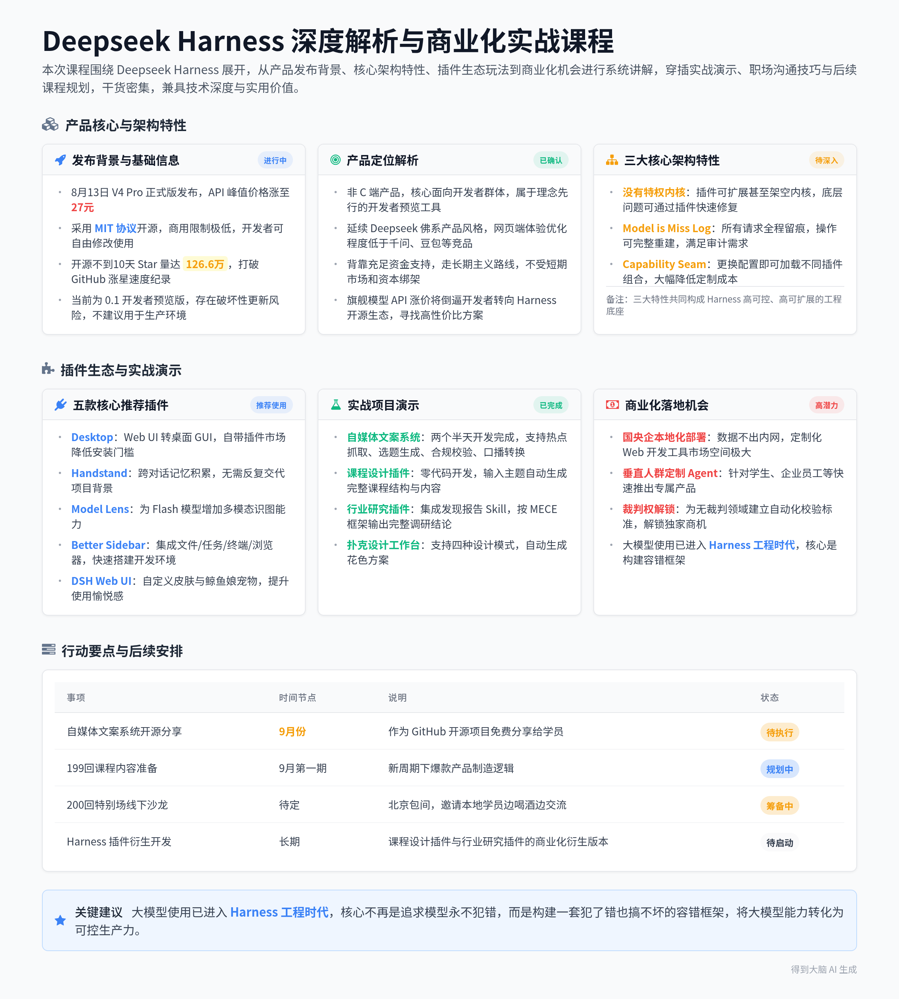

# DeepSeek Harness解析与插件实践分享

> 本条由 2026-08-26 晚 1 段录音合并成一份，合计约 134 分钟；各段来源见下表，主段是时长最长的一段。

## 当晚分段

| 段 | 开始时间 | 时长 | 标题 | 来源 |
|---|---|---|---|---|
| 1 | 2026-08-26 20:04 | 134 分钟 | DeepSeek Harness解析与插件实践分享 | https://biji.com/note/1919586282699341064 |

## 智能笔记

### 段 1｜DeepSeek Harness解析与插件实践分享（134 分钟）

### 智能总结

##### 录音信息
- **录音时间**：2026-08-26 20:04:54 ~ 2026-08-26 22:19:37
- **时长**：约 2 小时 14 分钟
- **参与人数**：约 1 人
- **内容类型**：课程分享

##### 录音总结
本次课程围绕 Deepseek Harness 展开，从产品发布背景、核心特性、插件玩法、商业化机会等维度进行全面讲解，穿插职场沟通技巧、行业梗科普、后续课程规划等内容，整体内容干货密集，兼具技术深度与实用价值。

**扑克设计工作台开发进度分享**
* **核心开发成果**：已完成一套基于Web coding的扑克设计工作台，支持新建项目、输入牌组名称、目标人群、使用场景等核心参数。
* **四种设计模式**：内置混合方式、严格数量方式、难度递进方式、流程序列方式四种不同的设计模式，可直接生成对应的四套花色方案。
* **细节设计考量**：项目背景采用深绿色牌桌配色，贴合扑克产品的使用场景，所有生成内容支持后续手动修改调整。
* **开发手感培养**：刻意将一次性项目也封装成Web功能，虽然短期效率不高，但能有效提升Web开发手感，长期收益显著。

**Deepseek Harness 发布背景与基础信息**
* **关键时间节点**：8月13日Deepseek V4 Pro正式版发布，API最高峰值价格涨到27元，同步推出Harness 0.1版本。
* **开源协议优势**：采用MIT协议开源，商用限制极低，相当于直接将代码开放给开发者自由修改使用。
* **GitHub热度数据**：开源不到10天，Star量一度达到126.6万，Fork量1.77万，打破GitHub涨星速度纪录。
* **版本风险提示**：当前为0.1开发者预览版，官方明确标注会有破坏性更新，仅适合玩具级探索，不建议直接用于生产环境。

**Deepseek Harness 产品定位解析**
* **非终端用户产品**：该产品并非面向普通C端用户，核心面向开发者群体，属于理念先行的开发者预览工具。
* **Deepseek产品气质匹配**：延续Deepseek一贯的佛系产品风格，网页端体验优化程度远低于千问、豆包等竞品，没有刻意讨好普通用户。
* **长期主义属性**：背靠充足资金支持，无需被短期市场和资本绑架，可以专注于长期技术探索，类似中世纪贵族以研究科学为乐的状态。
* **市场倒逼逻辑**：旗舰模型API涨价，客观上会倒逼部分开发者转向Harness开源生态，寻找更高性价比的替代方案。

**自媒体文案生成系统实战演示**
* **项目开发周期**：耗时两个半天完成开发，后续计划作为9月份的GitHub开源项目免费分享给学员。
* **核心功能模块**：支持自定义账号人设、自动抓取多平台热搜热点、一键生成3个不同方向的文案选题，选定方向后自动生成完整文案。
* **辅助校验能力**：内置AI校验模块，自动检查文案错别字、热点引用准确性、广告合规性与平台规范适配性。
* **全链路输出能力**：支持文案扩写、缩写、改写，可一键转换为口播稿，配套镜像提词器功能，支持自定义字号、播放速度，适配不同拍摄场景。

**推荐安装的核心插件介绍**
* **Desktop桌面版插件**：将原本的Web UI转换为桌面GUI版本，适配不喜欢网页端操作习惯的用户，自带插件市场降低安装门槛。
* **Handstand跨对话记忆插件**：自动积累项目理解，形成跨对话的记忆知识库，无需反复交代项目背景，使用越久越贴合用户使用习惯。
* **Model Lens多模态增强插件**：为原本不支持多模态的Deepseek Flash模型增加识图能力，自动关联本地已有的Kimi等多模态模型，实现截图识别、图片内容分析功能。
* **Better Sidebar侧边栏插件**：为界面增加侧边栏，集成文件管理、任务管理、终端、浏览器等功能，快速搭建出简配版的Code S开发环境。
* **DSH Web UI美化插件**：支持自定义皮肤、添加鲸鱼娘宠物陪伴功能，大幅提升界面美观度与使用愉悦感。

**插件生态与竞品定位对比**
* **Eclipse插件生态类比**：Harness的插件体系类似早年Java开发工具Eclipse，支持开发者高度自定义IDE环境，魔改出完全符合自身使用习惯的开发界面。
* **与World Body的定位差异**：World Body走全封装产品化路线，面向普通用户提供开箱即用的多Agent专家团服务；Harness走完全开放路线，面向开发者提供底层基座，二者生态位完全错开。
* **中间产品生存困境**：处于中间定位的同类产品上下够不着，既想做C端用户量又想做专业付费，界面频繁改版、扣费规则混乱，已经不适合作为稳定的教学工具使用。
* **插件与Skill的差异**：插件是模型的运营容器，模型运行在插件环境中，相比直接调用Skill的可靠性更高，不会出现大模型该调用Skill却未调用的幻觉问题。

**课程设计插件开发实战**
* **零代码开发方式**：无需阅读官方复杂的开发文档，直接将开发文档丢给大模型，用自然语言下达需求即可自动完成插件开发。
* **插件核心功能**：用户输入课程主题、大纲思路后，自动进入Plan模式确认课程思路，调用搜索工具整理资料，输出完整的课程内容结构。
* **产品经理课程生成效果**：生成的20课时产品经理课程包含6个核心模块，覆盖产品思维、需求分析、大模型产品设计等内容，自动参考起点课堂、慕课网等平台的公开课程资料，内容完整性较高。
* **衍生商业化思路**：基于该插件可以进一步扩展为教师综合工作台，集成多个教学相关插件，直接面向教育从业者售卖变现。

**行业研究插件集成Skill实战**
* **发现报告Skill接入**：发现报告平台提供Skill、CLL、MCP三种接入方式，用户开通会员后即可直接调用，会员两年费用为468元，有效期到2028年。
* **光模块行业调研效果**：插件自动按照MECE框架拆分研究边界，同步发起6个子问题检索，下载6篇行业分析报告，最终输出覆盖需求端、技术路线、竞争格局等维度的完整调研结论。
* **会员权益模式优势**：不按调用量收费，直接将Skill使用权限作为会员权益，既降低用户使用门槛，也能大幅降低平台自身的带宽消耗。
* **衍生产品思路**：基于该插件可以快速搭建产品经理综合AI工作台，集成PRD撰写、资料查询、用户调研等多个插件，初稿一周即可完成开发。

**Harness工程核心概念解析**
* **概念起源背景**：源自OpenAI公开的实践案例，3名工程师借助Codex工具，5个月完成上百万行代码的产品级项目，全程几乎没有手写代码。
* **核心作用定位**：Harness相当于马具、缰绳与导航，不提升大模型本身的智力水平，核心解决模型的可控性问题，将大模型的强大能力转化为可控的生产力。
* **三类人才适配类比**：中专生适配固定流水线SOP场景，普通本科生适配工作流中的大模型组件场景，天才级毕业生适配Harness驾驭工程场景，仅需告知战略方向与边界，由模型自主完成探索性任务。
* **六大核心要素**：包含完成定义可机器验证、知识必须可验证、给Agent感官手脚做自证、解决长时程失忆、验证外置成为外回路、边界沙箱机械化六大核心要素。

**职场沟通技巧分享**
* **不败将军理念**：年轻阶段可以追求常胜，用试错换取快速成长；进入稳健阶段后要追求不败，长期保持不出错的靠谱状态，最终自然胜出。
* **应对老板新词提问话术**：老板刷到新名词提问时，回复“您也在看这个呀，我们已经安排技术和产品团队做调研了，正想约您这周汇报调研报告”，全程挑不出任何毛病。
* **精准夸人技巧**：夸人要避开对方的核心本职优势，找到对方不被大众熟知的小众爱好点进行夸赞，才能真正说到对方心坎里。
* **职场生存核心原则**：职场沟通第一优先级是做到让对方挑不出任何毛病，长期维持稳定靠谱的个人标签，远好过偶尔的亮眼表现。

**Deepseek Harness三大架构特性**
* **没有特权内核**：打破传统Chrome类内核插件体系的限制，无需修改底层内核代码，通过插件即可扩展甚至架空内核功能，底层出现问题也可以通过插件快速修复，安全性极高。
* **Model is Miss Log**：所有进入模型的请求都全程留痕，所有操作都可以通过日志完整重建，方便问题回溯与客户审计，解决生产环境的可追溯性痛点。
* **Capability Seam能力缝接**：更换配置文件即可加载不同的插件组合，同一套底层基座可以快速适配不同场景需求，无需针对每个场景重新开发，大幅降低定制化开发成本。

**商业化落地机会分析**
* **国央企本地化部署市场**：国央企有强烈的大模型工具本地化部署需求，数据不能出内网，基于Harness开源底座开发定制化Web开发工具，完全符合合规要求，市场空间极大。
* **垂直人群定制Agent市场**：针对学生、企业内部员工等不同垂直人群，从皮肤到插件进行全面定制，快速推出垂直领域专属Agent产品，开发门槛极低。
* **产品范式迭代方向**：大模型使用经历Prompt工程、上下文工程、Harness工程三个阶段，当前阶段默认模型一定会犯错，通过Harness构建容错框架，让模型犯错也不会造成严重损失。
* **裁判权解锁机会**：谁能把原本没有裁判的领域，通过自动化校验机制变成有明确裁判标准的领域，谁就能解锁该领域的独家商业机会。

**后续课程规划说明**
* **199回课程主题**：9月份第一期课程将讲解新周期下爆款产品的制造逻辑，结合相关热点梗展开分享。
* **200回特别企划**：计划打造走心特别场，回顾四年做课一路走来的亲身体会与成长感悟，考虑在北京包线下包间，邀请本地学员参加小型沙龙，边喝酒边交流。
* **长期活动规划**：300回计划落地上海线下场，后续每100回都在不同城市举办线下聚会，到500回时刚好是2033年，累计做课满10年，纪念意义极强。
* **固定开课约定**：保持每周三晚八点的固定开课节奏，和学员长期稳定相约。

**热点梗科普环节**
* **竹知了玩具事件**：某品牌发布会现场观众发出的“哇哇哇”应援声被做成竹知了发声玩具，后续被品牌方下架处理。
* **大嘴鱼替代玩具**：竹知了被封后，市场上出现同款发声的大嘴鱼玩具，成为新的热门玩梗周边。
* **相关衍生调侃**：该玩具被网友调侃为“1000万以内最好的玩具”，成为AI圈近期的热门趣味话题。

### 章节概要
**00:00:11** **扑克设计工作台开发进度分享**
用户分享自己开发的扑克设计工作台最新进展，核心功能已全部落地，支持四种设计模式自动生成花色方案。开发过程刻意追求全Web化封装，哪怕是一次性项目也做成完整功能，目的是长期提升Web开发手感，项目背景采用深绿色牌桌配色，贴合产品场景。

**00:07:11** **Deepseek Harness发布背景与基础信息讲解**
梳理8月13日同步发生的三件行业事件：V4 Pro转正API涨价到27元、Harness 0.1发布、采用MIT协议开源。开源不到10天Star量破126.6万，打破GitHub涨星纪录，同时明确提示当前0.1版本属于开发者预览版，存在破坏性更新风险，仅适合玩具级探索，不能直接用于生产环境。

**00:13:16** **Deepseek Harness产品定位深度解析**
指出该产品并非面向普通C端用户，核心面向开发者群体，延续Deepseek一贯的佛系产品气质，不刻意讨好普通用户。依托充足资金支持走长期主义路线，不受短期市场和资本绑架，类似中世纪贵族以研究科学为乐的状态，API涨价客观上会倒逼开发者转向该开源生态。

**00:22:29** **自媒体文案生成系统实战演示**
展示耗时两个半天开发完成的自媒体文案生成系统，支持自定义账号人设、自动抓取多平台热点、一键生成3个不同方向选题，内置AI合规校验模块，还能直接转换为口播稿与镜像提词器，后续将作为9月份的开源项目免费分享给学员。

**00:34:24** **核心推荐插件逐一介绍**
依次介绍5款高价值插件：Desktop桌面版将Web端转为GUI版本，Handstand插件实现跨对话记忆，Model Lens插件为模型增加多模态识图能力，Better Sidebar插件快速搭建简配版Code S环境，DSH Web UI美化插件支持自定义皮肤与鲸鱼娘宠物陪伴功能。

**00:48:38** **插件生态与竞品定位对比**
将Harness插件体系类比早年的Eclipse开发工具，支持用户高度自定义开发环境。对比World Body的全封装产品化路线，二者生态位完全错开，同时指出中间定位的同类产品界面频繁改版、扣费混乱，已经不再适合作为稳定的教学工具使用，插件模式相比直接调用Skill可靠性更高，不会出现漏调用的幻觉问题。

**00:54:02** **课程设计插件开发实战演示**
演示零代码开发课程设计插件的完整过程，无需阅读官方复杂文档，直接将开发文档丢给大模型即可自动生成插件。生成的20课时产品经理课程包含6个核心模块，自动参考多个主流平台的公开课程资料，基于该插件可以进一步扩展为教师综合工作台，直接面向教育从业者变现。

**01:00:07** **行业研究插件集成Skill实战演示**
演示将发现报告Skill集成到Harness插件的效果，发现报告平台提供三种接入方式，两年会员费468元，开通后即可直接调用。生成光模块行业调研时自动按照MECE框架拆分问题，同步检索后输出完整调研结论，基于该模式一周即可快速搭建出产品经理综合AI工作台。

**01:14:00** **Harness工程核心概念系统讲解**
追溯Harness概念起源于OpenAI的公开实践案例，3名工程师5个月完成上百万行代码项目。明确Harness的核心作用是解决大模型的可控性问题，相当于马具缰绳与导航，不提升模型智力但能将能力转化为可控生产力，同时讲解适配三类不同能力水平人才的使用场景，以及六大核心构成要素。

**01:32:26** **职场沟通实用技巧分享**
分享不败将军的职场生存理念，年轻阶段可以追求常胜试错成长，稳健阶段要追求长期不出错的不败状态。给出应对老板刷到新名词提问的标准话术，讲解精准夸人的核心技巧，强调职场沟通第一优先级是做到让对方挑不出任何毛病，长期维持靠谱标签更容易最终胜出。

**01:46:33** **Deepseek Harness三大核心架构特性解读**
逐一讲解三大架构特性：没有特权内核，通过插件即可扩展甚至架空内核，底层出现问题也能快速修复；Model is Miss Log，所有操作全程留痕可完整重建，满足生产环境审计需求；Capability Seam能力缝接，更换配置文件即可加载不同插件组合，大幅降低定制化开发成本。

**01:55:22** **商业化落地机会全面分析**
梳理三大核心商业化方向：国央企本地化Web开发工具市场，完全符合数据不出内网的合规要求；垂直人群定制Agent市场，针对学生、企业员工等群体快速推出专属产品；抢占无裁判领域的自动化校验标准制定权，谁先制定标准谁就能解锁独家商业机会。同时梳理大模型使用经历的三个发展阶段，当前进入Harness工程时代。

**02:03:37** **后续课程规划与线下活动设想**
公布后续三期核心课程安排：199回讲解新周期下爆款产品制造逻辑，200回做走心特别场回顾四年做课感悟，计划在北京举办线下沙龙邀请学员边喝酒边交流，300回落地上海线下场，500回时刚好是2033年累计做课满10年，纪念意义极强，保持每周三晚八点固定开课的节奏。

**02:05:49** **近期热门玩梗事件科普**
讲解竹知了发声玩具因模仿某品牌发布会现场“哇哇哇”应援声被下架的事件，后续市场上出现同款发声的大嘴鱼玩具，被网友调侃为“1000万以内最好的玩具”，成为近期AI圈的热门趣味话题。

### 金句精选
- “当你连一次性项目都随手搓一个Web版本的时候，你的开发手感会变，脑结构都会变。” (执行策略)
- “Deepseek Harness根本就不是给终端用户用的，它是给开发者的理念预览版。” (战略洞见)
- “大模型使用经历三个阶段：Prompt工程、上下文工程、Harness工程，现在我们默认模型一定会犯错，要给它一个犯了错也搞不坏的世界。” (战略洞见)
- “职场里你哪怕一点亮点都没有，只要永远不出错，长期保持靠谱，你就已经是必胜的了。” (方法技巧)
- “年轻的时候我想当常胜将军，用阳寿换一场大胜，现在我更想当不败将军，一直苟着最后一定赢。” (思考启发)
- “夸人要避开对方的本职优势，找到他不为人知的小众爱好点去夸，才能说到他心坎里。” (方法技巧)
- “同一台发动机，装在赛车上和装在卡车上跑出来是完全两种不同的东西，过去比发动机马力，今年开始比底盘。” (战略洞见)
- “谁能把一个没有裁判的领域变成有明确自动化裁判的领域，谁就在那个领域解锁了独家的商业机会。” (执行策略)

### 待办事项
- 用户：9月份将自媒体文案生成系统作为开源项目分享到GitHub
- 用户：后续准备Deepseek Harness相关的调研报告，在公司内部做技术调研汇报
- 用户：筹备200回特别场线下沙龙，在北京寻找合适的包间邀请本地学员参加
- 用户：后续课程准备新周期下爆款产品制造逻辑的相关内容
- 用户：基于Harness插件体系，尝试开发课程设计插件与行业研究插件的衍生版本

---

## 完整逐字稿

### 段 1｜DeepSeek Harness解析与插件实践分享（134 分钟）

🟢 说话人1 [00:00:11]
多少钱？第二套送啊，第二套送啊送。然后我要给大家汇报一下我新的这套的设计的。进度我答应了，从8月底开始给你们每周汇报进度，每周汇报进度。我给大家说一下我的新的一套的进度，大家猜一猜我现在做到什么地步了？大家可以猜一猜，我现在在新的这套上我做到什么进度？喂，你好，来猜一猜我做到了什么进度？

🟢 说话人1 [00:00:52]
内容设计设计完成是啥？做有样稿设计，你们全都猜错了。你们还是不够。有风还是不懂我，你们可能想象不到我干了什么事。新的这套我先把Web coding做出来了一套设计平台。

🟢 说话人1 [00:01:21]
我首先不是先去做设计，我做了一套。扑克设计工作台。我首先用白光景做了一整套的扑克设计工作台。我可以新建一个项目，可以做任意的东西。尹轩你好，就是你你们你们对这事是一种什么感觉？是觉得老师你呀真的是走火入魔了。然后第二的话呢，我明白你什么叫做真正践行亲政了，我做了一套。工作台，我比如说我AI知识。牌组名称、目标人群、使用场景、风格调性、具体要求都可以出出。然后有四种不同的来去设计的方式啊，有四种不同的设计的方式啊，我可以用混合方式、严格数量方式、难度递进方式、流程序列方式，随便做一套。

🟢 说话人1 [00:02:23]
然后生成相应的花色方案，这里面是先说四套的花色方案是什么，然后生成花色方案。你们是不是觉得我我有点疯？你是不是感觉我略有点疯？而且你们发没发现，就是我的这个项目的背景为什么要用这个颜色？有有想过吗？就是为什么我这个项目的背景我要用一个绿，用这个很深的绿，这个绿是什么？就这就就就这个绿是什么？四儿八经说的对，牌桌牌桌。对，所以你看他给我两种不同的方案，你还得给我多方案。你是给我一个AI落地四驱，还是AI能力金字塔？心是认知，星是应用，那个黑桃是构建，草花是创新，要不然是运营模型数据场景，我用这个方案。

🟢 说话人1 [00:03:18]
然后瞬间给我生成所有的这个牌，它到底是多少步，相应的要点是什么？然后后面所有东西都是可以修去去改的啊，所有东西它都是可以改的。对不对？就是你们有没有这样一种，就是就是我我我我我认真的说一个，也就是如果你们。在Web的这种意识和这种感觉到这种近乎于走火入魔的状态的话，其实很多事这都能成，很多事这都是能成的。哎，我们一次生成4个花色的所有的内容。

🟢 说话人1 [00:04:03]
哎，我看看给给我生成什么，这个我还在改，所以就是所以还在改它的底层数据出来了，A定义业务指标。首先先定义业务指标，然后二盘点数据来源，三是数据采集方案，这个先不考虑它的好与不好啊，然后我再告诉你后面是在干什么。然后我这边有Harmony这套东西，然后这里面是没有守住什么样的规则，还有Harmony，然后后面卡面出图有不同的风格可供我选择，我可以生成不同的这个风格方案。

🟢 说话人1 [00:04:42]
里面已经自带哈尼了。然后几套不同的风格，我比如说我用我这个点这套出demo，然后我用这套风格，比如说做几点几何风，然后出样式，然后每张的去做生成，然后并且可以给我全面的。再去做最后一套艾瓦尔的检查，到底是否OK。所有的东西的话，哪怕是这么一个非常非常一次性的项目，我们也去排成了一个这样的功能。什么功能都有必要做外部，是否界定价值和界面是这样。老魏，这个事是这样子，就是我现在就是有点强行要求自己所有东西都外部困一个。你可以认为就是这件事从从效率上来讲肯定不高，但是从你培养手感上来讲，我觉得特我觉得很值，你们觉不觉得？对吧？我就想看他和我能够有多大差距，我就想看看跟我能够有多大差距，或者我通过什么样的做法来讲的话，我才能做到他所做到的效果和我设计出来的是比较接近的效果。明白，他肯定这种一这种这种一这种一次性项目肯定不值得，但是就是。当你连这种项目都随手搓一个的时候的话，你有很多东西，你的手感会变，或者说你的一些脑结构会变，这是我自己的一种感觉。

🟢 说话人1 [00:06:10]
所以现在是做到了这个份上，现在是做到了这个份上，然后我这已经有一些项目，然后比如说在前面这个我已经开始出图了，但是这个图我做的觉得这个图我还是需要去改一改，然后这个图这是一，这是用户场景，我觉得做的不好，所以我还要再改，我还要去改这个。对吧。看不清牌桌，我这个没让你看清牌桌，我这个牌桌是这个氛围，是这个牌桌率。就是每个产品细节其实都去做了一些考虑。

🟢 说话人1 [00:06:38]
今天课和昨天是差不多，是差不多。我是昨天是为了再招点人过来，然后让他们去做了一个这个Pro6版本。如果你昨天听的话，今天其实如果有事的话，可以不用再听第二遍了，好吧？呃，外汇用电子桌游我做过，我做过啊，我是做过。我做过那个小，我做过小，我做过小黑屋的桌游的的 Web 扑定版本啊，我做过的呀，也做的非常帅气。来，我们拉回来给大家讲讲这个，这个 Harness 为 Agent 产品到底带来什么变化。今天讲三部分的东西，第一部分呢讲讲这个 Harness 是什么，第二个讲用 Harness 做一个插件，第三个讲一讲这个 Harness 对于产品构建可能在产生一些什么样的变化。

🟢 说话人1 [00:07:28]
首先第一趴这个DeepC Harness是什么？然后Harness发布了，Harness发布了，那发布之后的话确实是挺火的一件事情。然后呢，8月13号就是我在上周四，上上上上周四，上上周四，在那正讲正正讲着课呢，突然间发过来。啊，V4pro正式版发布发布及铺盖对不对？API涨价啊，良辰变成了小南良，然后harness0.1发布，一开始大家还满怀希望，然后的话又这。这个诅咒连连啊，这个确实非常有意思啊。这个V4 Pro的的旗舰版本转正了，API呢最高峰值变成2变成了27块钱了。然后无数的群里有人在问如何去找到平替版，性价比更高的平替版，发现其实也找不到。

🟢 说话人1 [00:08:18]
然后Haris 0.1的话，我觉得有一个比较有意思的一个东西，就是它是MIT协议开源，这个协议其实是非常有意思的。MIT意味着什么呢？MIT的。黑羊西皮有点过分了，哎，没必要没必要没必要，我觉得小蛮娘已经够可以了。就是MIT协，就是咱们要知道啊，MIT协习的开源实际上是非常高的。也就是说，您可以改完之后的话，直接商用它的这种开源程度应该算是极其高的了，对吧？

🟢 说话人1 [00:08:46]
然后这三个事情的话，我们需要连起来看。需要连起来看。对MIT叫做你要你要如何，咱们就如何。这句话叫做就是你要如何，咱们就如何。MIT的。基本逻辑就是把这玩意送给你了，送给你了，对吧？然后这三个事儿得连起来看旗舰模型转正API涨价，哈里斯又上了干嘛呢？其实某种意义上来讲的话，就是就是。但其实大家有没有用DSH啊？大家有没有用？我先问大家一个问题，大家有没有用这个东西？如果你用的话，我觉得你可能会发现你用HIS之后的话，它的Token命中还OK，它其实还相对来讲有点效果的状态。所以它这个东西其实是想拿这个涨价往把用户往HIS市场上来倒逼一下，我觉得还是有点感觉的。

🟢 说话人1 [00:09:40]
OK，那开源当天的GitHub的数据啊。126.6万一度打破了这个GitHub的涨薪速度记录，然后for1.77万开源不到10天，MIT协议最宽松的一个商用是没有限制。大家都说啊什么也开源了。Codex的CLI开源了，然后CLI的话它是用的Apache2开源的，尽管说也比较的open，但是其实比不上MIT。然后但是大家注意啊，它这个是0.1版本，0.1版本官方直接给你写会有破坏性更新，所以意味着什么？现在大家搓玩具可以，千万不要拿它去搓生产力工具。这东西的话，它后面如果给你一个破坏性更新的话，其实对你来讲还是。挺恐怖的一件事情，对吧？

🟢 说话人1 [00:10:27]
挺恐怖的一件事情，但是不要过早开香槟。这事我们一定要去说，他不要过早开香槟。16.10，这16万的star不是好用啊，不代表好用，而是情绪和习惯啊。Deepseek发了什么东西都这都是至少10万star对吧？数这个这个数字给你呈现的是地缘情绪加新鲜感加转发率，不是使用量。不是使用量，你不知道怎么用在哪里，你不是技术背景的吗？对吧？

🟢 说话人1 [00:10:56]
就是你，就是你不是个老programmer嘛，然后，然后你看着这。这种纯Python的架构的话，你你想你想不到它能干啥用啊？我觉得别人想不到也就罢了，你想不到就真的很让人困惑困惑，真的困惑。就是你写过Java吧，Eclipse用过吧，Eclipse Python体系，你能拿它玩出来好多花样啊，对不对？

🟢 说话人1 [00:11:23]
然后目前的问题客观上比较多，101个社区插件，对吧？还有不少还会出装机故障，还会出装机故障。然后而且大部分都还是拿源码包分发的。现在是玩具期，不是生产期。这个我们要先跟大家说明白，它是个玩具期，不是生产期。现在大家你可以认为它是一个这个非常有意思的一个图，但不是一个真正的一个生产力工具啊。然后呢，我先告诉大家怎么去装啊，先告诉大家怎么去装，它有一个前置，就是你的电脑里得先有note G S，有了note，当然我觉得大家既然是做web point的话呢，就不可能没有note G S。Nodejs安安装包装完之后，或者你让你的Codex给你装，没有问题。然后怎么用的非常简单，一句命令行直接粘过去之后的话，放到你命令行工具里，啊，NPS直接给你装上了，OK，然后放到命令行里，直接一步确认。

🟢 说话人1 [00:12:16]
哎呀。你要知道逍遥。在炒饭会里，有一些同学是没有听AI的课的，是没有听AI的课的。对吧我知道你肯定不需要，但是就是他没有听他的课的，难道我不该给他讲一句吗？对吧对吧。对吧对吧，而且很多同学没有去上那个AI的课，不是每个同学都是上了AI课进到我这的，有很多同学是没有上那个课也在我这的啊，对吧？然后放在命令行里直接可以跑出来啊，然后他就是这这个js h web就是127.0.0。1.1-3008，3080直接起来了啊，3080起来了，OK，在本地浏览器就会可以非常快速的跑起来，非常快速的跑起来，然后直接就可以去用。它这里面有几种模式，标准、PTC、极简和创造，四种模式。

🟢 说话人1 [00:13:16]
啊，这个其实看的人是云山雾绕的，这里面我们要先去说一句，DSH这次出来之后，其实在圈里争议非常大，我不知道你们有没有这种感觉，或者你们见没见过这样的争议，就是它的争议是非常大的，为什么叫做争议非常大？我认为这个争议是很正常的，很正常的。因为DSH和预期的差异太大了，你没有想就是DSH当时在出之前，所有人或者说大多数人认为他应该是出来一个什么样的产品吗？你们当时觉得他应该是个什么吗？是包括我当时听他招哈里斯的人，然后他要去做这个哈里斯出来，我也认为他出的东西不是这个东西，和我的预期完全不同，对吧？

🟢 说话人1 [00:14:00]
原本大家预期都是觉得这个D这个DSS应该是一个类似于Claude Code或者Codex的一个比较完整的Agent。可能出来第一个版本的话，就是我我个人的预期啊，我个人的预期啊，是它出来之后的话，应该它肯定是在综合效能上比不上这个CCA，它在这个这个整在整体上比不上Codex，在这个在Work场景的应用技术上不可能比上Work，不可能比上Work，这是很正常的事情。但是它和那它和V4 Pro的这个整个的结合程度，使得它在某些领域出现非常好的效能和非常低的成本。感觉上是这样子，不可能说是搞个操作系统，就是感觉就是从所有感觉应该是这个。

🟢 说话人1 [00:14:43]
所以我当时说我我说这个Harnis我当时听到消息是10月份初，然后之后的话去做那个外网扩定的那个课嘛。就发现完全不是这个东西，所以很多人一开始就懵了。所以很多人就懵了，你知道吗？因为大家都觉得他应该放出来是一个程度比较高的产品。就如同在几年前，Deepseek当时横空出世，所有人都惊了，尤其他当时的COT确实非常的惊艳。但事实的版本完全不是这样子，完全不是这样，所有都所有人都懵逼了，所有人都懵逼了，这是个什么东西对吧？

🟢 说话人1 [00:15:17]
我这个要先给大家一个结论，Deepseek不是个产品，根本就不是个产品。DSC是不是个产品，这个项目的成熟度和CC和COS有非常大的差距。这个其实完成度其实是挺低的，而且它就根本不是给终端用户用的，完全不是给终端用户用的。它写的很清楚，它叫做开发者预览版，对开发者都是预览级别的版本。他是这么个状态，他本身就是和deepseek v4pro是过拟合了，他是给了一堆的脚手架，给了一堆的脚手架，然后他是给做harness的技术用的，甚至在这个目标之下，依然只算是早期。期版本有多早期，它是0.1版本，它都不是1.0版本，过于早期的版本了。其实我认为他给的不是个产品，他给的是个理念版本，他宣扬着一种理念，这是我对这件事的判断。

🟢 说话人1 [00:16:16]
我觉得他给的是一种理念，就是我先大声的跟大家去说，我在干这么一件事，这件事的方向你们是不是觉得很棒？现在这个产品压根就不是给你们用的。然而就不给你用。我觉得现在这个版本就是这么一个东西，对万物都可查，这个我觉得就是这么一个事，对吧？它的核心要去宣扬的就是它的插件逻辑，它的插件逻辑我觉得今天我们重点讲啊，我觉得非常切，担心用户跑了。你跑了的就不是他的用户，跑了的就不是他的用户。你这个思路就完全不对，就是就是当你真正懂他之后，你会发现哇。这东西它厉害了，你是用户，他就压根没打算给你用。

🟢 说话人1 [00:17:08]
所以deepseek harness它有一种很强烈的deepseek本体产品的那个味道。当时我在说什么吗？第四个本体产品的味道是什么？deepseek常规产品的味道是什么？你们有没有觉得，就是DeepSeek它的这个网页做的，有种压根没太打算让你用的感觉？有没有这种感觉？有没有这种感觉？他就没太想给C端用户用，就是哎呀。没办法，这这就是放在这吧，也不更新，也不优化。你看看千问，你看看元宝，你看看这个豆包卷成什么样，卷生卷死，真的卷生卷死。deepseek就给人感觉就是，哎呀，我给你放在这吧，你们不都要用吗？

🟢 说话人1 [00:18:00]
我给你放在这得了，你们哎呀没有办法，这不是哎呀没有办法呀，真的就是真的是这种感觉，你知道就是哎放在那吧啊你们想用就用，不想用就算没有关系。我告诉你，哈尼斯也是这种气质，哈尼斯也是这种气质，就是你就是我就没打算给你们用。啊你是开发者吗？你现在要预要要预览吗？你都不是，那你为什么要下这玩意儿？你靠热你蹭热度来了，那你那你卸了，我没想给你用，没想给你用。还有说老实话呀，说老实话现在。你们知道。

🟢 说话人1 [00:18:47]
王星星，我说王星星不是王星，王星星在上市那一刻那种非常悲怆，木然，整个表情茫茫然的那种感觉，那种茫茫然的感觉。你知道他特别羡慕谁吗？我认真的，你知道你知道他特别羡慕谁吗？你知道吗？你知道吗？王星星那种极其悲怆的感觉，就是就是那那玩意儿是上市了吗？那玩意儿那玩意儿拿出去杀头了，那玩意儿就是被判了是吧？他的那个眼神里你透露出我觉得他眼神里的感觉甚至还不如许家印。

🟢 说话人1 [00:19:27]
许家印是历经沧桑，终于这颗心放下了，这颗心已经死了。但是王星星是一个少年得志，少年天才。面对着这灯红酒绿，知道自己要永受折磨的成为那个西西弗推球的那个人啊，热闹是他们的是旁边这些大佬的，我什么都没有，只有一身的债务，满目的疮痍。这个这个他他他有多么的羡慕梁文峰啊，真的，你知道在这个世界上这个这个。这个有钱啊有钱啊，真的真的是可以为所欲为啊。真的你们要想啊，无论是智谱，无论是mini max，无论是豆包、千问等等这些家，哪家可以完全做自己认为对的事情，哪家能做真正对的事情啊？都只能先按照啊市场增长，用户C端、B端同时发力，然后打齐所有东西都得按照这些东西去走。但是你会发现deepseek这东西真的是有长期主义啊，真的是有长期主义，因为就是他是无所谓的，反正反正有钱嘛，反正有钱嘛，对吧？反正真有钱嘛，对吧？探索未知之直径。

🟢 说话人1 [00:20:46]
这就是我的一个实验室，你会感觉他的你让我从梁文峰身上我。我看到那种什么感觉吗？就是怎么活，你不买他偷看啊，你不买他偷看他偷看。卖的好着呢。你让我从他身上看到一种什么样的感觉？不是理想主主义者，亲，不是理想主义者。我从他身上看到了一种我们在我们在教科书上看到了很多的那些大科学家，比如说拉瓦锡，比如说这个这个这个这个安培福特，安培瓦特那帮人，那帮人什么？那帮人其实本质上是中世纪的一帮贵族们。啊贵族们吃穿不愁，万事不愁，然后以研究科学为乐。我操，我就觉得，我觉得他有一种这种感觉，知道吗？就是很有拉拉稀的那种气质。啊。啊，真的。

🟢 说话人1 [00:21:41]
所以你知道这是多么让人羡慕嫉妒。的一种事儿啊，真的太伟大了，太伟大了，对吧？真的他做的全都是对的事儿，然后目光可以放的很长远，不被市场不被资本所绑架，甚至不被市场去绑架。这种人多了，当然对国家是。好事，但是这种人怎么能多起来才是个问题啊，对吧？啊，真的，我觉得他他近乎出世了，我觉得就是非常有智慧，非常有智慧。哎呦，跳出三代之外，不在五险之中，说的太好了。这个理念我觉得真的非常有意思，但是最终这个项目我们认真的讲，我认真的讲，我认真的讲，这个项目是夯是拉需要时间的检验，这件事我先我先放在这，这个项目到底是夯了是拉了，其实有时间，但是我目前来讲是谨慎偏乐观的态度。

🟢 说话人1 [00:22:29]
我们拿着Deepseek我们先做个项目啊，我们先拿Deepseek还是你做个项目，比如说我做个自媒体工厂，做个自媒体工厂，然后呢我们就直接输一段很简单的prompt看一下它的效果，做一个多用户的自媒体文案生成系统，Web APP用大模型生成自媒体文案，先做第一版，给出素材，自动生成三个话题方向，用户选择后生成完整内容。哎。和刚刚双聊的同学，你们知道我在干什么吗？知道我这段话是在干嘛吗？知道我这段东西是在干嘛吗？啊，来，我们看一下这个它的整个运行的过程。

🟢 说话人1 [00:23:05]
DSH的planner，它的planner啊，初始化，实现数据库、用户健全层、大模型层、后端的API、前端的界面、端到端测试啊，然后使它的执行过程啊，给他们看过啊，他们什么反馈啊？他们什么反馈啊？是有你有啥意见给我同步一下，或者把我拉到那个群里行不行？这这个还把我隔离开，哎呀，对不对？然后完成了看一下效果。

🟢 说话人1 [00:23:33]
这是这个做的这个自媒体文案工厂，这是有些同学想去做这个自媒体账号，我答应我当时哎呀，一时心血来潮，说我给你们搓个东西吧。啊，我给你们搓个东西吧。然后这答应的东西咱们得搓，对吧？然后这个注册登录的功能都都有，然后整体的状态还可以输入一个题材，输入目标的平台，然后生成三个话题方向选。选择方向，做整体的文案生成，哎，效果还OK，效果还OK，没有在GitHub上，没舍得放，这个项目还没有完善。我们比较一下这个Claude Code加Openness的这个效果啊，比我们比我们比较一下这个Claude Code加Openness的效果啊，就是。

🟢 说话人1 [00:24:19]
这个在哪儿？在我电脑上。你们你们能不能看一看我我我我我一会儿给你们看我现在做出来的水准是什么，你们再说求不求行不行？就是你们一看到有点东西，不看到就我还你们你们能让我把逼装完了再要吗？你们这样让我很不爽，你们知道吗？就是就是对吧，就是是这样的，不是聚不聚焦主课，你们好歹给我点情绪价值行不行？就是就是我还。就我这个逼装的还没有舒展开，还没有铺垫上来就要，这样我这样我很，哎呀，就就是很不舒服，你知道吗？对吧？

🟢 说话人1 [00:25:09]
然后我们看一下克拉克加opros 5的效果啊，大家注意啊，前面这个界面是长这样，大家印在脑子里啊，印在脑子里啊，啊，对吧，印在脑子里啊，然后我们看一下opros所出的效果。看一下这个的。界面。它包括这个的emoji图标是不是长得都一样？中间这个功能是我后面的版本加的，是不是长得特别特别像？哎，是不是长得特别特别像？这玩意到底谁蒸馏了谁了呢？不知道啊，这个我什么都不知道，我什么都不知道。来，你们想看一下我这个给你们的这个工作，我现在做到什么份上了吗？给大家请大家说一下这个意见和建议啊，稍微看一眼。

🟢 说话人1 [00:26:03]
嗯。来，这给给各位同学们看一下，我这个效果增大放大放大放大。我这个是可以这么干的，我可以设定一个新账号，在这个账号上呢能够去有账号名称，我要在哪个平台发布，我的风格调性是实用干货，真诚共情，犀利观点，一生幽默，专业行为，故事叙事，主要我要去做什么内容，给什么样的用户看，解决什么样的问题，有什么不能去说的东西，然后个人的人设是什么，个人的人设是什么啊，行业性格特征，保存完之后，比如说我这里面就做了一个号，老高谈AI组织变化，就是我说让你去做的这个东西。然后我要在B站上发布专业权威的主要谈AI对组织结构的变化趋势，目标用户中小企业主，企业完全现在都空着呢。年龄、性别、所在行业、总岗位、爱吐槽、幽默。我有几个语气样本，这是我现在所learning出来的效果，然后保存完了。之后它这个系统是能干什么呢？然后它有创作和热点的两部分，它能自动抓取几个核心平台的这样一些热搜榜的这些内容，便于大家来去做相应的这个蹭热点的能力。

🟢 说话人1 [00:27:12]
然后呢我这个创作的时候的话，我如果把这个创作呃我们重新进一次吧，重新进一次吧，这个还是我刚才的，你看这个比如说啊AI让13岁孩子三天赚1.8万，这个其实是刚刚在咱们群里有的，对不对？中小协主是该慌还是该学？啊，对不对？该慌还是该觉得你觉得这条热点有点意思，来，我们选择了这个热点。然后我是 B 站文案专业全文，主要协助 1200 字的这个字数，我还可以改这个东西，但是我常会给他缩回来，然后我生成三个话题方向。常规生成三个话题方向。对，这刚刚的热点你立刻干，那不就火了吗？对不对？对不对？

🟢 说话人1 [00:27:53]
我们看一下三个话题方向。第一个方向是用个体能力放大切入，对比中小企业中组织冗余，提出用AI重构小团队效率。的紧迫性。二是从反常识角度切入，指出AI时代真正被淘汰不是基层，而是只会做信息传递的中层。中央企业应该重新审视中层价值。三从行业视角切入，将女孩的个体行为放大为组织变革信号，分析AI将如何组织变成最小单元，中央企业应该如何借鉴，你们觉得应该选哪个？觉得应该选哪个？

🟢 说话人1 [00:28:25]
一个选题给你做三个不同的方向，选三行，咱选三啊，给中央企业主做一个创业方向，用这个写好，现在开始写。你们喜欢咱们就三来。就直接可以去出这这这些东西了，是不是觉得这个功能还 ok？是不是觉得还 ok？但是如果只做到这份上，这个这就不是我做产品的水准。看，加了一个 harness，加了 lr，就是它会对于它里面有没有错别字，热点引用是否吻合，有没有发现风险和符合辐射。是否符合广告法和平台的这个整个的规范要求，对吧？全是AI生成，全是AI生成。

🟢 说话人1 [00:29:07]
然后如果你觉得这条不行，你还可以编辑，比如说我觉得这本身不重要，这句话你不喜欢，你可以把它扩写，专业点，轻松点，缩写，举个例子，让它更好懂。然后你觉得这段太多了，好，加个杠。续写这一段。

🟢 说话人1 [00:29:25]
哎插入哎怎么样？怎么样？哎，觉得老师这东西太常规了，这东西你不已经做了好多项目都是这样的吗？好，我们把它变成口播系统。我们把它变成口播系统，你不是不会读吗？来，你不是不会读吗？不知道怎么有情绪，对不对？不知道怎么有情绪，对不对？来，咱们变成口播系统。我昨天刷到新闻，哎，评述中再带点好奇。一个13岁初二女孩参加黑客综。比赛几乎不写代码，就靠大模型做了个虚拟陪读产品。你猜怎么着？

🟢 说话人1 [00:30:06]
三天赚了1.8万，产品当天卖了90份。我第一反应是这姑娘比我公司某些项目的组织效率还高。咱们回想一下，过去一个公司要做一个产品得配多少人？怎么样怎么样？是你们觉得这就完了吗？啊，来，变成提词器版本。我昨天刷到一条新闻，一个13岁初二女孩参加黑客松比赛，几乎不写代码，就靠大模型做了个虚拟陪读产品，你猜怎么着？甚至我这连镜像功能都做完了，为什么有镜像？有一些提词器是用镜像方式去播的，所有东西都出来了。包括这里面的字号可以设定，速度可以设定，你要不要去开提示，都可以自己去调。明白什么玩意叫做产品经理了吗？

🟢 说话人1 [00:31:09]
啊，咱认真的讲，这家伙符不符合你要求，就是包括这段话，你要是哎觉得这个风格你叮咣啷改完之后觉得还不错，好，喂给账号去学习你这段的风格。带自学习的。带自学习的。然后进行中的已归档的都扔在这，然后还可以去改。哎呀，必须得把这玩意儿得装完了，这人才舒坦了，装完了才这才能舒坦了，你知道吗？明白吗？装完了，这人才能舒坦。对吧？

🟢 说话人1 [00:31:52]
咱认真的讲，咱认真的讲这项目，说句实在话，真的是真的是。真的是拿着是能卖钱的，我跟你讲啊，你们觉得有问题吗？这你卖给MCN的话，真能卖钱的是不是是不是？对吧这个东西M3绝对是可以收的，这东西还是有价值的，对不对？感觉你行了是吧？这做了挺长时间，做了我足足。两个半天儿。做了足足两个半天，过程中我还写了一个PPT。唉算是我大项目，算是这个算是我大项目，算是大项目。对吧。

🟢 说话人1 [00:32:46]
这个我们作为9月份送给大家的GitHub项目，然后再给你们讲我的整个的铺货的过程，你们觉得怎么样？啊，真的就是我们作为我们9月份的介绍项目，再加上我把整个的仓库的和给你们觉得怎么样？可以吧可以吧。是不是还是非常厉害？这个项目的话，说句实在话，当你们OTC的版本都OK了，这东西绝对是可以给给你们当做一个OTC的小礼物了。这个。对吧。对吧？我也就是很多东西还是很有意思的，很很多东西还是非常有意思的，对吧？然后说句实在话，我认为啊我认为啊就就真的真的就是当你天天没事干就搓一个的时候，你确实手感上确实会很好。

🟢 说话人1 [00:33:39]
然后你会发现一件事，这个这个这个dsh在处理这种简单需求的时候，其实跟cc没什么本质差别了。水准还OK，水准还OK。然后并且它的轨迹这个东西做的特别好，它的轨迹中能够看到它整个在执行过程的所有的过程的细节，包括它的这个肉和呃这个。system，它的所有的这个执行过程全都看着。这个其实确实是从开发者的角度上来讲，真的是非常的清楚的一种感觉。但是如果 d s a 是只是一个功能不完善的初级版本的开源 c c 就没意思了。毕竟你就只是做这个的话，你不如直接用派了，对不对？直接用派不比这个强吗？对不对？已经有了的，干嘛还要再用？就是DSH有一个非常有意思点，叫做一切皆插件，一切皆插件。派是一个开源的这个这个带Harness的这个Agent的功能，开源的。

🟢 说话人1 [00:34:37]
DSH很有意思一个点，叫做这个一切皆插件，这让我想起一个老产品，有同学用过吗？Eclipse。用过Eclipse这个东西的给我扣个一好不好？哎呦，慢慢你用过这个，哇塞，写Java，哇塞，裴思思用过，哇塞哇塞，小茹子。你也用过，我的天啊。free，你怎么可能用过这玩意儿啊？你的年龄会用过这个吧？小严你也用过。啊！哇塞，好神奇啊。就是用考古级别的产品啊，考古级别的产品啊。

🟢 说话人1 [00:35:20]
哎呦，天哪，这是这是我当年上班的时候用的开发工开发工具。我当时刚开始上班时候，2004年用的，这是当时我在做Java开发时用的东西啊，对吧？这个它也有非常强大的插件生态，它有非常强大的插件生态，然后有非常多的插件。当时基本上每一个，当时基本上可以讲叫做每一个这个这个这个这个去用一个SIPS都在这魔改自己的IDE。基本上都魔改，都把自己改的面目全非，然后给别人去炫耀，不知道你们有没有对吧？

🟢 说话人1 [00:36:07]
那DSH的插的插的插件体系也很有意思，也很有意思，它有一个自己的社区插件，但是啊咱们先说明白一点，它现在没有官方的，现在是打一个这个打一个标签，DSH private都可以收录到这里面，所以大家一定要去谨慎，一定要去谨慎。那么在咱们真正用之前，首先可以安装几个比较有意思的。比如说第一个建议大家安装的是Desktop啊，它的全称是Deepseek Harness Desktop。如果对于Web UI不喜欢，喜欢GUI和TOI可以用这个。就是刚才我看好像是菲菲啊，说是不喜欢网页版嘛，对吧？直接变成桌面的，对吧？就是咱们就可以不用网页版，咱们用这个嘛。咱们咱们用这个吧，咱们直接用这个版本，他就不就是他不就看上去也挺好的嘛，对吧？你觉得还是。

🟢 说话人1 [00:37:00]
Web UI好，这个这个事是这样子，就是这件事才是他最好的点。就是你认为Web UI好，没有问题，就是别人认为这个GUI好，别人认为TUI好，他一切接插件才能满足所有人的需求。明白这个概念了吗？正是因为他一切皆插件，所以他干脆不做GUI版本，他你自己做吧，他就是做的最。内核的这点东西。或者写个 CLI，那你厉害，那你厉害，对吧？然后你直接可以变成一个这个版本出来。反正我个人还是比较喜欢桌面版的。

🟢 说话人1 [00:37:43]
哎，哎呀，你说的对，这才是这件事最终要干的事。我给你看个东西，你就能明白我什么意思了。我给你看个东西，我这里面有不同的配置文件，我如果变成 assistant，它就会变成我的助理体系。

🟢 说话人1 [00:38:01]
重启。打开，然后这里面的话，它的这个模式就会出新的。除了标准PTC极简创造，我有一个个人助理模式，这个是我自己做出来的，这是我自人我自我自己做出来的。然后还有一个很奇怪叫良神模式，一会儿说这是什么东西啊。然后在桌面表上，它自己集成了插件市场，对于有些这个这个不太会使GitHub的同学也会变得更加容易。

🟢 说话人1 [00:38:30]
打开之后的话，它这里面直接有些插件就直接可以去安装，也算是比较的方便啊。在这边我比较推荐几个插件，我比较推荐几个插件，第一个叫做这个Handstand，这个插件我特别建议大家装，这个插件能干什么呢？他是能够去做跨对话记忆的。咱们说有一点，你们的Claude Code，你们的code是不是已经被调教的，已经完全知道你是谁，你习惯干什么，你习惯什么样的风格和什么样的事了，是不是？是不是？是不是？

🟢 说话人1 [00:39:04]
已经被你调已经被你调教的比较好了，所以当你Cloude被封的时候会特别崩溃，会骂街的对吧？我好不容易调教好了的啊，好不容易它能用了对吧？越用越顺手，但是Deepseek Harness本体是不带是不带状态的，Deepseek Harness本体不带状态。所以你如果开始用的时候的话，我真心先建议你去先把这个先把这个先装上，先把这个 handstand 的先先你先装上，对吧？它会自动积累你对项目的理解，形成跨绘画的记忆和知识库。你没有这个之后的话，你就不是在用，你只不过是在去玩了，对不对？好，你通过它之后的话，这个用的越久越越懂，你不用反复交代背景了，对吧？挺好的。

🟢 说话人1 [00:39:51]
然后第二个特别建议大家装的叫做这个model lens，这个我觉得是一定要装的，一定要装的对吧？model lens一定。上装，这是干什么呢？因为你常规来讲，DC harness你背后用的模型基本上是用DC flash为主体嘛。但是DC flash的话，这鬼玩意的话，它不支持多模态。你如果拿它去作为一个 coding agent 的话，你截张图说我这个图上有 bug，它不认识你的图，对吧？但是 more lens 的话，就可以帮你的 DS H 来去增加视觉能力。它里面再去套一个再去套一个大模型出来，啊，单再单独套一个能够去识图的出来。对吧？

🟢 说话人1 [00:40:32]
纯文本来去问模型，它也能看图了，我觉得这个还是非常它是很好用的，它是出了多模态，但是但是。哎呀，我是觉得我是觉得有model案子还是要比他，反正我是觉得成本高还是挺好的一种方式。至少我在他出多么太钱的话，我纯靠这个东西了，对吧？并且。这个还挺好用的一点是什么？我觉得他做的挺挺聪明，他会在我本地看我有哪一家的 code，然后他就搜出来我有 kimi，我我我有 kimi 的这个 code plan，然后直接给我连了这个，还算比较靠谱，没有直接把我 Claude Code 连上。我说你要给我连了 Claude Code，然后给我封了，这事就不好说了。

🟢 说话人1 [00:41:23]
装这俩插件不要 money 不要 money。插件没有要钱的兄弟们，插件没有要钱的，插件没有要钱的啊。然后第三个第三个特别建议你装的，第三个特别建议你装的。啊这个是完成之后它就能够，它用我的这个 kimi 的 CLI 变成了一个默认的视觉引擎，可以去读图了。然后测试一下效果，我给他拿了 b 站。一个这个其实还是挺花的图，然后去测去测一下它它的效果，然后发现整体读的东西还不错，甚至知道这是B站风格啊，然后需要我对于某个视频。或者up主做进一步分析，都都已经能到这个地步了，还不错。

🟢 说话人1 [00:42:03]
然后再一个也很建议装的啊，这个better side bar这个挺建议装的，它装完之后的话会帮你出现侧边栏，它要装完之后会帮你出现侧边栏，也就是说你的deepseek就是这个是我这个是没有侧边栏的版本啊，在这只有单边栏，然后的话装完之后，这就是我不同的配置文件所所出来的这个这个效果。哎，我的这个配置文件，我把它变成我的这个标准的Desktop。嗯，干嘛呢？

🟢 说话人1 [00:42:39]
我把它变成标准的Desktop，然后咱们可以看一眼它能干什么。没有官方插件，没有官方插件，他装完了这个side bar之后的话，哎，出侧边栏了，在侧边栏上可以增加什么呢？文件get任务管理终端浏览器。也就是这一次弄完之后的话，你会觉得哎这个东西就非常像code s，在下面的话你直接可以拿它去当做这个你的终端这样去去用。所以有了这套东西之后的话，哎呀一个简配版的code s就出来了。

🟢 说话人1 [00:43:19]
好，我问一下同学到这一刻。你感觉到这东西怎么能给你挣钱了吗？到这一刻。他已经很像products了。他能给你挣钱了吗？

🟢 说话人1 [00:43:42]
定制是吧？就是工作还挣钱唉。皮肤是吧？你们这也挣不了啥大钱啊，我在第三趴给你们去讲，怎么能去挣大钱好吗？卖课又卖课，哎呦。哎呀！就就就最后万事最后归结为麦克。这东西能挣大钱的。你们要你们可以选一下，是想听那个挣大钱的方法，还是卖课的方法，是吧？然后效果还不错。然后呢，你看文件终端任务就都出来了，对吧？浏览器也出来了。

🟢 说话人1 [00:44:27]
然后再一个建议你们去装的东西叫做DSH Web UI啊，DSH Web UI。这东西好，这东西是给你搞装修的，现在这东西还是比较偏于这个偏于毛坯的，这东西比较偏于毛坯，谁还哪个猛男还不需要有一个这个宠物鲸鱼妹陪着呢。啊，难道你的这个这个这个deepseek harness难道就就弄得这么秃吗？不好看啊，对不对？难道你不需要对吧？你不需要做个小皮肤出来吗？

🟢 说话人1 [00:45:11]
来，我们看一下他这个皮肤的这个效果啊，对吧？就是就是你作为一个猛男，你难道不应该打开这个打开皮肤中心，然后看到这里面有work page energy的时候，你心里突然间动了一下。啊，同学有懂我这个话吗？就是你突然看到这个东西，居然非常贴心的支持Work page energy啊，知道是啥意思吗？这个哎，他这个东西都都可以对吧？

🟢 说话人1 [00:45:41]
然后呢，你看了一下，你发现哎，这个这个鲸鱼女神背景来试试这个效果，应用一下。哎，对吧，还是很梦幻的感觉，对不对？对吧。哎，这个似乎在这儿去干活，似乎就格外有劲了，加班。都不觉得累了，我们再看看宠物，我们启动一下宠物，然后发现这还有装饰的状态，也开宠物是继承显示都打开。然后的话我们把它保存一下。不说吗？

🟢 说话人1 [00:46:20]
system. 

🟢 说话人1 [00:46:28]
Okay。我的宠物在这儿，这慢比我那个性能差很多，谁还不需要一个精明娘就在这儿鞍前马后的陪着，哎，喂是一个小喂，我喂一个小鱼儿戳戳，对不对？谁还不需要这个呢？对吧？对吧？这些插件哪找的？我这有一插件中心。github上也也有，对不对？deepseek桌面版怎么找不到了？在DC。在Deepseek在不是在GitHub上搜索这个东西，在Deepseek搜索这个Deepseek Harness Dexform啊，搜这个对吧？哪个猛男还不需要这些东西啊对吧？难道你这个唯有孤星冷月抚书卷，未有红袖添香伴枕眠吗？对吧？谁还不需要这个吗？而而且这个插件很厉害，这个插件具有的功能特别多。

🟢 说话人1 [00:47:27]
这是个全家桶啊，它有什么呢？你看它也有右，它也有右侧面板，移动端的远程啊，SIC是运维图像理解，经营宠物任务看板，良神模式，良神模式，这些插件只能装在Deepseek Harness上。弟弟只能装在deepseek harness上，都不是装deepseek上啊，是装不到其他软件上，它只是符合deepseek harness的插件的那套体系，它都是按照那套插件去。你看它有很多功能，甚至你可以把它变成VXP的风格啊，然后。这个很可爱的鲸鱼娘和鲸鱼小娘陪着你，对吧？就皮肤才是生产力。对吧，唯有皮肤才是生成，才是才是最核心的生产力，对吧？

🟢 说话人1 [00:48:18]
好，大家注意啊，你可以定制皮肤，可以定制功能，可以定制所有的这些样式，这些东西它能到底能挣什么钱，对吧？然后，DeepHardness Remote建议大家装远程桌面连接，从此之后的话，你的手机也能开始干活了。确实我们有很多插件啊，灵活度很高，和Skill出来时候很像。但是用的时候注意安全注意安全，你开源弄完之后的话，最好先拿过来之后，然后呢先拿 AI 先跑一跑，看它代码里有没有什么其他的问题。但是你会看到，哈里斯向左，沃沃巴利向右，你跟沃巴利比一下，你会发现这差别挺大的。沃巴。

🟢 说话人1 [00:49:01]
做了一大堆的，之前给大家讲过，做了一大堆的啊，各种的专家，其实他本质上是 skill 对不对？专家团他本质上是 multi agent 的，他把所有东西都给你包装起来了，他把所有所有东西都给你包装起来了，对吧？给你包装起来了一套所有的他自己的话语体系，或者说更加常规的话语体系，让你没有任何的陌生感，把所有的技术给你封装起来，变成一个更加产品化的东西，然后就推出去了。

🟢 说话人1 [00:49:26]
好，其实他也有他的团，对吧？也有他的专家团。但这你就会发现，就是Deepseek Harness和World Body是完全两个泾渭分明的定位。对吧？你最后发现一个很有意思的事，你做 World Body 你也能活，做 Deepseek Harness 你最后也有一群人会去用，最后谁会死？谁会死？你发现了吗？做deepseek有它的核心的这群人啊，看完之后越看越爱。word body也有这些人，越用越熟，谁会死出来？

🟢 说话人1 [00:50:03]
tree都不一定死扣子扣子。扣子还有活的，他他有活的空间吗？吹都有活的空间，而扣子还有什么活的理由吗？上下够不着，左右靠不住，对吧？又想做C端吃用户量，又想做专业收钱，收的莫名其妙。翠，我不是说他死不死，翠就压根就没活过，我就这么讲吧，翠就压根没活过。第一费人家从第一天就是走专业的，没问题的。N8N也是他不能做工作流，但是真正正经人拿DSH做工作流，谁拿扣子去拿工作流啊？谁不拿低费啊？谁不难低费啊？扣子真的是扣的钱，就是扣子最大的本事。你发现这个扣啊。他是扣钱的扣，这东西在春秋战国的时候，他也能成为一个子，对吧？人家孔子孟子，你扣子以后不能用轻声读叫扣子，人叫扣子，在扣钱的问题上真的真的哎。真的是有有能力有本事啊，真的是有能力有本事啊，真的我是很我我是很服他的，对吧？这就是两个完全不同定位。

🟢 说话人1 [00:51:29]
如果你想要的一个开箱即用的生产力工具啊，生产力工具。哎呀，我就这么讲吧，扣子，你真觉得做教就是之前半年前做教做教学工具挺好，此时此刻做教学工具很糟糕。很糟糕，我就直接告我直接告诉你很糟糕。为什么为什么你作为一个教学工具，我就说它纯粹不是我跟你讲。贵都能贵都能有办法，贵都能有办法。他那个界面一个月改8次，每回改改的连他妈都不认识。这种东西是极其不适合作为教学工具的。

🟢 说话人1 [00:52:16]
我承认他的产品化做得好，我承认他他开箱即用，一键可用的这些特质我都认我都认。但他照他现在这种改法，真的一个月改八次，乱扣费的这些特质上来，我就开始琢磨，我要不要狠狠心，我要不要狠狠心。狠狠心干什么呢？我狠狠心我教大家用低费呢，对吧？我狠狠心教大家用低费，或者我自己 open source 搭一套低费，在一个环境里我让大家用不就好了吗？对，就这个东西很扯淡的，你知道吗？就是他的他的不确定性是教学的天敌，你知道吗？确定性才是适合教，才是适合教学的东。这是这个这个这个咱们咱们认认真真的说这件事，他现在已经到连教学都已经不好的地步了，对吧？对吧？

🟢 说话人1 [00:53:13]
就是我现在确实还没还没狠下来，对吧？毕竟这玩意还是有成本的，但是现在打开一次变一次，造成课件极其恶心，这真的是很烦躁的，真的很烦躁。真的很难搞，就是我我已经快不行了，我已经快不行了，就这么去说吧，对吧？如果你想要一个开箱即用的生产力工具，DSH现在肯定不是个选择，不是什么，它不是不是好选择，它是不是个选择，不是生产力工具。但如果你想要的是做工具的工具。做工具的工具能高度自定义教学的人会用低费吗？你你你你你说我不会用，还是我学不会？我觉得我还是能学会的，对吧？D S H是非常好玩的东西。好不好用咱不一定，但好玩。所以第二趴给大家说用Harness咱们做个插件怎么做？

🟢 说话人1 [00:54:07]
首先呢官方是有教程的啊，首先是官方是有教程的，它这有一个第一个插件怎么做，告诉你什么入参出参是什么，接口格式是什么，不要看它，尤其是不是技术同学不要看它，你们看完之后你不想做了。但是把这个GitHub的地址给你放出来是干嘛用的呢？让DSC是给你做个插件来。把这段把他的给给把他的GitHub地址发出来。

🟢 说话人1 [00:54:29]
哎，这个文档这个文档是如何开发一个Deepseek Harness插件的文档。啊，你按照这个东西帮我做一个课程设计的插件功能，用户输入课程主题、大纲或思路，进入plan模式，让用户确认课程思路，然后调用搜索，整理相应资料，给出课程的内容结构，就这么一段话。看一下这种简单prompt到底能不能搞定。为啥不行啊？就是你们在你们在外部coding上还是缺乏想象力的，还是非常缺乏想象力的。你们你们你们你们就没有我这么狂野是吧？就是你们就特别缺少有一种使唤人的那种感觉，你们知道吗？什么叫做使唤人的感觉？就是你就把他当个活人，把文档丢给他。

🟢 说话人1 [00:55:21]
哎，行，这是做这个的文档，这玩意比较新，可能你不会做，别给我出幻觉，拿着这个文档自己学学，学完之后给我做个这种。你们缺这种，你们就是你们缺这种感觉，不太会使唤人，你知道吗？然后然后很快他就就是就不算太快，他就完成了。他这个哈尼子速度不算太快，然后完就是都完成，然后使用方法直接跟我说帮我设计什么什么课程就OK了，他就会调用这个cos design啊cos design也出来了。好。然后，嗯，还。效果，帮我设计一个产品经理课程，面向职场人，20个课课时，看行不行？好的，看，在这里面啊，他的图用，他的图库已经给我调用了这里面这个刚刚做的这个，coser 第三，已经开始调用了这个东西了。是不是有访问超链接的插件才能 OK？因为你看它的效果嘛，你看它的效果嘛，兄弟，哎。

🟢 说话人1 [00:56:23]
输出第一道输出，他是先给了我一个大纲，把这里面的教学目标、课程模块6个，然后要求我确认。他说，我确认。我我我我我我不能让他确认，我说你就增加案例，增加了案例出了一个版本啊，增加了大量的案例。我说好的，确认给我做吧。然后做完之后，你发现这东西做的还是非常有意思，这个H是有点东西的，然后实战营，然后第一个模块产品思维和方法论，第二模块产品的需求分析和场景识别。第三模块大模型应用场景和产品设计。第四个模块应提尔斯工程和AI平。第五个模块，AI产品案例拆解与商业化。第五模块，综合实战与毕业路演。这个没什么，但是每一段都有它的参考的资料。这个参考了起点课堂，然后AI产品经理训练营，产品老高。

🟢 说话人1 [00:57:17]
然后这个参考了产品经理特训营，知识结构含目录，慕课网的东西。然后。还挺会抄的。他还挺会抄的，所以这个东西就当时我看完之后立刻我有一种感觉，这个老高不是我啊，这个老高不是我，这个东西让我立刻有一种感觉，我如果把它稍微改吧改吧，搓点新的这个这个这个这个这个插件进来啊，我说变成一个这个老师的综合工作台，里面集成若干个插件。这不也能卖钱吗？这不也能卖钱吗？对不对？

🟢 说话人1 [00:57:54]
好，是不是有种感觉，这东西是不是有点像skill？大家有这种感。有这种体感吗？首先第一个，这东西出来的还可以，这个所用的底座其实就是Deepseek 4 Flash，这东西还可以。第二个，这东西是不是感觉有点像Skill啊？告诉他我要怎么去用。对吧？这不是20号是要扩容了一下，不是不是那个思路，不是那个思路，有点像Skill对不对？那Y扩进出来，然后根据需求加载加载它的YML头对不对？有种这种感觉。但是插件和Skill的关系是什么？插件和Skill不是一个层，不是一个层。

🟢 说话人1 [00:58:40]
是不吊死给我的。理解我的意思吗？大模型有可能在该调skill的时候没有调skill。这句话有人不理解吗？大模型有可能该调skill的时候没调skill，然后你这个东西最后其实就没有按照skill的prop这样的。对吧对吧，这是很正常的一件事。因为因为幻觉的原因，因为这个这个你的YML头没有命中的原因都是有可能的。你真正乱的多的时候，他一定会出现这种情况的。最后他就没加载嘛，很正常很正常，对吧？

🟢 说话人1 [00:59:17]
然后。插件环境是模型的运营容器，也就是模型是在插件里的。你先有插件，再有模型，所以模型是绕不开插件。插件乱模型，所以模型绕不开。这就是如果你用插件式 skill 模式，它其实相对而言，在运营状态，在调用的情况下是更可靠的。对吧，我们再试一试，就看一看它这里面的关系，我们去做一个有skill的插件，我们做一个有skill的插件，就是把skill融进来。对吧？做一个什么东西呢？我还是告诉他这个是如何开发一个DSH插件的文档，帮我做一个做行业研究的插件。啊帮我做一个做行业研究的插件，可以调用本地发现报告的skill。呃，插件多了。我认为比Skill要强，因为Skill的话它本身是用外猫头会占你这个东西，可以本地调用外包Skill啥的，不需要API是这样子的。

🟢 说话人1 [01:00:42]
这个是我告诉大家一件事，你们觉得这个发现报告的Skill是个什么东西，是不是觉得有点困惑呀？我告诉你是什么？我说说啊，这边有一个点，就是很多的公司，他的服务都开始做skill化，做MCP或者做。CLM麦当劳做了M做了M做了MCP知乎做了CLL而发现报告最绝发现报告做了Skill做了CLL做了MCP三种接入方式做了三种接入方式。

🟢 说话人1 [01:01:23]
做了三种金融。然后你只需要一行命令，就可以把发现报告的skill直接装到你自己的agent上。然后你就直接可以调用了，直接可以调用了。然后因为我之前已经在我本机装过了，当然不免费用了，当然不免费用了。就是是这样子，兄弟，这事是这样子，你你你想一个道理。麦当劳的MCP是免费的吗？麦当劳的MCP是免费的吗？调用免费给你送汉堡过来得收钱吧。是不是一个道理啊？对吧？

🟢 说话人1 [01:02:06]
如果发现报告M的skill是不免费的。那他的那他这个站就直接废了算了，就直接废了算了，对不对？他的收费方式是什么？他什么收费方式？大家猜一猜。他的他的说他的说的方式。

🟢 说话人1 [01:02:31]
我觉得发现报告MCP的收费方式其实已经非常nice了，他不按调用量收费，他也不按调用次数收费，他直接按照你是会员吗？你如果是会员。你就直接可以用，是会员就直接可以用。当做会员权益了，我是很开心的。我我我我我认真的讲，我是很。挺开心的，我觉得这事儿做的做的挺好，我真的是觉得是挺好。会员费我我我我忘了，行，我我给你看一眼吧，我我给你看一眼。

🟢 说话人1 [01:03:16]
我定了太多年了。

🟢 说话人1 [01:03:23]
我到期时间是2028年。呃，1两年468，两年468，你觉得贵不贵？我是觉得我是觉得不知道为什么，我我认真的说一句话，就是在现在我买了这么多的AI的这些这这这这这这两天偷OK的时候，我觉得两年22年400多已经很便宜了。他自己网上流量降了，哎呦我的天哪，兄弟。他网站流量降了，重要吗？他网站流量降了，重要吗？你自己想想。你自己想想。

🟢 说话人1 [01:04:12]
照你这样去说的话，那别做app呀，做了app网站流量会降啊，别做H5啊，会分流APP啊。是吧，你。说你你又是收费的，又有AI时代的入口。而且还能降你的网络带宽，有有什么不好吗？有什么不好吗？而且这个功能做完之后真的很好用啊，你们知道吗？就是我认真的讲，他这个 skill 对我来讲非常有帮助。我我有一些自，就是就是自己做行研的，有些 agent 的，我连着发现报告的 skill 确实叫如虎添翼，确实厉害。

🟢 说话人1 [01:04:55]
我们看一下它的这个这个D S H的这个插件，把它装载上来之后，什么样的效果啊？他现在发现。如何调用本地发现报告使用？对吧？然后他给我找到了我本地skill的这个API了，有对吧？也不需要用户配置，然后直接帮我进行了安装，然后直接重启，再直接退出，再重启一遍。这个这个DSH就OK了，因为它的host只在启动时再去加载OK。

🟢 说话人1 [01:05:33]
安装完成，然后我们看一下这个效果，重启之后看一下这个装的情况。然后他这个这个他的这个爬虫给我叫做这个industry research，OK他叫做这个东西，OK。好，我们看一下它的这个效果啊，我说你给我用行业报告，用行业研究做一份光模块行业的深入调研。然后他给我做出来的是一个这个有这。MECE的研究框架的体系叫先想后搜，我先要看看我都有一些什么样的研究边界，我的对象、时间、地域、工作范围和明确排除，然后再基于这些的研究边界再去定点的通过Skill来去搜索东西，先拆分问题，再同时同步的给我进行6个子问题的搜索，再加上一个。行业综述的研究。然后第一轮检索完成，搜了140天回来，发现这个死旧接口还是不错的，还是不错的。然后出差现象很大，继续第二题的多少筛选，下载6篇分析报告啊，然后一篇研究结论就出来了。

🟢 说话人1 [01:06:42]
六大核心问题，按照MCIC1的这个子问题，需求端、技术路线、竞争格局、商业瓶颈不完善，但是它每一个东西都是带链接的。发现OK挺好用的，加了这几个东西，就会有非常多的想象空间了。我我在当时做到这一刻时，我觉得这个产品的想象空间特别大。大家想想这里面有什么想象空间好不好？大家想一想，看到这一刻之后的话，你觉得这里面有一些什么样的想象空间了？能做什么了？他能拿插件自己去做界面，能拿插件自己去做功能，能拿插件集合skill，他能做什么？要他干嘛？

🟢 说话人1 [01:07:36]
我问大家一个问题，如果你做一组插件。你做一组插件不难吧？做一组插件。你第一个插件做PRD撰写，第二插件做资料查询，第三个插件做用户调研，第四个插件做进度管理，第五个插件做原型设计，再配合一些UI插件，把它改造成你喜欢的样子。这东西是什么？这东西是什么？我操。这东西是OPC啊。也OK也可以是OPC，但这东西是不是一个产品经理综合agent产品经理综合AI工作台啊？是不是？

🟢 说话人1 [01:08:25]
初稿一个礼拜就能干出来，初稿一个礼拜就能干出来，底座都有了，上面做插件就可以了，对吧？不难啊，真的不难啊。而且的话，如果你再集成一些你自己的知识库，再集成一些你的资料库，我觉得还是非常方便的，这个很好做呀，对吧？基本上你做上做上一周。这个东西怎么就出来了？为啥不是写P I D商品或者是proper skill，而是是是是这样子？我是说我是说。基于Deepseek Harness的这套体系去做，我是说基于Deepseek Harness的这套体系去做，那你肯定写PRD是一个插件。写PRD就是一个就是一个他他他这就是为什么基于他这样去去做，他自己帮你把哈子这样东西去做出来的呀。能脱离吗？说什么叫脱离？我我我没有太懂，就是你是觉得他最后就是是这样，他不存在脱离概念。

🟢 说话人1 [01:09:30]
你的你认为是不是觉得这些插件最后做完之后只能是在DeepseekHarmony里去做？我反而去说DeepseekHarmony是什么？它是一套完全开源的代码。它是一套开源的代码，你直接把它插件改成它，最后看不出来是hadoop不就完成了吗？不就完成了吗？听得懂吗？对吧？对吧，你把它模改成你的不就ok了吗？你不就是觉。这里面用这个插插件做做，他做出来东西不是你的吧？你把他的样式直接改掉，听不懂是什么概念。就是是这样，是这样。

🟢 说话人1 [01:10:20]
就是它的界面，它的界面。它的界面也是个插件，你懂吗？它的界面也是个插件，它的界面就是一套CSS。也就是说，如果你不喜欢侧边栏，你不喜欢它这图标，你你觉得我我要有自己的图标，你可以把它变成牛来哈尼。你可以把它变成你自己名字的哈尼斯。当然可以去掉，这都是插件，而且这玩意儿它不开源，兄弟们，它它开源懂吗？他他把源代码都给你了，他把源代码都给。

🟢 说话人1 [01:11:00]
你了，你有什么它不能改的呀？你不喜欢这个鲸鱼，是吧？这还能动的鲸鱼，你不喜欢它，你变成你你变成你的头像都可以，窗口布局也可以改，所所有东西都可以改，所有所有都可以改，而且都用插件改就OK了，不需要你去动特别底层的代码，啥都可以改变成。对啊，变成你想要的任何东西都OK。它的本质它的本质是什么？它本质就是一套，它本质就是一套HTML代码，它通过它的CSS注入就OK了。

🟢 说话人1 [01:11:38]
在其他的过程出来里，那肯定不行啊，那肯定不行啊。那是肯定不行的，其他的其他的体系又不是这套插件体系啊。对吧，那不乱插吗？你宝马上面插个奔驰的标，那玩意儿，他也他也不保修啊，对不对？哪有这么干事的呀。对对吧，咱们万事得讲基本逻辑，万事得讲基本逻辑。我喜欢这风格，不是我不是喜欢这个，我不是喜欢这个风格，我是喜欢这种完全开放的风格。

🟢 说话人1 [01:12:18]
皮肤有IP限制吗？他没有，但是你改完之后你犯法。他是开源给你的，你弄个大IP，那是你犯法，人家不犯法。就像我怎么跟你说这个话呢？气死我了，你你windows。或者你苹果一台手机卖给你了，你在上面你在上面弄了个米老鼠的桌面，那不是苹果的事，那是你的事，那是你个人行为，懂了吗？把A做的工作还移到A一照，现在不行，怎么怎么怎么怎么你们不理解这件事呢？就是。

🟢 说话人1 [01:13:00]
deepseek harness它是提供了一整套的环境，它的这套东西它是开放的，它放不到CC上，不是因为deepseek不开放，是CC不开放，懂了吗？懂了吗？它是开放的，CC不开放，这个东西有点像什么？你Linux做了一套东西，完全基于Linux的平台或者基于Windows的平台做的东西。你说这套东西我直接扔到Windows，不基于我直接去用，这不是说你Linux不开源，是你Windows不开源。这叫插件生态，这是这基本法都不讲啊，基本法都不讲。对吧？真的是完是完全不讲这个最这个这个最长的这个东西，对吧？你手说一个CC是对的，应该是干的时候手做一个。

🟢 说话人1 [01:13:58]
然后第三部分给大家。讲哈里斯这个东西，包括DC哈里斯出来之后，对于产品构建的变化可能是什么？所以哈里斯是什么呀？大家还记得哈里斯是什么吗？这个呢其实我们家里有老人的可以问一下，我们在4月22号80回的时候就给大家去讲了，家有工程的特点和优势。当时就给大家去讲这个东西了，他应该还记得吧，对吧？所以你看呢，就是一直是跟着我们听的话，这个很多东西都是在最新的第一时间就能学到。

🟢 说话人1 [01:14:32]
 Harris 这东西当时火的时候，这个背景是什么呀？对吧？它的背景呢，是这个 OpenAI 发表了一个实践案例，谈到三个人经过 5 个月时间，完全借助 Codex 的编程工具。然后上线了，我说是炒饭会的老人，我说是老人，我没说老人，我没说家里有老人，我说家里有老人的问题，炒饭会的老人嘛，有问有问题吗？对不对？对吧上线了一个上百万行代码的产品级项目，这个项目全都是采用官坡定的方式来去做的，对吧？工程师没有手写一行代码，AI自己完成了代码编写、审核、审计，包括相关问题的处理并完整上线。

🟢 说话人1 [01:15:16]
这是当时的一个背景，当时靠什么呢？他提出了叫做这个哈里斯工程，这个概念叫做驾驭者工程。其实后来就叫驾驭工程，叫做驾驭工程。这这这不是 OAS 的那个论论文吗？这应该是 OAS 做这个东西吧。 Harness 它的原因就是马具、缰绳、导航。导航。现在这个评测的东西没有这么多，只能告诉你最大的差别在于code和color code的harmony不开源。只能告诉你，他不开源，现在这个的完整的评测结果还没有这么多出来呢。就是我只能说一句话，就是他再好。他不是你。他再好，他不顺。开源是开源了，CLI不是他的那个他的那个桌面没开源，开源了，CLI同学们。还有CLI对吧？

🟢 说话人1 [01:16:18]
我自己刚才给你看了我一个简单评测，我觉得其实他他的哈尼做的还OK还OK。马具缰绳和导航是不改变马的本性，马还是马，马的力量还是很大，把马约束到安全轨道上，引导他们在一个大方向跑，让他别闯祸，或者马倒的时候自己能爬起来。完成的是既定任务，告诉你妈方向是什么，不能干什么这样的逻辑，对吧？然后特点是什么？haris其实是不能提高大模型的这个智力水平的。就是是这样，CRI也是一种程序，你懂吗？CRI也是一种程序，他把他的CRI. 

🟢 说话人1 [01:17:01]
他没有open source，他的这个、他的这个、这个GUI的部分，他没有open，他的GUI的部分啊。对吧？对，马是模型，马是模型，它不提高大模型的智力水平，也不改变它的核心能力。它解决的是什么？是可控性，让模型的力量变成可控的生产力，把一个天才的毕业生放在一个少边框的框里，发挥灵活且可控的力量。啊，发挥灵活且可控的力量。我这个说一点，我这个说一点。你比较形象的理解一下，他就是这样的。如果你现在手里招了3个人，你手里招了3个人，一个人呢是中专毕业生，一个呢是普通本科生，一个呢是这种以前的某个省的状元，天才级别的毕业生，这3个人你分别会怎么用他？这三个人你会怎么分别用他们？一个是中专生，一个是普通本科，一个是这种真正的状元天才级别的。啊，大学生就已经发了好几篇的这个SCI了，你这仨人你怎么用？

🟢 说话人1 [01:18:25]
你是先看看这仨人谁长得更好看吗？谁长得更好看，留在自己身边是吧？第一个中专生的话，你用它怎么用？你用它。你用它。就跑一条固定的流水线。你甚至不拿它当大模型组件去用。你告诉他。你去做这个，本质上是方程扩，它是背景扩的那一部分，它就是human in loop里面的那个human。啊，只不过在现在的这个结构里，还需要有一双手去干这个东西。有非常明确的SOP，你都不拿它当做大模型看待。你不需要让他动脑子。

🟢 说话人1 [01:19:25]
好，到了本科生，你告诉他，孩子未来是你的，你有非常多的可以发展锻炼的机会。所以呢你现在是一个资料管理员，你的工作流程是这样子，你不能做这些事，你给了他一套prompt。然后通过上下文工程，你告诉他，哎，这个新闻在这里呢。公司资料在这里。调用的这个这个这个这个外卖接口在这里自己查啊，那有个按钮你可。去点你拿它当做工作流里面的一个大模型组件，连到你整个的workflow的排不烂，让它发挥自己的token价值。好一个天才的。

🟢 说话人1 [01:20:15]
一个天才的。这个。毕业生。你觉得他是个fiber。你不能对待它，如对待DeepSeek Flash，或者说是这个这个豆包Light这种的。你甚至不给他去说你的Prompt的，你的Role是什么？你只是告诉他我们的战略是什么，我们的方向是什么，有些什么事你不能干。剩下的交给你了，让他自己去录。然后这里面有一些ever做成他的标准，有一些可观测性，知道他在干嘛，他。好了之后，有些支持工程把它拉起来，他一直一直跑，直到有一天他给你交付了一个结果，完全符合你的标准。你是不是会这么去对待这三个人？

🟢 说话人1 [01:21:14]
你是不是会这么对待这三个人？第一个人的话，其实他是工作流里面的一个human。第二个标准是工作流里面的一个大模型。第三个，它本身先天就是一个这个这个它先天就是一个智力极其高的大模型。你认为你的智力可能不足于他，所以你只需要告诉他，我的目标是什么？你的边界是什么？你要的资料自己去找吧，都是在这里面的，自己去找吧。我不限制你的任何的发挥，你自己去录不就好了一次不行，两次两次不行，三次三次啊，我相信你你一定能行的，这就叫做录工程。这叫做路普工程。

🟢 说话人1 [01:21:55]
明白了吧。明白了吧。所以。这就是驾驭工程的价值。大模型越来越强，尤其是在做一些探索性的东西，在做一些开放性的事情。你用工作流已经不符合它的本体的能力了。它有六个要素，完成定义可以机器验证，知识必须可以验证，给Agent的感官手脚做自证，解决长时程的失忆，验证外置成为回路，边界沙箱的机械化。它这个包括什么？你可以认为它是包括了模型之外的一切工程化的工作工具，也就是它的 tools，to call 都在这里。上下文，我们所说的包括它的 rag，包括它的这个 MCP 都在这里面。

🟢 说话人1 [01:22:43]
循环，也就是在什么时候它要完成 loop，什么时候停，什么时候会超时，错了之后该怎么去恢复。它的权限管理，它的沙箱的逻辑，你能操控哪个文件夹，你能不能操控哪个文件夹，这些东西。把你关在哪里？在哈里斯工程里去做的，也就是类似于客户毕业生，你可以进这几个屋子，你有这几个系统的权限，其他几个你不能进。然后包括什么东西是记录的，绘画的日志啊，可分叉、可回溯、可审计，最后你的整体的编排，要不要去开子代理，简报怎么写，结果怎么去用。

🟢 说话人1 [01:23:18]
所以模型负责的是在那去想，哈里斯负责的是所有的支持的环境，记得你要干什么，你的目标是什么？你知道要去调用什么样的工具，错了之后怎么去校验，错完成之后去做。质检，所以我们先对哈里斯去个魅，没有什么了不起，这个词是新的。但是让哈里斯这种东西，它的理念实际上是老的。哈里斯描述的是一个存在很久很久的软件功能。各位老programmer能想到它是什么了吗？它其实就是中间件里面的条形层，它是中间件里面的条形层，它。处理进出模型的输入输出，然后有一些情况去做调停，仅此而已。

🟢 说话人1 [01:24:06]
插件系统也不行，plug in这个东西的话，从20年前的IDE到浏览器，你的Chrome没装插件吗？对不对？编辑器都有这些东西，热加载模块这个想法有几十年了，没有一个东西是新的，就是给你起了个名字，啥意思？对吧？所以我告诉大家一个东西，在这几年啊，在大模型这里面啊，调形层调层都OK。别被新词忽悠住，我们必须吐一个槽。我们两个黑化体系，当你觉得组合拳对齐颗粒度，快速响应，小步快跑，价值转化，强化认知，资源置换，资源清洁，资源配置，完善逻辑，去中心化，需要下沉，用户下沉，降维打击，体验度量，高频触达，快速迭代，持续点，持续集中，持续交付，持续观察，不深入局，顺势而为，打破结界，升维认知，有机结合，使用转和存量维持，增量博弈，深度角逐，抽离透传，这些玩意很糟烂的。时候。

🟢 说话人1 [01:25:02]
你觉得这些玩意儿糟烂极了，糟烂极了，那我告诉你，那我告诉你。那全连接层、长短期记忆网络、循环记忆网络、位置编码、注意力机制、自注意力机制、图神经网络、多图记忆力、驾驭工程、Loop工程、Human in the Loop、归一化层、Dropout、残残差连接、零样本学习、Score Loss，然后超参数调优、元学习、迁移学习、梯度下降、输入激活、运营黑化，不更触新几率吗？你们觉得是不是本质上都一样，这文科理科坏起来都一样。都一样，这些东西真的这么厉害吗？

🟢 说话人1 [01:25:53]
human in the loop听着好厉害啊，human in the loop。你们不能说转人工是不是不就是转人工吗？啊，human in the loop ask human help啊，对吧？对吧。真的我就服了，我就服了，对吧？就不能写个仨字，转人工，转人工，对吧？啊，真的，我这这这这天下乌鸦一般黑，都在抢夺着话语权和命名权。都在抢夺着命名权啊，对吧？讲这些词逼格满满的，说个归一化层，对吧？真的。真的是要了命了，我跟你讲，我在这边不情不自禁，想跟你们说个笑话。

🟢 说话人1 [01:26:49]
有一个有一个有一个漫画的，有一个设定特别绝。有一个人姓张，名飞，字翼德，外号叫。关羽真的啊这个性非是一德外号叫关羽，他有一项他有一项。他有项因果律技能是可以秒杀华雄的，他有项这个因果律技能，秒杀华雄，只要华雄在他面前，在他眼前咔嚓一下就秒杀了。就秒杀了。然后他和另外一个人结伴，这俩人天下无敌。那个人有一项技能，只有一项技能是什么？他能给人起名字。所以就是他们俩的战斗特别简单，那个人就好，我给你命名，你叫华雄，那咔一下秒杀掉。所以。

🟢 说话人1 [01:27:52]
就就命名权这个东西吧，就是真的很糟烂，你知道吗？就是什么玩意儿叫图神经网络多头注意力。驾驭工程这个东西太糟烂了，你知道吗？尤尤尤其现在又起loop工程，我说loop工程这东西不就是你有一个驾驭的框在就在里面不断的撞墙式的干吗？对不对？不就在那边撞墙的干吗？对吧？就是你没事干提概念干嘛呢？对不对？真的很烦，尤其我还好，我觉得你们更烦。为什么你们更烦啊？为什么你们更烦啊？因为啊你们打工啊就会出现一个状态，叫做老板啊刷了个公众号。

🟢 说话人1 [01:28:38]
啊看到个破词儿，然后就问你，哎这最新出的loop工程你知道是什么吗？你你当时就很想骂人，你知道吗？你很想骂人，你知道吗？你说你你说我这干着活呢，你天天在这刷抖音，你看到一个新词你。就你就POA我是不是？我说我不知道，说哎呀这最新的大模型的这些东西，你你们这跟不上啊，你们在平时都在干什么呀？对吧？你在那研究半天，你发现loop工程这个东西，它就是它就是OpenClaw的那个作者，这半年没干出来什么新的东西，提出来一个新的理念叫loop工程。你你一开始还有点惊讶，说这东西可得好好研究研究，研究完了之后你发现这玩意儿。这玩意跟本质上跟驾跟跟跟驾驭工程的理念没有任何的差别，甚至从理念层面不如驾驭。然后你还没法跟你老板说。你还没法跟老板说，你不能跟老板说，这玩意儿就是有人沽名钓誉的东西。您您被骗了，您被骗了，你还不能说，你只能说，哎呀，我们研究研究得混着他有一个新的名声，把这东西冲抵掉之后，这事这才能过去，你们知道吗？然后这个deep。出来之后又有多少公司老老多少公司的老板啥也没看，就立刻分不下。下面咱们得研究这个DeepSeek Harness啊，看看这东西怎么去往里接入，咱们怎么用这个东西，下周给我写报告，我们要去来去做方案了。

🟢 说话人1 [01:30:19]
我们项目已经用了，老板你没发现。哎，你看看，我这跟你们说了多少遍了，你用了这些新的技术，你不让用户知道，那用户能够认可你吗？啊，连我天天用咱们家产品都不知道，你还指望让客户去用是吗？客户不知道咱们有最新的技术，那客户不就找别人了吗？一个好产品，你光以为在最在这做技术就就行了，然后你不需要宣传吗？没有产品化意识吗？技术思维。

🟢 说话人1 [01:31:03]
你们你们你们别以为我不会这些啊，你们别以为我不会这些啊，我这些东西我也都会的啊，我这些东西我都会的，对吧。然后我哈里斯类比什么呢？模型是发动机。卡尼斯是底盘，是变速箱，是刹车，对吧？我不开战斗脸，你怎么带上痛苦面具啊，对不对？然后同一台发动机，你装在赛车上和装在卡车上跑出来是完全两种不同的东西，对不对？过去一年大家在比谁的发动机的马力大，谁的劲儿大，今年开始是比底盘了，看谁的底盘会更加好。所以哈的意思是什么？

🟢 说话人1 [01:31:54]
大家简单来讲，哈的意思就是A认的等于model加上哈的意思，model是脑子。负责推理，负责生成下一个 token。它意思是身体和环境，用什么样的工具，上下文放什么，循环什么时候停，哪些动作要停下来审批，出了错了怎么来去恢复。模型排行榜只测左边那一项，而你的产品成败很大一部分是在右边的，很大一部分是右边的。对吧？对吧？

🟢 说话人1 [01:32:23]
所以同学们就是。我认真的讲，如果真的有什么机会让你们让你们学学怎么跟老板说话，我觉得其实对于你们来讲真的挺有用的。语言的艺术或者叫做料敌机先，你能够把他所有道都堵死，甚至让他最后我告诉你，就是你最后让老板让对你产生愧疚感。你学这玩意儿，它是两个不同的体系吧，它是两个不同的体系啊，对吧？语言的艺术，语言的艺术，对吧？

🟢 说话人1 [01:33:04]
你知道我就说一个点，我就说一个点，我就说一个点，兄弟们，就刚才那句话，老板刷着抖音了，看到一个 loop 工程，然后把你叫过来说，哎，这个 loop 工程是什么意思？然后你们研究了吗？你应该怎么说？你让我会怎么说？我假定我在这一刻前 loop 工程是什么，我说什么鸡毛都不知道。我会怎么说？知道我会怎么说。知道吗？好。

🟢 说话人1 [01:33:42]
我会这么说，晚点给您回复，这是话吗？这是话吗？这是话吗？正在上线中，你是给自己挖了一多大的坑啊？你是多大的坑啊？你知道吗？如果他让你研究那东西，本来就是一扯犊子的玩意，你怎么办？你你怎么办？你跟他说这。一句话，不知道这东西，对吧？老板看，路工程什么意思？他说，哎呀，您也在看这个呀？我们看到了这个了，已经安排那谁谁谁已经在去做技术的调研和产品调研了，然后正想跟您约，是，这我正我正想跟您来去约，哎，这个东西有点意思，我们这周内应该是能够把整个调研报告出来，您看您这周有空吗？给您咱们汇报一下。你得这么说，大哥。他可得这么说，这个说完之后是挑不出毛病的。

🟢 说话人1 [01:34:41]
兄弟们，现在就有点，就你看你看啊，TRU我是只安排别人去做的，我是安排别人去做的。听到了吗？下面已经安排调研了，不是我在做呀。你让我现在说，如果自己是最底层，如你是最底层，老板为什么要找你呢？老板为什么要找你呢？老板为什么要找你呢？是不是？对吧我我跟你们讲一个道理啊，我跟你们就就讲一个小道理，小道理小道理叫做跟老板说话，最重要的是什么？你们知道吗？跟老板说话最重要的是什么？你们知道吗？

🟢 说话人1 [01:35:49]
你们第一反应是要资源，是的。第一反应是挑不出错来，是挑不出错来。是他永远让你挑不他的，你让他挑不出毛病来。你只要挑不出毛病来，你就能。在长时间的竞争中，最终胜出，你会长时间给老板一种你这人特靠谱，特别稳的那种姿态。你你哪怕一点亮点都没有，就是你永不犯错，你就已经是必胜的了，你是必胜的。我告诉大家一个道理，叫做常胜将军和不败将军，你想选谁，就是你想成为谁呀？一个是常胜，一个是不败，你想成为谁呀？你想成为谁呀？

🟢 说话人1 [01:36:52]
我这么跟你们去说吧，兄弟们，我在我年少的时候，我想成为常胜将军，我愿意用我。我愿意用我的命换这样一场大胜，我想成为像霍去病，像卫青那样的人，对吧？对吧？我封狼居胥，我拿我的阳寿去换一场胜利都OK。但是越来越长时间之后的话，我更加追求的是不败，我更加追求是不败，我可以不胜。对吧？我甚至可以追求惨胜，对吧？我只要一直不败，一直不败，一直不败，一直苟着，最后一定是赢的，一定是赢的，对吧？一定是赢的。

🟢 说话人1 [01:37:36]
对你长胜不代表不败，你一次就是你可以赢无数次，但你输一次就可能死，你输一次可能就死，对吧？年轻的时候其实要追求长胜，因为。你时间大把，你可以败你，你输的起到稳健的时候，你就没有必要了，没有必要去这么去赌了，对吧？流水不挣钱。争滔滔不绝啊，对不对？所以模型排行榜测你的A model产品成败测你的哈里斯，对吧？

🟢 说话人1 [01:38:07]
六个核心要素分别给大家去讲一讲，对吧？完成定义可以继续验证，知识必须验证，给A人的感官加首领自证，这两节常识中失意验证装置成为外回路边界杀星的机械化。完成定义可以进行验证。哎，就是所以我刚才那段话就是他挑不出来我任何毛病。你说路途，我告诉你，我这就而且你看我那个感慨，哎呦，您也在看这个呀。就是一种我跟你这句稍微给你们拆开，我我耽误你们2分钟啊，这东西可能就是真的是我已经把自己就很微调了，就是您也在看这个这句话。

🟢 说话人1 [01:38:55]
有点类似于你夸老板怎么夸你，当然得执，当然得执行，能不执行吗？我告诉你，为什么康熙被夸，爷爷，您是满清第一巴图鲁，他很开心。你得夸到点上，你得夸到点上。你夸刘强东说，哎呀，老板您真有钱，您太厉害了。没有用。你夸刘强东，你得夸您真是仁义大哥，是你夸刘夸刘夸刘夸刘强东，你得骂他话，怎么骂他话说。说东哥，你这事儿干过了，你这事儿干过了，你这是要斩白蛇披龙袍吗？这。不行吧，大哥，他心里美滋滋的。

🟢 说话人1 [01:39:51]
你夸袁隆平得怎么夸呀？你不能夸袁老，您水稻种的真好，人家就乐了，您得夸哎呀。袁老，您水稻种的也就那样，但您棋下的是真好啊。那袁老就引你为知己啊，对吧？你夸柯洁说柯洁你围棋下的真好，人家就乐了，就是柯洁你棋下的挺烂，但你小伙挺帅，金铲铲玩的不错，他会很开心。对吧对吧对吧对吧？你夸战鹰，你夸他旗下的好没有你哎战鹰你果然也是有几分姿色对吧？这才是这才是夸人，你夸你夸老板说您您英明神武高无见的没有用，哎呦您也看这个呀。这句话是把他夸到了，老板怕什么？老板怕跟不上时代，你夸这句话是说，哎呦，你也看这个，您走在时代的前沿啊，你在捕捉他的安全感啊，懂吗？懂吗？

🟢 说话人1 [01:41:00]
然后我我我我我们也看到这个了，已经安排技术在研究，产品在研究，你有组织能力。您这周有时间吗？正要跟您说呢，你有计划性想着他，我们做一方案，您得把把关。对不对对不对，他是每句话你挑不出来他任何毛病来，你挑不出来他任何毛病来，对不对对不对，完成定义可以进行验证，对吧？哎呀这这这夸我女儿真机灵，这事儿这这玩意儿厉害，这玩意儿厉害，这玩意儿厉害，对吧？这玩意儿厉害，对吧？对吧？

🟢 说话人1 [01:41:49]
然后核心是什么？不是回答的漂亮，是验证完成。契约中需要考虑的是什么？契约中需要考。说的是什么对吧？我人长得很清楚，这种我他妈的精神小伙对吧？我精神小伙对吧？啊真的就是你即便用我这个结构，就就就就你这就你这文学造诣，你都很难在一部都市言情剧中活过前三集。都市言情剧已然是人物生存概率非常高的一种。艺术形态了，但您的文学造诣也已经不足以在这类的作品中活过前三集了。真的，我还很精神，我精神小伙，对对，对吧对吧。

🟢 说话人1 [01:42:39]
真的，哎，7月中需要考虑什么？输出格式，输入格式里面的预定输出结构，对不对？对吧？格式规范，工具使用的逻辑，然后指定工具调用和交互流程，对吧？我气色真好，看着我就印堂发黑是吧？然后什么时候得停，对吧？明确。终止触发和边界条件，就是什么时候有一个告诉他是不行了，对吧？有些已经跑崩了，或者说是太冒他了，对不对？

🟢 说话人1 [01:43:07]
然后验收的方法，你要有自动化测试和验证准则，就是你的 IR 体系。然后知识必须是可验证的，知识可以发现，能够通过索引，通过 rag 结构找到相应的信息，而不是在海量的文本中迷失你的方向。知识必须可以验证，对吧？应该有明确的出处。作者和审核机制。对吧，确保 AI 获取的是权威和最新的信息。也就是说，你最后还得具有权重的这些东西，知识必须可以维护，对吧？当业务逻辑变化时，开发者可以轻松更新、删除或者回滚知识，这是知识的部分。

🟢 说话人1 [01:43:39]
然后给 Agent 感官做首要自证， Codex 必须得接入什么呢？得接入浏览器。得接入log，得接入指标，得接入终端。为什么得接入这些东西？为什么一个haris得接入这些东西？原因它不只是为了要权限，而是你不接入浏览器，不能看UI，你没有办法去做自证，因为你没法跑测。是了，你的你的unit测试有时就是需要有相应的ui的这些指针，靠读代码是发现不了真实bug的，对吧？

🟢 说话人1 [01:44:08]
OK，解决长时程失忆的话，因为长时程任务是不能光靠上下文的。你比如说现在一个任务动辄已经是半天半天的跑了，对吧？他的目标是什么？状态可恢复。如果你最后这东西跑飞了怎么办？你得能够去锻炼，对吧？可以交接，可以继续。所以得通过什么来去做？你得通过底层的记录文件去做，对吧？得用更加稳妥的记录文件和git这样去做。OK，也就是物理方法比你的逻辑方法更加靠谱。

🟢 说话人1 [01:44:36]
然后验证方式成为外置回路，就是外部的IR。他就是负责不相信主A人的，就像我现在所说的绝大多数东西都都有这个东西，就是我写了个。这个这个逐字稿，然后再有一个agent来去检查你这个东西有没有错别字，有没有标有没有标有没有标点错位，有没有语言不通嗯。长度是否符合标准，是否符合平台规范，这就是外部的 LR 所做的东西。

🟢 说话人1 [01:45:05]
通过外部的这个 LR， 然后在生成器的外部用客观标准审视生成器的输出，如果不行再打回去。然后验证手段就是这个 Playwright， 然后生成器操作网页之后，再去检，再再去截图或者检查动的元素，验证它到底是不是真的成功。比如一个 button。能不能点？页面点完之后有没有跳？然后日志的log通过轨迹分析发现里面的逻辑断点，单元测试出来，对吧？所以它正是因为有了这些东西，啊，包括边界和沙箱，对吧？有了这些东西你才会发现你的code s它编完一个码，越来越简单的提示词给到你越来越靠谱的东西。

🟢 说话人1 [01:45:44]
我不知道有没有同学用过两年前的。AI扩进的东西，AI扩进的东西那个时候的话其实是非常恐怖的，几乎可用性是很糟糕的。但是现在到底改变了什么？一方面是你的底层的这个大模型变了，一方面是在。Agent层面他做了太多的工作，他让你做完之后，他至少是知道你要做什么东西，他去做了一层检测，哪里要去调整，哪里去改，他自动改完，所以运行时长越来越长，但是出来的结果越来越好。这个其实就是哈尼斯和loop之间所做的一些事情。

🟢 说话人1 [01:46:18]
总体来讲是什么呢？Harnes 就是啊， A 的一种玩具和环境，把大模型放在里面，在需要的地方拦截、审批、叫停、支撑、约束。那我们再看看 Deepseek Harnes，它的特点是什么？它一切皆口号，啊，它一切皆查，这是个口号。非常值得注意是架构文档里的三句话。哎，这个同学们，这三句话。后面这几个PPT我建议你学习一下，用在干嘛呢？你可以在这几天，在这周内，在你公司里创个分，叫做研究deep harness的一些成果。

🟢 说话人1 [01:46:55]
后面这三句话是很高级的。第一句话叫做没有特权内核，第二句话叫做 model is miss love，第三句叫做 capa-呃， capability seem。这三句话非常的宝贵。第一句话，没有特权内核，你甚至把他的 Deepseek 在他的这个 Git 上的文档，拿英文版直接给他放上去。就是没有特权内核，什么意思？就是它的这套底层，尽管说它是用的这个Codis的这个这个这个这个框架做的，但是它不存在一个需要打补丁的核心。你在旁边挂一个插件就能扩展，它所有注册都是可逆的。

🟢 说话人1 [01:47:41]
传统的架构大家都很容很好理解，它是内核插件体系，内核插件体系给大家讲一个比较容易理解的状态，大家的Chrome装插件吧，Chrome装插件吧，Chrome装插件对不对？对不对？Chrome装插件对不对？你Chrome装插件的话，内核还是Chrome的，插件是插件，这是传统架构，这是传统架构。但是这个状态下，你的插件是无法去调整你的内核的。Chrome什么版本你就得跟着它去走，对不对？

🟢 说话人1 [01:48:20]
好，那Deepseek Harness的特点是没有特权内核，这个内核尽管是。code架的架构，但是你可以不经过它的底层变化，而直接来扩展内核的应用。内核倒不是叫替换，内核是可以通过插件的方法来去修改的。所以这个架构就会造成一个什么结果？就是如果你发现啊这个方案不对了，无所谓，我架空内核就完事了。如果以前的内核插件模式的话，如果你做一方案是基于一个，最后发现这。内核有问题。它内核不是插件，它内核是没有特权，它内核没特权，就是你可以在内核上面再去加插件来扩展它或者修改它的应用，而架空它的而架空它的功能，把它变成纯粹的容器都OK。

🟢 说话人1 [01:49:23]
你想一个东西，我跟大家说一个很可怕的事儿。假设假设spring。假设spring被爆出来了，有一个无法修复的安全性漏洞。

🟢 说话人1 [01:49:42]
真的，我这是说个鬼说个鬼故事一样的事。假设spring爆出了一个无法修复的底层安全漏洞。其结果是什么？Supreme. spring爆出来一个无法被修复的底层安全漏洞会怎样？会怎样？

🟢 说话人1 [01:50:15]
哎呦，我告诉你，那叫这盛世如你所愿。这是好事儿啊。真的，这是好事儿啊，市场就繁荣了。是不是？是不是这个时候叫做这世界的所有的东西都会要重新写一遍啊，又开始得大量的招程序员了。

🟢 说话人1 [01:50:52]
市场又繁荣了。我这个梗太缺德了，我这个梗实在是可能有些同学不懂我在说什么，我在可能不懂我在说什么，对吧？但是。Harmony这套方式，成员还是得需要的啊，那是肯定得需要的，你让产品经理去写，那不定写出什么破烂玩意了，对不对？不是Java写那么多程序，Java在鼎盛的时候是在所有城里排第二的。去吧，然后动一次核心就一直重做，没有特权。内核意味着是改底层，也就是改个配置。就大家就安全的去拿着他这套东西去可以做很安全。意味着我们现在哪怕去做这个东西，也不用担心它的底盒有什么重大问题，一切都是可以改，一切都是可以挽回的。

🟢 说话人1 [01:51:49]
第二句话叫做Modelation Miss Log，这句话怎么理解啊？叫做任何进入模型请求的东西都必须能从日志重建。破坏性更新是这样子的，就是你现在做的所有东西可能都会被摧毁掉。所以如果你现在要去做，意味着你得接受他现在给你的所有的插件可能都毁掉。如果，但是他这套架构，你不依赖他的所有的插件，你可以随，你已经可以随便玩了。但你如果依赖他现在的插件，你就别玩。

🟢 说话人1 [01:52:20]
逻辑是这个任何进入模型请求的东西都必须在日志上重建。什么意思？叫全程留痕。你通过这个东西。是没特权啊，是没特权，但是但是是没特权。但是如果说你现在做的一个东西依赖于他的某个插件，他把那个插件直接更新了。然后他自己的插件中有依赖关系，你怎么办？完蛋，他的没有特权是指你可以不依赖他的他的他的底盒，他的底盒你无所谓，你只要有能力。它的完整插件结构，就现在可以不遵照它这套方式走了，对吧？因为如果说它更一个大版本，你不可能完全跳过它的插件体系，在目前的版本上。对吧？我说一下他这句话什么意思，就是他可以全程留痕，你能对客户说一句话，我给你查。我给你查，在log里什么都有，因为我们有日志，和我们的日志是完整的，少一条就会报错，这两个是完全不一样的，这就是承诺和保证之间的差别，就是他把轨迹给你放出来的一个原因，对吧？

🟢 说话人1 [01:53:36]
第三句话叫做能力缝接，叫做能叫能力接缝啊。啊，capability c，你换一个配置，整个产品都可以跟着变，不需要给每个工具去做一个get的分支。同一套东西能卖给不同的人，怎么说叫做你的产品跑在用用户自己电脑中。你现在有一个大客户说数据不能出我们的内网。没有这个接缝的时候，你所有东西都得重做，每一处只要是碰文件，跑命令，连服务的地方你都得改一遍，而且大概率会漏漏的地方呢，它也不报错，只是你偶尔结果不对，非常难查。有接缝的时候，你换一个配置文件，相关的能力一起搬过去，怎么叫做换一个配置文件？有点类似于这样子。

🟢 说话人1 [01:54:26]
我在这里，我在我的这个鲸鱼上。我有不同的配置项。我有三套配置软件，Desktop，Web，Assistant，我变成 Assistant，我的所有的插件重新加载，重新加载，它互相没有任何依赖。然后它就加载出来一个没有界面，然后装载的什么样的插件跟刚才是完全不同的。也就是说你只要是把你的业务可以做成业务无关性的状态，然后你就可以基本上一套东西的底盒，稍微再去做一点插件式的更新，卖给其他人。改一个配置，所有相关东西都能够过得去。有了这几个东西会怎样呢？开发者就可以比较放心的在这个基座上做很灵活的开发，因为足够灵活和足够可控，而且如果插件生态比较好的话，有大量的直接可用的东西。我有很多立刻可以想象到的方案，这是我所说的能够挣大钱的地方。

🟢 说话人1 [01:55:22]
哎，这能挣大钱的地方。第一个，国央企内部使用的外部扩境工具。国央企大家想国央企内部现在想外部扩境有工具吗？有工具吗？得用什么东西做呀？国央企内部怎么办呢？东西又出不去，对吧？又不准所有东西出去。啊，有他们用什么呀？他们用什么呀？我就问你，他们用什么呀？用Word Body。好，我问你问题。world body数据可就出去了，数据可就出去了，能行吗？对吧，CODAS用的阿巴奇2，我不确定，我不确定这个事我确实没研究，对吧？

🟢 说话人1 [01:56:12]
然后他就需要本地化部署，对不对？需要可控，对不对？国央企内部有各类的Agent，对吧？税务的、财务的、内部工作的。你是不是直接可以拿它当底座啊？你是不是直接可以拿它当底座用啊？中大企业自己定制开发工具，你想象一个中大型企业自己的Web开，自己的Web开发的工具，自己本地化部署，自己带着自己的完整的工作流，带着自己的知识库。有私有化步骤，国央企哪有没有私有化的呀？国央企哪有还没有模型私，没有模型不私有化的呀，都私有化了呀，都干了呀。定制开发工具可以。对吧？这几个东西就光是一个给你国央企来去做外扩境工具，这门能挣太多钱了，能挣太多钱了。

🟢 说话人1 [01:57:16]
你想一想一个场景，国央企要去用外部科技工具招标的时候，你是一家这个这个这个deepseek harness的授权开发商，另外一家。啊，卖Tree要进去，另外一家要卖Word Body进去，你觉得国央企会选谁？国央企说，哎，我要用Claude Code，你不觉得这事纪委都得过来了，你到底什么意思？对吧？

🟢 说话人1 [01:57:45]
还有什么呢？比如说你可以给某个人群，给某个人群做一个高度定制的版本，比如说底座就是拿DS DS A去做，比如说。做一个给学生使用的学习的agent。做一个给企业内部的支。是agent对吧？毕竟从皮肤到插件全面定制还很方便，这不是很容易的一件事吗？对吧？所以直观感觉就是opc又有了新的方向，我觉得opc又有了新的方向，这个会带来一种什么样的产品变化？就是有一种可能性，就是产品和技术都需要更深入的理解dsh的插件逻辑以及哈里斯本身。因为呢这就是三个时代的演进，第一个时代是。这个 prompt 的工程是 prompt 的工程。第二个标准是上下文工程，而第三个阶段就是哈里斯工程。

🟢 说话人1 [01:58:34]
这三个时代的特点是什么呢？其实大模型人类对它的使用就是两条路，一条是让它变得更强，用 prompt 告诉它你是谁，用上下文给它各种不同的信息。另外一条东西是给它限制，不要让它出幻觉，不要给我跑偏了，控制它的温度。啊，pump告诉你什么东西不要去做，上下文来控制他的幻觉。到现在就是哈里斯来彻底把它装到一个框架里面，就是在干着这样一件事，怎么认识这些国企。家里有亲戚吗？还有倾听能力，对吧？Punk工程的话，咱就是模型足够聪明，把话说清楚，它就能做对，对吧？

🟢 说话人1 [01:59:18]
上下文工程就是模型看到什么，看到什么，比你怎么跟他说更重要。还有一层工程就是你假定模型一定会犯错，一定会犯错，对吧？所以要给他一个犯了错也搞不坏的新的世界，这件事的价值就出来了。这份假设说啊，我操。嘉欣行你你你你别这么吓人行吗？你别这么吓人行吗？就是咱们咱们说事就说事，咱别上来就搬副国级和部级的干部好吗？你这是直接要变成政府采购名录的路子是吗？

🟢 说话人1 [02:00:05]
真的，这是直接就能变成政府采购名录的事儿啊。对吧？不一定不急，不一定不急那个。哦，这个那看来就比部级低一级呗，比部级低一级呗。是吧。对吧？然后把这个三代的对照表给大家看一下，核心点就是在于控制对象工作单位核心动作失败的模式，然后关键能力衡量标准和谁判断对错全都发生了根本性的变化，对吧？同一个任务它就有完全不同的一些方式了。而对于PM来讲，它的变化就在于。要去干这件事。

🟢 说话人1 [02:01:02]
这几件事，第一个给内容去造事实核查器。要覆盖溯源出处可达，给设计去造这个这个规范检查。哦不是国务院，不是国务院哦，那还好，我说我说我这有国务院的关系能不能去做，我说我的天哪，我这我这出人才了，我这真的是出人才了，就是一上来就是国务院的关系。然后就就动不动搬出来国务院发改委吓唬我，这这咱们这咱们别讲课，咱们直接去传局就得了，对不对？

🟢 说话人1 [02:01:52]
真的哎呦。真的。真的。哎呀。哎呀真的吓死我了，真的我说这玩意儿就我天天喷喷华喷华为的劲儿，我都怕一会儿会有人抓我来，你知道吗？这个太可怕了，让我转转惊恐压压，我得我得压压惊，我得压压惊了，我得压压惊是吧？对吧？给设计造规造这个规范检查，包括可访问性，包括约束，然后给方案去造。成本模型要有可校验的数字，也就是最后的结果是什么？谁能够把一个没裁判的领域变成有裁判，谁就在那个领域解锁了别人的领域，所以机会就出来了，机会真的就出来了。所以大家我的建议啊，第一个拿着这东西，拿着这东西自己做几个东西出来，第二做几个插件出来，自己改改他的 CSS，给自己搓一个工作台，给自己搓一个工作台。产品进工业软甲名录，那五年之内，那基本上那基本上上科创板，就是就是手拿把掐。

🟢 说话人1 [02:03:06]
整体总结一下，Deepseek Harris发布之后有迅速的关注，但是和预期不同，这不是一个职业生产的工具，这是一个一个托，这是一个极客玩具。呃，Deepseek是核心在于插件体系，通过插件体系我们可以定制我们想要的能力和UI，也可以自己去写插件。第三个，基于Harris的开放性，可能和可能出现的Agent的构建的新的范式，我们需要对Harris原理和插件体系有更多的理解，比如说像倒台啊、切分啊，可能就要去学学这些东西了。

🟢 说话人1 [02:03:35]
好吧，这是我们今天这堂课的内容。欢迎新的同学，然后我们下节课199回，9月份第一回，给大家讲讲这个。不知道你们爱不爱听。从牛来和竹知了，我们要不是为了讲这两个的梗，我们要去讲讲新周期下，想做爆款吗？告诉你们，新的时代爆款到底是怎么呈现。出来的。我们讲讲新周期下爆款的制造逻辑是什么？爆款的逻辑是什么？

🟢 说话人1 [02:04:17]
对吧？讲牛来这件事不重要，但是我觉得爆款才重要，爆款才重要啊。不是，这不是我女儿的，看这什么东西，这东西叫大嘴鱼，你知道吗？这东西叫大嘴鱼，大嘴鱼懂吗？啊。

🟢 说话人1 [02:04:47]
对吧，这个玩意儿说实话，这玩意儿要对吧，大嘴鱼这能怎么用？是不是？

🟢 说话人1 [02:05:06]
就这么有醒来吧，不然。

🟢 说话人1 [02:05:24]
不是你你们你们就是你们不知道这个梗是什么吗？你们不知道这个梗是什么吗？啊啊，你们不知道这个梗是什么吗？啊！啊啊，不知道大嘴鱼哇哇哇就知道这件事，三件事连起来了啊啊。啊，我靠，你们你你你你你们是没有网是吗？是这样的，你们知道竹知道这件事被封了吗？主要被封是华为给封的，知道吗？华为给封了，知道吗？为什么给封了呢？因为竹枝呀会发出这种哇哇哇哇哇哇哇哇的声音，这个哇哇哇的声音是怎么回事呢？这个哇哇哇的声音是怎么回事呢？这个哇哇是因为某品牌的发布会，经常是某人在上面哇，一说下面哇哇。所以就有有人说这个哇哇哇，然后竹石老就给封了啊。然后呢我后来就买到了这么个玩具，这东西叫大嘴鱼啊，大嘴鱼大家觉得是什么呀？啊什么是大嘴鱼呢？啊然后为什么它也会出现哇哇哇的声音啊？

🟢 说话人1 [02:06:54]
哎呀，你们知道我这个行为叫什么？我这行为。叫铤而走险。我这个下面人在摇这个姑娘，你别这么萌行吗？哎呦我操，你们让我怎么解释这个东西啊，对吧？就是下面放是这是我这这是我为你们不活了，对吧？不活了对吧？不活了对吧？我我跟你讲，我我好了，我我那什么了，我的屏幕怎么没了？

🟢 说话人1 [02:07:37]
哎呦，七七，我跟你讲，我刚才那个情绪有点像什么？啊，有点像什么？哎，您今年高寿了？73，不卖了啊，我我我不活了，对不对？是这样子，是某品牌的发布会，上面在那讲，遥遥领先，1000万以内最好的。SUV，然后然后对吧？下面一帮人哇哇人喊的声音，人喊的声音，肉嗓子啊，肉喇叭的声音啊，哇哇对吧？然后就有人弄出来一个竹枝的，那竹枝要这么摇起来之后，它也这么哇哇哇哇哇的这个声音对不对？然后就有人给配了一个叫1000万以内最好的玩具啊，某品牌就把这玩意儿给封了，然后后来就出现这种鱼的嘴这个玩意儿。我操这东西太逗了，这东西实在是太逗了，对吧？

🟢 说话人1 [02:08:39]
The. 200回的时候。哎，你看他这要更新了，200回是这样子，200回我确实是有点想要有点大货。200回，他他不是他就是你，不是要在网上也能买着，也你也能买着。我接入就是deepseek4V flash。200回，我想走做一些走心的内容。我200回想做一些走心的内容，我200回想做一期叫做200回。四年一路走来，我的亲身体会和一路感慨，这是我200回想做的。我操，走肾的你可真行，你可真是个人才，我跟你讲，你可真的是个人才，对吧？对吧，200会确实想做点东西。

🟢 说话人1 [02:09:51]
什么意思？我我我我我我我我都整200回了，就是我满数200，我能不能给你们讲的，就是我这200回我。讲下来之后的话，我的感受，我的心得，我的成长，我的启发，对吧？这四年一路走来，我的我自己在这200个日日夜夜和大家一路走来，我得到了什么样的启发？对不对？我觉得我觉得值得咱们在200回的这样一个日子里面，我们能够停下来啊喝上一杯，我觉得是这种感觉，我是觉得是这样的感觉，对吧对吧，我一杯敬朝阳，一杯敬月光，对吧对吧，我觉得应该是这么一篇东西。对吧？好。

🟢 说话人1 [02:10:49]
我觉得不太一样，我觉得这俩生态位不太一样。所以我觉得应该是用这么一种方式来去讲的，应该用这么一种方式来去讲的。Oh. 甚至我都在去想一件事情，我都在去想一件事情。就是如果说如果说我那天。啊，包一个包一个包间，然后如果能够有这北京的朋友能够有点空过来坐一坐，喝一杯，大家一起当做一个小的沙龙局，一边讲一边聊，一边说说过往。

🟢 说话人1 [02:11:38]
会不会大家能接受这种形式吗？就是我我不清楚能不能接受这种形式，我不能周末，我不能周末，对吧？我不能周末。每周三晚八点，大家不见不散嘛，对不对？每每周三晚八点，大家不见不散嘛，对不对？对吧对吧。对吧，就是拿嗯拿拿拿出瓶儿这个2022年的酒，对吧对吧，拿出瓶儿2022年的酒，啊和大家去尝一尝这窖藏了四年的酒。它是不是会更纯，对吧？它里边就就是就是就是这个酒它就有故事了呀，是不是？对吧对吧对吧？这个这个这个酒贵不贵在酒精，而贵在四年一路走来的故事啊。有了这些故事，这个酒它才纯，它才厚，它才香啊，对不对？

🟢 说话人1 [02:12:47]
什么时候能透明？大家能接受这种艺术形式吗？能接受这种艺术形式吗？能接受这种艺术形式。那我回头找个小包间啊。然后看看这种方式嘛，你这个300回我来上海不就完了吗？对吧？300回来上海不行吗？对吧？然后400回再找个地儿呗，对不对？不行吗？对吧？然后500回我我我我没我没说要讲这么久啊，500回他妈10年了，500回真的10年了，我觉得到500回的时候真的还是挺还真的是得挺感人的。就是实话实说讲，我觉得我觉得500回是真的是真的感人了，就那那是真的太太感人了，那。那真的是那那真的是可以，那真的是可以。

🟢 说话人1 [02:13:44]
500回10年了，你想那差不多得在2032年，不是2033年的事，2033年的事。好家伙好家伙，对吧？那个时候我要是讲不了的话，你们就你们就把九死。撒给我吧啊。对吧？要那时候我能在台湾讲，那咱们就去台湾讲，我也想到咱们自己的土地上走一走，转一转啊，好吧？好，那咱们今天先这样啊，对吧？下周我们讲讲牛来和主持人，好不好？一年一庆祝也可以啊，可以啊。拜拜，晚安，爱你们。

🟢 说话人1 [02:14:36]
网站和大家不见不散的，可能会今天可能会198回，先给大家讲讲DPC哈里斯的他的这个事情啊。
