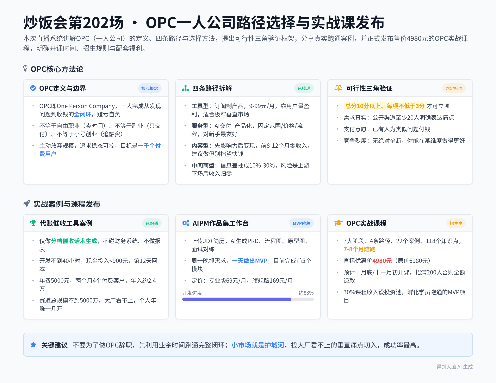

# OPC一人公司路径选择与启动方式分享及课程介绍

> 本条由 2026-09-23 晚 1 段录音合并成一份，合计约 179 分钟；各段来源见下表，主段是时长最长的一段。

## 当晚分段

| 段 | 开始时间 | 时长 | 标题 | 来源 |
|---|---|---|---|---|
| 1 | 2026-09-23 19:54 | 179 分钟 | OPC一人公司路径选择与启动方式分享及课程介绍 | https://biji.com/note/1922186127335235144 |

## 智能笔记

### 段 1｜OPC一人公司路径选择与启动方式分享及课程介绍（179 分钟）

### 智能总结

##### 录音信息
- **录音时间**：2026-09-23 19:54:36 ~ 2026-09-23 22:54:35
- **时长**：约 2 小时 59 分钟
- **参与人数**：约 2 人（主讲+线上观众）
- **内容类型**：课程讲解

##### 录音总结
本次是炒饭会第202场直播课，主讲人分享OPC（一人公司）的路径选择与启动方法，展示了新开发的AIPM作品集工作台项目，发布了售价4980元的OPC实战课程，明确了课程框架、开课时间与招生规则。

**开场互动与直播准备**
* **开场打招呼**：直播开场向直播间观众逐个打招呼，提到已有老学员跳过官方链接，直接通过关系找购买渠道，开课前已经卖出3单。
* **后台商品补挂**：直播开场发现忘记在后台挂商品链接，联系丁宁帮忙补挂商品，设置为隐藏状态，后续手动开启。

**AIPM作品集工作台项目展示**
* **产品功能设计**：该项目帮求职者生成针对性面试作品集，用户上传目标岗位JD和个人简历后，AI会分析匹配度，给出作品方向，自动生成完整的PRD、流程图、原型图，还能生成面试问题预测与对练内容。
* **项目开发进度**：该项目是主讲人在周一晚上11点抓住学生需求后，仅用一天时间就做出了MVP版本，目前仅完成前五个模块，第六模块还未开发，整体处于mock阶段，未正式上线。
* **定价与推广思路**：定价设置为专业版69元/月，旗舰版169元/月，可单次加购；后续计划发展校园代理，一级代理拿直客三成收入，二级代理拿直客三成，一级代理可额外拿二级代理的一成五提成，还承诺给达到量级的代理盖实习证明。
* **项目盈利预期**：主讲人判断该项目几个月内赚到四五万难度很低，只要跑通MVP后通过校园代理模式很容易起量，后续还可以转化培训产品。

**OPC定义与边界澄清**
* **核心定义**：OPC即One Person Company，核心是一个人承担从发现问题到收到钱的全部闭环，赚亏都归自己，可外包单点工作，但决策只有自己；核心目标是做能脱离自身运转、睡觉也能赚钱的被动收入项目。
* **常见认知误区澄清**：OPC不等于自由职业，自由职业是卖时间，收入有天花板；OPC不等于副业，副业只做交付，不需要完整覆盖获客与定价；OPC不等于小号创业，创业追求增长融资，OPC主动放弃规模，追求稳态可控，目标是先做满一千个付费用户就算成功。

**OPC的四种路径拆解**
* **工具型路径**：做自助使用的订阅制产品，适合技术、产品背景的人切入，核心难点是流量获取与付费转化，低客单价9-99元/月，需要靠堆用户量盈利，适合极窄垂直市场，要找大厂不会做的真痛点。
* **服务型路径**：用AI交付原本靠人力完成的工作，需要把服务产品化，核心是固定范围、固定价格、固定流程，把服务拆成可复用模块；典型案例是国外Design Joy的订阅制设计服务，国内有人做单品类转化率提升咨询，单项目报价30万人民币；国内适合切入的方向包括垂直行业小系统、代运营、AI落地服务商、专项顾问。
* **内容型路径**：先积累影响力再做变现，特点是前8-12个月收入为0，最容易入手也最容易放弃，最大的坑是为了流量做内容，偏离自己擅长的领域，最后有流量没沉淀；主讲人建议所有人都应该做，但不要指望快速赚钱，把它当成输出学习、打造IP的方式。
* **中间商型路径**：靠信息差抽成10%-30%，是很多人的第一桶金，包括选品货源对接、需求转接、二手资产撮合、信息聚合等类型，风险是上游下场后收入会归零，核心是要积累客户信任，成为行业内固定的信息转移中介。

**OPC路径选择方法**
* **匹配规则**：有行业背景优先选服务型，有内容渠道优先选工具型，有资源优先选中间商型，啥都没有默认选服务型，服务型对新手最友好，反馈最快、投入最小，做错损失也最少。
* **常见错配问题**：工程师倾向选工具型，容易卡在获客环节；产品经理倾向选工具型，容易做出没人付钱的好产品；运营市场人员倾向选内容型，反馈周期太长；行业老兵倾向选中间商型，容易低估上游封杀风险；所有人都倾向选自己擅长的环节，而不是闭环最容易跑通的环节。
* **核心目标**：OPC第一目标不是赚大钱，而是尽快跑通完整闭环，验证需求、定价、获客、交付全链路。

**OPC可行性验证框架**
* **验证三角模型**：需要同时满足三个条件才值得做：需求真实性（公开渠道能找到至少20人明确表达痛点）、支付意愿（已经有人为类似问题付钱）、竞争烈度（没有绝对垄断者，能在某个维度做得比现有产品更好）；总分10分以上，每项不低于3分才可以做。
* **反面案例**：AI写诗工具、通用型AI写作助手、AI学习计划生成器、AI起名工具这类产品，要么没有支付意愿，要么需求不真实，不适合作为核心盈利产品，最多用来引流。
* **正面案例**：医美诊所AI话术库（299元/月，需求真实、支付意愿强、竞争少）、律师事务所AI合同初稿工具、外贸企业AI英汉客服工具，都符合验证标准，属于高机会方向。

**真实OPC跑通案例分享**
* **项目背景**：一位做咨询的朋友在饭桌上听到代账公司朋友抱怨，每个月催票据要花3天时间，四个会计每人管40家，每到20号就要在群里刷屏。
* **需求验证**：当场问了三个问题：现在这件事花多少人力？现在是怎么解决的？如果解决了你愿意付多少钱？对方脱口而出一年一万块肯定值，5分钟就完成了需求验证。
* **开发与落地**：只做一件事：生成分档催收话术，不做自动收集、不做报表、不碰财务系统，用Deepseek Flash大模型开发，三天就出第一版，总开发时间不到40小时。
* **商业结果**：报价一年5000块，第12天就收到了第一笔年费，两个月后拿到四个付费客户，年度收入约2.4万，现金总投入不到900块，第12天就回本，模型API每月200块，服务器每月60块，域名一年60块；全中国代账行业的总市场规模不到5000万，大厂根本不会立项，对个人来说足够活得很好，主讲人预测该项目每年能稳定赚十几万。

**做OPC的核心价值**
* **能力成长**：做OPC能锻炼判断力，判断力是赔出来的，花自己的钱才能得到真实反馈，快速成长；能锻炼定义问题的能力，适应从执行者到决策者的转变；能获得市场给的外部报价，打破“离开公司你什么都不是”的恐惧，重塑自我价值认同。
* **核心观点**：不建议为了做OPC辞职，建议不必辞职做OPC，初期利用业余时间跑通闭环即可；OPC是普通人能承担的个人实盘练习，能帮你理解公司运营和钱流转的真相，帮你在职场获得更快升职。
* **现在做OPC的优势**：AI降低了生产、搜索匹配、重复协调的成本，一个人就能完成原来需要团队才能做的项目，市场交易成本大幅降低，现在是做OPC最好的时机。

**OPC实战课程发布**
* **课程框架**：课程一共分为商业定位、需求判定与付费验证、外扩构建、商业化、交付与自动化、闭环复利放大、终局七个阶段，包含四条路径、22个拆解案例（14个海外，8个国内）、118个知识点（商业线70个，构建线48个），30个实战产出，每节课完成一个项目节点，总共7-8个月陪跑。
* **课程福利**：报名送半年自媒体工作台、任务在线工作台的会员，搭建学员联盟互通资源，项目如果出现并发问题主讲人兜底解决；如果学员没有域名、主机、收款资质，可以先放在主讲人的服务器和资质下运营，只扣掉必要成本，剩余收入全部转给学员。
* **价格与开课时间**：对外售价6980元，本场直播优惠价4980元，开课时间预计在十月底或十一月初，每周一节课，慢讲不赶进度，要求学员边听边干活；招生要求至少招满200人，达不到就取消开课，全额退款。
* **增值计划**：课程收入的30%会拿出来做投资池，学员跑通MVP、有两个以上付费客户、模型合理后，可以申请投资与战略合作，主讲人会做OPC项目孵化器。

**课程细节设计说明**
* **内容颗粒度**：课程内容细化到动作层，比如发现需求会告诉你具体调研方式，哪三句话问用户，定价会告诉你换算公式，报价现场的四句话话术，甚至告诉你什么时候该闭嘴，什么反应该涨价降价，全部细化到可直接执行的步骤。
* **授课逻辑**：先僵化再固化最后优化，新手直接按照给的步骤执行，先干起来拿到结果再调整，不讲空概念，只讲具体该做什么、该找谁说什么话。
* **配套组织**：如果课程能开起来，计划按地区分设地区负责人，组织线下交流，不追求完全中心化，避免主讲人时间瓶颈限制项目发展。

**现场观众问题解答**
* **域名选择建议**：优先买.com后缀的域名，不要买.top、.net后缀，中文域名是噱头骗钱，域名要和业务相关，方便记忆。
* **抖音/微信小游戏建议**：小游戏自然流量为0，必须靠投流，还需要出版资质，门槛很高，不适合圈外个人做，不建议新手切入。
* **项目合规问题**：个人没有收款资质和域名主机，可以先使用主讲人的二级域名和服务器，通过主讲人公司走账合规，只扣必要的税成本，剩余收入全额返还，最多免费存放一个月，没有收入就关停。

**OPC机会本质**
* **小市场就是护城河**：OPC的机会不在大市场的小份额，而在小到没人愿意立项的完整市场，大厂看不上的几十万规模的市场，对个人来说就是天堂，足够活得很好。
* **核心判断标准**：如果能想出五家公司可能做这个项目，就别做；小到只有你能做，才是最好的OPC机会。

### 章节概要
**00:00:00** **开场互动与直播准备**
直播开场主讲人和直播间观众逐个打招呼，提到已经有三位老学员跳过官方链接，通过熟关系提前下单。主讲人发现自己忘记在后台挂商品链接，联系丁宁帮忙补挂，设置为隐藏状态，准备后续手动开启，随后正式开始直播，本次是炒饭会第202场，主题为OPC的路径选择和启动方式。

**00:07:39** **新课目标与主讲人背景说明**
本次新课的目标是带着大家做D类定位，也就是有收入的稳定一人公司，不是带大家做接单式副业。主讲人说明自己已经亲证跑通了课办、AI PRD两个产品的MVP，目前这两个产品每天都有稳定收入，月度总收入约两三千块，符合大多数人第一年做一人公司的正常水平，不会给学员画一夜暴富的饼，坚持不亲证不讲解的原则。

**00:11:07** **AIPM作品集工作台项目展示**
主讲人展示了自己一天开发出来的MVP新项目AIPM作品集工作台，该产品帮AI产品经理求职者生成针对性面试作品集，核心功能包括：上传JD和简历后AI分析匹配度，给出作品方向，自动生成完整PRD、流程图、原型图、面试问题预测。该项目周一晚上抓住学生需求，一天就做出核心功能，定价为专业版69元/月，旗舰版169元/月，主讲人判断几个月内赚四五万难度很低。

**00:27:28** **OPC定义与常见认知误区澄清**
主讲人明确OPC即一人公司，核心是一个人完成从发现问题到收钱的全闭环，赚亏自负，可以外包单点工作，但决策只有自己。主讲人澄清了三个常见误区：OPC不等于自由职业，自由职业卖时间有天花板；OPC不等于副业，副业只做交付不需要完整闭环；OPC不等于小号创业，创业追求增长融资，OPC主动放弃规模，追求稳态可控。

**00:34:23** **工具型OPC路径拆解**
工具型OPC是做自助订阅的工具产品，是技术产品背景用户的首选切入路径。核心难点是流量获取和付费转化，低客单价9-99元/月，需要靠堆用户量盈利，适合极窄垂直市场，要找大厂不会碰的真痛点。主讲人提出了校园代理的推广思路，给一级代理直客三成收入、二级代理一成五提成，承诺给达标代理盖实习证明，能快速起量。

**00:52:41** **服务型OPC路径拆解**
服务型OPC是用AI交付原本人力完成的工作，核心是把服务产品化，要求固定范围、固定价格、固定流程，把服务拆成可复用模块，要学会拒绝超出范围的需求。主讲人分享了国外Design Joy订阅制设计、国内单品类转化率咨询两个案例，国内转化率咨询单项目报价30万，主讲人梳理了国内适合切入的四个方向：垂直行业小系统、代运营、AI落地服务商、专项顾问。

**01:18:19** **内容型与中间商型OPC路径拆解**
内容型OPC先做影响力再变现，特点是前8-12个月收入为0，最容易入手也最容易放弃，最大的坑是为了流量做内容，偏离自己擅长的领域，最后有流量没沉淀。主讲人建议所有人都做内容，但不要指望快速赚钱，把它当成输出学习、打造IP的方式。中间商型靠信息差抽10%-30%，包括货源对接、需求转接等类型，风险是上游下场后收入归零，核心是积累客户信任，成为行业固定信息中介。

**01:28:30** **OPC路径选择方法与常见错配**
路径选择的匹配规则是：有行业背景优先选服务型，有内容渠道优先选工具型，有资源优先选中间商型，啥都没有默认选服务型，服务型对新手最友好，反馈快投入小。常见错配包括：工程师选工具型卡在获客，产品经理选工具型做出没人付钱的产品，运营选内容型反馈太长，老兵选中间商低估上游风险，所有人都选自己擅长的，而非闭环最容易跑通的，核心目标是尽快跑通闭环，不是一开始就赚大钱。

**01:30:42** **代账催收工具真实案例分享**
一位做咨询的朋友在饭桌上听到代账公司抱怨每月催票要花3天时间，当场用三个问题验证需求：花多少人力、现有解决方式、愿意付多少钱，对方当场认可一年一万块的价值。项目只做催收话术生成，不做额外功能，总开发时间40小时，现金投入不到900块，第12天就回本，两个月四个付费客户，年度收入2.4万，这个赛道总市场不到5000万，大厂不会做，对个人来说每年赚十几万很轻松。

**01:51:14** **OPC可行性验证框架讲解**
主讲人提出可行性三角验证模型，三个条件同时满足才值得做：需求真实性，公开渠道至少20人明确说痛点；支付意愿，已经有人为类似问题付钱；竞争烈度，没有绝对垄断者，你能在某个维度做得更好。总分10分以上每项不低于3分才能做，主讲人举了反面例子：AI写诗工具、通用AI写作、AI学习计划生成器都不符合标准，正面例子：医美AI话术库、律师AI合同工具符合标准。

**02:00:05** **做OPC的核心价值分享**
主讲人提出核心观点：不要为了做OPC辞职，要为不必辞职做OPC，OPC是普通人能承担的个人实盘练习，能帮你理解公司运营和钱流转的真相，锻炼判断力、定义问题能力，获得市场验证的外部报价，打破对公司的依赖恐惧，重塑自我价值认同，即使不赚钱也能帮你在职场更快升职。现在AI降低了生产和协调成本，一个人就能做原来需要团队的项目，是做OPC最好的时机。

**02:09:54** **OPC实战课程整体介绍**
本次发布的OPC实战课程分为七个阶段，覆盖从需求到终局全链路，包含四条路径、22个案例、118个知识点，7-8个月陪跑，每节课完成一个实战节点。报名送半年工具会员，搭建学员联盟互通资源，项目并发问题主讲人兜底，没有资质的学员可以先用主讲人的服务器和资质走账。对外售价6980元，本场优惠价4980元，预计十月底或十一月初开课，要求招满200人否则开课，全额退款，30%课程收入会拿出来做项目投资池，孵化学员项目。

**02:36:27** **课程内容设计细节说明**
课程内容全部细化到动作层，比如需求调研会告诉你问用户哪三句话，定价会告诉你公式和报价话术，甚至告诉你什么时候闭嘴，面对客户反应该怎么调整价格，全部给可直接执行的步骤。授课逻辑是先僵化再固化再优化，新手直接按步骤做，先干起来再调整，不做空泛概念讲解，计划开课后续按地区设置负责人组织线下交流，避免中心化的时间瓶颈。

**02:48:14** **观众问题现场解答**
针对域名选择，主讲人建议优先选.com后缀，不要买.top、中文域名，域名要和业务相关；针对小游戏，主讲人说明小游戏自然流量为0，必须投流还要资质，不适合新手；针对个人合规问题，主讲人提出可以先把项目放在自己的服务器和资质下，只扣必要税成本，剩余收入全给学员，最多免费放一个月。

### 金句精选
- “不亲证则我不讲。” (执行策略)
- “OPC的机会不在大市场里的小份额，而在小到没人愿意立项的完整市场。” (战略洞见)
- “原本要投入500万每年只能挣200万的生意，大厂绝对不干，对一个人是绝对的天堂。” (战略洞见)
- “不要为辞职去做一人公司，要为不必辞职做一人公司。” (思考启发)
- “你在公司里的价格，由你在公司外的价格决定。” (战略洞见)
- “OPC的第一产品是判断力，第二产品才是钱。” (战略洞见)
- “痛点不痛，真不挣钱。” (执行策略)
- “水流不争先，争的是源源不断。” (情绪共鸣)

### 待办事项
- 丁宁：直播后台补挂商品链接，设置为隐藏状态
- 主讲人：十月底/十一月初完成OPC课程全部内容开发，准备开课
- 凌凌：在评论区粘贴课程购买链接

（结束，无`(我)`说话人ID，不输出额外内容）

---

## 完整逐字稿

### 段 1｜OPC一人公司路径选择与启动方式分享及课程介绍（179 分钟）

🟢 说话人1 [00:00:00]
好创意，我已经准备把它加到我的知识库了，加到我的案例库了，那个那个那个那东西真棒。我怎么会不知道你是谁？你这这这化成灰我都认识，对吧？现在的主线任务是变回小孩嘛，对不对？是不是？哈哈哈哈。是不是？我那个是黄的啊，我那是黄的图图。他那个真的就是那个的创意，再加上他那个他那个他那个想法真的是不错，我靠，就是我对于这种小设计真的。

🟢 说话人1 [00:00:33]
还是非常非常喜欢的，非常喜欢。

🟢 说话人1 [00:00:39]
等会我这个捞啊，真的好慢。等我出来时我给你看吧啊。不喜欢？没问题啊，没问题啊。不是，太满了没有问题，但是我觉得金色。我觉得这个风格没有问题。对吧，填的太满了，我觉得这个东西是没有问题的，但是就是金色就俗，我我我我我对于意见也有意见，我觉得没问题，对不对？对不对？就是，所以所以就是千万不要小看我的上下文和长期记忆，你知道吗？

🟢 说话人1 [00:01:15]
我的我的我的长，我的长，我的长期记忆和上下文是是非常好的。张海尔你好，浩海希格你好，莫言你好。啊。他这个概念真的不错，李炳森你好，希你好，阿伟你好。

🟢 说话人1 [00:01:42]
明天节前最后一天工作日。bj 和鸡哥和 b 哥的关系是什么关系？bj 就是他俩是北京的嘛，所以就是来自 bj 的 gb 组合嘛。啊？什么玩具啊？Chris Chris 你好。是那个鲸鱼给我送了一个那个盲盒，但是它里面挂着数字生命。你宣传已经燃尽了，只剩下白色的灰是吗？啊？你去哪宣传了？

🟢 说话人1 [00:02:17]
CC 你好，楠木你好，刘彤你好，小独角兽你好，候鸟你好。你去哪宣传了？没跑到之前的群宣传吧？

🟢 说话人1 [00:02:33]
哦，你宣传的是啥？你你你你你你你你就是哦哦，好好好。菠菜你好，稳健你好，但是说实话就是还是那那句话，能不能行不知道，能不能行不知道。哎，吉米，我我认真的问你这么一个问题，你俩是商量好的吗？你俩是商量好的吗？啊？我就问你这么一个问题，你俩是商，你俩是是是是商是商量好的吗？啊？你你就你知道我我在说啥吗？好，你俩反正可以，你俩可以啊。

🟢 说话人1 [00:03:23]
陆冰你好啊，不是一群洗澡，这两个货就是来自 DJ 的 JB 组合，在这个课讲之前，他们就已经他们就已经下完单了。你们仨你们仨是谁？擦，是仨仨，好好，你们好，你们厉害，你们出去了啊！没人给链接，哎哎，没人给链接，他们就利用他们老学员和鼎鼎比较熟的关系，直接就强要链接，我估计是这样子，我估计是这样子。我估计这三个货可能就是就是利用利用关系比较熟，强调了链接，所以现在这玩意已经卖出，卖卖出三单了啊。

🟢 说话人1 [00:04:19]
估计已经就是已经卖出三单，不是吗？你们直接在小，你们直接在小通系统里找的啊？你们直接在小在小通系统里找的是吗？这诶你好啊？啥情况？为啥我现在就是就是你们，就是我现在有一种感觉，就是我现在对于这个项目吧，因为就就就就就就越来越失控，我有一种越来越失控的一种体感，你知道吗？就是很多事都不是按照我所想要的去发展了。

🟢 说话人1 [00:04:59]
哎，不知道该咋说是吗？哎，丁宁，我我我我我我我要跟你说一事，丁宁，我要跟你说一事，那个我今儿直播忘了在后台挂商品了，你能给我挂一下吗？我没挂商品。然后你挂一下先给我隐藏掉，我一会手工给它点开。我没挂，哈哈哈，我没挂，哈哈哈，我没挂商品，忘了忘了。不是，是好啊好啊好啊，当然好了。来，好。好，开始啊，各位同学，各各位亲，欢迎大家来到每周三晚八点和大家不见不散的场会。

🟢 说话人1 [00:05:50]
今天场会二百零二回，今天给大家讲 OPC 的路径选择和启动方式。嗯嗯，嘉欣，你这名字真好啊，你名字真好啊，对。然后今天呢这个照例给大家讲三部分的东西啊。咱们今天还是正常讲课啊，咱们今天讲三部分的东西，第一部分讲四种 OPC 的路径，第二个讲大家如何自己开启自己的 O 的 OPC 的一条路径，第三个呢给大家讲一讲这个 OPC 的可行性验证框架。

🟢 说话人1 [00:06:23]
先讲这三部分的东西。首先先说一个点啊，首先先说一个点啊。我们先看一个大家的这个这个判断，四种 OPC 的路径，我们首先给自己一个定位。首先给自己一个定位，A。完全没有做过任何有外部收入的事情。B。做过副业，但只负责交付，就是接单式的。C。做过产品，没人付过钱。D。有了稳定收入的一人公司。大家 A B C D 是哪个情况？

🟢 说话人1 [00:06:56]
先给我来去做一个课前的小调研。啊，C 没有做过啊，C 没有做过啊，啊。b。OK，有人干过私活啊，把这个干过私活的圈起来，然后那个我们啊，送过三四次外卖。哈哈哈，这个菠萝你这么辛苦吗？你们你们没有人从，不是咱们咱们把稳定这个事降低啊，咱把稳咱把稳定这事降低，咱们降标准，咱们降标准，你自己做个产品收过钱，咱们就算 d 有没有？

🟢 说话人1 [00:07:33]
有人自己做了个产品，哪怕收过一块钱也行，有吗？哎，贺成好好好好好。好好好，这这就有了，只是它不稳定啊，对吧？OK，鲸鱼也有，逍遥也有，OK，好，一诺好，那才爱看这这，明显这还是有的，我这就把这个东西降一下标准就OK了。啊，知乎那个吧，知乎那个其实不太能算，那个其实我我我回回头有，等线等线下吧，等线下我我给你讲你收的，我我线下我告诉你你收的是啥钱吧。

🟢 说话人1 [00:08:05]
啊好，那我说说，我我这个我先说一点啊，我先说有一个点啊，我们我们也不藏着掖掖着，我们就是做一门新课。我希望带着大家做的是 D 啊，我希望带着大家做的是 D 啊，这个这是我们的目标，而不是要去做 B 我不想带着大家去做副业啊，想带着大家去做的是标准的一人公司的方式。这件事如果是大家有意见可以先提，但是这是我们的在做这个体系端的一个目标。

🟢 说话人1 [00:08:37]
然后第二件事呢，为什么我们说我现在有一点点小小的资格来去做这个 D 这件事情了？因为第一个第一个啊，这个课办这个产品啊，课办这个产品已经连续很多天每天都有收入了。连续很多很多天，每天都有收入，当然每天收入不多啊，每天收入不多啊，所以我想跟大家先把这些丑话说前头，就是我现在这个产品每天早晨都能收到微信，商户系统每天给我提现的这个钱。

🟢 说话人1 [00:09:16]
每天就都有，每天不多啊，现在这个项目一天，每个月的话差不多加起来之后的话，两三千块钱，两三千千块钱。啊，这个是我们认为我们比较理性的大多数人，在第一年一人公司能够去做的一个情况。我不想给大家去做弱，我不想给大家画任何的没有意义的饼。我想跟大家说特别实在的东西，我想给大家说特别实在的东西就是大家做这个公司大概率是做到是这种水平，而不是说你通过这个项目一夜暴富。

🟢 说话人1 [00:09:54]
如果想一夜暴富的，那坦白一点讲，我没这本领，我没这本领啊。所以这个是我们先把这些情况说清楚，然后呢，但是我觉得在这个过程中，为什么我要去做课外。我做课办的一个主要的点，实际上就是我一定要去亲证一些东西。就是反正我我我这个人呢，我这个人呢和这个我在做客这个问题上呢，我可能和很多的人不太一样，我做客的这样一个情况的话，我往往做客比正常的情况要慢。

🟢 说话人1 [00:10:29]
为什么呢？我这个人是不亲证则我不讲。所以呢，我其实亲证了有些东西，目前在我整个的产品矩阵体系中的话，课办和 ai prd 都是跑通了基础 mvp 了。基础的用户的 up 值，基础的 ma 这基础的 dau m a a u 现在都是能够去算得很清楚的，转化率也都能算得很清楚，然后的话它的整个的转化路径周期现在都已经能够去做控制了。

🟢 说话人1 [00:10:56]
相应的这个产品的费效比也都能够去有了，所以这是这里面的情况，并且呢我觉得我在这个过程中真实的积累出来了一整套的这个这个怎么讲呢？叫做就是找这种一人公司的方法论。方法论，然后这个方法论呢，我给大家看一个东西，就是这是我最近刚刚做的一个东西，我认为这个东西呢我在十一之后上线，极大概率又能挣钱。先给大家看一个东西，先给大家看一个东西，好不好？

🟢 说话人1 [00:11:25]
我给大家看看我这两天刚刚正在正在搓的东西。你们评判一下这东西它能不能去挣到钱啊？我搓了个这个东西，我先把它啊。这东西是这样子的，啊正好也借此做个小的需求调研，没推广没推广没推广。嗯，推什么广？没推广，挣到这这这个钱。啊，哎，我就是刻意不推广，刻意不合作，刻意不推广，刻意不合作，我就想去看，纯粹以一己之力做的话，能够做到一个什么样的地步。

🟢 说话人1 [00:12:06]
我先给大家看一下我这个最新做的一个东西啊，大家可以考量一下，这个东西叫做这个 AIPM 作品集工作台，它能干什么呢？问大家一个问题，你们现在在找工作的时候的话，是不是觉得要是有一作品的话，会效果更好？会不会？有没有这种感觉？会效果更好吗？第二个问题是，你们知道做什么样的作品集效果会更好吗？做什么样的作品集效果会更更好吗？

🟢 说话人1 [00:12:35]
我告诉大家一个道理，如果有条件的话，其实我认为是做四个作品，前两个是跟你自己原有项目相关的。第三个作品的话是和对方目标公司岗位相关的。前两个证明你的历史，第三个证明你的诚意，第四个做一个你自己兴趣和研究方向，并且有点炫技性质，第四个证明你的实力。带着这四个作品去面试，我相信整个的转化率一定会变得高。赞同我这个观点吗？

🟢 说话人1 [00:13:05]
也就是说之前大家可以去说，OK，我要个性化的去写简历，好，卷吧，现在不就是工作不好找吗？卷吧，卷，照死了卷，对吧？那好，我我在作品上我做成个性化级别的作品行不行？啊，做到个性化级别的作品行不行？好，好是好，但是自己太累了，对不对？怎么办呢？那好能不能做成这么个东西呢？哎。

🟢 说话人1 [00:13:40]
考我密码是多少？等一下啊，自己瞎改密码又给改错了。来，这。这个东西是能干什么呢？给大家长长眼啊，大家大家可以去提意见。我这里面呢，我就先拿一个我已经干完的东西，我给大家看。你在这边上传你的 JD，上传你的 JD 啊，上传你的 JD，上传你的简历，简历和 JD 都有了，AI 帮你做分析。分析什么呢？分析你的目标 JD 需要什么样的能力，分析你的简历有过什么样的经历。

🟢 说话人1 [00:14:17]
你的经历匹配能力是否符合你自己 JD 相应的这个要求的希冀。对吧？这些咱们就不说了，这些东西的话，咱们在之前都已经给大家搓过了，这东西不重要。好，根据你的简历，过往的经历，根据这个目标的 JD 他所希望你的能力，两个东西整合起来，AI帮你确认一下你的作品应该选择，方向在哪里。诶，给你几个方向，比如说我按照我的经历，他告诉我，你可以做一个漫剧剧本的 RED 引擎，私域投流素材智能体，短剧内容合规护栏助手，AI 选品与短剧衍生 agent 分别的理由。

🟢 说话人1 [00:15:06]
目标用户分别用了大模型的什么样的能力，多长时间能做完，是挑战级的，是进阶级的，是入门级的，全都出来了。好，我比如说我就选的是这两个，生成了作品方案，我这因为我就不占用大家的时间，然后我把我生成好的直接给大家出来。我要做一个爆款剧本 RED 引擎，从剧本文本到可流可投流，漫剧分镜的自动生成。然后目标用户场景和痛点，作品是什么？

🟢 说话人1 [00:15:34]
大模型所用的技术在哪里？产品设计的核心的要点难点和克服方式解决了什么问题？产品经理你要是跟对方去面试讲的时候的话，整个讲解的脚本是什么？然后交付物的清单，实施的里程碑，你的后台怎么搭建的，评测体系是怎么出来的？里面你的 prompt 怎么管理？prompt 的 AB 怎么去做的？测评的清单管理，评测的核心流程，角色和权限控制全都帮你设计好，然后设计好完之后，这个东西还不够好。

🟢 说话人1 [00:16:06]
整体帮你把完整的你的产品的组织架构，就是你产品的完整的这个图表全给做出来。啊，这些流程图啊，这些核心的这个图的结构啊，然后业务的工作流图啊，而且你要是不会的话，你点一下这里面全告诉你这东西该是什么样子。然后每一个步骤什么样的情况，给你讲的明明白白的。为什么这样去做呢？因为你知道你这个业务的现状是这个样子的，现状是手工的啊，这个等成品的上线，然后所以说你还可以做做对比，原有是这个样子，现在是这个样子，你做了什么样的 AI 改造，你能给人盘的明明白白的。

🟢 说话人1 [00:16:44]
好，做完这个东西还不够，帮你把 prd 去做完整的生成，然后。你的需要的评测的结果，再到你的整个的一个实验的结果全都有。好，这个还不够，我们帮你把做这个的 web pro，probing 的 prompt 完整的给你做出来，完完整整的做出来，我们给大家看一下，我就把这套东西，这个 prompt 直接扔给我的这个亲爱的 cloud code 它能给你做出来什么样的一个效果呢？给大家看一下我

🟢 说话人1 [00:17:12]
这个 run 起来一个是个什么样子啊？

🟣 说话人2 [00:17:23]
但是一旦你会发现，

🟢 说话人1 [00:17:25]
这是我就是完全没有做任何的改动，然后直接跑起来的这个状态。

🟣 说话人2 [00:17:32]
还有一个方法。那么光有。然后你仔细看，你发现东西跟 AI 产生。

🟢 说话人1 [00:17:37]
我一会儿先跑一趟啊。然后。如果你觉得哎呀，这个东西太麻烦了，还得拿外坡地。那好啊，我们先给你一套，直接在这上面能够去做的简单的原型图。做一个简单的原型图，对吧？然后呢如果你想做作品输出，啊我想在原型图上去改自己的风格啊，对吧？有不同的风格可供你选择，然后做作品，那你输出你自己喜欢什么样的颜色，自己在那儿去选，我喜欢蓝色对不对？

🟢 说话人1 [00:18:06]
对吧？然后蓝色，然后把几个这个作品的描述做去做生成，帮你把完整的你的这个带。原型图带，流程图带相应的工作经历和项目背景的这些东西全给你做出来。然后呢，面试时基于你这两个的作品，用人经理和HR分别会问你什么样的问题，你的薄弱点和反问可能在一些什么样的点上，然后你可以跟他去做对练。同时呢，你也可以看看别人都做了一些什么样的作品，你自己简历的这种，这个相应的针对性修改，我打算做成免费的就算了，然后你也可以直接去做作品，如果没有什么想法的话。

🟢 说话人1 [00:18:46]
切换到启发模式，它能够自动的话，帮你按照 plan 的方式来来去做，然后你自己所做的所有的这些作品的话，都可以存到你自己的仓库里，以后不管是在公司里去用，还是在面试里去用。都可以起到相应的这样一些作用。这是我们目前的这个项目，然后我们看一下这个，这是我拿它直出的，拿它生成的 prompt 直接丢给了这个这个这个 cloud code 只做到了前五个部分，第六个部分我为了省点 token 还没有去做。

🟢 说话人1 [00:19:14]
给大家看一下它这个效果啊，一键诊断这个东西啊，然后现在还只是 mock 我没有去接东西，现在是 mock 啊，查看诊断报告相应的一部短剧，哪里好哪里有问题，提的所有的东西都出来了。这个东西你可以说这是 mock 的，但是我问你，你这个东西本来就是在作品集里去集的，对不对？你说你没有接受到公司真实的环境中，这不是很正常的一件事情吗？

🟢 说话人1 [00:19:42]
所以同学们，你们觉得我这个东西问哪两个问题？第一个，这东西能挣钱吗？你们愿不愿意买？不是送给你们，能不能买？我不给 GitHub 对不对？觉得愿意花多少钱买这个？觉得愿意花多少钱买这个的一个月的会员？

🟢 说话人1 [00:20:11]
觉得一个月会员愿意花，愿意给我多少钱？

🟢 说话人1 [00:20:20]
哎呀，来。专业版69，旗舰版169。如果不够，还可以单次加购。不黑吧，兄弟们？不黑吧？不黑吧？是不是不黑？是不是不黑？咱们认真地讲，做这么一个东西，是不是立刻马上能够挣到钱？咱们认真地讲，立刻马上能够挣得到钱。后台啊，我现在我现在没好好做，我现在后台接的 deepseek 我打我打算把它接三个不同的东西。

🟢 说话人1 [00:21:01]
我现在的打算就是说它的基本的东西是拿 deepseek flash 先顶着，然后到去做这个 prompt 的时候的话，我打算用智谱和 kimi 去测一轮，然后的话它去生成那个那个 demo 的时候，拿智谱或者是拿 kimi 这样去做，基本上是这样子。啊。哎呀，这你不是持续求职，应该不会买太久，你有想过你到公司里也会拿这个东西继续招摇撞继续招摇撞骗的样子吗？

🟢 说话人1 [00:21:33]
哎，就是你有想过在公司里上班。你有可能就离不开这个东东西了吗？有没有这种可能性？有没有这种可能性？啊？你真以为这东西光是给给光是给你去做作品的吗？它最后这个这个东西是个生产力工具啊亲，这东西是个生产力工具啊，对不对？好，所以同学们，各位亲们，就是我们先说一点，大家认不认同，在现在这个状态下，你事实上是有方法通过一点点错的东西，直接就可以把这东西去做出来，你们知道这东西我做了，我什么时候开始做的吗？

🟢 说话人1 [00:22:14]
大家猜猜我这个东西什么时候开始做的？猜猜我这个东西是什么时候开始做的？

🟢 说话人1 [00:22:26]
做到这个地步，没有这么离谱，没有这么离离谱。我是在周一晚上11点开始做的，周一晚上11点我去做的。为什么是这个时间做的？周一晚上知乎的课，我下完之后，在群里有三个同学在那讨论作品集的问题，我发现作品集是个痛点，然后。我就开始做了这个东西，我就开始做了这个东西。真实的，周一晚上11点，那天我就不能算，所以核心点其实就是昨天一天把这玩意做出来了，今天今天其实没做太多，今天做了点小的细节，收尾，昨天一天完成，一就是严格的说就是昨天一天完成的，这个当然我昨我昨天还在干别的事啊，这是我昨天一天的作品。这个玩

🟢 说话人1 [00:23:17]
意我认为我认为他在几个月中给我挣个四五万块钱不难啊，这个东西，这是非常确认的一件事情。所以咱们同学问一个小的问题啊，小的问题，你们觉得你们缺什么？你们觉得你们缺什么？你们肯肯定说，老师，这是因为你有流量，我没流量怎么做？社会啊？会会说这句话吗？会说这句话吗？我告诉你们，我告诉你们，其实你们本质上不缺这个流量，知道为什么吗？

🟢 说话人1 [00:23:54]
知道原因是什么吗？就是，说白了，你如果咱们这儿有很多同学都是从知乎过来的，你们也都能看到你们的同学，甚至是自己缺不缺这个功能？缺不缺这个产品？你缺了，自己做出来，然后跟我说这样一嘴，老师啊，我希望能够去推这个产品，你能帮帮我吗？我就我我就不帮，我就不帮。啊，我最多最多舔着个脸，我跟你说可以啊，那我分你，那我分点成行不行？

🟢 说话人1 [00:24:28]
对不对？你本质上不缺流量。就是大家一定要去想明白一件事，就是我的资源。啊，其实本质上你们是可以这样去用的。对不对？对不对？所以你们。因因为我有脑子，那你的脑子不用能给我吗？哈哈哈，对不对？所以。对吧？所以这是我今天想说的第一件事，大家其实很多时候不缺流量的，不缺流量，这个这个玩意儿。这个玩意儿，对吧？

🟢 说话人1 [00:25:01]
说白了没有这么难去做，但是这个想法一旦出来之后，瞬间一天你就能把它。做出来，然后你就能去干这个活儿，我觉得没有这么难，对吧？包括当然你可以讲，确实我有一点点走火入魔的嫌疑，尤其是连这次的这个课程介绍的这个大纲，其实都已经变成了这种纯 web 的这种方式。啊，你们你们是怎么看待？对吧？就是你有什么不好意思跟我说的，是怕我抄你创意吗？

🟢 说话人1 [00:25:32]
是怕我抄你创意吗？就是同学是这样子啊，就是就是我我这个说有一个小的点，我这个我我这个也不是说炫富，但是我真不缺这个钱，我就是如果说你能够跟我说一想法，我帮你指点两句，然后你能挣钱。远比我自己挣那钱，我开我开心的多，我真的是开心的多，这是这是我说我说的很实在的话，我对于看到你们挣着钱比我自己挣着钱，我是更开心的，我我真不抄你们创意，真的啊，我真的不抄啊，对吧？

🟢 说话人1 [00:26:06]
这个你们大可以放这个心啊，我我自己的创意都还没做完呢啊，对吧？来，对吧？你就觉得自己做的不好，我这个做的好吗？我这做的糙的很，糙的很，一天我能做出啥来？我这不是糙的很吗？对不对？糙的很的一个东西，它只是他他他他他他，一个一一个0~1，MVP 的东西，不要考虑它糙，而要看你的这个洞察有多深，洞察是关键。

🟢 说话人1 [00:26:36]
我有很多的时候，哎，这这这在我的标准这玩意糙的，就是我有很多的时候，这个东西我有时候也未必能够发现出来这个这个痛点，对吧？就是我做闭环是很强的，但是我我的第一版往往很糙，糙完之后就让你们去看，看完之后我才会去改。明白了吗？明白了吗？对吧？对，大家会跟我说啊，首先我们先说一个问题啊，我们拉回去讲课啊。选第一个问题，OPC 是什么？

🟢 说话人1 [00:27:07]
OPC 是什么？啊，OPC 是什么？我们首先说一下 OPC 的定义，one person company，one person company，一人公司，现在是最火的这个东西啊，然后一个人承担一家公司的全部职能，这是它的核心逻辑，它的完整逻辑是从发现问题到收到钱。从发现问题到收到钱，这是个闭环啊，这个才叫一个 OPC 啊。

🟢 说话人1 [00:27:35]
所以六个环节都需要在你身上，你这要承担一些东西，就是赚多少归你，赔多少也归你。对，这是它的一个特点啊，它没有工资兜底这件事，一个人他可以买工具，也可以外包单点，但是决策部分没有第二个人。就这里面去说啊，我在做 OTC 的时候，我已并不是说每件事都我自己干。咱们这个先说明白一点，为什么？比如说我也有技术啊，因为说句实在话就是我这个情况跟大家不完全一样，但是我的技术是帮我去解决什么样的问题呢？

🟢 说话人1 [00:28:10]
帮我去解决服务器啊，并发呀，这样一些已经跑出来之后，它突然卡死的事，比如说像客办居然给我出现了一这样一次。啊，客办给我出现了一次什么状况，你们知道吗？客办给我出现了一次，因为在瞬间进入量太多，导致数据库连接时被打死，活活被打死的这个状况。所以这些事情的话，就让技术给我去搞定，我觉得这事是没问题的，对吧？

🟢 说话人1 [00:28:36]
这件事是没问题的。其实十八很多 app 有适配的需求，你看到这个痛点，但是没法做产品 MVP 为啥没有办法去做产品 MVP 啊？为啥没办法啊？啊，不是，就是流量被打死不代表超，流量被打死不代表超啊。什么叫连接池被打死？就是我们一开始在数，数据库层面没有做太多的优化，导致同一时间有一个数据库的搜索请求，它占用的时长比较长，导致在同一时间有大量的注册的时候的话，会使得整个的连接池连满，使得后面人注册不上。

🟢 说话人1 [00:29:17]
会出现这个。个人对公司不好，其实这个这个这不是说你做不了产品 MVP 是这个事儿，这钱你挣不着，我这么讲吧，这钱你挣不着。这个钱，这钱不是你能挣的钱，对吧？作为一个公司，必须有客户，有定价，有交付，这是核心的逻辑，对吧？没有客户，那个叫作品，那东西不叫公司。啊，对吧？这个没有客户，它叫作品，不叫公司。

🟢 说话人1 [00:29:52]
这有三个有常见的误解，有人会认为这个东西啊，就它等于自由职业，不是的。自由职业是按人天卖时间，你的收入就是天花板，就是你的365天，这叫自由职业。然后呢，OPC卖的是一个一定是脱离你可以运转的东西，你比如说课外，比如说我现在如，我我现在已经基本上我已经不在上面去加功能了。啊，现在我只是在这个商业化和推广项上在在在做东西，对吧？

🟢 说话人1 [00:30:19]
对吧？然后我现在已经可以脱离我，他一直能给我去挣钱了，对吧？然后区别是什么？你睡觉的时候，这个东西他给不给你赚，来去赚钱。所以我认为我要去讲的 OPC 是脱离你，你睡觉他也能给你去挣钱，这才叫 OPC 他不是说你出卖自己的劳的劳动力，你要天天接活。啊，这个我们先把所有的边界条件，咱们说清楚，说你就想做一个别人给你发活，你把那活干完之后还。

🟢 说话人1 [00:30:50]
这不是我们要去讲的范围，我们要讲的是能够去通过产品化，商业化做被动收入的方式啊。第二个，OPC不是副业，OPC不是副业，副业是什么？是多赚一点。是你通过副业比以前多赚一点，OPC的核心叫完整跑业。副业可以只做交付，比如说我给你一个活儿。对吧？比如说啊，我们打一个比方，我说炒大会，我想去做一点这个内容的输出，我找一个文案写得比较好的同学，我说那好，你帮我每一期给我整理出来一篇文章，然后给我写到公众。

🟢 说话人1 [00:31:30]
号上，我给你一个保底加收入的方式来来去做。保底就是我每个月给你多少多少钱，或者每天我给你多少多少钱，然后再加的绩效呢，就是这一天的他的这个月，他的月点赞和这个这个这个这个他的加粉达到一个什么样的值，我再给你来去这个发奖金。这个活儿啊，这个活儿要是有人干的话，你不要认为这玩意儿叫 OPC 这玩意儿叫副业，这玩意儿叫副业，对不对？

🟢 说话人1 [00:31:59]
他你没有产品，你只是接了我一活儿，对吧？你只做了这里面的交付部分，严格的东西的交付，这叫副业。啊，有人愿意干这活吗？啊，然后所以 OPC 必须要包含定价和获客，它必须是一个完整体系，而不是会了一门手艺，我这有一接单渠道，不是这样子的。等不等于小号创业呢？我告诉你，OPC 也不等于小号创业。也不等于小号创业，因为创业是追求增长与融资的，需要把不确定的东西放大。

🟢 说话人1 [00:32:31]
但是 OPC 追求的是稳态和可控。同学们注意，OPC 追求的是稳态和可控，而不是增长与融资。如果你想通过 OPC 告诉我，老老师我这个东西要要融多少多少钱，要持续增长。那这件事情的话，我们得另外的来去聊。所以 OPC 咱们要做，要主动放弃规模。要主动放弃规模。卡兹克不是 OPC 卡兹克是创业，卡兹克是创业。

🟢 说话人1 [00:33:06]
啊，所以他必须主动放弃规模去做创业。OPC能不能放大？OPC能放大，但放大的 OPC 可放大，但是我想说的，你在做的第一天的时候，先不考虑放大的事，能不能做到，就是如果你第一天就要规划。要去考虑，必须要放大，那我认为这不就不是 OPC 的逻辑，这是个创业的逻逻辑。第一天，你做 OPC 先主动放弃规模，你认为你这个产品就是一千个人才能用，这个用等于付费啊，就一千个付费用户，你把这件事做做实了，做实这件事是我认为 OPC 的目标。

🟢 说话人1 [00:33:46]
过程中你发现这东西火了，火了算赚的，而不是第一天就想要有十万人去用，这是我认为的逻辑。这是我认为的逻辑，实体工实体产品用 O 用 OPC 我觉得很难，我觉得很难，但不是不可以，很难，它的门槛要比。纯虚的要要高得多，要高得多，明白吗？所以这里面为什么我把它拆得更加细一点，原因是在于就是创业我也做过，然后呢，副业严格说我也做过，所以这几个东西的逻辑，我们把它拆得更加明确一点，我要把它拆得更加明确一点。

🟢 说话人1 [00:34:23]
所以 OPC 我今天先给大家去讲方向，看看大家能不能去做，如果发现这四条路跟自己都没啥关系啊，咱们也别非要强求，这四条路是这样子的，工具型，服务型，内容型和中间商型四条路径。哎，我一说这个东西放大不了规模的话，这咔嚓一下掉了十掉了十几个人啊，你们知道吗？掉了十几个人，我觉得挺好的，我觉得我这个课其实本质上我我想做的是筛选，而不是说扩大。

🟢 说话人1 [00:34:52]
因为是这样的，我说我想我就是我如果为了追求这个课的利益最大化，我的难度并不大，我可以很撒欢儿的讲，你知道吧？我可以很撒欢儿的讲，我说这个东西就是你能够，卧槽，这个年薪百万的一条路路径，对吧？走上事业巅峰的可能，对吧？谁不会讲呢，对不对？我我今天反其道而行之，我要把这东西收，照死了收，照死了收，就是这你能接受，咱们再去聊，这这东西，这东西咱们先照死了收，收完之后咱们再去说别的，好不好？

🟢 说话人1 [00:35:34]
啊？然后四条路径，你看你是否符合工具型，服务型，内容型和中间商型。啊，然后首先是工具型，什么是工具型？工具型就是做一个能自助用的东西，等人来订阅。啊，做一个自助能用的东西，等人来订阅。有点像我的课伴，对不对？有点像我的 AI PRD 有点像我的 webflow。有点像我现在做的各种类型的产品。绝大多数人做技术，做产品背景人的第一反应都是做工具型，咱们认不认同？

🟢 说话人1 [00:36:08]
是不是大家尤其做技术产品的同学，第一反应就是我先做个工具。啊，找到痛点，做出产品，等着收钱，爽不爽？爽极了。这里面有一点小的难点，就是怎么让别人找到你，你的流量从哪里来嘛？对吧？你的流量从哪里来嘛？对吧？流量问题是这个最大的问题，第二是转化问题。你流量来了，你怎么去去，人家不一定会买呀，同学们，我我再告诉你们一个其实更可怕的事啊，我这个我这个要戳穿一些东西，流量来了，对吧？

🟢 说话人1 [00:36:42]
人家也未必会买。第一个你的定价到底对不对？第二个你的引导到底对不对？第三个你的价值突破点行不行？第四个你有流，你的流量精准度行不行？第五个你在产品试用和它的转化路径上有没有去做设计？这里面有很多的东西，我告诉大家一个比较悲催的东西，不是你没有流量很悲催，是流量来了之后都不买，白嫖你才是更悲催的事。知道吧？

🟢 说话人1 [00:37:09]
知道吧？我是四种的综合体啊，我不是四种都都的都跑完了话，我会给你敢讲这课吗？对吧？就是有些同学是没流量，但是有些同学找到流量，他不转化，其实你就知道这个有，你很多同学卡在不是卡在了流量上面了，其实是卡在转化上面了。啊，是卡在转化上了，流量那个展开说说，我告诉你一个东西，就是为什么叫做有的流量来了之后，他并不转化呀？

🟢 说话人1 [00:37:38]
就是有的流量有的流量来了就是纯买票的，这东西跟你的渠道是有关的，跟你的渠道是有关的，明白吗？是跟你的渠道是有关的啊，对吧？人群不对，然后痛点不痛，其实更可怕的是你的痛点不痛。你做的这个功能有没有价值啊？有价值，valuable，但是没有痛到他要花钱的地步，也没有痛到他立刻要花钱的地步。我就说一个点，为什么我？

🟢 说话人1 [00:38:06]
就是你们刚才看到了作业，就是去做作品这件事，立刻就想花钱，对不对？我相信你们不是为了捧我，是真的有花钱的动力，对不对？知道为什么吗？知道是为什么吗？为什么在这方面有花钱的动力？其实我这个方向做的都是很难的方向，为什么这是很难的方向？我要在 C 端的 agent 里面抠出钱来啊！这可是难上加难的东西啊，这是很难的事情。

🟢 说话人1 [00:38:37]
对吧？为什么我能在 C 端 agent 抠出钱来啊？对吧？因为这个痛点一是你足够痛，二是你做完之后你的预期有足够大的价值。这两件事共同打造了这个东西，你立刻觉得这东西我花点钱太值了，我花点钱太值了。甚至反过来讲，我跟你说一个道理，这个产品定价都不能定得太便宜，真真定到一两块钱，你不敢用。所以这里面的心智，痛点，定价，触达线路，过程中的所有的链路的设计，其实都是。

🟢 说话人1 [00:39:17]
所以我认为这些东西其实是要去给大家去解决的问题。然后商业逻辑在里面要去拆解，收入结构，低客单价，9~99块钱每个月的，需要靠堆数量才能去做到，这个就是你做工具类的一个问题。一百个付费用户，一个月就是3900块钱，一百个付费用户就是3900块钱，我问你一个问题啊。你们接不接受？其实一百个付费用户是很多工具型的一个小天花板。

🟢 说话人1 [00:39:49]
一百个付费用户就是很多工具型的小天花板。排除不了，排除不了。对吧？最大的坑就是免费用户的获取，你从哪去搞免费流量去？对吧？第二个是付费用户的转化。你，付费用户有多高的转化率，他一定是能转。一千个免费用户，有可能你转了一个付费用户，你你们相不相信？一千个免费用户可能转了一个付费。你说你那时候的话，心疼不疼？

🟢 说话人1 [00:40:17]
遭罪不遭罪？遭罪不遭罪？所以我告诉你，你能做到100个付费用户，你真的是完全可以找我来，那很棒的了，是很棒的啊。生财有术是吧？我我的逻辑跟生财的逻辑完全不一样。完全不一样。对吧？一百一千个免费用户和一个付费用户间，其实没有必然通路，没有必然通路。我和生财的逻逻辑完全不一样，就是我和生财有术的理念。不一样，它适合什么样的人？

🟢 说话人1 [00:40:52]
其实工具型适合有稳定内容流量的人，或者你做极窄垂直市场。我的课班也好，我现在做的这个这个作业也好，就是作品也好，都是极窄垂类市场去做到的，对吧？大厂不会做，一定是大厂不做的一件事，对吧？它的核心能力就是市场洞察。也就是说，你能够很强烈地找到一个群体，他的明确的真痛点。真痛点，真的，真痛点。然后特别是能付费的痛点。

🟢 说话人1 [00:41:27]
我再告诉你们一个东西，我这个作品，这个作品剪辑，我要真好好做，我就能够突破我 OPC 的瓶颈。我我要好好做，我一定能突破 OPC 的瓶颈，你们知道我靠什么吗？你知道我靠什么吗？我只要 MAP 跑通，我第二步我会做一件事情，我就一定是能够突破这种所谓的百人千人的瓶颈。我这个产品如果真的好好做的话，我是能挣好多钱的。

🟢 说话人1 [00:42:00]
你们猜猜我要干什么吧？第一部分是是是是是是是市场洞察，找痛点，特别是能付费的痛点，做什么平台啊？不投流，不投流，坚决不投流，坚决不投流，投什么流啊？我告诉你，我告诉你，咱们今天那个幸运体和李星星在不在？幸运体和李星星在不在？我刚才看到幸运体在呢。

🟢 说话人1 [00:42:34]
你你们俩在是吧？就我刚才演示的那个作品集，第一个你们俩需要吧？第二个，你俩愿意成为我的校园代理吗？给你们分三成，收入给你们分三成，干不干？你可以是一级代理，你的下线所拿的东西再给你一成五，不，必须得分，不分没有意义。你作为一级代理，拿自己直客的三成，加上二级代理的一成五，二级代理他自己拿三成。只准做二级分销，不做三级分分销。

🟢 说话人1 [00:43:17]
这项目我直接能做炸了它，你们信不信？这项目能做炸了它，现在大学生，我操，鸡毛工作找不着，拿我这个东西，对吧？不贵啊，一百来块钱啊，一百来块钱就算买买俩月两三百块钱，对不对？很容易上规模，拿完规模我还知道他现在的情况是什么，后面再给他推一轮培训。这单体项目这是能老挣钱的啦，这能老挣钱的啦。明白吗？这这是什么？

🟢 说话人1 [00:43:51]
没什么了不起，但是说句实在话，各位亲们，你们刚才谁能想得到这个招？对吧？对吧？直接就干这个事情就 OK 了。对吧？因为什么？大学生这件事最密集，大学生去做做校做校园代理，这样很很容易。我再给我的大代理们再做一个许，再我再做一个承诺，我再做一个承诺，盖我公司的实习章。你看我怎么办？对不对？对不对？对吧？

🟢 说话人1 [00:44:20]
大代理们达到多少单了？有多少个下线了？我给你盖个实习章啊，代理发展再多一点，我给你盖好公司的实习章，对不对？你看一下他们有没有动力嘛？你看一下他们有没有动力嘛？对不对？所以对吧？我给你盖 Kimi 的对不对？我给你盖 Kimi 的，哈哈哈。盖哪门子爱奇艺的？盖 kimi 的。

🟢 说话人1 [00:44:59]
对吧？我找我 kimi 的朋友，对不对？盖个盖个这个章。那，性问题那不杀疯了啊？那，那不杀疯了啊？对不对？哈哈哈。对吧？对吧？你的定价，转化路径，都去搞，对不对？对不对？然后流量，精准流量怎么去搞？持续怎么去扩，这些才是他的核心能力，这些才是他的核心能力，理解吗？这是他的核心的一套逻辑啊，这是他的核核核心的一套逻辑啊，对吧？

🟢 说话人1 [00:45:35]
比如说我的课伴儿，课伴儿这东西咱们实实在在讲，咱们这么就是我没挣什么钱，但是每天都有收入啊，每天 every day every day I have a revenue 对吧？我认真的跟大家说一个道理，我认真的跟大家说一个道理啊，说说一个小小的道理，就是当你每天早晨起床的那一刻，打开手机微信，能看到有一条微信商户号提款记录。

🟢 说话人1 [00:46:03]
那那一时刻的感受，我告诉你们，我很难给你们去形容，因为你们没有感受过，你们知道吗？啊，就是你会有，你会每天早晨有一个盼头，知道吗？他多与不多不重要，你觉得反正。反正咱认真的说，这一一天的这个收入，反正我每天，我给你看看，你看，你们想看看吗？咱们任何东西，咱们拿真的说话，不跟有有的老师似的，没有挣过钱，然后在这给你讲挣钱的课。哈哈哈哈。

🟢 说话人1 [00:46:39]
对吧？对吧？对吧？没有挣过钱给你讲挣钱的课，我觉得哎，来。来，不多，今天不多，今天不多，今天是，69块一，昨天是，哎。昨天是224块九毛六，前天是316块一毛三，大前天98，然后997，然后78 205 156 78 136 431。就是你觉得反正这玩意吧。他也干不了太多的事，但是一天的饭钱知道了。这个不是他们，微信还要扣点的，微信要扣点的，微信要扣点的。

🟢 说话人1 [00:47:26]
怎么会对这点有感觉？是这样子的，是这样子的，是这样子的。大家要去接受一些事啊，大家要去接受一些事。我呢，其实呢也没有啊，就是我对这件事也挺开心的，原因是什么？大家去接受一件事，我确实挣了很多的钱，这个我也我也不用瞎说。啊，我呢，但是我挣钱呢。我我没有这样收过钱。我当年做过这样的业务，我在爱奇艺做会员，其实是这个样子的，但是这钱不打到我自己兜里，我没有感觉，对不对？

🟢 说话人1 [00:48:03]
我没有感觉，然后我也每个月去挣工资的，对不对？然后后来呢，我我这个这个。在炒饭会每年讲课，我就是每年那一个月拿到好多的钱。完事了，我做顾问每个月给我钱，我投资项目每个月半年甚至年给我一大笔钱。啊，我我也没有每天能够看到有一个东西哒哒哒哒哒哒哒哒去进账的这个状态，你们知道吗？所以我我看着也挺开心的。就是就是就是他确实在我的收，他在我的收的收入构成里，我都不记，我我都并不记，你知道吗？

🟢 说话人1 [00:48:44]
但是他确实让我很开心，这是我谈得很谈得很诚恳，我谈得很诚恳，我之前也没有得到这种每天能够有有钱的，因为就是我做客也好，做什么也好，我其实本质上是浪潮式发售。对吧，就是我这卖完之后，我很久很久我就不不用去管那那个单笔钱确实很大，它很刺激，但是我每天我告诉你，它不是意外之财，它不是意外之财，它是流水不争先，争的源源不断。

🟢 说话人1 [00:49:15]
它让我有一种很稳健踏实的，稳稳的幸福，你们知道吗？你们知道什么叫做稳稳的幸福吗？就是我在做客的话，其实是一种特别大的刺激。特别大的刺激，像我们的这种这个这个这个这个 day 零就是我们的发售日，我这一我这单个晚上的话，我卖出来大几十万上百万，其实都经历过，没有什么，就是它很刺激，但是呢。我告诉你，那个刺激之后，那个刺激之后，人其实，反正我这个，今天这说的多了，但是我觉得其实我们要去修复人和金钱之间的关系，那个刺激之后啊，人其实，反正我的感受并没有那么好，你们知道原因是什么吗？

🟢 说话人1 [00:50:00]
你们知道原因是什么吗？是，因为你知道这个的刺激是再过很久你才能再有一次，下次还有没有不知道，这种浪潮式发售，刺激归刺激，但是人是越来越不踏实的，或者是人越来越没有这种感觉的，你们懂吧？你们你们能懂这个点吗？但是但是这种每天，两百块钱，三百块钱，两百块钱，三百块钱，哎今天少点，也能到百。说句实在话，人是很踏实。

🟢 说话人1 [00:50:28]
人真的是很踏实，会觉得诶，就是我这永远有一笔这样的一种感觉，他他是给我一种很很血清素的感觉，而不是那种咔一下那种嗨到爆，知道吧？他不是这个样子的，所以所以我想给大家的，我想给大家的是这种稳稳的幸福，而不是一朝成名，咱们把所有的边界条件，咱们都说清楚。啊，咱把所有的边界条件咱都说清楚，对不对？就是我认为这种东西，反正我也啥都经历过，按月挣挣钱咱经历过，啊，一单笔到账大几十个咱经历过，一天晚上上百万咱经历过，这种稳稳的幸福我也经历过，我觉得这个东西很踏实。

🟢 说话人1 [00:51:14]
我觉得这东西适合你们啊，这东西很好很好，这东西很好，每天每天早上起来，你看两百，三百，就真的很开心，你们知道吗？对吧？然后这是我的课办的付费转化逻辑啊，二十九季卡七十九，年卡二九九，对不对？对吧？我告诉你一天上百万，你现在觉得能承受，我告诉你你承受不了。我这个不是说，不是跟你杠啊，承受不了，那个东西没有你想这么的，没有想象你这么简单的事，没有你想这么简单的事，而且你到一天上百万，我告诉你吧，我告诉你吧，你会招苍蝇的。

🟢 说话人1 [00:51:55]
你会招苍蝇的，不是不快乐，不是不快乐，是你会招苍蝇的。你听我，就是这句话你可能不喜欢，但是我告诉你会这样子，就是。小儿抱金过闹市，小儿抱金过闹市。你会，你捂不住，我就直接告诉你捂不住，你不要认为你能，你能捂得住。怎么推广，我一会一点一点跟大家说，别着急别着急啊。这这一定会被盯上，一定会被盯上，这就不用去想，一定会会被盯上。

🟢 说话人1 [00:52:32]
课讲不完就不讲，课讲完就不讲，我现在才讲了17页，现在47了，今天课肯定讲不完了，完蛋了，对吧？然后第二种呢是服务型，服务型是什么？就是。用 AI 交付原本人力堆的工作，这个模式我告诉你其实被严重低估了，被严重低估了。听上去像外包，不是产品，但是这个东西其实特别适合大家去干。特别是可以按照产品的逻辑做，四个判定依据就是咱们做服务型不是不能做，告诉大家一个逻辑啊，有没有为了拿单答应范围之外的事？

🟢 说话人1 [00:53:09]
报价之前要不要问大概要做多久？啊？客户能不能加需求不加钱？没有没有？东西可以复用。如果你做服务型是这四个东西，那就是做外包。如果这四个东西都能解决，其实你在做产品，你是在做产品，对吧？有一条中就是外包。好，但但是外包可以转化为生产化化产品。第一步，固定范围，不涨价。把做什么不做什么写死。大家有做有接过外包形象吗？

🟢 说话人1 [00:53:44]
不是，这不是工具型，是别人明确的要去做一个东西，你来接了这个事，你是过程中像服务，但是你要把服务转成工具。转成工具。第二步，固定价格。范围固定之后，报价不再估工时，熟练也不降价。第三步，固定流程，拆成可复用的模块和清单。这时候你的利润率才有可能上升，这个才有可能性。啊，这个才有可能性。不一定是咨询，不一定是定制。

🟢 说话人1 [00:54:16]
我告诉你，有一个很神奇的案例啊，一会我给你讲。例子，这里面最难的是什么？我告诉你，最难的不是设计服务，是学会。这不在这个范围内。告诉同学，这种是，就这种活好干，但是。他其实是对于你自己的要求很高，你要能够去说一句话。抱歉，老板，这件事不在服务范围之内。而且我告诉你一个点，第一次你拒绝客户的时候，你所有人都会认为这个单要丢。

🟢 说话人1 [00:54:49]
但结果往往相反，对方要么接受，要不然加钱，极少直接走人。因为到这一步，他已经投入了沟通成本了。我告诉大家一个神奇的项目，我在这半年看了很多很多项目。有有人看过这个东西吗？叫做 Design Joy。 designjoy 国外的一个产品，看上去是个外包设计项目，实则他把这个外包设计做得我觉得非常有意思，他做成了设计订阅，他做成了设计订阅。

🟢 说话人1 [00:55:20]
啊，他做成了一个什么样的一种模式呢？诶，那这个 design 订阅 for everyone 他怎么订阅呢？他这他这个项目的这个 founder 叫 Betty Williams 啊，她是2017年开始做的，快十年了。她做的是订阅制设计服务，没有雇员，不做外包，就老哥一个人自己生扛。然后他的价格是一个月4995DOLLAR。

🟢 说话人1 [00:55:48]
一个月找他做个订阅服务，4995DOLLAR。原价是5995DOLLAR，啊，一次。给他发一个请求，他去做，平均48小时回应。协作机制用，Trello 的看板，用 Figma 含 yy 含 yflow 的开发。他整体做的是什么呢？他就是你有什么需求，定制他的人。48小时内给你相应的响应。卖的不是设计本身，他卖的是一份交付协议。

🟢 说话人1 [00:56:20]
什么叫交付协议呢？他核心点他定了一份运营规则，就是我在这里面做什么，我这边不做什么，你也不能催我。所有的项目的话，大家就是共同来去排需求列表，我一个一个按照需求去做，然后到你这儿了，我确定在48小时一定能够去干到你。你在这一个月内可以无限的给我发请求，但一次只能排一个，前面要排了别人的，我就得做别人的，你愿意 follow 我这种规则，咱们就玩儿，不 follow 我这个规则，咱们就算。

🟢 说话人1 [00:56:51]
供给侧严格做串行处理，产能完全自己可控。所以他这种方法呢，只服务于有限数量的客户，但是挣钱一点儿也不少，挣的钱一点儿也不少。所以他值，很值得借鉴的是什么呢？第一个，他不做清单。他非常明确的不做3D，不做动画，不做视频，不做复杂包装，不做大体量印刷，不做 InDesign 文档。共同点是什么？他说这些东西的话都叫做公式不可预测，他只做 UI 的 design 和平面的 design 啊，他只做这两个。

🟢 说话人1 [00:57:26]
然后第二个规则。他可以暂停，按30天计费，用21天之后暂停，后10天你可以。留给将来，放在未来去用，把取消变成延迟，哎，我现在20天做完了，后10天你可以往后延。然后他是不对称对来退款，第一周你能退75%，超过一周之后就不退了。啊，已完成的工作也不退，所以使得他的客户进入风险极低，白嫖空间为零。这个规则做得很好，这个在国内也未必会被卷死。

🟢 说话人1 [00:58:00]
你知道在国内有很多负 a 公司的这个这个这个这个这个，它有很多负 a 公司做的非蓝粉嘛。然后第四个，他主主动放弃了锁定。他的 workflow 网站做完之后转给客户，客户不需要去定也能去用，他不做任何的绑架的事，通过不绑架去换信任。这是他的干法。所以你做服务得按照这种方法去做，做服务得按照这个方法去做。

🟢 说话人1 [00:58:30]
所以在国内做设计不能这样去做，但做 AI 现在大家是有机会去定义规则的。还有什么玩法？比如说咨询类的产品，啊一个咨询产品其实非常不好去做标准化，但是这家做到了。Draft 他们家做什么呢？他的这个方法叫做叫做 Nick 2012年他开始做的，他的产品有且只有一个，有且只有一个。哎，咱们先不说在国内被投诉，在国内做不了，在国内这些东西，我给你看几个东西，可借鉴的东西。

🟢 说话人1 [00:59:03]
啊，他的产品就一个，他只做一件事，你是个电商网站是吧？你是一个电商独立站，电商转化率优化和 AB test 设计，他做且只做这一件事，只做这一件事。中型电商独立站企业，电商转化率优化和 AB test 他只做这一件事，做到好，整个圈里都有名了，只做这一件事，把这件事变成一套非常标准化的产品。他的产线就干两件事，一个叫做他的这个 rewards 长期顾问，一个是他的这个 interview 用户访谈，只做这两条产线。

🟢 说话人1 [00:59:39]
价格呢？单轮访谈6000刀儿，一个季度三轮，做长期陪跑顾问，一万五千刀儿，预付制，预付制，就干这件事，非常标准，非常标准。同学们，你们想一想，这才是适合去做成服务产品化的东西。你想要怎么去玩儿这个东西啊？你想怎么玩儿这个东西？你自己在某一个行业里最擅长的，再加上技能上特别突出的一个点，就把那个单点给他打穿。

🟢 说话人1 [01:00:11]
把那个单点打穿，然后就去把它定成一个高的价格。我告诉你这东西反而是越高的价格，你越得到的这个价值会变得好。他的特点是什么？场景现在分层，拿低门槛的访谈，1500块钱嘛，对吧？这个不是，他这个这个他的这个单轮的话，6000刀儿，对于很多企业来讲不算什么样的事儿，对吧？先用低门槛访谈，服务建立信，你真的觉得需要很强能力吗？

🟢 说话人1 [01:00:39]
同学们，我说一个点，真的需要很强的能力吗？你说的问题很好啊，你说的问题很好，你说的问题很好，你这个问题特别好，真的需要很强的能力吗？你的第一反应就是说这件事我干不了，我如果花上一分钟我告诉你你能干，那要不要报课？我花上一分钟我就告诉你你能干，怎么干？我为什么要让你去做 AI 组织转型的那个号？我为什么要让你去做 AI 组织转型的号？

🟢 说话人1 [01:01:20]
在这里面的话，能力不一定很强，核心是和别人有差值。和不一定非要去做电商，你比如说你就做一件事，你就做一件事，你就做你自己行业，你不要宽口儿，你不要宽口儿，就做你自己所熟知的行业，你自己负责过的项目，那个 AI 的转型的咨询。就只做这一件事，就只做这一件事，你的所有的外部的公众号，所有的这些事情，全都在讲这一件事。

🟢 说话人1 [01:01:57]
你只干这一件事，做得极其蠢。差值就是你知道别人不知道的事多了，他也不知道你的水平是不是世界第一高的。你知道别人不知道这件事就是有你的认知差值。这个时代，AI这件事有巨大的需求，有巨大的差值，你们现在的差值已经比很多人强了。然后你就很容易达到相应的效果，你就很容易达到相应的效果。那个号不能把公司的人屏蔽掉，没没有办法屏蔽，没有办法屏蔽。

🟢 说话人1 [01:02:36]
啊，没有了。然后用最低合作周期来筛客户，顾问制业务直接标注典型合作至少一年，对吧？长周期筛掉不匹配的人，按预期价值定价，不按工时算，对吧？公司官网明确写明白，费用按照顾客户的情况和预期产生价值定制，而不按照人天去算。而且我这件事情我告诉你们啊，我告诉你们一个非常明确的东西，这个东西不只是在国外有，国内是有的，你们知道吗？国内是有这个服务的。

🟢 说话人1 [01:03:10]
国内是有这个服务的。我告诉你们一个 case 我这本不太愿意去讲太多国内的 case 因为我在这半年访谈了特别多的人，我也不想给人把活儿刨了，我不想给人刨活儿。有一个兄弟专门儿做转化率提升这一个小窄条的教练。你知道他去做一个这个转化率提升的费用是多少吗？大家可以猜一猜，转化率提升，不是花一花这种大小，就就真的是一个人，就做转化率提升，服务流程是他先进你公司去做访谈，然后给你去做一套整体的 sop 然后再去做培训。

🟢 说话人1 [01:03:48]
历时两周，猜价格。三九九九，三十万，三十万，低配的，六十万是高配的，打着要饭的，我骗你干嘛？骗你干嘛？三十万，三十万，真能提高吗？能，因为太多的公司，这些流程上有太多的小的细节问题了，肯定能，但那哥们的水平，我实话实说讲。我说的很实在，他的水平不如我，他的水平不如我，这是我也说的很实在，我也没有贬人家，我只是就事论事的说，他在链路优化提升的细节上，他没有我强。

🟢 说话人1 [01:04:39]
30万30万人民币，人民币不是 dollar 咱们这回归到是国内项目中，什么样体量会买？中型公司呀中型公司呀。他讲一个逻辑很简单啊，他讲的一个逻辑很简单啊，他讲的一个逻辑就叫做。你每个月投放这么大的量，你投放1000万的量。对吧？转化率提升一一个点，那就是多少钱啊？你花30万值不值啊？不保一年转化率提升啊，不保啊，他就是他就是三，他就是他就是30万卖你一套 SOP 有啥可牛逼的？

🟢 说话人1 [01:05:18]
再再说，他一他就写了本书，他就他就写了本书，他就他就写了本书，写了本书，然后到处串场子，就挣这个钱。对吧？对吧？哈哈哈，这个咱别刨是谁，咱别刨是谁，对不对？对吧？咱别刨他是谁，这就这就这就没意思了，这就没意思了，就是咱这个这个这个这个，我为什么不爱分享国内的案例啊？对吧？我我真的不想分享国内的 case 国内的 case 大家这都是朋友，我我给人刨了干嘛呀？

🟢 说话人1 [01:06:10]
对不对？所以他可以学习的点是什么？非常垂和非常窄的品类。啊你看你们都有人知道了，对不对？只做电商，咱们这一个点，再选客户，只接特定规模特定阶段的电商，不合适别不谈。那些小的出不起钱的不谈，给不了你钱费这劲干嘛？不谈，对吧？用内容替代销售，长期写作，加邮件通讯，等客户自己找，哎，不做主动外呼，端着。为什么要让你们照死了给我去去去去做 IP 号啊？

🟢 说话人1 [01:06:41]
不是害你们，不是害你们，是为了能够往让你们按照这条路走，低门槛的入口，先卖一个小和明确的服务，再谈长期合作，那小儿服务明确服务6000刀儿。六千 dollar 你不端着挣什么钱啊？你不端着挣什么钱？不端着只能去挣要饭的钱，你不端着架子就端着饭碗。我就告，我就跟我就跟你们讲这道理，你不端着架子就给我端个破碗去。

🟢 说话人1 [01:07:11]
邮件通讯是这样，国外有一种玩法叫邮件列表。国外有种玩玩法叫邮件列表，订阅，每天每周可以在邮件列表里发 mail 明白了吗？对吧？对吧？告诉大家，一个人最贵的成本是说服成本，定位足够窄的时候，客户在接触你之前，被别人的推荐，你的文章说服了一半，你只需要把这事解决就问题。明白了吗？OK。好在国内服务型 OTO 能做什么？

🟢 说话人1 [01:07:43]
垂直行业，小系统的支付。你比如说，你比如说你是做餐饮的，你做餐饮的门店的，教培的，工厂做排班报价，新量的这种小系统，靠行业关系资源去拿个单，客单价做中等，2~4周你绝对是可以做的。打一个比方，我如果想去做教培行业的小系统，我随手搓。诶我就不卖，做教培行业的小的，比如说怎么去做课，怎么去做一个能卖课的东西，怎么去做，我把我随便的一个 s s o p 去卖卖，学生都能这种钱。

🟢 说话人1 [01:08:14]
第二种形态是代运营，投放啊，私域啊这种以月费制为主体，这种限流是很稳定，而且呢，但是问题是不太容易去扩展，因为你能做的就三五家。第三个，AI落地服务商，这件事是大家可以去考虑的，就是帮中小企业接一些客服机器人，搭工作流，做内部知识库，但是一定要做服务的窄化。啊，因为你只有做转化才能做复制，你就把自己做成企业内部知识库专家，企业 AI 绩效专家，企业 AI 组织专家。

🟢 说话人1 [01:08:47]
对吧，这个东西的话，你就是把自己做的足够转化，人有需求就找你。做 IP 号本质上是做答案，等待着问题的到来，明白吗？啊，你是要做答案，等待着问题找你来。第四，做专项顾问，只做一件事的诊断和陪跑，比如说只做起号诊断，只做选品，这是最接近这个 dress 的这种打法，对吧？不教你怎么做，我们做 AI 调专家那是另外的一门课了，又是。

🟢 说话人1 [01:09:15]
就是我要说一个点，我要去说一个点，就是我这个课是教大家去挣钱的，不是教大家怎么去做成一件具体的事儿的。这两件事不太一样。然后行业垂直小系统最容易起步，但是变成外包式陷阱。起点是行业的信任，陷阱是诶，兄弟再来一个功能啊。国内启动一个思路就是，比如说医美销售话术的 AI 这个我告诉大家，这个是一个很好的机会。

🟢 说话人1 [01:09:44]
逻辑是什么？高客单价，高客单价。啊，销售能力要求高，就是医美是典型的销售能力要要求高，但是医美的销售现在水平越来越差，越来越差，是这样子的。教你做成一件事儿，你没有这个资源你就做不成。OPC 的核心是要从自己的能力圈儿和资源圈儿找到能挣钱的路子，而不是大家学会一个方式，都按照这种方式去挣钱。咱们得换这个逻辑。

🟢 说话人1 [01:10:22]
啊，医美的销售高低差极大，好的是真好，烂的就是屎。啊，经常做医美的集美们有没有这种体感啊？是不是？就是你有，有的顾问你觉得他真的是好贴心啊，对吧？这个姐妹真的很好，有的真的很烂，很烂。啊，对不对？对吧？这个经常做医美的这个咱们就都很明白这件事情，对不对？那好，为什么会这样子？你们知道吗？你们知道为什么会这样子啊？

🟢 说话人1 [01:10:55]
很简单的一个道理，就是医美它是一个很贵的体系，养着很便宜的人。一个月两三千块钱底薪，他知道这个中产阶级有钱人到底在想什么吗？他不知道，他他根本就不知道，对不对？我没做海海体，我做那玩意干嘛？我这这么年轻，对不对？不需要不需要，对吧？他的行业又特别的离散，所以呢，你如果去做一个医美的这种医疗话术的销售，一定是有人用的。

🟢 说话人1 [01:11:27]
一定是有人用的，对吧？这边儿需要注意是什么？我说什么？目前的红利，AI把交付成本压下去了。保险销售啊，保险销售我跟你说啊，保险销售没有那么好去做，能做，但是没有医美那么好做。为什么？因为保险，保险公司的能力还是很强的利益。你要去找到这边儿的缝隙市场喽，对吧？这边儿的最大风险是什么？客户集中度过高，生产化怎么做？

🟢 说话人1 [01:11:55]
把行业里重复出现的需求做成标准模模块儿，超出部分。单独定价。第二种代运营，月费收入很香，代价是你不能消失，你就卡在这儿了。为什么香？月费预付，续费稳定，客户粘性高，最快形成稳定现金流的一种方式。对吧？如果你们谁愿意给我代运营我的一些账号的话，可以给你挣这钱啊，没有问题啊，对吧？硬伤是什么？每天要看数据，要想突发，没法暂停，天花板也很低，客户的上限很低，通常三五家封顶，只能靠市场。

🟢 说话人1 [01:12:30]
第三种，AI 落地服务商。某种意义上的个人版的 sbd 对吧？客户买的不是你的技术，就是你代运营，你自己怎么消失啊？你没法儿躺赚啊，你没法儿躺赚，你必须得你必须一直得干活儿啊，倒不用24小时，但是一天至少12小时到14小时得在线啊，对不对？AI 落地服务商。因为我为什么我能给大家讲透这些东西？因为很多活儿我都干过，我做过代运营的，我做过代运营的啊。

🟢 说话人1 [01:13:02]
第三种，AI 落地服务供应商，某种意义上的个人版的 sbd。不是技术本身，客户买的不是技术本身，是有人负责把这玩意儿跑起来，有人负责把这玩意儿跑起来。啊，红利是什么？成本下降，但报价不一定下降，这是在这个您少见的正向形态。就是原本你要开发一个东西还挺麻烦的，现在成本下降，报价不用下去降了，客户付钱买什么？

🟢 说话人1 [01:13:29]
责任承担，有了问题有人负责，比方案漂亮重要得多。代营做的啥？我我是海底捞，海海海海底捞怡海国际。好几个公好几个公众号儿的全部的代运营，我当时不只是做视频，我当时整个儿账号儿代运是在我手里的啊。一个月一个月代运营给我20万，一个号儿一个月代运营20万，你觉得香不香？你觉得香不香？

🟢 说话人1 [01:14:09]
当然不是我一个人了，当然不是我一个人了，我一个人干啥呀？我一个人咋干？我一个人咋干？一个月发四条内容，一个人每个月不用不用日发，一个月发四条啊，20万的月包，嗯260万的年包。为什么多20万？20万是我单独的咨询费。啊，对吧？行吧。然后生产化怎么做？很累，很轻松什么？很累的。啊，生产化怎么做？做成固定套餐，诊断、搭建、培训、音乐、口号，所有东西明码标价。

🟢 说话人1 [01:14:58]
你要去做这个事儿，你要做这个事儿，你就得做成所有东西，你得把自己做成产品化，而不成外，而不能变成外包化。怎么实施？怎么简化范围？不要做全部，针对一类行业做内容输出，行业输出，你得成为在这个行业中的答案，打造自己的人设，模块化功能，提升利用率。第四种专项顾问，这是 draft 的一种方式，不做交付，只做判断，所以产能不受限。

🟢 说话人1 [01:15:28]
这是他特别牛的东西，不做交付，只做判断，告诉你怎么做。

🟢 说话人1 [01:15:36]
他卖什么？诊断报告加一次陪跑，不做执行，执行你自己干。对吧？起步难在哪？没有内容，没有人相信你的判断，通常积累半年以上的公开输出。所以为什么打着限制给你们做的工具，让你去做内容？对吧？他的定价逻辑按对方的问题规模定价，不按照你花的时间定价。按你花的时间，那不就成了按工时计费了吗？但是我们需要注意一下国内和国外打大的差别，国内的客户呢，一般习惯是先谈价，先谈再报价。

🟢 说话人1 [01:16:09]
明码标价的话会有一定的损失啊。自助购买的问题是在于国内的买家更依赖于一对一沟通，他才肯下单。可以借鉴什么呢？第一个，学把范围写死，超出几项我就这几项服务，你这超了，这个服务就这个钱，我不能白送你，对不对？明确的不做其他，这东西我不干，这东西我不干，这东西我不干，对不对？对吧？只卖艺不卖身。什么叫只卖艺不卖身？

🟢 说话人1 [01:16:37]
我告诉大家一个道理，你要想去做服，做做服务型的，你必须得保持一条底线，叫只卖艺不卖身。艺是什么？艺是你包装好的产品。吹拉弹唱，这都是技艺的范围，而不能卖身，身什么？直接按照你的时间来去计费，这可就变成外包了，懂了吗？对吧？你就变成包的那二爷了，对不对？对吧？必须固定价格，绝不卖身，不，绝不按照人天去卖，绝不按照人天卖，退款和风险全放在前面，把交付过程沉淀成客户的资产，这是核心逻辑。

🟢 说话人1 [01:17:15]
所以你要按照花魁的方式卖，不能按照摇井的方式卖，大家很多的时候你挣不着钱的话，就是说白了就是就是你明明有机会把自己包装成头牌，包装成花魁，一曲红一曲红绡不知之数，对吧？别把自己当窑姐儿卖，那个东西真不值钱啊，真不值值钱，对吧？对吧？不要说这么粗俗。哎，就是你何尝，你何时成了个哑人了？我操，大哥，就是你何时成了个哑人了？啊？对吧？这勾栏

🟢 说话人1 [01:17:58]
放高雅，自古功不傲威名啊，对吧？对吧？这个 OTC 的四种形态，第三种内容型。哎，咱认真的说为什么能讲，这四种我真的是都干过啊，工具型挣着钱了，服务型以前挣过很多钱，内容型我告诉大家，我给知乎做的号儿，那是真正是真的是挣钱的啊，中间商型咱不说。中间商型，中间商型我还是挣钱，中间商型我也挣钱，哈哈哈，咱们一个个说啊，第三个内容型啊，先积累影响力，再做变现，这条比较特别，最有价值，但最难实现价值，最容易入手，也最容易放弃。

🟢 说话人1 [01:18:34]
咱说好了，每种东西我都给大家说说清楚，内容型最有价值，最难实现价值，最容易入手，也最容易不入手倒放弃啊，所有人都应该做，但只有少部分人适合。对吧？这个特点，它的最大问题不是你能不能做东西，它的问题是收入节奏问题。前8~12个月收入为0，你能不能坚持？我们这个说的很实在，从来不跟大家去鼓吹什么我做小红书号，我三个月之内保证你得挣。

🟢 说话人1 [01:19:05]
不扯这个话，8~10个月收入为0的话，你能不能继续干下去？干不下来，收拾行李别干。不然你回头你回头就得来骂我。这个最大的坑是什么？你为了流量做内容，我告诉你，真正最大的坑不是说你没有流量，最大的坑是你为了流量做内容，导致你慢慢的就偏了，你偏离你真正懂的东西，最后你进了一堆粉丝，没有积累也没有用。你为了流量带来的内容，最后其实是只蹭了热点，没有你行业的认知，造成了有流量没沉淀，粉丝之间的价值。

🟢 说话人1 [01:19:45]
这是最大的，不是没流量的事，它最大的价值就是你一旦这事起来了，复利是极端强，而且是能够明确反哺其他三种形态的，这个东西强烈建议大家所有人都要去做，说怎么做。第一个不需要挣快钱，不需要挣快钱。你如果说你要挣快钱，你必须得在多少个月内让你挣多少钱，咱别干这个事，咱去挣点别的钱啊。另外你最好能够在做这件事的时候找到其他的价值，什么价值？

🟢 说话人1 [01:20:15]
过程中的学习，你觉得本身去做一次这个奖本身就有价值，IP 的价值。输出型的爱好，你把自己的口才练顺溜，对吧？把这个写作练顺溜，觉得自己这件事是扬名的，而不是为了赚快钱的，那也没有内容。我不是把，我不是把工具都给你开源了吗？亲？还没有内容啊？就我把工具都给你开源了，你有啥没有内容的的的逻辑啊？啊？就是我不上节课刚开源的吗？咋了这是？就

🟢 说话人1 [01:20:58]
啊，我真的我真的这个心情啊，有的时候跌宕起伏的，你们知道吗？就我我真的很多时候心情跌的，起伏的。我回头在自己的系统上部署一套，我回头自己部署一套啊。降低成本，用 AI 工具去降成本，但还是那句话，强烈建议自己做内容，早做勤做坚持做。特别建议大家啊，特别建议大家。最后总结相信，这个我挺喜欢的，吃信息和资源差，肯定不做抖音呐，做抖音干什么呀？做抖音干什么呀？

🟢 说话人1 [01:21:39]
做视频号儿，做公众号儿，做小红书，做抖音你干嘛呀？你的意义是什么呀？我告诉你，吃信息和资源差有争议，但恰恰是很多人的第一桶金。

🟢 说话人1 [01:21:58]
明白吗？你不要认为做中间商，做中介这件事儿 low 中间商是很多人的第一桶金，这份儿收入呢，一般来讲抽成百分之十到百分之三十。这种信息还很少见，怎么很少见？这种东西很多的，很多的又不用干活儿，抽10%~30%。最大的坑呢，就是上游一旦下场，你就会归你就会归零。而但是你需要去积累一些自己拿不走的东西，就是客户信任，你手里有，你手里有资源，有客户，或者有朋友，两边你撮合，怎么都能去挣钱。

🟢 说话人1 [01:22:35]
你想想你现在不就正在做中间商的路上吗？我给你那个资源，你最后咱们一起干成了，不就是中间商吗？对吧？对吧？你就可以，你就可以做中国的奸商啊，对吧？我现在正在期待把你扶，把你扶持成中国最大的奸商。对吧？这里面有几类形态啊？第一类，选品和货源的信息差，把工厂和跨和跨境的卖家对接，收这门儿的信息费啊，收差价，垂直行业的撮合啊，某个细分行业的用工设备订单做对接，靠行业自己的身份来去起家。

🟢 说话人1 [01:23:13]
需求的转接接到自己做不了的去，做这些事儿，转给同行，收返点啊，对不对？这是最容易忽略的一类，几乎没有成本，很多人天天在做，天天在介绍，你自己没想这可是这是门生意，你很多时候是哎呀，这有人需要这个，我看我我我帮你对对接，拉个群，你们一分钱都不挣。我就问你们一个问题，你们有没有在这种时候的话，给人拉过群，帮人介绍一下？

🟢 说话人1 [01:23:41]
有人干过这事儿吗？有人干过这事儿吗？知道这个事儿其实是能够提20%吗？知道吗？知道吗？这事儿是可以提的，没有任何毛病的啊。咱然后二手资产的撮合。沙春怎么了？这事不该提吗？这事不该提吗？

🟢 说话人1 [01:24:08]
好，最少最是这样子的亲，这事有几种不同的玩法。有一种是你谈成了，两边压根就没见面，你们知道吗？啊啊？那种转化不叫转化，那那叫介绍。需求转接的本质逻辑是什么？需求转接的本质逻辑，你把需求方谈明白了。你跟那边儿说，你跟那边儿说一什么，姐，你们啊，真的，过渡的钱你们都吃不着啊。你跟那边儿谈明白，说这边儿是我大哥，这个生意啊，他们需要这个，你这要是能干的话，我帮你聊，我帮你聊，我帮你对需求，钱呢，你别直，你别直接碰，我帮你们两边儿把这个钱的问题都聊明白了，你就直接做就 OK 了。

🟢 说话人1 [01:25:01]
完事了，你干嘛要让他们自己拉，然后去飞这个单啊？啊？就是你们你们你们到底缺不缺钱？你们你们缺不缺钱？你们要是不缺钱，咱们咱们别跟这儿逗壳子好不好？就是就这活儿，我偶尔都还挣一小笔呢，我倒不是缺钱，我就是已经成了一种习惯了，我觉得这是一种礼貌，对吧？你们要是不缺钱，咱们别跟这儿逗壳子了。嗯。干嘛呀？这这钱都不挣啊？这钱是明显是要挣的。

🟢 说话人1 [01:25:41]
对吧？设备、店铺、账号、域名的转中介很容易啊，信息聚合，对吧？把分散的政策、招标、还有做成一份日报，做成用户库，向需要人去提供电话，发现报告不就是干这个的吗？对不对？发，其实其实发现报告就是干信，干信息聚合和订阅这个活的，对吧？他就干这个，只不过他做得很大了。两边对需需求多的，对着脑壳说，你不是挣这个钱钱的吗？

🟢 说话人1 [01:26:06]
你这事儿不想挣就算了，对不对？我再告诉你一招，我告诉你一招。你想两边儿对需求，你还不用管吗？你想吗？想不想？就你可以纯拿信息挣钱，自己也不用去管这个事儿。想吗？想听吗？告诉你，再找一个自己认识的小孩儿，你告诉他，哥这儿有一项目，你去谈需求去，你把两边儿需求对清楚，这边儿给他啊，跟他说明白，你就在这个项目中啊，给我做一个兼职的产品经理。

🟢 说话人1 [01:26:42]
这项所有需求对清楚，给你2万块钱，你看有没有人干？你看有没有干？真的。然后到这边儿，你跟他去说，哎，这是我这边儿的小兄弟，他来负责去对需求。跟那边儿也说，这是我这边儿的，他在哪儿，他把需求发给你，你看有没有人干。就是你们怎么？哎，我就有时就不知道你们到底是是是是缺钱还是缺闲儿，你知道吗？这不就是很简单的事儿，不想干的事儿找外包不就行了吗？

🟢 说话人1 [01:27:16]
两千块钱一大堆的人想去干这个事儿，想做那小哥，我操，完了这事儿，那早说呀，给这么多我大方啊我大方，我我这人不是大方吗？我觉得我觉得太少了拿不出手，对吧？我不是大方吗？对吧？然后这里边儿的这里边儿的核心是什么？不是不能做，而是要降低用户实验成本才有价值。如果只是简单的去做套儿，转手随时可能就没有了。如果你能提高信任，你成了在这个行业里某种意义上来来讲很熟的一个人，能够去降成本，你确实能够这件事都能做成 o 做成 o 做成 OPC。

🟢 说话人1 [01:27:58]
也就是你是在这个行业中，这种需求的一个很明确的信息转移专家。OK的，OK的。两百就干，我的天呐，这玩意你们卷哪门子的卷啊？所以这是 OPC 的四种形态，大家想一想你适合哪一种？然后第二部分开启你的 OPC 的路径。怎么选入手形态？三个问题，你有行业背景吗？有，优先服务型，没有往下走。你有内容渠道吗？有，工具型可以型，没有往下走。你有一侧资源吗？

🟢 说话人1 [01:28:30]
有中间商型的，如果都没有，先做服务型。哎，所以很有意思，所以很有意思，所以很有意思。三条路默认的答案都是服务型，不是因为它最好，而是因为它对新手最友好，反馈最快，投入最小，错了损失最少。所以我这个再跟大家说一条路，我不会给你们讲所谓的到小红书上做一事，后面搓一什么东西，咱们就去卖那玩意儿吧，我。反正我不是说那种东东西不好，我认为那不是 OPC 大家如果都做一类东西，这个东西立刻被卷没了。

🟢 说话人1 [01:29:14]
他给的你是一种预期，而不是真正做生意的路径。我认为我想给大家一条真正是做生意的路径。这种路径说到底。我在做这个课的时候，我在思考一件事情，我在思考一件事情是什么？我这套课我要拿什么标准去做？我要按照能够给我自己的这种弟弟，给我这种侄子，他们要做生意，我告诉他们怎么去做，这样去讲。我说的很实在，就是这条路径，你按照你的资源去做。

🟢 说话人1 [01:29:44]
而不会按照说你干什么样的事儿，发一个小红书的文儿，怎么着。我认为那个东西其实没有任何意义。常见有四种错配，绝大多数的 OPC 死于选错形态，而不是做得不好。工程师通常会选工具型，为什么会死？做出来之后没人知道，卡在获客这环节动弹不了。更该选服务型，产品经理做工具型，想把公司里那套需求方法都搬过来，做了一个没人付钱的好产品，所以更适合选服务型。

🟢 说话人1 [01:30:10]
运营市场通常会选内容影响力型，但是反馈周期太长，其实你应该选中间商型。行业老兵，你觉得应该选中间商型，因为你是个老炮儿。但是低估了上游封杀的风险，所以服务性反而更好。一个规律，所有人都会倾向于选自己最擅长的那一环，而不是闭环最容易跑通的那一环。我希望带着大家去选你的闭环最容易跑通的方式。所以这再说一遍，第一个 opc 目的不是赚钱，更不是赚大钱，是尽快跑通闭环。

🟢 说话人1 [01:30:42]
尽快跑通闭环。说一个朋友的案例，真实的啊，真真实实的案例。这个我这个兄弟，他从一顿饭开始，做了一个 opc 的项目，贝玲妃。在这饭桌上有一做代账的朋友，我们一起吃饭，他在饭桌上抱怨，每个月光催票据得花三天，我手下三四个会计，每人管40家，二，20号的时候，在所有群里在那刷屏。他说是这么一件事，就是这么一句话，饭桌上的一句吐槽，饭桌上一句吐槽。

🟢 说话人1 [01:31:21]
啊这真不是我干的，这个这个真的不是我干的，这个真的不是我干的，因为。我我嘴没人快，我嘴没人快。我在那儿还在那儿，我在那儿夹我在那儿夹肉的功夫，人家人家聊起来了，真的我我在那儿就那天那个那个炖小牛排，我这记得很清楚，炖小牛排味道很好，我在夹第二块的时候，他说了这件事。边上有一兄弟就立刻，我没喝多，就立刻问，哎，说兄弟，你们公司这件事一个月花你多少人力啊？哦。

🟢 说话人1 [01:32:08]
现在怎么解决的呀？哎，那要是有人帮你解决这事儿，你愿意花多少钱？这三件事儿就。当然我确实也没有兴趣，谁要做这种东西，我要专注教育，我要专注教育，谁管谁要每分钱都挣，对不对？没意思，没意思干嘛要没干嘛要每分钱都要挣，干嘛就对吧？然后他就那个做代账那哥们就特别快的回了一句，哎，你这要是能给我解决这问题。一，这一年万把块肯定值。

🟢 说话人1 [01:32:44]
得，我当时就知道完了完了，我吃肉吧，对吧？我吃肉吧，因为那一趟的话，我跟我是连汤都没有了，对不对？对吧？这个事儿人家就谈吧，人就就就就就谈吧。为什么是这三个问题啊？第一个花掉多少人力，人力成本最为显现。现在怎么解决？如果没没有任何效果方案，说明这个痛点不够真。我告诉大家一个验证标准，我给大家讲一个文学级别的东西。

🟢 说话人1 [01:33:12]
如果一个事儿没有现在的方案，没有正在解决，就没有必要你去解决。因为那痛点不够真，他不够痛，只有他现在花了钱了，你让他省了钱才行。而不要所谓，哎我这好难受，你有解决方案，哎现在忍着呢，我告诉你不要干这事，没有任何意义，没有任何意义，对吧？我刻半是因为他的真，你现在怎么解决？我得去查豆包，好够痛，对吧？那你现在怎么去做作品？

🟢 说话人1 [01:33:45]
自己生憋够痛好，我现在痛，你怎么解决？我忍着，不是不够痛，没有意义，没有意义，你那你自己忍着吧，对不对？有笨办法，有蠢办法，有慢办法才说明成。把这句话做 OTC 把它写在脑门子上，为什么要去写在脑门子上？这个话跟你在公司里干活完全不一样，公司里干活，咱们都很明白，就属于什么呢？没事找事，你知道吗？没事找事，你要是每个事都必须得有现在办法，你才能做，你那你那你工作能饱满吗？

🟢 说话人1 [01:34:22]
你你 kpi 怎么弄啊？你怎么提啊？你不就是没事找事吗？但是咱做 opc 是不能干这种事，不能干这种事，必须得用真需求，真痛点，真给钱才能有用，所以你得把你在公司那些事忘，得建立出来一套新的标准。我是不是说的有点多啊？对不对？第三个月你付多少？对吧？对吧？我这个说的都很实在，上班咱就是没事找事，上班就是没事找事，不然怎么办啊？

🟢 说话人1 [01:34:57]
不然怎么干活啊？对不对？愿意你付多少？我告诉你，不是为了拿报价，不是说他我愿意花一万块钱，不是要报价，看他的第一反应，看他的第一反应，你知道吗？看他什么地方，他如果脱口而出，还有万把块钱肯定值，有，它有价值，在那儿，那这个，啊，这个，我们得，这个没想好，我告诉你别做，别做。整个对话不到5分钟，第一个环节已经完成了，发现问题了，而且这个勾这个窝已经打完了，这个窝已经打完了。

🟢 说话人1 [01:35:33]
这三句话，我说我说我下来跟你说，我说我说兄弟，打窝打得够快啊。他说我说就聊需求，我说拉倒，聊需求问愿意付多少干嘛？对吧？我说你这行家啊，啊行家行家，干什么的呀？他说的这个啊啊在公司里做咨询，我说好好好，做咨询好啊，做做做做做这个好啊，对吧？然后做不呆么三天，这零那这一定义了边界，只做一件事，告诉会计谁还没交，缺什么，生成一段可以直接发出去的催收话术。

🟢 说话人1 [01:36:10]
接系统，然后去做这个东西，不做自动收集，不做报表，不碰任何的财务系统，特别简单。第二，第一版能跑了，上传客户清单和已收台账，输出缺件表，谁还缺什么东西，按拖延天数分三档语气的话术，啊超级简单，我说你这破玩意做了三天，真丢人。AI 生成，没有做任何手写逻辑，纯 web 纯 web 第三，就拿过去给人试用了，就拿过去给人试用，然后当场就翻车了。

🟢 说话人1 [01:36:48]
当场翻车，为什么？他自己 yy 的是能够自动在群里发。啊，他 demo 都做出来，我当时我当时听那项目我笑死了，我说你不知道微信自动群发违规啊？他说不知道，就是 demo 然后我说我说嘿嘿，这事你没把人号给整崩了？他说没有没有，就还行。我说这东西不可能的，他说懂了好。然后呢？没有想到一件事，把这自动群发摘掉了，他反正这个人他这个嘴皮子他也溜。

🟢 说话人1 [01:37:24]
他就找了个借口，把这东西去掉，客户反应满意了。我说这，我说这事你跟我说说，你怎么混过去？他说这样的，他原来啊，他那个那个甲方爸爸觉得要去做自动发送，结果会计自己不敢让机器人直接给客户发话。

🟢 说话人1 [01:37:47]
会计自己说，我们不想让他自己发，我们想让他帮我把话想好，我自己摁这一下，我怕他给我发的东西不对，各个客户的关系不一样。他说，哎呦，这东西因祸得福。一个启发。客户嘴里说的需求，因为客户不一定在一线，他是付费者，不是使用者，和他真，那会用的智能话术是两件事。有时候砍掉一个技术最难的东西，或者做不到的功能，反而产品能跑通。

🟢 说话人1 [01:38:16]
高伟这个事很有意思，当然了，这里面其实有些话术也很重要啊，他也是因为他做咨询的，这个人也很鬼，他引导了会计往这上面走。所以很多时候就是我们自身的话术能力在这其实也很重要，我觉得这块其实我们也可能会给大家去讲一讲一些招啊，这个所以他第一笔钱5~7天就开始出来了啊。改成了生成话术加人工发送，顺手加了一功能，按照客户的历史配合度给出催收建议，会计自己提的，深入一线确实有帮助。

🟢 说话人1 [01:38:53]
这一发定价开始出来了，定价不知道该收多少，哎，不知道该收多少，然后呢他就直接按照人力换算，会计月薪6000块钱，这事每月省下大约三天，一年省36天，所以呢他第12的时候。他报价一年8000，他报一年8000，你不说一万吗？8000，啊，然后对方觉得贵，觉得你这说一万8000，我还不如让我写我这帮人干呢，划到5000块。

🟢 说话人1 [01:39:24]
然后呢，对他就要，那行啊，你先掏1500，先试用，啊试用不好我给你退。5000块一年，然后1500块钱试用，在这这一年，第一笔钱在在第12收着了，并且我告诉大家，试用前试用前一定要收到第32的时候，转了5000年费，同时获得了一个年费用户6800，为什么是6800？6800是他后来的总佣金30%给的底价，他介绍的。

🟢 说话人1 [01:39:59]
把整个的这种闭环跑通。听明白了吗？这里面转介绍是，这一点很重要，代账公司我们最后了解一下，不是绝对的竞争关系，代账公司不太互相抢单，不太互相抢单，不抢单就没有信息封锁，好的东西就会在同行间传。而且他们痛点高度一致，同一个行业，同一套流程，同一个月结节奏。所以第一个客户满意之后，给个转介绍，后面就可以来，给你30啊，转介绍去吧，谁不想挣这钱啊？

🟢 说话人1 [01:40:33]
还没发现这里面怎么去传播了吗？啊？跟直接打开网页上发个视频，是不是漏了什么功能？是这样子的，是这样子的。你们千万不要觉得所有的行业都敢于用豆包直接发，他上来就直接跟人去说一句话，这里面有很多话术层的东西，同学们。你们不要认为是哪个行业都把豆包用的很溜，他就跟人说一东西。他说，哎呀，就他说完这个东西之后，他立刻说了一句话。

🟢 说话人1 [01:41:06]
他说是啊，这事确实也不能拿豆包儿这些去去用，豆包儿天天出幻觉，你这课你这有一个毛病出去了，你这事儿就很麻烦，对方就直接应和着，是是，我们这个，我们拿豆包儿只敢去做一些内部办公的，不敢给他去这样去用，一句话就给切死了。就很多时候得用这种方法去去去去搞，你知道吗？就是所以就是卖一个独立的，卖一个独立的 agent 呢，这件事其实很容易很容易。

🟢 说话人1 [01:41:39]
很容易发生的事，你们就因为身在行业不了解，导致你们必须得把 agent 做到贼厉害的程的程度才能用。明白吗？最初的话术是 right 没有 right 我直接告诉你没有 right 我直接我直接告诉你没有 right 没有 right 纯的 agent 纯歪坡顶搓了的 agent 没有 right 就这么说吧。

🟢 说话人1 [01:42:13]
生成哪个的 right 你们你们啊，就把事儿想多了，就把事儿想多了，没有 right 直接 prompt 里边儿写死了点儿规则就就就卖了。还 right 呢，right 呢？不是直接一个 prompt 不是一个 prompt 多个 prompt 但是你可你可以认为是一个 workflow 但里边儿没有 right 上下文工程上下文工程。

🟢 说话人1 [01:42:43]
没有到纯仓库的工工程那么糙，有界面儿，有东西啊，有界面儿有东西，对吧？就是你们真的别觉得能卖东西就这么复杂，就是就是你们是想挣钱，还是想想想想想想想炫技啊？就是咱们讲的都是挣钱的东西，所以我那是个黄的，金黄的，没有任何蓝色，你们要想学学学技能，咱们再去做另外一个课啊，就是就是你们在给我整什么活呀？我操这哈哈哈两个月之后付费四家，月度收入，年度收入啊，大约大约约2.4万，这是他目前的状态，后来我就没再聊啊。

🟢 说话人1 [01:43:36]
然后累计投入过40个小时，2.4万作为创业是失败，但是我认为挺好。模型 APP 它的模型 API 一个月差不多200块钱，服务器一个月60块钱，域名一年60块钱，开发时间40小时，现金总投入900块钱，现金层面第12天就已经回本了，我觉得挺好，我觉得真的挺好。而且后面不代表他不能再去挣了，人家再介绍介绍不就又有单了吗？

🟢 说话人1 [01:44:03]
第二年他还能续呢。切了什么模型？Deepseek Flash Deepseek Flash 当时 Deepseek 还没涨价，直接借的 Flash 直接借的 Flash 就就就这活用得着接什么好好好东西吗？就生成一段那小话术。对吧？这就是 OPC 的价值，这项目要在一九年，你需要一个前端，一个后端，一个产品，周期两到三个月，打底人力成本20~30万，话术这块生成你很难做做的也你只能拿正则。

🟢 说话人1 [01:44:36]
或者拿拿窝，拿模板引擎套。最致命的是什么？这个市场它太小了，没有任何一个公司值得为这件事立项。而现在一个人三天出第一版，30天收到免费了，现金投入不到1000块钱。话术生成恰好是模型最适合的地方，市场小反而成为了最大的优势，因为大厂根本就不会做。变化的不是能不能做出来，以前也能做出来，而是值不值得为它启动一次？

🟢 说话人1 [01:45:05]
值不值得为它启动一次？这种才可以真正改变的东西。市场太小，从劣势变成了这个生意的护城河。全公，全中国的代账公司加起来，这个市需求的市场规模大概算一下不到5000万。证明如此，没有任何一家有融资压力的公司会干这么一件事儿，而他足够足够一件事儿活得非常好。我预测他这个项目他他这个项目每年挣个十几二十万，我觉得还是小轻松的啊，这个他这个项目。

🟢 说话人1 [01:45:37]
会贵一点，模型用不着，姑娘真的用不着，就生成一段儿，就我告诉你，他就生成一段儿什么，哎，就是。哎呀，老板，咱这个月对账就还剩三天，麻烦您您这儿还差这几张表格，再不弄的话税务真的会出毛病，今天务必给这发了好不好？帮忙配合一下，谢谢了。就生成这个，我我问你你用啥模型给你给我生成能比这个的这个的质量更高？我就问你，你你在 Cherry 你是专家，用什么模型能比这个话术生成的更加的复杂，更加的多用？这这这玩意它

🟢 说话人1 [01:46:24]
就这玩意儿，对吧？不扫聊天记录，不扫聊天记录，他扫什么？把客户登记表扔进去，把客户还缺什么表扔进去，生成还差多少天，自己算一个系统时间，把这三个东西扔出去，给一个相应的话术。就这玩意儿，诶，真的不嵌入微信啊，就生成话术，在小程序里生成话术，把这玩意儿粘到粘到微信里，有一个小程序版本，有一个外部版本，完事儿了。

🟢 说话人1 [01:46:57]
就这么个玩意儿，就这么个玩意儿，他怎么找到行业痛点的？喝大酒喝大酒找到的。就你你你就你让我怎，就你让我怎，你让我咋说？你让我咋说？对不对？所以就是我告诉你们一个点，不是喝酒的问题，是你们够不够敏锐的问题，你们够不够敏锐的问题。就是痛点，实实在在有，核心在于你能不能从别人说的一句话里，就是你心里有没有别人。

🟢 说话人1 [01:47:43]
一家公司，第一家卖了5000块，后面几家6800，标准定价，一年6800。我告诉大家一个道理，核心点想不想挣钱，是你心里有没有别人。真的，这个人就是那个敏锐的，听到人家说哎呀，我这，别人一吐槽，对吧？自己的好朋友一吐槽，你你就受不了。你就觉得你得你得给人解决问题，你得挣他钱，知道吗？就是你就你就受不了你好朋友受罪，你得有这种心态，就是我这人人善，我见不得苦人儿，所以为什么我我课前拖的那个东西，就是因为我周一晚上下课了，有几个小同学在群里说老师我们怎么去做作品集啊？

🟢 说话人1 [01:48:39]
我告诉他们方法，他们觉得干不了，我是就我看不得这个。我这人心善，我见不得我我我我我就我我是见不着苦人儿，你知道吗？我觉得哎你们在受苦，那你们在受苦，我那我得给你解决呀，对吧？那我搓一个吧，搓一个，然后说这是你要的吗？对吧？我是看不得这个呀，你知道吗？你知道我有一种什么感觉吗？就是我我我我是说一个可能不太贴切的，你知道我有时候我就我那那天做梦，我做梦梦见我我我我我好像是一个村儿头画糖人儿的一个小老头儿，就是看见孩子哭了，就孩子你你怎么了？

🟢 说话人1 [01:49:22]
啊对，那个爷爷我这摔着了，哎你别哭，我我给你画个小，画个画个小，画个小糖人儿吧，你拿着这个，别哭了。我现在我有种这种喜感，你知道吗？就是很奇怪，你知道吗？但是真的是有这种感觉，你知道吗？就是哎呀，你你你你你你你这个难啊，难，那我给那我那我那我给你变一个东西出来吧，对吧？反正我觉得有种这种感觉，就是大厂不会做这件事是很值钱的，对吧？

🟢 说话人1 [01:49:55]
就是我就是要点儿香火，我就是要点儿香火，就是要香火的时候不是为了咱们能够结缘嘛，对吧？其实我本质上是化缘，你知道吗？我本质上画圆，对吧？我解了你的痛，你给我点儿你给我点儿香火钱怎么了？对吧？我那是挣钱，我不是要香火钱，香火就是 token 香火就是 token 香火就是供我这个赛佛佛的 token 这事有问题吗？

🟢 说话人1 [01:50:22]
对不对？对吧？大厂不会做，它值不值钱？对不对？一个原本要投入500万，其中每年能挣200万的生意，大厂是灾难，绝对没有人立项，对一个人绝对是天堂。认不认同？原本要投入500万，每年只能挣200万的生意，大厂绝对不干，中厂都不干。没必要，对一个人是绝对的天堂。所以 OPC 的机会不在大市场里的小份额，而在小到没人愿意立项的完整市场。

🟢 说话人1 [01:50:55]
必须小到不能再小，所以什么是壁垒？规模小反而壁垒，就挣这种渣的钱。对大厂来讲就是渣子，对，你开心的很，一一年200万够不够？对不对？判断标准，你能想出五家公司可能做这个，你就别做了。如果是这么小事值得做产品吗？就有点像我那个去做一个扑克牌那玩意儿，就那玩意儿，这东西值得做吗？你做了有可能是对有可能是对，对吧？

🟢 说话人1 [01:51:26]
同时你还跑通了六个环节，发现问题。上一周报有三个问题，定义方案砍掉了自动循环制作话术生成，定价，获客，交付，收钱，六个环节你都完整地跑了一遍，那下下一个问题，很多人尝试为什么跑不出来？这就是第三个问题，它有一个可行性验证框架的问题。核心问题是什么？三个东西当节点。所以，我能做，可持续，有人买，对大厂是渣，对你也不是星星，我告诉你，对你那个钱不是星星，是太阳，它能一直给你发光发热，它是你的太阳，真的，我这不是夸张，星星是只能看，对你没啥用。

🟢 说话人1 [01:52:06]
那是装点你的梦的，那是你的太阳，它是能够给你一片天空，让你有一片自由地自己去耕的，真的，真的，那完全不一样，千万不要不要要星星，要要什么星星，星星是就星星是逗小姑娘开心的东西。如同我在给大家去搓的那个烟花，最后一个我给你搓出一片银河，那是逗姑娘开心的东西。自己要做自己的太阳，要让自己能够有一片的农场，能够在这里面纵情歌唱。

🟢 说话人1 [01:52:40]
啊，明白了吗？核心问题是什么？在上百个 AI 方向上，你怎么能找到那个你能做，有人买，可持续的切口？我能做是你有比别别人没有更有优势的地方，往往是行业的理解。有人买，是否是真实的需求？用户是否愿意付钱？可持续，这个方向有没有护城河？别人能不能轻易复制掉？三个条件同时满足，这方向才值得做。百分之九十的项目，在真正开始变现时就放弃了。

🟢 说话人1 [01:53:07]
失败原因，原因三个，需求不足，价格没有竞争力，没有差异化。第一个做了没人要的东西，就刚才所说的，你做了一个看上去是新增需求，实则没人真正要用。判断错误，用户根本不痛，痛但不给你钱的痛都不叫痛，让他痛着去吧。对吧？就是我们要知道一件事，就是就是我救苦救难没有问题，但是世界上苦的事太多了，我们得给真正的痛来去解东西。

🟢 说话人1 [01:53:37]
我们得给真真正的痛去做东西。就大家不要觉得这件事它不对，它它不是不对。咱们的西天佛祖也要那金砖铺地啊，你就想想当时唐僧四个人到了西天，薄伽梵阿难陀依然得要他花钱，为什么？他也要去验这个需求值不值得来去做，世上的苦活多了，对不对？第二个定价没有竞争力，对吧？定高了，用户觉得不值，定低了，做好多事，最后还不如打工，没必要，对吧？

🟢 说话人1 [01:54:11]
第三个，同质化很严重，做的东西和别人一模一样，用户没有理由非要去选你啊。所以本质上呢，在开始之前没有系统化验证过方向的可行性，误入一个方向，几个月花了，方向错了，这才是最贵的试错成本。所以这里面有一个可行性三角，需求的真实性，竞争烈度和支付意愿，三个缺一不可啊。首先需求真实性，你能在公开渠道找到至少20个人在公开表达你这痛点吗？

🟢 说话人1 [01:54:37]
支付意愿，市场上有没有人为类似问题付钱？哪怕他用人工都没有关系。痛点能不能转化成你拿 AI 之后省时间或者赚更多钱吗？竞争内容有没有绝对的垄断者？大成已经做了，你能在某维度做得比别人更好吗？或者别人是一个不会去做，立即你能去做。三个维度都通过，你才值得去推荐。有竞争是好事，有竞争说明有市场啊。真正危险没有竞争，意味着没人要。

🟢 说话人1 [01:55:02]
那反面案例给大家说了几个东西，第一个。你做了 AI 写诗工具，AI 写文案工具。我告诉你，百分之百挣不着钱，百分之百挣不着钱。你做的 AI 写诗工具是百分之一万挣不着钱的。为什么？没有支付意愿。我这个我这个我这不点名啊，且。不点名啊不点名啊，这个用户认为写作就该免费，ChatGPT 直接就能写，凭什么为你的这个小工具来付钱呢？

🟢 说话人1 [01:55:34]
有的产品定价9块9到99都试过，注册完之后立刻就走，没有转化率，也没有续费率，对吧？没有行业深度，没有差异化，需求存在，但没有支付意愿。第二种竞争烈度，作为通用型 AI 写作助手，谁家我也不说啊，不做 AI 写简历没有任何意义，除非你有资源项目东西，直接对标 cloud，GPT，Timi 这些大厂的东西。

🟢 说话人1 [01:56:00]
用户问的最大的一句话，为什么不直接用 GPT 对不对？我最恨就是没有切入点，你只能做通用能力上做垂直行业的专属包装。对吧？你做成什么？你做法律合同，做医学文献，做财报纸摘，做财报摘要，甚至就做成刚才我所说的这一个点，就是一个财会行业催收这个专属能力，把它做透，足够足够了，对吧？还有一个需求不真实，AI学习计划生成器。

🟢 说话人1 [01:56:31]
我告诉你，就做这玩意，用户说想要，实际使用量不到4%。我也见过有有我我我也见过有人在用的，我也见过有人在用，在我也见过有人在做这玩意，AI学习计划生成器。啊什么，哎这个根据你的目标拆解出你的学习计划，然后怎么怎么怎么着。没有任何意义，这是被动需求，你问他的时候，他说哎我需要，好啊。你没有你的情况下，他为此付过时间吗？

🟢 说话人1 [01:57:00]
为此付过钱吗？没有，没有。没有人类为学习计划付过钱。学生家长给学生也不会在学习计划上付钱的，只会为学习的产品付钱。啊，注册率可以很高，打个卡，啊证明自己要学了，留存率和付费几乎没有。被动需求和主动需求是有根本差别的。AI起名儿工具，用了解决一次就就走。ChatGPT起名儿能免费，没有留下来的理由，除非去做后端那些服务。

🟢 说话人1 [01:57:33]
所以很多东西要去考虑这些东西，这类工具呢做引流可以，不适合做主要产品。啊，所以正面这三个通过验证的可行性方案，我看到了医美诊所的 AI 话术库。需求真实，支付意愿强，竞争力。二九九一个月，二九九一个月。健身计划有需要，Keep 是为了健身计划买的吗？ Keep 是为了内容买的，Keep 是个教学产品啊，Keep 是个教学产品啊。

🟢 说话人1 [01:58:05]
定价299便宜吗？定价299便宜吗？再想啊，然后律师事务所 AI 合同初稿工具，律师是按小时计费，省时间就等于省钱，法律的 AI 竞争又又少。外贸企业 AI 客服的英汉工具，因为大量的邮件，市场没有针对外贸企业独特的产品，这个加 red 这个加 red 啊。后两个都加 red 第一个连 red 都没有。

🟢 说话人1 [01:58:35]
这个的特点就是高频刚需，痛点直接影响钱和时间，现有方案明显不足。所以这里面就是有一张行业地图，高机会。非标大众企业，医疗法律中高客单价，竞争少，支付意愿很强，需求很真实。中等机会是教育财会这种，相对成熟，但是没有被完全打透，相对比较低，比如说市场营销这种大通用，市场很激烈，没有任何意义。所以咱们就要去拆到非常明确的东西。

🟢 说话人1 [01:59:07]
幂律是专门去做合同的，这里面有特别多的细分需求，要做细分需求。所以最好的方向是什么？是你所在的行业背景和高机会行业的增长点。所以这里面我们可以给大家一个工具，可打分的一套工具，需求真实性的打分，支付意愿的打分，竞争烈度的打分，总分在10分以上，每项不低于3分，才是值得去干啊。任何一个不超过2分的，直接放弃方向就 ok 了。

🟢 说话人1 [01:59:39]
然后的问题，流量怎么来？销售转化怎么来？定价怎么来？支付怎么来？复购怎么来？规模化怎么来？转介绍怎么来？利润率怎么来？很多，对吧？OPC 的特点是什么？需要一点突出，同时对整个系统都要了解，你再有一个点一定要能打穿，就是洞察，加要能打穿。所以如果学会了，其实不只是 OPC 的能力，而是一种高级综合能力。

🟢 说话人1 [02:00:03]
OPC 是什么？它也可以对职场有极大的帮助，为什么？所以这里面我要想说一点。你不做 OPC 都值得学 OPC 原因在于你要是学会它，你就了解了公司运营的真相，以及钱流转的奥秘。在公司里升职的快的一部分人，在公司里升职快的人里有相当一部分其实在外面是有小生意的，但是大多数其实不是特别挣钱，一年挣的钱呢，其实未必有年终奖的零头，但是这件事是和升职有关的，为什么？

🟢 说话人1 [02:00:34]
三个人大概都是这样的，接私活儿的技术负责人，而且都做的不是项目型的私活儿，给一家给一两两家小公司做 CTO 同时维护系统，处理大的问题，远程管团队，开会的时候。他就对预算和交付周期的判断比别人要准。小红书的品牌经理，做小红书的品牌经理，两三万粉丝，偶尔有个管子挣点钱。但是没有多少钱，但是公司要投一个新渠道的时候，他对投放金额怎么看效果，他比谁都门儿清。

🟢 说话人1 [02:01:05]
而且他往往超好。开网店的运营，一个月流水两就，两到三万，利润很薄，但是他会问一句话，这个功能上线之后有人掏钱吗？他们共同点是什么？他们花过自己的钱，被人拒绝过，他们被真实客户拒绝过，他们订过价，知道订错价的后果，他们做过一次从发现问题到收过钱的完整闭环。OPC 赚钱很好，但更好的是钱到账之前，这些人和未来的你们亲手走过的每一步，这件事才更加值钱。

🟢 说话人1 [02:01:38]
所以我告诉大家一个道理，这是我最坦诚的一个观点，不要为辞职去做一人公司，要为不必辞职做一人公司。在座的各位啊，未来我还是给你们泼冷水，我今天不断地在泼冷水，这跟麦克似乎完全背道而驰，但是我想把所有事情都说清楚。真正全职做 OPC 的，我认为不到一成。我把所有的这些悲观的都说清楚，但想提高生态位的是全部，这是我这件事说的很实在的东西。

🟢 说话人1 [02:02:10]
我不建议任何人在初期就要辞职 OPC 我也不希望任何人说说我在公司里干不下去，我就 OPC 了。我用最坦诚的逻辑跟你去说明白这件事，我的观点是，由于现在在公司里，人是变成零件化的，你在闭环中只能做一个，花的也不是自己钱，你对钱是没有感知的，所以你很难处理好和钱的关系。钱也不爱你，你也不爱钱，你们两个互相也不熟，对吧？

🟢 说话人1 [02:02:38]
你，我告诉你，你大，你大多数人都不爱钱，你只是馋它身子啊。但是 AI 正在淘汰零件，公司中人事变成零件化，但是 AI 又在淘汰零件，被压缩最狠就是各种意义上的执行位置。唯一的解释往上游走，定义问题，承担结果。但是在这一段，客观一点讲，在公司里没有太好的练习机会，除非遇贵人，对吧？OPC 是唯一个人能承担起的个人实盘，咱不做沙盘，操盘手做的沙盘，这是你唯一能承担起的个人实盘。

🟢 说话人1 [02:03:10]
外部流量这个沙滩是几乎免费的，一个月一二百块钱你就可以做，对吧？因为你了解了公司运营的真相和钱流转的奥秘，你就有可能走到更高的轨道上。所以我们是这套逻辑去做了这么一门儿课程。往上头走，具体是往哪里走？从做得好变成说得清楚该做什么，从交付物到真正给出来运营的结果，从组织内的价值变成了市场价值。熟练到判断，这是我希望大家能够真正得到的。

🟢 说话人1 [02:03:45]
啊，这是我希望大家能得到的，对吧？就是这四件事在公司里几乎是没有任何的练习机会，公司不会给你一个自由选题，自己定价，签字被拒绝，赔自己钱的岗位，这岗位只能自己给自己，对吧？OPC 能给你什么？判断力，定义问题的能力，外部报价和改变你的恐惧结构。我分别说一说，首先什么是判断力？我再讲一会儿行吗？我再讲一会儿，首先判断力，判断力不是想出来的。

🟢 说话人1 [02:04:14]
是赔出来的。我说的都很残酷啊，我觉得就就没有任何的没有任何的比，我今天说的我也不知道我这像不像是在卖课。判断力不是想出来的，是赔出来的。判断力停滞就是成长停滞。我说一个比较残酷的，判断力的停滞就是成长的停滞。花的不是自己钱，赔了没有直接后果，没有后果就没有反馈，没有后反馈就没有成长。OBC 你掏3000块钱投流了，两周之后一个客户都没来，永远改写你对于这事值不值得做的直觉。

🟢 说话人1 [02:04:50]
回到公司，这个投入多少能回本儿，你脑子就刻上这句话了。如果只有1/10的效果，还做不做？你就刻上这句话了。对吧？第二，从执行者变成定义问题的人。OBC 强迫你天天定义问题，而不是做那个答题的人。没有任何人告诉你今天该做什么，没有人。我做这些东西时候，没有没有任何人去告诉我，对吧？空白不容易适应，反而是定义层的日常。

🟢 说话人1 [02:05:17]
大家注意这句话，空白不容易适应，你现在不知道该干什么，但是这就是定。总监层就是干这个的，天天要去定义东西，你会经历一个变化，第一周你会乱做，第二周你会迷茫，第三周开始反思，第四周开始看需求，第二个月开始形成判断顺序了，你就成长了。为什么我这课会讲得很慢？我讲快了没有用，我讲快了没有用。所以在职场上，我希望你变成那个我们是不是在解决一个假问题的人，你能成为找到真问题的人，这觉得是更大的价值。

🟢 说话人1 [02:05:57]
第三个，你拥有了一个外部报价，什么叫外部报价？你在公司里价格，由你在公司外的价格决定。我告诉你一句话，你在公司里的价格，由你在公司外的价格决定。谈薪的时候，绩效、年限、贡献都是软的。

🟣 说话人2 [02:06:10]
从这。

🟢 说话人1 [02:06:11]
你已经做完了，这已经是软的了。硬的是，如果你走了，你能在外面拿多少？大多数人没有测过这个数字。这边有个机制，OPC给你一个被市场验证过的标价，有人为你的东西付过钱，他付了多少？我就告诉你一个点，如果你们手机每天能收到今天200，明天300，后天九十，后天七十大后天两百。你收到这个东西，这个钱是钱，但是你有没有感觉，你自己体会一下，你真正收到这个钱，每天能看到这个，你自己在公司里，你还会那么的低三下四吗？

🟢 说话人1 [02:06:54]
你会，我不是说6000 7000的事，那是钱的事吗？那是钱的事吗？没有关系，就是你的这个这个想法吧，就是你和钱的关系，你的匮乏感太强了，我就这么讲，你的匮乏感太强了。你摆脱了匮乏之后，才有可能真正摘掉有些事。它不光是你在外面能活的底气，是你能明白一件事，你的恐惧结构被破坏了。什么叫恐惧结构破坏？你在公司里往往会被别人去说，离开这里你什么都不是。

🟢 说话人1 [02:07:34]
告诉你，离开这里你什么都不是。这是悬在你自己心中的一把剑，OPC的变化是什么？哪怕你跑通一个月入3000的闭环，这个话就断了。三千养不活你，我自己当然知道，但是它证明了什么都不是，是假的。它会发生什么？你在公司敢于说出真实判断了。你在公司敢于说出真实判断，你不会再唯唯诺诺，不会再畏畏缩缩，因为你知道你在外部是有价值的。

🟢 说话人1 [02:08:12]
我希望这个东西不只是给你点钱，我想给你重塑价值感，重塑你对自己的认同，要让自己的配合感上去，一切都会好起来的，一切都会改变了。这件事是非常宝贵的，因为你知道那件事你没有法律责任。所以 OPC 的第一产品是判断力，第二产品才是钱。这是我想给大家的，我不是缩了，我是非常真诚的给大家的东西，我是真诚的给大家，我不是说缩了，判断力这个东西你在哪用都行，公司里机制用，你会发现你完全不同了。

🟢 说话人1 [02:08:47]
所以我还是那句话，希望大家走到更高的这个道路来。哎，所以商业加班儿，破零，打破 OPC 就完了，为的不一定是离职，为的是更好的不离职。啊，为什么现在是做 OPC 最好的时候？变化不是速度，是最小单元人数。公司会长大到自己干比找市场买更便宜，但还有一个特点。搜索和匹配的成本在降低，过去需要找一堆人，现在可以直接生成，生成和执行的成本也在降低，写代码儿作图不需要去做了，重复协调成本也在降低，可以拿 agent 去做替代了。

🟢 说话人1 [02:09:21]
所以这就是现在的变化，市场交易成本现在在 AI 之后明显降低。什么变贵了？生产变便宜了，信任和分发变贵了，所有人都能生产，稀缺性就从能不能做出来变成凭什么是你。所以我的 MPF 的这个框架，我告诉大家，这个东西是最关键的，就是你很重要，你作为 OPC 主体，你的认知就很重要了。所以我希望把你自己所有的这些价值和资源，能够榨取出来，能够释放出来。

🟢 说话人1 [02:09:54]
因为你绽放，你的 OPC 才能绽放。所以这是给大家，我设计的一门课程啊，大家也都看到了大纲，给大家讲一讲商业加外扩进，打造 OPC 闭环。四个数字，四条可选的路径，今天给大家讲服务性、产品性、中间商性、业性性。二十二个拆解案例，十四个海外的案例，八个国内的形态，我们不去点名。一百一十八个知识点，商业线七十个知识点，构建线，也就是外扩线，四十八个知识点，三十个实战的产出，每节课做一件，连成一个项目。

🟢 说话人1 [02:10:27]
这是我觉得很硬核的一个东西。七个阶段，商业定位，需求判定和付费验证，外扩的构建，商业化，交付与自动化闭环，复利放大和终局。从你该选哪个方向，到判断这东西能不能有人花钱，到把它做出 demo 来，并且把它的整个的收钱的逻辑做出来，定价该收多少，怎么去回本，定价方案和12个月的商业模型做出来。怎么才能不被交付压垮？

🟢 说话人1 [02:10:56]
做交付 sop 和 agent 的工位制的方式。复利怎么能够让他去做大？主渠道和90天的计划出来。最后终局，你到底是养的还是卖的？还是把它放大？商业定位，看懂一人公司为什么现在还能成存在，盘点你手里的四项资源。啊，所有这些东西给你们发的那个那个炒饭点左学点 com 杠 opc 里都有，每个东西都能点开的哦，还有真正的知识图谱的哦。

🟢 说话人1 [02:11:21]
我的 y 我顶做的还是很很不错的。看懂一人公司为什么现在还能成，盘点你手里的四项资源，开启你的 opc 的路径，根据自身特点选择商业路径。走出第一步，你先想好这条路做什么，会踩哪个坑。四个信号，用三信号四要素确定目标的用户的这个付费的真需求，分清痛点、痒点、爽点，哪种需求真能收到钱。四道判定问清楚这门生意到底钱能不能收的到。

🟢 说话人1 [02:11:46]
三周四周三个小实验，用2000块验证你的方向对不对，可以不花钱，可以不花钱啊。对吧？Web coding 的构建。最小化的 MVP，从演示到能收到钱，接入支付和部署上线的东西。用 Web coding 反推卖点，做 landing 配置和营销页，做出别人没有那个特色功能，产品差异化怎么去构建？啊，你看像我的产品，其实功能不多，就是核心的那一个点。

🟢 说话人1 [02:12:10]
然后会给大家去讲讲美区怎么去上架 app 啊，因为这里面我们可能会做一些套利的一些玩法，构建要点和避坑的东西，最后模块化的拆分，让第二个产品比第一个能够快的更多。然后商业化用替代化定价法来去用价格从成本思维里拆出来，告诉你怎么来去把价格去做高。部署超级简单，部署的话部署的话我都不用去教你，我直接给你个工具就完事了。

🟢 说话人1 [02:12:35]
我们写了个部署工具，然后一就是拿自然语言就可以完成完整的部署。然后算清CAC，LTV回本周期到底赚不赚钱，算时间回报和收款节奏，别让账期推垮你的现金流，对吧？把谈好的钱真正收进账，报价成交回款的方式。我这本会教你谈判哦，就是我这本会教你谈判哦，就是我这课会做得特别细致，连话术我都会教给你。收款通道和合合合规怎么做，国内怎么收钱，出海怎么收钱，税怎么防范问题，我不想你进去。

🟢 说话人1 [02:13:11]
我不想你最后因为税的问题出现问题，我会给你讲到这个地步啊，我会给你讲到这个地步，搭出你这12个月的赚钱模型，看清天花板在哪里。开始不需要并发，等到你要并发打瘫了，我给你个承诺好吗？兄弟，我给你个承诺，你要因为并发打瘫了，你要因为并发打瘫了，我给你搞定这件事，好不好？我给你搞定这件事，你要因为并发打瘫了，你搞不定了，我给你搞定这件事。

🟢 说话人1 [02:13:39]
啊，真的。然后定交付范围，保持精简的东西，啊，外坡顶的风控体系和人机划分的方式，啊，最后帮你把这个东西交给 A 人，他自己能够拆出来，自己躺挣，对不对？最后怎么放大，让第二单能够回来的方式，复购转介绍，什么时候跟人说这句话？四种流量结构，选定你要去找的主渠道是什么？对吧？让搜索引擎和 AI 都愿意找到你，我会讲点 GEO 啊，我会讲点 SEO 和 GEO 啊，对吧？

🟢 说话人1 [02:14:10]
然后一个人能够去更新十二个月，选题人设和不好劫的节奏，会给大家另外再升级一点，你做完内容之后怎么来去下例子，怎么放钩子的方式。对吧？不见不用积累能见效的渠道，换量联盟和嵌入式分发，上架应用市场和插件市场怎么导量，不被一夜清清零的方法。对吧？然后九十天的放大计划，最后涨价，产品化还是招人，选定数字，选定终局，交出你三个数字，结束。

🟢 说话人1 [02:14:40]
所以我会花差不多7到8个月陪着大家做完一个东西。啊，四条核心路径，服务型，产品型，中间商和内容型，我主要讲这四条路。商业体系九个主题，覆盖从需求到终局，商业模式定位，需求判定，验证和信任，定价，单位经济，现金流，交付闭环，增长复利和终局。构建体就外扩定体的这套东西，能力边界和协作方式，规格与约束，数据与集成，手工先行和削减方式，能收到钱的。

🟢 说话人1 [02:15:10]
啊最小可最小可信级，包括支付链路权限边界，架构与选型方式，质量与发布方式，Agent 的工位打造方式，全都有啊，全都有啊，对不对？然后内容有服务型七个案例，产品与中间型想七个案例，八类国内形态的拆解，垂直行业的小系统支付，啊小系统交，小系统交付，服务型的代运营，服务型的 AI 落地，服务型的专项顾问，中间商型的注意力型的，供需板的交易中介的和信息差套利的。另外还

🟢 说话人1 [02:15:44]
有定位，给你一套定位工具，我们正在外规定搓。流量获取，自媒体工作台，我回头在网上部署。任务分解，任务在线工作台，我正在搓。半年的会员送给你，直接送你们半年的会员啊，送你半年会员。另外，我们会做一个联盟，大家互通有无，我相信。有人有客户，有人有资源，有有人开发能力。大家做好东西，你都并发不行了，找找内参啊，你给他分点啊，你给他分点啊。

🟢 说话人1 [02:16:19]
咱们这里面有架构师，咱这里面有很优秀的技术。咱这一点也不吃缺技术，咱一点也不缺技术。什么叫半年炒饭会会员？半年的这几个工作台的会员，半年这几个工作台的会员，我这几个会搓成外泊艇项目。我会搓成外泊艇项目，咱这里面咱就咱这里面牛逼的技术很多，一点也不缺技术。你要真的那个项目最后流量给你打瘫了，说句实在话，他们都不理你，我都给你捞底。

🟢 说话人1 [02:16:51]
相信我这句话啊，你们可以录音，可以录，可以可以录像，可以让我签字啊。对不对？不可能给你，就是你没有这么送吧，没有这么送吧。我给你的是这几个产品半年的会员，啊。我给你做的是这几个东东西，课伴不给你，不需要，不需要，我给你几个是这几种工具的东西，对吧？有人有流量，有人有产品力，咱们这有很好的产品经理，你说这个这个我我我这有客户，有需求，不知道怎么产品化，没事没事，咱这有的是产品，你给人分点，你给人分点。

🟢 说话人1 [02:17:32]
在我这采用 DAO 咱一起发展，怎么样？咱这有同学想去做产品设产品设计局吗？有产品有咱们技术同学想专做高流量并发吗？有技术同学咱想做支付插件吗？想做这几个同学，我这个课如果能推出去，想做支付插件的同学，你 OPC 的项目立刻就有，立刻就有，因为我需要。对吧？很多通用模块化的东西都出现啊，完全没有问题啊，支付插件儿，登录插件儿，所有东西，你给我搓模块儿吧，对吧？

🟢 说话人1 [02:18:15]
OPC 这东西，独行者不一定快，众行者才能走得远，赞成吗？这跟你找转行找工作有啥矛盾的？这东西又不用你全职，对不对？然后授课安排是这样的，每周一节，每周就一节，这个课要慢，不要快，这个课要慢讲，因为讲什么不重要。你去干活才重要。听得懂吗？快快地给你讲完没啥用，这周给你讲完去干活去。啊，这个课要慢讲，不要快讲，急没有任何意义。

🟢 说话人1 [02:18:55]
我希望你们慢慢干活，把这事干了。每节课还是两小时，单独拉一群，对外售价6980，场大会4980，场大会4980，啊啊。然后，我是不是应该挂个链接啊？咱们试一试，对不对？咱们挂个链接，装模作样地挂个链接试试。

🟢 说话人1 [02:19:20]
操作越来越不熟练了。

🟢 说话人1 [02:19:27]
稍等啊，我挂个链接。

🟢 说话人1 [02:19:34]
丁丁你能给我挂吗？

🟢 说话人1 [02:19:39]
哎，挂个链接。这是。

🟢 说话人1 [02:19:46]
我的课呢？等一下啊等一下啊，这很，有有点尴尬，但是你们你们迁就一下我，太久没卖过课了。直播带货，添加商品，显示状态，开。好，开了开了开了开了，能看着了吗？能看着了吗？能看着了吗？每周几我还没定，可能周五，可能周五，我还，这个真的还没有定，真的还没有定啊。看着了吗？哎呀，真的是真的就是我，我觉得这就不太就不太像个，我就这真的就不太像个卖课的，你知道吗？

🟢 说话人1 [02:20:28]
就真的不像卖课的，在家掏完手你们。真没想好，真没想好，30节课，30节课。啊，没有吗？

🟢 说话人1 [02:20:43]
然后，另外我我我我先往后讲吧，我先往后讲吧。另外还有一些东西啊。达到以下标准，第一个跑通 MVP 了，第二个有两个以上客户付费了，第三个 LTV 测算模型合理了，第四个自己有能力和意愿持续做了。然后你需要有技术或市场或流量或者战略或者投资。你可以找我来谈投资和战略合作。我这课，我不只是要去卖课，我要做孵化器，我要做孵化器。

🟢 说话人1 [02:21:15]
啊，支付宝支付宝，这次返不了，我没跟人谈，我没跟人谈，哥，要不然，要不然，要不然先返50，支付宝返50，我回头再谈去，行了吧？支付宝返50，然后我回头再跟人谈去，就得了。这个条件，这个条件，如果这是跟我谈，不是你不能跟别人谈，啊。然后我决定把这个做投资。你退了，你把它退了，再买，你把它退了再买，对吧？

🟢 说话人1 [02:22:05]
行不行？这个课程收的钱百分之三十，我直接返出去，直接去做池子做投资。好的。可以吗？可以吗？啊？这事你们觉得靠不靠谱？

🟢 说话人1 [02:22:30]
咋进什么？咋进什么？组局，你组局别人做成，什么意思？没太懂。什么叫返50%？返5返50块，返50块。返50%你们怎么你们疯了吗？我操！返50块，谢谢，返50块，这两天能下来吗？能。返百分之五十，我操你们，我返百分之五十，我再拿百分之三十做的资金池，我连 token 钱都不够，你知道吗？什么时候开课？估计十月底十一月初，十月底十一月初。

🟢 说话人1 [02:23:08]
啊，我这没见商品，下不了，我真没见商品，我真没见商商品。买二期买一期录播课打折吗？这这这东西大概率没有第二期，这这东西大概率没第二期。就是我这什么课除了 AI 那个课，我什么课是错过第二期啊？那东西有多期的话，是因为在知乎上开课，我这课不在知乎上开啊！我这课不在知乎上开啊！我这课只在我这课只在这开啊！

🟢 说话人1 [02:23:44]
我这课只在这开啊！啊，然后所以开课后一个月。操盘手我们我没做商品，同学们是这样子的，我做东西，老同学知道，我要去看，如果我卖的太差了。我卖的太差了，我这个钱会退给你们，我就开不了课，所以我就没有考虑操盘手怎么跟这东西来去打包。你们你们你们如果我这课最后成了，能开课，那我操盘手我给你们盘一盘，啊在不伤害我老朋友们的这种心灵的状况下，尽可能给你们便宜啊。

🟢 说话人1 [02:24:25]
你没钱买课了，那就回头再说呗，别着急别着急。操盘手 PPT 有啊，找顶顶啊，找顶顶，不是，是这样子的，我的那个我的那个优惠目前还是4980，我过一阵子我给你们退五十块钱，老学员都知道这个逻辑，老学员都知道这个。就我跟支付宝有点儿小关系，他能够给我有些支付渠道给我去返点儿利。

🟢 说话人1 [02:24:55]
懂了吧？估计十月底估计十月底估计十月底啊，估计十月底。

🟢 说话人1 [02:25:06]
让老学员来讲操盘手。啊，可以啊可以啊，那你退了换呗，你你你退了换呗，没问题啊没问题啊。花呗无。那个你们真以为是那什么？那那那那都是那都是相当于是我们再去出钱的。我能够刷的点就五十，你在时间点买钱是不是就行？可以，但是有一种可能性啊，抱这种心态的同学如要是多了的话，我们有可能判定这个课开课失败，可能就给大家退了，这这这课可能就没了，你知道吗？

🟢 说话人1 [02:25:45]
哈哈哈。这课可能就没了，就是我们我们所有的东西其实本质上都是再去做验证的，如果比如说这个。弄完之后，就是微信没有这个关系，或者说微信它自己没有这个费用，所以那我就是生发，你知道吗？就是生发。所以你比如说我我我基本按什么标准啊？你比如像这么一个课，我们好歹好歹得有200人吧，好歹得有200人吧，要是达不到200人，我觉得这课开它干嘛嘛，对不对？

🟢 说话人1 [02:26:18]
对不对？对吧？后面没内容了，后面没内容了，对吧？撤吧，对吧？就是到不了200人，我我觉得这课我开它其实就意味着它的需求不大。他的，这还多呀？200人这还多呀？不是，就是咱们认真地讲，花我八个月，你们觉得值多少钱？四总会是这样子的，你们希不希望？你们希不希望，你的项目被更多人看一看？你们希不希望自己把自己的项目跟人去聊一聊？

🟢 说话人1 [02:26:58]
别人去搞一搞？不是支付宝，你又不是第一天，支付宝它也是4980，然后过过上过上两三周，在一个周四的时候，我返你50。跟炒饭会，这个这个这个你付的钱，我最后返50是一样的，是一样的。

🟢 说话人1 [02:27:23]
哎，你以为要7980，嗨。我希望你们多学，我希望多来几个人学，别因为就是你对你来讲2000块钱是个钱，对我来讲2000块钱就就就就就就还好吧，就还好吧。就还好，对外部是六六八零。所以现在的订单数离那个离数字还是差非常多的，对吧？就此刻的订单数和两百之间的这个差距还是非常大，所以有可能并不是像我想象的这么好，说实话，就是有可能整体的状况并不是说像想象的那么的好，所以就是任何事情呢。

🟢 说话人1 [02:28:07]
反正我们我我的我的我的心态特别的开放，我的我的心态特别的开放，对吧？

🟢 说话人1 [02:28:21]
就是就是真的是我的我的心态特别开放。

🟢 说话人1 [02:28:34]
说实在的，卡总，这东西的价格应该挺贵，但是你在炒饭会就都是自己人，就都是自己人，我有必要定个高价干嘛呀？干嘛呀？没有意义对不对？没有意义，我更加希，就你知道我就是我这个也说实了啊，我这个也说实，你知道我最想挣什么钱？你知道我就是你知道我最想挣啥钱吗？啊，就是我我认真说说我我我最想挣的是啥钱？我最想挣的是我能投资你，然后挣那个钱，谁要挣像那课程的钱？

🟢 说话人1 [02:29:19]
对吧？所以让尽可能多的人进来，能够让我把钱投出去，这个钱挣的他他他不舒服吗？挣挣学费有那有啥意思？没意思，对吧？哎，这个外面这种东西卖12800都都可以，卖两万也可以。所以能不能不管他们，报名了就自己来？管谁啊？不是管谁啊，就是。

🟢 说话人1 [02:30:02]
就就是，当然我还有另外一种逻辑，就是这玩意的话，我如果最后招生量特少，我就把价格定高，就收缩盘子，对吧？啊，拉高价价格，对吧？没事，就是就是任何事情，它本质上都是都是某种意义上的缘分，大家知道吗？对吧？不报名的拉倒，当然是不报名的。不是，那就是这样子，你不报名的，那这个这个这个这个，他不报名他不是种罪，你知道吧？

🟢 说话人1 [02:30:32]
不报名他不是一种罪，不知道在哪下单，我这个我我这个系统是出什么问题了吗？凌凌，你能在你能在评，你能在评，你能在评评论区里粘个链接吗？哦，这带个货试试，摁个这个，哎。你们现现在能看着吗？哎，我这。哎，这个是不是在你那个聊，在聊这去就有这个了？啊，我现在正在讲解这个4980这个。这个是有了吧，这个。路演是线上的，哎，这个这个这个这个就能看到了。

🟢 说话人1 [02:31:08]
啊，这个就能看到了，哎。人家有这个功能，只不过我我不会用。哎，对，这就对了，就是就是。怪我，怪我，怪我啊，这个我是不太会，又又就又没了是吗？我我再发一次试试啊。就这事。本场直播未开启带货功能。不是什么意思啊？这是。就这事真怪我，这事我我是不熟，你知道吗？我是真不熟，别发了，行，那我不发了。我我不发了，哥，我错了，你私发了行不行？

🟢 说话人1 [02:31:48]
我我这不真是不熟吗？我这我是真的不熟。

🟢 说话人1 [02:31:58]
哎呦，这什么玩意啊？这是。

🟢 说话人1 [02:32:03]
哎呀，就是就是，就每年我就卖一次课，我主要每年就卖这这一次课，然后还那什么，还那个，还特别的草，怪你知道吗？哎，呦，就是对不住，反正就是确实不太会卖，这些功能我也都不太会用，你们在私信里看丁丁给你们发的私信吧。啊，真的不太会，就是乱七八糟的，反正就是。啊，哎呀。所以啊，就是这个课程是什么？就是因为也正好今天下午在二群看到一一个需求，你知道吗？

🟢 说话人1 [02:32:53]
二群那个几个小同学在那儿说想锻炼表达，我说既然是锻炼表达，那正好，那每个月就是每两周给你们组织一次这个路演加私董会吧，对吧？对吧？然后既能把你的表达锻炼好，又可以找项目，又可以去找。合作，这不是很好的一件事吗？这不是很好的一件事吗？

🟢 说话人1 [02:33:19]
啊？被支付宝安全助手拦了吧？这啥呀？线上线上线上，今晚那个作品集应用不能用啊，我那个我我那是 local host 啊，我还没，就我还没搓完呢，我还没搓完呢，我还没搓完呢。就是你就是你，就你觉得已经很好了吗？就是。就不是个很完善的产品，就没到我觉得不会开源不会开源。那个那个项目还是我认为价值度比较高的价值度比较高的啊。

🟢 说话人1 [02:34:06]
啊就是我觉得是这样子的，它不见得完全没有线下，但是呢线下我觉得大概率可能是这样子的，就是有些项目已经做得比较好了，我们在线下再来去约。然后的话其实就已经再去到谈投资的这一份儿上了，我要最后再谈投资的时候，肯定是要线下见一面儿的呀。咱们要认真的说啊，你们不要去，你们不要觉得我在空头支票。咱们的同学里我投的钱，我已经投了不少钱了。

🟢 说话人1 [02:34:35]
咱们同学里我实实在在的我这个已经投了不少钱了。有的已经开始给我挣钱了，我觉得很开心，我真的觉得很开心。

🟢 说话人1 [02:34:49]
另外这个这周刚从知乎来的各位亲们，你们这个不要介意啊，因为这个这不是不是说你们这刚过来，然后我这就就就就我觉得也挺尴尬的，但是这是我们在这个时这个在这个时间点的计划。你还提取了公积金，你要干嘛呀？他说我操，你是你是你你就是就是你恨不得卖房子来买课似的。啥玩意你提取了公积金？我我滴个娘啊，我的我滴个我滴个娘啊，我的天呐，你是要干嘛呀？

🟢 说话人1 [02:35:26]
我操这这是要干嘛呀？你你咋不把房子抵押了呢？我去我操。

🟢 说话人1 [02:35:38]
真的吓死我了，你知道吗？真的吓死我了，我去。就是。我这。我这何德何能啊，我操，这。哈哈哈。公积金买课，我去啊。哎呦我去，吓死我了，我这真的汗都出来了，你这取公积金，我去。这是。我的天呐。吓死我了，我操。对吧。哎呀。什么基础能跟着做？我这么讲吧。我给你们看看我现在在做的课的颗粒程度怎么样？我给你们看看我现在做的做的是做的交付课的颗粒程度好不好？

🟢 说话人1 [02:36:27]
啊？需要吗？宁桑我估计他现在忙不过来。来来，我给你看看可可就是可，他的细的程度。就是我不给你们讲那个就是 y 扣印部分，我我我想给你们去讲。嗯，对。你看啊。我的我的颗粒程度是做到这个地步的。这是六个核心环节，对吧？这是环节，我们不说了，我们看我的这个课会给你做到什么样的细的程度。发现问题，我会直接告诉你，调研的具体方式是什么？

🟢 说话人1 [02:37:24]
啊，这个我我我做了个会动的，我做了个会动的。哪种对方的话术才是真需求？会发生在什么地方？会在什么时候要让你去触发这个思考？我会细化到这个地步，而不是给你讲概念。判断标准给你讲明白，怎么发现这个东西。什么样是错的，和什么样的动作是对的，什么样动作直接告诉你应该怎么去做事。写了三个月，你听某个行业报了三三件重复性的劳动，去记录，然后问对方三个问题，就是刚才所说的这三个问题。

🟢 说话人1 [02:38:03]
然后定义方案怎么去做，这是我当时的定义方案。啊，然后三个判断句，你的定价该怎么去定？两种定价思路，原本的成本定价法是什么？新的定价法，怎么去拆解？换算公式，而且为什么要当场当面把公式给它写出来？啊？为什么要当面算？为什么要当面算？所有的这些最后给你细化到动作层，报价现场说的四句话，报价现场跟你说的四句话的话术直接给写出来。

🟢 说话人1 [02:38:57]
甚至具体动作到哪里，闭嘴。报价时可能错的一些错误。三种定价结构，怎么去定价的方式。关于适用的问题。所有的东西都给你细化到这个层次。甚至于是报价完了之后，对方的反应，你应该涨价，应该降价，应该维持。我会细化到这个地步。我会细化到这个地步。我知道，我现在有种感觉，就是你们不会。我现在算是看明白了。这些我认为。

🟢 说话人1 [02:39:38]
no more sense 的东西，事实上你们不会，那我是不是就应该把这件事讲到细到这个地步的水准，而不是告诉你怎么去定价的感觉。我以前说，我以前教过很多定价策略，我发现你们搞不定，我一直以为你们你们是不想好好学，后来发现得算了，我直接告诉你们所有的细节吧，所有的细节吧。为啥我当年会，为啥我当年会？

🟢 说话人1 [02:40:11]
你看我到你以为我一开始就会？你以为我一开始就会？啊？你以为我一开始就会？

🟢 说话人1 [02:40:24]
我说都是我亏过的。什么时候涨价？啊？新手常见的定价错误就是不是报高，是报的太低了。我要教你怎么敢去报高价。一整年都在给一个不尊重你的客户干活，低价买不来好客户。啊，他只能买到，就是说因为便宜才试试的这帮人。对吧，这类客户需求最多，续费率最低，不要用他们。对吧，怎么获客？啊？怎么去开口，说什么话？啊？第一句话说什么都会教给你。

🟢 说话人1 [02:41:02]
哎，你们那个流程我想搞明白，能不能聊二二聊20分钟？我会把所有的动作给到你，直接可以粘的地步。只不过做什么事，我只能给你方法。但我觉得你们最大的卡口是什么？是怎么去做第一个客户沟通，怎么聊第一场？怎么去报第一个价格，这些是你们的难点。既然是这样，我就把这些的雪都给你扫干净。认同我的话吗？认同我的话吗？

🟢 说话人1 [02:41:38]
就是你们真正的问题不是在于啊这个最后歪会怎么弄，而是一开始扫雪都不会，一开始扫雪都不会，对吧？不会定价，对吧？开口就心虚，开口就心虚，一心虚就打折，对吧？一心虚就打折，觉得哎呀，我这东西定6000，是不是人家会觉得我这瞎定啊？定个2000行不行啊？是吧？一打折关系就更别扭，一开始定6000，你现在变2000，什么意思？

🟢 说话人1 [02:42:08]
对吧？所以用上一节公式算好报价的不是你，是体系，不卖结果，卖产品。你说你做了个工具，对方脑子里是关我啥事？对吧？你说我能让你每每个月少花3000催票，对方觉得有关系有价值才是关键。有没有可能不用通讯录的人也有方法？对吧？你比如说我让你去找淘宝卖家，但是陌拜对于非销售同学是更难的，你愿意尝试当然可以去尝试。

🟢 说话人1 [02:42:37]
第一单的最小闭环告诉你怎么去做，对吧？第一单最小闭环该怎么去做，对吧？对吧？对吧？被拒绝的几种情况该怎么来去处处理？对吧？对吧？什么时候该撤退了？对吧？广域获客怎么去做？教四种方法，自媒体啊，SEO，渠道转介绍，App Store，对吧？每种方式都给你相应的一套逻辑，每一套方式都给你，每一套方式都都给你。

🟢 说话人1 [02:43:09]
对吧？对不对？对不对？啊？咱们就说，你们要的是不是这个？你们要的是不是这个？就是不是给你讲概念，讲概念有啥用啊？不讲概念，不讲概念，咱们就讲干的，咱们就讲，你需要怎么去做？你需要干什么事？你应该去找谁说什么话？怎么拿需求？什么是真正需求？怎么去做东西？搞，完事。这才是不是才是你们要的？为什么我要慢？为什么我不能一周讲两节课？

🟢 说话人1 [02:43:45]
就是这周给你下任务，干活去，跟人聊聊去，跟人访谈去，拿到东西，慢慢来。甚至有的时候的话，如果有的东西任务太多，我等两周给你们去讲都没有关系，但是我希望把你们扶上马送一程，让你们真正把这个事情能真正能做起来，并且能够形形成一种做事儿的手感。形成一种做事儿的手感，而不是在那儿挂着挂着没有任何的用，挂着没有任何的用，所以这是我在这个课程里想去干的一点点事情。

🟢 说话人1 [02:44:17]
啊，这是我想在这事儿上干的一点事情。啊，这个大家能明白我这个整体的这个大概的方向和方式是什么了吗？对吧？明白了吧？是吧？然后渠道和转介绍怎么做？在什么时间说句什么样的话能够带来什么样的效果？对吧？然后怎么来去解决一些细分的一些问题？老客户的价格策略该怎么去调整？全都直接给你答案。所以那我现在看明白一件事，在这个问题上，我不会给你们讲商业逻辑，当然会讲啊，但是我发现一件事，先僵化，再固化，再优化，这个阶段你们先僵化吧，你们先僵化吧，啊。

🟢 说话人1 [02:45:05]
对吧？你们先交换，就是我这方法不一定是最匹配你的最优解，但是你先干起来，你先干起来，对不对？所以这个是可能是我做的就是最细化到 action 的东西，因为我最后发现一件事，你们在这边其实缺的不只是理论，给完你们理论，你们也未必能干起来，所以我这边除了理论之外的话。我直接会给出来具体的 action 就是这是我的理念，你们可以觉得它 low 但是我有我的理念在这里，就是我觉得我直接给你这个东西，我直接给你这个这个东西，就是你先把这句话先说说。

🟢 说话人1 [02:45:44]
找这个人说这句话，看一下反馈结果。上美区肯定是用 iOS 上美区肯定是 iOS 这个这个这是必然的。安，美区安卓也不用做，做了也挣不着钱。

🟢 说话人1 [02:46:02]
考虑组员可以每个月可以两个月玩一次线下交流吗？可以啊，但是我不一定能去。就是我可以给你们组织，但是别指望我每次就都去，我可以给我可以帮你去做组织啊。我可以帮你们组织。对吧？可以我我我这次，如果这事能做起来的话，其实我特别想干的一件事就是每个地区都能有自己的地区的这种。地区的幕僚长，就是有这种地，就是就是地区分会长，我我其实挺，我其实是挺想传的，你知道吗？

🟢 说话人1 [02:46:35]
我挺想传这个的。有武汉的，有啊，有啊，有啊。对吧？就是你有了这件事情的话，慢慢的这件事才能去落得了地，知道吧？就是别所有事情都不得指望我，如果都得指望我，那很多事干不成，就一定得有第二层和第三层的人，你知道吗？这个事我不，我不是在推活儿，你知道吗？这件事认真的讲，如果这件事必须是超级中心化组织。那这件事就干不大，干不大，我的时我的时间瓶颈就是这里面的坑，我的时间瓶颈就是这里面的坑，对吧？

🟢 说话人1 [02:47:14]
十月底十月底，十一十月底或者十一月初，对吧？十月底或者十一月初去干啊，对吧？

🟢 说话人1 [02:47:33]
所以这是我这个课程所做到的细节程度啊，这是细节。的程度啊，然后到交付该怎么去做，然后客户在什么时候开始去侵犯你边界了，我会讲。就是所以说这这真的是每个细节的点，其实就都到啊，这这个非工作时间找你，而且这个期待你及时回复了，到这个时候把你拉到内部群了，要怎么去处理全都给你。操盘手的内容在里面体现的很少，体现的很少，里面有一点点，但是不多。

🟢 说话人1 [02:48:10]
不多。

🟢 说话人1 [02:48:14]
所以就是回头这么着，就是你们要是真是就是说报完这个想买操盘手的人多，我我再和顶顶想想怎么弄，好不好啊？对不对？然后这是六个核心的环节，最后复购该怎么去做？先收钱再交付，至少收一部分，这玩意是行业惯例啊，而且说出口的没有你想的这么的难，开票的问题提前得问，因为开什么票是不一样的，而且我再说一个点，我再说一个点，就是。

🟢 说话人1 [02:48:46]
啊，再给大家一个小福利，我突然间想到的啊，我突然想到一个点，就是就是你们如果说是一个项目已经确定性谈下来了，或者确定性有这个需求，但是短时间内没有域名儿，没有自己的公司，没有自己的主机。我可以先开放一部分出来，就可以这么去干，让你们在所有这个具，在具体上都可以把所有的阻力变得最小化，好不好？啊，把所有的阻力咱们都变成最小化的状态。

🟢 说话人1 [02:49:15]
这就是我是真心的，不是说想给你们去讲这课，我是真心的想让你们能够往前去推动这个事。我要把这个东西推动这个事。啊，我拿出一个二级，拿出一个二级域名，拿出一些服务器的资源。啊，你们自备 token 你们自备 token 然后不行先放我这儿，支付如果你们不担心的话，啊，对吧？不害怕了，你公司主机域名你没有的话，你往哪去部署，往哪去收钱啊？

🟢 说话人1 [02:49:50]
你没有这，你没有，你没有这些的话，你没有公司就没有办法生成微信和支付宝的。这种企业级的收款码，没有域名，别人没法访问你，没有主机，你的东西放在哪？对吧？一开始的话，如果你有，你有项目，有客户，我可以先往这上去放啊。我放完之后的话，你们就是先放在我那边，然后是，然后这个这个这个再给再给再再给再给你们结不就完事了吗？

🟢 说话人1 [02:50:17]
对吧？对吧？就是不用一开始就让你们来去背这些有的没的。对吧？不是公司和私人合作的问题，是第一个你也没处开票去。对吧？第二个，你没有公司的话，你支付宝和微信你都没有办法去申请那个码儿，你没有那个，你付款的这套东西都没办法去去去出，所以就是如果是需要的话，然后我帮你把这些东西全都给你扫，都给你扫掉，不就好了吗？

🟢 说话人1 [02:50:49]
对吧？我都给你扫掉，对吧？对吧？然后对方续费前该怎么去做，全都给你。通过我的公司付款合规，我我我可以把它我我可以把它合规化掉啊。这是这是我能解决的东西，这是我能解决的东西。对吧？当然这里面会有会会产生有些成本，就是但是我不会挣你钱，就是我我把我需要支付的成本从里面扣掉，剩下钱都给你。对吧？因为里面有一些税的成本在，我需要把那东西扣掉，其他的就都给你就完事了，我也我也我也并不 care 这个。

🟢 说话人1 [02:51:35]
对吧？那是我财务法务的工作，那是我财务法务的工作。当然了，你要是最最后，你这个东西占我 server 产生不了价值，那我就会限期关停啊。最多能在我这上去放上一个月，如果完全没有价值，我就把它关停。对吧？很正常啊，很正常啊，对不对？对不对？是吧？就是你如果一直能产生收入，那我就是把我的成本扣掉，然后剩剩下钱我我一毛钱不挣给你。

🟢 说话人1 [02:52:09]
对吧？如果说是你这个东西光在那占我 server 然后什么东西都没有，那放一一个月就给它关了呗，对不对？很正常嘛，这不是。支付宝付款触发了安全审查，我真的不知道是为为什么，我真的不知道发生了什么。

🟢 说话人1 [02:52:33]
真的是不知道发生了什么。哎，对吧？

🟢 说话人1 [02:52:47]
对啊，就是很正常的一件事嘛，最后用这种方法也是逼迫你们别别瞎搞项目，别瞎搞项目，搞的就是真正有用的。对不对？而且在这里面的话，你想你要是做技术的，你在这，域名迟迟早要买，现在就去买。可以啊，但是你也可以等一等，听我说什么域名好吗？哈哈哈，对不对？你可以听我讲一讲什么什么域名比较好啊？对不对？你你你就想一想我那个左学点 com 是不是很好的名字呀？

🟢 说话人1 [02:53:28]
啊，我的左学点 com 是不是很好的名字呀？啊。我其实还有一个想法，我想做成一个，就是我拿我自己的一些能力。对吧？就是我做成一一个这个这个这个这个相应的 agent 的一个平台综合体，拿着我的一些资源整个给大家去推去。

🟢 说话人1 [02:53:59]
对吧？就是我特别想让大家就是一起能做明白这件事儿，然后除了你自己的这个资源之后，大家来去做系统整合。点 top 没有任何用，点 top 没有任何用。买就买像点 com 这样的域名，买就买点，买就买点 com 不要买这种这种什么点 top 点这个点那个没有啥用。买点炒股量化的。就还是那句话，那你搓呗，那那你搓呗，对吧？

🟢 说话人1 [02:54:47]
点 net 也不好。姐，你看哪个著名的网站是点 net 的？咱认真的讲，哪个著名的网站是点 net 的？Rush B 啊，OK？我还有一个域名儿叫最卖点儿 com 我我手里还有不少双拼域名儿呢，中文域域名儿是扯淡，没有人用，没有任何人类用这个。纯是骗钱的，都不是噱头，是骗钱的啊。啊，CSDN 都快观战了，知道吧？

🟢 说话人1 [02:55:19]
知道那个 CSDN 快关了吗？啊，知道吗？他要他要他要观战了。名字得和要东西是最好是有关系，你看我左学来去辅佐你学习，最卖做这种这种售卖推荐，这都是很合适的呀。对不对？抖音小游戏很感兴趣，这种有搞头啊，有有有，但是那个东西全都得靠推广量，没有自然量。就是你要舍得推广是能干的，否则根本没有自然量，一点点自然量都没有。

🟢 说话人1 [02:55:54]
我我这个非常负责任跟你跟你说啊，这个盛姐，抖音小游戏也好，微信小游戏也好，自然量为0。我就直接告诉你，自然量为0。必须靠投放才能有量，而且平台还会分你。这东西没有你想象的这么好干啊，那个那个玩意儿没有你想象那么好干，你要不是游戏行业的人的话，你干起来会非常难啊。

🟢 说话人1 [02:56:38]
小游戏比公众号给的量少，你就可以认为是零。你可以认为小游戏的自然量是零，字面意义上的零。小游戏，小游戏要牌照啊，要要要出版号啊。小就小就咱这，明哥咱先不考虑小小游戏要的资质，光是自然流量为零，对于很多同学来讲，就已经是先天的卡点了。他自然流量是是是字面意义上的0，是字面意义上的0。你要做小游戏是百分之百得靠投流的。

🟢 说话人1 [02:57:22]
这个这个这个这个事是是一个很客观的一个点。音著协那儿要去搞，那个你公司的资质要搞一大堆的事。对啊，他是主播直播玩去导流，那不就还是买流量吗？那还是在买流量啊，你得给主播钱啊。你们大六快上市了，不错啊。但是我已经有大六了，我已经有大六了。所以为什么我不会去去讲小游戏这件事？小游戏这件事跟一人公司就挨不上。

🟢 说话人1 [02:58:01]
或者说对，如果你本身就不在游戏这圈里，咱就认着说，你最后做游戏的公司都不一定能够做一款能成一款。你这这么高的门槛去干这件事，这不，这不是，这不，就是你们要想做小，做做小，做小游戏这事啊，你们要想做小游戏这事，咱群里也有对这事懂的，你们可以问一问一群的新小新的北极星。你可以问问他，做做小游戏这是一个什么样的事？

🟢 说话人1 [02:58:36]
啊，没有你们想的这么简单，很多事情都是你看到了贼吃肉。没有看见自挨的，就有点像，你要说啊，那我们能不能搓个 AI 的漫剧啊？好啊，我投了 AI 漫剧啊，我到现在有收入吗？我当然有收入了，我挣挣着钱了没挣着啊，对不对？就是对不对？但是我我值不值得？我拿到了一个渠道资源啊，这个就是很多事情不是你们想象的那个样子的，明白吗？

🟢 说话人1 [02:59:09]
很多东西不是你们想象那个样子，就是为什么要给，就是为什么要要要给要给到你们去整这这些东西啊，啊为什么要给你们去整这这些东西啊？就是就是我要去解决的是是很多东西你们根本就没有干过，不知道那个情况，觉得那东西行，觉得那东那玩意儿行，其实是真的挣不着钱。

🟢 说话人1 [02:59:39]
哪个售后？那个邀约是吧？就是把他退了，他再拿支付宝下是不是？那到底啥样的？什么什么啥样的？哪个事儿哪个事儿是啥样的？呦，我忘了一个事儿，我忘了一个事儿。哎，这个这个，我们先把这个事儿说完啊，总结
