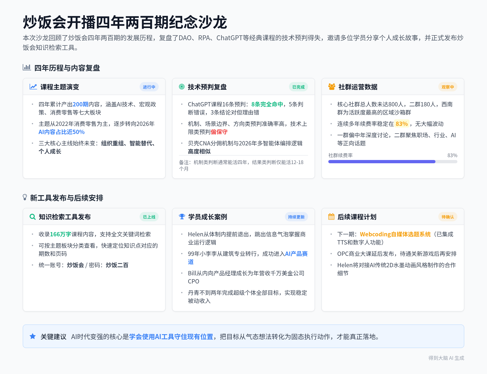

# 炒饭会两百期复盘与线下交流分享

## 智能总结

#### 录音信息
- **录音时间**：2026-09-09 20:07:24 ~ 2026-09-09 22:35:52
- **时长**：约 2 小时 28 分钟
- **参与人数**：约 13 人
- **内容类型**：播客节目 / 分享沙龙

#### 录音总结
本次沙龙围绕炒饭会开播四年两百期的历程展开，回顾了早期课程内容、主题分布变化、技术预判的得与失，同时邀请多位现场学员分享加入炒饭会的个人成长经历，最后发布了专属知识检索工具，整体氛围轻松且干货密集。

**第一期DAO主题课程内容复盘**
* **课程核心框架回顾**：2022年8月17日的第一期课程共89页PPT，核心围绕DAO去中心化自组织展开，拆解为DAO的组织价值壁垒、房产中介与职业教育的深层矛盾、新型组织关系下企业与个人价值重塑三部分。
* **课程案例与品牌调整**：课程以贝壳为核心案例，当时课程页角标注的品牌为“炒饭商学院-炒饭会”，后续因相关管理规定，“商学院”字样被移除。
* **贝壳组织模式类比**：贝壳的CNA机制将交易拆分为房源录入人、业主实勘人等8个角色，按角色分配佣金，这套机制本质上和2026年流行的多智能体工作流编排逻辑高度相似。
* **四年间的变与不变**：四年间组织、商业、人性的底层逻辑没有变化，但AI技术的快速发展替代了大量原本由人工承担的中间协作环节。

**生产资料与生产关系的底层逻辑讨论**
* **就业承载主体分析**：当前民营企业承载了国内最多的就业岗位，地方城投债带来的压力传导下，国企降本增效后向外扩张，进一步挤压了民营企业的生存空间。
* **组织扩张的边界规律**：历史上各大帝国疆域扩张到一定规模后，受邓巴数和管理半径限制，必然会出现管理耗损加剧、地方割据的情况，最终走向收缩。
* **互联网对组织形态的改变**：互联网技术的出现打破了传统组织的扩张边界，能够在扩大组织规模的同时，大幅降低管理效率的损耗。

**炒饭会社群规模与群定位说明**
* **社群总规模情况**：炒饭会核心社群总人数未达800人，二群现有180人，早期为了活跃社群氛围，允许部分一群活跃成员同时加入二群。
* **不同社群内容差异**：一群讨论氛围偏向中年化，内容深度下沉；二群整体讨论方向更积极向上，聚焦职场、行业、AI发展等正向话题。
* **特色区域群介绍**：西南群是所有区域群中活跃度最高的群，群内氛围开放，被定位为社群内容沙箱，其他区域如武汉、深圳等地也设有专属区域群。

**早期RPA主题课程复盘**
* **第十期课程核心内容**：2022年11月2日的第十期课程主题为机器人成为生产力大杀器，核心讲解RPA技术，提出让自动化工具完成重复工作，人只保留判断力的核心观点。
* **技术预判的迭代**：当时预判RPA驱动AI绘画生成内容并分发到小红书是可行路径，四年后技术方向反转，变成由Agent驱动RPA完成各类自动化任务。
* **数字劳动力概念演变**：2022年提出的“数字劳动力”概念，在2026年已经演变为通用Agent，核心逻辑始终是将规则明确、大量重复的工作交给自动化工具完成。

**四年课程主题分布变化梳理**
* **历年主题占比变化**：2022年课程以消费零售为核心，占比接近40%；2023年转向各类社会热点事件解读；2024年重点讲解个人成长与职场相关内容；2025年宏观政策与AI技术内容占比均达到29%；2026年AI技术相关内容占比接近50%。
* **两百期总主题数据**：开播四年累计产出200期内容，其中AI与技术47期、宏观与政策38期、消费与零售37期、内容与传播31期、个人与职业成长24期、组织与管理12期、文化与人生15期。
* **选题节奏背后的时代背景**：2024年曾出现严重选题荒，当时市场上既没有优质企业动态，也没有热门社会事件，一度考虑转向分享早期互联网公司八卦内容维持更新。

**AI相关地方补贴政策分享**
* **Token补贴叠加方案**：目前已知有两个地方政府分别可以给到AI相关企业30%和40%的Token使用补贴，两项政策可以叠加，最高可覆盖70%的Token使用成本。
* **补贴落地选址逻辑**：申请这类补贴需要优先选择财政实力雄厚、正在打造AI产业名片的地区，浙江是符合该条件的首选区域，山河四省、东北等地不适合申请这类政策。
* **补贴套利玩法**：已有从业者利用政策红利，在当地注册AI企业，平进平出售卖Token，不靠Token差价盈利，全部收益来自政府发放的补贴。

**无人机与城投债关联玩法揭秘**
* **飞手服务的市场需求**：各地公安、市政、环卫、环保等部门都有无人机飞手的使用需求，但各单位都不愿自行养人，既无法解决编制问题，外包预算也难以精准核算。
* **飞手资产化运作路径**：由当地城投公司统一招聘飞手，将飞手提供的租赁服务资产化，通过融资租赁方式扩表，从央行获取低成本资金，实现借新还旧。
* **低空经济的衍生价值**：这套玩法依托低空经济政策落地，不需要实际产生高额收益，只要能够帮助城投公司完成扩表，就可以缓解地方债务压力。

**学员Helen的社群收获分享**
* **个人职业背景经历**：Helen本名苏鹤玲，研究生毕业后先在科大讯飞担任了三年互联网从业者，之后进入体制内工作了近20年，长期的体制内工作让她逐渐与外部互联网行业脱钩。
* **离开体制的决策过程**：2024年她判断AI技术将带来社会环境的剧烈动荡，体制内的稳定也无法长期保障，在家人支持下选择从体制内提前退出，先生留在体制内作为家庭基本盘，自己作为拓展派探索新机会。
* **加入炒饭会的成长**：她先后学习了崔涛的AI原理课和高老师的课程，跳出了体制内的信息气泡，真正了解到商业世界的运行逻辑，掌握了在社会中寻找机会的方法。

**学员小李李的社群收获分享**
* **个人转行经历**：99年出生的小李李本科和研究生均为建筑专业，毕业后从事产品经理工作两年，发现岗位成长性不足，通过学习炒饭会的AI相关课程，成功转行进入AI产品赛道。
* **社群带来的价值**：作为刚毕业两年的年轻人，社群内容帮他拓宽了对世界多维度的认知，形成了高于同龄人的思考维度，为后续职业发展预留了更多选择空间。

**多位学员的社群反馈分享**
* **学员Bill的成长**：Bill四年前还是一名普通的产品经理，性格内向懦弱，加入炒饭会之后逐渐变得阳光自信，两年前就晋升为年营收千万美金级创业公司的CPO。
* **韩国籍学员的收获**：技术出身的韩国籍学员表示，炒饭会补全了他对商业世界的认知，打破了技术人员只能沿着单一职业路径发展的固化思维，意识到自己可以尝试更多可能性。
* **学员丹青的目标达成**：丹青加入炒饭会后设定的超级个体计划目标，不到一年就实现了月入稳定被动收入，不到两年就晋升到管理岗位，目标全部超额完成。
* **负债学员的逆袭**：一位创业失败后负债百万、变卖房产车辆仍未还清债务的学员，在炒饭会的影响下逐步走出人生低谷，重拾了赚钱的信心。

**社群互动九问环节讨论**
* **炒饭会最深刻的一节课**：多位学员印象最深的是高老师分享自身创业低谷经历的课程，大家亲眼看到高老师从坚持追求远期愿景，到现在转变为“眼前能看到的钱别放弃”的务实心态。
* **最想合伙创业的社群成员**：Helen点名希望和社群内的“内参”合伙创业，认为对方的技能拼图完全匹配自己的需求；高老师也透露自己已经和天琪、肖宇、丹青等多位社群成员开展了实际项目合作。
* **给十年后自己的一句话**：有学员分享自己三年前写下给三年后的信，信中预设的岗位、薪资、工作场景全部成为现实，印证了把目标从气态转化为固态，拆解落地执行的重要性。
* **给四年前自己的一句话**：多位学员表示最想告诉四年前的自己不要买房，有学员因为听了高老师的提示没有买房，直接省下了两三百万的购房成本。

**ChatGPT相关课程预判复盘**
* **预判命中的内容**：16条预判中8条完全命中，包括AI多智能体分工完成设计任务、智能客服被彻底改造、AI落地存在场景部署鸿沟、幻觉版权作恶三类风险长期存在、AI情感陪伴成为独立品类等。
* **预判出错的内容**：5条预判完全错误，包括认为AI短期内无法实现高水平情感创作、不具备从无到有的创造力、不具备逻辑学思维能力、落地场景仅局限于新闻推荐等少数领域，严重低估了大模型的能力上限。
* **结论对但理由错的内容**：3条结论正确但支撑理由错误，包括ChatGPT短期内不会颠覆搜索、AI的核心定位是人类助手而非替代者、中国制造业AI渗透率低的核心瓶颈是ROI和组织阻抗而非技术。

**炒饭会四年发展主线梳理**
* **三大核心主线**：开播四年两百期内容始终围绕三条主线展开，分别是组织如何重组、智能如何替代、个人如何成长，没有偏离过核心方向。
* **组织重组主题的演进**：2022-2023年聚焦人与人之间的组织协作模式，2024年之后转向研究工作流如何组织、人类如何嵌入AI工作流的新协作模式。
* **个人成长主题的演进**：早期内容重点教大家如何变强、向上走，2024年之后内容转向教大家如何避免职业下滑、守住现有位置，只需要学会使用AI就能轻松实现能力提升。

**四年创作感悟分享**
* **个人创作瓶颈经历**：2024年遭遇严重选题荒，每周要花两三天时间找选题，同时也多次遇到自己提前预告了课程主题却学不明白的情况，甚至为了搞懂Deepseek相关代码看到崩溃。
* **社群续费率数据**：炒饭会连续多年续费率稳定在83%，数值常年保持恒定，没有出现大幅波动。
* **核心学习理念**：比起单纯的知识传递，更希望帮助大家养成长期学习的习惯，保持在路上的状态，不要停下自我提升的脚步。

**炒饭会知识检索工具发布**
* **工具基础信息**：工具部署在炒饭点左学点com，无需注册，统一账号为“炒饭会”，密码为“炒饭二百”，所有内容完全对社群成员开放。
* **核心功能介绍**：工具累计收录166万字的课程内容，支持按主题板块分类查看、全文关键词检索，能够快速定位任意知识点对应的期数、页码，还能显示各主题板块的断更时长。
* **后续更新计划**：下一期课程将讲解Webcoding自媒体选题系统，该系统已经集成了TTS和数字人功能，OPC相关课程将延后发布。

## 章节概要
[00:00:01](https://getnotes.seek:1) **第一期DAO主题课程内容回顾**
本次分享从2022年8月17日的第一期课程切入，展示了当时89页PPT的原始样式。课程原本使用“炒饭商学院-炒饭会”作为品牌标识，后续因相关管理规定移除了“商学院”字样。课程以贝壳为核心案例，拆解了DAO去中心化组织的底层逻辑，对比发现贝壳的CNA角色分佣机制和2026年的多智能体编排逻辑高度一致。

[00:05:13](https://getnotes.seek:313) **生产资料与生产关系深度讨论**
从组织本质延伸到当下经济环境分析，明确民营企业是当前承载最多就业的主体。受地方城投债压力传导，国企降本增效后向外扩张，进一步挤压了民营企业的生存空间。同时梳理了历史上各大帝国疆域扩张的管理边界规律，指出互联网技术打破了传统组织的扩张效率瓶颈。

[00:15:19](https://getnotes.seek:919) **炒饭会社群体系介绍**
公开社群核心数据，总人数不到800人，二群现有180人。不同社群定位明确：一群偏向深度下沉的中年向讨论，二群聚焦职场、行业等正向话题，西南群是活跃度最高的区域沙箱群。同时说明社群准入规则，活跃成员有机会进入更高阶的新群。

[00:21:20](https://getnotes.seek:1280) **第十期RPA主题课程复盘**
回顾2022年11月2日的第十期课程，当时预判RPA驱动AI绘画生成内容分发是可行路径，四年后技术方向反转为Agent驱动RPA。2022年提出的“数字劳动力”概念，在2026年已经演变为通用Agent，核心逻辑始终是把重复规则类工作交给自动化工具。

[00:29:01](https://getnotes.seek:1741) **四年课程主题分布变化分析**
梳理四年200期课程的主题占比变化：2022年以消费零售为核心，2023年聚焦社会热点，2024年主打个人职场成长，2025年宏观与AI内容各占29%，2026年AI内容占比接近50%。2024年曾遭遇严重选题荒，一度考虑转向分享早期互联网公司八卦维持更新。

[00:35:25](https://getnotes.seek:2125) **AI地方补贴与无人机城投玩法分享**
介绍浙江等地的AI补贴政策，30%和40%的两项Token补贴可以叠加，最高覆盖70%使用成本。已有从业者利用政策红利，注册AI企业平进平出售卖Token，全部收益来自补贴。同时揭秘无人机飞手资产化的城投扩表玩法，由城投公司统一运营飞手租赁服务，通过融资租赁从央行获取低成本资金缓解债务压力。

[00:59:12](https://getnotes.seek:3552) **多位学员个人成长分享**
邀请多位现场学员分享收获：Helen从体制内提前退出，跳出信息气泡掌握了商业世界的运行逻辑；99年的小李李从建筑专业转行成功进入AI产品赛道；Bill从内向普通产品经理成长为年营收千万美金公司的CPO；丹青不到两年就全部完成了加入时设定的超级个体目标。

[01:29:23](https://getnotes.seek:5363) **社群互动九问环节交流**
围绕九个预设问题展开互动：学员们印象最深的是高老师分享创业低谷的课程，Helen点名希望和“内参”合伙创业，多位学员分享了写给过去和未来自己的话，印证了把目标书面化拆解落地的重要性，不少学员因为早期提示避开了买房的大额损失。

[01:54:34](https://getnotes.seek:6874) **ChatGPT主题课程预判复盘**
对2023年1月发布的ChatGPT主题课程16条预判做全面复盘：8条完全命中，5条严重低估大模型能力出错，3条结论正确但支撑理由错误。总结出自身判断的特点：机制、场景边界、方向类预判准确率高，技术上限类预判偏保守。

[03:21:22](https://getnotes.seek:12082) **炒饭会知识检索工具发布**
正式发布自研的炒饭会知识检索工具，部署在炒饭点左学点com，统一账号“炒饭会”，密码“炒饭二百”。工具收录166万字课程内容，支持全文检索、主题板块查看，能快速定位任意知识点的位置。后续下一期课程将讲解集成了TTS和数字人的Webcoding自媒体选题系统。

## 金句精选
- **“组织越大效率就会低，这是底层机制决定的。”** (战略洞见)
- **“把目标从气态的想法变成液态的规划，再变成固态的执行动作，才能真正落地。”** (执行策略)
- **“市场有热点的时候第一时间冲上去，市场没热点的时候沉下心修自身。”** (人生启发)
- **“你越想做成一笔交易，越拿不到好的条件，心态越佛系，反而越容易拿到优质deal。”** (商业智慧)
- **“AI时代变强很简单，学会用AI就够了，剩下的核心是别让自己掉下去。”** (成长建议)
- **“人类至今不可替代的核心价值，依然是盖章、签字、最后背锅。”** (行业洞察)
- **“机制类的判断能活四年，结果类的判断通常只能活12到18个月。”** (方法技巧)
- **“炒饭会给大家提供两样东西：风平浪静时的定力矛，风起云涌时的判断望远镜。”** (价值传递)

## 待办事项
- 高老师：后续上线Webcoding自媒体选题系统相关课程
- 高老师：延后发布OPC商业大课，待通关新游戏后再安排
- 社群成员：使用统一账号密码登录炒饭点左学点com，体验知识检索工具
- 社群成员：在知识检索工具中对内容进行“收下”或“弃”的标注，协助完成数据清洗
- Helen：后续和高老师对接AI传统2D水墨动画风格制作的相关合作细节

---

## 完整逐字稿

🟢 说话人1 [00:00:01]
那好好，对吧？这个衣服不错，你看到啥了就不错啊？这个就是我们还没有展示这个这个服装的细节呢。哦，北海，海波，杰英，陈瑞，哎哎，body，明哥你好，OK，卡索你肯，你是当然是没看过的，OK，汉代如家人你好啊，君临天天下你看过呀？啊，那个时候，那，就那个时候你已经出生了是吧？

🟣 说话人2 [00:00:27]
哈哈哈不是这个事，这个这事是有梗的，他他今年大学毕业。

🟢 说话人1 [00:00:33]
他是个很年轻的孩子。对，然后我们看看第一期的样子，这是第一期，这个2022年8月17号，确实这个的样式呢，和我们现在这个样式确实不太一样。这件事大家就可以非常深刻地看到 AI 对于大，就对它对于生活的改变。那个时候的话，我们只能用这些语言不详的一些做封面，而不是像现在一样可以随便变出来一个很好看的东西了，对吧？

🟢 说话人1 [00:00:56]
当时我们这一期的话，一开始在第一期上我们讲的是从 DAO 看去中心化组织的底层逻辑和核心要素。有人还记得当时这期我举的案例是谁吗？还记得吗？其实严格说是贝壳，严格说是贝壳，对吧？这个桌子角是你找的好棒，那你厉害，对吧？贝壳儒家，哈哈哈，也差不多儒家，对吧？对吧？不是道不是道，是 d a o d a o d a o 啊。

🟢 说话人1 [00:01:29]
然后我看了当时我的目录是什么，当时的目录是这三部分，大家可以注意到，其实我这当时的右上角的这个角标的这个品牌还不太一样，当时的品牌是炒饭商学院杠炒杠炒饭会。大家其实想一个问题，为什么把炒饭商学院这个牌子给弄没了呢？这牌子犯法，这这牌子不让叫，这牌子不让叫，就是不准随便的去讲叫商学院的这个牌子，所以后来把这个东西去掉了。

🟢 说话人1 [00:01:57]
然后当时呢，讲了三部分的东西，第一个就是 DAO 的组织是什么？它到底有什么样的价值壁垒？第二块呢，讲的是从房产中介到职业教育，如何去解决行业的深的更深层次的矛盾。第三部分呢，讲到的是这个新型组，新型组织关系下，企业和个人价值如何去做重塑。当时讲的是这三部分。大家可以想象一下，这个东西在现在来看的话，还有没有它的意义？

🟢 说话人1 [00:02:24]
还有没有它的意义？啊，贝壳你你也熟啊，你你不是那哪的吗？啊？但是后来我们确实有同学去了贝壳，咱们确实有同学去了贝壳。啊，就是来了又走了，就是从成都来北京，然后又回去了。然后呢，最大的一个启发是，贝壳是一个做 AI 做的非常的狠的一家企业。就是公司里所有的团队拆散了，各自为政的去做 AI 然后把公司的钱烧得非常的狠，直接把这个链家的股价都给烧掉了。

🟢 说话人1 [00:02:59]
然后的话，终于老板痛下决心，大范围的裁员。啊，然后卷得很，钱东家和钱钱东家，我天呐，五八携程。你就是你核心的是做本地生活加旅游是吧？啊？好啊。然后当时的整，当时这一节课的总结，其实你会发现这四年我的这个整个 ppt 的样式几乎是一样的。当时讲的是 DAU 是去中心化自组织的形式。即将现即将现现有中心化组织孤岛进行打破和迁移，最大价值在于团结一切可以团结的人。

🟢 说话人1 [00:03:37]
然后房地产中介五大深层矛盾与在线成人教育的深层矛盾不谋而合，最终的解的解的解决方案在于知识图谱和合作网络。在互联网技术加持下，未来的工作可能会出现去中心化新型组织关系。找工作时要依托能力逻辑，创业时要借鉴这种思想。其实事实上来来来讲就是这堂课，我事实上最后是借鉴了一些他的思想，我现在再去做的很多的创业类的东西。

🟢 说话人1 [00:04:06]
确实在去中心化上做得非常的狠，以至于就是我有很多项目的人哈，我我我有可能已经半年都没有见过他们了，对吧？已经去去中心化去的非常的狠的一个状态，要不是这种会的话，我都很难见到你跟我联系啊，就这帮家伙哎。然后这一期当时的核心是什么？当时的核心问题是讲组织怎么重组，既能做大又不失效率。整体的 PPT 是八十九页啊，算是不太大的一期，算是不太大的一期。

🟢 说话人1 [00:04:37]
核心点，你知道为什么贝壳成这个样子，大家可以想象一下。然后给大家讲一下我的第一期当时的论证路径，我当时的论证路径是这样来的，一开始先去讲组织是怎么来的，组织是什么。当时讲到就是说，所谓的组织呢，它是经历了三次社会大分工，畜牧业分离，手工业分离，交换生产分离，这是当时讲的一个最核心的为什么会有组织，然后讲的一个最重要的东西就是组织的本质是用生产资料组织生产者，是用生产关系组织生产资料的一种方式。其实提到这个点的话，

🟢 说话人1 [00:05:13]
我就突然间想多走一句，就是你们今天下午在一群讨论的那个问题的话，你们就就是只想阶级，不想生产资料的问题吗？不想生产关系的问题吗？小晨晨你好。哎，咱们在一群今天下午有看今天下午那个讨论的吗？看了是吧？你们觉得是什么呀？不敢说是吧？怕把怕怕怕把我直播间崩了是吧？哈哈哈，对吧？你你你你你懂的是啥？你你懂的是啥？

🟢 说话人1 [00:05:50]
我想知道。就是其实在这里面的话，一个最重要点，大大家不要不要只是盯着阶级这一件事情去说，最重要的话你要去思考的是生产资料到底在哪里，生产关系到底是什么，然后谁承担了最。就是咱们去想一个事情，就是什么样的经济形态承载了现在最多的就业？大家不是不是，别别别，外卖这就过分了，就是咱们咱们咱们咱们从生产资料所有制关系走。

🟢 说话人1 [00:06:24]
民营企业承载了最大的就业，对不对？那生产资料在哪儿？那所以就是说在现在这个状况下，整个经济在下行，对不对？国企也有国企的压力，对不对？国企它它有压力之后的话，它会做什么样的事情？对啊，它会利用市场超的超然位置，它往外扩，对不对？它扩完之后的话，是不是民，是不是民营企业的这个整整个这个位置其实会变得更，会变得更加的小。

🟢 说话人1 [00:06:51]
然后国企它也在做这个降本增效，对吧？所以说其实是有更加多的这个整体的在就业的压力，其实是在往民企上去做传导，然后民就是民企要招更多的人，反而要去承担更少的的这个在生在生产资料层的这样一件事儿，然后在所有人的去去说的话都是民企负责人。所以大家看到问题是什么？看到问题是什么？其实这才是根本，这才是根本。如果再往深一层的话，其实本质上是因为地方政府城投债的问题。

🟢 说话人1 [00:07:24]
城投债这个东西的话，我们可以把直播间关了，我们在线下聊啊。哈哈哈，我们线下聊这个，所以就是这这种就是我我就我就我很割裂，你知道吧？就是一边儿有线下，一边儿有线上，然后我我是用线下的口径聊，然后还是用线上的口径聊，我这事儿圈儿是很纠结的一件事情，你知道吧？所以非常有意思，那应该去国企，不去民企。你说的对呀，但是但是啊，对吧？

🟢 说话人1 [00:07:49]
那你怎么去呢？现在你能有编制吗？对不对啊？你你现在不要说有编制，连合同都没有，你算外包对不对？外包其实你本上你你也是民企，对不对？对吧？对吧？2026年线下可以展开聊吗？不可以。哈哈哈，对吧？然后所以当时是聊到了，其实最核心的一件事，其实是从我们在第一节课一开始的根儿就给大家讲的是生产关系和生产资料之间的一个逻辑，对吧？

🟢 说话人1 [00:08:15]
然后然后另外组织的天花板是什么？为什么我们会看到古代的如此多的这样的一些这些帝国，其实它都没有办法去有绝对意义上大的疆域，无论是说你看像这个金帐汗国，无论是说这个这个这个元，再到清，再到罗马。再到拜占庭，其实它都是超过一定的这个大小之后的话，由于它的管理的邓巴数，再到它的半径，而且它到边缘必然耗损，所以大家只能用其他的方式，比如说包税人，比如说这个边户齐民等等一些方式。

🟢 说话人1 [00:08:48]
总之就是越远的其实越没越没有办法做，然后一定会出现小朝廷，对吧？所以历史上无数的帝国开拓疆土之后的话，它一定会走向衰落，越大之后越往下去收。越大就会越往下收。然后再提再提出一个问题，就是如何既扩大组织，同样在同时尽可能地减少组织效率的降低。其实在这次的线，在这次我的线下，其实我就在去讲这样一件事情，就是互联网其实它成为了一种，就是说组织可以无限地扩大，但是它的效率降低的比例其实是低的，因为它这个并不靠人管对吧？

🟢 说话人1 [00:09:24]
所以这是组织科学的最核心的一个问题，然后再去提出解法，就贝壳的 CNA 把一笔交易拆成房源、录入人业主、实勘人、委托备件人、钥匙人，把这些人拆开，然后按照角色来去分配佣金。系统强制每笔交易至少填八个人，通过这种方式的话，把所有人他都能够调动起来。就是通过一种在线上的，通过这个智能合约的方法，然后把所有人他能够去连接，最后把钱能够去散。

🟢 说话人1 [00:09:53]
最后落到个人是什么？其实就是我们说组织必然会发生变化，当然了，我这里面有估计对的，也有估计错的。组织确实发生了变化，我们确实应该是按照萃取自己最核心的嗯的嗯能力出来，有点像把把自己蒸馏出死标来，对吧？按照能力逻辑匹配工作，而不是按照岗位这样去做，这个其实是当时所论断的一套东西。对吧？当时我认为这个贝壳 CNA 核心点四个，把流程拆成角色，按角色的按角色来分配收益，强制做协作，信用分数做约束，然后最后这东西像什么？

🟢 说话人1 [00:10:30]
大家觉得这东西像什么？贝壳的这个 CNA 大家觉得这东西它它很像什么？流程拆角色，角色配收益，强制做协作，用信用分做约束。它像什么？它特别像是一个多智多智能体的一个方案。就是流程拆角色是多智能体，角色分配收益是根据它的这个位置决定我是用好一点的大模型，贵一点的 token 还是用便宜一点的。强制协作是工作流和多智能体中的 A 和 A 信用分做约束，本质上是还是。

🟢 说话人1 [00:11:07]
讲的都是一套玩意。但是大家发现这四年间发生了一个什么样的变化呢？发生了什么样的变化呢？就是其实我们这个这个大的方向是对的，但是采但是采但是采用的技术变了，方向是这么去拆分，结果最后料到了会这样拆，没有料到是把人踢掉。对吧？其实那大家看到这个这个就就是在这四年间，什么是变的，什么是不变的？不变的其实是组织商业人性这些东西其实还是没有变化，但是变的就是 AI 它的这个巨大的变数，使得这里面来去解决问题的方式它变了。

🟢 说话人1 [00:11:46]
这里面还有没有留的？有留的，这里面包括录入维护，只看依然是在的，但是在这边很多的中间环节被 AI 踢掉了，对吧？所以在当时的这个里面的逻辑呢，就是一个非常典型的把任务拆成角色，每个角色做自己擅长的，按贡献分配。去掉最后一句话，把任务拆成角色，每个角色只做自己擅长的，是非常典型的。我们再去做工作流拆解的时候，这个大模型组建，它要去做它所擅长的事情，而不要让它去做成一个可复用的东西。

🟢 说话人1 [00:12:16]
所以这段话你会看到一点，这段话描述的是2018年的贝壳，但同时是2026年的多智多智能体编排，中间隔了8年，还有一次技术革命，这就是它的变与不变，所以这个是我觉得非常有，就是非常有意思的一件事。然后所以呢，这里面我在第一回 DAO 的第83页。写了一句话，叫萃取自己最核心的能力，按照能力匹配工作，而不是匹配岗位。

🟢 说话人1 [00:12:45]
到现在你觉得这句话是否还匹配？我觉得还是匹配的，对吧？这句话其实我原把原样放进任何一份在 AI 时代的组织报告里还成立，差别只是当时没有大模型这个东西。这个是我觉得在这四年间的一个变化。然后呢，我们再说在这门这个当时的一个判断，什么对了，什么错了，这是在200期前的一个状态，当年的我们的一个要去讲一个最核心的问题就是组织怎么做重组。

🟢 说话人1 [00:13:14]
而我当时为什么要去以 DAO 这个东西为第一期去讲，我这个要去说一点，因为我们从两个维度上说一下我当时为什么要去讲这么一期课，因为我当时在这个开课吧的时候。当时带的 team 太大，当时带的 team 太大，当时我的我的 team 差不多是1200人，然后的话如果是全公司当时超过7000人，当时我觉得就是人多了之后的话，其实整个的管理耗损是非常恐怖的一件事情。

🟢 说话人1 [00:13:44]
尽管说我们已经做了非常多的一些动作，但我觉得那个其实都不是我的最终极的形态。而我到在中后期的时候，我当时已经开始再去研究贝壳的方式了，因为我对左辉还是非常佩服的，我觉得他唯一的问题就是死太早了，他死实在是太早一点儿了，他但凡死的稍晚三四年的话，其实能做出来更加多的一些事。当时已经在做研究了，而基于我当时在开发，我其实是接手了技术部门，其实本来是想把这套东西在后续能够去做的，而后续很遗憾的就没有机会去做这样一件事了。

🟢 说话人1 [00:14:17]
所以当时是把对贝壳的研究，然后以及我对于这个在组织上的有一些想法，希望通过这种方式，在第一期我就能放出来，这是当那个时候想，就是就是非常想干的一件事。但是呢，我上火了是是，但是另外一个就是第二层的话，我当时其实是特别想说的一句话叫做团结一切可以团结的人，因为从我当时的一个状态上讲，我其实是对于当时有一批同学能够在经历了当时那个状态之后。

🟢 说话人1 [00:14:51]
依然能够过来，然后我当时非常珍惜的一个状态，所以我当时也是希望从炒房会来讲，它也是这样一种组织，所以我希望呢它他是把这两个故事都能在这一节课里能能够去说。所以就是传统来讲，组织越大，效率它就会低，每个组织会出现各种的异上的孤岛。同时呢，我特别希望能够有一种机制，团结一切可以团结的人，然后把流程拆角色，按贡献去拆分。

🟢 说话人1 [00:15:18]
第一期有多少人？什么叫第一期？你就说第一节呗，第一节呗，对吧？第一节的人数的话，说实话，什么叫一百左右？你在你在说啥呢？啥叫一百左右？可能吗？可能这么少吗？比这数多多了，比这数多多多了啊。第一期的时候的话，当时尽管说没有咱们现在这么多人，但是当时也是400人的量级好吗？啊。400 400 400，将就是将将近400将近400。

🟢 说话人1 [00:15:53]
哎，认真地讲，我估计你们没有人知道现在整个炒大会的人数。有人想知道吗？嗯？没有没有没有没有，就是500多少？没有600。嗯，一群没满，一一群刚刚踢了一几个人。

🔵 说话人3 [00:16:17]
那应该有800人吧？八百。

🟢 说话人1 [00:16:19]
没有那么多，没有那么多，没有那么多。你想，二群你，二群你是不知道数吧？啊，啊对啊，二群180人。这边儿有重复的，这边儿有重复的，这边儿有重复的，对吧？有几个群了都不知道，不至于不至于不至于。会踢人，他他他没续费，我我不踢，那我我怎么保护你们的权益呢？对不对？对不对？对吧？对吧？为啥可以进俩群是这样子，在刚开始拉二群的时候，我担心人太少。

🟢 说话人1 [00:16:58]
啊，然后大大大大家有有一种很尴尬的状态，我总得我我总得拉点儿一群比较活跃的人，把这个底儿打一打吧，对不对？对不对？这不是很正常的一件事吗？对吧？为什么有人能在俩群？当我出现三群的时候，啊，你只要在二群比较活跃，你就可能能进俩群了，你知道吗？想进一群啊，想进一群，你你你那那你得有点儿表现对不对？你得你得多有点儿表现对吧？

🟢 说话人1 [00:17:26]
你未来可能能进三群里，实际上很简单的，你知道用什么方法吗？你现在等到明明年你你你那你就别续费，你知道吗？然后然后你进三群的可能性就会变得非常之高，你知道吧？对吧？你先让你让我把你从第二群踢了，然后踢了第二天之后你立刻续费，然后说我就要进三群，OK，那那就哦，那就可以了。二群卧虎藏龙，是就是就是小雨，你是不在二二群吗？

🟢 说话人1 [00:17:53]
啊？哎呦，我是是这样的，就是二群聊的东西和一群是不太一样，是不太一样的，就是二群现在大大家还秉承着一个大家去聊的，还基本上是比较积极向上的一些话题呢。

🟣 说话人2 [00:18:08]
哈哈哈。

🟢 说话人1 [00:18:10]
对吧，大家还在这去聊聊职场啊，行业呀，AI呀，发展，那估计能做什么呢？基本还还在聊这，就是还在聊这样一些呢，然后一群啊一群有一种很强烈的，就是说到这种中年大爷去去聊的一些东西，就是这种灯味太足了，我有时候不愿意说你。就是哎呀，就是非常的积极向上。二群现在天天还在那去聊啊，这个行业是怎么样的，然后这个这个今天好像是在聊，现在这个价格又又这又降下来了，对吧？

🟢 说话人1 [00:18:43]
这这个非常好，这成都群是谁敢跟你们比啊？啊，成啊，这个要跟你说一下，其实我们是有各个地区的群的啊，我是有各个地区的群的。啊。

🟢 说话人1 [00:18:57]
对，是是是，就是就是第就是地区群唯一说话的只有西南群，西南群是我们所有群里面一个比较神奇的存在啊，有各种的冠名啊，西南群现在比较完整的名字叫什么来着？西南西南，没有没有，西南，对，就是现在西南群的比较完，比较完整的名字是是西是西南括号西南括号狂野群，那个群就是不太一样，反正那个那个群的话，我们在那边就是把所有把这个实际上是一个就是风险啊。

🟢 说话人1 [00:19:32]
不是风险啊，对吧？对吧？我们做了一个沙箱，沙箱啊，对吧？对吧？想进武汉的群啊，你自己就是武汉的群啊，你自己就一群，你你对，就是你自己，你就是个队伍啊，对吧？对吧？武汉的群其实，其其实我们其实我们之前有一个华中群，啊不叫华中群，好像叫叫什么群来着？就是当时是把湖南湖北的放在了一个群里，有这么个群，有有的啊，怎么才能进西南的群？

🟢 说话人1 [00:20:08]
啊，说实话，说说实话就是这个就是你现在的表现是不会邀请你进的啊。你现在还是很积极向上的一个姑娘，我现在不想让你进那个群。你知道是谁吗？那个那个那个那个邀约营销。她她她她现在还是一个非常健康向上的姑娘，现在还不太想让她上，不是男的才行，里面的里面的姑娘标得很好啊，就是西南群人均八耳朵，你说的这个光是男的，那这是一个什么状态？

🟢 说话人1 [00:20:44]
不对啊，对吧？深圳的群大家很本分，是很本分，深圳人这都是在那儿去搞钱对不对？但是当时我这个什么错了什么对了，我觉得我提的问题是对的，但是我当时的答案其实是不对的。当年我给出来的答案是基于区块链加上智能合约的方式，因为 DAO 呢是去中心化自治的方式，外部三点零加元宇宙的基石就是靠这个东西，它通过不可篡改性建立一个强信任的网络。

🟢 说话人1 [00:21:13]
然后四年之后 DAO 现在基本没人提了，对不对？刀现在基本上是市场是没有人去提了，对吧？刀没人提了，皮儿没人提了，川也没没人提了。

🟢 说话人1 [00:21:27]
不是，就是你知道你你的这个梗，就是就是你的笑点就很奇怪，你知道吗？就是这么奇怪的梗，你能笑，我还是不太懂，你知道吗？是吧？然后外部三线基本上也降温了啊，这个是吧？哈哈哈，就是就是这有俩做，这有俩做区块链的，你们知道吗？有俩就做做，这这这是就是去去这个链上双甲，然后做做就是就在这，就是在这俩角上，你们知道吗？对吧？对吧？锻炼了是吧？

🟢 说话人1 [00:22:00]
对吧？所以我觉得就是就是技术，我往往估的没有那么的准。B圈儿现在还不算活跃吗？就B圈儿还得怎么活跃？啊？就就就就就就刚都活跃成那个样子，你让就是你让他怎么活跃？我问你对不对？不太行对吧？然后这个就在我第一期之后，两个半月之后，我又做了一个大的预判。哎，这个叫做有同有同学啊，这个每期课程都听了很久的这种人啊，对吧？

🟢 说话人1 [00:22:33]
大家知道我说的是咱咱们这里面一直保持着看课时长记录的机密啊，现在我已经不愿意看他这个量了。然后我在第一期之后两个半月，我做了一个什么样的预判？你应该够你应该够呛，我当时做的是这个，炒炒办会第十回，11月2号，机器人能够成为生产力最具革命性的大杀器。大家想这两节如如果是交相呼应一下的话，其实还是能够有点意思的，但是非常可惜的一件事，我当时预判的肯定不是大模型，对不对？

🟢 说话人1 [00:23:07]
我我如果这个时候我能预判出来大模型能火的话，那我可能确实有可能穿越了，所以大家想一想，我当时预判的是什么东西？就没有，当时巨深也没有。巨深比大模型出来的晚。想想我当时，我想那更晚了，尽管说是我们学学校现在拿着这个东西。

🟢 说话人1 [00:23:33]
不是。看到这个大家能看到什么呢？这是当时周道大哥干的一件事，当时是把把炒饭会，它的这个里面的所有的东西，五五十七天两万条内容，整体做了整理。今天上午还有一位这个朝文会的一位这个新同学问我，说说突然间感感觉发现了一个痛点，说如果说是拿手机一点儿一点儿地录一个视频，就是翻炒，就是朝文会去聊天，一点点翻翻完之后把视频发给大模型，让它去整理。

🟢 说话人1 [00:24:11]
我当时跟他说了说你可以看看 RPA 是什么，当时我这我这节课讲的是 RPA RPA大家觉得凉没凉？

🟢 说话人1 [00:24:26]
半凉不凉，反正就是半凉不凉，大家就看最后的话是大模型愿意去调 RPA 还是 computer OK 变得非变，它变得更强悍了，其实就看是这个差别了，对吧？当时我讲了一个故事，叫做我想让机器人资本或计算机完成实际工作，而我只靠判断力赚赚钱。哪玩儿说的？这东西在现在现在换，它换了个名字，它叫什么？它叫 OPC 它叫 OPC 让机器人其实就是让 Agent 加上智能体，是一个东西，完成具体工作，而我只靠判断力赚钱。

🟢 说话人1 [00:25:03]
当时的三的这个三块儿东西讲的是 RPA 连续获投，AI 绘画获奖。当时确实是 Mandarin 拿到了美国科拉拉多艺术节的冠军的这件事有，对吧？然后这个机器人是否达到了爆发点？重复动作条件触发，典型的 RPA 的方式，如何利用机器人帮你打工？奇点来临，机器人商业化的方向和可能性。当时核心讲的是这个东西。

🟢 说话人1 [00:25:30]
这幅图应该已经算是非常经典了，对吧？当时是这个在这个2022年的8月份所说的这幅画，这幅画这个非常有美感，震撼力，AI 做的。对，这是当时是，其实是当时是做了个局，就是当时这件事事实上是它它是个局，但是也确实这张图还，这是还是非常不错的，对吧？然后当时我讲的故事就是其中有一页是在这一篇的82页，RPA 加 AI 我当时认为就是 R 就是 RPA 加 AI 是能有价值的。

🟢 说话人1 [00:26:03]
但是和现在的方式是完全相反的，现在是拿 Agent 驱动 RPA 在当时是反的是拿 RPA 驱动 AI 为什么是拿 R 是拿 RPA 驱动 AI？是当时大模型没出来，是拿 RPA 驱动图片 AI 去做生成图片，然后把它用 R 用 RPA 的方法发到小红书上，这是我当时所想的方式。所以当时的判断叫做数字劳动力的普及和深化可能是在这个时间点，对吧？

🟢 说话人1 [00:26:34]
然后当时呢，叫数字劳动力是我起的名字，现在这个东西叫 A 真的。就客观一点讲，就是我估的方向我觉得还可以，但是估的技术全都不准，对吧？因为确实没有见识，对吧？这个我还说什么？开篇篇第四页我讲到是我想让机器人资本或计算机完成实际工作，而我只靠判断力赚钱。适用条件说的是第11页，任何规则明确，大量重复的工作，可以通过自动化来去做。

🟢 说话人1 [00:27:02]
设计原则第14 48页，触发条件要尽量精准。从而确保执行的准确度，这句话照搬进现在任何一个段的 prompt 或者 workflow 的设计文档都 OK 然后我回我回应的恐慌是1839年摄影术出来时候，法国的画家高呼绘画已经死了。每次技术革命来时，其实它都一样，给出来的结论叫做与其，AI会抢走画师饭碗，不如接受 AI 会让画师效率更上一层楼。

🟢 说话人1 [00:27:29]
当时讲的是这套方式啊，然后第十回的判断，大家看我当时判断是什么？当年的问题叫做谁来干？这种重复的，枯燥简单，规则明确的，简单脑力劳动，就像我现我现在在那个 AI 课上去讲的，叫做简单的，重复的，低复杂度的人类脑力劳动都应该交出去，人只保留判断力，同时跨系统调用。打通数据孤岛这什么东西？这其实是方山扩的对吧？

🟢 说话人1 [00:27:58]
然后这就是所谓的数字劳动力。然后当年呢给出来答案是 RPA 加上 AI 绘画的方式。啊，因为当时影刀这样的的这样一些厂商，其实是融资非常的密，而且这种以低代码和零代码的方式把人类的操作直接去做复刻，但是前提叫做规则明确，结果四年之后，实际上我们现在看到的一个大的趋势就是 RPA 全是在被 Agent 的吸收，这个大的前提变化了，对吧？所以

🟢 说话人1 [00:28:26]
我觉得呢，我当时这个在做这一期的时候，因为我这期基本上是做了有一个半月。我当时在去整理我所有 PPT 时，有一个发现和一种感觉，就是我开局三个月我的感觉是，我把2026年的所有的问题和答案，我其实事实上已经说出来了。第一期我问的是组织该怎么去重组，第十期我去说的是让数字劳动力去干。四年之后，我再去回答这两个问题的，其实是一个东西，A 人的。

🟢 说话人1 [00:28:55]
而当年我只能说出来就是区块链加。我觉得这个就是这个的关系。而在这之后，我觉得有一个非常有意思的，我的选题的走向是什么呢？我做了一张图。我做了一张图，这张图其实我觉得出来之后的话，我挺感慨的。然后二二年的时候，我大量的讲消费和零售。是一个非常标准的商学院的底子，给大家去讲各种的案例，讲亚朵，讲猪八戒，讲各种的这种 case 然后同时呢，AI与技术其实讲的并不多，因为那时候 AI 的技术真的不多啊，对吧？

🟢 说话人1 [00:29:32]
然后宏观政策也讲一点点，然后到了23年的时候，你会看到有一点就是消费还是占最大的这个量，但是往下错了一点，另外三块都在往上走。到了24年的时候，突然间这东西反过来了，案例就讲了17，商业 case 不多。想要是为什么？然后这一节呢，AI与技术也没这么多。因为整个二四年的话，其实和大家有关的 AI 技术或者是能够控，是是你能够去参与的并不多。

🟢 说话人1 [00:30:06]
但是同时呢，个人成长讲的非常的多。讲了包括职场啊，如何画饼等那些东西都是从这一年来的。然后到二五年的时候，你会发现这东西又变了，个人成长基本不讲了，宏观讲了一大堆。宏观讲了一大堆，然后呢，AI开始讲的多了。到今年，到今年一个最大的特点，消费与零售到目前为止，我只讲了一一次。这个商这个商这个商学院名存实亡啊。

🟢 说话人1 [00:30:34]
然后这个个人成长讲的也很少了。宏观呢基本上就是每一 q 去讲这样一期，平时也不讲了，不像二五年的时候，当时就是动不动就去讲一期。而基本上这个这个 AI 已经是做到了一期，就是当时我在二四在在二五年承诺的时候是叫叫叫做我每个月我会讲一些 AI 的东西，现在基本上每期都和 AI 社会有关了，对吧？是吧？所以就非常有意思一件事情，就是二四年其实是听职场的东西特特别多的。

🟢 说话人1 [00:31:07]
所以我想问大家一个问题啊，就是为什么会这个样子？这个的趋势到底是表现了一种什么样的状态？想听商业和创业类的。可以啊，你还想22年加入啊？你咋不想19年就加入了？对吧？我这个也并不是一个梗，就是这个课你要真正最早听的话，其实是20年就能听着了，对吧？消费越来越萎靡了。然后这是我在这200回的总体主题分布的状况。

🟢 说话人1 [00:31:37]
组织与管理讲了12期，AI与技术讲了47期的现在。宏观与政策38，消费与零售37，内容与传播31，个人与职业成长24，文化与人生15。啊，文化还是讲了一些，大家能想到我这个就是文化类的讲了什么吗？啊，算对，还还有其他的什么吗？水浒水浒算的，所以最后你会发现就是在这一年多，AI疯狂疯狂在我这上去增加，疯狂疯狂增增加。

🟢 说话人1 [00:32:14]
第一节课王者荣耀不是的，第一节课不是这课。啊，山顶看王者是第二节课啊，然后这几年的变化是什么？大家我自己的感觉啊，二二年我在讲什么？二二年我在讲公司。二二年我在讲公司。就是咱们尽管说啊，有一个说法叫做从一九年开始，经济一路下行，对不对？但是呢，这个一路下行，它还是有一路的这个过程的。就二二年的时候呢，咱们客观的说，有的公司还行，对不对？

🟢 说话人1 [00:32:48]
所以二二年我们当时看到的其实是，当时我讲消，讲公司，讲消费，讲零售，占了39个点。啊，其实这个量级还是不错的，为什么呢？当时还是能看到一些还不错的企业。啊，比如说像亚朵当那时候的状况，也就是在当时我的感觉，我现在回过头来看，还是有种消费升级。就是好形式的余晖在的。但是现在这个已经基本上不太在了。然后当时讲了水印，亚朵，腾讯，猪和猪八戒，当时还是再去这个，就是有些企业当时的发展状况还是挺不错的。

🟢 说话人1 [00:33:28]
所以当时我觉得一个逻辑叫做在二二年的状况下，如果你真的去学或者进这类还不错的发展的企业，还是一条比较好的出路的。然后二三年我就再去讲热点了。企业就不多了，讲消费和零售中的这种热点类的东西讲的特别多。啊，讲了淄博烧烤，火吧，热点吧。讲了预制菜，当时我还是用一种比较中立的方式来去讲的，因为我对于因为预制菜非常巧，从这个炒饭会的前身山顶会，我其实总共预制菜到现在为止已经涨讲，我已经讲了三四回了。

🟢 说话人1 [00:34:09]
因为预制菜这个东西的话，其实从商业逻辑上来来讲它特别的符合，只不过是大家并不喜欢，它这么是一个很拧巴的状态，并且呢我当时觉得国家的政策对预制菜的支持，它里面有另外一层的东西，就是叫做在备战。在备战这件事是必然有的，所以当时讲了这个萝卜刀，还有人记得这东西吗？还记得吧？对吧？这当时我记得我讲了一个特别重要的的一个点，就是发明萝卜刀的人其实最后其实是没有挣到什么样的钱，因为这种叫做泼天的富贵砸在他头上的时候，因为他没有这个能力去接。

🟢 说话人1 [00:34:45]
所以最后叫做拿现代话讲叫做身弱不担财，他其实是担不了这个财的，所以挺亏的一件事。讲了钟薛高啊，当然当时讲钟薛高实际上已经是在没落了，讲他为什么当时从 PR 上没有能成，包括讲他当时为什么他好的时候是用什么方法起来了，讲了低空经济当时给到了什么样的政策，能够去做一些什么样的事情。啊，无人机啊，最近啊，我听了一个比较有意思的一个东西，就是咱们今天聊的比较的闲一点，我听到一个比较有意思的东西，叫做用无用无用无人机化债，大家能能把这两件事连起来听吗？

🟢 说话人1 [00:35:25]
啊，有人想听吗？想。想。线上没人。哈哈哈，他他他没有，就是他慢，那他是这样子的，大家知道就是。啊，我我我我最近确实是，我最近确实是，我由于在干有些事，导致了我现在就是为了给你们弄点东西，导致我现在看到了有些让我其实是挺遭挺遭罪的一些事。我我先我先提前说一点点事啊，我我不是要做一个 OPC 商业的课嘛，对吧？

🟢 说话人1 [00:36:00]
我在为这件事再去奔走，想去干一干个事情，我在想干什么事呢？你们猜一猜，你们猜猜我为 OPC 这个课，我要去干什么事儿？孵化台这件事儿，这个很简单嘛，这个这个很很简单，大家想我我我我我会去干什么？当然我不见得能干成，但是我在干，但我但我在干，我在很努力的干。还有怎么就全是 web coding 呢？就是就是我做个工作台，我需要奔走吗？

🟢 说话人1 [00:36:31]
哈哈哈，我不就在家里就得了吗？啊？啊？什么？货源？货源？你们是缺货源还是缺客源啊？你们缺货源，居然你你需要啥货？我们给你雇。

🟡 说话人4 [00:36:45]
不要钱。

🟢 说话人1 [00:36:47]
你这说的是对的，你这说的是对的，所以我再去找钱啊。不是，就是不是要园区支持，园区这一词听了之后就特别有一种缅北感，你知道吗？

🟣 说话人2 [00:36:57]
对呀，特别有感觉啊。

🟢 说话人1 [00:36:59]
我在找我在找我在找政，我在找政府政策。在找政政府政策，别别别，就是打一个比方说，就是如果能拉多少个 opc 企业到你那儿去住，住到你那儿去这个注册，你能不能给点儿 token 的减免啊？然后能不能给点钱啊，每个月给点钱啊，然后能不能每年再发再给点钱什么的，我在聊这个，我在聊这个，我不做我不做我我知道，但是我并不想做那个，那个太重了，我我我只是想把这个政策给就是就是给你们套出来，然后然后你们去拿就完事了。我对于做社

🟢 说话人1 [00:37:39]
群这件事情的话，就完就是完全没想法，就是目前的 token 的话，就是我所知道的有两个地方的政府有一个地儿是能够补能够补30%，有一个地儿是能补百补40%，且两个地儿是能叠加的。也就是说最后如如果技术可能的话，有可能是 token 能够给你补掉70%。所以就是你，就是当你听到这事，他如果能落地了之后的话，你第一反应应该去做什么？

🟡 说话人4 [00:38:07]
卖 token。

🟢 说话人1 [00:38:08]
对，应该是卖 token 他应该是卖 token 就是并且确实已经有人这么干了，就是有人就在那边去注公司拿政策，然后自己在直播卖 token 你想这事有多邪性，直播卖 token 他的进货价格平进平出。一分钱不挣，全靠补贴去挣。他这么玩儿，就是就是我说你这个70 token 的话，那我都想我自己注一个，然后给我自己公司供 token 那我都是行的，对不对？

🟢 说话人1 [00:38:36]
对吧，直接直接去干这件事，然后现在都已经知道汕头不是汕头。不是汕头，因为我对我对广州那边不太熟。是浙江，咱得去有钱的地儿。咱得去，就是这个事是这样子，就是你要知道这个 AI 的 AI 的地方政府的 OPC 一定是得找第一个地方政府得就得有钱的。我比如说这个事的话，我我到山我我到山河四省去找的话。

🟣 说话人2 [00:39:08]
哈哈哈。

🟠 说话人5 [00:39:11]
一个帮不了。我我得被扒层皮，你知道吧？对吧？就是就是就是这个事，你要是挣钱，你要得去有钱的地儿去挣，对不对？

🟢 说话人1 [00:39:20]
对吧？你去东北这事儿，那就更完蛋了，对吧？对吧？人不见得能回来，对吧？对吧？然后你至少他就是当就是一是政府得有钱。第二个是政府要去打造的是 AI 名片。那谁要去打造这个，那是肯定是浙江州政府要要去做这个的呀，对吧？他打造六角龙对不对？那那你不可能他后面就没有动作嘛，你要想这个的 story 就是如果说啊，浙江给点政策，有几千个 OPC 在那里，然后呢也花不了什么钱。

🟢 说话人1 [00:39:54]
我就我就我就跟他们去说一个屁事嘛，就是你一千个 OPC 企业在哪，你一家你给个20万补贴，你才两个亿嘛。你一千个你好歹有两家出来，你不就赚回来了吗？他们就先先先先这这这是在聊的，但是我就听他们再去讲的一个故事，我就是有点震撼到我了。就是这个想象力这还是不够，这个想象力是什么呢？就是如何拿无人机和城和城投债有关系？

🟢 说话人1 [00:40:25]
这就这两件事怎么怎么连起来？因为现在各个地方政府除除了北京啊，都需要飞手，大家知道吧？什么叫飞手？操作无人机的的那个人，就那个人，各个各个地方政府，各个环节这都需要，你比如说公安那需要，对吧？市政需要，对吧？环卫环保它都需要，但是呢？各个地方政府都不想养这个人。你养这人你咋养啊？你给你你对吧？一是不可能给编制。

🟢 说话人1 [00:40:59]
第二呢，你走外包，那这件事的话，那就有外包，前面就得有预算。有预算，你就得估计出来，你这一年得用多用多少次。你估得出来吗？你估不出来。也就没人想估。如果你预算没，就是没，就是没花完，这又是问题，所以很麻烦。所以他们就是需要，但不想干这件事，就是但是也也不是没有钱，但是就这事不好干。所以呢就有这种对于这套玩法特很熟的人，就找到了当地的城投公司。

🟢 说话人1 [00:41:29]
说干脆啊，城投公就城投公司你们去养飞手。然后把飞手资产化。飞手资产化，既然是各地方政府它都用，你就把它当做一种 saas 或者 paas 它本身就是一种服务，就是租人嘛。就是你你你到底是租服务，租 token 租设备，它都一样，它就是租赁。好，既然是租赁服务，就可以搞融资租赁。融资去啊融，既然你多了一项服务。

🟢 说话人1 [00:42:01]
加一二，加个20倍，找央行去拿钱就 ok 了。这么去搞。这么去搞，就是就是他也不指望还债，就是扩表，只要能扩表就有钱，只要有钱的话，那就可以相信后人的智慧。对吧？对吧？就是总会有新新的政策嘛，有了低空经济不能有高空经济吗？不能有中宏经济吗？你们在想啥？什么叫做谁谁说的？什么什么玩意叫做中宏经济啊？说说的啥呀？

🟢 说话人1 [00:42:38]
这梗是没想是吧？好，算了算了算了，过去吧过去吧啊，然后啊？没盖到中空经济。

🟠 说话人5 [00:42:48]
你好。

🟢 说话人1 [00:42:48]
不是，no bra。

🟠 说话人5 [00:42:50]
哦哦哦。

🟢 说话人1 [00:42:57]
然后，我相信借新还旧能解决发展问题，我相信啊，我当然相，我当然相信了，我当然相信了，对吧？对吧？首先要有足，要有足够的后人。哈哈哈。

🟠 说话人5 [00:43:16]
在哪里？哈哈哈是这样子的，就是关键点不是在于有没有足够的后人，是谁掌握了后人这个定义的权利。

🟢 说话人1 [00:43:28]
对吧？以后把这个所有的00后统一定性为后人，不就完事了吗？对吧？得先有后人对吧？对吧？对吧？然后船运这个事当时有同学他公司在做这件事，所以什么热点去讲什么。而在这一年我的一个感觉是什么呢？就是没有什么公司真正的好，除了那些就是超级企业之外。常规的企业已经没有什么好的了，没有什么企业真正值得完整的关注，而只有热点才这才能去关注了，对吧？

🟢 说话人1 [00:44:00]
OK，然后再往后到24年我在干什么？我也不讲公司了，我也不讲热点了，没热点了。啊，房子已经崩盘了，对不对？过了二二二过了2023年之后的话，房产已经崩盘了，对吧？

🟠 说话人5 [00:44:16]
嗯。

🟢 说话人1 [00:44:16]
在这一年的时候，真正念我好的人，那也就念了，对吧？啊，然后开始讲人了，讲职场了啊，然后个人和职场占比达到了26%的量级。然后这个时候我在讲什么？讲了非常多以前没有讲的概念，个人生态位，自信的价值，简历该怎么写，个人品牌怎么打造，人心红利，职场的常识。延续到后来就是老板的入的若干种样式啊，那节课我真的推荐所有的新朋友们来听啊，我觉得那两节课我个人觉得是非常精彩的啊，然后到25年，讲宏观加 AI 我发现这一年的话。

🟢 说话人1 [00:44:58]
我的一种感觉就是其实这事儿是有缓的。终于有点儿缓了，对不对？然后宏观政策占了29%，AI29，两个加起来之后的话，基本上百分之六七十就就快开始出来了，讲了出海，海南封关。海南封封关这件事的话，稍微有点儿虎头蛇尾。因为最后落的政策和一开始所预估的政策完全不一样。完全不一样。差别非常的大，这里面的这个整个的博弈还还是很复杂的一件事情，然后直接导致啊，直接导致你们的催考试啊。

🟢 说话人1 [00:45:33]
你们应该有，应该应该有些之后的同学是先听了崔老师的课，对不对？啊，这件事海南的政策没有最后落地，导致崔导致崔老师至少少挣了一到两个亿。

🟣 说话人2 [00:45:45]
哈哈哈。

🟢 说话人1 [00:45:47]
当时崔老师拿了一张小小的牌照，这张牌照是全国能够进口国外，叫什么来着？医美的那些治疗的东西，全国只有三张照，他有一张，他有一张，他他花了很大的代价，然后最后他成为了代价。他他他他当时决心很大的，他干了什么？他租了仓库，他租了办公室，他把他和他媳妇的户口都已经挪到那儿了。然后最后所有的政策没有下来，他在那儿白白的在那儿待了小半年，然后慢慢的发现啊，这个从深圳的上海的人都在往外撤，他们最后发现实在是这个政策下不来了，撤了。

🟢 说话人1 [00:46:32]
所以这件事情就是一开始调子起的确实是偏高的，政户口都过去是因为如果有当地户口的话，是有更多的政策的，是政策落地会更好一点。就是他他这个敢敢这个敢梭哈的是吧？他也没有固守海南，他现在去深圳了。对。然后当时还讲的在这个 AI 上讲了 deepseek 讲了 MCP 讲了通用 Agent 这是在这一年的变化，然后到今年的话，你会发现讲 AI 讲到了一个什么地步，到现在为止，现在的这这样一堆课。

🟢 说话人1 [00:47:05]
AI和技术讲到了49的量级了。讲到了这个量级了，然后消费和零售在今年我只讲了一期啊，基本上不讲了，我觉得也没有错，对吧？因为在这里面的话，其实还是在去抢。热点，对吧？该讲商业时咱们去讲，该去做这个事咱们去做，对吧？然后背后的逻辑，我认为就是22年讲公司的核心，就因为优质企业还是有公司，这还是有机会的。

🟢 说话人1 [00:47:31]
23年的时候讲热点，因为只有局部才会有红利。到24年的时候，我干脆只要就讲个人吧。啊，这个时候叫做这个，达则兼济天下，穷则独善其身。这一年的话，其实就是天时地利全没有了，咱们求个人和，对吧？咱们求个家和万事兴就好了，对吧？因为外部机会需要等待了。先把内功咱们先去练好了，我这我这一年的状状其实就就是这个样子，就是二四年的时候的话，我非常客观地跟大家去说一件事，我二四年有严重的选题荒。

🟢 说话人1 [00:48:07]
我的我的选题荒非常严重，那那个时候天天不知道该去讲什么，因为没热点，也没有什么东西，我确实知道当时就是几家大模型厂商背后他们在做什么，但是那东西讲不了，他不是不让我讲。他是讲了之后，大大家也并不爱听，大家也没有机机会去参与，所以就很很，那我在那一年非常的困难，然后二五年的时候讲宏观，然后因为当时的一个最大的感觉就是说世界会变。

🟢 说话人1 [00:48:38]
会有这种大的变数。然后呢，这个26年的时候开始讲 AI 然后因为我觉得就叫做新的时代到来了，所以今年的这个就是今年的热点真的是太多了，今年的热点我不知道该咋讲了，对吧？你看我现在已经有非常多的东西我都没有讲，对吧？你看像今天，对吧？今天，又放了新的东西，我要不要讲啊？我觉得似乎已经没有什么什么样的大的劲了，对吧？

🟢 说话人1 [00:49:04]
我觉得就是就是你看这个茉莉奶白没讲，对吧？然后这个这个这个这个孙哥我也并没有讲，汪峰开演唱会的事，这个咱们从来就赶不上，对不对？所以，PK小店，哎呀，PK小店，PK小店，我讲它干嘛呢？对不对？讲它干嘛呢？对吧？创文上台之后，使得全中国的时政博主，这这真的是富了，真的是富了，对吧？对吧？非常有意思。然后 AI 内容的占比，这是在这几年的状态，这是我们每半年的这个拆分。

🟢 说话人1 [00:49:42]
二二三年的下，整个下，整个下半年完全就没有讲过，然后二四年下半年也没有讲过，然后现在咔咔地讲，这是我觉得很有意思的一个状态，对吧？然后另外一个非常值得思考，就是我有两次等待。22年的11月份讲了这个 RPA 加上 AI 绘画，然后23年的1月份，当时就是这个 ChatGPT 出了一个多月，然后讲了这个东西。

🟢 说话人1 [00:50:10]
然后到了2到了23年下半年，整个25期一节 AI 都没讲。然后到2024年的4月讲了这个智能体是什么东西，然后又隔了整整26期，又没有讲。然后直到25年的二月，然后讲到 deepseek 之后就基本上再没有去听过，我觉得这个其实也是一个蛮有趣的一个状况，就是两次都是隔了隔了有半年多。这个当时我的一个分析是什么？

🟢 说话人1 [00:50:40]
就是两段的空白期我在干嘛？23年下半年的25期，我当时再去讲精酿啤酒。我当时是在讲这个啊，我当时是在讲这个，我在讲芯片，讲国货，讲预制菜，小游戏，封禁加盟，萝卜刀，钟薛高，船运，流量等等这些东西，就是什么火去讲什么，那个时候有一点点轻度的选题荒，但是市场上的热点还不少。嗯。然后26年的时候的话，开始讲奥运啊，红利啊，毛泽东思想，个人品牌，低空经济，其实你就看到这一段，真的是没人，真的是没人，就是市场上公司也没新闻，行业也没新闻，技术也没有任何的突破。

🟢 说话人1 [00:51:31]
所以我当时都这都已经开始想去，就是如果当时这种状况，我告诉大家，那那个时候把我逼到什么地步了，就是如果再有时期，再没有新的东西出来，我当时就已经开始会去讲有些公司的这种八卦了。你知道吧？我哈哈哈，当时想这个应该是能够非常吸粉的一种讲法，但是幸亏没有发生这种事情啊，就比如说就是我当然不会是拿此时此刻最当红的去讲，我可能会拿一些有些比较早的去讲。

🟢 说话人1 [00:52:01]
比如说讲讲讲讲陈年的公司啊，讲讲王江民的公司的有些这些事啊，我觉得可以去讲讲这样一些事嘛，对吧？也并不会这个也不也就是也不太会被告嘛，咱们毕竟不讲这些这个嗯，这个敏感度比较高的一些企业，对吧？游戏圈的八卦。八卦应该会很吸粉儿，哎呦我的天呐，讲讲华为的八卦。

🟠 说话人5 [00:52:30]
嗯。

🟢 说话人1 [00:52:31]
就是就是你看我八字儿，他他够硬吗？对吧？我能讲他的八卦，我的这个课我还能去放，我我我就跟你说一东西，那我要是能这样去试两期，我就把我八，我就把我八字儿打在纸上，我拿它去切石头，我跟你讲，我就能顺利解决咱们国家光刻机的问题。我跟你讲，真的真的，讲听课如听八卦，你就大成了，听八卦。我回头把六爻捡起来，我回头给你讲八卦啊，对吧？

🟢 说话人1 [00:53:05]
对吧？对吧？老师的头像就没了。

🟣 说话人2 [00:53:10]
哈哈哈。

🟢 说话人1 [00:53:13]
对吧？所以看看我当我那个时候是怎么去带节奏的啊。然后我这里面的节奏的话，我觉得是什么？就是我如果把职业生涯拉长尺度去看，拉长尺度去看问题，我不可能每个时刻这都有机会，咱们要去认同这样一件事，你要是按照长跑的去看的话，你确实有些时候真的是没机会。对吧？或者说这个节奏经常会变，有一些时刻你必须得能够去接受，现现在就是没啥可干的，对吧？

🟢 说话人1 [00:53:42]
我们能做的是什么？市场有热点的时候能救到，第一时间能冲上去。市场没有热点的时候能够去修自身。我觉得能做能能做到这一点的话，其实他就不亏，市场有大趋势时，你又能够冲刺。我觉得这个其实是我在这整个两百期看节奏的时候，我最大的这么一个感触。所以我另外一个感触是什么？就是我这一年半下来之后，这个身体垮，这个这个身体的状态其实是大不如2024年。

🟢 说话人1 [00:54:17]
大不如，对吧？但是在这时候你就会发现，就是2024年的时候，其实就是我能沉下来，就是没有的话，我就先在那儿等着，没有关系，等到好的时候的话，这一脚油对吧？踩就往上去踩，然后这个可能命这就快没了对吧？对吧？所以这个可能是他的一一一个差别，但是我觉得在这边想去说一点就是说，就在任何时候能够让自己能够保持，能选择停下来，其实是从

🟢 说话人1 [00:54:45]
他是种本事。我这边说一个东西，因为前几节课，我记得我说过一个事儿，说我要逢低抄底有一家公司对吧？我记得我说过这个事儿。然后这个事儿呢，就是当时还找我要的是这个数儿对吧？我后来谈到了一个什么数儿，我谈到了这个数儿。三十。我谈到这这这个这个这个这个数。不是不是不是，最后我我我我这个没打算买那家公司，因为我发现那家公司有有有有两千万债务。

🟢 说话人1 [00:55:16]
然后就就什么就没打算买，我打算把这个钱呢，就是给他 ceo 然后让他把我的要的东西给我就好了。然后就然后就这样干，然后呢？后来他这磨磨唧唧磨磨唧唧，他可能想抬价或者怎样，然后你猜我会咋样？我不搭理他，我不搭理他，就是你爱干嘛干嘛，就是我通过中间人传了个话去，我说是这样的说我完全没有一点点想买这个东西的意思。

🟢 说话人1 [00:55:47]
就是我对于买不买这件事其实毫无兴趣，也无所谓，想不想挣这个钱啊，叫做我可以通过这东西挣到钱，但是没有那么想，我也不太需要，对吧？就是如果你觉得你能卖出更高的价格，那我恭喜你。对吧？我可以为你，你要你的这个交易，我可以再多加一点钱，我可以多加多，我可以多加的钱呢，就是你当时来我的茶馆的路费，我可以加给你，其他的钱一分钱都没有，然后你要想卖就卖，对吧？

🟢 说话人1 [00:56:17]
所以我跟大家讲一个道理，就是你能够保持一个，你能够保持一个，就是在什么时候这笔钱不需要挣，不需要干，不需要怎么着，其实反而能有更好的地，反而能能是能有，就是更加好好的地。这事就是我在这周日，我刚跟有一个哥们，我当时这周是我还有一节课，上完课十点半了，冲出去吃烤串去了。然后一边吃着串，一边就跟他去聊他的那个业务，他想去增加一块教育的东西，然后我跟他聊的这个概念叫叫做，我说我说你如果就是为了挣钱，你不需要去加这一块了，你按照你现在的业务，你扩人就就好了，对吧？

🟢 说话人1 [00:56:58]
你你要是嫌这个贵的话，你可以把人扩到啊，扩到这个武汉就可以了，他现在在杭州嘛，我说你嫌人贵的话没关系，你在武汉啊，郑州啊去开点就好了，我说你不见得非要去做这个事。啊，我我就是我能做这个事，但我也并不见得非要去做这个事。然后可能就是我这种贼佛的态度，然后今就是今天他通过中间人说说你做个方案吧，看需要投一个什么样的价码。

🟢 说话人1 [00:57:25]
我说我我没想过是真的，就大家一定要就是嗯嗯，就是当你越想要一个事，或者说你必须要的时候，往往其实没有好的 deal 越是你贼佛没太大所谓的时候。啊，当然也不见得能推成啊，因为我也并不真的是想吊着人家，我就纯是佛。或者说是想干就干，不想干就就就算了这个样子。到这个时候的话，未必能推成，但是交易的条件一定会特别好，一定会特别好，所以这是我在这边想去讲的一套东西。

🟢 说话人1 [00:57:57]
成都便宜，啥便宜？啥啥呀？啊，然后所以进入到第二部分，咱们第一小小小时聊完之后，第二部分的话，其实我们就想去聊一个问题，叫做炒饭会是什么？那这就是我今天呢要去变成这样一个沙龙制方式的一个核心的东西，就是要和大家交流九个问题。啊，我们这个以现场的观众为主体，然后呢同时呢这个在线的同学们，你们也可以去。有参与啊，然后的话你们也可以去点，你们最想和线下的哪位同学来去交流这个问题好吗？

🟢 说话人1 [00:58:29]
啊，先给你们这么一个，给你们交流这么一个啊？

🟢 说话人1 [00:58:38]
他哪块发言？啊？他开个直播开个麦啊，连麦啊。那这个咱们今天的这个是用的 obs 推流，我有导播的，所以今天没有这个功能，等等回回头我拿标准的这个东西让吉米发言是吧？你山你你想让他在哪部分发言？能开麦就我们有第二个麦，我们有第二个麦啊，我们有我们有第二麦，能让现场的人去发言，然后我们先想问几个问题，和谁聊都可以，那人家也有拒绝你的权利，知道吗？

🟢 说话人1 [00:59:12]
啊，人家有最狂野的部分发言，他们想让你最狂野的部分发言。来来来，我们先问第一个问题啊，叫做炒饭会对你的价值是什么？然后我们第一个就是谁想来聊一聊这个话题。

🟤 说话人6 [00:59:31]
我先说吧。

🟢 说话人1 [00:59:31]
好啊，来个麦，来来来来来来。对。镜头帮忙推一下，给这个特写。啊，这位是我们这个，我们传说中的 Helen 姐啊。

🟤 说话人6 [00:59:42]
嗯。

🟢 说话人1 [00:59:43]
整个这个特洛伊战争，这就是，这就是，这就是为她打起来的。

🟤 说话人6 [00:59:51]
对。我我起这个英文名 Helen 还真有这个考虑啊，太像了。因为我的名字本名是苏鹤玲，和这个 Helen 很像，所以就借了这个名。我先说一，为什么我想说呢？因为我感触特别特别的深刻。我最初实际上大学毕业啊，研究生毕业是一个互联网人，我先去的是科大讯飞。当了三年的互联网人，然后呢因为各种的原因，我又回了体制内，为国效力去了。

🟤 说话人6 [01:00:20]
为国效力这一干就干了将近二十年。我最感触深刻的一个东西是什么呢？就是在01年到04年的时候，我是一个很潮流的人，无论是技术上也好，还是说这个穿着衣着打扮上也好，我是很时尚很 fashion 的一个人。但是去了体制内之后，我在那一个壳子里，一个铜墙铁壁的铁壁的一样的一个壳子里，物理上是跟外界隔离的，然后接触的这个人呢，这个圈子也是一个，你可以理解为是一个圈里边同类类型的这个动物，是被驯养的一个过程。

🟢 说话人1 [01:00:55]
圈这个词用的真的是有，真的是很有趣，圈。

🟤 说话人6 [01:00:58]
真的是一个圈，不是圈，是圈。

🟢 说话人1 [01:01:01]
嗯。

🟤 说话人6 [01:01:02]
虽然是一个字，但是它的含义是圈。

🟢 说话人1 [01:01:04]
对。

🟤 说话人6 [01:01:05]
因为整个人在里面是一个被驯养的过程，是一个服从性驯养的过程。然后最可怕的东西就是让我跟外界逐渐的脱离，脱钩了。

🟢 说话人1 [01:01:15]
嗯。

🟤 说话人6 [01:01:16]
我不知道外边的互联网行业，虽然能看新闻，但是真正是什么样子我不知道了。其实我08年是想出来过的，08年我考博士也考上了，但是又是因为考虑到这个就业和那因为年龄也有点稍微大了一点。又因为还有一个生小孩的这个问题，所以后来想来想去，又胆怯了一回，就回去了，就没动。就相当于把这个机会就再次走出来的这个机会给放弃了，然后这一拖又拖了十来年。

🟤 说话人6 [01:01:45]
结果发现是什么呢？拖得越久，反而竞争力没有了，我对外界越来越陌生了，就外面的真正的这个物理世界是什么样子的，我完全不知道了。然后在去年的时候，我刚好因为单位也有政策，我也有这个想法，就是说实际上我在这个单位里边待的时间越久，我是特别特别压抑的。就是从我的这个性格也好，我的兴趣也好，各方面来说，我是特别特别跟这个环境，体制内的这种环境，我是完全不融合的。

🟤 说话人6 [01:02:18]
是没有那种认同感，他们不认同我这样的一种行为方式，一种价值观，我也不认同他们的这种行为方式和价值观。但是呢，我说实话，客观一点，在这样一个动荡的社会里边，那个体制里边那个温床真的是很温很暖，这个是客观的。但是里面的人文环境，实际上又非常非常的恶劣，就是人性里面的很多的恶的东西，在那里面反而是淋漓尽致，它不像外面丛林法则就是丛林法则，我们很客观的去认识这些东西。

🟤 说话人6 [01:02:48]
在体制里面是很隐蔽的，很多东西是伤人于无形的，所以这个时候就是我越来越想一个问题，就是我在体制里面就真的要这样子一辈子下去了吗？虽然我已经50岁了，但是实际上我还是想看看外面的世界，真的世界应该是什么样子的，至少为了我我闺女啊，我也应该再出来再看一看了，至少我的脑子我要跟世界是同步的。然后还有一个契机就是24年，我的一个朋友，他也实际上是从体制里面先出来的，他是军人，他是真正的军人。

🟤 说话人6 [01:03:21]
他是专门搞情报的。然后呢对 AI 这个理解，我们两人关系比较好，因为我是技术派，他也是一个技术派。就在这个事情上，我们俩就难得地达成了一致的共识，未来的世界会因为 AI 地图发生天翻地覆地覆的这种变化。那这个变化会对我们的这个生活，日常的这个生活，对未来的命运造成什么样的影响，我们都不知道，但是我们俩都知道未来的世界跟现在我们生活的这种状态肯定是截然不同的。

🟤 说话人6 [01:03:54]
那么我们是在体制里面被动地去接受一切迎面而来的巨浪滔天，还是说我先出来我看看世界？在这个世界里面，我能不能找到一艘小船，或者说是找到一种途径，能让我和我的家庭，我的后代能够相对来说平稳地去度过这样的一个过渡期。至少我们俩已经判断到了，就是说在过渡的这个几年的这个期间里面，可能是对每个人来说都是非常困难的一个阶段。

🟤 说话人6 [01:04:27]
这样一个困难的阶段，体制里面实际上会有一个叫滞后期。很多体制里的人觉得我会安稳的一辈子在体制里面工作，但是我认为不是这样子的，虽然我可能会安稳的到退休，还有5年的时间就退休了。但是对于其他年轻的人来说，这件事是不不保定的，没有那样的一个确定性。但是很多人我看到的，包括我徒弟也好，他们哪怕是已经身上已经带着什么处级的干部的这样的一个职位了。

🟤 说话人6 [01:04:58]
但是我觉得他们对这件事情都没有认识到未来的环境会有多么的动荡，他们是不清楚的，或者说是根本就没有在脑子里面有过思考这件事。我觉得我不能是那种就是什么呢？坐以待毙的，这件事我是绝对不接受的。然后还好我的这个学习的动力还一直比较强，所以去年的时候我就觉得正好有政策，我该出来就出来吧。然后我家里的环境呢也比较好，这个也是有先天条件的，不是说我想不要那个收入我就不要了。

🟤 说话人6 [01:05:35]
还好是因为我先生这一块呢就是比较稳定，也在体制里面。既然有一个已经作为家里的一个基本盘，可以稳定下来，那么我就作为这家里的一个属于那种我是拓展派的，我去拓吧，他来守城，我去做。但是出来了之后，我觉得是什么呢？就是我相当于是也算是运气好一点，我没有盲目的去学习，对于不清楚的这个专业，我一向很客观的就是我要找专业的找老师来学，所以这个也是知乎的一个特点啊，这不是给打广告啊。

🟤 说话人6 [01:06:11]
也是一个偶然的机会，然后看到了崔涛老师的课，所以就先上了崔涛老师的那个 AI 原理课，因为这个当时对我来说是特别需要的。然后后来又经过那个崔涛老师的那个课，然后有推荐，也给我推了那个高老师的课，然后我就很那个毅然决然地就上了高老师的课。但是上了高老师的课之后，我的新世界的大门才是真正的打开。就是原来我根本就没有了解过商业是什么样的，虽然我是一个不安分的人，但是对于商业这件事，我一直心存着，心怀的一个好奇的这种心态。

🟤 说话人6 [01:06:47]
然后听了高老师的课之后，原来哦，我们生活的那个世界和真正的世界是两个世界，我们相当于是生活在了一个气泡里。但是外面是真正的残酷的这个商业世界，商业的逻辑是什么样子，在那样一个课里面，我是真正的了解了。这个我觉得是对我来说最大的一个收获，然后我也很幸运，就是说通过这样的一个课的话，让我又重拾了一个信心，就是在未来的这个

🟤 说话人6 [01:07:17]
社会里边，我学到了一种找机会的方法。这可能对我来说最重要的，第一，我知道了外面的世界是什么样子的，我终于跳出了那个墙，跳出那个圈的那个栏。第二个是什么呢？通过这个跟何老师这样的人来接触，我知道了怎样去学，怎么样去跟这个社会用正确的方法去交互，去找到自己合适的位置，以什么样的逻辑去做这些事情，这才是最大的一个收获。

🟤 说话人6 [01:07:51]
别的我就不多说了吧，把时间留给其他的同学。

🟢 说话人1 [01:07:54]
好嘞好嘞，谢谢姐姐，谢谢姐姐。谢谢。那个刚才您在说的时候，这帮这帮下面的孩子们就说您的口，这是口才真好，口才真好，然后说这是这是，这就是就是这段采访的艺术水平很高。哈哈哈，来来来，谁还想说说？你要不说，反正我就让他们，我就让他们去点。

🟤 说话人6 [01:08:22]
明白。

🟢 说话人1 [01:08:22]
对啊，让让他们去点，对吧？他们要是不认识你们的话，我就让他们直接去说你们这。想去在这里面去找哪，它是可以直接指的对不对？

🟠 说话人5 [01:08:33]
我来吧。

🟢 说话人1 [01:08:33]
来吧来吧来吧来吧。

🟡 说话人4 [01:08:35]
我另一个身份，我刚毕业两年多。

🟢 说话人1 [01:08:39]
那多好呀。

🟡 说话人4 [01:08:42]
要露脸是吗？

🟢 说话人1 [01:08:48]
哦，这个是不是给你？

🟠 说话人5 [01:08:49]
来。

🟥 说话人7 [01:08:51]
嗯，我觉得，因为我刚毕业两年多嘛，然后上高老师课，最开始上那个 AI 的课，然后紧接着又报了这个炒饭会的课，然后个人来讲就是我个人是个规划性比较强的人，但是我周围没有一个人会帮我一直去进行引路。但是我可能会在我每个人生节点中去找到一个引路人。然后我我本科和研究生都是学建筑的，然后后来我转了产品，然后转了产品之后就是就是工作了两年，然后就会感觉就是整个的工作，嗯，成长性不是很强了，在后期，而且像产品它。

🟥 说话人7 [01:09:27]
我在那公司就比较稳定，然后业务发展也不是很强劲，当时就是想转 AI 方向，然后后来就是报了高老师的课，然后觉得讲得特别好，然后也凭借着这段学习经历，然后成功转行了。

🟢 说话人1 [01:09:41]
稍微等一下，这个这个这个直这个直播间里的其他同学让你先自曝一下家门。自报家门是什么意思？就是你就是你 ID 是什么？你就是你叫什么？你就是啊，我叫小李李，我在群里知道了吗？知道了吗？

🟥 说话人7 [01:09:57]
嗯小李李对可能二群你们应该是不太认识的，然后他们就是然后然后然后他们有一群做建筑的，土木的都会说啊，有又有同行来了啊，然后我就在这说，我说你一个做土木的，你跟人蹭什么？

🟢 说话人1 [01:10:16]
人家做建筑的，你做土木的，这不一样啊，不一样，对吧？来，你继续。啊

🟥 说话人7 [01:10:24]
对，然后然后就是就是上了高老师的课嘛，然后我个人就是觉得可能刚出社会，我觉得方向不会给自己圈特别死，就特别想了解这个世界各个方面，然后觉得上了这个课之后就是不管是个人还是职场。就是还是对于更多更多世界维度的了解，我觉得就拓宽了我的眼界，然后可以让我在之后的人生道路上有更多的选择。然后比较直观的短期收益的话，就是会在同龄人当中会有一些更更更高 level 的一些思考，可能在跟你加一或者是加二交流的过程当中，他们觉得哎，这孩子有点东西，但是可能那些东西也不是很多。

🟥 说话人7 [01:11:03]
但是可能会有一些更高维度的一些思考，然后也会在之后，比如说我可能在短期或者长期的规划，可能在从事 ai 产品一年或者两年之后，然后可能也借着高老师的课，可能有更多的想法之后，可能会再换一个行业或者怎么样。我觉得嗯，刚毕业之后就是还是想要更多的看这个社会，然后想有更多的发展方向，然后我觉得这个课对我的收益很大，也非常感谢高老师，然后我觉得学到了很多东西，且我是有收获的。

🟢 说话人1 [01:11:34]
你要是你要是毕业两年对吧？然后研究生的话，那你是00。

🟥 说话人7 [01:11:38]
我99年的。

🟢 说话人1 [01:11:39]
哦，99年的。

🟥 说话人7 [01:11:40]
我研究生学的是五年。

🟢 说话人1 [01:11:41]
哦，对对对对对对，因为今天一群有有一大群人正就是正在对00后。口诛笔伐，你知道吗？哈哈哈。哎呀，九九那就没法没法去说这个梗了，真的，九九也就没法说这，你真的就是。

🟥 说话人7 [01:11:58]
我是上次去的。

🟢 说话人1 [01:11:59]
口诛笔伐，哈哈哈。对。啊。也也不得不转啊，对吧？也也不得不不转啊，对吧？我知道我知道，来来来来来，我们我们这个前往下一个问题开始啊。考完会给你留下最深印象的一节课是什么？谁有第一反应？可以。

🟢 说话人1 [01:12:27]
有啊，来，来来来。

🟧 说话人8 [01:12:30]
就是我我我就说一下，我第一反应就是您讲。

🟢 说话人1 [01:12:34]
啊，我哪节课讲我自己？

🟧 说话人8 [01:12:36]
就是就是有一节，然后讲那个创业，然后创业受到压力，然后后来。

🟢 说话人1 [01:12:45]
ok，ok。

🟧 说话人8 [01:12:46]
就是当时有一个就预判，但实际上团队也没太跟上，然后。

🟢 说话人1 [01:12:49]
啊，ok。

🟧 说话人8 [01:12:50]
就是那种压力之下，包括资金，我觉得。

🟢 说话人1 [01:12:55]
ok，ok，ok。

🟧 说话人8 [01:12:55]
嗯，我那对那节印象特别深。

🟢 说话人1 [01:12:57]
明白，就是就是。

🟧 说话人8 [01:12:58]
就是从低谷里。

🟢 说话人1 [01:13:00]
就就我遭罪的那些事儿。

🟧 说话人8 [01:13:02]
甚至甚至那时候说说有很好的挣的钱，但是我不要挣。对，就是我要挣那个我预判的那个未来的那个愿景。

🟢 说话人1 [01:13:11]
是是是。

🟧 说话人8 [01:13:13]
我我我我挺受感动。

🟢 说话人1 [01:13:14]
明白，但是就是客观来讲，我在之后的话，我现在在跟很多公司再去聊的时候，我的这个逻辑变了，我都在跟他们去说一句话，叫叫做眼前能看到的钱，别放弃，找个人给你盯摊也要把它挣到。

🟧 说话人8 [01:13:31]
这个成长吧，让我们看，从一个活人身上看到了生动的成长。

🟢 说话人1 [01:13:37]
变了变了，来来小爱同学。你们这帮老家伙们，已经没有啥记忆了是吗？滚滚，你们有谁，你们有什么？哎，对，这有人点菜了，洁莹点吉米哪节课最深刻？

🟠 说话人5 [01:13:55]
哈哈哈到现场是必须有麦克吗？

🟢 说话人1 [01:14:01]
有这种说法吗？没有，这也有人用荣耀吧？有应该有人用这个生生命里的我猜你会这么说，我猜你会这么说，就是应该每个人都值得把自己重新来去养一遍的，应该有红包，应该有红包，只不过我这不敢查，对吧？对吧？是是是不太敢查的，对吧？OK。来，你第三个问，要问的啊，第三个问题叫做吵完会改变了你什么？

🟢 说话人1 [01:14:37]
啊，来吧。其实我其实我建议你答下一个问题，真的。

🔵 说话人3 [01:14:43]
那这俩都答。

🟠 说话人5 [01:14:44]
可以可以俩都答。

🟢 说话人1 [01:14:45]
你可你也可以俩都答，但是我真的特就特别建议你答下，就是答下面这个问问题。没事，你那你先拿这个，就是他改变了你什么？是改变了你的年龄，还是改变了你的性别？还是喂喂喂喂。

🟨 说话人9 [01:15:04]
喂。

🟩 说话人10 [01:15:05]
我觉得算是。

🟢 说话人1 [01:15:07]
喂喂，这这个这个是 Bill 啊，这个这个是 Bill。

🟩 说话人10 [01:15:10]
哦，大家好，我是 Bill 我觉得对我最大改变是我的性格的改变吧。就之前我是比较温吞的，有些懦弱的，比较内向的，然后我现在可能会更阳光，更自信，然后从这个某种意义上这个成绩。成绩角度来讲的话，就是四年前还是一个小产品经理，还在画圆形图，然后大概两年前做到了一家创业公司，一个小千万美金收入的一家公司的一个 CPO 这是我炒完会对我最大改变。

🟢 说话人1 [01:15:46]
对，CPO CPO 就是首席那个屁官。哈哈哈，对。不爽。小爱同学，怎么了？有啥改变吗？来来来，哎，韩国人。

🟢 说话人11 [01:16:05]
OK，大家好，那个群里那个韩文名字，我那个名字可以念成秀，然后韩国人，嗯，对。然后其实一直是那个技术出身的，然后其实炒饭会对我的就是整个的思想的再构建，其实是有一个很大的作用的。比如说其实这两年其实第一个问题其实我也有点想答，就是说其实，炒饭，炒饭会对我来说真的是一个巨大的宝库吧，无论是老师还是同学们。

🟢 说话人11 [01:16:41]
无论是这个组织，还是说这些课程，就是老师有一节课说过，其实我们能说吗？就是其实是想构建一个门阀，然后我特别喜欢这个概念。

🟣 说话人2 [01:16:57]
哈哈哈。

🟢 说话人11 [01:16:59]
对，就就如果没有进到这个没有和我们这群人聚在一起的话，可能就不会想到这个世界还是这个样子的，不会想到有这么多玩法，就它第一个是对这个整个世界的补全，第二个就是说改变了这种。就是你你做技术嘛，那你只能可能就是一条根走到底，或者你可能可能就是偏安逸这种感觉，但是进来炒饭会就觉得自己是不是可以再做更多的一点东西，大概现在就觉得是这种改变。

🟢 说话人1 [01:17:39]
所以我我还是觉得你应该去干我说的那个，就是拿 DNA 去去算命的活，说真的，不是真的就是你们可能对对对他并没有那么熟，然后他每回见我，他都在干一件事，他就让我把我的 DNA 他要去解读。然后让我去验，就是抽多少管血去验什么，然后就是就是你知道那个的感觉是什么吗？就是你会感觉他说的东西你听不懂，然后呢又觉得他说的东西很厉害，他和你的命是有关的。

🟢 说话人1 [01:18:10]
然后我当时唯一能对标的就是这东西其实和飞星啊，六爻啊，四柱啊这些东西其实特别的像，就是你想这个东西你要你要就是你要揣测人的心理，他跟你哔哔哔说了这么多之后的话。你最你最大的感觉就是说我觉得你，我觉得那你很厉害，你很专业，但我并不想听，你就告诉我我应该吃什么吧。哈哈哈。这个的体感非常的重，然后就是说咱们不要去扯这这些了，你就说我吃什么，怎么吃就 ok 了。

🟢 说话人1 [01:18:40]
主要他每回到这时候，他都得说我还得再看看你的什么东西，然后一就是又得抽我多少管血，然后我就觉得我是觉得我是觉得你这个哎呀，你我的这个血就是这么用来抽的吗？我的这是我最大的一个压力，你知道吗？其实你但凡是把这东西稍微调一调，你就告诉我先吃什么，哪怕那个剂量稍微糙一点，你让我有一点变化，我立刻就说那我抽就 ok 了。

🟢 说话人1 [01:19:06]
你把产品设计的再丝滑一点，这事儿就非常非常的厉害了，知道吧？

🟢 说话人12 [01:19:11]
那我觉得这个，做饭怎么说就是越越我觉得还是越应该把事情定落下来，因为每个人这个我明白我明白，但是我是特别想从产品的角度上来讲，我以小白鼠的方法，你先就是先用这种方法来去把这药试了，把产品链路打造出来，其实才是对的。

🟢 说话人1 [01:19:31]
明白我的点吧？先抽1000CC。

🟠 说话人5 [01:19:34]
哈哈哈一千 cc 然后抽1000CC，我能减重三斤是吧？

🟢 说话人1 [01:19:44]
哈哈哈，对吧？一直说我脑子好，这啥意思啊？你啥意思啊？对吧？烫一下是吧？啊，烫一下是吧？然后想想，再想明天上课的状态，非搞笑，就是你都想想我明天给你上那个课的状态是吧？好好，来来来，抽光，抽脑子。哎，就就没法跟你们聊，你们知道吧？就是就没法跟你们聊，来来来，来，我们聊下一个很重要的话题啊，看我这个，不要再一遍了，下下就是下一个话题，我本来是这个话题是想留给碧友能，然后能够让他在线上去回答的一个问题。

🟢 说话人1 [01:20:25]
叫做考完试你最想和谁成为好朋友，然后除了我。

🟢 说话人1 [01:20:32]
你要答吗？

🟢 说话人1 [01:20:36]
啊？

🔵 说话人3 [01:20:37]
这个这个这个，太得罪人了。

🟢 说话人1 [01:20:41]
哦哦哦哦哦，好。

🔵 说话人3 [01:20:42]
朋友太多了，不能得罪人。

🟢 说话人1 [01:20:44]
哦，好好好好好，啊，对吧？那，其他你们你们想听谁的？你们想听谁的？对，Bill总单，就Bill总单身。

🟠 说话人5 [01:20:57]
哈哈哈。

🟢 说话人1 [01:20:58]
你你说的对，他总单身，他这个他一三五单身，二四六有朋友，啊，周天休息，啊，然后哦，他们普遍想听啊，想听鸡哥的，然后。养生教专门儿点你。哎，对，然后咱们先听吉米的，因为想听他的非常多。来，鸡哥。鸡哥。哈哈哈，对鸡哥。来来来，哎，来来来，这这这这个现在映入画面的人就是传说中的吉米啊。吉米就是黄焖鸡米饭的吉米。

🟢 说话人1 [01:21:42]
来，你想成为谁的？你就是朝阳会，你最想和谁成为好朋友？好好朋友，除了我。都是好朋友。别别别别，哎，给切一个，切个特，对好，这不就切过来了吗？对，就这个。教育圈子的大佬，鸡哥给拉到二群见识见识。在二群吗？他在二二，他他在啊。不在吧？对啊。我拉你。啊？我拉你。你你你不在？我先不在。就是没有兴致莅临一下是吧？

🟢 说话人1 [01:22:22]
来，手上还带着鸡油黄，这这这这也都是这很懂的呀。来，你最想成为谁的朋友？或者说是你最希望谁成为你的朋友？这太难选了，大家都是真的。

🟢 说话人1 [01:22:40]
都要。

🟢 说话人1 [01:22:44]
哎，渣男渣男，不是我说的，小雨说的。啊，笨。就是这个大大青山说还是不相信吉米是个男孩。我要咋证明？你这事儿，这个这个事儿你去你去那个秦皇岛去证明去吧啊，好吧。然后刚才那个养生肖非常想听世华想和谁成朋友。来，对，世华，这位这位这位。

🟢 说话人1 [01:23:19]
到底是有啥梗，我也不知道，就是他们在线下到底干什么，其实我也并不清楚，对吧？来，这位世华。

🟨 说话人9 [01:23:28]
哈喽，大家好，我是世华，然后 ID 是那个。啊，可以 business 然后啊，感感谢这个杨生娇点名啊，然后但是是其实我我我也没有一个特别，就是指向性的一个答案，因为在我的视角里头好像我已经和我想成为好朋友的人都已经是朋友了。

🟢 说话人1 [01:23:49]
反正就是说现在还不是他朋友的人，都不是他想成为的人。

🟣 说话人2 [01:23:54]
嗯。

🟨 说话人9 [01:24:00]
没有没有，也也也欢迎。

🟢 说话人1 [01:24:02]
哈哈哈。

🟨 说话人9 [01:24:05]
我我我们来我们来交流。

🟢 说话人1 [01:24:07]
很勉强的一种感觉。

🟨 说话人9 [01:24:08]
对，因为我我我其实还是比较爱的，然后平时也不怎么在群里发言，更多是看大家。嗯。在说这些有有意思的东西，对。嗯。

🟨 说话人9 [01:24:23]
好了，还还有事儿吗？哈哈哈。

🟢 说话人1 [01:24:26]
啊，你你们还有谁想听的吗？还还有谁想见一下，想聊一下的吗？啊？对女生没兴趣吗？北，啊，北海特地问你是不是对女生没兴趣，他是个男生。

🟨 说话人9 [01:24:41]
哈哈哈。没有，但是但是我我我我成家了呀。成家了呀。

🟢 说话人1 [01:24:47]
不想听这么素的啊，对吧？那下回在上海场办，那就那就那那就搞一下你呗，对吧？大声今没在，今没在，如果听天琪想听天琪，如果是导播，那不是，他不是导播，他他他他不会这个，对吧？对啊，我觉得他一会儿答的也会非常的 boring 的，对吧？你那你那你想答一下吗？不是你真的，你真心的你想答吗？想说想和谁成为朋友？

🟢 说话人1 [01:25:25]
哎呦，来来来来来来来来来来来来来来来，来

🟢 说话人1 [01:26:06]
他他头发最近刚染黑回来。

🔵 说话人3 [01:26:16]
他们说看不到你的样子。来，来

🟢 说话人1 [01:26:45]
对，好好好，来。我们先问下一个问，刚才是谁说话？啊，刚刚才是这个。对，对，啊，好，来，我下一个，你叫做如果你要创业，最想拉谁一起合伙？除了我。谁想答这个？

🟤 说话人6 [01:27:04]
我说一个吧。

🟢 说话人1 [01:27:05]
哎。

🟤 说话人6 [01:27:06]
我是想和内参做一个项目。

🟢 说话人1 [01:27:08]
OK 内参你听着了吗？内参在吗？刚才在，刚才看见他了。嗯，哈兰姐主动点你啊，对吧？因为觉得内参是那种除了不会挣钱，啥啥都会的那种是吧？哈哈哈。

🟤 说话人6 [01:27:36]
技能是属于我想要的一个模板。

🟢 说话人1 [01:27:39]
OKOK。

🟤 说话人6 [01:27:41]
拼图上来说，对我来说是一个模板。

🟢 说话人1 [01:27:42]
就我已经猜不出来哪个是这个版了，因为因为内参是一个全版，他他好像啥都会，他真的是啥都会。更好。嗯嗯，有没有国外跨境的路子？国外跨境的路子，你找浩南哥呀，浩南是干那那个的呀，对吧？这回这问这问题问回去，我自己答是吧？我答是吧？我答我创业最想拉谁一起合伙？我现在其实已经拉了几个人合伙了呀。就是就是就是这里面要说一点，就是说其实炒完会里有一些人的话，其实我跟他们其实现在已经是有项目的了呀，对吧？

🟢 说话人1 [01:28:18]
所以就是你比如说现在我正在跟天琪、肖宇这都有相，就就都有项目的呀，跟丹青这也有啊。对吧？这个这这都是有相，就是都是有这样的项目的，你说如果是新的的话，你也没问对不对？啊，你也就并没有问对吧？啊，其实这个问题啊，我想说一点就是如果你要创业，你最想和拉谁一起合伙？这个问题本身能干什么啊？我跟大家看，我跟大家讲一讲，这是我在这个是我在带团队的时候，对我的中层干部互相考核的时候一个特别好的问题。

🟢 说话人1 [01:28:53]
就把他们归成这样一堆儿，大家一起聊，然后每个人就必须说出来，如果你要创业，你想拉谁一起合伙？这个问题特别好，他只要是这几个人，他是在一个比较真心的状态下去答，你就能够去找到这里面每个人会彼此怎么看待了，比360度测评好用，很好玩儿的一个这样这样这样一个题。拉强哥和现在也有啊，现在也也现在也有，你看那那餐一直在这儿，很感动。

🟣 说话人2 [01:29:23]
嗯。

🟢 说话人1 [01:29:24]
很感动。对，其实这件事情本身也是我在做炒完会一个特别想去干的一件事情，就是它既然是一个会，为什么我说就是包括线下的这样一件事情，每年我都要去干。就是因为其实我特别希望，就是说这种线下的真实的一种互动，真实的关系，其实最后大家能够去传出事儿来，这件事情实际上是我们到最终所最希望的一个状态。而而而且在这边其实我是让跟常文会很多的同学都有或深或浅的合作关系。

🟢 说话人1 [01:29:57]
哎，他来了，来了，对吧？这个。对吧，就是又这又是这个买买单的点，坐在买单的位置了。对吧，挺好挺好挺好，就是到这时候这有哎，知道是谁是吧？啊。啊，来我看后面一个问题可以，我下面一个问题并不想给给他啊。然后的话，下一个问题的话，我们看一下一会儿的其他的问题，我给他一个啊，你先过。然后叫做如果可以选择的话，你最想听的下一节课是什么？

🟢 说话人1 [01:30:31]
这个大家可以去查了吧，没有什么压力吧，压力给到我了。对吧？如果你能任意选择的话，你下一节课你那你想听什么？谁想说？就是我并并不见得会按照你想要的。

🟤 说话人6 [01:30:45]
我想听动画是怎么做的。

🟢 说话人1 [01:30:47]
动画是怎么做的？漫剧是怎么做的吗？传统动画。

🟤 说话人6 [01:30:52]
对，大闹天宫的那种动画。

🟢 说话人1 [01:31:00]
画传统的。

🟤 说话人6 [01:31:01]
不是画传统，就是这种表现形式。

🟢 说话人1 [01:31:04]
哦，就是那种质感，ok。

🟤 说话人6 [01:31:06]
这种质感，ai 定出来的。

🟢 说话人1 [01:31:07]
哦哦哦哦哦，ok，就是就是上上海美术电影。的那个的那个厂的那种。

🟤 说话人6 [01:31:14]
味道的那个感觉。

🟢 说话人1 [01:31:16]
其实是其实是能做，但是特别难，但是但是很难的一件事情，很难的一件事情。就是能做，有人能能有，就是有人能做这这个事吗？不是做那种大闹天宫式的风格的。就是2D 水墨风，很难吧？不难吗？AI 做 AI 做，当然 AI 做，AI 做不难。啊，回头跟回头你给你给我讲讲吧，行吧？因为就是我跟戴兄这边的话，还做了一家 AI 漫剧的公司。

🟡 说话人4 [01:31:50]
好。

🟢 说话人1 [01:31:50]
啊，所以就是在这块也也在做一些事情，就是我们其实做了很多很多的。尝试，当然也有一些这个并并不并不赚钱，事儿稍就是稍微赔点儿，但是都都是我我这个都这都是在试，就是在试这个选择事儿少钱多的工作怎么筛选事儿少钱多的工作？

🟡 说话人4 [01:32:10]
是你少了不是谁都想去干这个事儿，事儿少钱多嘛啊，什么时候能安排上 AI coding 啊？

🟢 说话人1 [01:32:19]
什么叫安排上 AI coding 咱们不是下节课就讲 AI coding 这个你想知道怎么和任何人都聊起来，聊到对方真正的需求上。跟任何人都能聊起来啊。然后有好看的 AI 剧吗？回回回回回头把我公司的剧给你发一发。啊，想听。啊，对，这个月还会上上新，我们有一些特殊的资格。魅魔是要搓赛博魅魔吗？你想听钱到底分哪儿？

🟢 说话人1 [01:32:50]
这东西咱们不能在线上讲好吗？怎么培养商业嗅觉？啊。就是你闻得着钱味儿吗？你不是要嗅觉吗？然后让师娘讲生命里在。你们就没有一个人想让师娘给你们讲讲怎么投资的事儿？啊既然没有就算了，讲 O OPC 是吧？OPC 下下节讲，跨境电商想听怎么创业，老板的几种类型不已经讲过了吗？老板这种类型还没还没听够是吧？还没听够，想听孙哥向下管理还是向上管理？

🟢 说话人1 [01:33:30]
啊。好好，那好，这个下一个下一个比较走心的一个东西。走心的一个东西，对吧？就这个呢，其实我特别希望大家都能去想一想，说不说都 ok 就是你会给十年后的你说一句什么样的话？如果我们把它沉淀下来的话。

🟢 说话人1 [01:34:01]
哎，在线的亲们，然后你们也都可以去想一想，如果你可以给十年后的你自己说一句话的话，你会说什么？

🟢 说话人1 [01:34:15]
不是，你给十年后的你说一句，你看好你哦，这这这这真的吗？OK，感谢现在的自己。

🟢 说话人1 [01:34:31]
这么鸡汤吗？

🟢 说话人1 [01:34:38]
哎，还是都是这种这种。

🟠 说话人5 [01:34:43]
哈哈哈。

🟢 说话人1 [01:34:55]
你还健在，你明哥把这句话真是还是挺有意思的。你们会有啥感觉？有啥想说的吗？还是觉得这东西过于羞耻了？

🟢 说话人13 [01:35:11]
我之前写过一封信，就是对我之前给我自己写过一封信，那个时候是刚转行做产品的时候，因为我跟我跟高老师我们俩差不多应该是18 19年的时候我们就认识了，那是我们就是我第一次从一个一个老师转行成一个产品经理。然后我记得当时我们在上产品课的时候，高老师说就是说你们就跟类似于现在也是很，就是很那个很多人问说我不会产品，或者说我不会 AI 我到底就是我面试会很虚。

🟢 说话人13 [01:35:48]
因为当时高老师跟我们说的是，你先做，你你做了这么多产品，你就是产品。啊，就是你先成为一个产品经理，然后你用他的技能，然后最后慢慢你就会变成一个产品经理。然后当时我看了也一本书嘛，然后加上高老师的那个课，我就给我两年还是三年来着，写了一封信，然后我在那信里面写的就说你是谁谁谁，然后到哪年哪月哪天，你已经成为了一个月薪多少多少多少的产品经理了，然后你可能在哪一个行业就是进行深耕，啊，然后你每天的工作是什么？可

🟢 说话人13 [01:36:28]
能早晨到晚上，我会从头到尾都写。早晨比如说八点到公司，我可能会接一堆烂邮件，然后怎么怎么样的啊。然后然后对，然后烂邮件之后，然后我就可能跟一些同事去吐槽，我说啊那什么什么什么的。然后我可能在哪一些地方，然后会做一些，比如说我会画一些原型图，我会开一些需求会。然后等等的，然后包括晚上，我可能会做一些什么，就会我会把这一天的内容全部都写下来。

🟢 说话人13 [01:36:56]
然后我还把它给了我一个很好的朋友，然后我说如果那个时候我们还联系的话，你就当面给我，如果没有联系的话，我希望你能寄给我，就给我家里的一个地址。然后这件事情其实我也没抱太大的希望能成，但是当我写下那封信的时候，就是我心里面的每一个节奏，每一个步骤，其实慢慢的我就会发现它就变成了现实。然后到了第三年的下半年的时候，我里面写的我的 title 然后我的薪资，包括我的工作场景和我做的内容，基本上都是差不多的。

🟡 说话人4 [01:37:34]
但是当时你的预期是十年，其实只需要三年。

🟢 说话人13 [01:37:37]
对，不不不，我当时写的就是3~5年的一个类似于那样短的，我就说我我可能我尝试一下。啊，有可能会有可能会多，也有可能会少，但是我我我这个人还是比较保守的，我给我自己就是差不多是几年到几年之内，类似于那样的啊。然后所以我觉得如果我我要给我十年后的自己说一句话的话，我会说就相信你现在所做的一切，相信你现在所想的每一个点，只要你努力，你真的可以会实现。

🟢 说话人13 [01:38:10]
结束了。很好很好很好很好。

🟢 说话人1 [01:38:16]
就是这个这个看见，还是能看见的。

🟡 说话人4 [01:38:19]
对。

🟢 说话人1 [01:38:19]
这个是是是最重要。哎，你之前是教什么的？

🟡 说话人4 [01:38:22]
我之前是给老师教培训的，就是。

🟢 说话人1 [01:38:25]
OK。

🟡 说话人4 [01:38:26]
对，就幼儿园的老师，他们怎么上课做教研，然后他们有的小学的一些什么，健康课什么的。

🟢 说话人1 [01:38:32]
明白明白明白。所以大家看到这个东东西的话，就是有的时候啊，就是你把它真正写出来，写出来之后的话，你就把一个这个所谓的这个梦想，从一个气态的，变到液态，再变成固态，固态的东西才能真正成为一个战略目标。然后你才有可能把它来去夯实，所以这个很重要的，这个真的是很，这个真的是很重要的一个事情，所以大家不要担心去写，我知道大家写完之后的话，可能多多少少会有一点点压力。

🟢 说话人1 [01:39:01]
因为你会觉得写完之后的话，你要是没完成，自己就会有压力。但是你写了没完成和你不写没完成这两件事的这个味道其实是会有差异的。你总归人还是得按照一个公司的这种方式，按照一个战略战略解码拆解，再来去不断地分布执行的方法，这样去做，这样你的人生最后能够达成目标的概率才会更高一点的吧，对吧？OK，好。我给大家最后的一个问题啊，叫做如果你有一个机会给四年前的你来说一句话，你会说什么？

🟢 说话人1 [01:39:35]
哈哈哈，这就不用不用不用按照这个框架去说，这个框这个这个这个这个框架太那什么了。对，反正这个养养生消消阿拉蕾去说啊，她在四年前已经在了。养生消点的你啊。

🟣 说话人2 [01:39:57]
哈哈哈。

🟢 说话人1 [01:39:58]
诶，然后然后 a 这说别买房，你知道？哎呀，别买房这件事的话，其实跟咱们还是有还是还是有梗，我在第一年的歇的歇下课的最大主题就是其实跟大家。这个各种暗示说先别买房，先别买房，先别买房，然后我我我比我比较有感觉的是我去年在我忘了是在哪个地儿，然后有一个有个学生说就是当时冲我这句话真没买，然后省了两三百，省了两三百万。

🟢 说话人1 [01:40:28]
然后所以就是这就是选择和努力之间更加显化型的关系。现在能不能买房，现在也不能买，现在也不能买，然后明哥也跟我问过这个事，说他现在要不要把房卖了。又卖了，然后卖的相对还不错的点，那是在二三年，二三年最后的好的时候了，所以有时候还是哎呦，这是明哥这在说了，这说了，哎呀，对。嗯，嗯，嗯，说了。然后罗天素说赶紧离开这家公司，立刻马上，他们家公司是变异了，那那个你公司是保护伞吗？

🟢 说话人1 [01:41:07]
Umbrella 吗？为什么会这样啊？对吧？四年前，啊，你你到底是谁？啊？来。好，那个本来本来其实想做小透明的。既然养生要问的，其实我觉得其实如果四年前的话，我会说你第一时间去加养生的微信，然后早点认识他。

🟢 说话人1 [01:41:36]
把球再踢回去是吧？啊。没报家门，他是那个那个 baby 学行阿拉蕾。啊对，大家好，那个我是那个。名字叫为所欲为阿拉蕾。嗯。没有，那是是正儿八经的成语哈，不是猥琐。对。然后，但是这个问题我确实也仔细想了一下，我可能就是如果说这四年前吧，我可能还是说就可能就比较简单吧，就继续努力就行了，相信你的选择。完事。

🟢 说话人1 [01:42:07]
好。啊，然后哈索突然感慨，原来您是男的。

🟠 说话人5 [01:42:12]
哈哈哈。

🟢 说话人1 [01:42:14]
这长得就是就是你看他这个圆脸络腮胡对吧？不是。不是好像确实之前还有一个阿拉蕾，就是他好像叫阿拉蕾，然后我是为所欲为阿拉蕾。比他多四个，多一个字，多四个字。有吗？我都不记得了。有好，但是后来他他还改名了。咱们很长期有两个海平面是真的。对。咱们在一在一群有两个海平面。对，另外一个是女孩子，她应该改名了可能。

🟢 说话人1 [01:42:42]
没改。没改。两北海。对，有俩有俩北海，有有俩北海。啊，他以为是二次元妹子，就就就就就没想到。那这个反差还挺大的。啊，单侧耳耳钉络腮胡圆圆脸。没有黑吧？嗯嗯嗯，给四年前早点儿走出来，你你咋了？哦，你对核心也是房地产行业的。啊，四年前要能走出来的话，其实会比现在会稍微好一点点。以前的阿拉蕾不是上海女孩吗？

🟢 说话人1 [01:43:24]
海明安大大大哥，你是对上海女孩很熟悉，就是为什么我对这事完全没概念？阿拉蕾是成为你不知道吗？阿拉蕾是成为你并不知道吗？哎呀，天呐，就是你们就知道就是就是所以说我就一直在畅想，在什么时候能够有一个，就是说这种就是全国的一个相对更大的一种聚的一种方式，现在大家就是很莫名的一种感觉。这是我比较有意思一个状态，对吧？

🟢 说话人1 [01:43:51]
来，我们给大家这个这个互互动，谁还想聊聊吗？来，我就觉得你应该是自己按捺不住的团。来，这位是丹青。

🟥 说话人7 [01:44:05]
啊，大家好，我是丹青。我我如果我想给四年前的那个自己说的话，我想说加入炒饭会你想要的都可以得到。我想我现在我想说一句，我顺极了。

🟢 说话人1 [01:44:21]
别别别别别别，咱们咱们咱们有咱们有合作的公司，你你说这话我害怕，你知道吗？上一个说这话的是文章。

🟥 说话人7 [01:44:31]
哦哦，这样这样，我我我说一下。

🟢 说话人1 [01:44:35]
我连我连夜把公把公司注销了。

🟥 说话人7 [01:44:39]
我我说一下我为什么这么说，就是我记得刚开始加入潮牌会的时候，有一个超级个体计划，然后那个计划我当时写的目标是就是两个，一个是我希望能够在五年内我什么也不用干，然后。每个月都有稳定的进账，然后第二个就是我希望能够在一个公司里面可以成为一个管理的一个一个一个工作，就是管理的一个岗位吧。然后后面呢就是这个目标不到一年我就已经实现了一个，然后又过了不到两年，我又实现了另一个。

🟥 说话人7 [01:45:14]
然后到现在就是它还超额去，那个实现了，超额去完成了。我觉得是离不开高老师的帮助，还有离不开炒饭会的帮助。刚才有一个问题说你你想跟茶话会哪些同学成为朋友？我觉得我跟茶话会的很多同学都成为了朋友。比如说像近的北京的就是不说了，远的比如像深圳的浩南也，我们也都是比较好的朋友。对，所以就是想回想到四年前的话，我觉得那真的我就想对四年前自己说，就是我现在是做玄学的，然后我觉得这个真的有点玄学的气运在的。

🟥 说话人7 [01:45:55]
就是加入炒饭会吧，炒饭会绝对是高老师绝对是大家贵人，然后炒饭会也绝对是我们的一个宝地。

🟢 说话人1 [01:46:08]
最后就就从文章起，最后宝地我就觉得就落在了那个谁身上，门前宝地那部片子，我就觉得应该有一个这样的姿势，我就觉得这个事情就很要命的一种感觉。就是大大兴山说怎么能够成为，我跟你讲，你就先就是他每天喝酒的量你先赶一赶啊，他最大的战绩是把北京一票人全都喝翻掉啊。

🟢 说话人12 [01:46:42]
啊对，那天我回家当时是我们在北，当时在北京有一次那个吃饭，喝就是稍喝了一点酒，然后当时的状况就是那个晚上，我当时看到了人类醒酒最快的记录。

🟠 说话人5 [01:46:58]
哈哈哈对，就是醉酒咱们是有快，也有慢，有的那种喝一杯之后直接下去了，我那我也见过，但我没有见过醒酒这么快的，就是就是这个要说到什么，就是鼎鼎，就是鼎鼎就是强哥。

🟢 说话人1 [01:47:14]
强哥就是鼎鼎，啊，强哥就是金龙，金龙就是强哥啊，这就是这三个是一样的，就如同圣父圣子圣灵是一样的。啊，对对对，然后那天他就是强哥是一个没有什么太多酒量的人，但是那天呢稍微就是他的他就他的酒德在在那一天绽放了。

🟠 说话人5 [01:47:41]
哈哈哈他差不多喝了有三杯吧，啊，就是就是他也就是这个量，但是呢我觉得是确实是喝喝大了，因为我们当时是第二场到楼上在那儿唱 k 的时候，我们在那儿就是你唱不动了。

🟢 说话人1 [01:47:56]
你也拿个啤的碰一碰。强哥全程是这个姿势，全程。当时我们上去应该是十一点多吧，然后到三点钟的时候，突然间强哥的动作是醒了，然后高老师我得回去，然后去厕所洗了把脸，如风一般的窜了出去，瞬间醒了。瞬间就，你们知道这是什么力量吗？这是爱情的力量。

🟣 说话人2 [01:48:27]
哈哈哈。

🟢 说话人1 [01:48:29]
这爱爱，这是爱爱情的力量，就是起来结账去了，你那你真的想多了，兄弟，那那你是真的想多了，你再给强哥再喝两杯的酒，他也不会去把账结了的。就是就是我这辈子我我我已经不希求能够有任何一个场合，就是强哥能把账结了。我我我在的场子，强哥结账的场子，尤其只有一个，其实我觉得我这辈子已经过去了。是什么？强哥结婚。

🟢 说话人1 [01:48:59]
啊，然后在这点上我要跟咱们问一个问题啊，就是问一个就是各地风俗的小问题。啊，这个因为我所了解的东西也并不多，我对这事很好奇，咱们各个地方啊，就是在办结婚典礼的时候，要给证婚人包个红包吗？有这个规矩吗？有是吧？

🟡 说话人4 [01:49:19]
嗯，对对对，大红包。

🟢 说话人1 [01:49:21]
OK，有这个是吧？

🟡 说话人4 [01:49:23]
对，现在就有吧。

🟢 说话人1 [01:49:24]
啊，啊对，啊，就是当那时候。就是就是我就是我就是我觉得应该有这个，且从我老家是有这个东西的，对吧？然后我给我给强伟，我我当时想他应该会给我包一个，然后他的话那我就得包大一点，我给他包了一个很大的。

🟢 说话人1 [01:49:48]
然后我说我我我说我不是证婚人吗？然后等第一个环节，第二环节，最后所有环节都没有，走吧，咱咱咱别在这杵着了。然后哎呀，我说这个东西真的最后还是栽在他手上了这个东西。对吧？我说这个，那我这个只能说我当时做的是伪证了，对吧？所以就很难说这件事情。内蒙要送只羊是吗？内蒙要送只羊，下次一定对对对对对对，下次一定。

🟢 说话人1 [01:50:19]
对，对，内蒙要送只羊，我的羊呢？对吧？哦，要给套房子是吧？是吧？是吧？要要送只羊，对，所以我的羊在哪？对吧？所以咱们第三步，还有谁想说的吗？有人想听小雨说的吗？我估计他刚才。啊，对吧？我估我我估计他们是，哎，这还是有不少人。对，有。来吧来吧来吧，等着呢，而且正好那个就那个头正好就在那儿，对吧？咱咱们别让人家白搬对吧？

🟢 说话人1 [01:50:54]
是吧？

🟧 说话人8 [01:50:54]
我那我我其实是这样，其实我就不说是哪个问题回答一下，我就说一下我一个其实一个整体的经历。我是朝方会前一年认识的老师，结缘的。

🟢 说话人1 [01:51:08]
你要说整理的，整理他得他他得弄个板儿，两年后，然后再在一起。

🟧 说话人8 [01:51:18]
然后其实我刚刚认识高老师，刚刚走进高老师的时候，整个的人生的状态都不是很好。就是用一个数字跟大家想，就是比较具象地说一下，当时我是这个这个负债百万。对，创业失败，负债百万。这都说少了的，然后我当时已经把房子把车全部都卖了，就是还债都还不完，还仍然负债百万的状态。然后就是十分就是那个人生的状态十分的不好。

🟧 说话人8 [01:51:51]
但是就是走进了高老师，高老师一点一点把我从那个坑里拉了出来。给我注入了一些希望和能量。对，而且而且在那个时候，我是干了一个什么事业失败了呢？我在这个大草原上开了一个酒吧。所以在那之前，我我连就是。你就是咱们很多同学说，哎我基础不好，说我转行，不要闹，不要闹。我在我在那个时候哈，我在那个时候可能电脑都用不太明白。

🟧 说话人8 [01:52:24]
所以你一定要相信你是可以的，好不好？所以说我从那个时候一点一点的就是开始学，一点一点的开始实践，然后呢就是要相信自己。相信自己什么呢？就是这个钱这个东西是吧？我一天我能赔出去这么多，我就能一天能赚回来这么多，是吧？所以就是就是相信自己好不好？咱们每一个同学咱都要相信自己，一定可以的，加油加油，咱们一起往前走好不好？

🟧 说话人8 [01:52:59]
好。

🟧 说话人8 [01:53:03]
啊是吧？

🟢 说话人1 [01:53:10]
啊啊，所以大家就知道，就是说在这里面啊，就是别光觉得你们有故事，在在在在这个群体中有，就是有故事的人其实是是很多的，对吧？有事故的人也是很多的，对吧？这个所以大家一定不要去觉得这件事有有多么的难，就是有很多比你想的难的多的这都有，这还有现在这个这个腿刚折了，这这这这这在床上下不了地的呢，这还有。真的就是就是就是就是当你觉得你已经很惨的时候，你要去想到现在有，就是有有你的同学现在就是刚刚两周前把膝盖，膝重度的损伤，现在做了手术，然后现在在床上下不来了，就是就是有太多的糟心事了，你知道吗？

🟢 说话人1 [01:53:57]
有太多的糟心事，你听听这种很糟心的事，你就开心多了嘛，对吧？呵，然后呢就是我我在这四年啊，给大家一个启发，这是我在这里面的一个感觉。就是我这四年最大的启发就是炒办会其实就提供两个东西，就这两个东西，一个是矛，一个是望远镜。啊，然后矛就是风平浪静时的定力，啊望望远镜就是风起云涌时候的判断，其实就是在干这两件事，因为呢并不见得每个时候都有好事，然后我们先看看我的这个预判水平是什么样的效果。

🟢 说话人1 [01:54:34]
第十八回，从最近爆火的 ChatGPT 看人，AI 是否真的会抢走人类的饭碗。一百零五页的 PPT 到今天一千三百三十七天，有十六条判断，我们看一下这里面中了什么。我判断了一下，在整个在 AI 的这个大预估上，我押对了八条，押错了五条，有三条结论对，理由错。但是我把自己就是彻底拆开了给大家看，然后我们看对了什么。

🟢 说话人1 [01:55:02]
原课件的三个核心的部分，第一部分画家之后是作家，AI继续定点清除嘛，写代码，写写情书，写年度总结，续写孔乙己，做完之后。我说怎么就这么几招儿？从图片到社交，再到推荐，ChatGPT能颠覆谷歌吗？搜索的本质是什么？打不过就加入，还是为自为自己所用，我们应该如何去对待？能力边界，标准化，版权幻觉，我当时讲的是这些。

🟢 说话人1 [01:55:28]
我押对了什么？我押对了这几个东西。第一个叫做如果 GPT 学会了外包，用户说装修的简约有高级感，GPT 转身找 AI 画师，找 Midjourney 10秒出图，这猜对了，这东西现在就是方，就是标准的。交标准的包身工，MCP，拿一个 agent 去掉第二个。然后30~32页用3页论证智能客服会被彻底改造，举的例子是亲亲吃的呢，要敷衍应答完全对，兑现了。

🟢 说话人1 [01:56:00]
智能客服这件事现在已经通了。76页到7到7到78页落地要两步走，训练出算法加场景部署，中间隔着要鸿沟。举例 AI 质检，光线差，摄像头放不进，网络差，框架完全对。然后98页三条风险幻觉，版权归属，抄抄袭作恶，三条全都中了，而且这个都是在行业级别要去解决的事。另外四个中的大多数行业值得用 AI 再去做一遍，这是肯定对的。

🟢 说话人1 [01:56:30]
然后空巢老人，单身青年，他们的设备是被 ChatGPT 接管，而不是智障的助手，情感陪伴成了品类尽管说现在钱还没挣到。然后九十七页用好 AI 的两个前的大前提，了解能力边界，业务流程，可标可标准化，就是 prompt 的和 workflow 的基本功。然后三十三页游戏 NPC 不是固定条件触发，可根据玩家诉求开展个性化剧情，方向对。

🟢 说话人1 [01:56:57]
落地慢，现在有出来的东西了。日本已经出来了，然后付费的情况还可以，但是没有大火，基本上是这么一个状态。好。然后这条儿说的是对的。从这一页儿我专门儿开始讲一期的啊的啊的啊 MCP 隔了两年四个月。没办法，你的判断和这个世界技术大走线的变化的话，其实是没有办法。二零二三年一月一号判断，二零二五年五月二十一号完成了，扣上了，好。

🟢 说话人1 [01:57:31]
押错了什么？我觉得这个其实是更加重要的一件事，五个。二十七页当时我的判断是，AI文字创作仅限于描述事件，对情感传递、以景抒情、反讽、比喻无法达到较高水平，作家只要只要有高中文化水平，短期内不会被替代。我太过乐观了，我太乐观了，然后完全错，门槛设得太低了，这个短期一年之后就被迫了。然后七十一页认为创造力不足，只能以现有经验知识创新，无法独立从无到有。

🟢 说话人1 [01:58:01]
发现错了。尽管是概率，但是这东西它的涌现出的非常非常的早。69页认为它是个统计模型，不具备人类的哲学和逻和逻辑学思维方式。推理模型后来出来了，对吧？这个表述太过绝对化了。75页大模型落地的领域很少，只有新闻推荐、辅助驾驶、智能安防，这个是确实局限性太大了，到现在这条东西完全破掉了。然后25页到26页用孔乙己续写做测试，结论是怎么就这么几招，一年之内全都失效。

🟢 说话人1 [01:58:34]
所以我要确认一件事，在当时我确实极大地低估了大模型的能力和发展。这个我是要认的。然后所以呢，我当时的一个非常有意思的的点是什么？就是我能判断准确的是能力的边界，但我极容易低估的是能力的上限。就是我从来不爱高估技术，因为我作为一个技术背景的人，我从来没有太强的技术技术恐慌在，所以我往往容易对于技术是有低估的。

🟢 说话人1 [01:59:05]
所以我当时判断的对的是他能够做什么？做客服，做陪伴，工具调用，内容生产场景我判断的很准，但是我当时认为他有些东西是干不了的。有情感的不能干，从无到有干不了，只是统计深度判断全通，这个通通是错的，所以我觉得就是炒这个这个这个炒饭会整体的状态叫做我的我的水平就是这个样，在能力的边界上乐观，在能力的上限上保守。

🟢 说话人1 [01:59:33]
所以下次呢，我再判断一项新的技术时候，我会先问一下我，叫做我是不是又用今天的天的天花板去推算三年后的地板？这件事是我最大的一个反思，尤其是在这种以指数增长为核心的一些东西上，我的判断实际上是不准确的。然后还有第三类叫做理论对，啊，叫做结论对，但理由不对。59~61页，我当时的一个判断是 Chat G Chat G Chat G Chat G Chat G Chat G GPT 短期内无法颠覆搜索。

🟢 说话人1 [02:00:06]
我当时是拿 channel 来去论证，因为我认为精准搜索是必备的，而当时的 GPT 客观一点讲，幻觉还是比较重的，所以我当时认为是不行的。所以我认为模糊搜索是一个魅力，两者是能配合的。这东西是结论对，但是最后呢，你会发现一件事情，就是理由错了，它不是因为它的这个是精准还是模糊，而是 Google 干脆把 Gemini 直接往里面合进去了。

🟢 说话人1 [02:00:34]
它没有颠覆，但是搜索引擎它自己来去加量，它去改成了这个样子。然后对吧，最后是 Google 和了 Gemini 然后 Google 成了豆包。说这个确实这个东西很有意思。然后九在九十二页的时候，我当时论的叫做 AI 的价值是帮助人，而不是替代人。是工具，是助手，是 partner 理由是 AI 能力不足。

🟢 说话人1 [02:00:56]
我目前这个结论在多数岗位上依然是对的，就是依然它没有办法百分之百替代人。但是理由错了，不是能力不足，是能力全够，但是责任界定没有办法去搞。所以人类现在最大的价值依然是盖章，依然是盖章，依然是全签，依然是最后背锅，这件事其实它依然还是没有太好的办法去替代。然后79~81页叫做中国制造业 AI 渗透率只有4%，想象空想象空间巨大，渗透率还是瓶颈。

🟢 说话人1 [02:01:25]
然后方向对，但是现在的瓶颈是 roi 是组织，也就是值不值得干，以及组织在这上面的阻抗有多大，而不是技术到底能不能去干这件事。所以很多东西的话，我认为就是在这边的话叫做叫做喜忧参半。叫做其实判断对的有，但是确实还是有些错的。然后另外一个问题叫做两百期了，大家觉得有没有真正的主线，或者叫做主航道？两百期了，是不是觉得就是就是感觉是想起什么讲什么，还是在这真的是有条线？

🟢 说话人1 [02:02:01]
我最后发现一件事情，啊，站起来讲吧。然后我觉得啊，其实我最后讲的这个东西其实一直是有三条线的，最后拆完之后的话，我其实是看到有三有有有三条线，叫做第一个叫做组织怎么重组，第二个叫做智能如何替代。第三个叫做个人如何成长，其实我整个两百期都是在干这样一件事，没有再去讲其他的，对吧？那在这个维度之下，组织怎么重组？

🟢 说话人1 [02:02:28]
我都讲了什么？第一回的 DAO 腾讯的断舍离、平台思维、生态位、老板的样子、 AI 的组织架构、置身钉内，核心就讲一个东西，就是人和人之间怎么组织起来才更加有效率，其实就在讲这么一个故事。然后这里面的变化是什么？二二年到二三年，我一直在人的层面去转。 DAO 自从最早 DAO 加上这个 ACN 然后腾讯讲的是它怎么去

🟢 说话人1 [02:02:57]
组织，当出现问题之后，他要去割，他要去舍。平台思维是讲它的边界，问的是人怎么来去进行组织。然后到24年到26年的时候，我又发生一个变化，就是我不再去考虑人的要素。大家看看这个。这两这两年的变化，其实就是 AI 在这出来之后的话，我其实已经不再去关注人如何去组织了，我只关注工作流怎么组织，人怎么往里面儿嵌入了。

🟢 说话人1 [02:03:25]
这个其实是不光是我，是在是在非常多的层面都要去干的一件事，这也就是为什么我后来就当就是当时隐约中我觉得应该让你们去讲讲那个 story 叫做如何告诉老板，AI时代来了之后的话。组织该怎么重新架构？我的那个故事其实发现其实是因为是这个点，这个点出，它出了一个巨大的分水岭，它不光是说技术怎么来去落地的事，是人跟机器该怎么来去联动的事，所以这个是当时的一个变化。

🟢 说话人1 [02:03:55]
然后第二个问题就是我一直在贯穿叫做个人怎么成长，个人怎么成长，我觉得这里面我讲的也是非常多，超级个体，生态位，简历怎么写，个人品牌怎么打造，新力假装上班。然后斩杀线，假装的艺术，在组织之外，一个人怎么去做自我的定位，这个其实是我讲的非常多的一个东西。包括呢，其实我在知乎的课上，我突然间在那里面叫做农场悟道似的，我突然 get 到了有一个点，叫做很多人会工作，但是不会上班。

🟢 说话人1 [02:04:29]
这个其实我在知乎的课程去讲会比较多，叫做只会工作，不会上班。来，其实是叫做叫做什么？叫做来料加工型经济，给我一个活儿，我可以把它干了，然后你给我发工资就 ok 了。但是你说的 ok 我怎么能够利用这个平台，我来去攫取利益和资源，完全不会，甚至没有这个概念。对吧？然后这是新的这就是新的这一这个第十第十五期，从上周起刚刚开始，又进入到了一个新的循环。

🟢 说话人1 [02:04:57]
当我再次给就是给他们去讲到，你们再去找工作时，得先看看行业的时候，比方说啊，还得看行业，不又是一样的。还还还发现真的就是我就像一个摆渡人一样，就是一波一波的就就就就就在把人再往这个河边儿上就过，我说怎么会不知道这个事情呢？对吧？就是我这个是真的是不理解的一件事，我说这这个事是我真的不理解，然后所以我在这说的就是个人如何成长，两层的东西。

🟢 说话人1 [02:05:25]
一层我一一直是在去讲向上，就是你怎么变强，你怎么变强，超级个体怎么变强，生态位怎么去把握，用简历个人品牌往上去夯，然后讲的胜，这个这个当时拆书，胜者思维心力，核心就一件事。怎么往上走，怎么往强走，怎么往更好的位置上走。第二条路的话，其实我也在去讲不掉下去，怎么不掉下去，包括假装的艺术，斩杀线讲了两期，其实不光是为了讲劳诶，其实我在这边其实更加多的时尚是为了去扣，就是你怎么自己别掉下去。

🟢 说话人1 [02:05:59]
是为了扣这个东西。然后2024年之后的话，这个问法其实是发生一个变化，之前一直是在讲怎么变强，怎么变强，怎么变强。之后我就在变了，除了讲 AI 之外的话，我其实在个人成长部分，大量的讲是怎么别掉下去。其实这里面的变化已经出现了，就是变强变得很简单了，学 AI 就变强，剩下的就是你别掉下去就 OK 了。

🟢 说话人1 [02:06:22]
OK，然后第三个就是智能怎么替代，这块讲的其实就会比较多了。从第十回的啊啊的 RPA 到 G 到 ChatGPT 到智能体 MCP，通用智能体外骨骼，Harness 一直在讲这个东西，这个东西的密度其实现在是越来越越高了，所以我们讲的其实一直是有这三大条线。然后最后的一个问题，就大家想的就是我什么样的判断活了整整四年？

🟢 说话人1 [02:06:47]
什么样的东西就是一直通用到这个时候还 OK 我发现有几个规律。第一个，我发现我对于机制的判断优于对结果的判断。没说什么概念，然后第二叫做对边界的判断优于对上限的判断，第三叫对方向的判断优于对载体的判断。这是我觉得我这四年下来整个复盘之后的一个一个状态，也就是说你们在听我的这些结论的时候，也要给自己一个 harniss 什么是我擅长，什么是我一般般的。

🟢 说话人1 [02:07:19]
我说这三条分别什么，什么叫做关于机制的判断。比如说我当时给到大家就是组织越大，效率就会低，这是机制。落地要跨过部署鸿沟，第十八回触发条件要精准，能力边界加流程标准化。基本这些东西只要是机制型的，基本都存活，而且能够跨过四年，我觉得再跨四年也问题不大。然后对于结果的判断可就是，哎呀，作家短期内安全，结果已经不对了，落地只有三大类场景不对了，创造力不足不对了，AI只是统计模型不对了，这些东西其实说说白了就是，也不是不对。

🟢 说话人1 [02:07:58]
生存周期非常短，撑不过四年，撑12~18个月还可以，再往下撑是不行的。所以机制回答是为什么会这样，结果回答是会发生什么，前者能活四年，后者呢，活的时间就比较短。第二个叫做边界的判断，什么是我判断的边界，就是一个事情会发生在哪里，它会发生在什么样的场景，什么样的领域和什么样的行业。由需求的结构决定。啊，因为需求的变化是很慢的，所以判断会很稳。

🟢 说话人1 [02:08:27]
啊，上限的判断就一般般了，上限呢我认为是能是能力的上限和替代的标准。这个东西呢，它是由技术曲线决定的。而我真心的发现，我对于我对于技术曲线的判断其实往往是偏保守的。因为技术变化快且非线性，尤其是非线性。当然在这里面的话，我也不得不给自己开拓一点。就我为什么总是对于技术的判断是偏保守的，大家有想过这个嗯，这就是为什么会出现这样的点，就是我为什么总是对于技术的判断会偏保守，是我不懂？

🟢 说话人1 [02:09:05]
还是另有隐情呢？不是，我告诉你另外一个点，我这能把它说透一点，就是就是我想给大家一种心理上更多的一种支撑。就是就是我不想把有些东西这个技术描绘得太可怕，因为外面有太多人说这个东西有多么厉害，然后我告诉你们，还不用怕，这东西没这么厉害，你先学点。然后诶，他又变强了。所以就是就是本身我在技术的判断就偏保守一点，然后为了照顾口味就更加保守，然后还特地告他这东西没有这么没有这么大不了，又收了一层。

🟢 说话人1 [02:09:44]
所以两层加起来之后的话就是如果你是要去做技术曲线的更加前瞻性的判断，听我的味道其实是有点偏于保守，有点偏保守的，对吧？所以我的这里面的最后所呈现的结果就是技术的判断并不够准确。因为边界回答的是行业场景，而上限回答的是技术演进，这两件事加起来呢，前者是基是在我行业的经验。这块儿我其实依然很强，后者呢，说句实在话，需要在最一线的研发，它才能够达到最精准。

🟢 说话人1 [02:10:18]
所以我也有我的认知的一些边界在。然后对于方向的判断，比如说组织一定会重组，现在的这个结构一定是不行的，数字劳数字劳动力必然会产出，智能替代一定会出来，消费降级一定会落地，这都是我之前的判断。啊，尤其是对于最后这这样一条，我我觉得这个的判断其实是帮了有就帮了一有些企业的，这些基本的都对，然后但是有些东西载体不对。

🟢 说话人1 [02:10:45]
我认为会在 RPA 上实现实现机器人，哎，完全错了。我认为区块链是一个 DAO 的有效承载方式。我认为在这些方向上，我的局限性是非常大的。因为说句实在话，这个东西就是在不在技术的第一线的时候的话，把一些未知的技术和现有的商业能够去连起来的这些本领还是差一些。所以方向靠洞察，载体靠技术变轨，前者可以推演，后者呢我们有时候必须得接受它突变，这事儿没办法。

🟢 说话人1 [02:11:17]
所以总体来讲，眼光和方向到现在来看的话，基本是可以相信我，但是具体的技术实验方式，我客观点我也没有办法判断和预估我没见过的东西。在这里面的话，我觉得就是说，吵完会后面打开的方式的话，你也得接受我在哪里可能不行，这就是我发现这四年下来，我个人内容产出的局限性是在这些点上。所以呢，就是叫做不要去判断会发生什么，去判断为什么会这样，这个是在这个框架上，我觉得能给大家东西。

🟢 说话人1 [02:11:47]
然后写写在最后啊，四年了。或者走心的，你说我有没有遇到过创，这个创作瓶颈？我刚才说了，其实我有遇到过，有的，非常有的，这个我有好几阵子我是找不到选题的，尤其是在24年非常非常的严重，那个时候的话，我一周的话，我可能要花上至少两到三天来去找选题。到处想办法找人去聊天，然后去找我到底应该去讲什么，就是因为说句实在话，那阵子的市场是真的不行，24年是我在这几年经历过最差的这样一年。

🟢 说话人1 [02:12:25]
因为每年就是很有一个特点是什么？每年的春节之后，总会有一帮人找我传局，总会有，24年是没有，我当时就觉得今年是怎么了？到了今年就会出现一个很奇怪的状态，就是一年不断的在有人找我来传局。就是市场的行情，说句实在话，现在是在变化，没有说在变好，因为有些人是找我来去抄底的，有些人来去找我要去做新东西的。所以当时的市场是真的不行，有没有遇到学习瓶颈的同学？

🟢 说话人1 [02:13:02]
嘿嘿嘿，所以说吧，就是有没有遇到学学习瓶颈？我告诉大家，我非常痛苦的一个状态是什么？我不光是创，我不是选题瓶颈，我是遇到过学习瓶颈。什么叫做学习瓶颈？就是我在下一周，我已经预告出去了，我下周要讲这个，我学不明白。所以你们不要有这么多的焦虑，我也有学不明白的时候。大家要知道就是 AI 市场这么快的纷繁的这这样一些东西，就是你觉得你有学不明白的东西，这是太正常了。

🟢 说话人1 [02:13:39]
我有的时候真的是得花一周多的时间去完全 full time 的去研究一个东西。所以你们学不明白那简直太正常，你要上班儿，你的时间又没有我多，资源也没有我多，我还可以有一堆人我我可以去问。所以你学不明白其实是太正常的一件事情，对吧？这个什么就是我也有我学不明白的东西，没有什么太那什么的，就是就不要说别的，就是我在上上周的时候，我再去讲 Deepseek Harness 插件系统的时候，我当时看我当时看代码看我看得快吐了，你们知道吗？

🟢 说话人1 [02:14:17]
我当时真的是在去看代码的，然后看的时候的话，我我我我也很崩溃，我也很崩溃，但是最后的话，我可能比你们稍微好一点吧，就是我实在看不明白了，有一部分的选题我就用别的方式来去绕过它讲了，对吧？我会有我的方式，对吧？但是但是就是就是这点我要去说一下，这个是我觉得持续输出特别大的一个价值。就是有的时候因为你把你把人设，你把 flag 立在这儿了，对不对？

🟢 说话人1 [02:14:48]
立在这儿你就要去做这个榜样，然后哪怕是说你绕了有些这个技术上最难的东西，你也会了它百分之七八十的了，而而且你还要讲出来，就这么每周不断地逼着自己去学，逼着自己去去讲。然后现在确实这个上面真的是有价值的，真的是有非常大的价值，而且就是确实有些东西我的我的研，我的研究过程异常痛苦。而且有的东西一，就是有的研究真的非常困难，它并不光是说技术层层面的难，有的数据拿不到，有的关系搭不上，有时候真的也很难，你知道吗？

🟢 说话人1 [02:15:26]
所以这个这个是跟大家就是也是诉诉苦，也是跟大家让你们宽宽心，这不是一个标准水平，这个是一个说实话，在至少有30的企业，我也有困难，有有百有10的企业，我是异常痛苦的。甚至有的时候说实话就是在周三的中午甚至下午才完稿的，这也是有的。这也是有的，这是非常非常痛苦的一件事情。然后另外这四年下来，叫做有人走了，有人来了。

🟢 说话人1 [02:16:01]
对吧？其实在这个每年呢，我们都保持了一个非常有意思的一个状况，今年又是如此，每年的续费率是个恒定值。特别神奇，连就连就离就连续这么多年了，从22年到现在，每年的续费率是个恒定值。你也太低估我了。

🟡 说话人4 [02:16:23]
基数涨了是吧？

🟢 说话人1 [02:16:25]
基数不涨，每年的续每年的续费率恒定。嗯，就很神奇的一件事。每每年83，特别稳，每年83，每年83，永远不变。就是很神奇的一件事。然后接然后然后接着又是这个值，哦这又是这个值，每年百分之83，就是永远是这这个值，这个看一下明年会到什么样的状况吧，是会好点，是会差点不知道，然后反正就是这么一个状态，然后但是同时呢，有人就一直在，对吧？就是就这种 how old 的

🟢 说话人1 [02:17:02]
阿佑对吧？就是怎么就是怎么老是你这种感觉对吧？那这个东西就对吧就就像极了时代的潮流，来了又走，留下了岁月，留下就带走了岁月，留下了记忆对吧？然后两百期说句实在话，我觉得比起知识本身，我更加希望是大是咱们能够形成一种自己在学习，一直在学习的一个状态对吧？这是形成一种在路上的习惯，我觉得这个其实比知识本身还重要，就是不要停下来，不要停下来，这是写在最后的东西，希望大家能够一直走下去啊。

🟢 说话人1 [02:17:42]
但还没完，最后想送给大家一点儿小小的东西。不是这踢啊，也也这个新的这个东西也有你们的份儿啊，就是最后呢，我继续走火入魔地做了一点点小小的东西，我把200期炒饭会，我大家大家咱咱们有这个，咱们有这个痛点。尤其是新同学，发现这里面的东这内容这么多想找什么东西找不到，有吗？有但是我觉得既然走火入入魔的话，怎么不拿 web coding 做一个呢？

🟢 说话人1 [02:18:17]
对吧？内容这么多，我们拿 web coding 管一下嘛，各种不同的颜色分别对应是不同的板块儿。啊，然后这里面甚至有我哪个板块儿多久没讲了，你们要是说哎老师你看这个东西有这么多就没有讲，要不要讲一期，这个可以对吧？然后呢，每一期的内容的详细拆解，这期讲了什么东西啊？我还在哪节课讲了这个知识点，做知识脉络图。

🟢 说话人1 [02:18:44]
每一节课的所有的课程正文全都有。啊，然后并且可以搜索，你要搜索搜索生态位在哪期哪节课哪个页面上都可以有，38页39页。然后希望大家300回时大家都在，教大家怎么用这个东西啊，已经部署到线上了。来给大家看一下，来我们给大家看一下。哎，等一下啊，我看这东西怎么把它。好，来我们给大家拖过来一下页面啊，拖过来一个页面过来啊。

🟢 说话人1 [02:19:25]
这个东西呢是这样用的。哎，输入网址，炒饭点左学点 com 当然我这个是是有权限的啊，这个没有全开放，然后这玩意怎么退出呢？我靠，我没有做退出功能吗？等一下吧，我我我我我我换个浏浏览器吧。

🟢 说话人1 [02:19:58]
好主意，对吧？炒饭点左学点 com。

🟩 说话人10 [02:20:05]
嗯。

🟢 说话人1 [02:20:06]
来看看这这是有，看只有登录没有注册，亲，对吧？只有登录没有注册就是完全封闭的东西，给大家一个统一的账号密码。账号用户名炒饭会，记不住别怪我啊，密码炒饭二百。让大家能够多少能够记住，这是我我这期给大家送的。然后这里面的所有的功能全都是真实的啊，所有的功能这都是真实的。每一期，这期的颜色，哎你看这期它没有是为什么？

🟢 说话人1 [02:20:40]
这是为什么它不能点呢？我这期断更了。我把我的断更也也都在这刻上。总共断更了15次。为什么呢？这期过年，这期过年，这期，这期好像我病了。啊，所有的这这些东西，然后讲到了商品主义，牛肉，阅兵，预制菜，然后跨线复用，哪节课还讲了这个东西，全都有。然后这里面告诉我这个管理与组织，我已经有196天没没，这都没有讲了，然后消费与零售110 19天都没有讲了，然后内容与传播，七天前刚刚讲啊，对吧？

🟢 说话人1 [02:21:22]
然后需要留意的什么样的东西，这都有，然后总共现在已经的字数是166万字。啊，世界的局势在哪里讲过，全都有。所以这个东西给到大家啊。今年国庆一定会断更，断断断断的啊，断的。春节和国庆一定会断更啊，必然会断更。好吧，然后这是给大家的今天一个小礼物，然后希望大家能够把这个知识更好地用起来，同时非常希望大家300回的时候，大家还都能在啊，大家不在的话，至少有83%的人在啊。

🟣 说话人2 [02:21:58]
哈哈哈。

🟢 说话人1 [02:22:00]
我们这个要成为那17%人现在站出来啊。

🟣 说话人2 [02:22:05]
哈哈哈。

🟢 说话人1 [02:22:06]
好吧，担心被其他人用，征用征用，是这样的，用就用吧，还。还能咋地？就是我把它密码给大家都设一个的话，它就没有比其他人用了吗？对不对？本身就是这样子的，对不对？我记了你们的 cookie 啊，对吧？好，下一节课不太听你们的啊，下一节课呢，给大家去讲讲这个东西，讲一讲 Webcoding 自媒体选题系统啊，这个那60多个人一一直翘首以盼的这个玩意，现在已经被我搓到了一个比较比较有意思的状态。

🟢 说话人1 [02:22:42]
哎呀，是吗？夏夏，哎呀，今儿你来就为了跟我说这么一句话呀？那那我后面的进度得怎么办？那个那我们欧 OPC 的课滞后发布吧。

🟣 说话人2 [02:22:54]
哈哈哈哈。

🟢 说话人1 [02:22:56]
问题全归为夏夏，夏夏告我有新游戏发布了，那那我们 OPC 的大课可能就得再往后发了，对吧？哎，所以多聊点闲篇啊。哎，多聊点闲，多聊点闲闲篇，这个我们怎么吃宵夜呢？对吧？

🟣 说话人2 [02:23:14]
哈哈哈哈。

🟢 说话人1 [02:23:16]
对吧？好吧，然后下一节课的话，会让大家去看一看我们的这个自媒体选题系统，0~1到底做到了一个什么样的强度，甚至。我做了一些违反祖训的一些功能，就是把原本不想做的功能都已经往里面去嵌入了。新的功能里面集成了 TTS 集成了数数字人。啊，数字人去做了。啊，所以下一节课的话，给大家的东西还是比较多的。OPC啥时候开课？

🟢 说话人1 [02:23:48]
这有新游戏发布了，那就等我打通关再说吧。

🟣 说话人2 [02:23:51]
哈哈哈。

🟢 说话人1 [02:23:54]
那那大家要要这个知道我黑神话已经这对吧，我已经把人身怪打败了，对吧？已经完已经完成了历史级突破了，对吧？所以就后面我很快要去。啊，应该很快能通关了吧，对吧？对吧？抱游戏的插出去，谁敢动夏夏啊？谁敢动夏夏，鸡哥是绝不答应的，对吧？鸡哥超喜欢夏夏的老公。

🟠 说话人5 [02:24:24]
哈哈哈。

🟢 说话人1 [02:24:27]
对吧？

🟢 说话人1 [02:24:31]
啊？谁插出去？他走要插出去。啊？对吧？虎狼之词，对吧？你们就是就是就是你们得多参与点线下活动，然后不然是是这个很，就是很多事你们都。都，必都搞不清楚，就是就是在这里面的话，你要知道就是人和人之间是一个像大模型的一个关系，数据库知道吗？关系库，你不知道关系，你怎么能变得酷呢？对吧？对吧？你们新人都不都不知道我那个酷盖的那个概念啊，酷盖是一个很一个非常重要的概念。

🟢 说话人1 [02:25:15]
啊，哦对，鲍子贤有经历，对对对对对，他有经历，他有经历。你们这事儿已经传到荷兰去了。你这事儿已经传到荷荷兰去了。就是是的，因为可能你们都并不清楚，就是鲍子贤同学是荷兰航空的雇员，为了听我们的上海课从荷兰过来。嗯，就是就是就是就各种都很。收下和气是什么意思？啊？啥意思？我我我不懂你在说什么，菲菲姐。啊，好吗？

🟢 说话人1 [02:25:50]
我们今天先这样好不好？啊，荷兰荷兰，Holland，Netherland。 啊，什么玩意，我我是从来不用河南这种梗的，荷兰荷兰荷兰，Holland 好吧？OK，那咱们今天先这样啊，谢谢大大家，然后希望河南航空，河南有航空吗？对吧？河南有航空，河南有烩面好吗？好吗？好，谢谢大家，希望大家三百回的时候人还都在啊，人还都都在，除了意外的，咱们都都在啊。

🟣 说话人2 [02:26:22]
哈哈哈。

🟢 说话人1 [02:26:24]
好吧，谢谢大家，拜拜，晚安，爱你们哦！哦，网页上有收下和弃，是我拿大模型去整合了这里面什么是案例。如果你顺手呢，能够给我验证一下这个值得收到案例，你那是有操作的，你可以收下。如果觉得那不是个案例，你帮我点一下弃，我是想借你们的手，我自己的这个这个手抄洗数据的事就不用干了，这是我一点点小小的这个居心，你知道这么早就看到了。好吧，那这么着，拜拜。行。
