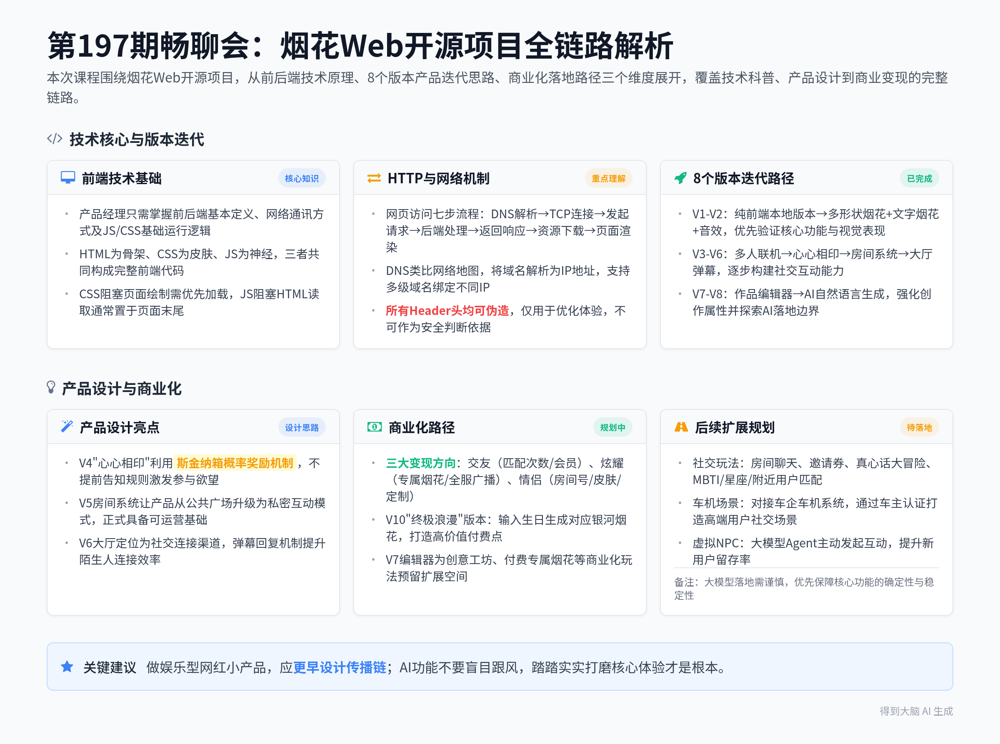

# 烟花易冷Web项目开发直播讲解：前后端基础与产品版本演进商业化

> 本条由 2026-08-19 晚 1 段录音合并成一份，合计约 135 分钟；各段来源见下表，主段是时长最长的一段。

## 当晚分段

| 段 | 开始时间 | 时长 | 标题 | 来源 |
|---|---|---|---|---|
| 1 | 2026-08-19 19:52 | 135 分钟 | 烟花易冷Web项目开发直播讲解：前后端基础与产品版本演进商业化 | https://biji.com/note/1918986171616735776 |

## 智能笔记

### 段 1｜烟花易冷Web项目开发直播讲解：前后端基础与产品版本演进商业化（135 分钟）

### 智能总结

##### 录音信息
- **录音时间**：2026-08-19 19:52:12 ~ 2026-08-19 22:07:39
- **时长**：约 2 小时 15 分钟
- **参与人数**：约 1 人
- **内容类型**：课程讲解

##### 录音总结
本次是第197期每周三晚八点的畅聊会，以烟花Web开源项目为核心载体，从前后端基础技术原理、8个版本的产品迭代思路、商业化落地路径三个维度展开讲解，覆盖从基础技术科普到产品设计再到商业变现的全链路内容。

**产品经理前端知识学习理念**
* **核心学习边界**：产品经理无需记忆最佳实践和主流技术选型，只需掌握前端、后端的基本定义，了解网络通讯方式、header头传递逻辑以及JS、CSS的基础运行逻辑即可。
* **学习适配原则**：该系列课程刚推出，会根据学员的实际学习需求逐步磨合调整内容深度，适配不同基础的学员群体。

**烟花项目基础演示与项目定位**
* **初始版本演示**：展示烟花项目的多个迭代版本，V2版本最多支持4个文字烟花，因粒子量做了限定，不支持超宽文字效果。
* **项目核心定位**：该项目是当月推出的Web Coding开源项目，核心教学目标包含讲解前后端运行逻辑、产品升级构建方法、魅力属性设计思路以及商业化落地路径四大模块。

**网页访问全流程技术科普**
* **网页请求次数说明**：打开一个普通网页会发起十几次到几十次访问请求，淘宝、知乎这类中等复杂度的商城首页，浏览器真实发送的请求数可达80~300次。
* **网页访问七步流程**：从地址栏输入网址开始，依次经过DNS域名解析、TCP/IP连接建立、浏览器发起请求、后端处理请求、服务器返回响应、浏览器资源下载、页面渲染七个完整步骤。
* **DNS核心作用讲解**：DNS相当于网络中的地图软件，将人类易记的域名解析为机器可识别的IP门牌号，支持一级、二级、三级等多级域名分别绑定不同的IP地址。

**HTTP请求与响应核心机制讲解**
* **请求核心构成**：一次HTTP请求包含访问网址、GET/POST请求方式、header头标签、请求实体四个核心部分，GET用于获取资源，POST用于提交数据。
* **后端处理四步逻辑**：后端收到请求后依次完成身份校验、参数合法性校验、数据读写操作、拼装返回响应四个环节，所有来自浏览器的请求信息一律视为不可信内容。
* **五类核心Header头**：Header头分为身份信息类、设备信息类、资源规格类、来源渠道类、缓存处理类五大类，所有Header头均可随意伪造，仅能用于优化体验，不能作为安全判断的唯一依据。
* **状态码基础说明**：200代表请求正常，404代表访问地址不存在，500代表服务器端出错，301代表资源永久跳转。

**纯前端本地烟花版本技术解析**
* **版本核心特点**：V1版本是纯本地静态网页，无需连接服务器，直接从本地文件目录打开HTML文件即可运行，全程不会产生新的网络请求。
* **前端三要素分工**：HTML作为页面骨架负责内容与结构，CSS作为皮肤负责外观与布局，JS作为神经负责交互与逻辑，三者共同构成完整的前端代码。
* **浏览器渲染规则**：CSS会阻塞页面绘制，必须优先加载完成避免出现裸文字乱排版的情况；JS会阻塞HTML读取，通常放置在页面代码的最末尾执行。
* **适用场景说明**：纯前端无后端的页面适合开发单位换算器、BMI计算器、色卡工具、离线小游戏等无需持久化存储数据的轻量工具。

**烟花V2版本迭代思路讲解**
* **版本新增功能**：在V1基础上新增不同形状的烟花选择功能，支持随机星星烟花、自定义文字烟花效果，同时添加烟花爆炸音效。
* **迭代设计原则**：第一个版本优先跑通最小核心功能，验证大模型生成能力和浏览器兼容性，第二个版本优先优化视觉表现，不急于接入服务器端能力。

**烟花V3多人联机版本功能讲解**
* **版本核心能力**：新增服务器端支持，两个不同客户端的用户可以输入用户名后同时连接服务器，在各自屏幕上看到对方燃放的烟花效果。
* **可视化后台功能**：配套开发烟花通讯面板，实时展示在线客户端数量、服务器接收请求数、广播事件状态，完整记录每个用户燃放烟花的坐标、样式等全量数据。
* **前后端协作逻辑**：前端负责渲染HTML、CSS、JS和图片资源，后端负责身份校验、参数校验、数据处理和响应返回，前后端通过JSON格式完成数据交互。

**烟花V4“心心相印”特色功能设计**
* **触发规则设计**：两个用户在5秒内、60像素的空间范围内同时点击燃放烟花，两个烟花会自动合并为三层大型特效烟花，同时展示“小明+小红”格式的合并用户名标签。
* **产品设计巧思**：该功能不会提前告知用户规则，仅对外展示已有多少对情侣完成了鹊桥相会挑战，利用斯金纳箱的概率性奖励机制激发用户的参与欲望，自带天然传播属性。

**烟花V5房间系统功能设计**
* **核心功能新增**：新增房间创建功能，用户可以自定义房间号和房间密码，将房间号分享给指定好友后，对方输入对应信息即可进入专属房间。
* **产品价值升级**：从之前所有人在公共广场随意燃放的模式，升级为支持私密空间的模式，产品正式具备可运营的基础能力，适配情侣双人互动的核心场景。

**烟花V6大厅弹幕功能设计**
* **大厅核心定位**：大厅的核心功能不是燃放烟花，而是为单身用户提供社交连接渠道，用户可以在大厅发布弹幕，表达想要一起放烟花的诉求。
* **互动机制设计**：弹幕支持点击回复功能，被回复的用户会收到明确的界面提示，所有交互数据通过服务器完成广播和单点推送，进一步提升陌生人之间的连接效率。

**烟花V7烟花作品编辑器功能设计**
* **核心功能能力**：用户可以自主选择烟花形状、文字内容、颜色，调整烟花的大小和燃放速度，将自定义编排的烟花效果保存为个人作品，支持在房间内分享给其他用户直接播放。
* **商业化口子预留**：该版本强化了烟花的创作属性，为后续的创意工坊、付费专属烟花等商业化玩法预留了充足的扩展空间。

**烟花V8 AI自然语言生成烟花功能设计**
* **AI能力接入**：接入Deepseek大模型，支持用户通过自然语言描述生成对应参数的烟花效果，同时支持通过自然语言修改房间的夜空背景和主题配色。
* **大模型使用反思**：大模型生成非确定性内容的稳定性不足，会消耗大量Token且效果难以保障，实际落地产品时不要盲目为了贴AI标签强行接入大模型，优先保障核心功能的确定性稳定性。

**烟花项目配套教学体系设计**
* **教学内容框架**：为每个版本配套专属教学解读内容，包含对应版本的prompt、核心功能介绍、升级要点、应用场景、常见问题五大模块，同时配套可视化的前后端通信交互流程演示。
* **学习价值说明**：通过逐版本迭代的项目学习方式，学员可以完整掌握Web开发全链路知识，相关项目经历可以直接写入简历，应对面试中的深度提问。

**烟花项目后续扩展玩法规划**
* **社交玩法扩展**：新增房间内聊天功能，每日免费发放3张邀请券，支持点击大厅弹幕一键邀请其他用户进入房间，后续可扩展真心话大冒险、MBTI性格匹配、星座匹配、附近用户匹配等多种社交玩法。
* **车机场景创新**：对接车企车机系统，实现车机与手机端的跨端联动，通过车机认证车主身份，打造专属的高端用户社交场景，进一步提升产品的差异化竞争力。
* **虚拟用户机制**：接入大模型Agent开发虚拟NPC用户，当新用户进入大厅长时间没有互动时，由虚拟NPC主动发送弹幕发起互动，提升新用户的留存率。

**烟花项目商业化路径设计**
* **三大核心变现方向**：围绕交友、炫耀、情侣三大核心属性设计变现体系，交友方向售卖匹配次数、会员服务；炫耀方向售卖超级专属烟花、全服广播权限；情侣方向售卖专属房间号、房间装扮皮肤、定制烟花服务。
* **终极浪漫V10版本设计**：跳过V9版本直接开发V10版本，用户输入生日年月日，系统推算出当天地球视角下的银河状态，将银河像素图转化为烟花特效燃放，打造专属的浪漫记忆点，该功能可作为高价值付费点。

**课程收尾与后续安排**
* **课程内容反馈收集**：收集学员对本次课程内容深浅度的反馈，调整后续课程的内容节奏，解决部分学员反馈的技术部分偏抽象、宏观商业内容偏少的问题。
* **后续课程预告**：下一期第198期畅聊会将讲解DeepSeek Harmony产品带来的行业变化，后续还会安排社保政策、灵活就业群体相关的热点内容分享。

### 章节概要
**00:00:00** **开场问候与基础理念说明**
开场向进入直播间的学员逐一问好，说明自己周一刚剪了头发，明确产品经理学习前端技术的核心理念，指出产品经理无需记忆最佳实践和主流技术选型，掌握前后端基础定义和网络通讯基础逻辑即可，同时说明该系列课程刚推出，会根据学员需求逐步磨合调整。
**00:03:00** **烟花项目初始效果演示与项目定位说明**
演示烟花项目的多个早期版本，说明V2版本因粒子量限定最多支持4个文字烟花，不支持超宽效果，明确该项目是当月推出的Web Coding开源项目，核心教学目标覆盖前后端逻辑讲解、产品升级方法、魅力属性设计、商业化落地四大模块。
**00:08:00** **第197期畅聊会正式开场**
正式开启每周三晚八点的第197期畅聊会，说明本次课程分为从烟花看前后端逻辑、烟花8个版本迭代思路、后续升级与商业化思路三大部分，是首次完全按照技术、产品、商业三个核心要素构建的基础课程。
**00:12:43** **网页访问全流程技术科普**
讲解打开一个普通网页会发起十几次到几十次请求，淘宝、知乎这类中等复杂度首页请求数可达80~300次，完整拆解从输入网址到页面渲染的七个核心步骤，详细解释DNS域名解析的核心作用，类比DNS为网络地图软件，将域名转化为机器可识别的IP门牌号。
**00:21:38** **HTTP请求与响应核心机制讲解**
讲解HTTP协议的基础规则，说明GET和POST两种请求方式的区别，拆解后端处理请求的四个核心步骤，强调所有来自浏览器的请求信息一律视为不可信内容，避免出现价格伪造等安全漏洞。
**00:55:09** **五类核心Header头详细讲解**
逐一讲解五类核心Header头的作用，包含身份信息类、设备信息类、资源规格类、来源渠道类、缓存处理类，说明所有Header头均可随意伪造，仅能用于优化体验，不能作为安全判断的唯一依据，同时科普常见的HTTP状态码含义。
**00:28:00** **纯前端本地烟花V1版本技术解析**
讲解V1版本是纯本地静态网页，无需连接服务器，直接从本地文件目录打开HTML即可运行，拆解HTML、CSS、JS三个前端核心要素的分工，讲解浏览器渲染的阻塞规则，说明纯前端无后端页面的适用场景。
**00:39:25** **烟花V2版本迭代思路讲解**
说明V2版本在V1基础上新增多形状烟花选择、自定义文字烟花、燃放音效功能，讲解产品迭代的核心原则，第一个版本优先跑通最小核心功能验证可行性，第二个版本优先优化视觉表现，不急于接入服务器能力。
**00:44:00** **烟花V3多人联机版本功能演示与讲解**
演示V3版本的多人联机效果，两个不同客户端的用户可以同时看到对方燃放的烟花，讲解配套的可视化烟花通讯面板功能，完整展示前后端协作的运行逻辑，前端负责页面渲染，后端负责数据处理和广播分发。
**01:08:30** **烟花V4“心心相印”特色功能设计讲解**
讲解V4版本的合并烟花触发规则，两个用户5秒内、60像素范围内同时燃放烟花即可触发三层大型合并特效，说明该功能不会提前告知用户规则，利用斯金纳箱的概率性奖励机制激发用户参与欲望，自带天然传播属性。
**01:20:56** **烟花V5房间系统功能设计讲解**
讲解V5版本新增的房间创建功能，用户可以自定义房间号和密码，分享给指定好友进入专属房间，说明该版本让产品从公共广场模式升级为支持私密互动的模式，正式具备可运营的基础能力。
**01:26:30** **烟花V6大厅弹幕功能设计讲解**
说明大厅的核心定位不是燃放烟花，而是为单身用户提供社交连接渠道，用户可以发布弹幕表达一起放烟花的诉求，弹幕支持点击回复，被回复的用户会收到明确提示，进一步提升陌生人连接效率。
**01:30:47** **烟花V7烟花作品编辑器功能设计讲解**
讲解V7版本的烟花作品编辑器功能，用户可以自主调整烟花的形状、文字、颜色、大小、速度，保存为个人作品分享给其他用户播放，该版本强化了创作属性，为后续商业化玩法预留扩展空间。
**01:37:47** **烟花V8 AI自然语言生成烟花功能讲解**
说明V8版本接入Deepseek大模型，支持通过自然语言生成烟花效果、修改房间主题背景，同时反思大模型落地的问题，大模型生成非确定性内容稳定性不足，消耗大量Token且效果难保障，不要盲目为贴AI标签强行接入大模型。
**01:44:26** **烟花项目配套教学体系设计讲解**
介绍为每个版本配套的专属教学内容，包含对应版本的prompt、核心功能介绍、升级要点、应用场景、常见问题五大模块，配套可视化的前后端通信交互流程演示，说明逐版本迭代的学习方式可以让学员快速掌握Web全链路知识，相关经历可直接写入简历应对面试。
**01:51:33** **烟花项目后续扩展玩法与商业化路径讲解**
讲解后续可扩展的社交玩法、车机跨端联动玩法、虚拟NPC用户机制，围绕交友、炫耀、情侣三大核心属性设计完整变现体系，最后介绍跳过V9直接开发的V10浪漫版本，输入生日年月日即可生成对应日期银河效果的烟花特效，打造高价值付费点。
**02:09:00** **课程收尾与后续安排说明**
收集学员对本次课程内容深浅度的反馈，调整后续课程节奏，预告下一期第198期畅聊会将讲解DeepSeek Harmony带来的行业变化，后续还会安排社保政策、3.1亿灵活就业群体相关的热点内容分享，最后祝所有学员七夕快乐。

### 金句精选
- “IP是给机器看的，域名是给人看的。” (方法技巧)
- “前端校验是给好人以礼貌，后端校验是给坏人的门锁。” (执行策略)
- “所有的header都是可以随意伪造，只要构造一个HTTP request就可以了。” (方法技巧)
- “做娱乐型网红小产品，一定更早的去设计传播链。” (产品设计)
- “大模型部分的功能就是这个样子，就是没有非大模型的确定性高，就是不断修改，就是糟蹋你Token。” (思考启发)
- “纯在这给我造个Token，踏踏实实挣钱才是根本。” (商业洞见)
- “在茫茫的宇宙中，你们两个心灵交汇的那一刻的那种悸动。” (情绪共鸣)
- “银河是在转的，斗转星移，沧海桑田。” (情绪共鸣)

### 待办事项
无

---

## 完整逐字稿

### 段 1｜烟花易冷Web项目开发直播讲解：前后端基础与产品版本演进商业化（135 分钟）

🟢 说话人1 [00:00:00]
卓越，你好。城内也好，宏泰也好。何先生，你好。

🟢 说话人1 [00:00:14]
需要啥？需要学前端知识技术，那那餐你就别别闹了，你还需要学这玩意，这玩意对你来讲不就是跟玩一样吗？我觉得不用去记最佳实践和最主流的技术选选型，这东西是技术的事。我的理念是产品经理知道啥是前端，啥是后端，里面的通讯方式，header头的调的这种就是来回传来，就是他是怎么来回去这个传递的，然后JS CSS他之间的这些逻辑是什么，我觉得就够了。反正这是我的理念，因为因为这个。这个这个这个分支系列其实也是也是刚开始来出，然后的话我觉得也是需要跟大家一起来去磨合的，因为主要是。我不知道大家需要到什么样的地步，你知道吗？就是当我不知道大家需要什么样的地步时候，实际上是我最慌的时候。

🟢 说话人1 [00:01:06]
菲菲酱你好，free你好。菠萝你好，大林你好。啊对我理发了，我周一理的发，周一理的发。嗯。然后88232你好。天成银，你好。

🟢 说话人1 [00:01:33]
嗯，这个是那个水獭是吧？你还是海豹啊？Leo你好，刘欢你好，就这些为了外部环境啊。刘海太厚了，需要削薄一些。哎呀，我我其实是为了把这个头发就就就就往就往上弄起来，但是我今天没今天没打胶水塔是吧？好，我记住了水塔O K。阿丹，你好。对对对对，理理了个发，哎，你好啊，这是你的那个头像好好看。哎，为什么我这个东西就自就能自己在动呢？

🟢 说话人1 [00:02:22]
知道什么能做什么，主要是我是主要我我一直觉得技术太简单了。除了算法之外，我觉得所有的技术其实本质上都很简单，就为什么呀？我这哪碰着他了吗？

🟢 说话人1 [00:02:46]
为什么能它就一直在动呢？我这有什么设备会连着它哦，我知道了。我知道了。烟花什么时候炸？嗯，现在给你扎一个，但是就是我我我觉得我的这个版本不是说特别优秀啊，我给你看看我的这个版本，来。

🟢 说话人1 [00:03:15]
我这版本比较有意思是什么？大家注意看，我这核心的今天要给大家讲，就是我有若干若干若干若干若干个版本，我有一堆版本啊，从V1到V10跳了个V9，对吧？然后有不同的版本，我给你随便找个版本，扎扎试试。先我们先拿这个V2版本，先我们先放一个。

🟢 说话人1 [00:03:45]
怎么样？开心心，你好。你们大学还拿dreamweaver来去学来做网页啊？啊，真假。

🟢 说话人1 [00:04:05]
怎么样？

🟢 说话人1 [00:04:33]
最多能放四个字。最多能放四个字，不支持超宽。所以我们只能是这样做。因为我在粒子量上，我去做了限定。

🟢 说话人1 [00:04:58]
有意思吧。控制了一些列，控制了一些我的粒，我的粒子量。formal base现在实在是过分古早了。现在你好，杨龙东你好，南木你好，你那块有点小啊，因为我屏幕大，我屏幕大，小安七快乐吧。来我们还有3分钟啊，还有三还有3分钟。然后核心点，大家可以思考一个问题：今天的海报也出了，我烟花这个项目我做了八个版本，一直在升级。这八个版本我都做了什么？我这我我都我都为什么能升级八个版本，每个版本的这个变化是什么？粒子按区炸开的效果啊，这可以可以留给你们做，反正我已经放在地址上了，反正已经放在地址上了，对吧？烟花是个啥项目？烟花是这个月给到你们的那个Web coding的这个这个开源项目。

🟢 说话人1 [00:06:08]
这个项目核心点，我们的主要的教是教什么？教大家前后端是怎么回事啊？是是是教大家前后端是怎么回事。今天课程放出来，哎，这么着急干嘛呀？一是前后端是怎么回事，第二个呢是教大家。如何？去升级构建产品，如何能够去设计出魅力属性的东西，如何去做商业化？今天讲的是这套东西。啊，丹青你好，Git怎么用？你直接问你的ChatGPT呗。直接问ChatGPT呗，Morning morning你好。

🟢 说话人1 [00:06:55]
抹了50块钱的咸鱼，你好，李二狗，你好。赛博抽烟，赛博抽烟的app其实能做出来很多这种这种小的闲玩的东西，就包括我这个东西，你要真是命好，其实也不是见得完全挣不了钱啊，闲不晓得你好，很好玩。

🟢 说话人1 [00:07:31]
然后，Champion你好，超级会员你好，特效、特效不属于小游戏。完全不属于小游戏。

🟢 说话人1 [00:07:51]
圆圆你好，小李子你好，对，剪了头发，剪了头发，是的，巨子剪了头嗯。好，时间到。好，各位。新各位同学，欢迎大家来到每周三晚八点和大家不见不散的畅聊会。今天畅聊会197回，今天给大家讲这个答应大家每个月做一个Web Coding项目，在这个Web Coding项目中，每个东西给大家讲一点这个和技术相关的东西。那么今天呢，咱们开始第一个Web Coding项目，烟花易冷啊，烟花易冷，人事易分，而。你再问我是否还认真，对吧？我还是很认真的，对吧？

🟢 说话人1 [00:08:28]
啊，今天呢给他讲三部分东西，第一个呢讲一讲这个从烟花去看前端啊，非要说你已经登上我git了是吧？你你已经登上我git了，对不对啊？你这你跟我说这个话，一就是一定是你已经上了我的git，然后知道我是干嘛，知道我那个项目是。好啊，没问题，是fireworks鞭炮。嗯啊，然后对吧，然后从烟花来去看前端。和后端的逻辑啊，这这这我我写的是烟花，我要告我要跟你写的是花火的话，那你就那我就有可能是个这个亲日的了，对不对？是吧？

🟢 说话人1 [00:09:11]
然后第二个给大家讲烟花易冷的八个版本。哎，这个大家可以先去想一个问题，就这么一个简单的功能，我为什么能做出八个不同的版本来？八个版本呢，依次递进，我到底做了什么样的一些功能差？也就是我的第一部分实际上是给大家去讲技术的一些基础的东西。第二部分呢，给大家去讲产品构建和升级思路。第三部分呢，讲讲后续的升级，也就是你的规划和商业化的思路。这堂课呢，我觉得我觉得我也是做一个尝试。这堂课可以讲是我讲了这么多年的朝阳会的课，我觉得实际上是讲的最为怎么说呢，最为基础，最按照技术、产品、商业三个核心要素来去做构建的一堂课。非常basic，有可能你会觉得哎呀太basic了。如果你们就觉得太basic的话，那跟跟我哭啊。我下次就给他讲的就是更加高一点了，就就看一下咱们的就是互相对齐一下这个位置，先去叠个甲啊，神奇柚子你好，小包日常你好，日经老李你好啊，小杜小邵你好，来海军你好，来我们先从烟花看一下前后端的逻辑。

🟢 说话人1 [00:10:17]
首先呢我们先看一下效果啊，我们先看一下效效效，我们先看一下效果，对吧？今晚放点烟花，我们先看一下我们这个项目的V1版本的效果，这是我做的总共一大堆的版本，然后我们先从第一个版本的效果先来去看。这是V0，我们先看V1。V1呢就做的很简单。咚咚咚咚咚咚咚咚咚咚，就是很简单的一个鞭炮的样子啊，很简单的一个鞭炮的样子。这是第一个版本，这是我们的最基础的版本啊。

🟢 说话人1 [00:10:49]
然后这是非常简单的一段框啊，我想做一个基于外APP的，可以放烟花的项目，黑色背景，鼠标点击可以随机出现不同大小不同状态的烟花。本机版本就这么一个版本，今天呢我们又开始用这种超简单prompt来去开局了啊，又做这种超简单的prompt来去开局了。如果呃同学们，尤其是这个男孩子，你们要是有。Webhook的这个工具，然后把这个东西直接输进去，一会儿你就可以给你的这个给你的这个这个这个你的小姐姐看了啊。

🟢 说话人1 [00:11:25]
啥叫本机版？不是，大家说你你你你不是你不是技术出身的吗？啥是本机版？本机版就是不需要连连服务器，纯粹本地执行的一个版本啊。对不对？就是纯粹本地执行的一个静态网页版本啊，不连server啊。你不是技术背景，怎么会问这个问题？烟花音效第二版本有，烟花音效第二个版本我加了这种砰砰砰的那个声音，有的。苏梦你好，明勇你好啊。哎，就这么一个非常简单的东西，这里面我们借这个东西讲一下前后端。讲一下前后端对吧？哎，杨错这个东西其实出来的不是local host，不是local host。这个出来的不是local host。同学们注意，用这个方法出来的，其实不是出local host，没有host，local host也是有host。这个东西出完之后，它是一个本地的静态网页，是一个部署在你本地的一个html，点开之后的话，应该是从你的本地文件目录直接访问那个html，而不是用local host。那所以呢这个这个杨你这叫学艺不精啊，然后半毛线你好，不安数你好啊。

🟢 说话人1 [00:12:43]
然后讲一下前后端，我们在访问一个网站的时候都发生了一些什么样的事，都发生了一些什么样的事。我们打开一个网站总共做了多少次访问，咱们先问大家一个小问题啊。打开一个网站的时候，你做了多少次访问？打开一个，比如说像这么一个非常简单的小页面，总共要发多少次访问？打开。A一次二五次三几十次四钝角选选哪个？是十几几十几百一次五次。

🟢 说话人1 [00:13:34]
大于3是吧？4次。不是你们，你们是跟我这玩抽象，还是真不知道？啊，你们是跟我这玩抽象，还是真不知道？我操，那我这就这玩意儿我都能开门课啊，是吗？哎呀，这还是michael这个咱们这些老programmer，咱们这些老programmer还是知道。事情呢，我的天呐，我我也觉得他们是跟我在这玩抽象，你知道吗？我觉得我是对吧？

🟢 说话人1 [00:14:07]
其实它是要发生很多很多很多次，它是要发生至少十几次，多则几十次的访问请求的，它要发生几十次的访问请求的。它在这个过程中的话，你如果是在Chrome上摁F12打开调试控制台，你点开这个Network这部分。点开这个Network这这这部分，然后你就会发现这都是它的访问请求次数非常多。你在这访问了一个HTTP，然后3W dot Google dot com dot Hong Kong。然后在这个过程中，你会发现它除了这个Document之外，它要加载一大堆的Script，就是你的GS脚本。你要加载一大堆的这个，它会跟你的后台有ping，它还会有CSS，它还会有图片，每一个东西都是一次单独的请求，所以它在这边会有多次、非常多次访问，所以。

🟢 说话人1 [00:15:00]
一次访问发生什么？你输入的是一个网址，Google这个首页已经非常简单了，十几次到几十次。但是正常你比如说你要打开淘宝，打开淘宝首页，打开知乎的首页，一这样一个访问的话，浏览器真实发送的请求差不多是80~300次，这是一个中等复杂度的商城的首页，这里面包含什么？一个HTML。N个CSS啊，CSS是搞定我们是长什么样的，N个JS前端能够去做什么样的一些访，这样一些动作操作，N个图片和字体，也就是说这里面的图片是一次一次单独去做加载的，N个接口请求来去给到你业务数据，来去拼装的，也就是我们所说的JSON，N个买点，这里面有三方，有统计，有广告，你比如说中间有条广告，这是一次单独的访问。啊，他是调一次JS的啊，有一个统有一个你看不到的统计代码，三方的，比如说是用的这个我要点啦，或者等等其他的这样一些三方。统计你看不到，但是他有。这是他整个的一次访问中，他在背后要去做的所有的访问行为。所以你从按下回车这一刻，在浏览器栏上按下回车，到屏幕上发出了这个内容，这个过程的话总共有七个动作。你在地址栏的这个操作是你这边的操作，然后你把这个网址发出去之后的话，进入到了。

🟢 说话人1 [00:16:25]
DNS服务器有同学不知道什么是DNS吗？有的话给我扣个零。咱别玩抽象啊。我靠。

🟢 说话人1 [00:16:45]
不是D D，你不知道D N S啊。这跟技术没关系，D I S跟技术没关系。

🟢 说话人1 [00:17:00]
好好好，我给你们讲一讲啊，我我我给你们讲一讲。我靠，我怎么感觉我做一门技术基础课也有受众呢？DNS是这样子的，同同学们，咱们输入的是域名，什么是域名啊？3W点百度点COM，这是个域名，对不对？这是个域名，对不对？但是。你到了一台服务器，这台服务器是不可能有一个域名的。服务器是IP地址，大家知道IP地址是什么吧？你的本机，你你如果什么都没有，是127.0.0.1。但是一台服务器它是在网络中有一个，这是叫IPV4，就是四段式的地址。通过这个地址，你可以认为这个地址是一个。网站的或者一个服务器的门牌号，通过这个门牌号才能在整个一张巨大无比的网络中找到这个服务器在哪。而DNS的。逻辑是从域名解析到这个号，因为这个196.168.3.454呃，点145这个东西你记不住啊，你记不住，没有人能够记得住这个IP地址。比如说我在上大学的时候，我我我们当时在大学做的校内网，我到现在我都能记住它的IP，202.113.16.168，但是没有人能记住它，所以我们要把它用3W点TWT点EDU点CN，就是天外天点EDU点CN，把它解析，全球有一堆的去做DNS解析的时候。

🟢 说话人1 [00:18:41]
这些Server呢，就是你在做所有的用域名访问时，是先连到他们，他们你可以认为是一个巨大无比的一个表，连到这个之后，好哦哦哦，我我看一下这个IP是什么，把这个IP给到你，你去访问那个IP去了，那你去访问那个IP去了，明白了吧？所以是。这么一个逻辑，明白了吗？IP是给机器看的，域名是给人看的。OK，你能明白吗？啊，不是校内网，是我们学校的校园网站是我做的，我们学校的校园网站是我做的啊。我们学校的校内网，就是在当年的话，2000年刚开头的时候，很多的学校自己会有非常强的一些校园网站啊，包括有自己的BBS，我们公司的系，就我们学校的校园网站是是我们做的。

🟢 说话人1 [00:19:34]
一个网站不止一个IP，不止一个IP，它可以有多IP，但是它的逻辑是什么？它有一级二域名，二级域名，三级域名，四级域名的概念，什么是一级域名？3W点百度点COM，什么是二级域名？百度网盘是盘点百度点COM，百度图片搜索是Image点百度点COM，二级域名可以再放到其他的IP上。二级域名、三级域名、四级域名可以分别去绑相应的东西。大家理解了吗？

🟢 说话人1 [00:20:04]
这么说大家就明白DNS什么了吧？DNS也就是说知道你要访问3W.google.com，它的IP是什么？我给你指过去，给你引路的，DNS是给你引路的啊，给你一个门，给他给你一个门牌号，告诉你去那OK。你可以简单的再用一个简单的理的想法是什么？它有点像是一个地图软件，它是个地图软件。你要去哪儿？你要去百度大厦，然后百度大厦这是你能记住来的名字，但是在地图上没有地图知道什么叫百度大大厦。地图软件告诉你百度大厦是东京多少多少度，北纬多少多少度，去那里。然后再有路径，你过去理解了吧？

🟢 说话人1 [00:20:48]
DNS OK好，然后你的浏览器基于整个的网络TCP IP的结构和这个地址建立了链。接，这在路上，你俩通了，好，你这发出一个 request，发出一个请求，我们一会说这个请求里都包含什么。首先是你地址栏的这个路径，后端是它的服务器，服务器做相应的处理。哦，你要这个是吧？我给你返回相应的响应，然后浏览器做渲染。那你这个就可以看到是哪是你这边的，哪是服务器的，哪是路上的这些工作去干的事。

🟢 说话人1 [00:21:25]
啊，3W是3W是，但是3W一般约定约定约定俗成嘛，约定对吧？好，这里面给大家看看，这里面每一步都在干什么。第一步，地址栏，HTTPS杠或者HTTP，这是用什么方式说话？它是有不同的协议，在这里面的话，大家一般是没有在前面去写这个的，它会默认给你解析成HTTP或者HTTPS，加了S是什么？加了S是加密，对吧？

🟢 说话人1 [00:21:55]
但是不代表这里面不能写别的。还可以写什么别的？在地在地在地在地址栏上，除了HTTP和HTTPS之外，还可以写别的什么协议？FTP，FTP对，FTP对，SAN对吧？然后你敲的域名shop点image点这个一点example点com就是找谁是这个站，啊这是我们的地址栏所干的事，然后后面如果再有后面的东西，杠pro。杠1024啊，这是在它的目录结构中，你要第多少页？有时候会有一个问号啊，from什么？

🟢 说话人1 [00:22:45]
等一下，我开始说。

🟢 说话人1 [00:22:53]
嗯嗯，好，谢谢。

🟢 说话人1 [00:23:10]
就握一次手来去交换密钥，这就是为什么HTTP和HTTPS不太一样。加了S之后的话，他在第一轮的话先来去做一轮公司要，然后说哦这是个安全通道，这是个安全通道。OK好，然后4~5我们说叫把话说出去，那对面开始干活了，对吧？4是发出请求，这里面发请求发4个东西。第一个我要去哪，我的网址是什么？第二个我要干什么？我要通过get或者post两种方式来告诉我要干什么。get是我要取什么东西，post是我要交东西。get就是我要拿到这个网页的东西，post是我提交一个表单，我要提交我的数据，比如说我要提交哎我的我我这里面注册登录，我要。提交我的username和password，或者是我的phone number和我的验证码，对吧？post是我要往上提交，get是我们拿你的网页，这就是我发出请求里面的内部的这些东西。

🟢 说话人1 [00:24:13]
然后还有一个叫做随货标签，就是我们待会会给大家去讲的header header。然后第四个呢是货物本身就是这个保底，就是我要整体的发出请求的request这个整体的内容。这是我发出一次请求的时候，从浏览器端构建的这个request。它所里面包含的东西，然后5后端处理也是4件事。第一个我要验身份，你是谁？你是谁？你带没带你的登录信息？你带没带你的cookie对吧？你有没有资格访问我这个内容啊？对吧？我这个内容是不是加密的？是不是要有权限的？是不是要付费的？对吧？

🟢 说话人1 [00:24:50]
第二个叫参数，你给的东西合不合法呀？你是不是要给我做一次浏览器注入啊？对吧？如果不合法的话，我会有一些机制把它挡出去。第三个我要去取或改数据，我拿到你post过来的东西，对吧？这是你给我呈上来的折子，我看一下是要让我查数据库，还是写数据库，还是改写什么样的东西，我还是要去调一个外部的API给你返回什么样的信息。最后把你所要的东西，如果你的身份啊验明正身了，啊参数也没有问题了，那我允许你干这个事，对吧？

🟢 说话人1 [00:25:24]
根据你所要的，哦，你要取这个数据是吧？你要去取一下。搜索的这个这个keywords为礼物的这个搜索的query的结果的error list。然后我把这个接口返回出来，所有的这个我为礼物的礼物的这个搜索接口给到你，这是我拼装返回出来的一个包裹给你了，这是你要的数据。这是你要的数据。好，然后6~7的时候，这个东西回来了，浏览器就开始干活了。

🟢 说话人1 [00:25:54]
哎，我拿到这个东西返回响应，拿到了respond，拿到了第一个是状态码。第一个我。先拿到一个状态码，这状态码是什么？大家知道404吧，动不动一个页页面404，404就是个状态码，这东西叫做没成访问不到，对吧？2200就是正常，50几503就是服务器出错了，然后给你一个request的header，这批货得怎么处理啊？

🟢 说话人1 [00:26:20]
他会默默的告诉你，我告诉你这事很有意思。就是你的浏览器和服务器之间，他们所聊的东西，有些东西是不告诉你的，你们知道吗？有些东西是不告诉你的，就是服务器会告诉你什么，哎，他会给你一套响应头，就是这批货拿来之后怎么处理，你要不要缓存它，这是个什么东西，你不知道，浏览器自己偷摸就给你干了，知道吧？然后另外是响应体，这是真正的内容，它一般是html或者是一组数据。

🟢 说话人1 [00:26:52]
浏览器怎么干呢？他先去读说明书，先把html先看一遍哦，这里面有这些东西，你可以认为。这个HTML本质上是什么？本质上是一套乐高组合的说明书。我看一看我都需要什么，哦，我这需要有一张图片，我从架子上去取，我这要有一个CSS告诉我这个样式什么，我去那将来去取出来，我这还有一个JS，这是里面怎么动的说明书，我再把它拿出来，按照这个JS的要求去动起来。所以第一个读说明书，我通过HTML的这个骨架来判断我还需要什么东西。第二个去补要素，再发十几个请求去下载我的CSS、JS和图片，然后算根据这里面的HTML的要求和CSS的要求，算每个元素长什么样，放在哪里。也就是说根据这个骨架图放到这里面，跟拼乐高一模一样，最后画出来到这一刻才真正网页上呈现出来了这个内容。所以你从你敲下来之后的话，是从你的浏览器到服务器，到全球的DNS的解析服务，一堆的。东西干了一堆的活，干了一堆的活，谢谢这个0729啊这个。

🟢 说话人1 [00:28:02]
先问大家问题，我这堆东西是讲的太简单了，还是太抽象了，还是怎么样的一个反馈，能给我点小反馈吗？所以我们了解到这个情况之后，我们在第一版先简单一点，我们先做一个没有服务器，只有本地的东西，只有本地的东西，有有点抽象了。我操，这就很麻烦，就是这就很麻烦，就是听过的觉得我没用，没听过的觉得听不懂，有点想想我我还是得想办法得用什么方法去干啊，这个我还是得想办法得怎么去办啊，对吧？一丢丢抽象是吧？OK。我还是得想办法怎么怎么怎么去去办啊啊，然后我们先看一下啊，我们这个第一版出来之后的话，其实他按照我刚才的那个要求，下周讲D D S H下周讲这周已经把要讲什么已经。预告完了，已经你就就就这周讲啥，上周已经都说完了，对吧？对吧？

🟢 说话人1 [00:29:10]
F12是吧？可以啊，一会我F12出来了，你看我们第一版先简单一点，我们先不做服务器，纯本地，纯本地的目标是什么？看这里面我的文件。没有local host，没有127.0.0.1啊啊怎么谈恋爱，你以为我很懂吗？因为我我我很懂吗？我也不懂啊，对吧？咱们同学都知道，我对我对爱情这件事不是很懂啊，对吧？你看，这是一个完全的本地文件嘛，对不对？完全的本地文件，杠user，杠win，杠document，杠ChatGPT，杠烟花，杠in that。对不对？然后完全本地文件去做这个事，所以它是一个纯本地，没有服务器的。东西，这代表什么呢？这代表什么？

🟢 说话人1 [00:30:04]
啊，你的浏览器请求的是一个本地文件。是一个本地文件，本地文件是不可能有服务器作为背后响应的，这个大家都能明白吧？这样子就是一个纯的客户端，当然注意啊，这个客户端我说的不是说你装了一个ESD文件，或者这个这个这个要去安装的一个文件，那个叫桌面客户端，这个其实就是你在客户端侧的东西叫客户端。啊对，哎，包里你还记得我我这么多年讲的那个三角模型对不对？啊，太棒了。所以客户端能做什么？就是在这个客户端上纯的一个网页代码能做什么？就能做三个东西，html、css和js，就这三个东西。

🟢 说话人1 [00:30:53]
H苗是一个骨架，它负责内容和结构。这里放标题，这是标题，这个标题叫做啊。这个标题叫什么？叫叫做烟花，对吧？然后这里是一张图，这里是个按钮。啊，搜索引擎和毒和毒和毒品软件只会认html，所以它决定的是seo的效果和无障碍体验。第二个，css，css是皮肤，你可以认为html是骨架，css是皮肤，js是神经。皮肤决定的是什么？爱情的三角，爱情的三角。不是，那不是想做、能做、值得做的三要素，爱情三角。啊，讲的这个不合适吗？后人觉得哪的问题，对吧？然后他是解决的是外观和布局问题，一个图片，一个框架多大，什么颜色放在哪，屏幕窄的时候该怎么排，他决定是用户的感觉是什么样的状态。PS是神经。

🟢 说话人1 [00:32:00]
啊，交互和逻辑在这边点了之后，在前端会发生什么样的效果，什么样的时候要数据，什么时候更新画面，这是在G S上面要去做。他决定的是这个页面会不会崩，这个顺序是先天降级的啊，对吧？然后我们看一下，在这个整个一个H M会涨什么样，这个是我刚才给到大家的这个第一版的这个东西，所以他在这门这里告诉你这个页面的title是什么东西，这个页面的title是什么？这抬头叫夜空放烟花，这个抬头展示在哪里呢？这抬头展示在这里。这个抬头展示在这里，夜空放烟花，它在这个位置啊。我尽量多关点眼睛，这个东西还是比较占它吃内存，吃的非常狠，吃内存吃的非常非常狠。好，这夜空放烟花。

🟢 说话人1 [00:32:56]
好，然后大家看到这一行就一个，那什么，还有一个style点。Sss. style点CSS这是干什么的？看一下能不能看到。

🟢 说话人1 [00:33:21]
算了，我一会儿再给你们看吧。然后这是它的CSS的位置，最后放了一个APP点APP点JS的位置，中间是它的所有的我这个页面的布局在哪里，有个什么样的框，我这放了一个画布使用说明控制面板形状选择编辑器，我的烟花作品AI创作助手，这是我的这些容器放在哪里？然后我们分别看一下它CSS和JS去解决什么样的问题。CSS呢，就是在这个里面的话去标示出来我的body，我的整个的页面，它的宽度是多少，高度是多少，我这里面宽和高。都是按照100%去做的，然后它有没有这里面的编剧，然后它的背景颜色是什么？它的整体的这个包里的颜色的配置，然后它的相应的这个firework就是它的这个这个鞭炮，它的相应的位置是用的它用的绝对位置，然后距所有的页边距行边距，也就是说它的所有CSS叫做样式描述，描述的是我的每一个框架，每一个部分它的。颜色展现方式，它的这些皮肤是什么呢？

🟢 说话人1 [00:34:32]
GS是我在最后放的，它是在干什么呢？我们看一小段东西大家就明白了。这段的话全都是你看这边什么Rocket Target X-180×7啊，Y的Rocket Target Y，这是干嘛的？这是一看就是在去算粒子位置的，算粒子位置的对吧？它是干什么？它是在页面中可以执行的脚本。这是什么？这是我们一般所说的前端，这是我们一般说的前端代码。所以HTML、CSS、JS三个东西加起来之后的话，就是前端代码，前端代码。也就是说大家所所说叫做前端会被干掉，就是因为这个这个这个这个现在的大模型在前端代码写的太强大，所以这就是所谓的前端代码，理解了吧？

🟢 说话人1 [00:35:20]
好，然后我们再说一下浏浏览器拿到这些东西之后的渲染流程。第一步，他先去读说明书，把这前面读一遍，然后发现哦，这个位置需要去一个CSS，这个地方需要一个JS，这个地方需要一张图片，这地方需要一个字体，他开始单独一个个下载线程，把它补下来，然后开始根据CSS去算样式，每个元素哦长成这个样子啊，再算位置，再去算这个东西在哪里，有多宽多高，然后内容去做呈现。它会有些堵塞，它会有一些阻塞规则。阻塞规则是这样，第一个CS是会挡住画的这个动作，什么叫做挡住画？叫做CS. 

🟢 说话人1 [00:36:00]
CSS没有加载出来的时候的话，页面是不会给你一点点的去绘制出来的。大家有没有看到过有些网页就是它是崩的，它里面的字都有，但是整个这个样式全没有了，有见过吗？这种就是它的CSS崩了或者CSS没有加载出来的问题。正常情况下呢，就是比如这个从浏览器上，它是不敢在CSS没有全部署完成之前来画的，否则用户就会看到一堆的裸文字，一堆的这个字。排版也是乱的，全也是乱的，突然间刷了一下，啪，又回去了。

🟢 说话人1 [00:36:33]
所以你一般来讲，你的页面CSS在HTML的代码里放要放在最前面，它得最先加载出来的，它得最先加载出来的，最先加载完了，尽早的去做拼装，然后JS会挡住读。读HTML只要一碰到一道JS按照浏览器一般规则会默认出来，先去执行它，先不会加载下面的，先把这段JS。先执行完毕，所以JS一般放到最后啊，这就是一般的规则，知道吧？这是一般的规则啊，人类是怎么发明这些计算机语言的？这个就要从编辑器和解析器这些东西去讲了，这个有点久远了就，对吧？然后这是它一整套 HTML 的逻辑。所以你看，在最上面放了一个 CSS，在最下面放了一个 JS。这里面其实就是按照这种逻辑的，而且这大模型写的代码一定比人类在这些规范上其实写的会更好一点。

🟢 说话人1 [00:37:32]
好，所以这是我们的第一个版本，明白了吗？就这么简单。但是它的特点是什么？它是纯前端代码，纯前端代码的特点就是刷新就失忆，因为它没有存任何的东西，它没有存任何任何的东西。对吧？他甚至不是local host，所以他连本地的东西都没法存。他就是浏览器，把这个H M L把C S S把G S加载完就跟服务器断了啊，即便是说。你做了一个有服务器的，但是静态页面也是这样子的。

🟢 说话人1 [00:38:05]
之后你点按钮，JS是现场算的，跟你后端没有任何关系。改它通过JS改了前，它前端的页面就结束了。全程在这个后续一个请求都无法，你点一点它也没有任何新的请求出来了。这个适合在什么？就这种场景一般是做什么的呀？这种纯前端完全无后端，全拿GS搞定，一般干什么？比如说你做个单位换算器足够了，对吧？从英镑换算成这个千克，对吧？BMI计算不用后端的东西，色卡工具不用后面的东西，正则测试器不用后面的东西，离线小游戏，对吧？离线小游戏不用后面的东西。

🟢 说话人1 [00:38:48]
这是非常典型所说的东西，门户哦。你你你说是那种企业portal是吧？是的，但是这几个我觉得是有JS，但是还能看到它这个有一些看上。有动态变化，但是本质上还是那个什么的，本质上还是那个什么的，对吧？好。这是所谓的是各种一个页面可以搞定的小工具，一个页面可以搞定小工具，比如说什么个税计算器，个税计算器，比如说房贷计算器，就各种这种，不需要任何后端，你没搞清楚。然后我们就开始第二个版本啊，第一个版本做完了，我们开始第二版本。在这之前我先做了一个全局的东西，我先做了一个全局的system prompt，这什么东西？

🟢 说话人1 [00:39:36]
就是啊这个版本把这个保留为版本一，做一个弹窗能够展示我每个版本的prompt，后面每次我说这是版本二啊，都给我这样做操作啊，说的也是。非常非常的这个这个normal的话，然后这是一个我开始要去做一个全局promote，也就是说我这次就是要做成一个多版本的东西，为了给你们演示。啊，然后所以最后你会发现是一个总共有9个版本的东西，总共会有9个版本的东西，在前面是有8个版本啊。然后第二版本我做什么？在版本一的基础上增加不同形状的烟花选择，随机星星烟花文字可输入，放的时候给我个音效。就这么简单。好，这里面的逻辑大家想一下，第一个版本和第二版本的关系是什么？大家想一下，第一个版本和第二版本的关系是什么？

🟢 说话人1 [00:40:42]
当然是递进关系，当然是递进关系。我想说的逻辑是这样的，我这本逻辑就是第一个版本，我的习惯，我个人的一点点习惯就是第一个版本我跑通最基础最基础最基础最基础的东西。我想做的就只有一件事，就是点了之后那烟花能够。给我打出来，别的我也不需要。这就是我我一直的原则，就是第一个版本跑最小最小最小的单元，因为改起来容易啊，大模型处理起来也简单，然后不断的通过累积式版本递进来去做东西，对吧？这个版本我就先去做最基本的东西，他只要能把逻辑给我做出来就OK对吧？

🟢 说话人1 [00:41:21]
而且同学们你们要记住一件事儿。因为做个烟花这件事其实还是很清楚的，还是很清楚的。但是我想问一个问题，有很多东西你真的清楚大模型能干嘛？你不知道。如果你一开始给他一个复杂的功能的话，你怎么确定他一定能做出来呢？所以第一个版本往往也是我来去验这个东西，大模型它能不能做出来，浏览器能不能去支持，本地能不能去做出来一个看上去还凑合的烟花。对吧？

🟢 说话人1 [00:41:48]
需不需要我这个东西不能拿，是不是不能拿纯这个GS去做，我是不是得拿一个这个这个U3D去做，对不对？看一下还O K对吧？点了之后烟花能打出来，感觉效果还可以，那你先。不着，所以第二个版本我要去开始做好看的，我不是做这个功能，我是做好看。所以大家会发现我当时宠物我把东西基础跑出来之后的话，我先做了个什么呀？还记得吗？我把那个宠物最基础的东西做出来之后的话，这东西只要没bug了，我立刻跟上来做了一个什么样的功能。我让那个猫变得很Q弹，对不对？就是我一般来讲都是第一个版本，我做最basic的功能。第二版本我先在这基础之上做点小花样，所以第二版本我做好看，我还是不着急做服务器端，我先把样式做好，也是本地可以搞定的东西，因此第二版本就做出来了，随机星星烟花和文字。

🟢 说话人1 [00:42:46]
啊，这个你不得不去说我的这个作为一个直男啊。对于样式这件事情的话，确实我的这个能脑补出来的东西真的不多。我时常想着星星烟花，你们还能想到其他什么样的样式吗？对吧？反正。能放出来啊，各种烟花对吧？星状的、心状的、烟花状的烟花，然后文字版的烟花，文字版的烟花，给大家看看这里面的效果。看看这边效果。哎，我们切换到V2版本。然后我随机。这是一个典型烟花型新星型。星星对吧？牛来风啊，好吧好吧，我我还怕侵权呢，对吧？对，星星。然后心型。回声特效也是是个思路啊啊，然后烟花型烟花。有一种国泰民安的气质，对吧？对吧？好，我们继续，反正开源了，回头给你们来这个，对吧？对吧？我弄个牛来是侵权怎么办？

🟢 说话人1 [00:44:03]
V3版本我开始服务器端了，V3版本我开始服务器端了，咱们认真的讲啊，做到这个版本，做到这个版本，发给自己的这个小女朋友，就是博她笑一下。有没有这种可能性？有没有这种可能性？我个人认为有这种可能性，但是很明显。还不够，所以要做第三个版本。开始第三个版本，我要去做。对吧？可能性已经不大了，为啥？为啥？对，所以今天我我我讲这就是因为今天七夕啊。没说不转红包啊。没说不转红包啊。就是就是谁说不转红包，不吃饭，不送东西。对吧？是这这这个玩意儿，它不是它不是只给这个东西的呀，对不对？对吧？对吧？对吧？然后第三版本该干什么？

🟢 说话人1 [00:45:14]
第三版本啊，开始第三版本，这个版本要做成我发给别人之后，双方都可以放烟花，双方都可以放烟花，可以在屏幕中看到是谁放的，做一个简单的用户名。哎。这个对吧？对吧？有有人愿意跟我一起放烟花吗？对吧？对吧？然后这里面我们开始做了一个多人模式啊，多人模式写个名字就可以连接上，然后连上了，但是不出意外的有一些bug，这边是个心，那边是个心，哎，对吧？对吧？我们看一下这个效果啊。对吧？我们也很难，对吧？因为我这个这个。我先把它稍微关一关啊，我这个好像有点卡死了。

🟢 说话人1 [00:46:15]
稍等啊，我把这个稍微关一关。

🟢 说话人1 [00:46:25]
能不能哦，我这开的太多了，我这开了十几个电话，还有一个在这自动的给我播。哎呦，我的天哪。天呐。

🟢 说话人1 [00:46:44]
哎，等一下，我这个后台数哦，不是错了错了错了错了错了。我先关一下啊，我先把这个页面关一下。

🟢 说话人1 [00:47:10]
我们切换到V3的这个版本。然后。一。我们加入多人连接上，然后呢，我们再开一个Safari，开另外一个。这也连接我这个变成V3版的。点二假如连接上，然后我这边要求放一个新星。

🟢 说话人1 [00:47:40]
你能听到声音吗？我我给你共享一下我电脑声音啊。

🟢 说话人1 [00:47:51]
啊，两边是能够连的，两边是能能够连的，对吧？对吧？两边能够连的对吧？好，两边能够连。是不是就已经能够出现一种状态，就是你要想去追一个小哥哥小姐姐，你给他发一个网址，然后说跟我一起来玩这个吧。你们跟我一起来是玩这个吧，对吧？跟我一起玩这个吧，跟我一起放烟花，我带你看烟花，对不对啊？对吧。对吧。对吧？他怕诈骗，怕诈骗啥？就是你发给他个网址，他都不敢点，是吧？啊，你发个网址他都不敢点是吗？啊啊。

🟢 说话人1 [00:48:50]
有啊，没声音吗？你们不是说我这声音很水吗？对吧？来。声音确实很很水，就直接做的我我没我没好好做。哎，有一些小bug不修了，然后呢，我们说功能到这还是有服务器端的东西。它是有服务器端的东西，然后呢我们为让大家更好理解服务器，我们为让大家更好理解服务器，我从这个版本开始，我让他给我单独做个页面，让人们可以看到服务器和服务器端通信和服务器端处理做的可视化一点，于是给我做出来一个烟花通讯面板。

🟢 说话人1 [00:49:33]
做个烟花通讯面板啊，有几个在线客户端了，现在这个服务器员接收了几条了，广播事件怎么样了，当前的状态是什么样子，然后整体现在他完整的谁在干什么的一些事情他都有了。那他其实在干什么事情他都有了。好，给大家看一下我的这个后台长什么样啊？

🟢 说话人1 [00:50:02]
哎，这是我的后，我我的小后台啊。这个里面的话告诉你，它连上了两个客户端，分别是这俩，然后现在已经广播了。然后在这上面的话，客户端在干什么？到服务器端，再到广播层，再到其他的客户端，谁哪个房间给了一个什么样的广播出来，所有的这些记录你都有了。通过这种方法，其实你是很容易能够去学明白哦，原来这个的传播机制是这个样子的。

🟢 说话人1 [00:50:28]
还是印着那那样一句话，就是在大模型上你想学个东西其实是挺容易的一件事情，挺容易的事，谁在干什么事后台都有，就是干什么，就是谁在谁发来一蹦什么样的烟花啊，他是在哪个房间发的，他的点击坐标是什么，这不就是谁发了什么吗？对不对？谁发了什么吗？对不对？好。那这里面其实很好理解，前后端的关系大家就在这一刻就能明白了。客户端a做了一件事儿，把这个信息。上传给服务器，他怎么才能解决是A和B他两个放完烟花才能通，我得告诉他我是谁，我放的烟花是什么烟花是什么颜色是什么样式，我点到哪里了，我的SY轴的信息，我的烟花信息，我得给服务器，服务器再把这条东西推送给其他人。这就是服务器端和后端，就是前后端之间的关系。好理解吧？

🟢 说话人1 [00:51:26]
前端干什么？前端就是浏览器处理HTML、CSS、JS和图片。后端服务器验身份、验参数、处理数据、拼装做返回。后端干四件事：你是谁？从你的cookie或者你的token认出你再查一遍，你有没有资格做这件事？401和403在这部分出来。第二叫参数，401和403就是你没有权限来去看这个页面。然后第二步叫参数，对吧？你给的合不合法页面是不是就是你的页码是不是数？字手机号码的格式对不对？这个商品ID存不存在，库存够不够，然后取和改数据就是干正事了。查数据库写数据库调别的服务，最后拼装给你返回。那后端呢给你返回的不是个页面，后端给你返回的其实是一组数据，对吧？

🟢 说话人1 [00:52:16]
ID name。Price socket imagine 是给你串这样的东西，然后浏览器拿到这些信息之后，它是一个类似于 Jason 的这样的东西，把它拼装成一个商品的卡片，图片在哪里，标题是什么，什么样的价格，仅剩多少价格的角标，全都是前端拿着这些数据拼成的你最后看到的页面的东西。所以这个时候的话，你也明白改个文案这件事应该是找谁的。你就看一下这个前端，你看一下这段字是写在页面里的，那就是前端发版，还是在数据库取的，这就是改配置的。OK这样一来的话，你对于前后端就明白了。好，继续。通过这种方法，你就很容易看到服务器端接收了什么信息，怎么处理的，怎么给别人去。

🟢 说话人1 [00:53:00]
做广播的啊，这就是前后端校验的逻辑啊，这个多说一点前后端去校验的事，前端校验是它不是人机交互，它没有人机交互，它是人人互动，它是人人互动，背后有个服务器，我现在做的啊没有机只有人。前端校验什么？前端校验的好处就是在于你可以实时的反馈，不用等一趟往返体验好，但它跑在客户的设备中，而客户的设备客户说了算，如果你只做前端校验是很容易伪造的，后端校验呢，它就跑在你自己机房里，用户就改不了了，所以它是唯一可信的一套东西，凡是从浏览器来的，包括参数，包括header，包括cookie，一律当做不可信。啊，前端是给人好人以礼貌，后端教练是给坏人的门锁。比如说电商，如果前端把价格传给后端，后端按照你前端传过来的价格来去来。来卖东西，你可以非常容易在前端伪造一下价格，把1万块钱改成改成1块钱直接卖掉，对吧？所以所有的价格必须必须必须在区块在数据库里去取，这就是前端如何去构造访问信息的问题了。

🟢 说话人1 [00:54:15]
想想如何去伪造，对吧？Request是很容易伪造的一件事，这里面就是我们说的前端的Request是怎么来去构建的啊，这里面我们要去说。刚才说到了前端来去构建的东西，这个给大家看看它这个请求都有什么样的东西。Get就是我们说的Get与Post之间的关系，Get AP杠API杠Product问号配置One，这个其实请求就是说我要在这个Product要拿第一页的这个东西，后侧是这个Shop点Image点这个Ecommerce点com，这是我要去的这个域名和网址。然后u a accept accept language including cookie refer，还有他这个这个我现在的授权，其实这。就是我要去给他的构造的一个请求，这个请求呢其实没有多复杂，本质上就是键和键值，本质上键和键值，对吧？键和键值给大家看看这里面都是什么，应该有很多同学没有看过这个东西吧，没有看过这个东西吧，给大家看看这门五类核心的header。

🟢 说话人1 [00:55:20]
就五类，第一个是我是谁？啊，我是谁？我的登录信息是什么？我的权限是什么？我的用户的这个我的用户信息是什么？然后第二个是什么设备？第三个我要什么规格的货？第四个我从哪里来？第五个这批货我打算怎么处理？他这个说的跟什么似的，这个我要什么货，我从哪里来？我是谁？这批货怎么处理？听着不像是。听着不像是网道，听着像是黑道。听着太像黑道了，分别跟大家说说第一个我是谁，我是谁呢？通过这个cookie啊来去走。因为HTTP本身没有状态，本身是没有状态的。

🟢 说话人1 [00:56:03]
每一次请求呢，其实它对于服务器来来讲都是一个陌生人来去敲门，来去找他访问点东西，他不会记得你上一句说了什么，他更没有上下文，知道吗？他完全没有上下文，所以每次呢你的浏览器好像都要自带家门，cookie一般是浏览器，它自动加上token，它的前端是要手动放到这个as. 这个这个Soc里面，也就是通过这种方式的话，你的登录信息才能往里面去传。

🟢 说话人1 [00:56:34]
然后第二是我是什么设备，这个是最有趣的，它是这个User Agent。User Agent是是是整个行业伪造的最多的这么一个东西。我们看一个东西啊，它告诉服务器就是我的浏览器叫什么版本啊，叫什么？我是Chrome还是Safari。我是什么内核？我什么操作系统？我是移动端还是PC端？而这个东西呢，服务器拿。他干嘛？他做三件事，这东西我能不能兼容？

🟢 说话人1 [00:57:03]
我给不同的系统发不同的安装包，所以你会看到你再去下安装包的时候，他会知道你是什么操作系统，给你的是这个Windows版还是苹果版，它是这个这个Mac的还是Intel的这个芯片，它都能够去能够区分。然后另外的话就是你在后台看到你统计报表中的机型分布也能看到，但是他只知道你是什么，不知道你有多大。你告诉他我是一个这个这个这个Chrome PC端，他不知道你的这个屏幕有多大，所以这个所以响所以响应式设计并不是拿User Agent来去搞定的。

🟢 说话人1 [00:57:39]
第三个东西是要什么规格的货，这个就是Accept Accept language和Encoding。他是要什么样的货，我是要jason，我还是要网页，然后我要什么样的语言。所以网站的默认语言是根据你的这个浏览器端的sub language来的，而不是根据你的I P定的啊，这个大家。要注意，另外就是accept encoding，它是决定了你的压缩方式是什么。压缩的好的话，其实它的整个的网页的大小会变小。

🟢 说话人1 [00:58:08]
然后最后是我从哪里来，然后一个是refer，refer是我上一个页面的地址。什么叫做上一个页面的地址呢？比如说，如果你的网站用户是从百度搜索完了之后，从百度的链接上点过来的，你的 Refer 是百度。如果你是从新浪博客一个推广的链接上来的，它这是新浪。如果你是从 Twitter 来的，它的 Refer 是 Twitter。所以你就知道， OK， 这个用户他是从哪来的，但是只能知道一道的这个东西。所以它是有上一个页面的地址，它是最适合去做归因分析的。

🟢 说话人1 [00:58:44]
哦，我的所有的用户是从哪个渠道来的是最多的，啊，包括防盗链也可以这样去做。防盗链怎么去做呢？你的一个 request，你发现， OK，你的一个图片，它不是从你自己的域名上访问，它是从别的域名访问，那就是你被盗链了。所以你这可以通过它来去防盗链。浏览器的后退不是靠refer，浏览器的后退不是靠refer。啊，浏览器的后退呃是浏览器自己的能力。另外，如果说你去用JS的话，它是JS呃，就是这个break括号杠01，它是拿JS直接去搞定的，一般不是用refer去搞定的，refer太重了。你看这似乎我好像还真的写过JS是吧？对吧？不然话怎么会知道这东西对吧？它直接靠那个JS就可以搞定。

🟢 说话人1 [00:59:36]
然后呢，这个Origin它是靠跨域拦截用的防盗链啥是这样子，你做了一个网站，你里面有一大堆的图片。你有一个图片库，然后啊别人发现你这小图不错，别人也做了个网站，他所有的图片都是直接连着你的在。在线的图片，他连下载都不下载，他不是下载完之后到他的服务器，而是他直接连到你的这上面，页面是他的，域名是他，用户是他的，广告他收钱，这个留这个图片的存储和带宽的钱全都让你花，你愿意不？你愿意不？对吧？就是。H M L当然可以这么玩了，当然可以这么玩了，当然可以这么玩了啊，对吧？

🟢 说话人1 [01:00:35]
对吧，就是域名是人家的，html是人家的，html又不是花钱，html也不花钱，大家要去知道一件事，亲们，在在web时代，在web时代，对于玉米，对于站长来讲，什么算是花钱的？放张图片就算是花钱的了，把这个东西放到现在，你们知道什么感觉吗？你们知道什么感觉吗？就是我告诉你们，放到现在，我我给你们对标的感觉，人家做了个Agent，人家挣钱，然后填的API Key是你的，你乐意不？对吧？填的API Key是你的。你你你你是不是有点想翻脸，是不是这两件事特别特别特别的像我跟你讲。

🟢 说话人1 [01:01:30]
啊，你电费无所谓，就是Token花你的，对吧？电大家不太在乎，Token算你的，行不？对不对？对吧？然后这批货怎么处理？它是用Content Type，Cache Control，ETag，用这三个东西来去解决。Content Type来去解决什么？就是浏览器拿到这个东西，是决定是渲染它还是下载它。对吧？

🟢 说话人1 [01:01:54]
为什么你浏览器点了一个啊点E S E，他知道得下载，他不会去渲染。一个ese，他为什么去点开了一个png，他知道要去用另外一个新开页面去打开png，而不是下载。有的时候你能又能变成下载png，有的时候是打开pdf，有时候下载pdf靠什么？靠content type解决的。开始control是决定它在你的这个本地cache里存多久，存不存，下次要不要去问。然后etag呢，它是一个内容指纹，这个我们就不展开了。它如果说本质上它是一个技术处理，就是它在返回的时候，如果返回是304，意味着它没有变。这就不再下载了，然后省带宽省带宽，你可以认为Etype就是在Web时代的，你大模型被catch住了，被catch住了，被catch住了，明白吗？所以很多东西特别特别的像，然后注意啊，你说算A认的。这个鬼玩意儿就是在外边时代最大的一坨谎言。

🟢 说话人1 [01:02:51]
我们看一下这坨东西啊，mozila5.0啊，windows N T10.0，win四六叉四六，然后apple。Webkit，然后key HTML like这个Gico，然后Chrome126.0.0.0，Safari537.36，这坨东西这是谁的UA啊？这套东西是Chrome的User Agent，Chrome跟人说我是这东西。啊，Chrome是这东西，它跟服务器端说我是Mozilla啊，我是Chrome，我是Safari，我是Key HTML，我是Jico，你到底是个啥？啊，所以光用UA看，其实现在已经就是很扯淡那个东西，因为UA是可以随便伪造的。

🟢 说话人1 [01:03:37]
为什么会这样？20多年前网站会按UA拒绝自己不认识的浏览器，啊，你这浏览器不认识我不服务，所以每个浏览器都直接伪装成自己是最流行的就完事了。所以U就是user agent，其实是可以伪造的，甚至你可以简单理解成刚才所有的所有的header头你都可以伪造，你都可以伪造啊。每一个东西你都可以伪造，你只需要自己web coding出来一个小的能够去自己控制user agent头的一个小浏览器就O K了。对吧？

🟢 说话人1 [01:04:11]
然后最后告诉你，就是所有的 header 都是可以随意伪造，只要构造一个 HTTP request 就可以了，啊，就可以了，随便写。一行命令就可以让服务器认为你是 iPhone，一行命令就可以认为你是你是这个鸿蒙啊，对吧？所以 header 只能优化体验，绝对不能做安全判断，就是这个逻辑。然后服务器给到的这个响应里也有 header。你服务器给回来呢，就是这么一套respond headers，http杠1.1，200，ok，200就是没问题。如果给是三几几，301什么，就是我给你指个路去那，你东西在那呢，换个地方来。

🟢 说话人1 [01:04:50]
四零几的话都是请求方有问题，比如说404，你访问的地址不存在，你输错，你输错网址了。五零几的话，比如说505，500能就是服务器端出问题了啊，然后它的整个的header就是长这个样子，基本上也就是说content type现在date，然后这个用什么方式来去做connection，然后它的这个time out有几次好抽象的东西讲完了。哎呀，稍微调研一下。这个。是不是抢的这块东西其实不是特别好，我其实对对对这个想法特别纠结，我特别担心就是。知道的觉得我讲的太浅，不知道觉得觉得我讲的太抽象，我觉得很头疼，反正是我们先往后讲吧，就非常客气，有收获，非常客气，有收获。对对对吧？这就是HER。

🟢 说话人1 [01:05:45]
我在想能不能带你们构建一个东西，回头下一课，干脆带带带你们把哪个网站直接黑了得了，我操就是。就是我们把一个网站黑了算了，就是别费这劲了。真的，我有时也是很没招，是吧？哎，就是为什么我对于这套东西特别的熟啊？为什么我对这套东西特别熟呢？我早年间我跟你们去说过，我跟有的同学说过，我确实黑过有些系统，我当时黑有些系统的时候，除了端口修改之外的话，我伪造HTTP request header的报文就是。我特别重要的这么一个环节，我特别重要的一个环节，对吧？

🟢 说话人1 [01:06:29]
然后说第二部分，第二部分就没有这么抽象。我说说烟花易冷的八个版本，我到底做了什么？刚才呢我们已经出了三个版本了，第一个版本做了基础的东西，非常基础，本地的东西，对吧？对吧。嗯，admin1~6是吧？不是，我当时做了很多东西，都是因为他们装的SQL Server，然后SA弱口令，SA弱口令。对吧？8 system problem不也交给你们了吗？交给你们了，对不对？

🟢 说话人1 [01:07:00]
第一个版本我们做了基础的功能，本地的、本地的，对吧？你携程的呀。邀约你，你之前携程的呀。那肯定是啊哇塞。我可是你们家老客户了，每年你们在我身上挣好多好好好多钱，挣好多钱，谁拿爬虫扒别人爬虫的，谁有这么干的呀？就是prompt是靠注入啊，是prompt靠注入，谁靠爬虫啊，闹呢。第一个版本我们做了基础的功能，纯本地的。第二版本我们做了本地更好看的功能，对吧？

🟢 说话人1 [01:07:40]
第三版本我们做了服务器版本，两个人可以互相看到了啊，好浪漫啊。然后接下来我们应该去做什么？先先。接下来我们应该做什么？接下来我们应该做什么？两个人已经可以看到了，两颗心可以互相交应了，我们应该去做什么啊？我们应该怎么在这个情侣的这个产品中，在71上添上一份格外的光彩啊，应该怎么做？开会吧，好好好，开会吧，开会吧，然后我跟携程聊一下，直接开房间，对不对？对吧？互动聊天啊。手牵手啊。是这样，咱们的产品是这样，咱们产品给七夕的，给情侣点烟花，对不对？

🟢 说话人1 [01:08:31]
我们是不是应该搞点惊喜，咱们应该搞点大家想不到的惊喜，对不对？你们觉得做什么东西可能有惊喜。做什么东西可能有惊喜？想一想做什么东西可能有惊喜。我做了一个小东西，红包有惊喜红包，你不觉得也很normal吗？我做了个这个东西。开始版本四，在版本三的基础上再给我做个功能。如果在5秒钟之内，两个用户。在60像素之内的空间点击了烟花，则两个烟花会合并成一个大型烟花做特效。你们觉得有意思吗？既然两个人已经在已经一起再去点烟花了，如果两个人点到一起了，我们叫心心相印。啊，对吧。

🟢 说话人1 [01:09:24]
哎，对，合体剂，合体剂，对不对？有点意思吧。有点意思吧，一个小时都没有合成成功。那你就想想吧，对，那你就想想吧，对不对？那你就想想吧，是不是啊？哎！有点意思吧，亲们啊，是不是是不是明白啊，原来这就是产品经理啊啊，对不对？有点意思吧。对吧？是不是感觉哎，这东西有一点feel了，姑娘们是不是啊？是吧？我们看一下。这个对吧？看一下他干了什么事啊。这个我觉得还是有点意思起来了，然后告诉我版本4已经完成了。

🟢 说话人1 [01:10:07]
两个不同的用户，两个不同的用户，然后在5秒钟内点击，点击位置不超过60像素，服务端自动判断并广播合并事件，同时看到原烟花消失，3层大型烟花爆炸，多层扩散光环，两位用户名合并标签，例如小明加小红。哎，有点意思吧？嗯，对吧？对不对？是不是这才有点浪漫的感觉啊？有点浪漫的感觉吧。我们看一下效果啊。我们切换到V3版本。

🟢 说话人1 [01:10:50]
呃，V这V4版本，V4版本来告诉你，合并在5秒钟之内，60像素之内，我们在中间放一个。

🟢 说话人1 [01:11:05]
没连上。没连上。没有连上，我操，没有连上，然后再打一个。我主要是我这个系统性能已经被拖得很慢了，要出事啊，我的天哪。

🟢 说话人1 [01:11:40]
Okay。

🟢 说话人1 [01:11:50]
我的天哪不会要搞我吧。

🟢 说话人1 [01:12:05]
哎呀，这是出的是哪门子的问题啊？我这是V4版本吧。哦，sorry sorry，切换版本之后，我们没有进房间。多人模式没连接，没有加入，我没有连上server都哎哎连上。

🟢 说话人1 [01:12:34]
嗯。好。好，哎，连上了，连上了，连上了，明白吗？明白了吗？哎，刚才就没连server对不对？刚才就没连server，好，吓死我了，我说是什么情况，对吧？对吧？好。合并处罚的东西出来了，对不对？合并出发东西出来了，不是我刚才没连server，它这个切换14版本的时候是要去连server的，对吧？合并出发完成了啊，好，做这类产品的一个要点，它是个娱乐型网红品，对不对？它是个娱乐型网红品，一定更早的去设计传播链。这个是给大家一个建议，做这种小玩意儿的时候，一定在第一天啊，就一定把传播链想明白这东西什么时候能够认为哎这东西有点意思，就为了这有一点意思，显示器长宽比不一样。

🟢 说话人1 [01:13:33]
啊，我不管。60像素之内。这么多吧。这么多吧啊这么多吧。对吧？在我这个页面中，差不多我给你画一个60像素的线啊。

🟢 说话人1 [01:13:57]
这么多。这么多差不多就就是这么个样子，能理解吗？对吧？得尽早的能够设计出来，用户觉得我操这东西有点意思的传播效应的东西的传播效应的东西，有这个东西，你的这个产品才可能有一丁点的流量。哎呦，这可太难了，这相比你在整个的茫茫的人世间找到一个真爱。简单太多了呀，不是吗？对吧？然后再次跟你们去说，卡农还是卡农，大基本功还是卡农必备，就是这玩意它能放烟花，希望各种样子烟花魅力玩出花样的烟花。对吧？一定得有玩出花样的S B T I明确就是先天就有传播链的，先天就有传播链，一定得玩出花样点话，这个花样一定是用户想不到玩出来之后，他们说哦。这个东西有意思，有这个反应它才是对的。另外它同时还符合四金大项，这个东西这个东西同学们同学们，我这是告诉你60像素啊，这个产品真正在推出去的时候是不会告诉用户60像素的事的。想一想，不会告诉用户有60像素的这个事儿。

🟢 说话人1 [01:15:28]
为啥要加这个条件？为啥要加这个条件？是要让用户在一个两个人在短时间内在相对近的地方去点了烟花，就是说一个俩人想到一起了的这种概念。就是嗯库里是这样子，你的逻辑就是这两个人在不同地方的两个人在几乎同一时间点到了同一个地方。互相都想在这个位置给对方放个烟花，这不是心有灵犀吗？这不是心有灵犀吗？这不就在预示着在茫茫的宇宙中，他俩在鹊桥相会的那个点吗？

🟢 说话人1 [01:16:17]
是不是是不是这不就是预示在茫茫的宇宙，茫茫的银的这个茫茫的银河中，两个人在这一刻走到一起的那种超级的缘分吗？我在这里面是因为做的糙啊，我没有做好很多细节的东西。这一刻如果我好好做的话，我会做什么？我会做一道银河，这个时候整个全天的星斗为你们两个人做成一条河。啊，两个人开始带着自己的那个名字走到一起，一个巨大的画面就直接出来了。我会做这个玩意儿，对吧？我这是给你一个框架，我没做很多细节的UI，这一时刻出来这个东西，我就问你。那个涌动的感觉是不是直接就出来了，对吧？涌动的感觉是不是直接出来了，是不是？他是不是应该这种非常小的巧合，然后就告诉你，在茫茫的宇宙中，你们两个心灵交汇的那一刻的那种悸动。

🟢 说话人1 [01:17:18]
有没有这种feel？有没有这种feel？明白吗？所以他预示的是这个东西啊，所以我在这门是给你讲的不是技术了，这他给你讲的是这个产品设计的逻辑，你如何能够让用户觉得哇哦，你如何能够扎他一下他的这个多巴胺就能够哈哈的给我给我给我给我给我给我出来，你知道吗？我要的是这个东西。同学们，尤其是姑娘们，我告诉你这只是个开始。一会儿还有更有意思的东西，一会儿还有更有意思的东西。嗯，来一直没能被发现。一直没有登被发现是吧？

🟢 说话人1 [01:17:58]
嗯，好问题。单气，我问你一个问题啊，如果你俩人一直在那点点点的。然后你通过某种方式，你通过某种方式，你知道别人两个情侣点出了鹊桥相会，我们为他送上祝福吧，你俩会怎样？你俩会怎样？你俩会不会疯狂的点，然后开始互相埋怨会吗？会干这件事吗？对不对？肯定会这样子呀，就是我我要做的是什么？这个产品真正要做的是。不让你知道规则，但让你知道有人完成了这项挑战。

🟢 说话人1 [01:18:54]
哎，不让你知道规则，但让你知道有人完成了这个挑战。今天。有多少对情侣已经达成了鹊桥相会的这个任务，你要不要测一下你的那位跟你有没有心有灵犀嘛？你们觉得这东西传播链是不是自己就有了？是不是就有了？现在好好做做，明年七夕给我做个OPC出来吗？听懂了吗？对吧？你在这边哎又达成一对啊，下面一对可就是520对了，这一对的话会在服务器中永久铭刻啊啊，要不要赶快啊？啊，这个520这楼你又被占上了，下一个挑战是1314楼了啊。赶上中秋啊，赶重赶那个重阳节算了，赶重阳节算了，对不对啊？是不是有这个feel了啊？有这个feel了吧？有有有有，就是有没有一点点想充钱的感。

🟢 说话人1 [01:20:00]
感觉对吧？斯金纳箱第一个版本确定性奖励，对吧？第二个版本行为与惩罚逻辑，第三个呢固定时间奖励，到最后概率性奖励，到概率性奖励的时候就会出现疯狂的小白鼠，疯狂的小白鼠，对吧？然后就会出现迷信性奖励，一帮人就开始在这玩不同的东西，开始抽卡了。策划被别人游戏刀片。这个水准的东西就会被邮寄刀片。唉，真的，但是到这时候开始出bug，我看不出合并，合并时候给我一个明确的文字用来调试吧。啊，然后最后搞定了，这个时候出现了一些小问题，但是搞定了，这这真的不算阴间啊，亲们，尤其姑娘们，你们觉得我这点设计算阴间吗？啊，我这点设计算阴间吗？真的。

🟢 说话人1 [01:20:56]
然后继续我做第五个版本，我要做一个房间的概念了。我要做个房间的概念了，我用户可以创建房间，可之后发房间号给别人，别人用房间号才能进。现在这个产品是输个名字就能玩了，这哪行啊？然后还得增加一个房间密码的功能，对吧？我得开房间了，大家想想是不是这样子？我这时候得开房间了，为什么我这时候要开房间？这个这个版本跟上个版本的质的差别是什么？对吧？这个时候我要有进入房间，我要有创建房间，对吧？我要这个功能了，想想是为什么？我要我要约人开开房放烟花了，开房放烟花，为什么我要有这个功能了？

🟢 说话人1 [01:21:48]
啊，好理解吧，好理解吧，我看一下这个V5的版本啊。没有我版本，我就可以创建一个房间。我比如说我的房，我的我的房间号叫520。我的密码叫1314，我创建了个房间，我连接上了，为什么给我创建个这个玩意儿？好吧，然后我在这边我进入到V5版本。我的房间号，这是外。say. 难道他把保留字给我做出来无为。连上了，两个人连上了，两个人连上之后，我这就可以放烟花，对方就可以看到了啊。好。好，1314对吧？为什么这时候我要去做一个房间的版本了？对吧？为什么我要做一个房间的版本了？对吧？还有博尔这这这个。不二，这可以啊，你这可以啊，对吧？为什么要做这个了？

🟢 说话人1 [01:22:55]
很简单，这个版本出来之后的话，才能为运营开始啊。根本变化就是前面是一个自己玩的东西，本质上就是发给自己的小姐姐啊，俩人起个名字，自己玩一玩得了，到多个房间，到多个房间才可能变成一个做运营的产品，这个时候才成长变运营产品。谁会对吧？你约一个小姑娘，我说咱们今天七夕，我带你做点不一样的事情。不得开个房，然后去放烟花吗？你能敞开的放吗？对吧？你能敞开的话，一个房间可以加入多少人吗？可以啊，对吧？你们玩的花。对吧，那那系统不拘束啊，系统不拘束啊，对不对？对吧，所以这个时候才叫做可运营的产品，后面才有很多机会。

🟢 说话人1 [01:23:51]
产品定位是个七夕情侣的产品，亲们，这是个七夕情侣产品，如果没有房间，那你是在哪？放烟花呀，大家想想对吧？对吧，那你是在哪放烟花呀？起个名字就有一堆人，这不是房是是外滩，这是外滩，对吧？你是你是跑外滩放烟花去，是不是对不对？嗯，郊外没有没有没有那么的没有那么的僻静，这产品运营起来这是外滩。好家伙，这就这这这这这这这这么多人啊啊好，就是就是。你们可以脑补一下周迅那个经典的表情包，好多人啊对吧？

🟢 说话人1 [01:24:34]
我的天啊，你是来干嘛的？这就整个页面也卡的不能动，到处都是弟子，我的天啊，这是干嘛呢？对吧？你就是你带我来这是干嘛呀？啊，这这是衡阳吧，对吧？版本三不是房间亲自己想啊，版本三是什么？版本三没有房间概念，你起个名字就能在那玩，那是个那。是个大广场，先那是个大广场，大家谁在那都咔咔玩，对不对？那是个大广场，这才有房间，那是个广场。看来真得给你们讲啊，真的是不理解广场和这个房间的概念啊。

🟢 说话人1 [01:25:17]
好吧，但是外滩有用吗？外滩有用吗？外滩有用，刚才有同学就问学会了，小姐姐在哪发？对不对？毕竟不是每个人都有能发的人的，对不对？不是每个人都有能发的人的，毕竟不是每个人都能够拉一个小姐姐，所以咱们咱们开个房放烟花吧，对吧？然后然后那小姐说啊，在网上开个房放这个烟花呀，啊好好好。你是真的是是是是是真的有才呀，对吧？对吧？

🟢 说话人1 [01:25:59]
那好。我们做这么一个结构是不是更有弹性？我们有大厅也有多个房间，房间里干房间的事，大厅里干大厅的事啊，是不是应该这样子的，对不对？大厅里干大厅的事，房间里干房间的事，大厅里应该干什么事啊？大家觉得大厅里应该干什么事儿？对不对？大厅里应该干什么事？啊，大厅里该配对儿。我操，咋配对儿？我大厅里做了一个很简单的功能，开始第六版啊，在这里看别人发，我的天哪。Fm你你就是你这是怎么想的这个功能，就是就是就是你已然你已然，对吧，在这孤单寂寞冷的，然后你在这你在这看别人发，你这这就是就是这对吗？就是就是这对吗？对不对？

🟢 说话人1 [01:27:00]
在这里增加一个大大厅功能，所有人在这儿可以发弹幕。是不是在这应该发弹幕啊？对吧？在这应该哎对吧？发一发哎这个对吧？谁想跟我放烟花呀？对吧？谁想跟我放个烟花呀？对不对？一对牛马分别在这个加班工作约好开房放烟花，我操太惨了，我的天太惨了。对吧？谁想跟我放烟花，对吧？这不是在大，为什么不在大厅里放烟花，而在大厅里发弹幕，为什么呀？为啥人家跟你放烟花呀？好问题啊，为啥别人跟我放烟花呀？你觉得你觉得啊，你觉得为什么呢？你觉得为什么？黄金会员。任务即是主，是有主人的任务。是怎么着？对吧？哪位说的对？

🟢 说话人1 [01:28:07]
哪位说的对？是因为孤单，你以为在这个时刻只有你。孤单的在这里面吧，会不会情况下别人也孤单？别人也孤单啊，别人有哎想跟自己小哥哥放烟花，小哥哥没空啊，对吧？啊告诉你哎呀拿着我的卡爱花啥花啥吧，今天不要来烦我。一个姑娘于是乎走到了你的浪漫的外滩，正好看到有另外一个人发，哎呀好孤单啊，有姑娘跟我开房放个烟花嘛，你想要的烟花我都能放。哎，你会不会哎，能够成全这样的？一对冤种呢，对不对？是吧。对吧？这不要放烟花，这要发弹幕。为什么烟花在这。就太乱了，太乱了，对吧？对吧？所以在这大厅的需求是什么？大厅的需求是找人啊，大厅的需求是找人啊。

🟢 说话人1 [01:29:22]
对吧对吧，有人没在就在这儿憋出一句，有人没。哎呀，变成一对，有人没啊，对吧？然后根据不同的地区帮你匹配不同的人是吧？然后你整个这个西南区的就不定匹配成什么样子，对吧？有人没对吧？然后然后对吧？大厅的需求就一个，大厅需求是高的。同学们，我在危机看出男女性别单体，这你们。你们我我已经不用讲了，你们已经能拿它挣钱了。我跟你们讲，我我已经不用讲了，自己去挣钱就算了。我的天，我第三趴不用讲了，你们你们比我会挣钱，你们比我会挣钱啊，对吧？

🟢 说话人1 [01:30:15]
第三趴就直接勾的对吧？勾的对吧？然后再完善一些功能，增加功能，弹幕可以点击回复，带着用户名回复，被回复了，在界面上一个明确提示，所有东西都是为了更好的来去连接，来去勾的。对不对？对吧？这个结构就是多个客户端，一个服务器，一个发完之后有广播的，有单点的回馈的方式，理解了吧？然后第七个版本，做点有意思的，别光扯这些东西。第七个版本做成烟花作品编辑器，咱们还是要做作品，还是要做内容，可以选择形状，可以选择文字，可以选择颜色，调整大小和速度，保存成个人烟花作品，在房间里可以分享给别人。点击作品可以重新播放，你有了这个东西不就增加了勾搭的能力了吗？

🟢 说话人1 [01:31:06]
哎，小姐姐，我做了一个特别好的烟花的作品，要不要来我的房间看一下大宝贝啊，对不对？哈，这个我们就做出来了一个这样的功能，对吧？我就直接可以就是类似于我去做一个整体的编排了，我的整个这个V几啊，这是V6版本啊。V6版本我就做，我说啊不是V6，应该是V7版本了吧？V7版本我就做一个整体的系统编排，我可以设计出来我的几种的这个报，那我这边可以直接分享出来我相应的是什么样的一种形式，我直接可以编排出来一个整体的一个烟花的节目，然后你要不要来我这来去给你表演一下。来去表演一下，对吧？啊，特别适合佳豪的这种用户，对不对？是不是就非常有意思了，对吧？

🟢 说话人1 [01:31:59]
对吧，烟花编辑器啊，烟花作品编辑器。对吧对吧？你想看孔雀开屏，我就给你做出来一个孔雀开屏，一键点出来一个孔雀开屏的状态，看30秒广告，给一次给你。我操你们你们你你们都是商业化奇才是吧？啊你们都是商业化奇才是吧？啊对吧？都是都是身怀绝技，各怀鬼胎，我发现啊真的都太棒了，对吧？我还说我第三趴给你们讲讲怎么变现呢？我第二趴还没讲完呢，变现的800种方式这都会了啊，好棒对不对？对吧？分享送一次编辑机会，你们平时都用的什么产品，遭了这么多的罪是吧？啊对吧？

🟢 说话人1 [01:32:47]
然后作品编辑器就出来了，各种形状、各种文字，类似于在steam上你上了创意工坊了，对吧？类似在steam上你上了创意工坊的水准啊，各种不同的颜色，各种不同的大。大小各种不同的速度，对吧？你充了钱你才能做出来最大的这些烟花，对不对？可以搞这个东西。哇塞，搞社区分享烟花代码，一键导入。咱们咱们明咱明咱明年上市吧，好吧？咱明年上市得了，好不好？好不好啊？对吧？你可以测试下一版，对吧？对吧？这版的逻辑呢，就是把烟花的创作属性无限的加强，无限的加强啊，而且留一个商业化的口子。确实到这一刻，我已经开始留商业化的口子了啊，然后你们已经帮我把整个商业化的链路都给我，都给我把活都刨完了啊，干得漂亮啊，我确实是要在这开始商业化了。

🟢 说话人1 [01:33:45]
是的，这一步我开始考虑商业变现的问题了。烟花编辑器确实是一个非常重要的商业付费点。你想一想一个道理。你想一想一个道理，你在大厅里对吧？你在大厅里，你跟。小姐姐说，哎呀，小姐姐，我这什么样的烟花都有啊，我这有孔雀开屏的烟花，我这有各种不同的烟花，怎么在打？显示太简单了，太简单了，卖广播券啊，卖广播券，你想不想让你的这支烟花能够被所有人看到一张广播券啊。对不对？要不要在这买一只叫做神龙降世烟花，这只神龙降世烟花，这服务器仅有一只，大家现在开始拍卖神龙降世烟花。有了这根烟花，最大的本领是什么？所有的房间会停下他们的所有烟花，整个的银河为你点亮。所有人在这时候会被禁言30秒钟，所有人看到你出现了，天空一声巨响，您老闪亮登场，天空中。

🟢 说话人1 [01:35:00]
飞下一只巨龙啊，开始组成你的名字，要向所有人宣告你来了。来这个对不对？来这个超级嘉年华，全宇宙在这一刻为你为你为你写诗，为你停止，为你做不可能的事，对不对？整一这个东西，对吧？发完这个之后，你拥有一项能力，你可以向这个群里每一个人去聊啊，但是你不需要去聊你当时的你当时的私信基本上已经炸了。啊，副歌霸屏，仆人就跑了，不就是为了那一副歌把这钱花了吗？不就是为了让那一个副歌把这钱花了吗？对吧？全场的消费不就是为让周公子买单，不就是为了这件事吗？对不对？对不对？对吧？对吧？全场消费由周公子本日买单啊，对不对？对吧？

🟢 说话人1 [01:36:03]
哎，到这个版本啊，完整的大厅房间烟花体系完成了。完成了，对吧？我操，这个产品就崩了，没人再玩了，天哪。我的天哪！哎呦！你榜一大哥已经到手了。您再给榜一大哥再做点新的花样就可以了。说我这边这边又崩了是吧？我稍微我起一下啊。

🟢 说话人1 [01:36:54]
好，又缓过来了。哎，我操，点一下，这个时候呢，烟花体系完成了，烟花体系完完都完成了。那么前后端也完成了，大家觉得现在还缺了点什么？现在还缺了点什么？现在还缺点什么？缺用户缺流量是吧？缺交易。

🟢 说话人1 [01:37:36]
我发现你们啊，我发现你们啊。对大模型其实没有这么爱，这个产品太复古了，没有大模型能力啊。他还没有大模型能力啊，在现在这个时代，你都不是个A的，这这哪行啊？你这项目怎么跟领导汇报啊，用了大模型什么能力啊，能给你资源吗？它不是个A I产品，这这么土。对吧。没有AI啊。这怎么AI好问题，同学们这怎么AI啊？这怎么AI啊？你没有AI拿不到资源，不会给你批项目的。

🟢 说话人1 [01:38:19]
怎么AI？AI烟花，这个烟花怎么智能化？哎，Caron说AI生图案，送Token吗？送token哎，说的对V八做自然语言生成烟花，我们要做web firewall。我们要做web fireworks，我们要做自然语言生成烟花，AI文字生成和房间主题的AI生成。哎呀，我们做web firework吧，对吧？

🟢 说话人1 [01:38:54]
版本八完成了，新增了A I功能，自然语言生成烟花给我输入一个烟蓝紫色慢速。银河风格，那自动生成匹配的形状、颜色、大小和速度，自动启用设置下一发AI文字烟花，帮我写一句生日祝福，自动生成文字，设置成文字烟花，房间主题给我设置成一个梦幻跨年主题，自动修改夜空背景和主题色。这AI把应该收钱的东西都给我用AI给我做了是吧？啊，好，没关系，来吧。

🟢 说话人1 [01:39:24]
然后配套的功能API，这个API key在这个通讯面板内给我配置，兼容三方和Deepseek，然后给我做了一个AI创意实验室，能够生成烟花，能够生成文字，能够生成主题。哎。有了这个东西，你不就能够跟自己领导来去提案了吗？我们做了一个AI烟花系统啊，做了个AI烟花系统啊，对吧？为了这点醋包的这点饺子呀，对不对？然后你一上了AI的东西，你发现整个这个系统的bug就多的要死，达不到效果。

🟢 说话人1 [01:40:00]
我说给我做一个松鼠形状的烟花，什么都不是。然后给我拿emoji去拼，我说依然不行，而且能不能别拿emoji啊？用大模型生成一个粒子阵列给我模拟形状，然后松鼠是行了，桂鱼是不行了。我测试了萝卜和鱼，给我出来一个圆圈，是几个意思？他告诉我，他说哎呀，我没有给你存这几个图案，我给你存几个图案。我说谁让你做本地规则呢？让模型给我自动生成粒子特效啊。根据。

🟢 说话人1 [01:40:29]
大模型直接给我生成粒子阵列做模拟形象啊，好，然后继续修bug，时间太长了，做太冒的，检查一下现在有什么问题，太抽象了，这三个这三条线就是个萝卜是吗？啊啊，deepseek你是降智了是吗？这这这就就给我画了两条线，就是个萝卜是吧？然后输入后台没有响，大家要注意一点，今天也想给大家说一个逻辑，就是。大模型部分的功能就是这个样子。

🟢 说话人1 [01:41:01]
就是没有非大模型的确定性高，就是不断修改，就是糟蹋你Token啊，就是改完之后也没啥用啊，就是不好使。所以大家一定要去明白，在公司里咱们说白了，为了拿到简历，为了拿到资源，咱们去什么东西都要用Agent，但是要自己真正OPC的东西。别非得变成Agent，踏踏实实挣钱才是根本。听懂我在说啥吗？听懂我在说啥吗？纯在这给我造个Token，对不对？好。最后终于凑凑合合做出来了一个不怎么样的东西，或者呢说我也认了，我发现这个DS的点阵生生成瓶颈很大，开始做一些性能调优了，对吧？我觉得这个项目在放完烟花之后，浏览器性能和内容吃的很厉害，你整体检查一下性能回收，然后做一下重构，给我完成了一部分的优化，但是现在性能还是不太好，嗯，还是不太好。呃，我给你们看看我的这个AI的实验室能够做成什么样的效果啊。哎，嗯，做一个。

🟢 说话人1 [01:42:27]
哦，等一下，我的我的这个key没有配，我的key没有配，稍等我配个key。没有存在本地。I'm sorry. 

🟢 说话人1 [01:42:44]
一会儿给你看看这东西有多抽象啊。但是我已经很尽力了。deepseek在点阵生成上，我觉得确实是有问题。这就是它所生成的鱼了。这就是他所生成的鱼了。啊，这块我确实没有好好调，但是确实我认为deepseek在点阵生成上是有很大的问题的，我没有找到太好的方法啊。

🟢 说话人1 [01:43:32]
你看一下更抽象，做一个美女形状的，我估计得用一些别的模型才才能搞搞定。这个我觉得deepseek就是搞不定，我估计得拿，我估计得拿GPT，然后拿image，然后再去导成点阵会好点，这是个美女。这是个美女啊，这个确实是很糟糕。所以这块我确实没有把它完整的去做优化，但是给大家说是这个的核心的逻辑是这么一套逻辑。所以我说DS的点阵生成绝对是有一堆的瓶颈的，嗯，这像条鱼对吧？

🟢 说话人1 [01:44:04]
美女同学发脾气。美人鱼啊美人鱼，我这块确实没有去测，没没有去测。所以呢到此刻为止，基本完成，我完成一套框架，对吧？这套框架做了什么呢？对吧？然后我做了一个东西，我做了一个东西，我希望大家。学一下，你给我做一个针对每个版本的教学解读，解释每个版本的重点。比如说，V1是做出基本功能，V2是做出更多样式。这样先设计出每个版本的内容，和我确认再实际做。然后把每把教学部分的功能加强，增加如下的功能。

🟢 说话人1 [01:44:42]
一，prompt。二，主要的功能详细介绍。三，升级的主要的要点。四，这个应用能用在什么样的地方。五，这个步骤可能遇到的问题。再增加一个功能，展示一下客户端和服务器端通信的交互流程，包括没有服务器端单客户端。多客户端。服务器端简单分发处理，大模型处理等机制啊，然后给我做的再复杂一点。这套东西我是真的是觉得是给大家的一点小小的思路了啊，这个思路是什么？我一直说咱们可以通过Web固定自我的去教学，我们这做了一个叫做版本教学的小的功能，点开之后它会出现一个层。这里面的话，我们会对于每个不同的版本，从V1开始，从V1开始啊，我这个浏览器似乎已经快被卡死了，从V1开始，它的每个版本。它的每个版本，它的prompt是什么？它的主要的功能描述，它的动手的实践，升级的要点和相应的可迁移的东西全都给到你，全都给到你。我反而觉得这个东西呢，实际上是我特别建议咱们在平时的时候可以多去这个想着去用的一套方式。也就是说我们搓出来一个东西，直接可以用这套方式来去学。给大家是用这个截个图去说吧，第一个版本我们所做的。

🟢 说话人1 [01:46:00]
这是我们的第一个版本，叫做先让烟花真正出现，完成点击到动画反馈的最小闭环。这个版本的prompt给到你主要的功能讲解，利用了什么东西来去做区域渲染，然后监听鼠标坐标，创建一枚向目标飞行的火箭，再把爆炸拆成多个带速度、颜色和生命周期的例子。大家外部会议完了之后，再把这个东西加起来，你叫做知其然还知其所以然。这个东西还可以举一反三，大家怎么举一反三？

🟢 说话人1 [01:46:31]
你做了个外部会议的项目，然后把每个step都做出来，你说版本的升级的策略，然后你再把教学解读和在简历中该怎么去说，面试中该怎么去说，这部分最有可能被问成什么样的深度问题。该怎么去解答都出来，你不就行了吗？听明白了吗？这告诉你的是整个一套方法，然后这套东西动手实践怎么去动手，然后升级。它是要未来从静态页面变成一个可交互动画，啊给后续的所有版本完成实验的闭环，怎么迁移交互式的背景，数据的动画，包括这本客户端和服务器端的这个通信模拟，告诉你这是一个纯子客户端，纯的客户端啊。对吧？点击只在当前浏览器内来生效。最初的单机模式没有网络请求，浏览器直接处理点击动画和粒子。优点是简单，缺点是别的用户完全看不到，你就很容易学会很多东西。嗯。这是我今天这个产品的第二个亮点。

🟢 说话人1 [01:47:40]
第二个亮点。明白吗？好。第二版告诉你，这里面让一个基础功能有更多的视觉和听觉的表达啊，他给到你对吧？然后这个生成的功能详解。动手的实践怎么迁移游戏的特效功能，节日互动动画音乐可视化品牌的活动页。对吧？第三个版本给到你是让两个客户端同时看到一个实时的烟花。这里面就给到你了，有服务器端和多客户端之间的关系，甚至你点完它之后，它会给你发一段小动画出来，它会给你发一段小动画出来，我看我的页面我还能动得了吗？啊，到第三个版本，多客户端通讯，看。把它放大。我们模拟一次交互碰。同学们，你们知道这东西还能干什么用吗？you know. 

🟢 说话人1 [01:48:44]
啊。这不是这个也不是M P四。纯G S和C S S生成出来。不是传播用，你有想过你有。想过你如果在自己公司里去给人去讲点东西，不用PPT而用个HTML怎么样？你就抛弃PPT，你就跟人装个杯，说我给大家讲这个不用PPT了，我直接用HTML给你们讲吧，这里面所有东西都出来了，点击可以看效果，你们不觉得相当的帅气吗？

🟢 说话人1 [01:49:30]
不觉得相当相当的帅气。我要不是习惯性的东西，其实我也是想把它变成一个交互式讲演啊。我现在也是有这种准备，有可能搓一套HTML的这种课讲演的方式。公司有人把这些路子都堵死了，咋办？给他下毒弄死他。或者换公司。你们这么卷吗啊？嗯。对不对？对吧？你为什么不签这么干啊？对吧？对吧？然后第四个版本让两个用户的操作产生组合事件，而不是彼此孤立。每个版本的特点都给你总结的非常好。P P真的写的很难画，你你是在评价我今天的课，还是在说P P T的的限制啊？就是。对吧？然后仓库的给到你主动的功能详解，动手的实践升级的要点和迁移，然后。

🟢 说话人1 [01:50:37]
第五个版本把多人空间升级为可以分享的，可以控制的独立空间。对吧。然后，第八个版本在烟花之外加入特殊的公共实施交流。第九个版呃，不是，这是第七个版本，把一次性的烟花变成可保存的、分享的、可重复播放的。作品而且变成了多客户端的交互。最后大模型让用户用自然语言创意创作描述，再由大模型转化成结构化、液化参数和粒子特效。我觉得。这个东西给到你们之后，学习又开始出现一种新的革命，学习又可以出现一种新的革命。一个小的习惯，所随手搓一个能够自学用的小东西，我觉得非常的方便。

🟢 说话人1 [01:51:27]
好吧，最后一趴给你们讲这种叫做后续升级和商业化的思路。升级我们还能升级什么东西？大家先去想一想，我们其实第2块给你们讲是一个产品如何去用这种思路不断的去驱动来去做构造。啊有了这个东西之后，大家想一想，想一想我们应该怎么去做升级，怎么去做升级？怎么去做生意？

🟢 说话人1 [01:51:58]
我们应该怎么去做生意？

🟢 说话人1 [01:52:06]
自己搓的时候没有低进版本的概念。今天你不就有这个概念了吗？今天你不就有这个概念了吗？是不是？我们其实可以跟他来说，第一个功能你可以支持更多形状，对不对？支持鱼形、美女形，对不对？然后房间里可以聊天，对不对？我们在房间里还没有做聊天呢，对吧？点击弹幕可以一键邀请进入房间，要不要做？点击弹幕在在。大厅里点击弹幕可以一键邀请，要不要和我进入房间放烟花啊？对吧？邀请券每天免费3张啊，超过3张你看广告可以得。不是你可以拒绝呀，亲，就是怎么可能直接拖进房间。怎么想的呀？怎么想的呀？对不对？拖进房间可还行。对吧？

🟢 说话人1 [01:53:13]
邀请邀请对吧？对吧邀请对吧？他只是给你发起邀请，你可以拒绝，但是你每天有3张邀有3张邀请券，有3张邀请券，对吧？就是咱咱们是在做产品，咱们怎么这么这么这么粗鄙呢，对不对？然后还有更多的交友玩法，比如说在大厅我们可以集成一个真心话大冒险的体系啊，对吧？在有大模型的时代，这东西很容易啊，对不对？对吧？还可以有性格匹配的玩法呀，对吧？我直接抛出来，我是什么样的性格呀？是吧？这得充不少钱钱，没有问题啊，那个啊，把把把把这些人都交上，都交上。浓浓的汁啊，我还要这么高的这么一堆的token都给我放进来啊，对吧？

🟢 说话人1 [01:54:06]
还可以有性格匹配的玩法，哎，我是MBTI的，对吧？我希望找一个比较E的人，哎，对不对？对不对？我需要找一个比较E的人来啊，对吧？哎，随机匹配房间，好思路啊，好思路啊，对吧？对吧？对吧？再给我搭1个亿的Token过来啊，对不对？对吧？星座的匹配啊，各种匹配的方式啊，地区的匹配啊，匹配你最近的人啊，有很多东西都可以去玩啊，对不对？对吧？

🟢 说话人1 [01:54:35]
然后还可以有大模型的能力，大模型的能力怎么去升级啊？对吧？可以玩同模态啊，你上传照片变成烟花，对不对？是咱们也在网上说说就罢了，在现实中谁还不想把自己心仪的小姐姐的照片呃弄上来，拿一个烟花给她崩上天啊。你看一下啊，连高氏扫描和特朗普不都这么被封上天了吗？对不对？然后还可以做什么呢？还可以做虚拟假人。还可以做虚拟弹幕。对吧？对吧？做虚拟假人和虚拟弹幕是干什么呀？对吧对吧对吧？做虚拟点和虚拟弹幕是干什么的呀？

🟢 说话人1 [01:55:22]
你要把这放在车机里，我操又跑我这进货来了，我那个去啊那个开车在这放烟花，哎呦我去啊大哥你要你要有本领的话，兄弟兄弟兄弟你要有本领的话，你这个事要能跟联合所有的车企一起做个东西。做成一个中间的app，你就厉害，我告诉你来啊，开尊界的AAA建建材王哥邀请你来加入房间送烟花。啊，来这边啊。这边啊这个欧拉好猫的啊开欧拉好猫的啊这个AAA不吃香菜啊，来想邀请你进入房间，对吧？那这个。这个产品可就有搞头了，亲，这个这个产品呢就真的是有搞头了，对吧？对吧？是吧？

🟢 说话人1 [01:56:31]
正开华为开开尊界的啊，开仰望的A A建材王哥是吧？是吧。你觉得男性更多失衡了，他就没想明白一件事，这功能只在车机上放，这功能只在车机上放。你自己想一想，这产品是车机对手机，这产品的盒是车机对手机，谁跟你车机对车机。你想想是不是这么影响驾驶，你A A建材王哥有有司机。你而且你A A建材房哥可能只是拿他的。车机做了一下认证，真正玩还是在手机上玩。就是为了有个认证的，我是。

🟢 说话人1 [01:57:32]
尊界的尊贵车主。核在这个不在驾驶好吗？对不对？对不对？哎哎，建材王哥的核心是他他有尊戒啊，对吧？一看就人傻，就人傻钱多，你知道。这个这个人啊，你说他有钱吗？对吧？就是你说他穷吧，他开尊戒，你说他聪明吧，他开尊戒，这哎呀对吧？这怎么会不招外五县外五县瑜伽裤县城小JK的欢心呢？啊对不对？对吧？对不对？是吧，这你给他匹配点外五线。瑜伽裤现成小JK，那不是天作之合吗？对不对？我们再做点虚拟假人，虚拟弹幕，对不对？大家想明白做的大模型，虚拟假人和虚拟弹幕是干嘛用的吗？对不对？

🟢 说话人1 [01:58:51]
虚拟弹幕，哎呦，同学们，虚拟弹幕。你想一个东西啊，虚拟弹幕是干嘛的？我在这系统后台，我发现有一个人进来了，这个人呢？他是用的手机键盘，他用的是花，他用的是。华为的鸿蒙。三、折叠的手机，我发现大哥进来之后，5分钟没有开房间，也没有邀约。然后这个时候我应该干嘛呢？我应该有一个虚拟假人发一条虚拟弹幕，哎哎哎建成王哥一个人来呀啊啊妹妹我也一个人要不要来我房间开个开来放个烟花呀。

🟢 说话人1 [01:59:49]
要不要做是N P C啊？是NPC啊，要做吗？大模型能力能搞定吗？多一个agent就能搞定这个事，对不对？能不能有这样的功能？对吧？对吧。对吧？王哥一脑门子顶着就是来求崩的，你不满足他被崩的这个需求，你怎么做体验啊？王哥这么来的就是来求风的对吧？是吧？他就是他那个脑门子就就那那那就写满了求风，对不对？好，同学们，那我们说完这里面的功能该怎么做了，商业模式得怎么做呀？我们怎么挣钱？我们怎么挣钱？其实你们已经说的差不多了，把我底都掀了，我们首先明确这个产品。的类型方向，类型方向什么？我们有三个核心点。

🟢 说话人1 [02:00:49]
三个核心点。不是小小小卢子手续费是个什么概念？不是，不是，就是。就是什么玩意儿叫手续费啊啊，你你要收，你要收介绍费是怎么着，啥意思啊？不是抽成。

🟢 说话人1 [02:01:19]
What about the map? 这玩意犯法哥不是姑娘，这玩意犯法你咋啦？就是你。你咋？你咋这这产品做着做着怎么走上了违法犯罪的这个路径啊？我没觉得我没觉得你说的是这个里面有三个核心点啊，交友。炫耀和情侣，这是这个产品的三个核心点，对不对？这三个核心点分别有什么样的商业模式呢？同学们，这三个核心点有分别什么样的商业模式？交友能怎么挣钱？交友匹配人按次数查看资料，按会员沟通次数卖次数，所有在交友上能挣的钱你都可以挣。

🟢 说话人1 [02:02:18]
炫耀超级烟花神龙套对吧？榜单大哥嗷嗷叫，广播找人真奇妙，炫耀小曲儿。你就能够跟上跑。对吧，炫耀的东西主要就是突出一个酷炫狂屌拽，大哥来了，对吧？大哥傻逼了，大哥走了，对吧？情侣部分的话，你还可以做一些比较温馨的东西，比如说可以做一些专属烟花啊，为你定制一个专属烟花总可以吧？我们会有专属房间号啊，1314这个房间号你要不要买啊？你要不要买这个呀？对吧？1314房间号，这是系统保留字啊，对吧？520专属的，你情侣生日的专属的，这几个房间号。花点钱嘛，5块钱买一个可以吧，对吧？

🟢 说话人1 [02:03:08]
房间的装扮卖皮肤要不要来啊？把你们家的这个把你们梦幻家里面这皮肤直接放进来，对不对？然后还可以刷一些礼物的购买，这时候可以去刷礼物，而且礼物购买可以有虚拟，可以有实体的呀，可以有实体啊，那给他送这个东西了吗？是吧？对吧对吧，都可以去做，然后另外啊。这个产品我们客观一点讲，特别适合在本身是在有交流的平台上做，他特别适合在做，在陌陌上再去做的。如果自己要推做一个小的传播链，客观上也有可能性，但主要问题上这是一个节日型的这个品，很难积攒用户，用户玩了来了花了钱走。特别容易出现这种状态，对吧？

🟢 说话人1 [02:03:55]
然后呢，另外呢，我再给大家做一个我认为很浪漫的，作为咱们这个呃三个方向都。我让你都做这个产品呢，本身你要做，其实本质上就是一个快速收割的产品，就是都做都上把所有钱能赚都都都赚到。不要靠回答手，我最后给大家，尤其是看姑娘，对我最后这个功能有没有一点小小的。我认为我最后做了一个V10版本，很浪漫。我跳过了V9，我做了个V10版本。做第10个版本输入生日年月日，系统推算出当天银河的状态，进而把银河图转化为像素图，通过一个烟花可以发出来。也就是说，我其实做这个功能，我唯一想要的就是能够单独在一个小小的房间里给我的太太放出来，她生日那天银河的样子。那就是我爱他的起源。为这个功能付点钱可以吗？为这个功能付一点钱可以吗？

🟢 说话人1 [02:05:17]
哎呀！这些东西怎么样？咱就是说他浪不浪漫啊，咱就说他浪不浪漫啊，这就是我的最终的V10版本。最终的维持版本，我在这边可以输入年月日啊，我可以。让我们一起回到。真正所有缘分开始那一刻，这一天可能在茫然的宇宙中，它渺若尘埃。但在我的心里，它就是整个的银河，它就是这个银河的所有的时钟。因为这一天。因为你而整个银河熠熠发光。来，我我们随我们随我们随便写一个啊，比如说1949年。10月1日。我们推演这一天的银河。

🟢 说话人1 [02:06:31]
你们觉得这个点子再配合好好做点功能啊，就飞飞酱做明朝的那个认真细致劲儿，好好做做，是不是能做出来非常好的一个体验了？就是。是不是？这一刻，整个银河为你发光。

🟢 说话人1 [02:07:00]
当然这个太太短了，他应该是把它固定到长的，然后把整个银河都点亮，然后你再在上面再来去玩，能够去做的非常的多，你可以给自己放啊，当然可以给自己去放，对吧？对吧？但是这一刻我觉得还是足够浪漫。那对确实很像罗修安手里剑，确实确实这事你问deepseek去对吗？对吧？我知道，我也没办法。这个deep sick的能力就这么强，对吧？然后最后github已经完整上传了我的这个上面的，然后firework的这个firework啊，然后祝各位七夕快乐。

🟢 说话人1 [02:07:44]
好吧，然后这是我们的第一个这个给大家的万科这种项目，总体总结一下，通过烟花的这个项目日期不一样，银河当然不一样啊。不知道吗？日期不一样，银河当然是不一样的了。这你不知道吗？银河是在转的，银河是在动的。对吧？刚过完七夕过来。真棒！对吧？斗转星移，沧海桑田。啊，对吧？从地球的视角看一下。或者说是从仙女木星那个位置去看。通过烟花的这个项目，可以学习前后端的概念和通讯机制，这是外部带来的快速学习的价值。

🟢 说话人1 [02:08:37]
第二部分呢，咱们讲了通过多个版本的演进，先基础再丰富，叠加互动，对吧？魅力属性和商业化策略买点基本上是一个产品构建的思路。第三，这样的小产品是可以考虑商业化逻辑的，商业化思路可以更多的遵照本领域本体的商业化策略，找到新的机会。啊，祝大家七夕快乐！永远都有人爱，永远都有爱你的人，永远都真的有人值得你们一起共度这段浪漫的时光，好吗？下周讨论会我们给大家讲198回DeepSeek为A这个产品带来了什么样的可能的变化啊，下周给大家去讲。好吗？然后那个我也谈光在这个群里发，就是我说这个爱有三个东西，三个三三角模型，生理承诺和激情啊，这才是它的核心。

🟢 说话人1 [02:09:32]
好吧，另外问大家一个问题，就是这课的这个讲法你们喜欢吗？就是第一部分其实是在讲这东西的基础基础。第二部分讲它的产品设计研究的思路。第三部分去讲一下未来扩展和它的商它的商业化这东西你们需要吗？或者说这种讲法到底行不行？你可以是吧？

🟢 说话人1 [02:09:59]
还行是吗？可以是吗？就是我特别担心，就是这个东西，要不然就是讲的太抽象，要不然讲的太简单，对吧？太远了，是吧？中间讲技术思路。其实不是太简单，他就做他作为技术来讲，确实变得太简单了。第一段有点割裂，有点费劲是吧？然后第二段就是我给你们去讲我的产品一版一版的演进理念，你们感觉好了。上帝怎样？其他两项我全部不好。课件屏幕能再大点吗？特别难，你知道吗？

🟢 说话人1 [02:10:38]
他的这个视图啊，我要不然就只能是这样，我要不然就只能是这个样子。他是改变不了我的大小的，不然的话我只能是变成这个样子。但是觉得很奇怪，就就很奇怪，然后要不然我就把我摄像头关掉了。我要不然我就把我摄像头关掉。这个方散和宏观的确实有点有点少，我就很头疼，我就很我就很头疼。

🟢 说话人1 [02:11:15]
我最近确实是，我觉得就是我宏观的发散的这些东西，商业的讲的少了，讲的少了，产品推广方法，花钱的还是不花钱的。我确实不喜欢在右下角，你知道吗？我在右下角特别焦虑的一点是什么？就是他只能给我放在右下角，但是放在右他放在右下角，我就情不自禁的往那去看，导致我的眼神是飘的就不太爽。花钱的花钱的简单。右上角改不了，小小儿童只能放在右下，就很烦。小童只能放在右下，要放在右上，我就觉得能接受。

🟢 说话人1 [02:12:01]
对吧。

🟢 说话人1 [02:12:08]
好吧，那咱们今天先这样，下一次我们先讲哈里斯，然后再去讲讲别的，讲讲别的，对吧？讲讲别的，对吧？

🟢 说话人1 [02:12:21]
small. 不花钱的，对不花钱的才难，不花钱的玩什么？I I呃SEO，GO自然流，自媒体讲这些吗？牛来我说句实在话。让子弹再飞一会儿吧。让子弹再飞一会儿吧。下一步我还是要讲harmony，这东西还是非常重要的，还是非常重要，非常非常重要，对吧？什么叫做终于要讲deepseekharmony，这玩意儿上周上周。周四刚出来，上周四刚出来，本来我这周其实可以讲哈里斯的，但是毕竟预告已经出来了，预告已经出来了，预告既然出来，咱们还是按照预告讲吧，对不对？

🟢 说话人1 [02:13:13]
下周讲哈里斯吧，好不好？下周讲这个，好吧？那咱们今天先这样，对吧？医院发工资还是算了。还是算了吧，没必要啊。等别人呀。医院发工资这事儿。我要连着讲的话，我就应该讲医院发工资，强制交社保3.1亿人。自由职业，我要把这几件事连着讲啊。啊，我要把这件事连着讲。思维导图，你下载看啊，别看那张，别看那那张图，下载我的PDF看啊。我要讲就得讲这几个东西啊。这几个东西难道不是线下适合讲的东西吗？对吧。

🟢 说话人1 [02:14:09]
强制交社保这件事，说实话，问题还是挺大的，问题还是挺问，问题还是挺大的。对吧？3.1亿人现在灵活就业，知道吗？3.1亿人灵活就业。对不对？这但是有一事挺好玩的，你们知道。嗯，你知道有一什么事儿吗？你们知道啊，外交部发言人在最近一次就是高市早苗去参拜靖国神社，直接不再提靖国神社这个词了，叫战犯神社，已经叫战犯神社。然后还是很有意思的一件事。所以这季度的国际形势还是挺有趣儿，还是挺有趣儿。呃，干不了，没有这么容，没有这么容易干的，没有这么容易干的，对吧？好吧，咱们今天就拜拜，晚安，爱你们，七夕快乐。

🟢 说话人1 [02:15:26]
好的，各位同学，欢迎，欢迎大家来到。
