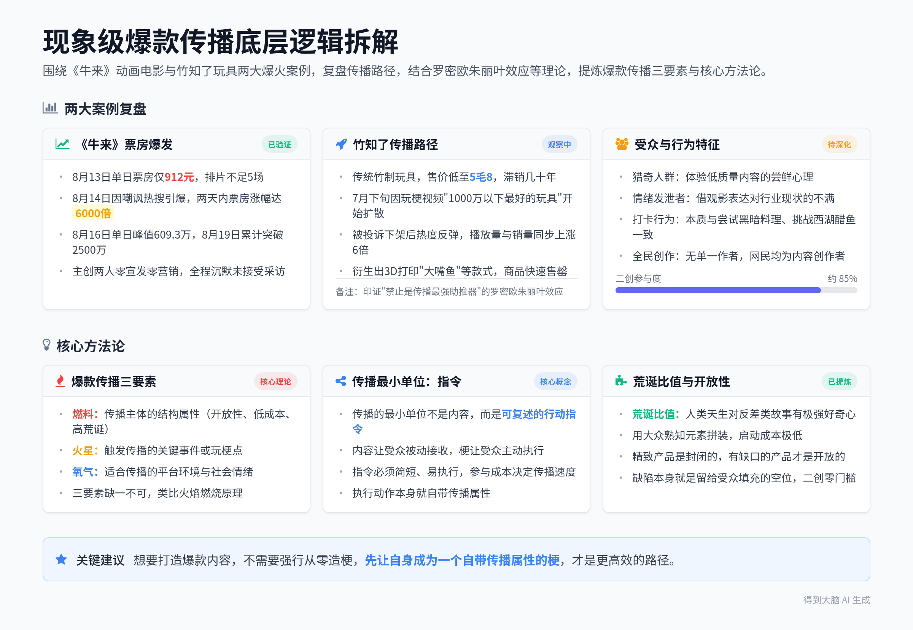
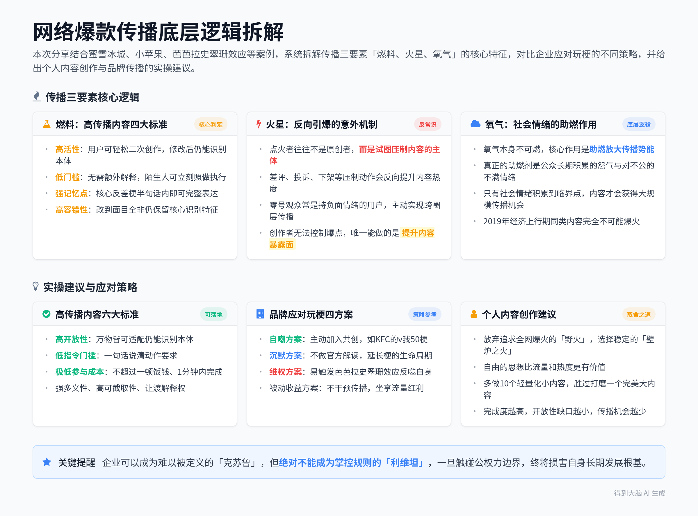
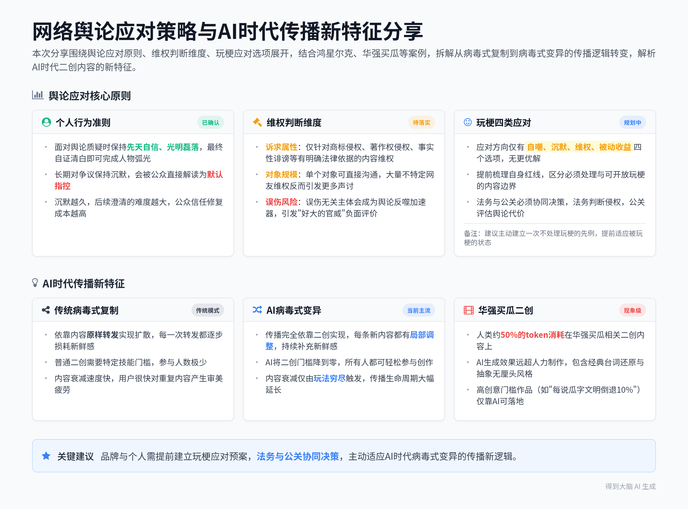
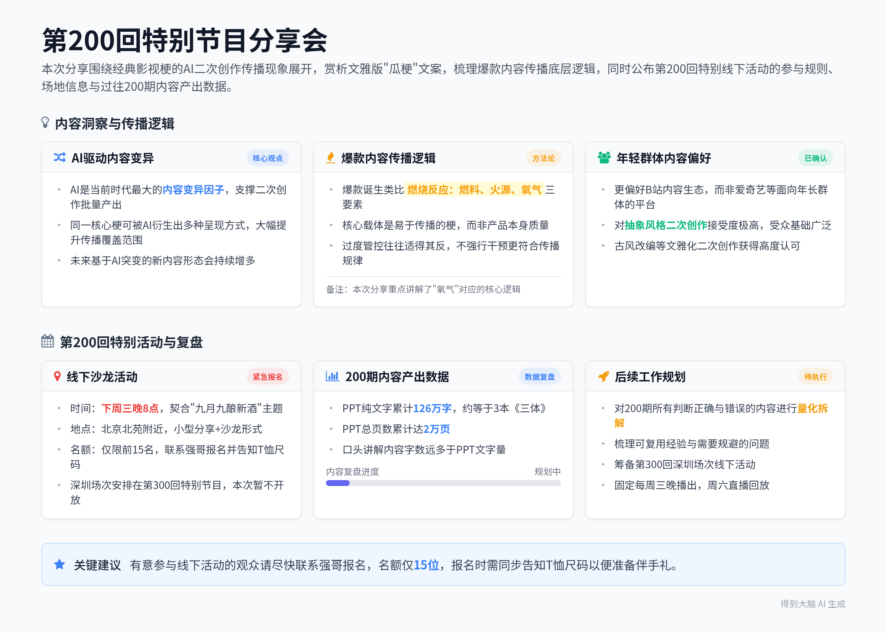

# 网络爆款传播规律分析：从蜜雪冰城到热点事件的野火传播逻辑

> 本条由 2026-09-02 晚 4 段录音合并成一份，合计约 137 分钟；各段来源见下表，主段是时长最长的一段。

## 当晚分段

| 段 | 开始时间 | 时长 | 标题 | 来源 |
|---|---|---|---|---|
| 1 | 2026-09-02 20:06 | 53 分钟 | 《牛来了》与竹知了：网络爆款传播逻辑分析 | https://biji.com/note/1920230527793795560 |
| 2 | 2026-09-02 21:00 | 59 分钟 | 网络爆款传播规律分析：从蜜雪冰城到热点事件的野火传播逻辑 | https://biji.com/note/1920234596202114224 |
| 3 | 2026-09-02 22:03 | 9 分钟 | 网络玩梗传播与品牌应对方式分析 | https://biji.com/note/1920235156695870640 |
| 4 | 2026-09-02 22:12 | 16 分钟 | AI背景下网络梗的传播变异与栏目200回线下特别活动预告 | https://biji.com/note/1920236254058966192 |

## 智能笔记

### 段 1｜《牛来了》与竹知了：网络爆款传播逻辑分析（53 分钟）

### 智能总结

##### 录音信息
- **录音时间**：2026-09-02 20:06:59 ~ 2026-09-02 21:00:19
- **时长**：约 53 分钟
- **参与人数**：约 1 人
- **内容类型**：个人观点分享 / 热点案例深度解读

##### 录音总结
本次分享围绕两部现象级传播案例展开，分别是动画电影《牛来》和传统玩具“竹知了”的爆火过程，拆解了二者的传播路径、底层逻辑，结合罗密欧朱丽叶效应等理论，总结出爆款传播的核心三要素，全程观点鲜明，案例数据详实。

**个人核心创作理念阐述**
* **自由表达优先原则**：明确提出“宁可要自由市场的草，也不要门阀经济的苗”的核心观点，将内容审美评价与表达权利完全拆分。即便《牛来》的造型、艺术、内容质量都很低下，依然誓死捍卫它出现在大众视野的合法权利。
* **人民史观下的舞台归属**：认为舞台本就属于人民，有人上台唱歌跑调，观众拥有听与不听的选择权，但任何人都没有剥夺他人上台表演的权利。这种求同存异的相处模式，才是更健康的内容生态。

**《牛来》票房走势复盘**
* **票房数据完整梳理**：8月13日单日票房仅912元，8月14日票房升至7352元并冲上热搜，8月15日单日票房达71.7万，排片从不足5场暴增到1700多场。8月16日创下单日峰值609.3万，8月19日累计票房突破2500万。
* **爆火关键节点分析**：8月5日到8月13日是9天的沉默期，电影本身、宣发、主创均无任何变化，8月14日一条嘲笑影片质量差的热搜成为引爆点，两天内票房涨幅达6000倍。观众拍摄的粗糙建模、僵硬动作等画面在全网快速传播，完成冷启动。

**《牛来》主创背景与合规性说明**
* **主创团队真实情况**：出品公司注册资本仅10万元，前身是一家装修公司，2012年7月更名跨界影视，2021年立项，2024年拿到公映龙标。团队仅两人，导演一人完成建模、动画、剪辑甚至配音，编剧同时兼任配音工作。
* **龙标获取规则科普**：只要手续完全合规，普通创作者也能顺利拿到龙标，不存在所谓的门阀垄断发行通道。部分导演总抱怨片子被卡无法上映，本质上是自身创作思路出现偏差。

**影视行业“骗庭”现象批判**
* **明朝言官文化类比**：部分国内导演存在类似明朝言官的“骗庭”心态，刻意挑战规则追求被禁，以此在行业内博得名声。他们不想打磨剧本、提升打光等基础制作能力，反而将票房失败全部归咎于审核限制。
* **行业能力真相拆解**：即便完全放开色情、暴力等内容限制，这批导演依然无法在市场竞争中胜出，最终能挣到钱的依旧是宁浩、饺子等一线创作者。这就像高考改考游戏项目，最终胜出的依然是原本的学霸群体。

**《牛来》艺术形式重新定义**
* **常规电影属性否定**：影片零宣发零预热，唯一公开的水墨风格海报和成片质量严重不符，观众进场后发现内容远低于预期。观影过程中全场观众集体举起手机拍摄屏幕，全程爆笑互动，完全打破了影院观影的常规秩序。
* **全新艺术形态定位**：它不再是传统意义上的电影，而是披着电影外壳的快闪打卡点，对标环球影城的威震天。观众拍摄的相关内容传播越多，反而会吸引更多人到现场打卡，完全打破了常规影视内容外泄就失去价值的规律。

**影院端推波助澜行为盘点**
* **影院自发运营动作**：广州一家影院经理在影片爆火后，8月14日深夜临时加开一场，拷贝完成时已经23点，最终卖出29张票。没有拷贝的影院开始跨店借拷贝，200多家影院的宣传海报全部是手工自制。
* **观众打卡行为类比**：观众到影院打卡《牛来》，本质上和去特色店尝试黑暗料理、到楼外楼挑战吃完一整份西湖醋鱼、尝试北京豆汁的行为逻辑完全一致。大家的核心目的不是看完影片，而是打卡拍照分享社交平台。

**《牛来》核心受众群体画像**
* **三类核心受众构成**：第一类是猎奇人群，看过大量常规优质电影，专门来体验这种罕见的低质量内容尝鲜；第二类是对影视行业现状不满的人群，借观影行为发泄对行业内容注水、套路化严重的情绪；第三类是股民群体，将影片名称作为好彩头来许愿。
* **传播引爆点特殊性**：这次传播的引爆点不是常规的好评，而是全网的嘲讽，影片全程默许观众拍摄传播，主创团队至今保持沉默，没有接受任何采访也没有做任何营销动作。

**竹知了玩具基础信息介绍**
* **产品基础属性说明**：竹知了是一款传统民间竹制发声玩具，仅由竹筒、棉线、竹棒三个零件组成，摇动长线就能发出类似知了的“哇哇”鸣叫声。电商平台上最便宜的款式售价仅1.8元，部分低价款低至5毛8，在货架上已经摆放了几十年无人关注。
* **玩梗起源事件梳理**：7月下旬有网友发现竹知了的发声和某品牌发布会现场的观众惊叹声高度相似，制作玩梗视频标注“1000万以下最好的玩具，遥遥领先”，相关内容开始在网络上快速扩散。

**竹知了爆火完整时间线复盘**
* **传播关键节点梳理**：7月31日到8月2日，大量相关玩梗视频以损害商誉为由被集中投诉下架，8月3日到8月4日热度反而反弹，整体播放量和商品销量同步上涨6倍。8月4日晚官方发布相关情况说明，8月5日《牛来》接档成为新的传播热点。
* **罗密欧朱丽叶效应应用**：禁止从来不是传播的阻碍，反而会成为传播的最强助推器，人类天生存在“禁果分外香”的心理。就像罗密欧与朱丽叶的恋情如果没有两家人的强烈反对，反而很有可能无法长久坚持下去。

**错误育儿观念批判**
* **晒黑防早恋观点驳斥**：抖音上有位父亲夏天带女儿到处玩把她晒黑，试图用这种方式阻止女儿早恋，这种行为完全没有逻辑。颜值降低不仅不会阻止恋情，反而大概率会让孩子接触到质量更差的异性。
* **个人育儿理念分享**：自家女儿目前才3岁，自己的育儿思路是和孩子一直保持朋友关系，孩子的恋情、想法都可以直接和自己沟通，不会强行干预孩子的正常社交。如果未来女儿能看上别的小男孩，自己反而会先反思是不是自己做得不够优秀。

**竹知了传播变异过程梳理**
* **梗的二次变异发展**：品牌方投诉后，相关关键词直接登上平台热搜，商家直接把梗写进商品标题，衍生出3D打印360度旋转的“大嘴鱼”款式，售价6.4元，相关商品很快售罄。网友将“大嘴鱼”和品牌发言人的外号关联，玩梗进一步升级。
* **官方回应无效性说明**：品牌方后续声明投诉仅针对恶意剪辑、仿冒高管声音、丑化高管肖像的内容，没有要求电商平台下架相关玩具，但大众已经完全不关注官方解释，反而调侃品牌方“好大的官威”，吐槽其“太不识逗”。

**竹知了传播终极形态解读**
* **全民参与创作状态**：玩梗载体从传统竹制玩具扩展到万物，任何能发出类似声响的物品都被网友用来二次创作，甚至出现了网页版的赛博竹知了，断网状态下也可以操作体验。整个传播过程没有明确的单一作者，所有参与玩梗的网民都是创作者。
* **防民之口逻辑印证**：防民之口甚于防川，试图封堵所有相关内容是完全不可能实现的，思想和表达是永远无法被彻底杀死的。压制行为本身也变成了新的玩梗素材，整个传播事件最终升华为完整的行为艺术。

**两大爆火案例共性对比**
* **核心共性特征提炼**：《牛来》和竹知了本身都是低质量、低关注度的产品，前者零宣发上映9天无人问津，后者在货架上摆放几十年无人购买。二者的爆火都不是来自官方主动造梗，而是自身本身就已经是一个现成的梗。
* **传播底层逻辑总结**：传播效果不一定和产品力直接挂钩，梗才是最容易实现大范围传播的内容载体。想要打造爆款内容，不需要强行从零开始造梗，先让自身成为一个自带传播属性的梗，才是更高效的路径。

**爆款传播三要素理论拆解**
* **传播底层逻辑类比**：火焰燃烧需要同时具备燃料、火星、氧气三个条件，现象级爆火的传播事件也完全符合这个逻辑，三个要素缺一不可。其中“燃料”指的是传播主体本身的结构属性，必须具备开放性、低参与成本、高荒诞比值三个特点。
* **开放性属性说明**：精致完美的产品本质上是封闭的，所有内容都被提前严格设计好，受众只能被动接收，二创门槛极高。存在明显缺陷和缺口的产品才是开放的，缺陷本身就是留给受众填充的空位，用户可以直接接管、改写内容，二创零门槛。

**传播指令核心概念讲解**
* **传播最小单位定义**：传播的最小单位不是内容，而是一条可复述的行动指令。《牛来》的指令是买张票去看看到底有多烂，把画面拍下来分享；竹知了的指令是摇一下玩具，配一句相关的玩梗话术分享给他人。
* **指令属性核心特征**：内容的作用是让受众被动接收，而梗的作用是让受众主动执行，执行动作本身就自带传播属性。优质的传播指令必须足够简短、容易执行，参与成本直接决定了最终的传播速度。

**荒诞比值传播规律分享**
* **反差感传播原理**：人类天生对反差类故事有极强的好奇心，这种反差属性就是荒诞比值。《牛来》的反差是单日票房从912元10天内暴涨到2500万，两个非专业人士手搓5年的动画登上全国院线；竹知了的反差是5毛8的传统玩具被称为“1000万以下最好的玩具”。
* **低启动成本技巧**：用大众已经熟知的现有元素进行拼装组合，不需要从零开始创造全新概念，受众看到后能立刻识别出梗的内核，会心一笑，不需要额外做科普教育，整体传播启动成本极低。

### 章节概要
**00:00:00** **个人内容表达核心观点阐述**
开篇明确提出“宁可要自由市场的草，也不要门阀经济的苗”的核心主张，将对《牛来》影片的审美负面评价和对其合法上映权利的支持完全拆分。强调观众拥有选择看或者不看的自由，但任何人都不能剥夺普通创作者登上大众舞台的机会，倡导求同存异的包容内容生态。

**00:03:09** **《牛来》完整票房走势复盘**
梳理出影片从8月13日到8月19日的全部关键票房数据：8月13日单日票房仅912元，8月14日票房升至7352元，8月15日单日票房71.7万、排片暴增到1700多场，8月16日达到单日峰值609.3万，8月19日累计票房突破2500万。明确指出8月13日到15日影片本身、宣发、主创均无任何动作，所有变化都来自外部网络传播。

**00:04:46** **《牛来》主创背景与行业启发**
介绍影片出品公司注册资本仅10万元，前身是装修公司，2012年更名跨界影视，2021年立项，2024年顺利拿到龙标，团队仅两人就完成了全片制作。借此说明龙标发放规则清晰合规，普通创作者完全有机会拿到公映资质，打破了行业内所谓门阀垄断发行通道的刻板印象。

**00:08:06** **影视行业“骗庭”现象深度批判**
类比明朝言官靠挨廷杖在清流中博名声的现象，批判部分国内导演存在的“骗庭”心态。这类导演不愿打磨基础制作能力，总把票房失败归咎于审核限制，即便放开所有内容限制，他们也竞争不过宁浩、饺子等一线从业者，就像高考改考游戏最终胜出的还是原本的学霸。

**00:13:47** **《牛来》全新艺术形态重新定义**
指出影片零宣发零预热，唯一的水墨风格海报和成片质量严重不符，观影时全场观众集体举手机拍摄、互动爆笑，完全打破常规影院秩序。它不再是传统电影，而是披着电影外壳的快闪打卡点，对标环球影城的威震天，观众拍摄的内容传播越多，反而越能吸引更多人到现场打卡。

**00:16:51** **影院端与观众打卡行为分析**
提到广州一家影院8月14日深夜23点临时加开场次，卖出29张票，大量影院跨店借拷贝、手工自制宣传海报，自发参与到传播中。观众的核心目的不是看完影片，而是打卡拍照分享社交平台，和尝试黑暗料理、挑战吃完楼外楼西湖醋鱼的行为逻辑完全一致。

**00:21:48** **《牛来》受众画像与传播特征总结**
明确影片的三类核心受众：猎奇尝鲜的观众、对影视行业现状不满的发泄者、求好彩头的股民。这次传播的引爆点不是好评而是全网嘲讽，影片全程默许观众拍摄传播，主创团队至今保持沉默，没有接受任何采访也没有开展任何营销动作。

**00:25:46** **竹知了玩具爆火事件完整复盘**
介绍竹知了是仅由竹筒、棉线、竹棒组成的传统民间玩具，售价最低仅5毛8，在货架上摆放了几十年无人关注。7月下旬网友发现它的发声和某品牌发布会现场惊叹声高度相似，制作玩梗视频标注“1000万以下最好的玩具，遥遥领先”，相关内容开始快速扩散。

**00:27:49** **罗密欧朱丽叶效应与错误育儿观念批判**
梳理竹知了7月31日到8月4日的传播节点：内容被集中投诉下架后，播放量和销量反而上涨6倍，印证了禁止是传播最强助推器的罗密欧朱丽叶效应。同时批判抖音上父亲把女儿晒黑试图阻止早恋的错误观念，指出这种行为反而会让孩子接触到质量更差的异性，分享了自己和3岁女儿做朋友的育儿思路。

**00:33:30** **竹知了玩梗变异与传播升级**
品牌方投诉后相关关键词直接登上热搜，商家顺势推出6.4元的3D打印“大嘴鱼”衍生款式，商品很快售罄，网友将产品和品牌发言人外号关联，玩梗进一步升级。官方后续的澄清完全不被大众关注，反而被调侃“好大的官威”“太不识逗”。

**00:39:08** **竹知了传播终极形态与全民创作属性**
玩梗载体从传统竹制玩具扩展到万物，任何能发出类似声响的物品都被用来二次创作，甚至出现了断网也能玩的网页版赛博竹知了。整个传播没有单一明确的作者，所有参与玩梗的网民都是创作者，印证了防民之口甚于防川，思想永远无法被彻底封堵的规律。

**00:42:33** **两大爆火案例共性提炼**
对比《牛来》和竹知了的完整路径，二者本身都是低关注度的低质量产品，前者上映9天无人问津，后者滞销几十年，爆火都不是来自官方主动造梗，而是自身本身就是现成的梗。由此得出结论：传播效果不一定和产品力挂钩，梗才是最容易实现大范围传播的载体。

**00:43:56** **爆款传播三要素理论拆解**
类比火焰燃烧需要燃料、火星、氧气三个条件，提出现象级传播也需要三个核心要素。其中“燃料”要求传播主体具备开放性，精致完美的产品是封闭的，受众只能被动接收，而存在明显缺陷和缺口的产品是开放的，留给受众充足的二创和参与空间。

**00:47:26** **传播指令核心概念讲解**
明确传播的最小单位不是内容，而是一条可复述的行动指令。《牛来》的指令是买票打卡拍画面分享，竹知了的指令是摇玩具配梗分享，内容让受众被动接收，而梗让受众主动执行，执行动作本身就自带传播属性，参与成本的高低直接决定传播速度。

**00:51:47** **荒诞比值传播规律分享**
指出人类天生对反差类故事有极强好奇心，这种反差属性就是荒诞比值。《牛来》的票房暴涨、素人手搓动画上院线，竹知了5毛8玩具被称为千万级最好产品，都是极强的反差点。用大众熟知的现有元素拼装造梗，不需要额外做科普，传播启动成本极低。

### 金句精选
- “宁可要自由市场的草，也不要门阀经济的苗。” (战略洞见)
- “舞台应该是属于人民的，而有人唱歌上来跑调了，那我们不听就好了。” (思考启发)
- “禁止不是传播的阻碍，禁止才是传播的最强助推器。” (执行策略)
- “想做爆款吗？自己先成为梗。” (方法技巧)
- “防民之口甚于防川，川涌而溃，伤民必多。” (战略洞见)
- “内容是让你接收的，梗是要让你执行的，造的梗是要有一个动作的。” (方法技巧)
- “精致的产品本质上是封闭的，有缺口的产品才是开放的。” (思考启发)
- “人类有一个特点叫做禁果分外香。” (情绪共鸣)

### 待办事项
无

### 段 2｜网络爆款传播规律分析：从蜜雪冰城到热点事件的野火传播逻辑（59 分钟）

### 智能总结

##### 录音信息
- **录音时间**：2026-09-02 21:00:23 ~ 2026-09-02 22:00:22
- **时长**：约 59 分钟
- **参与人数**：约 1 人
- **内容类型**：课程讲解 / 个人分享

##### 录音总结
本次分享围绕网络爆款传播的底层逻辑展开，结合蜜雪冰城、小苹果、芭芭拉史翠珊效应等多个案例，拆解了传播三要素“燃料、火星、氧气”的核心特征，同时探讨了企业面对玩梗的不同应对方式，最后给出了普通人打造可传播内容的实操建议。

**蜜雪冰城主题曲爆火原因分析**
* **旋律选择逻辑**：蜜雪冰城主题曲选用传播了上百年的经典旋律，而非全新创作的原创旋律。该旋律自带魔音穿脑的传播属性，大幅降低了用户的记忆门槛。
* **传播设计思路**：品牌主动开放音频素材，允许用户对雪王形象进行任意二次修改，仅要求用户跟着旋律演唱。整套设计完全为传播服务，而非单纯彰显品牌调性。

**小苹果成为广场舞神曲的核心机制**
* **结构设计特点**：小苹果的主歌长度仅为常规歌曲主歌的1/3，跳过冗长铺垫直接快速进入副歌高潮部分。这种结构让用户在极短时间内就能接触到最洗脑的hook段落。
* **传播核心归因**：小苹果的爆火核心是旋律结构设计，与筷子兄弟的个人影响力无关。同长度歌曲中极短的主歌占比，是它能快速覆盖广场舞场景的关键原因。

**高传播性内容“燃料”的四大判定条件**
* **高活性属性**：内容需要像化学元素中的钾钠一样具备高活性，用户可以轻松在原有内容上添加自己的创意，修改后依然能清晰识别出原内容本体。完全封闭、无法二次创作的内容不具备传播潜力。
* **低执行门槛**：给完全不了解内容的人下达动作指令，不需要额外解释就能立刻照做。复现内容的成本极低，最好能做到“泼点水就能火”的程度。
* **强记忆点设计**：核心反差梗可以在半句话内完整说完，不需要长篇大论铺垫。用户不需要花费大量时间理解内容，一眼就能抓住核心记忆点。
* **高传播容错性**：内容被用户二次创作改到面目全非后，依然能保留核心识别特征。比如符号化的内容，无论用户怎么修改载体，核心标识都不会丢失。

**传播“火星”的意外引爆逻辑**
* **反向点火现象**：很多爆款内容的点火者并非原创作者，反而是试图压制内容的主体。差评、投诉、下架等压制动作，反而会反向给内容带来更高的关注度。
* **零号观众特征**：引爆内容的零号观众往往不是最喜爱内容的人，反而是对内容抱有负面情绪的用户。这类用户会主动将内容带出原有场景，实现跨圈层传染。
* **传播核心结论**：创作者无法精准控制爆点和用户情绪，唯一能主动做的事情就是尽可能提升内容的暴露面。哪怕最初只有287个初始观众，也有可能通过后续传播登上热搜。

**芭芭拉史翠珊效应的传播学解读**
* **事件完整经过**：2003年美国歌手芭芭拉史翠珊要求摄影师肯尼斯阿德尔曼删除12000张加州海岸航拍中拍到自家住所的照片，最终败诉。该事件直接引发42万民众围观她的住所照片。
* **底层心理机制**：该现象本质是禁果效应，越被禁止公开的内容，用户的窥私欲和对抗欲就越强。原本无人关注的内容，经过压制后反而会获得海量流量。
* **后续延伸影响**：该事件成为传播学经典案例，被正式命名为“芭芭拉史翠珊效应”。它清晰印证了“越不让看，用户越想看”的大众逆反心理。

**对抗动员的传播转化机制**
* **立场转化逻辑**：原本只是供大众娱乐消费的内容，经过企业的压制动作后，会直接转化为立场表达载体。用户转发内容不再是因为内容本身有趣，而是用行动表达自身的态度。
* **公众权利边界**：企业可以在自身经营范围内制定内部规则，但绝对不能越界进入公权力范畴。一旦企业试图动用类似公权力的手段压制普通民众的调侃，就会触发公众的集体抵触。
* **新闻价值放大**：体量巨大的企业去压制一个价值1块钱的普通玩具，本身就具备极强的新闻价值。公众天然会站在弱势的“鸡蛋”一方，对抗体量悬殊的“石头”。

**不同企业面对玩梗的应对对比**
* **正面参考案例**：阿迪达斯推出“穿阿迪办大事”相关周边，用户可以直接在品牌官方旗舰店买到对应主题T恤。品牌主动和用户玩梗，放下身段和消费者互动，获得了极佳的口碑。
* **反面参考案例**：华为过往服务的客户以to B、to G端为主，长期形成了严肃的企业文化。面对普通用户的玩梗调侃，内部员工出于“宁肯铲多了也不能铲不到位”的自保心态，往往会采取过度压制的处理方式。
* **文化差异根源**：华为内部类似军事化的管理风格，导致全员长期处于紧绷状态。员工宁可采取过度维权的动作，也不愿承担任何可能来自上级的问责，最终引发公众的强烈反感。

**企业发展的边界警示**
* **历史规律参考**：历史上不少立下大功的主体，一旦被过度宠溺获得超然待遇，后续很容易出现“秋后算账”的结局。即便曾经做出过突出贡献，越界后的代价往往难以承受。
* **善意提醒初衷**：分享者明确表示自己并非否定华为的研发投入和行业贡献，而是真心希望这家优质民营企业能长期健康发展，避免后续走向不可挽回的结局。
* **核心边界原则**：企业可以成为难以被定义的“克苏鲁”，但绝对不能成为掌控规则的“利维坦”。一旦企业试图触碰公权力的边界，最终只会损害自身的长期发展根基。

**传播“氧气”的底层核心逻辑**
* **助燃本质属性**：氧气本身不可燃，它的核心作用是助燃。爆款传播背后真正的助燃剂，是长期积累的公众怨气和戾气，而非内容本身的小体量燃料。
* **社会情绪基础**：公众长期积累的对既得利益者的不满、对分配不公的抱怨、对资源被挤占的情绪，是真正支撑大规模传播的底层动力。这些情绪积累多年，一直处于被捂着盖着的状态。
* **传播时间窗口**：2019年经济上行期时，同类内容完全不可能爆火，甚至会被公众集体讨伐。只有当对应的社会情绪积累到临界点，内容才会获得足够的传播氧气。

**爆款传播的不可复制性**
* **多要素稀缺性**：完整的爆款传播需要燃料、火星、氧气三者同时齐备，缺任何一个要素都无法引爆。绝大多数符合燃料条件的内容，一辈子都遇不到属于自己的火星。
* **时间窗口唯一性**：特定时期的社会情绪是不可复刻的，情绪一旦被释放完毕，后续再推出同类内容也无法获得同等的传播效果。这类爆款本质上是可遇不可求的，和彩票的中奖逻辑高度相似。
* **人为干预反效果**：创作者如果在传播中途急于下场解释内容的“正确含义”，会直接掐灭刚刚燃起的传播火焰。任何试图驯化野火的动作，都会直接破坏传播的自然进程。

**高传播性内容的六大核心标准**
* **高开放性**：内容修改到万物皆可适配的程度，依然能让用户清晰识别出本体。测试方法是找三个人把内容改到最离谱的状态，如果还能认出原内容，就符合开放性要求。
* **低指令门槛**：给完全外行的用户下达动作指令，一句话就能说清，不需要额外的说明书。执行动作本身自带曝光属性，比如“买张彩票拍下来晒”就是合格的低门槛指令。
* **极低参与成本**：参与传播的金钱成本不能超过一顿饭钱，从想到动作完成的时间不能超过1分钟。任何需要用户额外学习技能的内容，都无法实现大规模传播。
* **强多义性**：同一个内容能被多个完全不相关的群体各自解读，不同圈层的人都能从内容里看到自己想看到的东西。多拨互不相识的用户同时自发传播，才能打开传播的天花板。
* **高可截取性**：内容可以直接截取成一张图或者1秒的音频片段，不需要铺垫上下文。好电影的价值均匀分布在2小时时长里，截取任何片段都会损失大量信息，天然不适合传播。
* **让渡解释权**：创作者绝对不能下场定义内容的“正确解读”，一旦官方给出标准答案，内容的多义性会立刻消失。最好的公关就是“没来得及做公关”，全程保持沉默把解释权完全交给公众。

**个人内容创作的选择思考**
* **内容定位取舍**：分享者明确表示自己放弃追求成为全网爆火的“野火”，选择做用户每周三晚上壁炉里的星星之火。这种选择能让自己始终保持言论自由，不需要为了流量谨言慎行。
* **人生智慧参考**：张朝阳先后创办两家上市公司，如今选择闷声挣钱、闭门讲课的生活方式，是一种难得的人生智慧。“苟全性命于乱世，不求闻达于诸侯”的状态，反而能获得最大的自由度。
* **传播实操建议**：想要提升内容爆火的概率，就多做10个轻量化的小内容，远胜过花几年打磨一个完美的大内容。完成度越高的内容，开放性缺口反而越小，越难获得传播机会。

**品牌面对玩梗的四类应对方案**
* **自嘲方案**：直接加入用户的共创玩梗行列，把梗接过来自己玩。经典案例是KFC的vivo50梗，原本是网友自发二创，品牌非但没有追责，反而主动加入互动。
* **沉默方案**：全程保持不发声，不做任何官方解读，把所有解释权完全交给用户。这种方式能让梗的生命周期大幅延长，甚至成为品牌的长期无形资产。
* **维权方案**：采取投诉、下架等强硬压制手段，这种方式大概率会触发芭芭拉史翠珊效应，反向给梗带来更高的热度，最终反噬品牌自身。
* **被动收益方案**：不主动干预传播进程，任由用户自发二创传播，坐享流量红利。只要不做出过激的压制动作，梗的传播最终都会给品牌带来额外的曝光收益。

### 章节概要
**00:00:00** **蜜雪冰城主题曲爆火原因拆解**
分享者分析蜜雪冰城主题曲的爆火核心，一是选用传播上百年的经典旋律而非原创，自带魔音穿脑的属性，二是品牌主动开放音频和雪王形象的二次修改权限，所有设计都指向传播目标，而非单纯展示品牌调性。

**00:00:38** **小苹果成为广场舞神曲的结构逻辑**
分享者指出小苹果爆火和筷子兄弟的个人影响力无关，核心是它的主歌长度仅为常规歌曲的1/3，跳过冗长铺垫直接快速进入副歌高潮，让用户在极短时间内就能接触到最洗脑的hook段落，完美适配广场舞场景的传播需求。

**00:02:30** **高传播性内容“燃料”的四大判定标准**
分享者用化学元素钾钠做类比，提出合格的传播燃料需要满足四个条件：一是高活性，用户可以轻松二次创作且修改后仍能识别本体，二是低执行门槛，不需要额外解释就能让陌生人立刻照做，三是核心反差梗半句话就能说完，四是修改到面目全非后依然能保留核心识别特征。

**00:05:21** **传播“火星”的反向引爆现象**
分享者指出很多爆款的点火者不是原创作者，反而是试图压制内容的主体，差评、投诉、下架等动作反而会反向提升内容热度。引爆内容的零号观众往往是对内容抱有负面情绪的用户，创作者无法控制爆点，唯一能做的就是尽可能提升内容暴露面。

**00:06:45** **芭芭拉史翠珊效应的经典案例解读**
分享者讲解2003年美国歌手芭芭拉史翠珊起诉摄影师要求删除自家住所航拍照片最终败诉的事件，该事件直接引发42万民众围观她的住所，印证了越被禁止的内容，用户的窥私欲和对抗欲就越强，这一传播学现象也被正式命名为芭芭拉史翠珊效应。

**00:09:45** **对抗动员的传播转化机制**
分享者分析原本供大众娱乐的内容，经过企业压制后会转化为用户的立场表达载体，用户转发不再是因为内容有趣，而是用行动表明态度。体量巨大的企业去压制一个价值1块钱的普通玩具，本身就具备极强的新闻价值，公众天然会站在弱势的一方对抗不公。

**00:15:12** **不同企业面对玩梗的应对方式对比**
分享者对比了三家企业的应对思路：阿迪达斯主动推出“穿阿迪办大事”主题T恤，和用户玩梗获得极佳口碑；华为受to B、to G端长期服务形成的严肃文化影响，员工出于自保心态往往过度压制玩梗内容，最终引发公众反感；早年小米面对“Are you ok”的梗也选择开放互动，获得了用户好感。

**00:21:33** **企业发展的边界警示**
分享者明确表示自己认可华为的研发投入和行业贡献，但依然要提醒企业不能越界进入公权力范畴。历史上不少立下大功的主体被过度宠溺获得超然待遇后，最终都走向了“秋后算账”的结局，企业可以成为难以定义的“克苏鲁”，但绝对不能成为掌控规则的“利维坦”。

**00:30:05** **传播“氧气”的底层核心逻辑**
分享者指出氧气本身不可燃，爆款传播背后真正的助燃剂是公众长期积累的怨气和戾气，包括对既得利益者的不满、对分配不公的抱怨等。2019年经济上行期同类内容完全不可能爆火，只有当社会情绪积累到临界点，内容才会获得足够的传播氧气。

**00:40:22** **爆款传播的不可复制性分析**
分享者提出完整的爆款需要燃料、火星、氧气三者同时齐备，缺任何一个都无法引爆。特定时期的社会情绪是不可复刻的，情绪释放完毕后同类内容再也无法获得同等效果，这类爆款本质上可遇不可求，和彩票中奖逻辑高度相似，创作者中途下场解释会直接掐灭传播火焰。

**00:42:30** **高传播性内容的六大实操标准**
分享者给出打造高传播内容的六个可落地标准：一是高开放性，改到万物皆可适配仍能识别本体，二是低指令门槛，一句话说清动作要求，三是参与成本不超过一顿饭钱、耗时不超过1分钟，四是强多义性，不同圈层用户都能解读出自己想要的内容，五是高可截取性，能直接截成一张图或1秒音频，六是让渡全部解释权给公众，官方不下场定义标准答案。

**00:50:17** **个人内容创作的取舍选择**
分享者坦言自己放弃追求成为全网爆火的“野火”，选择做用户每周三晚上壁炉里的星星之火，这样能始终保持言论自由，不需要为了流量谨言慎行。他认为张朝阳先后创办两家上市公司后，选择闷声挣钱闭门讲课的生活方式，是一种难得的人生智慧。

**00:58:21** **提升传播概率的实操建议**
分享者提出想要提升内容爆火概率，就多做10个轻量化的小内容，远胜过花几年打磨一个完美的大内容。完成度越高的内容，开放性缺口反而越小，越难获得传播机会，要接受绝大多数内容都不会爆的现实，把传播当成买彩票，多买才能提升中奖概率。

**00:59:16** **品牌面对玩梗的四类应对方案**
分享者总结品牌遇到自己成为玩梗素材时的四个选项：一是自嘲加入共创，比如KFC把网友二创的vivo50梗接过来自己玩，二是全程沉默不发声，把解释权交给用户，三是维权压制，大概率会触发芭芭拉史翠珊效应反噬自身，四是被动接受收益，不干预传播进程坐享流量红利。

### 金句精选
- **“你是块金子，比铁还硬比钢还强，那对不起，你不是一个易燃物。”** (传播策略)
- **“钾钠才是好燃料，泼点水它都能活。”** (传播策略)
- **“宁为克苏鲁，不为利维坦。”** (战略洞见)
- **“越不让看，越不让看，有人替我决定能不能看这件事本身，我凭什么让你决定？”** (思考启发)
- **“自由这件事情，自由的思想这件事情，我觉得比火来的更加有价值。”** (人生感悟)
- **“聪明难，糊涂更难。”** (人生感悟)
- **“完成度和开放性经常是反向的，一个糙的东西才有可能性传播。”** (执行策略)
- **“野火是一种狂暴的自然之力，当你想驯化它的时候，它就已经不存在了。”** (传播策略)

### 待办事项
无

### 段 3｜网络玩梗传播与品牌应对方式分析（9 分钟）

### 智能总结

##### 录音信息
- **录音时间**：2026-09-02 22:03:22 ~ 2026-09-02 22:12:22
- **时长**：约 9 分钟
- **参与人数**：约 3 人
- **内容类型**：个人分享 / 知识讲解

##### 录音总结
本次分享围绕网络舆论应对策略与AI时代的传播新特征展开，结合鸿星尔克、华强买瓜等具体案例，拆解了品牌遭遇玩梗时的四类应对选项，分析了从病毒式复制到病毒式变异的传播逻辑转变，展示了大量AI生成的二创梗内容。

**舆论场景下的个人行为原则**
* **核心行为准则**：面对舆论质疑时保持先天自信、光明磊落，最终自证未涉及资金输送、洗钱等违规行为，即可完成人物弧光，成为大众认可的正面代表。
* **默认表态风险**：长期对争议保持沉默，会被公众直接解读为默认相关指控，后续再进行澄清的难度会大幅提升。

**维权行动的核心判断维度**
* **维权诉求属性区分**：仅针对商标侵权、著作权侵权、事实性诽谤等有明确法律依据的诉求发起维权，若仅以隐喻、冒犯等模糊理由维权，公众会默认相关指控属实。
* **维权对象规模判断**：针对单个具体对象可直接沟通协商，面对不特定的大量网友无法有效沟通，维权动作反而会引发更多人参与声讨。
* **误伤风险防控**：维权过程中若误伤无关主体，会成为反噬自身的加速器，比如本次事件中正常售卖竹子的商家账号头像被处理，直接引发公众“好大的官威”的负面评价。

**被动收益的舆论现象解析**
* **典型案例参考**：鸿星尔克未开展任何主动传播动作，网友发现其自身经营困难仍进行大额捐款，形成强烈反差后主动发起野性消费，品牌一度跟不上突然涌入的订单。
* **底层逻辑说明**：网友自主完成叙事建构，品牌全程处于被动状态，人群的预先判断先于品牌动作，后续所有操作都只是在已形成的公众认知上做简单加减法。

**遭遇玩梗的四类应对选项**
* **选项明确划分**：当个人或品牌成为网络梗的素材时，仅有自嘲、沉默、维权、被动收益四个合规应对方向，没有其他更优选择。
* **前置准备要求**：提前梳理自身红线，将完全不可接受必须处理的内容、可以开放玩梗的内容明确区分开，避免临时决策出现偏差。
* **跨部门协同要求**：法务与公关团队必须协同开展工作，法务仅判断行为是否侵权，公关评估行动的舆论代价，两个团队独立做决策必然引发问题。
* **心态建设建议**：主动建立一次不处理玩梗的先例，提前适应被网友玩梗的状态，避免全程保持严肃姿态，同时提前准备好自嘲的表达风格，临时无法快速掌握适配的语气。

**传统病毒式复制传播模式**
* **核心运行逻辑**：依靠内容原样转发实现扩散，每一次转发都会逐步损耗内容的新鲜感，普通二创需要特定技能门槛，参与人数极少，内容衰减速度快，用户很快会对重复内容产生审美疲劳。

**AI时代病毒式变异传播模式**
* **核心运行逻辑**：传播扩散完全依靠二创实现，每一条新内容都会做出局部调整，持续补充新鲜感，AI技术将二创门槛降到零，所有人都可以轻松参与创作，内容衰减仅由玩法穷尽触发，传播生命周期大幅延长。
* **资源消耗佐证**：人类有50%的token消耗在了华强买瓜相关的二创内容上，AI技术不仅拉低了创作成本，更能生成过去人力完全无法实现的特殊效果内容。

**华强买瓜二创内容展示**
* **经典台词还原**：现场播放的二创内容还原了“这瓜皮子是金子做的还是瓜粒子是金子做的”“这瓜保熟吗”等原版经典台词，AI生成效果远超过去人力制作的版本。
* **抽象二创案例**：展示了大量风格极度抽象的二创作品，内容包含“木大木大木大”“大皮球夹脚踢乌拉拉扔呱呱”等无厘头台词，观看者甚至需要怀疑内容创作者的精神状态。
* **特殊创意作品**：展示了设定为“每说一次瓜字，地球的文明倒退10%”的二创作品，这类内容的剧本设计与制作难度极高，没有AI技术支撑完全无法落地。

### 章节概要
**00:00:02** **舆论场景下的个人自证原则分享**
分享者提出面对舆论质疑时，先天保持自信、光明磊落是最优选择。只要最终自证没有进行利益输送、没有参与洗钱等违规行为，就能完成人物弧光，获得大众认可。长期保持沉默不表态，会被公众直接解读为默认相关指控。

**00:00:38** **维权行动的核心判断标准讲解**
分享者明确了维权的三个核心判断维度，第一是诉求必须落在商标侵权、著作权侵权、事实性诽谤等可执行的合规层面，模糊的冒犯类诉求不适合发起维权。第二是维权对象如果是不特定的大量网友，沟通完全无效，动作反而会引发更多人参与声讨。第三是维权过程中误伤无关主体，会快速引发舆论反噬。

**00:01:23** **误伤引发反噬的具体案例说明**
分享者举例说明，某次维权过程中，正常售卖竹子的无关商家账号头像被违规处理，直接让公众的观感从支持维权转变为不满，认为品牌方仗势欺人，把正常摆摊的商家摊位砸毁，引发大面积负面评价。

**00:01:44** **被动收益的舆论现象拆解**
分享者以鸿星尔克为典型案例，说明品牌未开展任何主动传播，网友发现其经营困难仍大额捐款后，主动发起野性消费，品牌一度跟不上涌入的订单。这类现象的核心是网友自主完成叙事建构，品牌全程处于被动状态，所有后续动作都只能在已形成的公众认知上做微调。

**00:02:15** **遭遇玩梗的应对方案梳理**
分享者明确当个人或品牌成为网络梗的素材时，仅有自嘲、沉默、维权、被动收益四个应对方向。同时给出配套落地要求，提前梳理自身红线，法务与公关团队必须协同决策，主动适应一次被玩梗的状态，提前准备好自嘲的表达风格。

**00:02:55** **新旧传播模式的差异对比**
分享者指出传统传播属于病毒式复制，依靠内容原样转发扩散，新鲜感快速损耗，二创门槛高，内容衰减速度快。当下的新传播属于病毒式变异，依靠二创实现扩散，每一条内容都做出局部调整补充新鲜感，AI将二创门槛降到零，所有人都能参与创作。

**00:03:38** **华强买瓜二创现象介绍**
分享者提出人类有50%的token都消耗在了华强买瓜相关的二创内容上，AI技术普及后，这类内容的传播量和创作烈度都明显提升，生成了大量过去人力完全无法制作的特殊效果内容。

**00:04:07** **AI生成华强买瓜二创内容展示**
分享者现场播放多个自己收藏的华强买瓜AI二创作品，内容还原了原版的“这瓜保熟吗”等经典台词，呈现出人力制作完全达不到的精细效果。在场其他参与者也跟着念出部分二创里的无厘头台词，互动氛围轻松。

**00:07:35** **抽象风格二创作品讨论**
分享者展示了一批风格极度抽象的华强买瓜二创作品，内容无厘头程度极高，观看后甚至会让人忍不住思考创作者的精神状态。分享者也坦言这类内容会让部分人觉得是精神污染，决定更换其他类型的作品继续展示。

**00:08:26** **高创意门槛二创作品介绍**
分享者最后展示了设定为“每说一次瓜字，地球的文明倒退10%”的特殊二创作品，这类内容的剧本设计与制作难度极高，没有AI技术的支撑完全无法落地，充分体现了AI时代二创的创意上限。

### 金句精选
- “最好你先天就自信，光明磊落。” (思考启发)
- “人群判断先于你的动作，你所做的事都只是在人群已经形成的判断上去做一个简单的加减法。” (战略洞见)
- “法务要和公关协同，法务只看侵权与否，公关看代价多大。” (执行策略)
- “传播动力学原本我们是在做病毒式复制，但现在已经是病毒式变异了。” (战略洞见)
- “AI把二创门槛降到零，人人都能做，衰减就由玩法穷尽触发。” (方法技巧)

### 待办事项
无

### 段 4｜AI背景下网络梗的传播变异与栏目200回线下特别活动预告（16 分钟）

### 智能总结

##### 录音信息
- **录音时间**：2026-09-02 22:12:28 ~ 2026-09-02 22:29:01
- **时长**：约 16 分钟
- **参与人数**：约 2 人
- **内容类型**：个人分享 / 内容复盘闲聊

##### 录音总结
本次分享围绕经典影视梗的AI二次创作传播现象展开，赏析了改编后的文雅版“瓜梗”文案，梳理了爆款内容的传播底层逻辑，同时公布了第200回特别线下活动的参与规则、场地信息与过往200期内容的产出数据。

**“瓜保熟”经典影视梗复刻演绎**
* **原版台词还原**：完整复刻了《征服》中“这瓜保熟吗”的经典对话片段，包含15斤瓜售价30元、秤下藏吸铁石的名场面细节。
* **数值溢出进化设定**：提出降300%数值溢出的概念，指出当数值超过100%阈值后，内容会触发究极进化效果。

**AI驱动的内容变异传播现象分析**
* **AI作为核心变异因子**：明确AI的广泛应用是各类变异型传播火爆内容诞生的基础，没有AI技术支撑这类二次创作内容无法批量产出。
* **老梗多形态衍生**：同一个核心梗可以被AI改出若干种不同的呈现方式，大幅提升内容的传播覆盖范围。

**文雅版“瓜梗”二次创作文案赏析**
* **文案风格评价**：一致认为改编后的文案用词非常雅致，将原本市井气的影视梗转化为富有古风韵味的文字内容。
* **核心文案内容展示**：文案中融入了“此瓜可中意”“此卦若输定不负”“我当自吞入”等对应原版梗的核心情节语句。

**年轻群体内容偏好特征梳理**
* **主流平台选择倾向**：明确年轻群体更偏好浏览B站内容，而非爱奇艺等面向年长群体的视频平台。
* **抽象内容接受度**：年轻人普遍对抽象风格的二次创作内容接受度更高，这类内容的受众基础十分广泛。

**爆款内容传播底层逻辑总结**
* **爆款生成要素类比**：将爆款内容的诞生类比为燃烧反应，需要燃料、火源、氧气三类核心要素，本次分享重点讲解了氧气对应的核心逻辑。
* **爆款核心载体属性**：指出火爆内容的核心载体不是产品本身，而是易于传播的梗，从产品质量维度很难推导出内容火爆的原因。

**愿力相关概念延伸解读**
* **愿力与心力关联**：说明愿力和心力的概念相近，大量个体的愿力汇聚后可以形成强大的集体力量。
* **集体愿力实例**：以“中国梦，我的梦”为例，说明全体民众对美好生活的共同向往就是汇聚而成的集体愿力。
* **反直觉执行原则**：提出内容传播过程中过度管控往往会适得其反，不强行干预反而更符合传播规律。

**第200回特别节目活动预告**
* **活动时间节点**：活动定在下周三举办，契合“九月九酿新酒，长长又久久”的主题设定。
* **活动形式规划**：计划在北京线下场地举办小型分享加沙龙活动，邀请10来位朋友到场参与。
* **后续场次安排**：深圳场次的线下活动将安排在第300回特别节目时举办，本次暂不开放深圳地区报名。

**线下活动参与报名规则说明**
* **报名名额限制**：线下活动仅开放前15名报名名额，报名参与者需要联系强哥提交申请。
* **信息收集要求**：报名时需要同步告知强哥自己所穿T恤的尺码，用于活动伴手礼准备。
* **活动举办地点**：线下场地位于北京北苑附近，活动开始时间为当晚8点。

**200期内容产出数据复盘**
* **PPT文字总量**：200期节目累计在PPT中撰写的纯文字内容达到126万字，这个字数规模相当于3本《三体》的总字数。
* **PPT总页数**：200期节目累计制作的PPT总页数达到2万页，口头讲解的内容字数远多于PPT上的文字量。
* **内容复盘规划**：后续将对200期节目里所有判断正确和判断错误的内容进行量化拆解，梳理出可复用的经验和需要规避的问题。

**活动相关趣味互动调侃**
* **伴手礼趣味玩笑**：现场调侃为15位到场参与者准备的伴手礼是情趣内衣，引发互动趣味效果。
* **露底规则说明**：明确到场参与者只要不违背公序良俗，可以自由展示想要露出的内容，没有额外限制。
* **常规播出安排强调**：固定播出时间为每周三晚，无法到场的观众可以通过周六的直播观看节目内容。

### 章节概要
**00:00:01** **经典“瓜保熟”影视梗复刻演绎**

完整还原了《征服》中“这瓜保熟吗”的名场面对话，涵盖15斤瓜售价30元、秤下藏吸铁石的核心情节，复刻了原版对话的冲突感。同时提出降300%数值溢出的设定，说明数值超过100%阈值后内容会触发究极进化效果。
**00:02:00** **高完成度二次创作内容查找展示**

花费1分钟左右查找提前准备好的优质二次创作内容，确认目标内容后向在场人员展示，一致认可该内容的文案质量远超预期。
**00:03:16** **文雅版古风“瓜梗”文案全文朗读**

逐句朗读改编后的古风文案，内容将原版市井梗转化为雅致的古风表达，融入了“此瓜可中意”“我当自吞入”等对应原版情节的语句，整体风格韵味十足。
**00:05:26** **AI时代内容变异传播现象解读**

明确AI是当前时代最大的内容变异因子，没有AI的广泛应用就无法批量产出这类二次创作内容，未来会有更多基于AI突变的新内容形态出现。
**00:06:04** **年轻群体内容消费偏好分析**

指出年轻人普遍更偏好B站的内容生态，而非爱奇艺等面向年长群体的视频平台，年轻人对抽象风格的二次创作内容接受度极高。
**00:06:41** **爆款内容传播逻辑系统总结**

将爆款内容诞生类比为燃烧反应，需要燃料、火源、氧气三类核心要素，明确火爆内容的核心载体是易于传播的梗，从产品质量维度无法推导出内容火爆的原因。同时解读愿力概念，指出集体愿力汇聚会形成强大力量，过度管控传播过程往往适得其反。
**00:07:48** **第200回特别线下活动信息公布**

预告下周三举办第200回特别节目，采用线下小范围分享加沙龙的全新形态，契合“九月九酿新酒，长长又久久”的主题，深圳场次将安排在第300回特别节目时举办。
**00:08:38** **线下活动报名规则细节说明**

明确线下活动仅开放前15名报名名额，参与者需要联系强哥提交申请，报名时同步告知自己的T恤尺码，活动场地位于北京北苑附近，开始时间为当晚8点。
**00:11:41** **200期节目产出数据复盘分享**

披露200期节目累计PPT纯文字量达126万字，相当于3本《三体》的总字数，累计制作PPT总页数达2万页，后续将对所有判断对错的内容进行量化拆解复盘。
**00:14:49** **收尾互动与活动趣味规则补充**

调侃活动伴手礼相关的趣味内容，明确到场参与者只要不违背公序良俗即可自由展示内容，最后和观众道别结束本次分享。

### 金句精选
- **“AI时代本身就是最大的变异因子，未来因此而突变的东西只会更多。”** (战略洞见)
- **“爆款的出现和一场火一样，需要燃料、火源、氧气。”** (方法技巧)
- **“梗是容易传播的，从评价产品质量的维度很难找到火爆的原因。”** (执行策略)
- **“越是做的多，越可能适得其反。”** (思考启发)
- **“平生不修善果，最爱杀人放火。钱塘江上潮信来，此刻方知我是我。”** (情绪共鸣)

### 待办事项
- 有意参与第200回线下特别节目的用户：联系强哥提交报名申请，并告知自己的T恤尺码
- 分享者：完成200期节目所有判断内容的量化拆解复盘，梳理对错数据
- 分享者：筹备下周三晚8点北京北苑附近的第200回线下沙龙特别节目

---

## 完整逐字稿

### 段 1｜《牛来了》与竹知了：网络爆款传播逻辑分析（53 分钟）

🟢 说话人1 [00:00:00]
觉得是好事，对吧？再烂都是好事。这个东西就是我宁可要自由市场的草，我也不要门阀经济的苗。这是我自己的观点，就是我这这是这是我的观点啊，对吧？大家可以大家来去这个批驳这个事情都没有问题，对吧？就是你甭管怎么着，我这是在自由世界中长出来的一根草，它是草，它是拉嘴。但它不是毒草，它不是毒草，对吧？它是。我我难受，那那是我的自由选择，而不是你们觉得那是苗，然后强按着牛头给牛去吃的，这是两种不同的东西，这是两种完全不同的东西，对吧？

🟢 说话人1 [00:00:47]
这个其实就是，但就是咱咱们要去接受一件事，当你以人民历史叙事来看的时候，你就不能左右脑互搏来去说牛来不该出现。咱们认真的讲，咱们不该一方面认为人民史观是正确的，认为自己应该有机会，因为春灯把持了所有的东西。在这种意识形态之下，你再不让牛来出现，这件事是不公平的。这件事咱们不要左右脑。我我认为牛来从造型、艺术、内容，它都是一个质量很低下的片子，这是我的在文艺上的观点。但是我从来愿意誓死捍卫牛来这种东西能够出现在大众视野上的权利。我把这两件事拆开，这是我对于这件事情上的个人观点啊，这是我对这件事的的个人观点。舞台应该是属于人民的，而有人唱歌上来跑调了，那我们不听就好了。我有听与不听的权利，但你没有喂给我屎的权利，就是这么简单。OK对吧？

🟢 说话人1 [00:02:00]
对吧，那么就我就是我不喜欢看这个东西，但是我誓死捍卫你能够去在这上表演的权利。因为有一天我也在想上面去表演，你也可以不喜欢我。就是这么一个很公平的一件事，所以就是我支持牛来，但我不喜欢他，懂了吗？我支持他，但我不喜欢他，这是我对于这件事表化的支持，但我支持他，他不喜他不符合我的审美，但我不会因为一个东西不符合我审美，我就要让。消除大众。

🟢 说话人1 [00:02:37]
这是我综合性的评价，我不是一种偏见，我觉得这是。还挺好，还挺好，还挺好，还挺好，还挺好。因为都稳定了，会现在会没有。这我我依然我完全我支持你的所有表达。啊，我就是你的朋友。对吧，但是就是我有我的观点，大家我觉得求同存异才是好的世界，对不对？对吧。然后当日票房到18到13号的时候啊，进过去一周已经掉到了每天只有912块钱啊，已经912块钱，然后到派14号突然间。啊，票房7352，没有万冲上热搜榜第一。啊，没有热搜榜第一。然后8月15号单日达到了71.1万，71.7万，排片从不足5场暴增到1700多场，突然间爆了。然后到16号是单日峰值，一天收了609.3万。8月19号累计突破了2500万。

🟢 说话人1 [00:03:50]
注意一点，8月13号到8月15号到底发生了什么？电影没有任何变化，宣发没有任何投入，主创没有任何动作。对吧，变化。全部在电影之外，变化点就一个点，它分三个阶段，沉默期，8月5号到8月13号9天几乎为零，引爆点就是8月14号，就一条嘲笑他失败的热搜直接上了，然后所有人都成了全网嘲笑，全网嘲笑，这是什么破烂啊？然后两天涨了6000倍，两天涨了6000。

🟢 说话人1 [00:04:21]
最关键点是什么？就是8月15号前后有观众拍下来的画面在网上传爆了，传爆了。这粗糙的建模僵硬的动作，意境的配音，冷启动从来不需要1万人，有几个愿意拍的，有几个愿意传播的，就可以点燃一场轰然大火。这才叫火，这才叫火势。这才是要风借火势，火助风威，对吧？这个电影本身就就充满了话题，就充满了话题，对吧？充满就是就是就是我我这个我这个我这个稳健，我要跟大家说一个我认为牛来的状态。就是很有人看过，刚刚已经有，刚已经有人说他们有人看过了。

🟢 说话人1 [00:05:05]
这件事我想说一点，我们看了太多的镶金包银的屎，但是你会发现牛来的主创最有意思一件事，他们其实是很，他们很诚恳，他们很认真，他们纯是技术不行，也没有能力，但他不跟你装，也不是为了，他也真的不拿用户当傻叉。他就是能力不行。就是他就是他纯是就就是你就是你会有什么感觉？就是他俩尽力了，他俩尽了全部的力量，就这就这水平了，你能怎么对待他？你能怎么对待他？你只能说，哎呀，我确实不喜欢，但是你们努力了，你们努力了，甚至某种意义上来讲，我依然不喜欢他的内。但是就是就是。你们不觉得就这么两个人，以前是装修公司，要跨界做影视，想做这么一个事情，自己搓出来了一个，就是技术力如此糟烂情况下坚持做下来了，啊，坚持做下来了，然后还认认真真的去总局申请，还申请下来了，还拿到了龙标，还上映了，就。

🟢 说话人1 [00:06:29]
我觉得牛来这件事是适合拍电影，我不知道你们能不能懂我这个点。牛来这个电影我一点不想看，我还是那话，我一点也不看，我不想污我不想污染我自己的模型，但是牛来这件事它是适合拍电影。这件事太有意思了，就是我觉得我我觉得这个就是这个故事本身比他做出来的这个东西更有意思。所以其实我们本质上我们每个人都在牛来的这部真。人秀里是个观众，大家赞同这件事吗？就是牛来只不过是这部大型真人秀里面的一个东西，而我们所有人所有人都是牛来这个真人秀的一个场外观众。这件事我觉得还是在这个事情最偏于行为艺术的一种感觉，这是一个大型。这真的是个大型行为艺术，主创就俩人，导演一个人完成了建模、动画、剪辑，甚至配音，编剧兼任配音，这是什么？

🟢 说话人1 [00:07:35]
这是opc啊，这是艺人公司，兄弟们，这可是艺人公司啊，出品公司注册资本10万块钱，前身是一家装修公司，2012年7月更名跨界影视，1221年立项，24年拿到了供应的标，然后手续合规就能拿龙标，业内人士给你解释了，本身也成为话，就说这是资本家谁的丑儿子这么去。干，然后业界人士说不是这样的，只要你手续合规是能拿龙标的，这没什么关系。大家不要觉得这是个门阀，这有门阀，但是门一直给普通人敞开着，有的人就是这么的神，就是有些导演总嚷嚷片子被卡龙标，无没法上映。我这个要说一点啊，因为我也半条腿在过影视业。有的导演我认真的讲，有的导演我认真的讲，我这个咱们圈咱们群里也有去做影视的朋友，比我可能做的还深入。我想说一句话，我接触的有些导演。有一种强烈的青春期叛逆的感觉，就是他总会有一种我操，就是我必须得啊，我必须得挑战点什么，我才能表述点什么，我才厉害，就是我必须得啊，要不然我就得啊，你看我怎么才能厉害，我要。要不然得反映点这社会的阴暗丑陋，我要不然就得被谁禁了，就是。

🟢 说话人1 [00:09:08]
我认真的讲，这个东西其实我知道有一个学名。我客观的说，咱们国家的有些导演有一种强烈的片屏障的感觉。我不知道你们有没有这个有没有这个这个概念，他们有一种很强烈的片屏障的感觉。

🟢 说话人1 [00:09:30]
你们知道什么叫片屏障吗？片屏障。对，骗庭骗听上去骗骗聋哑人是吗？欣欣欣欣别这样，怎么能骗聋哑人呢？骗庭上什么是庭上，在朝廷之上拿那大棍子揍你，这玩意叫骗庭上，这是中国很多文人的这个状态，对菲菲一定知道大明的无聊。言官天天的和皇上在那挑衅，说你啊你这样做不对，你这样不合礼法，你混乱宫廷，这合周礼吗？这不善啊，对不对？然后皇皇上被逼的不行了，我他妈揍你一顿一顿平仗。好，那就中了他的气了，自己就在啊在整个的清流里面，那可就扬名了。今天我可被皇上揍了一顿，我不一样。我不一样，对吧？这我我可是不一样，因为反正我知道皇上不斩就不可能斩我言官，我挨这顿揍我可青史留名，对吧？而且挨这顿揍我相当于是博了一个头，我博了头，我博了头名状，在清流里我可是响当当的一角了。

🟢 说话人1 [00:10:46]
这件事特别有意思，你在外面混的黑社会没进去过，在外面你混不出名堂。在明朝的朝廷里，你不挨顿揍，你在清流里抬不起头来，这个就非常有意思，你知道吗？所。中国的某些导演就从来不想着自己怎么好好打光本子，自己怎么好好来去弘扬这样的一个伟大的时代，非得就觉得我为什么卖不出票房。啊，我如果能够去，哎，照那谁谁谁拍，你看，啊，这个本子多好啊，对吧？我告诉你，真的是他们有那个创意，不是。他们往往是看哎国外的一个类型片，这个类型片，B级片，小成本，血浆色情，啊，人家火了，我抄一个，我抄一个，我要挣这钱，我要火，到那一看，你这玩意，你这玩意血腥暴力啊。

🟢 说话人1 [00:11:43]
那打回来了，你不让你不让我挣这钱，还没有办法跟所有人去说，我就是想啊拍色情片子，哎，一定要去说，我要反映这个整个的真实的情况，我要为这个鸡蛋啊，我要为弱。来去宣，然后这个国家不是。不是这个样子，真的不是这个样子。当然了，确实有些导演的叙事能的叙事能力，我这我就这么讲吧，我就这么讲吧，我这个我这非常客观的说一句话。现在在那闹，拿不到龙标的这帮人，你真的觉得我们的如果审核把色情暴力都给你打开了，他们就能挣着钱吗？哎，我们真的很认真的说这句话，现在在那闹腾啊，不让我拍，所以我挣不着钱，所以我这个片子成功不了，所以中国的电影就不行，真把这些打开了，他们就能把钱挣着吗？我告诉你，不是不一定是一定不。真把这些打开了，还是宁浩，还是饺子，还是这帮一线的能够去挣钱。

🟢 说话人1 [00:12:57]
这个就是有一个说法说，如果高考考游戏的话，那是不是学渣就能够上清华？不是的，高考考游戏赢的还是学霸们。这帮人就真的想太多了，这帮人就想太多了，就是你真就是大就是大家都拉齐到一个竞一个一个竞争线上，你还是loser，你说这不就是就很有意思的一件事，就是说白了你就是你真拍。景色，你真以为自己是丁杜格拉斯吗？对吧？你真的看了几部韩国的那个片子，你就真的觉得你能拍出来吗？那王家卫还等着呢，对吧？杜可风还等着呢，你算老几呢？这不是这不是搞笑吗？这不是对吧？

🟢 说话人1 [00:13:47]
然后拉回来，牛来这个片子全程零宣发，零预热，对不对？唯一公开的一张海报，呈现了细腻质感的水墨画风格。这张这个这个海报真的挺好。看的这个海报咱们认真的讲真的是挺好看的，很多人是人不行，还要怪路不平，你知道吗？然后最后被这帮海被就被这张海报骗进来了，骗进来之后发现海报和成片是严重不符，观众进去之后发现完全不是这回事，你的你的水墨风格呢你的意境呢对吧？你的写意感觉什么全是骗的，完全被骗进来了，我的天呐你这是什么鬼啊？这个东西还不如雷锋的故事呢。

🟢 说话人1 [00:14:33]
另外一个反常的情况啊，通常情况上讲，电影院是禁止拍摄屏幕的。咱们认真的讲，这个电影院真的是禁止拍摄屏幕的，但是而且电就是咱们一般来讲，电影院是要保持安静，这是基本的素质。这是基本的素质，但是牛来的这个这个电影是这样，牛来的这个电影是这样。全场一起举起手机，抽象桥段全都举起手机，然后大家一起爆笑，然后各种讨论，各种玩。最后你这是一个你这是一个电影吗？这是一个party，大家本质上在这开轰趴呢，这是就是把电把电影院当轰趴馆玩。

🟢 说话人1 [00:15:20]
这件事情的话，大家一定要知道这种就是事实上在这一刻，这个的艺术形式已经变了。它不是大家在电影院看电影，如果说你说牛来是个电影，那确实质量谈不到电影这件事作为一种艺术形式的一个标准。但是这件事情啊，如果这件事情你把它放大上看，其实无外乎我告诉大家，就是大家就想象它是一个大型全景互动真人秀。在现场看的他就是坐前排，能够和那个演员能够互动的啊，有很多社牛愿意领笑的，然后拍的是站在前。前排给你发圈的，哎，咱们每个人其实都是这件事的大观众，你发现其实本质上是这么一个事，大家这是一场超级大的 party，对吧？所以最后你发现牛来就不是一个常规意义上的电影。电影这个东西一旦外泄就没有任何价值了。牛来是什么？

🟢 说话人1 [00:16:15]
牛来是一个快闪景点。如果非要对标的话，它对标的是环球影城的威震天，你知道吗？它本质上对标的不是哪吒，它本质上对标的是环球影城的威震天，你不会因为有人拍了威震天，你自己就不去，反而因为拍的越多，你更想去。理解这件事了吗？所以这个大家先把这件事的艺的艺术形式从电影这件事摘出来，它就不是个电影，它只是披了一个电影外壳的一个快闪打卡点。

🟢 说话人1 [00:16:51]
OK好，不仅如此，这你这个影院也不起好作用，对吧？影院也在推波助澜，影院首先加上。啊，加上啊，加上。不好看，咋不离开硬座看完三人是这样，不一定看完，你真的觉得这个电影的完播率很高吗？你真的觉得这电影的完播率会很高吗？就是是这样子的，就是来这打个卡，打完卡几个爆笑球量过去之后，你已经知道这是一坨屎了，你一定就是你的你的任务是过来和这个屎留个影，然后拍个朋友圈让朋友看看，哎，我来看这个了，我是不是就是。

🟢 说话人1 [00:17:39]
对啊，我跟你讲，这件事本质上跟他和你去哪个店吃个黑暗螺蛳粉，配上牛油果，上面盖西湖醋鱼，放折耳根是一样的，就是我厉害。兄弟我能吃这口，对吧？我给大家尝尝咸淡来，我给拍了，对吧？拍完之后我还非得把它吃完，你西湖醋鱼你吃完啊。哎，真的，西湖醋鱼拍完之后你要吃完是吗？啊，咱们杭州的同学也有，对吧？你们要谁吃完我掏钱，你们明天去楼去楼外楼啊，去楼外楼，西湖最好的馆子啊，你们去那吃，一定要吃完啊，吃之前给我拍一张，吃的过程给我拍一张，吃完给我拍一张，我出钱好不好？我我请你吃，对不对？北京的同学豆汁，我请好吗？对不对？对吧？对吧？

🟢 说话人1 [00:18:36]
西湖醋鱼，您您您您我操，汉姐您这是不一样，这吃了部队的部队的食堂，这个确实确实训练出来了，厉害厉害厉害厉害厉害厉害。对吧哎呦，全程直播啊，厉害厉害厉害，对吧？广东的广东的广东的请不了你们任何东西，你们太厉害了，你们啥都吃。你们是真的是啥都吃，你们真的是啥都吃。哎呀哎呀，你们是啥都吃，我我我我这个我对付不了你们，对吧？你们不一样，你们不一样，所以我没说要请折耳根，因为折因为折耳根的梗是这样子，强哥对折耳根完全不行，你知道吗？是吧，到时候就是你们都你就就就你们都身怀绝技行了吧。

🟢 说话人1 [00:19:28]
啊我这个群我待会就把名字改了，咱比咱别叫炒饭会交流群，咱叫先知人兮列如麻1和2好吗？啊真的。真的都是先知人兮烈如马，对吧？哎呀，真的。然后这个最牛的是什么？广州一家影院的经理看到这事火了，看到这事火了，立刻14日深夜临时加了一场，拷贝完成之后23点了，卖了20。9张票，这对深夜场23点，我靠，你23点看完之后就过了过半夜了，过半夜看这阴间玩意儿。我的天，我觉得这这这这这这29个人真的是好汉啊，20就是大半夜的看这阴间玩意儿，我就我就不知道这是什么人，你们知道吗？就是真的我不理解这是什么人，就是哪位汉子这个带着自己的女朋友看完这个东西，然后然后这个。然后后面后面。对吧，就是后面一个环节是什么？就真的真的就是后面的环，就是后面的环节是什么？我很，就是我我很难脑补，你知道吗？就是我，就我不管我开哪种agent，我都很难脑补这件事情。

🟢 说话人1 [00:20:56]
看完吃宵夜，哎呦。那。嗯，那太好了，对吧？卖出去了29张票，卖出去了29张票，这生业场不错，没有拷贝的影面在各种借啊，没有拷贝哥给来一个吧，对吧？影院开始自制物流，我一开始真的以为这些玩意儿是统一这个这个这个这个这个这个宣发的te自己做的就是为了整活，后来发现200多家海报全是手托海报。结果这些动作因为他太抽象了，他已经抽象到他很抽象的地步，导致这个动作本身又构成了一个真人秀，又成了二次传播的素材。就是当你抽象到一定地步，且你不装的时候，它本身就是一种传播，很有意思。

🟢 说话人1 [00:21:46]
所以这个时候呢。大家都聚齐了。大家都聚齐了三股力量，第一股力量猎奇的人啊，这个是一定要尝尝咸淡。你说这电影好，我不一定看奥德赛算是啥。对吧？奥德赛有啥意思呀？对吧？这这个东西我一定要去这个尝尝咸淡了，对吧？这个就是好电影看过很多，这个电影没见过呀。你看完那场看完了，你还看完了柯南，你在那场上，你作为柯南，你看完那场现场没死个人吗？啊，对吧？

🟢 说话人1 [00:22:24]
我想问一个事儿，兄弟啊，南哥啊，江沪川哥，我想问你一个事儿，行吗？你能照实跟我答吗？啊，你看的那场电影，你是带着小兰去的，还是带着会员i去的？我特别想知道这这样一个事儿。

🟢 说话人1 [00:22:49]
啊，你就你是带着谁去的？

🟢 说话人1 [00:22:58]
你带着基德去。去的，你可积点德吧，你你真的，你你积点德吧。带步美去可还行，我去啊，这这还有磕他俩 CP 的，我的天，你们可真行啊，你们可是真行啊，我去。哎呀，然后第二种就有一帮这个这个对于。对于这个行业不满的人，对于行业不满的人的话，就会什么呢？就当做发泄。反正现在的电影评分注水套路熟悉，反正都烂，看什么不是看对吧？然后股民好个好彩头，三拨人聚在一起了，三拨人聚在一个地方，大家都火起来对吧？记住这一个反常啊，引爆的不是好评，而是嘲讽。

🟢 说话人1 [00:23:44]
点火的视频是这玩意儿有多烂。但也能找到其中的意义。哎，发现哎，这东西原本彻底认为是屎，结果屎里还有就把这屎扒拉扒拉，居然还有点能吃的，也这也有亮点，因为我们根本不是来看的。来拍的，来打卡的，来许愿的，有意思，对吧？跟电影相反，默许传播和拍摄，随便拍，对吧？随便拍，来吧。对吧，无所谓，创作者全程学习，到现在为止，到现在为止，这俩人你采访不到他们。这样人采访不到，有发现的吗？采访不到他们，对吧？对吧？

🟢 说话人1 [00:24:25]
采访不到他们，你不知道许愿啥，股民来的许愿啊，牛来啊，来许愿的股民，对吧？到现在为止保持沉默，没有回应，没有营销，默默无语，没有两眼泪，只是这俩人。你们知道他们做这件事的代价是什么吗？你们知道他们做这件事的代价是什么吗？

🟢 说话人1 [00:24:58]
他俩彻底失去。微笑。曾经有人问我一个问题啊，叫做你是希望获得5000万，还是希望要你母亲的微笑？啊，反正如果我能遇上这种问题，我一定当之无愧的喜欢5000万，但我一定会失去我母亲的微笑。因为从此之后的话，她一定没有微笑，只有爆笑、大笑。放声大笑，你们知道吗？对吧？这这这这这，就是你挣到这个钱，你还微笑啊，你还能绷得住啊，那那那你可称得上是老崩家了，真的，你称得上是老崩家，真的，你就是就是你就是你不一样，啊，你是老崩家，对不对？对吧？

🟢 说话人1 [00:25:46]
我们结合另外一个传播。案例上去看，就这玩意儿啊，这个这个这个这个东西叫叫这个这个叫叫竹蜻蜓啊，叫竹蜻蜓，叫什么什么竹蜻蜓，这玩意儿叫。叫叫叫竹知了啊，叫竹知了啊，对吧？叫竹知了，这东西火了。竹知了是一款传统的民间竹制的发声玩具，拿着一个竹筒、棉线、竹棒三个东西，摇动长线带动末端持续发出哇哇哇呱呱呱的声音啊，类似于知了的鸣叫。电商平台上最便宜一款卖1块8。

🟢 说话人1 [00:26:26]
最便宜一个卖1块8啊，然后呢这个就一个很巧合的事情，造成了一场全民玩梗。7月下旬有好事者发现这玩具的哇哇哇哇的声音和某次某品牌的现场发布会的惊叹声高度相似，就是因为某品牌在上面在那。下面说哇。经久不息，绕梁三日啊，然后他们发突就突然间发现，哎，这玩意儿的声音跟那个哇声音好像。然后呢，所以他们就做了一个玩梗。视频做了个玩梗视频，然后呢就这个下面标着这1000万以下最好的玩具，这东西遥遥领先，你也没错，你遥遥你才能领先嘛，对不对？遥遥才能领先嘛，对吧？然后到这个7月31号到8月2号相关的所有的视频全都以损害商誉为由集中的被投诉下架了。

🟢 说话人1 [00:27:23]
8月3号到8月4号热度反弹，视频数量不但降，不但没降，反而弹了。销整体的播放量涨了6倍啊，8月而且销量涨了6倍，就是竹知道谁平时买呀，对吧？现在买的特别多。8月4号晚官方发布情况说明啊，庆祝我女儿生日，对吧？8月4号发布情况说明，8月5号牛来来接档，对吧？然后这条时间线整体有两周，注意第三个时间点，它不是传播的阻碍，禁止不是传播的阻碍，禁止才是传播的。请告诉大家，人类有一个特点叫做禁果分外香，禁果分外香。你告诉他，哎呀，就是这样的，没人在乎你了，只有被人禁了的新闻才有爆款传播的可能，对吧？一定要偷吃禁果嘛，对吧？

🟢 说话人1 [00:28:19]
这梗怎么形成的？一段声音，竹知道那个哇哇哇的声音。一个连接发布会听取蛙声一片，这就是网民对某类某品牌发布会现场氛围的既有调侃，对吧？既有调侃，对吧？这个实际上这句话有有一个心理学效应，叫罗密欧助，叫罗密欧朱丽叶效应。就是当时说这个，如果说这个罗密欧和朱丽叶家两家人，就是看到这俩人在一块儿，不但不反对，反而有点撮合，反而这件事很有可能就成不了了。知道吗？反而很有可能就成不了了，就是哎呀挺好挺好去呗，没问题去玩去吧，没关系，反而有可能就成不了了，就是这件事就特别的逆反，你知道吗？这个用在这其实也是一样的，然后再加上一个话术叫1000万以下。1000万以内最好的叉叉叉本身就是梗，本身就是梗啊。

🟢 说话人1 [00:29:24]
青春期时别阻止孩子谈恋爱。我说一个点啊，我前两天看了有一个哥们在抖音上发一个东西，一个夏天带女儿各种出，就各种去玩。各种去玩，你知道他的目的是什么吗？他的目的特别有意思，他叫做我把我闺女晒黑了啊，晒黑了就能阻止她早恋。你们怎么看待这件事？各位这个兄弟姐妹们，对吧？我把他晒黑了就能阻止他早恋。啊。

🟢 说话人1 [00:30:07]
小雨，你注意注意你的XP行吗？咱们在咱们在聊一个社会事件上，没有跟人在跟你聊你的XP好吗？对不对？对吧？然后对吧？就是事实上来讲啊，事实上来讲。就是这个黑不是早恋的阻碍，啊丑才是早恋的阻碍，这是一。第二个说句实在话，这个这个如果真是把他的颜值降低了，这个最大的一个可能性就是他不但没有阻止恋情，反而遭到了更质量更差的恋情。你们是否赞同这个事儿？你是否赞同这个事儿？就是就是这个东西，就是很多人。那这种脑子吧，就是很，就是很多人的这个脑子吧，说句实在话，就是咱们认真的讲，这个脑子不用，你可以把它转移给用的人，对吧？脑子如果不想用，咱们可以转移给用的人，这个有什么逻辑吗？对不对？

🟢 说话人1 [00:31:18]
这真的是，就是你的质量越差，你招来的质量会越差，对不对？对，这个是吧？一样的道理，还是压制这件事情嘛，对吧？对吧？本来能找个学霸，结果找个黄毛，对吧？所以就觉得很奇怪，这个东西真的很奇怪啊，对吧？对吧？拿来发电，甭说拿来发电，你就拿来涮火锅，它也有它的物尽其用的感觉嘛，对吧？对吧？物尽其用的感觉啊。一个话术，1000万以内最好的什么什么本身，这就是个梗，本身就是个梗，1000万以内最好的什么玩意儿。这个东西说句实话，本来其实就是为了让人传播的带有梗的东西。

🟢 说话人1 [00:32:02]
对吧？怎么争取对待早恋，那就是不要干预，不是不要干预。你们想听听我现在这个这个站着说话不腰疼我自己的判断吗？毕竟闺女才3岁，我这个说话其实都已经叫做这个这个站着说话不腰疼了。我我说说我的观点啊，我的观点就是这样子，我希望我跟她一直是朋友，我希望一直是跟她是朋友，就是你的恋情也好，你的想法也好，你都跟我说。你都跟我说，然后呢说白点，你想练就练呗，对吧？

🟢 说话人1 [00:32:34]
我看看这是一个什么样的情况。哎呀，这个世界上居然还有你能再看上的小男孩啊。那我只能我只能反思一下，你爹看来还是不够优秀是吧？居然这世界上还有你能看上眼的男孩子，我操！我这时候会感觉非常的自卑、羞耻，然后可能会引发非常大的心理的疾病，然后到那时候可能会找你。寻求安慰，对吧？年轻。

🟢 说话人1 [00:33:12]
姑娘，你这小你这小嘴是淬了毒是吗？你这小嘴是淬了毒是吧？啊能真的真的你这真的是淬了毒啊，真的我还没有办法反驳你什么对吧？哎，对吧？然后你出来之后就有人想把这玩意儿摁下去，结果摁，对吧？你摁，对吧？然后以损害企业商誉、侵犯名誉权为由，对吧？向各大平台集中投诉，一批玩梗的视频全都下线，甚至展示的玩具，甚至没有调侃的视频全都下线了。小明，你知道在你这句话在我这儿是。换行那个同和学换了行，吓我一跳，你知道吗？对吧？甚至一些展示玩具，纯展示一个这个玩具，没有任何条文，人家就是人家就是一个小本生意，卖一个竹枝的也下线了。对吧，结果就反弹了，结果就反弹了，对吧？

🟢 说话人1 [00:34:18]
相关视频数量反而上升，平台搜索量也上升，博主的头像也没了，什么都没有。这是结果呢，最后结果什么是什么梗啊，是什么梗，竹竹之要是什么梗，原是这些关键词条就直接上相关搜索了。竹之要周销量超过6倍。哪里有那啥，哪里就有反抗。华大人，你好大的官威啊！真的，我觉得这件事儿反正给我的感觉就是这样，就是华大人你好大的官威啊，知道的你是。好。

🟢 说话人1 [00:35:00]
华那啥不知道，还以为你是华英雄呢，对吧？结果没想到你不是华英雄，你是华雄。然后呢，那我烫一杯酒，对吧？对吧，就是你这是在干嘛呀？对吧，商家直接把梗写进商品标题，对吧？然后然后就出现一个状态。变异了。3D打印360度旋转大嘴鱼玩具，怀旧创意手工玩具，放松心情好伴侣。6块4毛钱，我斥了6块4的巨资买了一这玩意儿。

🟢 说话人1 [00:35:36]
大嘴鱼竹枝的，我觉得起了大嘴鱼这个名字的人真的是个人才，你知道吗？我觉得这个这个买大嘴鱼就是这个它已售罄，我告诉你这个它不是这一家店啊，它不是这一家店。我觉得发明大嘴鱼的这个人真的是一个人才，你知道这绝对是人才难得。然后真的每当我把它旋转起来。就我心里都有一种一丝平常的平静的感觉。我我我觉得在这一刻，我和我伟大的祖国同呼吸共命运心连心了，你们知道吗？对吧？你看。

🟢 说话人1 [00:36:23]
真的，我觉得我的灵魂得到了净化。我觉得我就像是在洋湖转山，对吧？对吧？我就像是转山，我俨然看到了布达拉宫啊，我俨然看到了，对吧？回到拉萨，回到了布达拉。对吧？在雅鲁藏布江边把我的魂洗净，在雪山之巅把我的魂唤醒，你知道吗？他真的真的大嘴鱼鲸鱼啊鱼。华为现在的那个发言人叫他姓啥呀？他姓啥呀？对吧，华为的那个他姓啥呀？对啊，他外号叫于大嘴啊。他弄个大嘴鱼啊，对吧？对吧对吧，多有意思。

🟢 说话人1 [00:37:21]
就是哎呀，而且你看这个样子，其实就是他会有，就是他会有一种很相似的感觉，你知道吗？他会有一种很像的感觉，就是对吧。对吧，就真的好有意思，我觉得。那就是很奇妙的美感，你知道吗？很奇妙的美感。尹轩是这样，他不敢这么干，我告诉你，他不敢这么干，你相不相信？他不敢这么干，他只能任由这件事变异。那为什么事情走上了奇怪方向？因为官方说，我的投诉呢，是针对于长期存在的恶意剪辑，冒仿冒高管身。看人家直接说了，你们仿冒我高管声音了，你仿冒我高管声音了，对吧？丑化我高管肖像了，我高管他不长这样，我这这这怎么是我们家的高管呢？我们家高管不长这样，我们家高管是有脖子的啊，也有，对吧？

🟢 说话人1 [00:38:18]
你你侮辱你毁谤我，对吧？对吧？我也没有向电商平台投诉商品，我也没要让他下架，不让你卖啊，没有让你不让你卖啊，对不对？对吧？但也没有意义，反正他解决的，他这家公司一直在那解决，就是我们做的对不对？我是不是应该这么做？对吧？老铁们，我做错了吗？人群们根本就不关不关注你这件事，人群只是关注你。你为什么这么在意啊？你这么在意这件事干嘛呀？你你你怎么这么不禁，你怎么如此的要脱离群众啊？拿我们天津。话说你这些小孩怎么这么不识逗呢？对吧？

🟢 说话人1 [00:39:04]
这个其实挺恐怖的，这件事其实挺恐怖的。我跟大家我跟大家说一个这东西最恐怖的点是什么？它的本质就是人民群众在这一刻的话，心里的感觉就是why so serious，你怎么这么严肃啊？why you're so serious，而这一刻你是高高在上的歌坛的首富，我们全是小丑。既然你拿我们当小丑，我们就当小丑，我们就跟你玩混乱邪恶了。而我们戴上这个小丑面具，我们到底是小丑，还是所有人都是那个推翻统治的威，那可就不好说了。好，同学们，人是能杀死的，但思想是杀不死的。

🟢 说话人1 [00:39:58]
这一刻，载体从玩具。扩展到万物了，任何的嘴只要能动的，防民之口胜于防川，川涌而溃，伤民必多。只要是有嘴，你好大的官威，你能把天下之嘴都封上吗？你把天下的嘴都封上了，天下的心你又能封上吗？这嘴封上了。那还有什么你封不上的？任何嘴能动的东西都可以配一段音效，鱼可以，老虎钳可以，转经筒也可以，然后出现了纯数字的版本，网页版的赛博猪知道也出来了，真实的录音循环，绳系细点的物理模拟，鼠标画圈，触屏滚动，零依赖，断网也可以玩。

🟢 说话人1 [00:40:53]
哎呦！花言团，你知道我在说啥吗？你知道我在说啥。Web coding好啊，Web coding得学呀，对吧？视频的标题又成了新的素材，据说这条会被下架，又成了通用引用的句式。你不是自认为是朝廷吗？你话当然好大的官威啊，那好，我们是小手，我们都来骗庭状。你打得过来吗？到这时刻，你就算真气无限，总有你真气耗完的这一天。

🟢 说话人1 [00:41:32]
这时候我六煞门派一起围攻你。又有几条命呢？被压制这件事本身也被做成了梗，到这一刻，艺术已成。竹知道有几个反常，竹照本身一直也没有变化，还是这个知道，当然它有点变异啊，一个老物件压制带来了引爆，从来没有人要点爆它，压制带来。有点像一个超新星爆发，当压力足够压到一个点，不但没有把它压没，因为思想本身是压不死的，它存在的就是存在。就这么炸了，点火来源于试图阻止传播的动作。零件现成的，声音，梗，连接，拼在了一起，一条引火线，一条导火索，一个引爆点，全都出来了。这东西没有作者，这东西没有作者，没有办法找到第一条是谁的，也不重要了，所有人都是作者。东方快车谋杀案。每个人都动刀了，甚至在这一刻我们也都是引火的一份子。

🟢 说话人1 [00:42:42]
两个事情对比看，牛来和竹之料东西本本身牛来是一个零宣发的粗糙动画，竹之料是一个几毛钱的传统文具，都是low quality小东西。沉默了多久？牛来上映了9天，没有动静。竹枝的货架上摆了几十年。没有销量，谁点的火？牛来来源自一条嘲笑他失败的热搜。竹之要来源一次试图下架他的投诉，创作者做了什么？两个都什么都没有做。人群做了什么？

🟢 说话人1 [00:43:13]
牛来玩梗、打卡、许愿。竹之要配音、二创、扩散的所有东西都是竹之要。最终的形态，牛来从电影变成了一个猎奇的真人秀。而竹子要从玩具变成了一个表达符号，所以这两件事儿。是一件事，为什么能传播？传播不一定和产品相关，内容本身没有梗的传播理想。梗才是最好传播的，所以想做爆款吗？想做爆款，自己先成为梗。牛来和主找客观一点讲，本身产品力就是不足的。这个产品力就是很薄的，没什么了不起。传播不是因为他们造了梗，他们本身就是梗。所以讲讲第二部分，氧气与火星。

🟢 说话人1 [00:44:00]
缺一不少的传播链，一个东西的火爆需要有三个东西，就如同火是一样的，需要有燃料，需要有火星，还需要有氧气，这三件事一个都不行，一个都不能少。从初中我们学物理时都知道，想要着火得有燃料，得有火星，得有氧气，少一个都不行，对吧？第一个燃料，燃料是什么？是这个东西本身的结构，这个结构需要有什么？这个结构得有开放性。得有低参与成本，而且最好有高的荒诞比值。分别说一说啊。

🟢 说话人1 [00:44:32]
什么叫开放性传统认知呢？是内容要好，要精致。要好要精致，这两个案例的共同点是什么？是留白和参与。它的内容一点也不精致，内容烂到家了。它留白我们看一下，但是精致的产品本质上是封闭的，有缺口的产品才是开放的。什么是精致产品？你想想一个。特别经典的电影，你每一处都是被严格设计的，都是被决定好的。你能做的只有接收它，评价它，甚至你都不敢评价它。

🟢 说话人1 [00:45:14]
二创，你想拿它二创，需要技术门槛，而且。做不好还显得不敬。转发的时候，你只能说这个好，你也说不了什么东西。你观众的位置就是受众，你就受对吧？他是攻，你是受对吧？这就是典型的这个封闭的状态。所以当你是受的时候，你怎么还可能再去传播呢？对吧？你还要去嚷嚷吗？对吧？然后如果说是一个有缺口的东西，有缺口的东西，它本来它就是开放性的。缺陷本身是可以填充的空位，那个空位就是等着你来填的。你能做的是接管，是改写。他给了你留了白，如同大这。大佛plus到最后有一辆粉色的摩托车映入眼帘的时候，打破了低速的墙，不一样，对吧？

🟢 说话人1 [00:46:07]
二创是零门槛，而且改的越离谱越欢迎。转发的时候你得加上自己一句话，观众位置说什么？就是合作。对吧？有缺口，它就能成为受体，你可以成为工具。这样就不一样了，就不一样了，对吧？然后我们看一下我们当时给大家讲的信息系统发展逻辑，实施性、个性化、信息密度、参与性。这里面其实就是人对于消息的需求提升，里面有一个很重要的东西，什么？参与性。参与性，人们越来越不接受只作为被动接受者，而希望参与生产环节。

🟢 说话人1 [00:46:43]
这两个案例分别的缺口是什么？牛来的缺口是什么？牛来的缺口建模缺陷。穿模动作僵硬，四足与直立形态随机切换。有时候这牛是两条腿，有时候是四条腿的，你觉得这是。什么鬼东西，谁都能在上面踩一脚，谁能都在它上面，就是它比谁都低，所以谁能都在上面去踩一脚，说什么都没错，到处都是槽点，它本身就是个槽，对吧？而竹之乐曲又是什么？就是一段没有语义的哇哇声，谁都可以解读，它本身不解，不表达任何东西，因此它就可以配上任何东西。就可以配上任何东西。

🟢 说话人1 [00:47:26]
然后第二条就是指令，什么是指令？注意传播的最小单位不是内容，而是一条可复述的指令。什么叫指令？牛来的指令是什么？牛来其实在整个这个内容中，他给了你一条指令，这条指令叫做买张票去看看到底有多烂，然后把这画面拍下来继续传播。牛来的指令不是妈妈，那是它的内容。牛来事实上它的传播链中有一条潜藏指令，就是你去尝尝咸淡吧，看这东西到底有多烂啊，对吧？把这画面拍下来跟别人分享。等一下吧，这是他的指令啊。所以本质上去的人都是完成一个主人的任务啊。

🟢 说话人1 [00:48:07]
竹之肉的指令是什么呢？是摇一下，配句话给别人分享一下，顺便嘲一下下遥遥领先。这是竹之肉的给的指令。我就问你一个问题啊，同学们，我买了这个大嘴鱼之后，或者说你如果买了这么个东西，你买了这么个东西。你能，就你但凡买了它，你会只自己在那转着玩吗？你是不是要买了它？我说如果你买了，我不见得你又要买，你买它，你必然会在一个场合给人看看我赚了这个东西。你买它的作用其实就是给别人看，是不是这么个道理？你买它一定不是为了自己玩，你买它一定是跟别人一起玩，对不对？对吧。

🟢 说话人1 [00:49:00]
就是说我博君一笑嘛，对不对？它本身就是一个这个和别人一起玩的道具，它不是你自娱自乐的道具，对不对？完全不一样。所以就这么讲吧，这个大家要都喜欢的话，你们就可以让明哥给你们打一批，你们买就OK了，对不对？对吧，这个事完全不一样。然后第二天你发现明哥的拓竹被锁了。什么也打不出来了，对吧？内容是要求你接收的，梗是要求你执行，而且执行是一定带传播的。这件事是关键，内容是让你接收的，梗是要让你执行的，造的梗是要有一个动作的，要有动作。好，我们看一下这几个核心的传播指令的关键啊，牛奶那条指令是买张票看有多乱。把画面拍下来，执行成本一张电一张影票。出车摇一下，配上那堆话，直行成本一块多，加上10秒钟。

🟢 说话人1 [00:50:04]
欧鹏括落那条指令养殖龙虾去，直营成本，一台电脑，一个A一个API，蜜雪冰城跟着唱一遍，拍下来，执行成本约为零。知道我说的蜜雪冰城什么吗？等噔噔噔噔噔噔噔噔噔噔噔，这。这就是蜜雪冰城的传播链。好好的指令要有三个要素，短容易有曝光，短容易有曝光。首先啊这三件事加起来之后的话，一定是它有参与成本问题，参与成本决定了传播的速度。对吧？

🟢 说话人1 [00:50:40]
参与成本决定传播速度，普通人复现一条相关的内容。啊，普通人附现一条相关的内容。不结婚，不生孩子，老了以后怎么办？这个咱们的上下文是什么啊？需要多少钱，多少时间，多少技能？如果就是一张电影票，一个很好的玩具。都是比较低的传播成本。

🟢 说话人1 [00:51:17]
就这个曲子嘛，对吧？一个小玩具，一个视频，其实都是非常低的传播成本。而这个时候的话，其实又有了一个很好的社交货币。我一唱就跑调好吗？我一唱就跑调好吗？就是你打节奏点的话，我还我我还是能不太跑的，我唱就跑调了，好不好？就是我只唱旋律是不跑的，我我唱词我就跑了好吗？对吧，这本还有一个东西叫做荒诞比值，荒诞比值人类特别喜欢这种反这种反差的故事，特别喜。反差的故事，反差的故事什么呢？就是这个这个一个反差的东西。

🟢 说话人1 [00:52:08]
牛来的反差是什么？前面7711块钱，突然间变成2500万啊，把它变成半句话，7天7天10天7天。啊，10天2500万，谁都想听听这东西到底有什么样的差别。对吧？然后竹枝最便宜的，我见过在拼多多上5毛8，5毛8的玩具，1000万以下最好的，这有反差，牛来的主创两个人院线供应，两个人手搓5年进了全国的影院了。我们不说开源免费，上千人现场排队。人太喜欢这种反差感了，所以呢我们在做这件事上就可以用，尽可能用已有的零件进行拼装。竹枝料是什么？竹枝料就是所有东西都是已经有的了，啊，已经有的了，对吧？啊，你只要是在这个圈子里，你看这个商业认出来了，你就是懂了，你就会心一笑了，你就开心了。转发也不需要再解释，懂的人就都懂，懂的人才懂，你不懂我也不需要告诉你，认出来本身就是笑点，你明白了就OK了，所以启动成本非常低。如果你新造一个东西，你的教育成本太。

### 段 2｜网络爆款传播规律分析：从蜜雪冰城到热点事件的野火传播逻辑（59 分钟）

🟢 说话人1 [00:00:00]
甜蜜蜜就是这么聪明，大家要注意啊，蜜雪冰城甜蜜蜜，它为什么为什么它火起来？一是它超级简单，第二，它本身就是一个经典的，传播了上百年的旋律。对吧？他如果是新做一个旋律，他达不到这样好的效果，所以他会有一种魔音穿脑的感觉，他会有非常明确魔音穿脑的感觉。大家注意很多的东西，就是如果你想去做一个调子，想魔想想魔音穿脑，往往他要具备一个是什么？他的节奏感异常之强，然后直接就是hook。呃，你比如说像像像小苹果，为什么当时成了广场舞神曲啊，你们知道吗？为什么？大家想想，有有想过小苹果为什么它能成为广场舞神曲？

🟢 说话人1 [00:01:01]
我告诉大家一个核心的东西。小苹果在同长度的歌曲里面，主歌的长度是常规主歌长度的1/3，直接快速进副歌，直接快速进副歌。这是他传播的核心，跟筷子兄弟一点关系都没有。如果筷子兄弟让什么东西火就火的话，他们的在市场的地位为什么没有超过。周杰伦。核心点是旋律，不是歌词。是他进入副歌太快了，他的主歌比正常主歌和副歌是这样的。同学们。

🟢 说话人1 [00:01:46]
嗯，你们有需要知道这个这个主歌和副歌是什么关系吗？咱们任何一首歌，其实它都是有非常明确的主歌和副歌的。这个副歌是往往它的这个你最hook最。就是它高潮的部分是副歌，主歌是前面的铺垫啊，主歌是前面的铺垫，副歌才是它后面火的那部部分，然后往往是做 loop 和 hook 的，明白了吧？对吧？一般来讲你到 ktv 唱的时候说，哎呀我这个前面前面调不记得，我就只唱后面高潮部，你唱的是副歌。

🟢 说话人1 [00:02:20]
小苹果主歌特别短，副歌特别长，这是它的核心的东西，明白了吧？对吧？呃，你比如说像有有这首歌，就是渔夫之歌，你听过吗？在youtube上播了上亿次的那个东西，就是纯从头到尾全是副歌，没有主歌，所以它就会非常非常的火爆，知道那那个歌吗？嗯，好，他的点就是旋律简单，而且是已经有的旋律素材，彻底给你放出来。蜜雪冰城，当时这个蜜雪冰城甜心蜜语是主动提供音频，主动提供素材。为啥不给高手不想出？我不知道，我真的不知道，这我不知道。然后形象可以修改，雪王你可以发生各种不同版本，我我也不管你，然后指定什么，你跟着唱就可以了，你跟着唱就可以了。那么这个就是典型是为传播而去做的，而不是为了彰显自己的一个品牌去做的。所以燃料这个东西。他又不一定什么时候火，他完全不一定什么时候火，对吧？

🟢 说话人1 [00:03:28]
比如说这个啊，比如说这个。大家都知道什么吗？啊，法国赌神，1991年的电影，没有任何的，就是这句话本身没有任何的深意，我也要严拍，没有任何的深意啊，拍没有问题，对吧？没有任何的深意，这个原料足足埋了30年。啊，结果现在话题之下，视频播放量50个亿，50个亿。燃料不是一种什么样的，甚至就到了禁毒。借梗做普法和推进，对吧？所以它不一定什么时候火。所以什么是燃料？

🟢 说话人1 [00:04:07]
燃料四个条件，第一个得有缺口，别人能不能在你这东西上自加自己的东西。如果不能的话，证明你的这个元素太过懒惰。其实跟元素周期表一样，你是块金子，或者你自认为自己是金子。你比铁还硬，比钢还强，那对不起，你不是一个易燃物，你不是易燃易爆炸，你必须是活跃的一个金属，别人能够很容易的和你结合，产生新的化学物质，加完之后能不能认出来是你。

🟢 说话人1 [00:04:40]
那所以什么是好燃料？钾钠才是好燃料，泼点水它都能活，对吧？泼点水它就能活。然后指令这句话给的动作的指令是什么？说给一个完全不了解人听，他能立刻照做吗？不需要任何的解释什么，告诉他他就去动了。成本一定要低，复现一条。内容多少钱？多少时间？多少时间？最好是给杯水，他都能火，这就是钾钠的价值。有这种钾和钠的价值，如果你能成为钠，你不可能不火呀，不可能不火呀，对吧？然后比值有没有能在半句话里说完这个极端反差，这个词条加起来，这是个好的燃料。

🟢 说话人1 [00:05:21]
第二个，火星有燃料不一定能活，因为还需要有火星怎么把它点起来，燃料必须有火星才能点燃。比较有意思是吗？牛来和竹枝来点火的都不是原本的创作者，甚至。点火的是想灭了他。点火的是想让他死的，牛来是差评点燃的，竹枝是投诉压制的，结果没有想到是越想让他死的人，越是事实上点燃了他，引爆了他，这件事就。非常有意思啊，这里面就是一个零号观众的问题，就有点像是零号患者一样，零号观众一条推上的热搜。背后是278个引爆型的观众，N个人用手机拍摄就一条火，对吧？0号观众不是最热情的人，甚至就觉得你是什么糟烂玩意，我被骗进来了，对吧？我要报警了，对吧？对你爱与恨都不重要，能把你东西带出场景，它传染的就是这块儿。感受不同。能做的我们没有办法控制我们的爆点和用户的情绪。能做的只有增加暴露面。

🟢 说话人1 [00:06:43]
而竹之二的节目也很常见。2003年的时候，美国歌美国歌手芭芭拉史翠珊撞到摄影师。肯尼斯阿德尔曼和网站这个叫做这个panda拍点要。删除他1万2000张加州海岸航拍中拍出来，还有他家住所的照片了，说你侵犯我隐私了。你侵犯我隐私了啊，这是我家，你凭什么拍我呀？结果没想到败诉了，爸爸使就败败诉，就是就是如果都不让拍的话，那是不是别的民众也都不让拍？结果火了，4月42万人围观他的房子哦，这是你房子呀，那我们看就是你要不进谁看你呀。你很好看吗？很在乎你吗？好，你越是不让我看，我越是要看。这人就是这么有意思。你想让人看，别人不看啊。你不想让人看，我就非得要看。我就非得要看。

🟢 说话人1 [00:08:05]
对吧？压制为什么会带来点火？一个叫禁果效应，越不让看越不让看，有人替我决定能不能看这件事本身，我凭什么让你决定？人都是很逆反的，人都是很逆反的。能不能高价卖？不知道。但这件事在美国都有一个传播学的名词，叫芭芭拉史翠珊效应，对吧？就激起了对抗欲和窥私欲禁忌的范畴。就是一种禁忌，我喝点水。

🟢 说话人1 [00:08:50]
所以这就是叫做所谓的妻不如妾，妾不如偷偷不着是吧？偷不如偷不着。就是这个如果说一个就是这个这个比较不正确的话，就是为什么？有些人。就是就是对于这个偷拍群体有异乎寻常变态般的这种欲望。但是你说你到个海滩上到处都是这个穿比基尼的，你反而一点兴趣都没有，原因是什么？这不就是典型的禁果效应，就是你越不让我看，我就越得看。越是这个场，就是大大方方看的，就觉得越是不行，对吧？

🟢 说话人1 [00:09:32]
就是某就是就是某类群体的这个XP确实是非常的奇怪的一个状态，就是就是就是非得去做对抗，对吧？非得去做对抗，然后。第二东西叫做对抗动员。对抗动员是什么？就是压制，把一件娱乐事变成一件立场的事情。变成了立场。原本这件事大家就是图一乐，对吧？本来你说白了就这。有多少人会为此沉默？他很有趣吗？他没什么意思，他没什么意思。

🟢 说话人1 [00:10:06]
本来刷到消费就完了哦，你把他禁了呀。你把他进来呀，你好大的官威呀啊，我们觉得这事不该是这样。我觉得不该是这样子，我现在去买它，不是因为它有趣，而是它表明了我的立场。我在用我的行为为我的观点而投票，我是在干这件事，你们是否是接受的？你们是否是接受我没觉得这件事很有事，这有什么意思？我觉得好无聊，但是我要用它表述一个我自己的立场态度以及观点。这是我的看法。这是我的看法。

🟢 说话人1 [00:10:55]
我还是在我群里说的那句话，我认为一个企业它可以强大。啊，他甚至可以有点邪恶。但是他不可以既是克苏鲁，又是利维坦。一个企业成为克苏鲁就OK了，他成为利维坦这件事情就已经Over the road，他已经超过了那条线。一个企业，我不认为应该有利维坦的权利。这是核心的问题。对吧他可以在自己的公司内部啊，不管他用什么样的方法，他的员工只要接受，大家是自由市场，没有强制劳动，但是他不应该把。他不应该涉及到公权力的范畴。

🟢 说话人1 [00:11:42]
我觉得这条线无论这个企业有多么伟大，他都不应该越这条线。这就是我在这件事情，为什么我有这个观点，为什么我有这个观点，我尊重他的科技。但是。啊，当任何一家企业超过了公权力这条线之后的话，我觉得我作为一个公民，我都应该表述我的在这件事的立场态度。这就是我觉得我作为一个公民应该去做的一件事情。所以这是产生了一个明确的对抗动员，这产生了一个对抗动员。他其实本质上他在这个过程中，他其实侵犯的。不只是这些转发人的权利，他其实是侵犯了公众权利，他侵犯了公众权利，对吧？不是，他可以强大，但他不能侵犯公权力，这不是他的地盘。

🟢 说话人1 [00:12:41]
这不是他的地盘，他在他的他在他的地盘内。啊，他可以有他自己的文化，他可以有他的这些这这这这样一些企业的制度，这都没有问题啊，他只要不逾他只要不逾犯法律都没有问题。但是他现在是明显的明显的把他的把他的超然的位置渗透到了公权力范围之内了。啊，他是他就是他，他已经放到公权力了。这件事情的话，我觉得其实就是这件事是很可怕的一件事情，我觉得这事是不对的，明白了吧？然后这件事的新闻价值是什么？玩具很好玩，从来不是新闻，玩具就该好玩，玩一个。1块钱的话，下架压住。

🟢 说话人1 [00:13:38]
对吧？而新闻价值的播意味着。压制了很多东西。和你的体量成正比，越大。压制动作。对吧？就是你一个已然有超然位置的企业。居然容不下一个1块钱的玩具吗？在你的在你如此之大的声量下，容不得这十来秒的哇哇之声吗？容不下一句调侃吗？政府都可以接受这种批评调侃。你算好几。真的，你算老几？你凭什。以平等。尚且这不是批。就是。如果调侃就会让人今生，那批评会遭到什么样的待遇？对吧？

🟢 说话人1 [00:14:52]
人们对于石头欺负鸡蛋是应激的，因为我们永远是要站在鸡蛋这一边。嗯，那怎么为什么华为要这么行事？大家有想为什么你觉不觉得应激的不是我应激的是他他为什么如此应激就。好难，系水印。我说的其实对比一下，你看。Are you okay? 对吧？连这个连谦儿哥谦儿哥当年还还在外头的时候，也能跟你玩个这个大碗宽面。我觉得阿我觉得阿里达斯现在最有趣，叫做穿阿迪办大事，我觉得真的我觉得真的很开心，就是。

🟢 说话人1 [00:15:36]
对吧大家都是，这是官方的，这是官方，甚至你可以在阿迪的官旗上买到一个他的这个 T 恤，就是这个，就是穿阿迪办大事，你都可以买得到。你说，就是你能你能直接在他的官网上买得到，没有问题，能买到。他就就是他就是他就是跟你之间。大家就一起玩嘛，别太拿自己当回事了。别太拿自己当回事。对吧？干嘛呀？对不对？对吧？对吧？

🟢 说话人1 [00:16:08]
穿阿迪万达是我觉得这样特别好玩。都特别好。对吧，这里面其实有一个问题，就是企业文化加目加目加目标受众。华为的目标是。咱们认真的想，华为的。他之前毕竟还是做to B的，做to G的，一脉相承，他们能获取国企、公共。那人都是一些比较开不起玩笑的。或者说他们也不懂得。他要真的是在华为的体制内放了一本竹枝的，他自己都得掂量一下，会不会你打断了，这是啥意思？

🟢 说话人1 [00:16:47]
哦，我们开发布会下面转这种就跟。那这些领导会不会跟他去说说？哎呀，我们还是觉得要严肃一下纪律。那华为怎么办？就是。说句实在话，他以前既往服务的客户都是板着脸的。都是反着来的。咱们认真的说。我认真的说这个问题。我认为咱们现在整个的领导干部和国企的。由于自己有一些德不不正和德不配位的状态，有时候就在那装，就是很装。

🟢 说话人1 [00:17:34]
我们认真的说一个问题，你们觉得就同样的问题，如果我们教员是看对的，他会怎么。说他会怎么办？我在很多事上，我现在的判断原因就只有一个，就是这件事教员看了他会怎样。我估计教员会这么去说。啊，猪吃了是咋子个名堂嘛？我这个意思可能不对，就是你就是你拿过来你给我玩玩啊，我我估计我估计校园一定会来，这是是是啥个名堂，你警卫员你去搞一个给我玩玩，哎，这个东西挺好的嘛，啊这东西挺好的嘛。就是我们的一些干部官僚作风太盛啊，这个每次都要让群众鼓掌，被群众们嘲笑了，还不加悔改。我觉得这个东西好啊，我觉得这个东西好啊，就应该让群众有这个，当一个群众给他的领导回这个时候，那领导自己应该想想他自己做的对不对，是不是说的是空话。你们觉得教员会不会说这番话？

🟢 说话人1 [00:18:59]
真的就是我现在在很多的事情上的判断，我就是拿教员会怎么对待这件事来去看待。

🟢 说话人1 [00:19:15]
劳动是总设计。咱说的是效率。咱说的是教育。对吧？所以认真的讲，我觉得这我觉得教员会这么对待这件事，因此我就是非常的笃定，华为这样做不对。

🟢 说话人1 [00:19:41]
认不认？我不是我认，我没有什么认。我就是觉得我就是觉得教育来这件事，他就不会这么处理。他就不会这么处理，所以我认为华为这么做。没有什么。对方怎么做就是对吧？然后另外华为的这个文化，华为的这个文化。然后这个文化就是对犯错。他是个军队状对不对？所以会出现一种类似于LV维权的状态，就是我宁可破产不能放过他，整个一个公司所有人都是绷着的，全都是老封建，你知道吗？就是整个华为里面全都是老封建，就是他他必须得绷着个劲儿，出了这个问题，我先不考虑这件事，我要不要玩，我先把它查。如果不产，上面人就会怪罪给我。

🟢 说话人1 [00:20:38]
我铲了，我可能是铲多了，对吧？我宁可要我专制主义的草，我不能要自由主义的苗。任何一个对我这可能有任何苗头，可能对我。我今天的场场最多说我用力过猛，不会说我没有做到位。对吧？我产多了，最多说哎你下次不用这样子。也绝对不会说这事怪罪我。

🟢 说话人1 [00:21:12]
所以我认真的想过，我真的不喜欢。真的不行。这种形式对于人的物化，其实是非常。这个钱对民众。所以这个我说的是宁为克苏鲁，不为利维坦，就是这个明白了吗？就是宁为克苏鲁，不为利维坦，克苏鲁只不过是难以言状，利维坦可不是。对吧？所以他更加接受不了公测问题啊。更加接受我们的工作问题。

🟢 说话人1 [00:21:56]
嗯。他说了说了不知道，但他任何一个他公关过的人看到这张图之后，立刻都不用动脑子，他都不用动脑子了，知道吗？他不需要动脑子，他只需要知道这个东西他。那当然所有人全都是一条条的工作流，这个东西要进进还不止进，然后主要从根上进找当地的。一劳永逸，甚至内部还可以去提高一种东西。

🟢 说话人1 [00:22:32]
公厕不要了，他不是没有给你删掉，他把这个牌子看，同学们注意，人人家是讲，人家像是是是讲逻辑的，这个牌子是向下面的，我告诉你，这是他这个公厕在这个，他把这个牌子给摘了，换了一个，变成了公厕，往上指。啊，就是告诉你他也在那边。他这牌子转了一个个，让人拍到这张图。就是说句简单的话。

🟢 说话人1 [00:23:07]
还是那句话，他不是你做的，对不对？这件事不存在，你对不对，而是在于你为什么那么在乎。why you so serious？核心点是这个问题，同学们，why you so serious？这个才是问题，就是你怎么这么看。你怎么这么？这个拿我们天津话，就是你是来捡骂来了是吧？就我说你啥了，我这就一张图。对吧对吧对吧对吧，有点像什么对对。

🟢 说话人1 [00:23:47]
就是我在一大广场上喊了句，你这个王八蛋，你回来揍了我一顿。这就这这这个广场上几千人，我喊你这个王八蛋，你冲过来揍了我一顿。这啥意思？这啥意思？就是所以说的话，以我对这家企业的了解，这件事情的话，还是在他们企业的话之内。对吧？这是这个是他们企业文化，这个没有什么可奇怪的。思。思想是杀死。思想是绝对。嗯。no. 

🟢 说话人1 [00:24:42]
思想真的是永远能搞，越搞越搞。所以火星有三种常见的。意外一个被人很偶尔的小。竹枝调的声竹枝调的声音就有就有相似性。第二个对手的动作，投诉，压制，下架，发行。他提供了不同的话题，他提供了立场和对抗动力，这是对抗动力。这种对抗功能。还那一块，就是我不是说这家企业该死，我这个还是要说，我这不是叠加，我这不是叠。我认真的说，我不是觉得这家企业该死，这家企业有。我这个不真的不是叠加，也不是完成。我正在讲这家企业有其伟大的。这家企业有他敬业的地方，有他投入研发的地方，有他这个能够通过封锁的地方，都没有任何的问题。

🟢 说话人1 [00:25:41]
但是我还是要去说这句话，你企业做好你企业的事情，你不该进到这个你品牌会维护你的的这个品牌。但是你不应该切换到这些位置。而且还认为。在这个国家，就我说的这些话，我告诉你，如果你真的懂我的话，我想非常坦率的说一句话，我说这句话其实本质上都是真心的为你感谢。我尊敬所有的用大量的研发投入来去真正做事的企业。在这个国家里。君不见玉环飞燕皆成。你们是没有看到，你们是没有看到一些事情吗？就是。你真的觉得。都说不说。就是。无论是主观还是客观。

🟢 说话人1 [00:26:44]
这个国家会在一段的时间内，如果你做的这段事情在这一段时间内确实是拖着国家所需要的一件事往前走，你确实可以一段时间的去预取，确实是可以有一件。享受超然权利，甚至容许你进入一些超过民待遇，但是。但是很多都是有。修补算账。败坏之先。必有骄傲。我是真心希望这家企业好。我是真心希望这家企业好的。我不希望他最后有一天突然间这件事成了一个彻头彻尾的笑话。我希望一个至少从底子上是民营企业，是集体所有制企业，最后真的能够成为国际栋梁的一个环境，而不是说他最后有这样一天。

🟢 说话人1 [00:27:47]
对吧，他最后有一天被秋后算账。被肢解，我觉得我觉得不该这样，我觉得不想这败坏人。你你你是知道我们这款是是是。对吧？我们看到了太多的这种。对吧？年那将军，对吧？年那将军。

🟢 说话人1 [00:28:19]
对吧？就是你立了多大的功。有的时候，你逼的都买不了一条命。所以。就是说句实在，我非常痛心的，我是非常痛心的，在这样的。对吧？我真的是真的是非常同情。就所以。所以我宁可在这个。哪怕如飞蛾扑火。就是。能够让他。花姐。四啊。

🟢 说话人1 [00:29:03]
所以这个事就是，这是一个很矛盾的东西。不理解严重，然后说说也。我这么想，你你你觉得年龙瑶想反吗？你觉得年龙瑶想。我就问一个问题，年终奖分享款吗？阎王瑶完全不想管阎王瑶，就是个被宠坏的孩子。年光瑶就是被宠坏的孩子。年光瑶就是那个哪怕是在最后的时刻都要去摸着他那个那个半人马回想和地皇的装装件件的一个孩子。

🟢 说话人1 [00:29:51]
哦，我这个串台了是吧？但是你知道我在表达的是什么，对不对？我确实今天可能嘴比较的飘。梗过于的刁，不知道你们能不能接受我这个老刁啊，对吧？对吧？这里面还有一些外部需求，就是最好是有一个更大的故事把你卷了进来。牛来，你在这件事情上，让被卷进的，你对影视行业的不满，对春灯的不满。Open Cloud被转正了，AI会不会取代？如果有这样的外部趋势，就会引发新的。

🟢 说话人1 [00:30:24]
火星往往是不可控的。火星往往是不可控的，对吧？如果你自己点火。你很可能被反噬，如果发现你自己在这点火啊。不一定能连起来，这就是一种传播，非常难设计。火星不可控暴露面。让东西真正被人接触到，哪怕一开始只有几百个人来推荐银行，然后哪怕罗胖来，一开始只有287个观众，不要分布。如果你用来禁止拍摄，他还能活吗？活不了，对不对？

🟢 说话人1 [00:30:58]
第二，让步解释权，什么叫做让步解释权？不要去想，当你的终点。you. 让火肆意的去。我告诉大家一个特别矛盾的。就是你要想火。就非常痛。就给他。从星星之火到燎原大火。方向啊，就任由方向。不要想着这个。嗯。不要想让我引向你想要去的位。就任由他烧。然后你们做的就是延长和电视。我要验牌，沉默30秒。总之，把所有人类防火。扩大过火面，把火这个口打开，谁想来这点火就是点。自己不去管，然后让这个东西一直一直就OK了，对吧？就是让他时间方。最后氧气氧气是有了燃料之后有了火星，如果没有氧气也烧不下去，三个案例超过三种不同。

🟢 说话人1 [00:32:17]
牛奶。他说，对助手评分都不信任，对影视行业的。对股民的手段，服务资料是对于某些品牌营销化作。对老登春登的反感和被安排的惊探的厌恶。焦虑对语音聊天AI的失望和对变成的。就是说。但是为什么分别是那一周？因为在那一周这三样东西。才真正到齐了。燃料不知道一直都在，不知道几十年。啊，由来是从立项之后就那样的氧气是到这一时刻基本。是氧气含量。政府呢，到这个时候。氧气的背后是什么？为什么在这一场戏才能到位？我告诉大家一个更加的不敢写的，真正点到的不是氧气，真正能点到的是怨气。和力气。

🟢 说话人1 [00:33:50]
系。怨气积累到这个地。他需要对于有所。用一种大家可接受的方式。

🟢 说话人1 [00:34:08]
不一定是金圈，也不一定。而是对于既得利益者在公权。肆意践踏。对于自己和公权力和春灯之间的巨大差异。对于有些人占着茅坑不拉屎，对于整个社会的分配制度的不公平。点燃的是这个。养心。氧气是助燃性，不是可燃。也不是这些。这些东西积累了好几。积累了好几。点的是这个，所以他才会炸。这本身就是一粪池子，压了太多年的东西了。

🟢 说话人1 [00:35:01]
有太多人太多人在这个池子里一直在造粪，在拉屎，在把它捂着盖着。大家想这么一个池子一直在这盖着，里面有多大的压力，里面藏着多少的怨。就如同在让子弹飞，你那面谁敢把它拆下来？拆了之后敲响，那得有多大的冤？也不是这样。

🟢 说话人1 [00:35:41]
燃料只不过是个油桶，燃料不足以有这么大的火。燃料这点小燃料引不了这么大，大的燃料都在官家的库里看着呢，都在天牢里锁着呢，怎么可能有这么大？只有小的燃料，大的怨气，才能有这么大的爆炸。就在那一刻出现了一条热搜，一条导火索被点燃了，一次投诉差一天都成立了。China. 所以三条时间完全不同，燃料与明剂、氧气、助燃剂和自然天气全到齐了，就小。

🟢 说话人1 [00:36:30]
如何找到不是为用户想要什么？找用户再说，但没个说法。老百姓。不是要你。是好说法。去找这里面重复抱怨的句式，一个意思被不同的人用反反复复不同的话去说，告诉你春灯，你。告诉你公平与不公，告诉你分配与不公，所有的情。没有定什么，告诉你立功，你压着告诉你所有的东西。你要人家，要不然就。这盖子真的掀不了吗？掀的时候会掀多大的盖子，谁又知道？去找对家啊，一件事儿人人又有感受，很少有人去直说。

🟢 说话人1 [00:37:29]
民众道路以目。什么叫道路？你不敢说，拿眼神表达一下。道路有感觉，没法直说，不敢直说。机会嘛。玩笑、谐音、影射，都成为他们。氧气有保质期啊，原来如果在2019年上。因为大家生活还好，那个时候还有大量的经济上行期的时候。对评分的部署还没有进到位。处女组选择了盖。输与赌选择了贷，对吧？在在降房价和降利率上选择了增强贷款年限，对吧？然后股市的心情也不一样，同一部电影大概率还是7700亿。

🟢 说话人1 [00:38:25]
竹子耳落，在2018年被拿来玩了，所有人都会成为被讨伐的对象。你居然对这样一个啊有民族情感的品牌这样子做，你还是人吗？那就把我们变成成本的数字，其实挖成一片。系统挑战也不存在。这种数据的分析。复盘复盘报是有天然上限的。对吧？我们今天又有这样的进步。今天又有这样的勇气，因为你是不是又觉得我有一种这个对吧？大老爷今年高寿了，73了，不卖了。对吧你能复盘出燃料的结构，但复盘不出来那一年的空气，反过来都是好消。氧气是持续改变的，今天没有做好的情绪是明年的机会，只要你能把它干掉，就还有机会。错配不怎么样，对吧？

🟢 说话人1 [00:39:25]
有燃料没氧气，东西很好玩，成本很低，质量又清晰。明天有什么？没有这样的个人利益，或者有太多县城出口炸了。啊，几个人玩了一下，没有下层了，对吧？火点不起来，烧不起来，有氧气。燃料的方便。情绪确实存在，你的东西不留缺口啊，门槛又很高，你只能完整消费，对吧？人们有话说，但说不出来，如鲠在喉。他们就拿别的东西去，不拿你东西，你东西不可燃嘛，对吧？你这东西你写了啥？你写了不写哦，你你哦你写了不写了火人传对吧？对吧？对吧，美国山火应该把你家画直接扔进去，对不对？对吧，能烧，但跟你是没关系的，对吧？所以为什么烂片火烧起来的很少？

🟢 说话人1 [00:40:22]
为什么这个烂片火烧起来的很少？燃烧的燃料是必要条件，不是充分条件。绝大多数具备全部燃料的条件，一辈子都不会遇到自己的火星。对吧？没有遇到火星，我要验盘就等30火星来了，也可能没有氧气，有人点没人传，当时的这个氛围不对。第二，还有稍显自己采访，对吧？创作者自己急着去解释，哎，我是这么想。这火就当场灭了。

🟢 说话人1 [00:40:53]
不是这件事能复制，复制不了。牛来爆火之后，低门槛的AI工具让大量人加入二创。啊，你会发现在这同一时刻已经有11部不同题材的AI的短剧，在直接打上电影牛来的标签。直接耗量可复制的只有标签。创作的这个门槛很低，所以它一定会发生不可复制。是那时间的沉默期。更难复制是那承诺期的278个人，恰好有8月14号那个。更不可忽视的是，当时那天的勇气，对影视行业的积怨，对股民的心情，这都是在那时间。

🟢 说话人1 [00:41:35]
东西烧掉，你再有那个气儿已经泄掉了，没有这个力气了，对吧？你原来把氧气用完了。对吧，大家的问题就没有这么大，你再来一步全都是。所以这就是这类爆款叫可遇不可求的一个原因。他特别像彩票，你能做很多的设计，但是没有任何的确定性，没法设计。反过来，我们怎么去掐灭这个事？如果你掐灭它，第一个，你别把自己给烧灭了。第二个，自己能把它烧入的熄灭。

🟢 说话人1 [00:42:18]
马苏姐妹，我跟你说句话，你起先虽然弱，虽然弱小，但甚足必甚发达。你也知道我这句话是。对吧？好，是我们要做的是可以被引爆的。可以被引爆的。第二，一路。第三个参与性，第四个多一些，第五个可接性，最后是解除权。问自己，你开放别人能在上面加你的东西吗？啊，会不会改一下就不顺利了？再有一句话，时间注意，要求用户做那个动作，一句话能说完吗？还是就得给人一块说明书？内容要多少？多少时间？多少记录？单项超过多少数，你就会。有几波毫不相干人能各自认领他，还是只能有一种正确的解？

🟢 说话人1 [00:43:17]
最好你也是。能不能被写成一张图？我最多10秒钟就可以，还是必须得看完一部完整的奥德赛才。这个可简单，你有没有及时下去去。啊，如果有官方解读了，那就甭想。看了两个案例，牛奶开放性绝对满分。全是缺陷，只有梗没有内容。逐之啊，空白的一部好普通的好电影。其实人们太忙，没有。没有开放性。对吧？一句话指的就。打个比方，如果说像这个红餐馆，它是个非常优秀的电影，但是它的开放性不够，指令性很强啊，指令性很强，但是开放性还是不够。一句话，这个行业看什么？好电影跟牛奶差不多。但是你要是真想参与的话，他的时间是更高的多异性。尤其普通好电影只有一种结局，再好的电影才会有多义性。

🟢 说话人1 [00:44:23]
可决可截取性，牛奶和厨师非常短，而且几十年它都出土了。我们再跟你说一个开放性，如果改了面目全非，还能不能认出来？有一个测试方法。找三个人把你的东西彻底的改。越离谱越好。如果你觉得这个改完之后，这不是你的东西，就开放性。真正开放，我们叫做改到万物皆可，圆通依然清晰。注意开放式形式不是内核，竹罩被换成鱼，换成老虎钳，换成钻井筒。那个内核那个哇哇哇的叫是不变的，可变的不。越大。不可变的那部分就要越硬。

🟢 说话人1 [00:45:05]
打一个比方。啊，这几个东西大家都是看一眼就知道我在说啥。这个开放性的顶峰就是机遇。没有什么东西的开放性超过7亿多。西哥本质已除符号了。Do you have. 能看出来这是啥吗？右上右上不也是哦，sorry，右右右上，我把原图发出来，右上我把。

🟢 说话人1 [00:45:44]
他有这种口号，随便改，你也知道这是啥。这就是符号化的水。就是你任意的改，只要看一下这个东西，它已经成为这种符号化象征了，这就叫开放性，怎么改你都能看。对吧？在这个世界上，无论无论转生多少次，无论转生成什么样子，我都能认出来，这才是真爱。对吧？只有这个无论我们互相转生了多少次，你转生成了什么样子，你烧成灰，我不认识。稍中归我们对吧？

🟢 说话人1 [00:46:21]
到第二个一句话，你都得外行，他能立刻着落吗？什么不行？关注我们了解更多的事情，没有问题。欢迎商家讨论这东西太模糊了，对吧？扫码下单，这是个流程，不是玩法部署开源智能框架，这是说明书什么算？买张彩票看有多烂拍下来。养殖龙虾去摇一下，配上那句话，执行本身就是自曝光，这才算第三个参与成本。钱超过一顿饭钱，传播链就没了。

🟢 说话人1 [00:46:52]
时间，想从想做到做完有多久，不能超过一分钟。技能需要什么工具，凡是需要学习的都没法传播，这是根本。不需要学习参考。最好是你能转一下。不很好。然后做的是多异性，多异性很有意思，多异性很有意思，一个符号你能被几拨人认了，就像牛奶，列提的人，他看到了什么？对行业不满的人看到什么？股民看到什么？做内容的人看到什么？都是反向的。四拨人互不相识，都在推同一件事，这是天花板被打开的样子。小龙虾的门槛是这样子，小龙虾是有门槛的，但是小龙虾小龙虾比你用Claude Code的门槛是低的。

🟢 说话人1 [00:47:50]
就是一个牛奶。大家能在这边看到森罗万象，能够看到千人千面，每个人。能看到自己想看的东西，这是他很恐怖的一件事情。这种传播在商业里有意义没有？没有。他无法被设计。我告诉你这种火啊。这种火呀，是野火。这种火是野火，这种火不是可以控制的火，这是野火。这是野火，它的核心在于野。当你想驯化它的时候，它就已经不存在了。它是一种狂暴的自然之力。你想驯化它的过程都是对于这种自然法则的一种大不敬，你知道吗？

🟢 说话人1 [00:48:50]
也没有正收益，那可不一定啊，怎么叫没有正收益啊？那可不一定没有正收益的，你想一想，蜜雪冰城没有正收益啊。蜜雪冰城没有正收益吗？在商业上也不是没有意义，你可以无限的去提高它的传播概率，对吧？只要可截取性能不能被截取成一张图啊。决定传播能不能脱离原载体，牛来每一帧都是崩坏的。你这这个任何节都是奇葩，你不需要接他们名场面，牛来没有名场面，因为牛来就是名场面，每一帧都是名场面，对吧？到底是到底是这个明哥的明，还是明王的明，这就不一定了，对不对？对吧？

🟢 说话人1 [00:49:37]
然后竹枝柳。一秒钟的声音就可以，对吧？就这只要摇起来，不需要任何的上下，不需要准备，不需要前摇，什么都不需要，反而好的电影不行，好的电影无法被截成一张图。好的，电影最多是有那些名场面可以截图。你为了等那个名场面，你需要花多大的代价？它的价值分布到2个小时之内，截取任何一段都会大量的损失。这就是好的内容传播机，慢的机器人不是它不好，是它不可解。所以我也接受了内容就是传播不了的，对吧？

🟢 说话人1 [00:50:17]
我火不了，我是我我我是早就接受了，你们知道吧？对吧对吧？我就我就无法做野火，我只能做给大家在你们的家里，每周三晚上壁炉里边的那个星星之火，对吧？这个就是我就不可能是野火，对吧对吧？可截取性和内容的完成度经常是相反。我我是这样子的，对吧？说实话啊，我要说实话，谁又不想有一刻登上时代的浪潮之巅，被人看见呢？但是我想了一个事儿是这样子的。这样子一个事情，就是呃我不太想做烛火，我还是想做碧螺里火，烛火有点太惨了，我不想，我没有伟大到非要蜡炬成灰泪始干。

🟢 说话人1 [00:51:11]
为什么我不太想火了呢？我我觉得有一个点就是我要是真火了。我要是真火了，我第二段还能那么讲吗？我要真成了野火，我第二段还能这么野吗？对吧？我是不是我在给你们讲课的时候，我也得上哈里斯了，对吧？我嘴上就得有把门的了，对吧？我就得谨言慎行啊，我就得谨防着病从口入祸从口口出了，对吧？刚才我第二段够判我的了，我要是火了的话，所以。何必呢？何必呢？对吧？

🟢 说话人1 [00:52:01]
在这个世界上，在这个世界上，我觉得。对吧？自由这件事情，自由的思想这件事情。我觉得比火来的更加有价值，对吧？我觉得在这个问题上，大家想想，为什么说张朝阳这个人有智慧呢？为什么很多企业家是聪明，但没有这么有智慧？张朝阳为什么有智慧？大家细想一下吧，对吧？为什么为什么大家都是你瞧不上搜狐，但是为什么张朝阳他这个 charles 如此有智慧？大家想想这个逻辑是啥吧，对不对？逻辑是啥吧？对吧？对吧？

🟢 说话人1 [00:52:45]
我觉得就是闷声挣钱，闭门讲课。啊，苟全性命于乱世，不求闻达于诸侯，这也是一种智慧啊，这是一种智慧。他做了啥？他做了两家上市公司，然后逍遥快活，现在能自由的去讲他的他的课呀，难道难道对吧？不羡鸳鸯不羡仙，羡慕朝阳每一天啊，对不对？这么说一点啊，解释权。解释权，你没有着急下场定义什么。官方下场意味着什么？大家想官方下场意味着什么？没有开口了，这件事重新变成你的了，对吧？玩梗由共创变成了配合宣传了，谁跟你配合宣传？你你就这意思啊，你说我这不对，哦，这就是标准答案是吗？谁要传播你标准答案？

🟢 说话人1 [00:53:39]
一旦定义了正确解读，多异性立刻探索。立刻探索牛来导演到现在都沉默，谁不想采访他们票房2000万，票房5000万，导演都不会赢，大概率不是策略，结果是一样的，没有任何人告诉观众，你们理解。写错了，不是这意思。所以所有解释都成功，所有人去都能自己玩。这时候最好的公关是没来得及做公关。我给大家对比一下。这个画面有什么深意？大家还记得吗？大家还记得这个画面有什么深意吗？我强烈推荐新来的同学看我让子弹飞解读的那样节那样一节课啊，值得看，值得耽误大家俩小时，对吧？

🟢 说话人1 [00:54:26]
9853是什么？9853。是野战军人员武器弹药供给统计表。1934年10月8号，中国军委军团19880人，二三军团1700805人，五军团八军团九军团中军委纵队中央纵队19853人。中央决定。

🟢 说话人1 [00:54:57]
姜文一定是这意思吗？就说一个问题，姜文一定是这意思吗？会不会我们过度解读了呢？会不会姜文他们就就就就就会不会姜文就是就是胡逼拍的对吧？一切都是巧合，啥也不知道，就是瞎逼拍拍出这么一个东西啊啊，这个长者也只不过是随机看了看他，一切都是一种巧合。试想一下吧，姜文做了一访谈，把所有地方他的解读、设计、彩蛋全都给你讲了一遍，结果会怎样？我问结果会怎样？就是他把他接他接他接受一一期访谈，他把所有东西都给你说，哎，这阵是这么着的，哎，那阵你们从来没看出来啊，这个地是这么设计的，你看我聪不聪明。结果会怎样？突然会有一个流，会有一个会有一个流量高峰啊，会有一个流量高峰啊，瞬间流量高峰，然后彻底沉寂。你用1克的。惊诧换来一生的沉默。明白吗？

🟢 说话人1 [00:56:26]
行啊。这其实很难的。抑制表达欲是好难好难的事情。这个时候你多想跟所有人说，哎呀，你们都说错了，这事儿是这么回事。你得憋着呀，你得一直憋着呀，好难的呀。是不是这么个道理？好难的呀。对吧你就是不能说你就是得让渡出来这件事的控制，你就是得让大众说，从这一刻，这就是。大家的了，他不是你的了。不做比做，什么是难很多的？聪明难，糊涂更难。他那个弧度。师爷，您才是装糊涂的天才。

🟢 说话人1 [00:57:25]
得让每天现在拿了逍遥，如果有的选的话，如果有的选的话，那是不是借鉴下下，那是不是？那是不是剑山创，那是不是那个那个那个那个那个画电锯人的那那哥们儿在他们画。最后十最后十话之前嘎的全都是天才了，是不是？

🟢 说话人1 [00:57:59]
对吧，这哥仨在画前十画之前全都嘎了，全都是天才。对吧？那这个发生的，我靠。真的对吧？一个人仅一夜行该有多难嘛，对不对？如果你想火，所以最理性的策略是什么？多做。同时别珍惜火星不可控，提高命中率，增加抽签次数，做10个各自完整的小东西，胜过打磨一个大东西。10去做三年，想火就这么做，对吧？快做别做完美，完成度和开放性经常是反向的，一个糙的东西才有可能性传播，等你打磨到彻底满意，缺口被你填平了。接受大概率，什么都不发生。提高只能提高概率，不能提高结果，把它当做买彩票，只有买法，而不是支付方案。

🟢 说话人1 [00:58:53]
第二个，如果火要烧到你了，怎么才能把这东西？能熄灭怎么才能熄灭？很多人呢可能遇到是自己变梗了，对不对？做内容的可能一辈子遇不到一次牛奶，对吧？做品牌做产品的人可能遇到哎自己成了别人的素材这一件事，而且这件事的概率逐年提升。当你成为梗的素材，有四个选项，自嘲、沉默、维权、被动收益。自嘲很简单，对吧？加入共创，把梗接过来自己玩。

🟢 说话人1 [00:59:27]
经典案例，KFC vivo50，这个最早真的是网友的二创。真的是网友的二创品牌，在这个时候不但没有发火，反而打不过就加入一起玩吧。然后相当于是本质上承认一件事，这件事的所损不在我这，大家一起玩啊，一起玩对吧？大家就是个大party。好，还有什么？最后这个梗活成了一个长期资产，对不对？每周复活一次，持续了10年了。

### 段 3｜网络玩梗传播与品牌应对方式分析（9 分钟）

🟢 说话人1 [00:00:02]
错误信息我也没法纠正。商业转化可能性为零了，跟我没关系了。事情转化为恶意了，我也没有预先建立成信任了。所以最好你先天就自信，光明磊落。就刨到最后发现你也没送人钱，你也没有做任何的这个洗钱的事，你就是想完成一个梦想。这一时刻你就洗白了，这一时刻你就洗白了，这一时刻你反而完成了一个人物弧光，你成了一个平均代表。可是默认久了就会被被解被解被解被解读成默认了。

🟢 说话人1 [00:00:38]
第三种维权，竹之料也不是不能做啊，不是不能做，需要看条件。你诉求是落在合规还是观感？如果你说这个东西侵犯我商标权了，侵犯我著作权了，有事实性诽谤了，这些是可执行的。如果你就是说你这隐喻我，他诽谤我，让人觉得冒犯这东西不行，公众眼里会认为你承认了。第二，就是对面是一个人还是一群人，一个具体人是可以沟通的，一大群不特定的网友只能被激怒，无法被沟通，数量只会因为你的动作而增加，然后会不会误伤无关的人，误伤是反噬的加速器。这次他为什么反噬？人家好好的卖竹子，你把人家你把人的这个头像给弄没了，这这太过分了，对吧？所以当没有玩梗意图的时候，被你直接处理了。这个事情就从维权变成你连这个都不让我在这连热闹都没看，我自己摆摊，你把我摊砸了，你好大的官威呀，对吧？

🟢 说话人1 [00:01:44]
最后被动收益怎么被动收益？有些品牌就什么都没做，但被同情了，对吧？鸿星尔克品牌没有做任何传播，网友发现哎你这个品牌自身经营困难，还大额捐款，这个反差。对吧，野性消费嘛，对吧？那。网友自己完成叙事建构，品牌是被动的，甚至一度跟不上突然涌入的订订单，这个时候就可以。人群判断先于你的动作，你所做的事都只是在人群已经形成的判断上去做一个简单的加减法。本身是做这件事，所以当你成为梗的素材，就有四个选项，自嘲、沉默、维权和被动收益，没别的。所以你只能做好四件事，想清楚什么是你的红线。什么是你完全不可接受的，必须处理的和可以玩的提前分开。法务要和公关协同，法务只看侵权与否，公安看代价多大。你任何的时候，这两个team只要一拆开，一方做决定肯定出问题。

🟢 说话人1 [00:02:41]
建立一次不处理的先例，你得先适应一次，习惯一次被玩梗，下次舆论和自然习惯会有点差别，别一次都一直板着脸。对吧？准备好自嘲的语气，临时学学不会啊。最后呢写在最后传播的动力学呢，事实上变了，传播。动力学原本我们是在做病毒式复制，但现在已经是病毒式变异了。什么是病毒式复制？病毒式原原本的扩散是靠转发的内容原样传出去，每一项都在损耗新鲜感。二创需要技能，很少有人能做衰减，就是你看腻了还是这个薅的。哎呦怎么老是你触发了病毒式变异，是现在的新的引爆传播东西。扩散靠二创，每一条内容都变一点，每一条都在补充新鲜感。AI把二创门槛降到零，人人都能做，衰减就由玩法穷尽触发，这件事就很难。

🟢 说话人1 [00:03:38]
所以我们看一下变异的情况，大家知道人类的这个 token 都消耗在哪了吗？人类有50%的token消耗在了华强买瓜这个这个上面。大家知道这件事吗？你们人类有50%的头肯，事实上消耗在了华强买瓜这件事情上啊，对吧？你们看过这个东西吗？啊，需要我给你们放两段我自己特别喜欢的版本吗？啊。需要我给你们没有看过，你们介意我放一两段吗？

🟣 说话人2 [00:04:14]
啊。

🟢 说话人1 [00:04:16]
这个事情呢它出现了一个特别大的变化，就是AI出来之后，这个东西的这个这个传播的量和烈度明显提高。

🟢 说话人1 [00:04:35]
大家看到这里面有些东西是非常稀奇古怪的。你比如说像这玩意儿，你们能理解它是什么吗？啊就是我特别喜欢的，我给你看一个我自己最喜欢的行吗？我给你看一个最喜欢行吗？就是一个特别的呃我不知道我能不能找到它了，我不知道能不能找到特别的雅，我现在给你看一个特别牛的一个东西啊，我给你看一个特别牛的啊，这个很牛。

🟢 说话人1 [00:05:04]
Oh, good. 

🔵 说话人3 [00:05:09]
找一个人。

🔵 说话人3 [00:05:18]
这瓜皮子是金子。还是这瓜粒子是金子做的，你瞧瞧现在。

🟢 说话人1 [00:05:24]
这哪有稍微拿小号来，这都是大盆的瓜。

🔵 说话人3 [00:05:28]
你嫌贵我还嫌贵呢。

🟢 说话人1 [00:05:30]
行吗？给我调一个行。

🔵 说话人3 [00:05:33]
这个怎么样？这瓜保熟吗？我开水果摊的能卖给你生瓜蛋子，我问你这瓜保。

🟢 说话人1 [00:05:41]
就没有AI能做到这个效果吗？没有AI不可能做到这种效果呀。

🔵 说话人3 [00:05:47]
你这瓜保熟我肯定要啊，那他要是不熟怎么办呢？哎，要是不熟我自己吃了它。

🟢 说话人1 [00:05:55]
就只有 AI 才能能摸到啊。对吧？人你们人类的。Token 都用在这玩意上了。它都不是成本拉低的问题，它是能做出来以前做不出来的东西。以前咋做这个？以前的这波版本做不到这种效果。就是多么的奢华呀，多么的高贵呀，多么的文雅，这有什么好玩的？就是这条本身不好玩，但是当你能够有不断的各种的翻，就是这件事本身是个梗。我给你看几个就是更加更加抽象的，这条特别抽象。有一天所有人都颠了，嘻嘻。

🟣 说话人2 [00:07:15]
不疼不疼傻。木大木大木大木大哇好厉害呀，大皮球夹脚踢乌拉拉扔呱呱。好痒。

🟢 说话人1 [00:07:35]
就是就没有没有AI技术的进步，这些东西是不可能有的，知道吗？不可能有的，但是他每次二创他不会损耗这件事，而只会去继续给他加这件事情。对不对？对吧，就是我知道肯定有些同学不喜欢，但是有些同学喜欢就OK了，就是他太过抽象，以至于他就很抽象。

🟣 说话人2 [00:07:59]
你不爱我。

🟢 说话人1 [00:08:03]
就你不得不思考一下作者的精神状态。真的你不得不思考一下作者的他的他的精神状态是怎样的。

🟣 说话人2 [00:08:13]
噢你还是爱我的。

🟢 说话人1 [00:08:17]
那就过于抽象。来来我们换一个啊换一个这个我觉得对你们是一种精神污染，换一个。uh. 看一下技术力的，每说一次瓜字，地球的文明倒退10%。

🟢 说话人1 [00:08:45]
这都是剧本啊，这是这个怎么可能自由发挥，这做起来很难的。花多少钱一斤呢？每说一次瓜，人类文明倒退百倒倒退10%。

### 段 4｜AI背景下网络梗的传播变异与栏目200回线下特别活动预告（16 分钟）

🟢 说话人1 [00:00:01]
你像这现在哪有瓜呀？你想这些技术的话，如果没有AI的广泛使用的话，它能做吗？它做不出来。所以现在就越来越这种变异型传播，火爆内容，梗还是那个梗，不断的被改出若干种方式。这个怎么样？啊。这瓜保熟吗？

🟢 说话人1 [00:00:28]
我开水果摊的，能卖给你生瓜蛋子？我问你这瓜保熟吗？你是故意找茬是不是？你要不要吧？你这瓜要熟，我肯定要啊。

🟢 说话人1 [00:00:56]
那他要是不熟怎么办啊？要是不熟，我自己吃了它，满意了吧？15斤30块，你这哪够15斤呢？你这秤有问题啊。你他妈故意找茬是不是？你要不要嘛？你要不要？太抽象，真的太抽象，吸铁石，这个真的太抽象。要你抽签，这瓜要是生的你自己吞进去啊。你他妈骗我瓜是吧？我太好了。就是当你降300%数值溢出了，反而完成了究极进化。对吧？就是它超过100%，它出现了。树池一出反而进化了，是吧？

🟢 说话人1 [00:02:03]
然后最后再找一条，我觉得做的特别好看的啊，最后一条啊，你们回头自己看吧，对吧？看在哪里的。有一条特别好看的，我我不知道能不能找到了。

🟢 说话人1 [00:02:46]
嗯。我们看一下是不是这条啊，我不确定。试一下啊，试一下啊，可能是这条。我觉得如果是应应应该是哦这条做的特别好，这条是做的非这这这这条做的非常好，你看看这个词写的真的好。

🟣 说话人2 [00:03:11]
真的好。

🟢 说话人1 [00:03:16]
你看这个词写的我觉得真的非常雅。

🟣 说话人2 [00:03:19]
呼喊上吧，说不上何处有闲逛，万般只把动作下放冷雨正压。君闲家不自唱，泪岁月心可有嚣张吗？自说闲言少叙，起风又何必？见一病中知己，不得把客气。若是挑得一身挂绿，仍有情敌。再子见君当自本情。

🟢 说话人1 [00:03:50]
这真的好。

🟣 说话人2 [00:03:53]
君好想你情态醉若命运天香自恣意如传世。情话字字不自美丽，此瓜可中意。

🟢 说话人1 [00:04:12]
我那一夜夕阳下的奔跑是我逝去的青春。

🟣 说话人2 [00:04:23]
不愿少数，只为如此寡可宝数，情反，的回顾，玉魂注生命不是情的寡住，我竟在为如此寡可宝书。别所度，我凡如故再寻心不，此卦若输定不负。谁心中一粟，此卦看若是不输，若是不输，我当自吞入。英雄呀是无情，解脱本无意。而问从比但写家不虚，不管如此，寡言能重有诗无诗，如此成比龙杂八可期，如此寻心之志，此法绝不取。此难之时。

🟢 说话人1 [00:05:17]
何以思难之时。

🟣 说话人2 [00:05:19]
我真君言此话不属。我自尊进去。

🟢 说话人1 [00:05:26]
你他妈骗我瓜是吧？我操好快点杀你了，真的真的太哑了，实在是太哑了，对吧？哑哎呀实在是太哑了，是吧？真的实在是太哑了，太哑了。所以你发现就是这个东西就是从视频的传播变成了视频的变异，明白了吗？视频的变异，我觉得这件事是非常有意思的。我这么爱看抽象，哎呀。哎呀，就是是这样子的，就是我我就是。就是年轻人都爱看这个。对吧你就是年轻人，谁看这个爱奇艺，谁不看B站啊，对吧对吧，我们我们年轻人都看B站，对不对？对吧？谁看你们那些老登看的呀？对不对？我们年轻人都看这个，对吧？

🟢 说话人1 [00:06:27]
而AI时代本身就是最大的变异因子，未来因此而突变的东西只会更多。且看吧，且珍惜吧，对吧？对吧？且看且珍惜吧，对吧？这是我们今天的那内容啊。整体总结一下啊，整体总结一下，这个牛来竹之要火爆，如果还去评价产品质量的话，就很难找到这种火爆的原因。本身不是产品，而是梗，梗是容易传播的。爆款的出现和一场火一样，需要燃料，火。氢和氧气，我今天可讲的是氧气啊，我没想别的东东，我我可没讲别的东的事啊，你们听的可能是呃愿力，愿力呢就是一个人许愿的这个力量啊，愿力对吧？难度很多，就是难度在于很多东西是很难控制的，导火还是灭火，对吧？重要的是不要控制，对吧？就愿力和心力差不多，它是因为这个。

🟢 说话人1 [00:07:26]
整个社会啊啊有一就是中国梦，我的梦，这就是愿力。大家的愿力加起来，我们的美好生活一定要实现的。所以大家可以包饺子，对不对？和认知会相反，那越是做的多，越可能适得其反。所以这是我们今天整体总结的东西吧。然后最后说一句话，下一周啊啊200回了特别节目，200回走来什么改变了，什么不变了，正好是九月九酿新酒，我们。长长又久久。下一周呢我们那个我们呃我这个试着一个新的形式，呃，我初步的想在北京一个线下的场地，然后找10来个朋友啊，我们做一个线下的这个小的线下讲加沙龙的形态。9月9。九月八是要干嘛？我方就是我花杀遍百花杀呀，你要干嘛呀？不是你你你要你要干嘛呀？我要要我我花开败百花杀。

🟢 说话人1 [00:08:38]
这样就是如果有同学愿意当场参加的话，那个呃跟强哥说一下，我们就是截取前15名同学啊，我们就截取前15名同学好不好？然后呢那个报名的时候，顺便跟强哥说一下自己穿T恤的话，穿什么size的好不好。啊，那个。啊，喝了咱的酒，一个人敢走青沙口，喝了咱的酒，见了皇帝不磕头，对吧？啊，对吧，没啥福利。不是文化衫，我给他们准备了一个这个啊情趣内衣啊，情趣内衣啊，对吧？你们要想来是对吧？人人有份情趣内衣啊，好不好啊？

🟢 说话人1 [00:09:37]
情趣内衣对吧？哈哈哈。对吧？对吧？操你妈，打不败吉米，这种破事我是打不败吉米的，真的，完全打不败吉米，对吧？深圳也想要啊，等300回呗。等300回呗，对吧？啊，对内衣的期待超过了内容。不可以周六办，每周三晚上和大家不见不散，对吧？周六咋办？看直播呀，看直播呀，看直播呀，对不对？对吧？看直播呀。你们线下穿这个真的可以吗？我线下穿啥了？我线下穿，我我线下穿啥了？我是。

🟢 说话人1 [00:11:41]
判断对了多少次，错了多少次，我想把自己解剖一下，解剖一下我这200回到底判断错了多少次，判断对了多少次，你应该怎么用我这个东西，不能用我什么东西，我已经在这些做了大量的。按头工作了，我把我所有的内容拆了，我把我所有判断对的判断错的量化指标啊，我先告诉你一件事情，你们知道我在这整整200期内，我光是在PPT写的字有多少字吗？纯PPT的字大家知道有多少字吗？我有判断错的。那15观众派什么用啊？嗯，这个穿情趣内衣的用处。

🟢 说话人1 [00:12:30]
126万字，126万字相当于3本三体。存在PPT上的字不是我讲的字，比我讲的字大很，我的讲的字是比我PPT上字大很多倍的。啊，126万字，总共2万页PPT。2万页PPT. 

🟢 说话人1 [00:13:03]
下周三啊下周三啊下周三我是200回，我我我我满百回，我我我这个我这个整个活不为过吧，对吧？我我满百回我整个活不为过吧。就我那天错的那玩意儿是那个。啊，我是那个。50回整一回，那不成了那不成了那不成了一年这一度的吗？对吧？北京哪啊？北苑附近，北苑附近。北苑附近对晚上8点啊，就是我就是下周三的这个课做了一个这个东西。不是百年大庆了，百年我这百年之后了，我都没了，我这百吉大庆强哥不回消息。那他，那他抑郁了。他还是自闭了，我我我我是不知道，我我不知道他他他他他在什么情况，我也我也我我我这也并不知道。

🟢 说话人1 [00:14:13]
北苑家园就是北苑我的家园附近，北苑我的家园附近啊，就是北苑我的家园附近。啊，顶顶顶顶鼎顶顶鼎就是强哥，强哥就是顶顶，顶顶顶顶顶顶顶顶就是强哥，强哥就是顶顶。嗯，挺牛。啊，顶顶就是强哥，强哥就是顶顶。啊，对，我住在北苑附近啊，我住在北苑附近，对吧？好吧，我们今天就这样，好吗？对吧？我、我、我这个说的是愿力啊，愿力、愿力、缘记。对吧？袁记是吧？对吧？我说的是袁记啊，我说的是袁记，对吧？

🟢 说话人1 [00:15:09]
平生不修善果，最爱杀人放火。啊，这厢扯断金线，忽的争断玉锁，钱塘江上潮信来，此刻方知我是我，所以我是要圆寂的啊，对，我这就是要圆寂。啊。15观众露脸吗？可是这这这这他们要不光想露脸，想露别的话，只要不违背光不就是不违背工序良俗的话，我们也支持，我们也支持，我们也可以让这些同学露，就是看想露啥呗，对吧？就是就就就就就就看想露啥就完了吧，这个对吧，我这也不是。对吧对吧，反正。

🟢 说话人1 [00:16:01]
成人衣穿在外面，情趣内裤，谁发你情趣内裤？我操，这我问你提，我问你上身穿什么size？文文科生，你是你是身怀绝技，那内裤都有size，可以可以可以可以，你你们你们厉害，你你就是你厉害，只能说是对吧？就是哎呀厉害，对吧？好吧，咱们今天先这样，谢谢大家，拜拜，晚安，爱你们。
