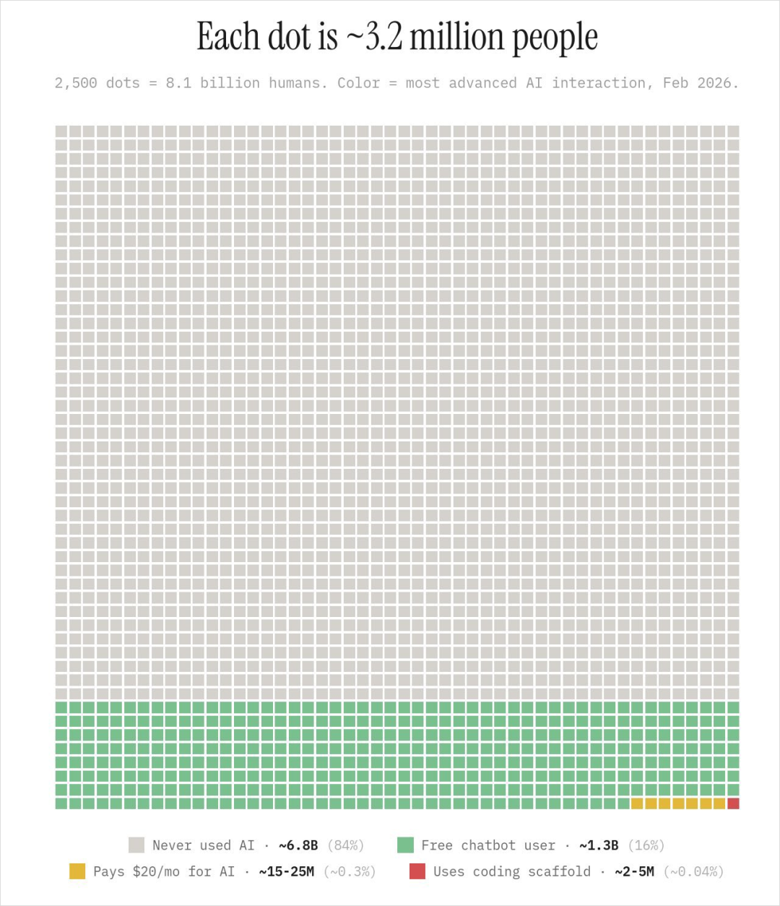
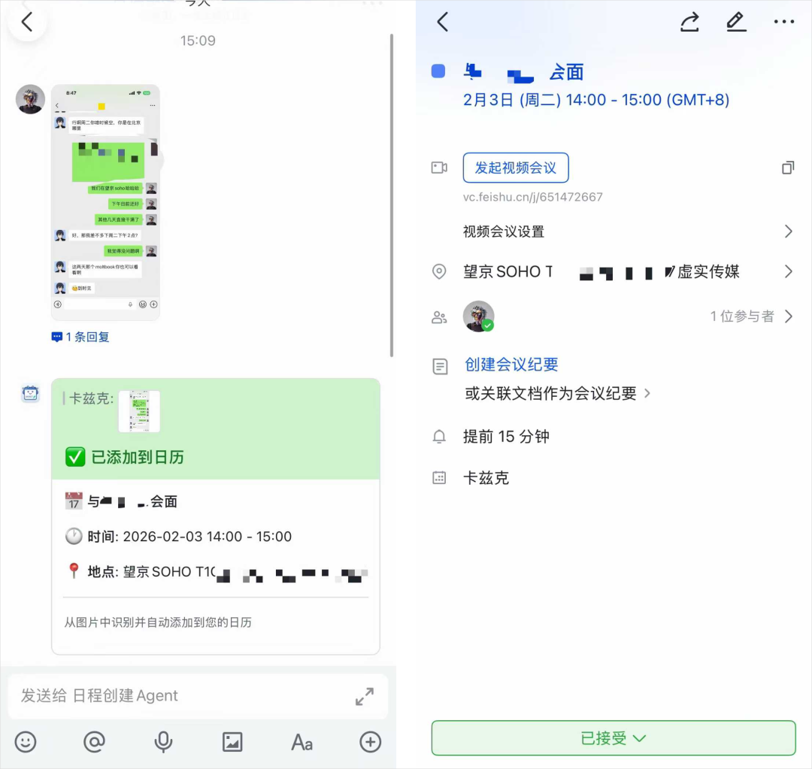
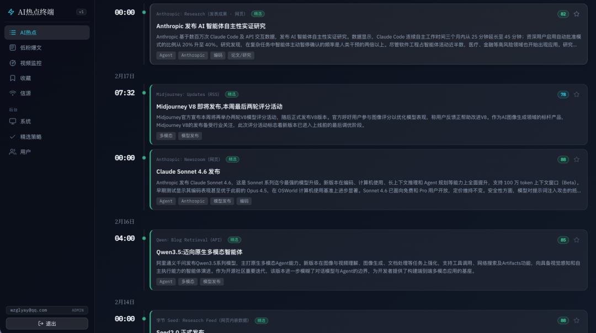
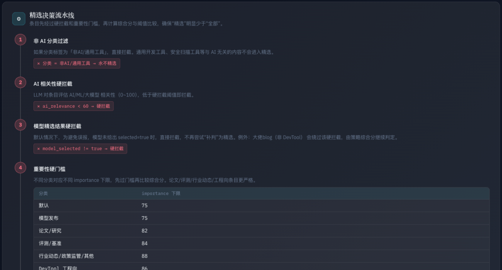
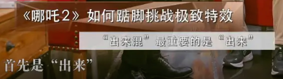
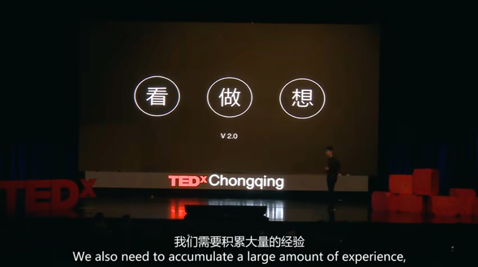

# 用AI的这三年，想跟你分享这9条心得。

## 原文快照

<!-- goodidea:snapshot:start sha256=d61e24e56d5576af744f776551e2562f9e855c3e7fd7f88d62bc4dc74f34e097 -->
> 作者：数字生命卡兹克
> 发布日期：2026年2月24日 10:16

今天，就是这个小破公众号的3周年了。

其实很多时候不是太想也不太敢写这样的文章。

因为总是会感觉会让人显得很有登味。

但，这一次春节回家，跟很多亲戚朋友聊了聊，还是能感觉到信息的参差。

Claude code、Openclaw、小龙虾、codex、Seedance 2.0这些在我们现在看起来，好像天天耳熟能详的词，但对他们来说，是完完全全的陌生。

正好昨天又看到了一张很有意思的图。

这张图的大概意思就是，每一个小方块代表320万人，整张网格代表 81 亿人类。

84%从来没用过AI，大约 68 亿人。

16% 用过免费的聊天机器人，就是底部那条绿色带。

0.3%会为AI每月付20美元，就是那一小撮黄色。

0.04% 用过像Claude Code这种编程Agent产品，大概就是角落里几乎看不见的红点。

数据的来源很难去做核实，但是跟体感差不太多。

我们经常所谓的AI已经非常主流了，也其实也只是在一个很小的小群体里。

我们还没有走到AI的后期，连中期的开头都没到，才刚起步。

世界上84%的人还没有进行过第一次AI对话。

想想当全世界只有16%的人上网时，互联网是什么样子，那时候大概是 2005年左右，一年后我家才有了电脑，我每周最大的乐趣，就是单机玩红警。

未来已来，只是分布不均。

这个小破公众号，自2023年2月开始写下第一篇文章，至今，已经3周年了，在AI时代里，我自己也随着浪潮，奔涌了3年。

所以，我想，在今天这个时间点，也想给大家分享一些我自己亲身经历和经验所总结的9条心得。

也希望大家，都能在这个伟大的浪潮里，奔涌向前。

1、花20刀，去用世界上最好的模型

我知道这条建议听起来有点何不食肉糜。

20美元，换算成人民币差不多150块，对很多人来说不是小数目。

但我还是想把这条放在第一个说，因为它真的太重要了。

我举个例子。

我之前有个老朋友，时间比较急，想把手上的一个活动策划案的大纲，完善成一个能给领导汇报的比较全的文档，他就用AI帮他写了个，他用的是某个免费的国产模型，我就不说是谁了。

写出来的东西他看了一眼就关掉了，跟我说"AI也就这样吧，还不如我自己写"。

后来我让他试了一下我的Claude Opus 4.5，同样的需求，他愣了半天，问我："这是同一个东西吗？"

不是同一个东西。

差距就是这么大。

很多人对AI的第一印象，是被很多比较普通的模型毁掉的，他们用了一次，觉得不过如此，然后就再也不用了，这太可惜了。

如果你真的想感受现在的最顶级的AI，能做什么，那就尽最大可能，去用最好的。

我简单说一下现在几个顶级模型的特点，帮大家选择：

GPT-5.2 Thinking，一个兢兢业业的全栈白领，极其全面，能干很多工作中的活。

GPT-5.3 codex，很牛逼的干活码农，代码能力不必多说，你让它帮你处理excel数据也是一把好手。

Claude Opus 4.6，在我眼里就是牛逼的架构师，能在顶层规划好很多的事情，写出来的东西也特别有质感。

Gemini3.1 Pro，一个很会展示自己的全知科学家，前端能力强，科研能力强。

你不需要全部都订阅，选一个最适合你需求的就行。

如果你实在不知道选哪个，我的建议依然是ChatGPT，非常的全能，还不封号。

150块一个月，少喝几杯奶茶的事。

我见过太多人，花几百块买一件不怎么穿的衣服眼都不眨，但让他每个月花一百多块用AI，就觉得贵。

说句可能有点伤人的话，在AI这件事上，穷人思维真的会让人错过很多。

AI会员的投资回报率，真的是我见过最高的之一了。

2、每周自动化一个重复任务

这条建议是给很多觉得"AI好像跟我没啥关系"的人的。

我非常理解这种感觉。

你不是程序员，不需要写代码。你不是做内容的，不需要天天写文章。你就是一个普通的上班族，每天处理一些琐碎的工作，AI能帮你什么？

其他答案特别简单。

就是帮你把那些重复的、无聊的、每次都差不多的事情自动化掉。

我举个我自己的例子。

我之前每周都要统计一下各个平台的数据，然后放到飞书多维表格里，做数据，这事儿不难，但很烦，每次都要花我近一个小时。

后来我用Codex写了一个小工具，现在它自动帮我爬数据、自动整理成表格、自动把数据分析发到飞书群里，我只需要看一眼结果就行。

还有之前做的一个截图直接AI语义理解变成飞书日历的小东西。

所以，我的建议是，大家可以给自己定一个小目标：

每周自动化一个重复任务。

这个任务可以很小。

比如，每天早上要看好几个网站的新闻，能不能让AI帮你自动抓取汇总？

比如，每周要写一份周报，格式都差不多，能不能让AI帮你生成初稿？

比如，经常要回复一些类似的邮件，能不能让AI帮你写好模板？

一开始可能会有点笨拙，花的时间比手动做还长。

但坚持几周之后，你会发现，你省下来的时间越来越多，而且你对AI的理解也越来越深。

这个过程，就是逐步成为"AI Native"的过程。

几个月之后回头看，你会发现自己，已经成长为参天大树了。

3、抛弃搜索思维，建立实习生思维

这条我觉得特别重要，因为我发现很多人用AI的方式是错的。

就是你把AI当成一个高级搜索引擎。

你问它一个问题，它给你一个答案，完事儿了。

这当然也能用，但这远远没有发挥AI真正的能力。

搜索引擎是一个"关键词匹配"的工具，你给它几个词，它把相关的网页找出来给你。

但AI不是。

AI更像是一个人，或者有另一个更准确的形容，它更像是一个全能实习生。

你不能用对待搜索引擎的方式对待它，你得用对待实习生的方式。

这个实习生学历很高，MIT博士毕业，别人双学位，它有1000个学位，什么都懂，执行力很强，24小时在线，从不抱怨，但他毕竟是个实习生。

他不了解你的具体情况，不知道你的老板是什么风格，不清楚你们公司的潜规则。

所以你得跟他说清楚。

你不能只说"帮我写个方案"，你得说"我要做一个线下活动，预算大概5万，目标人群是大学生，场地在北京，时间是下个月，老板比较喜欢有创意的东西但又不能太出格，你帮我出几个方案"。

这应该能看出区别了吧。

前者是搜索思维，后者是实习生思维。

把背景说清楚，把需求说清楚，把限制条件说清楚，把你期望的输出格式说清楚。

你描述得越清楚，AI给你的结果就越好。

这个时代，缺的从来不是AI的能力，缺的是人的表达能力。

说实话，我们中国人在跟AI的表达上，确实有的时候会迟一点亏。

因为我们的文化里，表达比较含蓄、比较婉转，有些话不好意思直说，习惯让对方自己领悟。

我们习惯了"你应该懂我的意思"，习惯了"点到为止"。

但AI不会领悟。

你不说清楚，它就只能猜，猜得不对，你就觉得它不行。

所以用AI的过程，其实也是一个训练自己表达能力的过程。

你得学会把脑子里模糊的想法，变成清晰的文字描述。

这个能力，不管AI时代怎么发展，都会越来越值钱。

4、 给自己设一个"AI能帮我吗"的刻意反应

这条听着有点抽象有点虚，但是是我觉得一个思维转变的最实用的方式。

就是在你开始做任何一件事之前，先停一秒钟，问自己：

这件事，AI能帮我吗？怎么帮？

很多人不是不会用AI，是根本没有想到去用。

我举个我自己的例子。

我3月份要去西班牙出差，参加MWC，然后前一段时间，我们HR跟品牌方就在给我办签证，然后签证里面有一个条件，就是说我有房产，要提交房本，然后我说我老家的房子，房本丢了，一直没空补。

然后我们HR就问了下ChatGPT，跟我说搞个电子的。。。

然后就真搞定了。。。

我当时就发了一条朋友圈感慨：

“ 有时候真的感慨，就是思维转变那一下，就能帮你解决这个社会中，绝大多数的难题。今天事我们HR教我学习AI的一天。 ”

这是习惯的问题。

明明手边就有这么强大的工具，但遇到问题的时候，第一反应还是觉得自己经验告诉自己，这事搞不定，或者习惯性的去百度搜。

说真的，我们已经习惯了没有AI的做事方式，习惯了什么事情都要自己来，习惯了自己的经验就是最牛逼的。

这个习惯，真的不是一天两天能改的，需要刻意练习。

我最近也一直在刻意的训练自己，我的方法就是，给自己设一个触发器。

就是在你开始做任何一件事之前，先停一秒钟，问自己：

这件事，AI能帮我吗？

能帮多少？

怎么帮？

一开始你可能会觉得很刻意，很不自然，但坚持一两个月以后，这个反应会变成本能。

而且你会发现一件事：

AI能帮的忙，比你想象的多得多。

不是每件事都要用AI，但在你决定不用之前，至少先想一想。

这个习惯听起来很小，但养成之后，相信我，效率的提升是复利式的。

5. 一定要去创造点什么

这条是我自己感触最深的。

AI最牛逼的地方是什么？

不是它能帮你回答问题，不是它能帮你写东西，不是它能帮你省时间。

是，它能帮你创造。

创造这个词，以前听起来离普通人很远。你想做一个App？你得学编程。你想拍一个电影？你得有设备有团队。

创造的门槛太高了，高到大多数人根本不敢想。

但AI把这个门槛踩碎了。

现在你想做一个App，可以用Claude Code，跟它聊几轮，描述清楚你的需求，它帮你写代码，你不需要会编程，你只需要知道你想要什么。

就比如信息太多了，我需要AI来帮我降噪帮我精选信息，于是我花了一天时间，coding了一个AI热点系统。

通过一系列的规则权重公式，来挑选出真正有价值的信息，第一时间推送到我的面前。

这套东西，我自己做？以前说实话，我想都不敢想。

创造的门槛从来没有这么低过。

而且创造这件事，会给人一种非常强的正反馈。

这种感觉真的太爽了。

你做出来一个东西，哪怕它很小很简陋，但它是你做的，它从无到有地被你创造出来了。

那种成就感，是你刷再多短视频、看再多文章都得不到的。

所以，我真的很建议大家，去创造点什么。

不需要很大，不需要很复杂，不需要有商业价值，就是做一个你自己想要的东西。

一个小工具，一个小视频，一篇小文章，一首歌，一幅画，什么都行。

去创造。

而且创造的过程，会倒逼你去学习AI的各种用法。

你想做一个工具，你就得学会怎么用编程Agent什么叫skills什么叫上下文管理，你想做好一个好片子，你就得学会怎么用多参生视频怎么写剧本怎么设计分镜。

这比单纯地"学习AI"有效多了。

我自己很喜欢开发工具很喜欢自动化，同时，我也很喜欢拍电影做片子，这两条路，我现在都在做。

但其实我真正想创造的，也是我一直在说的，是我自己真正的本体。

是代码和艺术的结合体，游戏。

可能真正某一天，AI的能力到了，我自己也可以功成身退了，那时候，我可能就真的，会选择，自己去做一款，属于自己的游戏了。

我最喜欢最喜欢最喜欢的偶像，有两个人。

一个叫宫本茂，一个叫冯骥。

做游戏，做制作人，如果到时候还有人愿意来玩我的游戏，那真的，想想就激动。

6. 警惕AI给你的幻觉

这条是上一条的另一面。

AI会给你很多正反馈。

你跟它聊一个想法，它会说"这个想法很有创意"。你给它看一篇文章，它会说"写得很好，逻辑清晰"。你让它评价你的方案，它会说"这个方案很全面，考虑得很周到"。

它善于鼓励，善于肯定，善于让你感觉良好。

它很少会直接说"你这个想法很蠢"或者"你这个XX"。

这当然是因为AI在设计的时候就考虑到了用户体验，它不想让你不开心。

但问题是，这种正面反馈太多了，会让人产生一种幻觉。

一种"我X我真的好牛逼"的幻觉。

你写了一篇文章，AI说好，你就觉得自己写得真不错。

你想了一个创业点子，AI说有潜力，你就觉得自己真是天才。

你做了一个产品，AI说很实用，你就觉得一定会火。

但AI的评价，只是一个起点，不是终点。

真正的检验，在真实世界里。

你做的东西，有没有人用？你写的文章，有没有人转？你的产品，有没有人付钱？

这些才是真正的反馈。

这个过程可能会很痛苦，AI夸了你半天，结果真实用户说"你写的什么垃圾"。

但这种痛苦是必要的。

没有真实世界的检验，你就永远活在AI给你营造的幻觉里，你觉得自己很牛逼，但其实你什么都没做成。

所以，享受AI的鼓励，但不要沉迷。

做出来的东西，一定要拿出去见人。

7. 不要等准备好了再开始

这条建议，其实跟AI关系不大，但我还是想说。

因为我见过太多人，在"准备"这件事上浪费了太多时间。

他们想学AI，于是开始研究最好的学习路径是什么。

他们看了一堆文章，收藏了一堆教程，加了一堆群，买了一堆课，然后呢？然后就没有然后了。

他们一直都在"准备"。

准备得非常充分，但一直没有开始。

就像冯骥那句经典名言：

踏上取经路，比抵达灵山更重要。

还有饺子的那句：

出来混，最重要的是“出来”。

我的建议是，现在就开始。

不需要准备好，不需要找到最优路径，不需要搞清楚所有的概念。

就是打开一个AI，就这样开始。

创造你想创造的，去vibe coding一个你需要做的自动化的任务，去用Seedance 2.0做一个你想做的一分钟的片子。

你可能不知道怎么做，没关系，问AI，你可能会犯很多错，会问很多蠢问题，会得到很多没用的回答。

但这些都不重要，重要的是你开始了。

学任何东西都是这样的，你不可能在开始之前就搞懂所有事情，很多东西，只有在做的过程中才能理解。

而且AI这个东西变化太快了，你今天学的东西，可能三个月后就过时了。

你与其花三个月准备，不如现在就开始用，边用边学。

用最笨的方式开始，在过程中慢慢变聪明。

这比准备好了再开始强一万倍。

任何年纪，都是最完美的开局。

8. 培养你的品味与审美

这条建议可能听起来有点虚，但它可能是这10条里最有护城河的一条。

AI能做很多事情，能写，能画，能做视频，能写代码，能做分析。

AI能帮你做很多事情，但有一件事它做不了，就是替你做选择。

你让AI写十个标题，它能写，但哪个标题最好，你得自己选。

你让AI出五个方案，它能出，但哪个方案最适合你，你得自己判断。

你让AI生成一百张图，它能生成，但哪张图最有感觉，你得自己挑。

这个"选"和"判断"和"挑"的能力，就是品味和审美。

因为它们太像了。

它们都是AI风格，或者说，都没有风格。

这个时代，大家都在用AI，AI的能力会成为一个基准，你用AI，别人也用AI，大家的起点是一样的。

那什么才是你的优势？

是你的品味，是你的审美，是你对"什么是好的"的判断。

品味和审美，是AI无法代替你的东西。

怎么培养品味？没有捷径，就是看、做、想，不断循环。

有一个10年前的TED演讲，是之前锤子科技设计总监罗子雄的， 2015年，我还在读大学，而那个演讲，几乎启发了我所有未来关于设计的训练，更 是我培养自己开始刻意训练品味的起点 。

大家可以去B站搜搜看，叫《 如何成为一名优秀的设计师：罗子雄》。

这里面的心法和经验，在AI时代，几乎就是最核心的基础。

看好东西，想为什么它好，自己试着做，做完之后再对比，找差距。

这个过程可能会很慢，但它是值得的。

每当3个月回看时，觉得你之前3个月的东西，是垃圾，那你的品味，就上升了。

当AI的能力成为所有人的标配，品味就会成为最稀缺的资源。

还有一个东西，AI也没有，就是你的个人经历和感受。

你经历过的事情，你感受过的情感，你踩过的坑，你流过的泪，这些东西是AI不知道的。

当你把这些东西融入到你的创作里，那就是独一无二的，是AI无法复制的。

这才是你真正的护城河。

9. 把省下来的时间，还给现实里具体的人

最后一条，也是我最想说的一条。

我们在这样一个狂飙突进的浪潮里，很容易产生一种技术崇拜，仿佛数字世界就是一切，仿佛谁用AI用得最牛逼谁就最厉害。

每天刷AI的新闻，每天学AI的新工具，每天想着怎么用AI提升效率。

这些都没问题，但如果你所有的时间都花在这上面，你会发现自己跟真实世界越来越远。

我自己其实就有这种感觉。

有一段时间，我每天醒来第一件事就是看AI有什么新进展，睡前最后一件事还是刷AI的内容。

工作的时候在用AI，休息的时候在研究AI，吃饭的时候在跟人聊AI。

后来我发现，我已经很久没有好好跟家人聊天了，很久没有约朋友出来吃饭了，很久没有在阳光下散步发呆了。

但真正重要的东西，从来都在屏幕之外。

是你爱的人的笑脸，是朋友的一通电话，是鱼缸里养了一年的小龙虾。

那些真实的连接、具体的人、面对面的交流，是任何技术都替代不了的。

AI可以让你更高效，但它不能让你更幸福。

幸福来自于跟真实世界的连接，来自于具体的人、具体的关系、具体的时刻。

所以我的建议是，用AI节省时间，但把节省下来的时间，还给生活，还给那些你在乎的人。

这才是AI真正的意义。

写在最后

写到这里，又是6000多字了。

说实话，写这种建议类的文章，我一直是有心理负担的。

因为我自己也不是什么成功人士，也还在摸索，也还在犯错，凭什么给别人建议呢？

但这次回家之后，我改变了一些想法。

我看到很多人，其实不是不想尝试新东西，只是不知道从哪里开始。他们缺的不是智商，也不是时间，就是缺一个人告诉他们：

来，就从这儿开始，很简单的。

如果这篇文章能让哪怕一个人，开始尝试认真使用AI，对AI产生了一点好奇，那就值了。

这个小破公众号，不知不觉写了三年了。

三年前写第一篇文章的时候，ChatGPT刚出来没多久，我还在想这东西能火多久。

三年后的今天，AI已经彻底改变了很多人的工作方式，而这一切可能才刚刚开始。

我很庆幸自己在这三年里，一直在坚持，一直跟着这波浪潮往前走。

既然被命运，推上了本不应属于自己的舞台，那就尽全力演好属于自己的剧本。

也希望看到这篇文章的你，不管你现在在哪里，不管你是什么职业，不管你多大年纪，都能找到属于你自己的方式，加入这场浪潮。

未来已来，只是分布不均。

愿我们在有生之年，能赶上均匀分布的那一天。

也愿我们，永远对世界保持好奇。

以上，既然看到这里了，如果觉得不错，随手点个赞、在看、转发三连吧，如果想第一时间收到推送，也可以给我个星标⭐～谢谢你看我的文章，我们，下次再见。

>/ 作者：卡兹克

>/ 投稿或爆料，请联系邮箱： wzglyay@virxact.com
<!-- goodidea:snapshot:end -->
