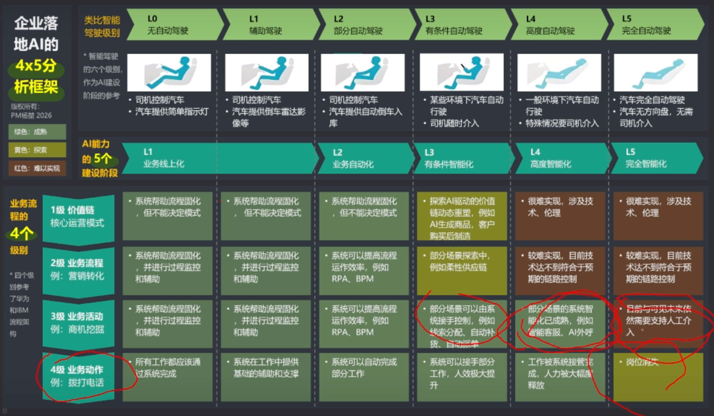

# 阅读素材：曾鸣《智能商业》（第一章AI产业化的展开+第二章智能复利和黑洞效应）

## 原文快照

<!-- goodidea:snapshot:start sha256=3302453859e074c9d599ed278d697978e091f46e18d743cee72dce3c18348c9d -->
# 阅读素材

> 作者/来源：曾鸣

## 前言

- 这本书是这本书是试图从第一性原理的角度去理解，AI 技术高速发展下去的话，会对整个经济、商业、组织、战略这些重要领域产生什么样的根本性影响。所以这本书我理解，重点不在于结论，而在于曾鸣教授他对于 AI 这一生产力要素是如何影响市场、社会的思考过程。

## 第一章 AI 产业化的展开：从智能体爆发到系统级重构

### 1.1 AI 发展第一阶段：基础设施建设基本成型

- 我发现就是曾鸣教授在看待新商业变化的过程时，他其实也是采用一种类比的规律视角。他在书里边提到，工业时代最重要的基础设施是能源。互联网时代最重要的基础设施是信息网络。而 AI 时代最重要的基础设施正在形成，也就是可持续被调用通用人工智能。
- 曾鸣教授认为，这次 AI 技术革命的本质是用越来越低的成本去生成，去生产越来越强大的人工智能。
- 看到这里，曾鸣教授在书里边写到了这样一句话，就是说所有重大且深刻的产业变化，通常都不是出现在技术刚发明不久的时候，而是发生在技术在基础设施化之后。怎么理解呢？其实就有点像一个技术想要起到重大且深刻的产业变化，它本身只是其中一个要素，更加重要的在于其价值网络，就是说它在原有价值网络中可能并不凸显优势，但是它一旦在一个新的价值网络中，它的优势就能够被发挥出来了。

  - 他在书里边提到了这几个例子啊，比方说蒸汽机发明之后，还需要等待现代工业体系的建立。互联网发明之后，还需要平台经济的诞生。
  - 也就是说，真正推动社会重构的时间点是在这些新技术逐渐变成一种稳定、低成本且可以被规模化调用的公共能力。这个时候，整个社会、市场、组织才会围绕它重新开始构建新的生产关系。
- 在 AI 时代，Token 就像是工业时代的石油，数据中心在本质上就像是炼油厂持续输出能源一样，AI 正是因为它同时具备了这三个特征，才使其具备了成为基础设施的属属性。

  - 可计量性，这是指每次调用模型的时候，都会产生 token，并且能够被精确记录，也就是能够被量化，而量化的话我们就能够知道其成本结构就会越来越清晰。然后书里边说后边还有什么规模效应会越来越明显，产业会围绕这种能力形成新的资源配置方式，这个还不太清楚是什么意思。
  - 可组合性，也就是说不同的能力，比如说生成、理解、推理、编程，可以通过统一的方式被调用。这就使得开发者并不需要关注底层是怎么实现的，直接在这个基础之上进行
  - 规模化，随着前两者的应用，比如调用方式的统一、成本结构的逐渐清晰，Token 的使用量其实就会在产品使用过程中快速增长。
- 如果说工业革命让人类能够大规模低成本的调用机械动力，信息革命能够让人类低成本稳定地调用信息连接能力。那么，AI 时代的重要性很可能是不亚于前两者的总和。因为，在过去，智力始终是一种稀缺的、难以复制的资源。比如说，优秀的判断、复杂的分析、跨领域的理解、持续的推理等等。像这些能力过往时，高度依赖于受过专业训练的人类个体。也换换句话说，一个组织的发展速度，很大程度上呢，也受限于高水平认知能力的供给速度。这个让我想起什么呢？这个让我想起了马蹬。你包括过去骑马也是一样，在马蹬没有发明出来之前，你骑马本身也是一件啊，稀缺难以复制的一件事。但是马蹬的话其实降低了这个成本，一旦降低这个成本就会有就也就意味着能够低成本、规模化地去调用这个资源。这个在军事上也是很有用的。包括像弓弩的发明，对吧？过去，弓箭，一个合格弓箭手，他的训练也是高度稀缺低，高度稀缺且难以复制的。但是有了弓弩的话，是个人就行。其实最典型就是手枪嘛。

  - 这意味着智力开始成为一种社会化生产能力
- Token 消耗量的增长，其实侧面也反映了，就是人们开始将真实世界中的任务逐渐转由智能系开始完成，比如说，AI 辅助开发、AI 辅助研究、AI 辅助运营、AI 辅助决策，所以有时候我也觉得，就是在工业时代啊，这怎么说呢？如果说把 AI 放到工业时代，那么它会是石油或者是能源。那么把它放到电力时代，那它其实就是电力，就始终它是在其中扮演着一种基础设施的角色。就是它是整个社会协作中的血液，社会上很多的运转都是需要靠它的。

### 1.2 AI 发展第二阶段：智能体大爆发

- 在这个时候，其实在这个前夕，主要是以 ChatGPT 率先推出的一种以交以交以对话为核心的交互范式。那像这种交互范式主要是人们起初是用于，就是说当参谋，帮助去，协助去完成一件事。比如说可能在规划的时候可能用它去思考，辅助思考。但是用户会渐渐想，就说为什么它不能帮我直接把这事完成掉呢？所以这种诉求其实就会使得人们会更加关注于这个 AI 除了说它本身能力足够强之外，那么它在干活方面干活的方面有没有用？那么一旦这样去看的话，其实对话这种交互方式的限制就会边界就会很明显了。所以说在今年年初的时候，OpenCode 其它就是意味着一种新的范式的出现。就是当智力能够通过，比如说 MCP，或者是等等方式来去调用工具的时候，开始出现了一种以任务执行为代表的新范式。

  - 这个范式一旦开启，随着不断的深入使用，人们就会发现，一个 AI 如果说需要完成一个真实任务的话，它至少需要具备三种能力。第一个是理解目标并拆解任务的能力。第二个是调用外部能力或资源的能力。第三个是在执行过程中根据反馈动态调整路径的能力。
  - 其实现在就像是我们现在怎么去定义一个智能体呀。当然关于这个定义其实范说法也有很多，有的最简洁的说法就是Agent = LLM + Harness，其实把后者拆开就有很多了。但就其目的而言，是确保一个任务能够稳定可控的执行完成
  - 换句话说，人们更加人们开始期望它能够围绕事先制定好的目标，持续地运行并完成任务。
  - Agent 和功能还不同。我们功能其实本质上只是工具的功能的集合，相当于就是说，哎，之前用户为了完成这个事，我们通过这样工具可以帮助他更好地完成。注意，这里的用词是更好地帮助他完成，并不是说帮助他完成这个事。但是智能体在这其中，它就不是说啊帮助用户更好地完成一件事，而是能够直接帮助他把这事给干掉。对，也就是说它并不像是一个工具，而更加像是一个参与工作流程中的一个角色，这个是一个很重要的变化。
  
    - 从协助者到执行者的变化，其实意味着它的价值会大幅提升。
    - 同时我们可以预见到，就是随着模型能力的不断增强，以及驾驭层的不断改进。未来会有越来越多的场景会因此而解锁。现在很多其实现在其实很多场景都是因为这两者还没有演进到一定程度，所以还没法解锁。而一旦解锁，又会有可能诞生新的又会产生新的需求，又会催生出新的整体形式。
    - 一旦它能够开始把这件事给干掉，也就意味着它的本质是价值创造单元，而不是能力单元。能力单元的话，人们会为其所具备的能力而买单。但是如果说它是价值创造单元，人们只为它能够产生多少成果而买单。所以也就是以结果为导向的付费模式。
    - 这一特性直接决定了就是智能体的大爆发会受制于一些因素。可以说大爆发期，也就是说人们基于智能体的交易成本开始降低。但是由于它是以结果为导向的付费，也就意味着有这几个特征。
    
      - 当智力第一次被低成本规模化的调用的时候，也就意味着过去大量的长尾需求开始被快速的智能体化。之前为什么在就是说互联网时代并没有去做这件事呢？因为做这件事情的成本比较高，也就所谓的定制化成本，高于这件事，高于做这件事本身的一个成本。所以对于做，所以，对于那时候做产品人做产品的，这他通常都是做成标准化的 SaaS 产品，但是虽然说是聚焦于某一类用户群体，但是同时还是会和用户群体保持一定距离。因为距离越近，虽然说你能够服务的越好，但是你的成本也会上升，中间是一个 ROI 的一个考量，一个衡量。所以一个恰当的距离也就意味着在这个节点而在投入产出比是能够达到一个平衡的。所以其实并不是说把用户给服务好，你的产品就能够怎么样。这个是在 B 端领域是不一定的，是不成立的。其实我觉得也包括在 C 端，C 端其实也并不会说多么多么那个呀。好，收回来，这个其实意味着一个特征。比方说，原本 40% 的产品或者是软件系统服务了 20% 的 高频需求。那么后续可能会诞生，会额外增加 50% 的新增智能体来去满足后面的这  80% 的长尾需求。
      
        - 当智能体数量爆发性增长后，整个系统学就会面临到新的问题。这个也是过去不管是工业时代、电力时代都会碰到的这个事情。
        - 总结成一句话就是，每一次能力的大规模释放的同时，会带来复杂性的急剧上升。这种复杂性，有社会治理层面的，有市场交易层面的。
        
          - 交易成本难以估算。虽然说整个的智能经济是以 token 为底层运转的，但由于智能体本身的一些特性，你比如说一个功能，当我们了解清楚功能的代码逻辑之后，我们就能够根据对应的操作得到稳定的预期。换句话说，得到稳定预期的因素变量是比较少的。但是 Agent 就不同，同样一个同等智力水平的模型，在一个熟练使用者的手中和非熟练使用者的手中，发挥的作用是截然不同，中间的变量因素是比较多的。这个还只是人的因素，你如果说智能体因素，那就更多。因为智能体本身其实是带有一定程度的自主性。比如说它会根据上下文的语境去动态决策，去主动的调用工具、调用资源，并且在这个过程中呢，也会持续地更新它的一个执行路径。在执行的过程中也会不断地调整方向。换句话说，它相较于过去的功能系统来说，它是很难完全完完全全的预定义。这对用户来说，其实也意味着它的不可预测性会增加，也就意味着，做同样操作，能否得到稳定的预期是不确定的。
          - 同样的行为不一定有同样的产出，可能产出好，可能产出坏。
          - 在刚开始，组织更多的是让 AI 来完成一些业务动作。目前其实这个层面来说的话，其实问题是不大的，也就是图里边的这个左下角，这样的一个水平。但如果说随着业务流程级别逐渐往上走，比如说让智能体开始真正地参与企业运营，对吧？比如说到业务流程改造，甚至是企业价值链的调整。事情难度就会迅速复杂化。因为在这个时候他，因为这个时候考，核心并不是单个智能体它能否这个运行，而是说在智能集群的情况下，还能不能稳定运行。比如说不同智能体之间的这个上下文，如何保持一致？如何处理中间传递损耗的问题？信息如何避免失真？在智能集群中，一个小的智能体产生的问题，是否会被集群而放大？如果智能集群在调用资源时，成本如何做控制？如果做出了不符合预期的决策，责任如何划分？这些问题是随着从业务动作到业务活动，最后深入业务流程价值链所会衍生出的问题。这也是未来在驾驭层所需要考虑和解决的问题。
          
            - 当智能体数量足够多的时候，其实用户面对的往往就像是一个生态网络。对，那这样的一个生态网络的话，核心的问题就是网络中的秩序能否有序流动，或者说网络中的智能体能否被有效的组织起来。所以驾驭层的本质是驾驭模型的不确定性，以提供给用户稳定可控的交付能力。
            - 如果说驾驭层不做好的话，也就是这个活还干不明还干不明白的话，那么在市场层的问题也就很难以被解决了。想要理解市场，可以从供需关系或者说供给和需求去切入。那么对于这个市场里边的买方来说，他其实对于一个供给的一个情况来说，会有这几个感受。第一个就是前边提到的不仅有服务于前 20% 的这个高频需求的智能体，还有服务后面 80% 长尾需求的智能体。也就意味着整个供给是海量的，并且这个前面也说到，这个智能体的一个能力表现，也很大程度上会取决于具体的上下文。换句话说，它其实没有传统软件那么稳定。这对市场里边的买方来说，其实是有着巨大的这个交易阻力。用户不仅需要对自己需要解决的任务有清晰的定义和认知，还要理解，对吧？这么多的工具之间的能力边界，它们的协同关系和适用条件。换句话说，用户其实是在面对着一个持续变化的智能生态网络中，做动态决策，所以说这个过程中会认知成本较高。
            - 这还只是在理解层面。在实际干活的时候，肯定会还是有一好几个的智能体，对吧？都会告诉你啊，我能够完成你所想要这件事。但是如果说你不用的话，你很难知道它们之间实际的一个能力差异、任务执行稳定性的差异，还有它们在任务边界处理上的差异。这个写其在使用期间是完全不透明的。换句话说。只有不断地去试错，才能够知道哪个会更加适合自己。这个其实是试错成本是非常高的。其次，一个智能体通常是服务于某个特定场景的，因此它可能在某一个特定场景里面的表现特别好，但是一旦切换到其他场景中，效果就会大打折扣。因此，当任务本身是具有一定复杂性的时候，其实，呃，用户是很难判断，用户其实是很难判断，就是一个智能体是哪个智能体会更加适合当前这个问题。啊。这还只是完成单一环节的任务，所以一旦时间我们从连续的角度来看的话。还会需要决定在什么阶段使用什么智能体，以及如何去衔接上下游的产出交付物。这个事情本身也会显著地提升使用门槛。
            
              - 然后就是在驾驭层，由于前边有很多这种不确定的因素，一个至关重要问题开始浮出水面。就是完成一个任务所需的成本结构，以及对应的这个利益分配的方式。比如说现在我们虽然说看起来都知道啊，这个是以 Token 为基本单位的计费，就所谓的就卖 Token 嘛，也就是模型提供能力。但是用户在真正使用，用户在真正执行任务的时候，其实里边又会叠加，比如说工具的调用费用，一些接口的调用费用，还有其他应用层的收费。所以我们在实际应用中来看的话，又会发现，就是说它本身并不是一个单一层级啊，就所谓的卖 Token 费用，不是的。它中间是会一个分层的结构。比如说一个看似简单的一个任务，可能中间会涉及到模型 Token 的调用费用，对吧？还有中间层的这个工具调用的费用，API 调用的费用，以及还有面向用户的应用层的服务费用。这，在整个，所以说它中间是有多层级的，那多层级里边就对应着不同的提供对应服务的公司嘛，那其实就获取不同的收益。这是单个智能体。的一个情况。然后我们如果说再进一步来看，在多整体又在智能网络中，如果说是由一个智能集群去完成你的这样一个任务的话，那么中间的成本结构又会，复杂度又会进一步提升。所以如何在不同的服务提供方之间合理分配其利益，也是非常关键，因为这个决定着开发者能否去有效的判断这个投入和回报？如果成本结构不透明，用户也难以形成稳定的预期。比方说，一如果看做一个任务花了，虽然说稳定，但是中间调用的成本太高，也是很难去解决的。所以像这种问题，它很难被掩盖，反而会随着逐渐深入的使用，变得越来越凸显。
              
                - 所以你看前面提到很多，比方说面对着海量的供给。然后去认识并理解这些智能体，以及如何确保选择到的是一个有效的智能体，完成一个任务后，费用如何结算？成本结构如何划分？等等。其实对于一个这个市场中的买方来说，是一个很大的交易阻力。因此，在服务，就在智能体和用户中间其实是需要一个节点，也就是所谓的 AIOS 来帮助用户降低交易阻力的。通过这样的一个中间节点来帮助用户降低交易阻力，解决购前、购中、购后的成本问题。这样的话其实用户其实就不太关心，就说有多少个智能体，因为他跟它做交互的只是这样的一个中间节点。然后由中间节点再去和它后边的这些提供对应服务的这个智能体再去做对接。
                - 前面聊的我们都是基于这个市场买方，那么对于市场供给端来说的话，竞争肯定是会更加激烈的。就是说，那么对于 AIOS 来说，它其实就有点像典型的这个双边交易市场。一方面是帮助需求侧的买用户去选择选，选择合适的合适的智能体。另外一方面，也需要去大幅降低开发者的一个成本，形成一个网络效应。所以我们可以预见的就是，在海量的需求端和供给端中间，会有几个巨大的入口。所以可以想到这个入口又会在中国这个市场里边又会有所谓的，到时候就是几百个 AIOS 的竞争。然后杀入决赛圈，最后夺冠的只有这么寥寥几个。这个在互联网时代其实就是微软和苹果，就所谓开源系统和闭源系统之争。所以第三阶段开始。

### 1.3 AI 发展第三阶段：AI OS 的出现

- 然后回归本质回归本质，就是用户其实并不需要智能体，而是需要把这件事给完成掉。也就意味，其实就是怎么说呢，功能、智能体都是手段，完成任务才是目的。
- 所以在这个时候，其实对于这个 AI 操作系统来说，很核心的就在于说，将用户的这个意图，去进行识别，然后拆解，再组合，再调用组合相关的这个智能体提供的服务，执行并完成任务。所以在这个时候，我们可以看到，像这样的一个平台，它在这其中扮演的角色应该是一种任务调度。这个调度是一个很有意思的一个东西，就是说它在系统三要素里边，它是起到目标要素连接，它是起到连接作用的。这种编排的目的是对于复杂任务复杂性的一种应对策略。这个时候，相较于过去的这个操作系统，新的 AI 操作系统要面对的是大量持续运行动态协同的网络智能体网络。这个时候系统真正需要管理的，不再是算力，还有任务流上下文、智能协同，还有长程任务能力。

  - 需要注意的是，这里的调度有别于匹配。它有几个典型特征，所以调所以调度本身并不是一个简单功能，而是接近于一种底层系统级能力。它不创造智能体，但是它负责连接、编排、调度这些智能体。
  
    - 它是一个过程，而不是瞬时的决策。你比如说调度，你比如说就是匹配的话，可能就是一瞬间我匹配好就可以了。但是任务的执行是一个持续的过程，在不同阶段都需要做不同的一个调整。
    - 它涉及的是组合，而不是单点最优。在多智能体协作过程中，往往并不取决于谁的能力最好，而是根据任务合理的调度相关的智能体，来去稳定的完成一个任务。所以说，这种主，这，这种组合关系是没法通过一个单一指标去做衡量和评判的。
    - 它需要处理不确定性。就是一个真实任务本身，它很难就说在任务刚开始的时候，你就完全规划和预测好。因为在执行过程中本身就会出现新的信息，或者是前面没有预料到的东西。那么这些东西在任务执行过程中上下所形成的上下文本身又会反哺。作为后续行动依据的后续行动决策依据。
  - 从功能上来说，这个节点会承担着这几类角色。
  
    - 它需要与用户进行直接交互，它直面用户，需要去理解任务目标，并将其转化为可执行的过程。
    - 它需要去面对系统内部的智能体，基于对用户意图的理解，去调度、编排、组织这些智能体去完成任务。
    - 然后它还需要就是说对开发者侧的一些支持，比方说统一的接口方式、上下文管理机制、记忆啊、等等这些东西。这些能力用户并不会直观地感受到，但是呢，它会影响整个系统的在开发侧的一个协作边界。其实所谓就是规范协议的本身，目的在于降低中间的协作成本嘛，其实就这个意思。
- 所以当我们在讨论 AI 操作系统的时候，本身其实在讨论未来会通过一种什么样的机制来去组织这些复杂智能体，当 AI 进入复杂任务系统的时候，相较于过去的组织方式而言，新的组织方式会有什么样的变化？虽然说这些东西目前并还没有形成明显的一个范式，但是方向是这样的一个清晰的。

### 1.4 一个新时代真正开始的地方

- 有之以为利，无之以为用。在每次技术，每次重大技术革命早期，竞争往往都是围绕着能力本身来展开。但随着能力在整个系统中不断深入的过程，那么在这个时候决定产业格局的通常就不再是能力，而是谁能够围绕这些能力建立起新的生产关系系统。就所谓的这个生产力和生产关系的一个矛盾。这个也是北京市前边发文的目的，或者是它的一个目的所在。就是率先去探索如何去形成符合新质生产力的一个生产关系、新制度。就也就意味着竞争从单点的模型能力竞争进入到了系统性竞争。整个 AI 产业也开始这个从整个 AI 产业最核心的问题，从大模型能力到究竟能不能成立，到这个基础能力能够为用户解决哪些问题？
- 前边不管是工业时代还是互联网时代，本质其实都是由人来组织任务。人负责理解目标、协同资源、管理上下文，然后推进复杂的工作流。在这个时候，软件系统本身的和人的关系始终是一种辅助的关系。但是 AI 不同，AI 是第一次真真正正儿八经地进入到这个组织认知层。也就意味着这个整体并不只是支持工作，而是会越来越深入地参与到这个任务的拆解、信息的组织、能力的协同、动态的调整、长城执行。这些变化其实是远超我们现在这个时间点对于 AI 工具的一个理解。而系统一旦进入任务层，那么过去我们整个商业世界的组织逻辑就会发生变化。比如说，为什么工业时代会形成如此庞大的管理体系？为什么现代企业要有如此复杂的组织层级？本质上来说，都是因为复杂任务先天是需要去靠层级协调，然后降低复杂度。那么在未来越来越多的人，越来越多的任务被人和智能生态共同完成的时候，那么过去很多必须依赖层层管理这个系统，就有可能被系统吸收部分。所以为什么说在就是 AI 入企的时候，对于中层的伤害是最大的。因为在整个在一个企业中，中层所扮演的角色就是降低中间的这个复杂任务的协调成本和复杂性的管理成本。但是，AI 这一要素，它与前边的差异就在于，它并不需要人来去中间协调，这样的一些东西，它完全是可以通过人加这个智能生态，来去解决过去所面临的问题。换句话说，过去的一些复杂性对于当下来说，并不是什么问题，过去需要中层在中间层层协同的事件，很有可能就被系统去吸收部分了。所以我感觉这个也是后续在讨论 AI 入企时，所需要去持续观察的一件事。就是这中层的消亡。
- 过去的工业时代为什么需要有现代企业？为什么现代企业里有如此复杂的组织层级？本质上来说，都是因为复杂任务天然需要中间层来消化复杂性。对一个社会来说，这里中间层是企业。对于一个企业来说，这里的中间层是管理人员。但就和前面推论一样，智能体系统本身不再是支持性工作，还会越来越深入地参与到任务拆解、信息组织、能力协同、动态调整、长周期执行和上下文管理的时候，原有的组织关系是不适用于新的生产力的发挥的。所以谁能够率先形成 AI 原生的任务系统？就根据 AI 特性重新组织任务本身，谁能够有效的组织大量可持续运行的智能系统，谁就有可能形成下一阶段的竞争优势。

## 第二章 智能复利和黑洞效应

### 2.1 智能复利

- 在本章开头，我觉得这个曾鸣教授写的一句话特别好，就是精炼。他说在技术成熟后，一个新的经济增长规律会涌现出来，然后重塑一个时代的商业结构。对，然后他提到，就是说这里边提到两个东西，一个是技术，然后另一个是经济增长规律。两者是一个什么样关系呢？技术其实是生产力要素，这有点像什么呢？集装箱本身并不会决定其商业结构，而是依托于围绕而是围绕集装箱所形成的一套价值网络，这才能够决定商业结构。所以说，技术和经济增长规律的关系其实是，技术的诞生会改变现有经济系统中某些基本约束条件。比方说在工业革命的时候，其实是将机械动力这一基本约束条件能够低成本、规模化且稳定的调用。那 AI 时代其实就是将智力这个基本条件外化了出来，并且能够低成本、规模化且稳定的调用。一旦约束条件发生变化，那么新的增长机制就会涌现出来。
- 所以我个人的一个感觉是什么呢？就是我相信，就是说会有这样的一个时刻，随着 AI 带来的一个冲击，人们会逐渐去思考，对吧？这个工业革命时期的泰勒制，在教育领域、在制造领域等等一些其他领域的一个作用，会去反思。相当于就是对现有的围绕工业时代形成的一系列制度，都会做对应的一些反思，因为这些制度并不适应新质生产力的一个个性。其实就是我觉得还是，我觉得这个时候其实是可以去引入。彼得·德鲁克，他作为一个社会生态学家，这样的一个角色的视角去看待这样一些问题。当然在这里的话，我们其实也主要就是围绕这个社会生态组织里边的这个公司这一组织来展开讨论。

  - 书里边是这样看待工业革命的作用。他说工业革命的工业技术的本质在于改变了其生产的成本结构。比如说在农业时代，大多数的生产活动都可以在较小规模下完成。但在工业化时候，在该，但在工业化之后，情况就完全不同了。机器、厂房、铁路、电力系统等都需要巨大的前期投入，一旦投入完成之后，边际成本会迅速下降。他说，这意味着一个企业只有不断扩大规模才能摊薄固定成本。规模越大，单位成本越低。单位成本越低，就越容易获得市场，市场越大就越容易。推动市场，越容易推动企业规模的扩大。如果无法扩大规模则无法生存。因此，增长不再是能够赚更多钱，还能够降低成本。规模本身就变成了一种竞争优势，这就是规模经济，这就是大而不倒。我们可以想象到，在农业时代，规模经济这件事情是无法想象的。而直到工业时代。整个经济系统的约束条件才发生了改变。
  - 然后书里边其实也谈到了这个互联网。他说，互联网的本质在于降低了社会里边的组织协作成本。一旦成本，一旦连接成本降下来之后，经济系统里边的这个价值创造逻辑就会发生变化。比如过去组织里面最重要的是生产，但在互联网时代，越来越多的就是连接。因为网络节点越多，其价值就越大，价值越大就越容易吸引更多的网络节点加入，这就是互联网时代的网络效应，也就是增长的价值开始直接增强本体。所以这也是为什么在互联网时代，这个用户规模是如此的重要。
  - 所以书里边就在聊，就说从经济学的角度来审视 AI 时，其实真正重要的问题是 AI 改变了一个什么样的经济约束条件。我是觉得这个还是蛮好玩的，我觉得是值得学习的，你看它里边聊到的，它是从成本的角度去思考新技术的作用。这让我联想到薛兆丰老师在经济学课里边曾经聊到一些东西。比如说，东西不够、生命有限、相互依赖和需要协调。这四点构成了经济学的本源。所以我们可以看到新技术的本质就在于不断突破。这四项的基本约束边界。
  
    - 书里边其实是这样展开讨论的，比如说西，在过，在过去几乎所有经济体系中，高质量智力始终是一种极其稀缺的资源。比如说优秀医生的判断力很难被复制，顶级工程师的经验也很难被规模化拓展，资深投资人的决策能力无法复制于多人。即使到互联网时代，这一本质也没有发生根本性的变化，它只不过是让这些人能够被更快地发现，而并不能创造这样的人群。所以很多高价值活动本质是受限于人类认知能力的供给。而 AI 突破了这一约束，使智能可以第一次被人们用越来越低的边际成本被大规模调用。
    - 在过去，一个基本的规律是使用会带来损耗。
    - 比如说机器会磨损，设备会老化，人也会疲劳，甚至组织本身随着规模扩大也会变得迟缓，也就是所谓的一种熵增的过程。这是工业时代，
    - 那么互联网时代其实也没有改变这一特征。比如说一个平台用户越多，网络价值当然越高。但平台本身的判断能力并不会随着用户增长而加强。
    - 但是 AI 不同，在某些场景条件下，一个系统完成的任务越多，意味着它接触的场景越丰富，而场景越丰富，意味着它能够在过程中能够获得更多的反馈。有了这些更多的反馈数据，又能够重新去进入这个模型优化的过程。我们可以发现，直到这一时刻，增长的本质发生了根本性的变化，也就是增长它是可以直接增强本体能力，这一机制形成的话，也就意味着增长本身就是能力演化的核心。所以一旦这种结构是成立的，那么意味着一个新的增长循环将会形成。系统执行任务，获取任务反馈，反馈进入模型优化，系统能力得到增强，处理更加复杂的任务，获得高质量反馈，进一步增强。这一现象作者曾鸣教授称之为智能复利，也就是增长直接增强能力，能力进一步推动增长，两者构成强大的反馈正循环。这里发生变化的是价值创造机制，而这样的底层经济增长规律的变化，将会改写竞争的基本逻辑。

### 2.2 智能复利和竞争优势

- 书里边是这样子去定义这样概念啊，就是智能复利呢，是一种系统内部的能力演化机制，也就是所谓的能力驱动增长，增长进一步反馈增强能力啊。而竞争优势则描述的是一个企业在市场中的相对位置。这两个的关系是，智能复利会对竞争优势有着巨大影响，但两者之间并不处于天然的对等状态。一个系统可以持续变强，但如果这种变强无法被用户持续感知到，或者稳定的拉开和竞争对手差距，那么它带来的可能是行业整体的能力提升，而不是某一企业的结构性竞争优势。要理解这点，需要将能力拆为两个层次来看。第一个是能力本身是否在提升。第二个是这种提升能否转化为用户价值，并进一步转化为竞争优势。

  - 书里边说到，就是智能复利呢，只能保证第一层成立，也就是智能复利只能保证能力本身确实在提升的，但是后两层，也就是转化为用户价值和竞争优势。则取决于完全不同的条件。
  - 我们先来看第一道转化，就是从能力价值转化为用户价值。在很多场景中，其实系统确实在持续地学习，在变强。但这种变强也不一定能够被用户持续感知到，中间是不等的。比如一个推荐一个推荐系统从 60 分到 90 分，这个是用户能够感知到的。但是从 90 分到 100 分，就进入到了这个边际递减的一个区间，就是用户虽然说模型本质上确实在持续进步，但是用户的主观体验并没有被感知到。所以对于这种场景来说，它的一个增长曲线本质是一个倒 U 型曲线，也就是到了一定的临界点的时候，就开始进入了边际递减区间，进一步的投入并不能够带来进一步的收益了。所以我们可以从这条曲线里面可以看到，能力提升并不会天然带来这个用户价值的提升。而一旦进入了边际递减区间的话，智能福利带来的竞争优势就会开始大幅削弱。
  - 然后还有第二道转化，就是从这个用户价值转化为竞争优势。书里边提到，就是说即使能力提升能够转化为用户价值，但这也并不意味着企业间的差距会自动拉大。竞争优势永远是相对的，它不是绝对的。这个时候市场看到的是大家都不错，那么竞争又会重新回到价格、渠道、资源等传统维度。这个现象其实说明，在学习路径相似、数据结构相近、数据要求不高的情况下。正能复利更容易表现为同时进化，而不是结构性的差距放大。更甚来看的话，在某些情况下，后发还有可能先至。因为对于后发者来说，几乎没有什么试错成本，能够直接采用相应最优解策略。所以如果从这点去推论的话，那么你如果说先踏入和先入者和后入者、后发者，从竞争优势上来说，并不存在一定的时间问题。这又会进一步降低智能复利转化为竞争优势的可能性。
  - 所以我们可以看到，就是说，呃，智能复利本身是一种价值创造机制，但价值创造不等于能够帮助企业自动的生成优势。当然，这个也是有一些前提的，就是说我们前边讨论这些东西，它都是一个相对标准化可复制的，持续的能力增长不一定能够被用户持续感知到，往往到了一个临界点之后，用户的感知就会逐渐减弱，直至无感。而到这一点，智能复利的价值就会被削弱。。一旦任务变得足够的复杂，智能复利就会释放出完全不同的力量。

### 2.3 黑洞效应的形成

- 黑洞效应，这又是一个新词了。上一节就是在智能复利和竞争优势中，主要是基于标准化、周期短，就是比较简单的一些任务，它都具备清晰的评判标准。在这种结构下，其实学习路径是透明的，像也没有什么特别的门槛。但是随着 AI 能力的变强，它其实会逐渐被人们用于处理越来越复杂的真实世界的问题。那么这个时候，智能复利就可能会创造巨大的指数级竞争优势。复杂任务和简单任务相比较的话，它的特征不在于难度本身，而在于它的反馈是跨时间、跨步骤和跨场景的积累。比方说，让智能体规划从家里到公司哪条路径最近，这个其实是容易去比较的。但如果我们希望通过智能体来帮助我们策划并执行一场复杂的跨国旅行。那么它就需要去理解用户的偏好习惯，以及处理动态的跨国航班的信息，权衡其中的成本和效率，甚至还要处理过程中突发的签证问题。那么像这些其实就不是说像前边能够几句话就能够解决的，而是需要一系列的决策，在时间维度上的层层叠加。换句话说，这里边一旦一次决策发生错误，那么将会对后续所有的链路产生影响。更不用提在企业真实运行的场景下，最重要的事情始终都是稳定可控的解决复杂任务。

  - 那么在这个时候，智能复利的性质就基于它们不同的场景而发生了不同的变化。
  - 比如在简单任务中，复利的意义，复利的含义是，随着在这些简为较单的，这些简为较为简单的场景中，做过越多的任务，那么它就能够在这个场景中去积累足够多的数据。但是对于复杂日系统来说，它就不是说你做的越多，然后采集到的数据就越多，不是的，它的意思就会变成，经历过什么，决定了你能学到过什么。所以我们会发现。这里其实会变成就是经验驱动的一个模型能力。但书里边就其实说，但即便如此，就是即便这个能力价值已经如此之强大，但仍然不一定会转化为竞争优势。因为还缺少了一个关键的环节，就是这个能力差距是否会影响到后续任务的分配。啊，如果说，就是回到我们前面提的，一个系统越强，但是到达了一个边际递减区间的话，用户就会无法持续感知到啊，这个增强的价值，或者说任务流向不会产生变化，那么这种情况下。可以说差距是不大的。但如果能力差距会影响到任务分配，那么情况就不同了，因为我们天然会将复杂重要的任务交给更加可靠的系统，就能够胜任的可靠系统。这样的话我们会发现一件事，就是说他做的越多，也就会所谓的这个模型能力上的这个能者多劳啊。干的越多，就会产生越高质量的反馈，更高质量的反馈，又会提到前面说的，就产生。系统强化这个系统能力，甚至进一步去优化模型能力。优化模型能力之后又会去做更多高复杂度，高难度的复杂任务。那么这个时候我们就会发现，从原有简单任务的这个能力增强机制，在复杂任务场景中就会变成能力差距放大机制。这个时候，也就是这个智能复利。跨越特定任务的复杂性基点时，它不会进入边际递减区间，而是会进入到一个不可逆的越来越大的竞争优势的现象。这一点被称之为黑洞效应，也就意味着它的曲线是可能前边是比较平稳的增长，但是到了一个基点，它会指数级增长。因为这个时候它会吸取各种互补的资源。简单来说就是能力越强，就能够吸引足够多的高复杂任务。而高复杂任务处理的越多，它获得的数据质量，或者说数据反馈就越多。这个时候任务流向的方向就会发生变化。社会里边的各种资源，比方说高价值的任务、稀缺的反馈数据、开发者能力及用户信任等等，都会逐步向少数系统的集中。所以在像这里的话，其实简单任务其实是有个明确边界的。然后像这里的复杂任务，我觉得其实就比较像趋近于业务流程里边关于这个业务流程和价值链这块的一个作用了。简单任务其实就比方说业务动作和业务活动。
  
    - 其实总结来说的话，就是如果说之前的互联网时代有所谓的网络效应，那么在 AI 时代的话，会有可能出现一种这个黑洞效应，也就是说，一旦在复杂任务场景中，能力差距能够被用户持续感知到，用户就会产生一种极强的惯性，这种惯性会驱使着人们将实际这个复杂的、关键的任务交给最强大的、可靠的模型系统。那么在处理这些高价值的复杂性任务时，又会产生更多的高质量反馈数据，这些数据又会进一步地推动模型系统的能力升级，最终带来用户体验的进一步提升。其实简单来说，这个时候就已经形成了这个能力，这个叫什么？增长及能力的一个正反馈闭环了。如果说互联网时代的话，我们还有所谓的这个百团大战，就是各种通过这个补贴的方式来去撼动。对手的这个市场规模的话，但是在 AI 时代，后来者的追赶，它会受到整个生态的强烈的排他性。因为后来者反而会难以在这种复杂任务场景中，拿到足够，拿到等同于目标竞争者的这个数据。所以我们会发现，就是在 AI 时代可能更多就是领先一步，意味着就是领先一个时代了，因为这个时候占尽先机，很可能不存在所谓的后发者优势。
    - 这时候我们来看的话，一个黑洞效应的产生需要哪些条件呢？第一点，学习空间足够大。由于任务复杂度足够高，所以系统不会在短时间内就收敛到就逼近到这个能力上限了，而是在上面会存在一个足够高的一个探索的空间。这是第一点。第二点，能力差距必须被用户持续感知到，并不能说到 90 分就没法被感知到，一定要持续被感知，90 分到 100 分一定要能够被持续感知到，因为如果模型能力的改进落在了边际递减区间的话。那么用户无法感受到，就不会带来行为的改变。行为没法改变，就没法带来市场占有率结构的一个改变。第三点就是反馈具有强度性依赖，也就是说系统经验深，没法被简单，很难被简单复制，这个也可能会成为它的一个护城河。时间是在其中一个很关键的变量。第四，能力差距是直接影响任务分配的。更强的能力，更强的模型系统天然就能够获得更多更复杂的任务，从而进一步增强。只有满足这 4 点的时候，智能复利才能够从简单任务场景中的能力增强机制演化为复杂任务场景中的差距放大机制。所以我们可以看到，就是在这块的话，未来的巨头一定是能够最早进入这种场景这种复杂任务场景，并持续增强能力，从而形成黑洞效应的这样一个智能系统。我觉得这个其实是提供了一种理解未来演化的一种框架性的认识。就是就是任务，我们基于任务特性去做划分。不同的任务特性，然后基于不同的任务特性去思考，就是能力价值能否转化为用户价值，然后用户价值能否被转化为这个竞争优势。如果说这几点都画等号的话，那么就可以继续记，就可以继续去思考其他的事情。我觉得曾鸣教授他其实是绝对是走一步看 N 多步。

### 2.4 推动智能复利的飞轮

- 在这一章，曾鸣教授主要就讨论一件事，就是说为什么现实中，像这样场景的一个 AI 系统是很少，甚至来说现在也没有看到呢？因为表面上看，我们现在其实已经很多企业都开始在做这块的一些探索，但是大多数系统并没有体现出类似的这个智能复利的一个特征。他们确实能够完成工作，但是没法形成一个持续增强的一个飞轮。这个现象其实曾鸣教授认为，就是说在完成任务及能够通过完成任务而增强自身这个过程。是存在一个断层的，也就是说完成任务不等于能够增强自身。曾鸣教授认为，核心差异在于任务系统是否真正进入了对啊结果负责的一个状态。

  - 比如在大多数的这个场景中，AI 只是负责执行任务，但它不对结果，任务结果负最终的责任。你其实比如说在这个产品开发领域，这是非常典型的，就是你用 AI 辅助编程的话，最终责任兜底的人还是需要有人的。那么在这种情况下，我们就很难去说，这个 Agent 它能够通过完成任务而增强自身。它这并不是真正意义上的增强自身，它只是说能够较好地去完成一个标准化的任务。哎，所以这个时候我觉得我觉得我们可以去思考，因为 Skill 的话，它其实就像是一个岗位说明书。对，那么由它来做的事肯定是这种标准化的、结构化的一个任务。那么未来的话，复杂任务的话，又会有什么样的一个东西来去让 AI 去做呢？这个可以去思考。
  
    - 书里边其实提到一个很典型的例子，就是说，之所以完成任务不等于完成任务能够增强自身，核心的差异瓶颈在于 AI 是否对这件任务，对这个任务负责。因为如果说 AI 对这个任务不负责，那么最终整个任务链条中的瓶颈会卡在人这里。因为我们是没法将一个不确定的任务直接委托给 AI 而不验收，那么这种的话，它很容易出错，也就是没法稳定可控地完成业务任务。那么在这样的情况下，就需要人来验收，而一旦验收。意味着任意味着这个任务规模，它很就很难去扩大了，因为每个任务都需要人工在背后去盯着，这样的话，就意味着 AI 处理越多，人需要处理越多，也就一，最终会导致就说，这个任务规模的瓶颈会卡在人这里。系统本身是没法实现一种指数级增长的一个条件的。而且它，而且在这种情况下，AI 所接触到的反馈也并不是一线真实反馈。是被人为修正之后的一个结果。那么这个时候就很难去观察说，诶，这个错误实际是究竟怎么产生的？用户是的反应是什么？也就没法从整个完整的因果链中去学习。换句话说，一旦人参与到其中，那么其实 AI 系统其实就没有经历所谓完整的这个行动结果反馈的一个任务闭环。
    
      - 缺少这个闭环的话，或者换句话说，如果需要人来去把控和审核的话。也就意味着行动和结果之间。被人为切断。被人为切断的话，就没法真正积累有价值的数据和反馈。
      - 就其现象本质而言，之所以会存在由人来兜底，或者是验收核实的情况，其实是因为模型能力的不可靠、不稳定。而一旦系统，而一旦能力系统不稳定、不可靠的时候，我们其实是很难说将那种重要的关键性任务来交给这样的一个 AI 去。做，因为背后是没法去承担对应一个风险的，所以就必须要有人来去兜底。而一兜底，AI 就很难是一个真正的业务的核心执行者，这个是一个很关键的一点。
      - 所以我们从这一点再往下推的话，会发现，一旦如果说假设能够真的就说，从这个人对任务负责，真正的转变到 AI 对任务负责的话，这是很难的一件事，也是可以理解为是一个重大的里程碑意义。因为只有当模型能够为任务结果负责的时候，任务规模才能够去扩大，才能够不受限于，才能不受制于人。才能够真正地扩大任务规模，然后获得高质量的数据反馈。获得高质量的数据反馈，然后构成智能复利的必要条件。
      
        - 而一旦从人对任务负责转变为 AI 对任务负责，这一现象背后根本性的变化其实是这个系统和人的一个分工关系。对，因为过去整个业务流程是嵌入在以人为主的流程里边，人是决策者，然后 AI 只是一个辅助人的一个角色。它的存在可以减少部分重复性的劳动，但它并不会改变流程本身。在这种结构之下，系统的扩展方式是线性的。也就是说，AI 做的越多，相对应的人也会参与的越多。而一旦跨越这一临界点，就是人对，就是 AI 对任务负责的话，我们会发现，人反而不会成为默认执行者，而是转变为了 AI，只有少数异常情况下才需要人来处理。这个时候，人的角色就从原来的这个主导执行者变为了辅助者的角色，人去辅助 AI，并且随着任务规模的扩大，可以在不显著增加人力的情况之下。处理大量更多的这样一个任务，所以它不仅是任务执行效率的提升，更是规模上限的改变。这只是构成智能复利的第一个要素，一个要素。另外一个就是，一旦跨越这一点之后，那么整个从任务端到端执行过程中所产生的各种数据，AI 就能，换句话说，AI 就能够拿到端到端中间的真实反馈数据，那么这个时候就可以正式的开始进入学习强化闭环。也就是说只有在跨越这一点的时候，增长既能力才算是真正形成了。

### 2.5 给企业发展提供方向性指导

- 所以对于企业来说的话，其实是基于上面内容已经提供了非非常清楚的方向性指导。第一就是企业要尽可能最大努力找到并突破 60 分基点，让智能体能够从由人来负责任务，到由 AI 来负责任务。只有这样，任务端到端任务执行过程中产生的一手执行数据才能够被用于拿来增强模型系统本身。 第二点，企业要尽最大努力争取解决尽可能的复杂性和全局性的问题。只有这样，智能体才有足够的成长空间和学习空间。并且在纵深和横向两个方向发展，形成更加强大的智能，形成黑洞效应，从而创造巨大的商业价值。

  - 我看到这一点的时候，其实呢，我想到了，我还是联想起来，就是那张图吧。就是从商业角度上来说，如果说我们提供的服务是解决局部的单点的一个任务，比如说业务动作集的话，那么其实是很难去扩展的。对，真正有价值的任务往往是复杂的、全局性的一个任务。那么像这种任务，它天然会打击这种局部的单点型的任务，可能在 AI 时代会形成这样一个特性。就是全局打局部，就像是互联网时代的高频打低频。
  
    - 这个其实让我是想起了这个我在 7 月中旬的时候看到一篇文章，其实讲的是类似的事，他讲，不过这篇文章里边提到的是这个 AI 视频工具的产品市场匹配的点不在于制作，而在于其他地方。刚好也是趁这个机会，我把这个篇文章也给读一下。就在这篇文章里边，其实他就说在创业初期的话，主要是在把精力花在一件事上，就是如何将视频制作这件事能够更快、更自动、更加用户体验更加好。但是核心的问题在于做出来之后，价值发生在什么地方？这个问题的本质，我是在，我是认为，就是说，它其实是是是在，就是说，思考工具本身能否创造，对吧？这个价值，因为我们前面提到 AI 的，人们用 AI 调用服务的本质，其实是将 AI 当做这个价值创造单元去看待的嘛。这个是和之前的，不管是互联网时代还是工业时代，都有很大差异的点，就是希望把它当成，由它去主导一个任务的执行。当然这用户价值，其实不光这个，也有可能就说用户如何感知其产品价值。他是第一点，他说曾经将把视频做好当成了全部。这一点的话，其实就是前面说他是视频是制视频制作其实是一个局部单点的一个任务。局部单点任务通常只需要关注，就是怎么做。在 AI 视频领域，它其实就像是在整个，比如说看片、拉片、制片，整个流程里边，它其实只负责最后一个环节，就是制作制作环节的内容。但它并没有判断的一个审美或者是标准在里边。就是它其实知道怎么做出一个片子，但它没法知道什么是好片子。那么这个时候，一旦不知道什么是好片子，已经意味着人需要去其中。把控兜底，这个又跟前面连到一起了，这样的话其实是 AI 没法拿到这个一线的真实的未加修饰的数据。如果拿不到这个，就没法形成闭环。没有闭环的话，那么这个自动化只是将一个，如果这个自动化是在一个错误方向的话，那么只是在一个错误方向上进化得更快。问题是在这。所以可以发现，目前在 AI 视频制作领域，问题就在于说 aI 缺少由于由由于由于还是由于目前 AI 视频制作工具的本质还是由人去负责任务结果，也就意味着 AI 在这其中只是辅助，而一旦是辅助的话，就像前面说的，任务规模就会受限于人，这个时候是很难形成模型及能力的，也就是所谓的这个智能复利在这个领域的智能复利，其实具体来说，就是如何让系统知道这次做的好不好，对。因为做片子的时候，大量时间其实是花在判断上，比如说这条素材能不能用？情绪对不对？节奏有没有它？观众呢，会不会在第 3 秒时候划走？如果缺少如果这个 AI 视频工具缺少这一层的话，也就意味着它能提高产量，但很难提高品味。
    
      - 这里边其实是能够看到，就是真实创业过程中所面临的这些一系列的问题。比如说，如何在还没有完全构建起这样一个系统的时候，把人吸引过来，或者说，所以有时候，如果说我们没有想清楚这样一个问题的话，可能本质上来说，我们只是将，就是新瓶装旧酒，放。换汤不换药。对于 Coding Agent 来说，Coding Agent 来说，端到端的数据价值在于，基于业务需求，推导逻辑，推导的逻辑链条。以及这个过，以及整个在执行任务过程中的思考过程，Agent 调用工具的一个轨迹等等。那么他随后就在追问，就是视频 Agent 数据端到端任务的数据价值是什么？然后然后作者其实是发现，内容来看，目前被字节这块拿的很多了。所以说字节后续是有机会在视频创作或者说内容生成领域出现这样的一个东西。因为它其实本身是模型方，然后具备掌握，能够是能够掌握对应的一个数据的，而且他现在的这个平台的搭建也是非常到位的，各方面的布局都挺好。因为为什么我会这样说呢？因为这个创业者认为，目前来看，视频 Agent 的数据价值在于这个视频模型的提示词撰写方法。这一点就很惨，因为这个其实很容易被模型层给吞噬掉。就是在，如果说在这个想要在这方向去做一些应用的话，其实是很薄的，很容易被模型迭代所击穿的。对，所以说他说，大量的活其实是在给模型层打工。价值会很少，所以他这个事就很难受。就是单纯的提升这个制作效率的话，并不会提高溢价权。然后他就会在思考，就是说这个制作效率和商业模式的问题。我觉得这个也是软件时代应该不是软件时代，就是做技术支持服务这类型的公司的一个这类软件公司的一个很大的一个痛点。就是说，因为在这块的话，其实过去还是有个创作期的，就是说一个人可以凭借助模型能力，把整个外包链路给拿下来，更快的交付掉。但是随着后面这个甲方这边缓过劲来的话。那么肯定会出现，第一个肯定会出现这个其他做技术支持服务的公司，他们用熟练掌握模型能力，然后报价更低。那么这个时候甲方甚至会说，既然 AI 来了，那你就应该更便宜。对，所以这个时候毛利其实是越来越薄的。对，我们努力把中间层做好，可能是把自己做进了一个第一一个低溢价的位置，效率虽然高了，但是并不等于价值被承认了。成本下降了，但也这并不意味着能够留下利润。所以在这个时候省下来的空间，其实就会被其他的，这中间省下利润空间，就会被采购方、平台方或者是同行的价格竞争拿走了。
      
        - 然后我觉得有意思的点，就是说他在，他他就发现很多短剧公司问的问题是非常直接且作者之前没有考虑过的。比如说，之前更多是在思考我做的这样一个 AI 视频创作工具，它能不能一键出片，然后用的是什么模型的时候。其实对于客户来说，他们关心的是成本，也就是 ROI，他们更加关心能不能投正，投流的效率怎么样，然后内容分发出去之后能不能赚回来，他们是在考虑这样的一个问题。所以这一点的话，其实是跟我们前边所讨论的内容是相契合的，就是一个，当我们如果做的事情是一个单点的任务性的事情的时候，那么这个系统是不具备足够的扩展能力，就有点像是互联网时代的这个低频低频场景，只有复杂的全电路的端到端的，或者换句话说，其实就是以结果为导向的这样一个东西才是客户想要的。这个时候其实作者就说，他真的意识到真正压住上游的并不是制作工具本身里边的功能，而是在于消费端投流效益和平台规则。创作者的痛点通常不是缺少一个更好的这个生成器，而是内容制作出来之后赚不到钱。如果赚不到钱的话，更漂亮的生产能力也只是在加速消耗本身，而没有任何其他的意义。但一个视频制作工具其实是很难解决这样一个问题，就是创作者赚如何赚钱的一个问题。所以他说得要找其他的角度去切入。所以他也在思考，就是赚钱这件事。其实跟你的这个投，跟你的这个怎么说呢？其他地方是相关的。比如说平台的推进机制，还有渠道的投放效率，以及变现分成等等，以及一个内容能否在短时间内打穿一个用户打穿用户的注意力。
        
          - 然后这提到，就说制作 AI 视频制作工具本身的利润空间其实是被三件事给挤压着。第一个是工具调用的这个模型成本。第二个是同类的工具的一个竞争，就同类竞品的一个竞争嘛。第三个的话是客户自己的毛利上限。比方说，如果客户自己本身就只是一个低毛利的承接制作的这样的一个角色的话，那么他其实是不可能为长期为工具啊付高价，因为这个环节本身其实就没有那么赚钱，你就很难单独将这件事做成一个高溢价的。换句话说工具的天花板，并不是，并不仅取决于你的一个产品能力，更多是依赖于客户所在的这个价值链里边的利润厚度。如果说客户本身就没有什么钱，那你很难那你很难从中去赚到一些钱，就这个意思。这还没有说分发侧的，分发那边其实更残酷，因为和头部平台的竞争，不仅仅是内容上的竞争，而更多是投流推荐组织效率商业化机器整套系统的一个竞争。
          - 所以这，所以作者说，视频的价值在于分发出去，被观众看到那一刻。所以基于这样一个场景倒推的话，其实就是将整套的这个生产逻辑就翻转过来了。就我们过去会更加容易，就是说哎，把这个完成，理解为做完视频就可以了。但其实这还只是一个半成品。真正让它从一个电脑里边的一个文件夹里边的一个视频文件，到用户发现并点开看完、转发、付费，或者至少被某类分发机制接住。，中间端到端才算是完成了一次价值交换。只有被看见的时候，才能够获取真正的反馈。有反馈才能够有定价，有定价才能够谈得上商业模式。制作解决的是有没有这个东西，分发和消费解决的是这个东西有没有真正的在一个消费场景中被人们看到，并且真正的进行内容消费。
          - 一个视频只有被人们消费才有价值。
          
            - 然后作者就从这一点做了一些推导，比方说，消费方式和渠道其实是会反过来约束整个上游的。比如说，你要知道观众在哪里，如何付费的，平台是如何分账的，这会决定哪些内容是值得被生产的，也就是对内容生产的一个排序，也决定你要做到一个什么样的程度。相当于从这点去思考的话，其实要做什么，做到一个什么样的程度，其实就比较清晰了。所以这个其实这个其实也是一种以终为始的思考思路。就更常见的情况是，分发条件会先给生产下达规和。这一点我其实我就比较能够理解。在危化领域这个安全生产信息化管理系统，它的一个东西，就是这个系统本身。其实要做到什么程度，其实是取决于消费端的。那这个系统的消费端其实是有很好几类，一个是企业内部，另外一个就是园区，还有国家规政策文件的一个要求，像这些，还是约束一个系统真正长成什么样子的一个硬性条件。说白了就是做一个东西之前，要搞清人家到底是为什么买单的，这一点是需要去思考清楚。
          - 作者说了这么一样一句话，就是被看见，被谁看见，被谁在什么样场景下看见，才决定你值多少钱。但这里的矛盾点也在于，单纯的工具厂商是很难不以制作成本定价的，因为很难是很难摸到后面的价值链路。所以我这里我也想到，就是说，确实，市场从来不会问我们今天优化了哪些功能，他只会问，做出来东西有没有人愿意看之后有没有人愿意付费，付费之后这笔钱是否又回到了制作者的手中。生产能力在整个游戏里边更像是一个入场券，而不是奖牌。所以他提到一个观点就是创意制作分发，聊的不是把片子怎么做好，而是看整个生意是怎么玩的。然后将整个生意拆分为创意、制作、分发三层，再决定自己从哪一个点切入。相当于其实就是价值是怎么交付到客户手中，以及客户怎么去用的。只有看清楚这一点，我们才能够知道什么样的东西才能够值得生产，生产成什么样子，以及是定个什么样的价格。
          
            - 创意制作分发这件事呢，其实是要回答一个更加上游的问题，就是视频行业的价值究竟沉淀在哪一层。然后，作者基于野兽先生给自己内部员工的手册中得到的概念模型是创意、制作和分发。在这三层里面，AI 最先猛烈改造的是制作层，因为这一层是最容易被模型和工作流和自动化掉的。但换句话说，只做这一层的话，是最容易陷入低毛利、负毛利，甚至是工具同质化的竞争里边。真正能拿到高溢价的位置，往往发生在两端，一类是创意端，一类是分发端。更好的视频公司，要么是掌握创意加制作，要么是掌握制作加分发，要么是把三端打通。中间一层是要做，但它并不是重点。如果将如果承认价值是发生在消费端的话，那么这三层的位置会重新排序。
            
              - 先说创意，在创意的定义其实是边界其实很宽泛的，比如说 IP、版权、世界观、脚本、人物设定、选题、封面标题、品牌策略、导演资源等等，都属于创意资产。它决定的是为什么要拍以及拍什么，有谁有权拍，什么样内容是值得被消费的，这些东西往往是不可被标准化定价的，也就是所谓的这个复杂性任务，它是很难一次次模型调用直接复制的。所以说在创意领域，一个好的创意脚本本身是个非标的。决定内容，决定视频能不能爆火的本质也在于你的内容脚本。这一点是做工具的很难帮得上忙的地方。因为创意是很难被复制的。
              
                - 所以这个时候其实也是在思考一件事，就是如何将创意这件事能够变成一个系统化的一个事情，就提高自己的胜率嘛。可以，我们可以不追求每一次的这个事，但是我们要通过每一次做，然后提高整体一个胜率。这样话才能够达到一个可经营的一个能力。 你比如说在抖音里边，如果说想要爆火，其实就需要人有网感。网感其实是每天比如说刷两个小时以上的抖音才能够训练出来的一种直觉，就是能够瞬间判断出什么样的才算是写什么样的东西才算是有梗的，有意思的。
              - 再说制作，制作层当然很重要，没有制作的话，一切创意都只停留在脑海里边。但制作层也最容易被 AI 改造，也最容易被卷的一层。供给暴涨之后，它会变得像制造业，有规模、流程效率，但利润却被压得很薄。纯制作方常常是接到已经定好的脚本、人物、交付规格，做完胶片拿钱。有点像无名导演，没有 IP，也没有分发权，溢价空间天然窄。可以将胶片质量做得很高，但很难因为做得好而获得上游的溢价权。因为上游真正稀缺的往往不是又一小时的产能，而是值得被生产的东西，以及能够把内容送进消费场的通道。单纯的制作只会被市场埋没。这里有意思的就是嗯这里有意思就是什么呢？它也其实从一个制作或者说产品服务方的角色来去思考，就是说你像不同的内容形态，它们的制作流程和思路是截然不同的。比如说做创意短片的话，是需要发挥作者想象力的，那么画布无限画布是最适合人机交互的方式。但如果是做短剧的话，那就其实没必要有这个。想象力，直接搞工作流就可以了。
              - 最后是分发了。分发其实掌握的就是注意力入口，它决定你的东西在哪里，被什么样的助力所关注到，以及现金回流。有账号、投手、平台发行能力、广告主预算，就不只是做出内容，而是能够让内容被看见、被消费、被结算。创意决定内容为什么成立，制作决定内容如何落地，分发决定的是内容有没有机会变成生意。少了这一层，前两层很容易变成自嗨。因为前两层其实谈的都是在供给侧的事，但是只有到分发才能够真正地将这样一个东西回到这样的一个消费侧。所以他说，既然目前视频工具还是服务于用视频赚钱的人。所以其实就是说，做这样的东西，用户是谁？他在什么样场景中解决这个问题？他要，他是在什么场景中用这个工具？他想用这个工具解决什么问题？他的目的是什么？如果这些问题答不清的话，其实东西做再看，可能也只是一个 Demo。Demo 只能代表它技术上是可行，但是如何在商业上去证明它的一个位置，还是得要看清楚。这个工具所服务的客户是怎么去赚钱的？以及如何帮助他们赚到钱，这样的话工具才可以持续。
    - 最后啊，他说的是，AI 目前只改变制作成本。但对应的 AI 视频相关的这个商业模式能不能成立，还要靠创意和分发。把价值给想清楚。所以从一个视频做出来到它有价值，这个过程中还是有一个很长的一个路
- 然后书里边其实也提到一个类似的案例，就是在过去两年广告领域创业的 AI 公司是还挺多的。有的是聚焦于单点突破，比如通过文生图和文生视频技术自动生成这个广告素材。但是像这样的一个商业模式，其实从商业角度来说是一个，就属于是一个单点且局部的一个任务，很难往外去扩展。从技术角度呢，从技术角度上来说，又很难形成独特的学习路径，因为你的数据，因为你并没有构建完整数据闭环的前提。这样的创业公司能够帮助客户大幅提升工作效率，但竞争是很激烈的，且很难获取到大的商业价值。所以从这所以从这一点去推导来看的话，目前你去帮企业 AI 化的话，其实现在这个节点还不太行，还不太好。真正的节点是要等到，就是说 AI 能够，或者是快要能够为这个任务负责的时候，这个时候你再去作为一个帮助企业用 AI 跑起来的话，才能够达到一个让 AI 为结果负责的这样一个程度，这样的话，你也才能够拿到足够好的一个溢价空间，否则的话其实在做的事的本质就是基于客户需求去搭建对应的一个 AI 辅助工具。本质上来说还是要由人去兜底审核和把关的。这个是我的一个思考。好，然后另外一个，然后书里边从那个制作这个点，然后收回来，然后接着又聊到从广告投放，所谓的就投放这个点切入。这个时候其实任务就变复杂，因为这不仅是一个，这这不仅因为工作流需要覆盖的环节本身就变多，而且它需要去理解什么样因素能够带来好的结果，这需要更多的行业知识和长期的有效数据积累。当然也可以从更高的复杂度切入，比如说尝试用智能体系统，全面接管一个企业的运营。但虽然说这是未来的目标，但在目前阶段，因为技术的局限、场景知识的系数、客户配合程度及技术能力等方面限制，很难完成智能体的闭环，从而无法突破 60 分基点，企业发展速度大大受限。所以我们可以预料到未来的一个，在这块肯定是会有往这块去使劲和努力的。在 AI 时代，增长的目的不是规模，而是智能的不断提升，这是复利这是复利形成的基础条件。所以这个时候企业所有的投入和动作都是围绕着智能升维，也就是所谓的 AGI。

  - 过去我们更加习惯于从市场的角度出发，去看规模、份额、竞争对手。但是现在的话，我们也必须要从这个智能系统内部演化的角度去出发，看场景特性，看模型的学习机制，看整个端到端的反馈结构，看能力演化。过去企业战略首先是定位和规模，而现在却变成了从哪个场景切入，来尽快构建持续变强的学习系统。

## 第三章 一人千面：智能商业范式大变革

### 3.1 从千人一面到千人千面，再到一人千面

- 这书作者在书里边提到，就是说现在做企业变得越难的原因，宏观经济困难是一方面，但令人感慨的很大一部分还是那些过去看起来反复被验证的套路、方法论，开始在新的环境里边不再那么有效，甚至是事与愿违。然后与此同时呢，一些 AI 工具正在以这个前所未有的速度，正在去进入企业日常的运营。各个团队其实都开始引入 AI 来去提升本部门的一些效益。那表面上来看的话，企业正在快速这个 AI 化，并且在局部环节呢，也看到了效率的大幅提升。但，在这个实践过程中，更真实的反馈是，最终的结果其实并没有那么好。比如说功能做的越来越多，但用户价值却但用户却难以感受其中的价值。整体上来看，其实量的效率并没有带来质的变化。这是因为什么原因呢？AI 在这个过程中究竟改变了什么？企业又应该如何去调整？

  - 所以我们可以看到，就是企业一方面的话，本身效益是在持续下降。但是过去的旧的方法呢，是很难去说抛弃就抛弃的。另一方面呢，也不知道什么样的才是一个正确的方向。那么作者曾鸣教授在书里边就将这种状态就定义为是一种每次商业范式大变革时的一种典型特征。他说，在这个混乱交替之前的一种时代，其实是范式相较于是稳定的。这个时候企业的核心其实是把既有模式做到极致，但是在但是转移的时候，往往最重要能力是看清变化是如何发生，又将导向到哪个地方。
- 作者在书里边说，如果只是看商业的表面，过去几百年变化似乎是一串新的商品推动的。那商业发展主线呢，也似乎是商品不断变更，不断更新换代的历史。但其实商业进步的本质是人类寻人类不断寻找更高效的客户价值实现方式。我觉得这句话是比较精髓的，对。换句话说，每个时代真正改变商业格局的是技术创新，让社会拥有了新的能力，从而更加接近客户的真实需求。而新的商品和服务本身只是结果。

  - 书里边说，在千人一面，也就是标准化的工业时代，这个时代最重要的一个成就呢，其实是人类第一次大规模解决了供给问题。在这之前，大多数商品的本质仍然是手工服务。手工服务的特点就是生产规模有限，效率极低且价格高昂，只有少数人能够享受相对稳定丰富的商品供给。改变这一切是标准化带来的规模经济。只有标准化才能规模化，只有规模化才能低成本。这是工业时代的最核心逻辑。所以在这个时候，企业面对的并不是一个个具体的人，而是用户群体、用户画像、用户特征。首相，其实说白了就是是和用户始终保持着一定距离。这个距离的合理性是由企业投入产出比和用户对用户所决定的。如果距离客户越近也就意味着你能服务的群体的边界就会小，群体就会小。一大呢，你就只能服务，能能服务这些，但是你很难说服务得足够好。嗯，对，相当于就是你距离客户越近，那么你服务的群体绝对是肯定是越小的。服务群体越大，那肯定是一个通用的一个场景。所以大多数情况下，市场调研本质是在寻找大多数人的一个共性。那所谓品牌建设，在这个语境下边也是建立大规模统一认识。所谓的爆款产品，其实是用一种产品满足尽可能多的人，只有这样才能够形成爆款。所以这就是我前面说的，在这个时代想要理解具体的用户，成本是非常高的。因为本质上其实都是通过大量高成本人工服务去建立对客户的深度理解。但是大众商业它不可能这样，因为服务成本太高。从这个意义上来说，工业时代创造的是标准化的大众社会。在这个时代所出现的伟大公司，本质上都是建立在一个基础之上，就是用标准化去供给服务规模化市场，用标准化供给服务规模化市场。这个商业逻辑在当时是绝对先进的，因为稀缺的不是能力，而是稳，稀，真正稀缺的不是理解用户，而是供给能力，而是稳定供给。
  - 然后就进入到了这个千人千面的时代，也就是广泛链接的互联网时代。当商品越来越丰富，信息越来越多的时候，消费者开始面对选择过多的这样一个问题。这个时候商业的核心问题就从如何生产商品转向了如何降低消费者的选择成本。互联网的价值就在于如何让用户找到。在这样的一个过程之中呢，一个关，一个互联网时代的关键基础设施之一就逐渐形成了，这就是千人千面，也就是所谓的推荐系统。刚开始是根据一些特定的规则来去形成的，比如说根据热门排行、商品评分、销量情况。它随着在用户使用过程中，随着行为数据的积累，系统就能够开始做到更加复杂的一些判断，比如说用户在这个页面浏览了哪些，在哪个模块停留了多久，是否点击，后续是否购买一系列的转化链。这些行为是被不断地记录，以用于预测未来的这个偏好。慢慢的系统其实就不再是提供一个统一的排序，还会为不同用户呢生成不同的结果。比方说经常在某一品类下有足够多历史数据的话，那么相相对来说就会去推荐相关的一些商品。这个时候我们会发现，就是互联网时代相较于工业时代的话，它第一次就是从供给能力。转向理解用户，这个是第一个反转，这也是，这这个这个是相较于工业时代的第一个反转。因为在这个时候，供给本身就不是问题问题，而是理解理理理解用户，通过理解用户来去调整供给的呈现方式，从而将用户价值转化为竞争优势。这个时候，将人可能喜，将人的偏好和商品之间做了高效的链接和匹配。但这也并不意味着它真正理解了我们究竟真正需要什么。
  - 最后，也就是在现在这个阶段，就一人千面，意图实现的 AI 时代。AI 时代可以预见到，就是正在经历第三次跃迁。今天最重要的变化不是推荐变得更精确，而是由于 AI 时代的进步，智能的不断提升，成本在快速下降。智能体可以通过与用户持续深入的互动，试图去理解用户真实的意图。商业也由这次，从原本就是理解人的偏好，并匹配对应的商品，转向更加精准的意图理，意意意图实现。这个其实是因为过去虽然说系统对用户偏好已经有了极其准确的把握，但其实还是在一些关键场景中，用户的决策并没有因此变得更加简单。究其根本是因为企业并不能真正理解用户的真正意图。换句话说，知道用户过去的行为和理解当下用户的需求之间，开始出现了越来越明显的错位。这个其实是因为行为是显性可被捕捉的，但意图仍然是隐性且难以捕获到的。
  
    - 书里边提到了一个关于短视频的一个例子。书里边就说，人在刷短视频的行为，很大情很大程度上是由情绪脑去驱动的。对，这些行为确实被确实可以被精确记录，但它反映的是更多，但它反映的更多是注意力的去向，而不是问题的指向。我觉得这句话说的很精炼呢。它反映的更多是注意力的去向，而不是问题的指向。因此平台可以越来越精准的预测用户会继续想看什么，但却很难回答一个更加关键的问题，就是这些内容本身是否接近用户当下想要解决的问题。然后这种差异在内容消费中可能只是体验问题。然后他就接着聊到了这个电商场景。电商场景其实就是典型的这个行为动机和这个交易决策，彼此间的一个错位。
    - 书里是这样说，就是说，我们以常见的电商场景为例啊。一个用户呢，持续浏览儿童绘本，收藏了几本评价看似不错的产品，并反复对比不同的版本。从行为数据上看，这个用户的兴趣标签非常清晰，儿童阅读、亲子教育、图书消费。但若进一步追问，就会发现用户背后的动机可能完全不同。他可能是一个新手父亲，正在培养孩子的阅读习惯。也可能只是为朋友的孩子准备礼物而进行的一次临时购买，甚至是在研究这块的一个市场情况，做调研，准备进入相关的行业。从行为数据上看，这三种情况几乎没有任何区别。但在意图上来看，它们却指向截然不同的方向。如果系统基于行为去做出持续的推荐，那么其实这本身是在强化某种兴趣判断，却无法进入用户的实际场景。对，其实就是如，因果连，因果因果识别，意图识别。
    
      - 这些场景其实都有一个共同特征，这句话我觉得是个重点。用户拥有的是一个复杂状态，而不是一个直接可以匹配的需求。但在传统商业体系中，这些复杂状态是没法直接被系统所理解，所以中间必须要被压缩。而一旦被压缩，也就意味着现实的信息一定是有损的，也就意味着理解上肯定会出现偏差。但这已经是尽可能在一定程度上来说，被能够被系统有效处理了的。
      - 所以说，互联网时代的千人千面，、本质上是一个不断细化的分类系统，用户是被拆解为越来越细的标签组合，然后被归入某一类人群，从而获得更加精准的供给和服务。这一体系可以被不断优化，但它本身是有一个无法突破的限制，就是这个号，这套系统始终是在回答你属于哪一类人，而不是你正在面对什么问题。所以分类再细也无法覆盖个体在当下具体情境中的变化，即使预测再准，也只是基于过去的行为数据。因此千人千面就开始触及其边界，因为当商业商业问题从选择商品到解决问题时，分类逻辑就有所欠缺了。
      
        - 嗯，说到这里的时候，其实让我想到了很多啊，就是因为在对于互联网产品经理来说，其实这块并不陌生最常见的其实就是用户画像。用户画像其实就是通过多维度的人口学意义上的数据、人口统计学意义上数据，对用户群体进行抽象提炼，并贴上对应的一个标签，来形成一个可操作的用户描述。其核心目的是将模糊的用户群体转化为可描述、可分析的特征集合。还有其他的，比如说 RFM 模型。这个是在互联网零售领域比较常见的一个价值、用户价值分层和标签工具。其实就是通过三个核心维度量化分析，一个是最近一次消费时间，一个消费频率，还有一个消费金额。通过这样的一个通过这些维度来去对用户进行系统化打标和分层，从而识别高价值用户、潜在流失客户和低贡献客户，并根据这个去制定差异化的运营策略。最近一次消费时间的意义表示用户粘性，消费频率表示用户忠诚度和依赖程度，消费金额表示用户贡献，直接体现用户的商业价值。再就是我们更加熟悉的一个模型呢，就是客户终身价值模型，也就是 CLV 除以 LTV。 CLV 通过预测用户在整个生命周期中为企业创造的总价值，来实现更长远的价值分层。其计算逻辑通常是，CLV 等于年均消费金额乘以年流失率分之一。这个模型相较于我们刚刚提到的这个 RFM 的短期快账来说，它聚焦于未来贡献潜力，适合需要长期资源分配和会员体系设计的业务。
  - 所以我们将前边这些变化联系起来看，就可以发现一个非常清晰的转移正在发生。过去商业系统的起点是人群，即首先判断你是属于谁，然后再决定给你什么东西。但现在越来越多的场景在不在指向一个不同的起点，即你现在想要解决什么问题。两者的差异，一个是你是谁，然后你想解决什么问题，看起来是一个问题表述的变化，但实际上意味着整个商业逻辑的改变。因为这一个起点一旦从人群分类转向问题情境、供给组织逻辑、决策路径及价值实现方式都会随之变化。这又是一个很凝练或者说精炼的一句话呀。所以从千人千面转向一人千面，它的并不是说在原有逻辑上再进一步细化，而是一个范式层面上的变化。也就是说，它不是让每一类人看到不同的答案，而是围绕每一个具体的人，在每一个具体的决策情境中，提供当下最合适的解。换句话说，这个时候现实中的信息是被尽可能少的减少的压缩。从而将更加丰富的信息纳入商业系统，从而提供当下最合适的解决方案
  
    - 在工业时代，由于供给有限，所以只能用标准化的产品来满足所有人的需求。这就是一人，这就是千人一面。在互联网时代呢，则是将匹配这件事做到极致，努力让不同的人群找到合适的产品，这是千人千面。但人本身是丰富而多元且容易变化的，他在不同时间、不同场景下的状态和需求会有非常大的差异。而 AI 时代的技术进步有机会探索商业系统是否能够关心用户要解决的真实问题，这也是走向真正的个性化，也就是一人千面。

### 3.2 意图理解：商业起点的根本迁移

- 好，所以这下一章也就是接着上边的一个核心起点讲意图理解。如果说推荐时代解决的是如何更高效地将商品送给可能需要它的人群面前。那么意图实现的变化是对商业系统第一次开始理解，就是背后商品背后的人的真实意图是什么？他真正想要解决的问题，或者说想要完成的任务是什么？对，因为在人类过去绝大多数的商业系统中，其实都并没有真正面对过人的一个真实需求。他们面对的只是经过简化之后的需求表达。比如说在工业时代面对的是标准化需求，然后到了互联网时代则面对是个性化偏好。而 AI 技术的大发展，终将使得商业系统终于可以探索用户的真实意图。之所以这件事如此重要，是因为在真实世界中，大多数人类需求本身就不是商品需求，而是解决问题需求。因为这个其实产品经理其实总有一句话嘛，就是说用户买一个锤子本身并不是想要锤子，而是他只是想要对应的一个解决方案。换句话说，如果说你能够把后面那问题，那么前者就变得本身就并不那么需要了。只不过在这个时候，商品本身它具有一定的符号性，或者说体现了这个样的一个方案。商品其实始终是工具，目的才是本体。过去商业之所以长期停留在商品层面，其实核心问题是技术上难以实现。因为理解一个人当下的真实意图，远比理解一个人的偏好要困难很多。偏好往往可以从行为数据中去推导，但意图却不直接暴露在显性行为表面。而大模型第一次让系统具备了通过自然语言的持续互动，来理解用户背后目标结构的能力。在和用户的持续对话中，用系统将不再只是识别标签，还在重建需求背后的真实问题模型。这就让商业系统具备了一种过去从未拥有的能力，将人的模糊表达转化为可执行目标。这件事在本质上其实是重写了商业逻辑的起点。过去的商业逻辑是消费者选择商品，但现在的起点变成消费者表达意图和目标。因为对于每一个时代的商业系统，真正决定其边界的并不是技术最耀眼的功能，而是商业系统究竟从哪里开始理解需求。这件事决定整个价值链是如何被组织，也决定了企业最核心的竞争力落在什么地方。

  - 工业时代的商业起点是商品，核心能力呢是商品制造与分销。也就是说企业先制造商品，然后再通过渠道销售商品。消费者进入商业系统时，面对的其实就是一个已经存在的商品目录，这是标准化生产逻辑所决定的。 互联网时代虽然大幅改变了效率结构，但并没有改变商业起点，它还是延续着工业时代这一起点。只不过消费者从线下陈列架转向了啊，这个线上的搜索结果页、首页、内容详情页、推荐页，看起来变化很大，但其本质逻辑仍然一样，消费者需要先将需求翻译成商品语言。然后呢，商业系统才能够做对应的服务匹配。但它默认的前提始终是消费者必须先要知道自己想要什么。但智能体时代改变的是，商业系统终于能够从人的原始问题出发，而不是从商品请求出发，这是本质变化。把自己的真实需求翻译为产品化表达，其实是件非常困难的事，因为中间本身其实是也是有成本的。
  
    - 所以他，所以用户就是想将一个问题需求清晰表达，本身就是一件成本较高的事。所以说，过去商业系统在无法处理这样的原始状态情况下，用户就只能将复杂问题压缩成现有的某种商品语商品语。比如说，一个人，一个一个上班族觉得他最近总是很疲惫、焦虑、睡眠不太好。他面对但他面对问题可能是由于工作压力的增加、家庭责任的变化、那个生活节奏的失衡。所以只能说，所以他就只能说，我要买一个枕头，这个助眠的枕头，或者说报一个减压的课程等等。换句话说，在过去消费者本身其实是承担的，我要什么样的，我要什么的大多数工作。但是在智能体革命之下，这个人就可以直接告诉系统说啊，最近感觉好累啊，这个晚上睡不太好，白天呢很难注意集中注意力。这个时候，商商业系统面对的是一个真实的人类问题，而不是被压缩的商品语言。也就在这个时候，智能体就可以开始去工作，因为相当于基于这个像去看病一样，基于患者的表面的一个症状，然后去分析。我觉得我觉得这个场景还蛮合适的，就是说，其实医生看病，比如说像过去在工业时代，其实就是说它其实并不看你人得什么病，它就只生产这些药然后提供标准化的药品服务，然后人就买药就可以了。然后互联网时代呢，它可以根据精细化的人群标签划分，从而去精准的相对精准的提供药品服务。然后到智能体时代的本质差异就在于，商业系统开始真正意义上去理解用户的意图，从而去分析背后的真实诉求。比如说同样是睡眠不太好，但它背后就会做各种相关的分析，比如说这可能会涉及到睡眠质量、压力的管理、作息规律，甚至是健康风险因素。从这个意义上来看的话，其实重新定义了商业系统的入口。过去企业竞争是商品入口，是谁的位置更加好，曝光度会更高，谁的搜索排名会更靠前。也就是所谓的搜索的排名竞价。但未来企业竞争的则是谁先进入用户任务形成的那一刻。也就是说，你能够谁先进入到任务起点，谁就拥有了定义解决路径的权利。这是一个比流量更加深层次的入口。过去逻辑是流量逻辑，就是被看见是很重要的事。但是现在其实更加进入，就说谁能够进入用户任务形成那一刻。
    - 然后书里边就说到，教育行业其实是最能说明这一变化的领域。比如说在传统在线教育平台的商业入口通常是课程。消费者先决定要学习英语，或者是要提高数学成绩，平台在围绕组织供给，平台在围绕课程去提供供给。但在真题时代，消费者可能并不会说啊，我要买一个，我要一个什么样解决方案，而是先表达我的问题。比如说，孩子最近做题越来越慢，也抗拒呢写作业。这其实是真实问题表，而不是商品或者说解决方案表。问题，当真题系统理解问题之后，可能会发现说，哎，问题并不在于说课程本身不足，而是在于其他方面的，比如说概念断层、注意力下降、学习节奏失衡，甚至呢情绪受挫等等。所以，于是系统相当于就是它并不是说啊，人手手痛一手，脚痛一脚脚痛一脚。而是去综合的辩证分析来给出一个更加有效的一个解决方案。这个时候其实就不仅仅是卖一门课了，这个时候其实商品就退到后台，而问题就走向前面了。一旦商业系统的任务入口开始运转，整个商业世界的权力逻辑发生改变。过去控制商品入口的人控制商业，那么过去，那么在未来控制任务入口的人将更有可能控制商业。所以在真体时代，真正的战略高地可能会变为，谁能够成为人类表达真实问题的第一站。这将是未来最深刻的商业变化。而一旦商业系统从商业视角转为意图视角，那么整个服务链条本身就会被重新组织。意图理解是商业第一次接近人的真实需求本体，也是 AI 时代商业发生根本改变的第一步。

### 3.3 需求生成：商业第一次参与需求的创造

- 过去人们谈商业创新，几乎围绕一个经典命题展开，就是如何更加精准地发现需求。也就是所谓的，就是说需求没法被创造，只能够被发现。这是过去一个很经典的一个论断。这个时候，企业存在的意义，其实就是被理解为找到消费者已经存在但尚未被充分满足的需求，然后提供对应的产品或服务。工业时代、互联网时代都是如此。不管是市场调研、消费者洞察、用户画像，还是后面的大数据分析、用户追踪、推荐算法，本质都是建立在同一个假设前提下，就是需求本身是先存在的，企业的一系列手段只是为了去挖掘识别它。但这一假设在过去是成立的，因为技术能力是有限的，商业系统无法真正参与需求的形成过程，注意是形成过程，它只能等待需求显现，然后呢再做响应。

  - 但在 AI 时代，一个根本变化正在发生，就是商业系统正在真正参与需求的形成过程。我靠，这个有点恐怖哎。因为，嗯，就怎么说呢？虽然说过去这个人们选择一个解决方案，是他先要表达他的一个意图，然后商业系统再提供与之匹配的商品服务。但其实中间也会有营销、广告。等等因素的影响，其实也会影响到一个需求的形成过程。但是，它只是间接影响需求的形成过程。但是我靠，这个有点猛，直接是直接参与需求的形成过程。换句话说，后面像这样玩的话，一个用户的需求本身将是可被引导而这一点就有点恐怖了。
  - 书里边提到，就说在真实世界中，真正最重要的需求本身其实很难是清晰存在的，更多是处于一种模糊、未成型，甚至连消费者都没法准确表达的一种状态。过去商业系统是处理不了这种状态的，因为它无法深入理解复杂模糊的问题。所以消费者就必须先自己完成需求定义。但 AI 第一次改变了这个问题，因为 AI 系统能够通过和用户的持续互动，理解用户的真实意图。而具体的需求是在交互中逐步清晰和生成的。比如说用户只是表达最近总是半夜醒来，早晨起床很累，白天精神也很差。那么这个时候系统其实就已经参与需求的生成过程。比如说它会结合用户的睡眠数据、规律作息规律、环境因素、健康数据等等，来帮助识别真正的问题，可能是昼夜节律紊乱、光照环境不足，或者是长期焦虑影响的综合作用。所以在这个过程中，我们可以我们可以发现，未来越来越多的商业机会不再是等待需要被表达，而是帮助客户把模糊困境转化为清晰目标，也就是定义需求的能力。而一旦定义了需求，那就定义了市场。系统商业系统参与需求生成，企业则拥有在需求生成之前进入价值链的机会，这将会彻底改变竞争逻辑。
  
    - 我觉得这个在我当前这个工作其实很明显，就是说比如说未来的一个安全商业信化系统，它可能会没有等客户意识到自己需要什么的时候，系统就为其生成了一个一个一个需求路径。那这里边它是怎么来的？第一个，它是根据它的企业本身的一个特质，再结合对应的属地的一个要求、园区的要求、属地的要求、政府的要求。其实就是说白了，个人想什么，除本身之外，要把周围的环境数据给纳入进来。那在于 B 端里边，其实环境数据也就意味着，我前面提到这些，就是各个在这个市场里边的玩家嘛，他们是如何相互作用的。到时候懂市场的将是最懂用户的。

### 3.4 需求判断力：识别真正重要的需求

- 需求判断力，所以当商业真正参与需求生成的时候。一个比发现需求更深刻的问题就会出现。如果需求不再天然存在，那么什么才算真正被满足的需求？这个问题在过去来说其并不突出，因为过去默认客户提供需求意愿。企业只需要判断这个需求规模够不够大、支付能力够不够强、市场空间够不够，即可判断要不要提供对应的服务。换句话说，过去商业最重要的问题是需求是否存在，而未来商业越来越要面对的是哪些需求值得被定义。一个是需求是否存在，一个是需求是否值得被定义，这是层次完全不同的问题。

  - 当 AI 能够参与需求生成的时候，市场上将第一次出现一种前所未有的现象。潜在需求数量将超过现实供给能力。过去，商业最大的稀缺资源是供给能力。比如说工厂的产能是有限的，库存是有限的，物流也是有限的。所以企业的竞争核心是扩大供给。而未来，一旦 AI 能够从海量模糊状态的需求中不断识别。定义生成新的需求，那么真正稀缺的东西就不再是供给，而是注意力和优先级判断能力。因为理论上，每个人每天都会产生无数的潜在需求。如果这些潜在需求都被无限地展开。那么商业系统本身其实是陷入过载。所以在这个时候我们可以发现，AI 时代真正高阶的商业能力就不再是生成需求。不再是生成需求，而是判断什么样的需求真正重要。这意味着未来企业必须承担一种过去很少承担的责任。就帮助客户给人生问题排序，及帮助客户判断什么样的问题值得优先解决。这个问题本身，其并不只是一个商业问题。我靠。也就是说在真正理解用户之后，到采取行动之间，还有一个关于价值排序问题，就是什么样的值得被优先处理。换句话说，这不仅是从满足需求的竞争转向定义优先级的竞争。企业就不再只是服务市场。它还在去塑造客户的行动路径。而这也意味着，企业或者说，AI 时代，信用不传递这个问题会发生极大变化，也就是品牌信任会发生重大变化。过去，品牌赢得信任是因为产品可靠稳定，未来品牌赢得信任将是因为它能够帮助我们识别真正重要的问题。这个时候，一个真正值得信赖的品牌将是在复杂世界里，帮我们看清应该优先要处理什么样的问题。这个时候将会形成低水平企业和高水平企业的一个分野所在，就是低水平企业只会无限放大需求，制造焦虑，而高水平企业则能够帮助客户在无限可能中，找到当下真正值得投入资源的方向。
  
    - 过去商业系统只能尝试通过广告、营销、品牌传播等方式来影响客户。但最终决定权是始终握在消费者手中的，消费者先决定方向。商业在提供支持。当然了，现在我觉得这个不绝对，证明肯定是这个方向，走什么样的方向也还是会受一定的一个一个引导的。但是我觉得在未来，这个一旦发生变化，我靠，那太恐怖了。在需求生成时代，顺序发生了变化。当系统越来越擅长识别潜在问题、预测未来风险，并影响并判断长期影响时，它会在很多地方尚未成型之前，就帮助判断、定义方向本身。所以这不仅仅是一个商业问题，而是一个还是一个社会伦理问题。因为一旦商业系统开始塑造人生路径，谁来决定什么是更好的人生方向？系统依据的价值标准是什么？是健康优先，比如说在一个健康问题上，是健康优先还是效率优先？是长期成长优先级高，还是短期满足优先级高？这将成为一个价值判断问题。所以未来更难，未来最难的问题不是发现更多需求，而是帮助人们走向他真正值得的未来。所以这个时候我们来看需求这件事的意义就会发生。需求生成的终极意义已经超越商业本身，它意味着商业从满足市场需求走向参与塑造人类的生活轨迹。而这既是生成时代最大机会，也是最大责任所在。这个时候，你对于一个企业的社会责任将是一个需要和 AI 对齐的一个价值观。

### 3.5 意图匹配

- 要做到真正的一人千面，除了前边提到的采集未被显性，尚未形成模糊复杂的意图，或者说环境数据之外，和价值排序问题之后，如何做到供给的实时生成？这个还需要技术和商，这需要技术的重大突破和商业的不断创新，这是一个非常高的一个要求。技术发展，AI 技术发展对商业的第一步冲击是体现在需求理解段。当 AI 系统能够越来越准确识别复杂多层次甚至模糊的人类目标时，模糊的人类目标，并将其转化为结构化的任务模型，这本身就是过去从未实现过的能力。然而一旦进入到执行层，商业系统就会受制于旧世界的基本约束，比如供给仍然是受限的，是事先存在的。这意味着，虽然 AI 系统能够真正理解人，但它解决问题的方法仍然停留在这个旧时代，从现有的选项中寻找最优组合。这个意图理解和库存匹配阶段处，称之为意图匹配阶段。这将是未来几年 AI 商业发展的主要目标。

  - 这个阶段下，AI 只是一个更高级的匹配者，它只是将搜索商品升级为了搜索解决方案，还没有真正进入生成时代。随着 AI 技术进一步发展，供给端也将迎来根本性的变化，即供给根据需求生成，这才是真正的个性化服务。比如在内容消费领域，用户完全可以根据自身需求去创造一个出来，来去做消费。即供给根据需求来生成，这才是真正的个性化服务。换句话说，一旦系统知道真正，一旦系统知道客户真正要什么，整个商业系统就会迟早面对一个无法回避的问题，为什么还要困在旧库存里边？这也解释为什么意图匹配阶段将是 AI 商业化、AI 产业化第二个阶段的典型商业特征。哎，那 AI 产业化第一阶段的典型商业特征是什么呢？典型形态是什么呢？意图识别。不知道不知道，这个待会要 AI 查一下。

### 3.6 一人千面的真正基础，需求与供给同时生成

- 嗯，对一人千面最容易的误解就是像前边说的，将它理解成了更加精确高级的匹配，或者说定制化服务。但一人千面真正具备革命性的地方是在于它第一次让需求生成和供给生成放在一个系统里边，同时发生。这在过去来说，一直是彼此分离的。一人千面则改变了这一切。当系统理解了动态生成出来的需求时。它将是围绕新生成的需求及时组，及时重组供给本身。系统最终组织出的可能不是件商品，而是一套动态的生成出来的解决方案。所以为什么说一人千面的真正基础是需求生成和供给生成在一个系统里面同时发生。这种变化会带来一个极为深远的结果，也就是商品会退居幕后，而问题解决方案成为商业的主角。过去消费者购买的是一个成熟的商品服务。但未来消费者购买的将是围绕当下自身情境生成的最值得做的一个答案。

### 3.7 从供应链到实时协同网络

- 从供应链到实时协同网络，这个时候企业原有的供应链体系会发生什么样的变化呢？那我觉得这个对于京东来说其实是需要去思考的一个问题，或者说到时候写篇文章，就可以以供给端为例展开思考。这个问题的重要性在于供应链是我们我们可以理解为就是一个商业系统里边最核心的结构之一。对，生产、库存、渠道分发，这些环节共同决定了一个企业如何把价值从内部转移到用户侧，一旦这个结构发生了变化。几乎现在所有的经营逻辑都会随之调整。今天我们已经可以在一些领先实践中看到这种变化的早期形态。

  - 书里边提到的一个例子是过去在数字化实践块比较好的一个企业：希音。因为希音所做的并不是更快的生产，还在无意之中触碰了一个更深层次的变化。供给不再是提前确定的，而是在需求反馈中不断生成的。供给不再是提前确定的，而是在需求反馈中不断生成的。这里边其实高维老师的课程里边讲的会很详细。到时候其实可以将这两部分的内容做一个做一个结合，这块可以记一下，就是后边如果大模型检索到这这个地方的时候，记得提醒我，就是说可以将高老师关于新数字化实践这块的内容和周二做一个结合，这样话其实是一个展开和链接的过程。
  
    - 曾鸣教授是这样去看的，就是从预测驱动到反馈驱动，供给逻辑的第一次松动。在传统服装行业，供应链的核心是预测，也就是品牌需要提前数月预判趋势，设计产品安排生产，并通过库存和渠道完成销售。这个过程的关键在于判断准确率，你预测的越准，那么库存就会越健康，利润也会越稳定。但这种模式的天然限制就在于说，一旦判断出问题，后续是难以调整的，因为在这个时候，生产已经完成了，库存已经形成了，企业就只能通过清仓打折等方式来处理掉这些偏差。但希音所做的却是将这一逻辑完全反过来，比如说它不再依赖一次性预测，而是通过小单快反的形式形成反馈来不断调整供给。具体来说就是每一个新款式，初始生产时量都非常小，上线后通过线上的这个点击转化复购等数据判断每个 SKU 的表现，款式好的将会予以追加，差的将会迅速下架。这个表面上是一个快反供应链，但从结构上来看，我们会发现，就是说这个时候供给不再只是像以前一样预测市场的一个需求，而是在和市场互动过程中。获取市场反馈之后的一个产物，供给是获得市场反馈之后的产物。也就是说，产品是在进入市场之后才被逐渐筛选和放大的。这个意义的，这个变化的意义就在于说，它改变了供给与需求之间的关系，它改变了供需关系。传统的服装制造流程是，需求被预测，然后呢被企业预测到，然后转化为生产计划，形成供给。但希音的模式是先小规模供给进入市场，然后观察数据。反馈，再判断要不要追加还是止损。就是在这个过程中，供给就不再是对需求的提前回应，而是在与需求持续互动中，被不断动态调整和放大的一个过程。它底层逻辑已经是比较像我们前面提到这个生成式供给靠近了。
  - 虽然只是在服装制造行业的一个例子，但实际情况中，在内容生产领域，供给也已经明显的从预先制作转向实时生成。比如说在营销领域，创意不再是一次性产出，而是在投放过程中不断被调整和迭代。在企业服务过程中，解决方案也不再以固定形式出现，而是根据客户情况做动态组合。这些变化看似分制，这些变化看似分散，但其本质而言，都是供给正在从被设计完成走向在使用中生成。这个我觉得在软件系统中的体现就是配置项。配置项但其实来说，配置项本身也就是你提前设计好的一些路径。也不太符合在使用中生成这个逻辑。
- 然后就是从链条到网络。当供给具备生成特征之时，供应链的结构也会发生变化。比如说在传统的体系中，供应链可以被理解成一条链路，就是上游负责生产，中游呢加工，下游分发，然后用户消费。这一结构之所以稳定，是因为每个环节的角色是固定的，信息流和物流通常沿着一个方向流动。但在生成式供给结构中，这一线性关系将会被打破，供给不再是一次性完成，而是在多个阶段不断被动态调整，信息也不再是单向的从上流。单向流动到下游，而是在用户侧持续反馈到各个节点。不同能力之间的组合也是，也将会根据问题动态变化。这会使得供应链逐渐形成一种不一样的形态，就是它不再是一条链，而像是一个供应网络，一个实时协同的供应网络。在这个网络节点中，每个节点都可以是供给提供方，也是信息接收方。不同节点的连接是动态的，决策不再集中在某一环节，而是分布在整个系统中。也就是所谓的去中心，分布式的去中心化的。

  - 把这些变化叠加到一块的时候，我们可以发现一个很清晰的趋势。就传统意义上的供给将会经历一次解构，从完整的产品拆解转为能力模块，从提前定义产品转为动态生成服务。从线性链条转为协同网络。
  - 传统的供应链像铁路系统，线路固定、车站固定、方向固定。而供应，而供给生成时代的供应体系则像是互联网路由系统，面对每次请求，系统都会重新寻找最优路径，这个路径不是预设好的，而是动态计算出来的。这一变化意味着企业竞争方式将会发生根本性的深刻变化。过去企业最重要能力是建立稳定、高效、低成本的固定链条，那么未来企业最重要能力将是在复杂实时条件下重构最优协同网络。谁拥有最灵活的资源节点，谁就拥有更强的动态协调能力，也就更有可能成为生成时代的核心枢纽。
  
    - 这个时候企业之间的关系会被重新定义。在过去的供应链中，合作关系通常是长期固定的，长期采购合同、固定代工厂、稳定的物流伙伴。这种关系强调的是确定性，因为线性体系最怕是不稳定。但在实时网络中，企业之间的关系将会越来越像是动态节点。这一次需求到来时，企业会选中这个企业作为关键节点，下次需求出现时，系统又有可能会选择另一个企业作为关键节点。企业将不再主要依靠固定绑定关系生存，而是把自己持续塑造为网络中的高价值节点。这会重新定义企业边界，也会重新定义产业的生态。过去供应链是一条稳定的线，未来它将成为一个持续实时重组的智能网络。商业世界将开始放弃通过固定路径寻找组织资源的方法，这才是供给生成开始真正改变世界的地方。

### 3.8 智能调度：商业世界的新操作系统

- 当供需都变成动态过程时，真正决定商业效率的将不再只是将不再是生产本身，而是调度。这一点也恰恰是理解 AI 时代商业形态变化最容易被忽略，也是最关键的地方。在人类过去约 200 年的商业文明中，我们早已将生产能力视为商业竞争的核心。工业时代最伟大的企业，本质上都是将生产能力达到顶峰，而在竞争中获胜的因为这个逻辑最稀，因为这个时代最稀缺的是把商品制造出来的能力。互联网优化的是已有供给的连接效率，而不是供给本身如何形成。所以在互联网时代，调度虽然已变得重要，但仍然是是辅助，它的目的是帮助库存体系得以高效运转，但并不决定商业系统本身的核心结构。真正的变化是在 AI 时代，供给不再主要以库存的形式存在，而是在具体需求出现之后实时生成。这意味着商业系统面对的不再是如何把现成商品卖出去，而是如何在瞬息变化的资源网络中，为每个具体需求及时组织最优答案。这个时候，生产能力失去了过去那种天然的中心地位，因为在供给生成体系中，制造资源普遍存在，甚至可以被开放调用。那么未来一家企业未必要拥有自己的工厂，当它完全可以调用外部柔性制造网络，也未必要拥有自己的一套物流体系。因为它可以调用开放物流节点，甚至它的开设计能力也可以来自分布式设计平台。在这样的世界里边，资源本身将不再稀缺，真正稀缺的是组织好资源的能力，这也是调度能力成为核心的根本原因

  - 换句话说，生成时代的商业系统越来越像是一个大型的实时求解系统。工业时代的商业像工厂，它重复生产标准答案。互联网时代的商业呢，像平台，它高效连接已有答答案。而生成时代的商业则像是一个不断解复杂方程的动态系统。每一个消费者需求都是一个方程式。答案不再是预先设置好的，而是在资源网络中被实时计算出来。谁能够更快、更准确、更低成本的完成这种计算，谁将拥有新的竞争优势。这时候如果把我们前面提到这个 AIOS 真正的意义，大家可以发现，它正是为商业系统，它正是为商业系统提供大规模智能调度能力。或者说也将是生成时代商业调度的技术底座。未来，AIOS 支撑的将是全社会资源的实时智能编排。因为只有 AIOS 这种具备持续理解意图能力、跨节点协同能力、实时动态求解的能力的系统，才能够承担这一角色。前文讨论的 AIOS 是技术世界的演化节点，但这里讨论的将是商业世界的演化结果。两个其实是描述一件事的不同侧面。技术基础设施升级必然会导致商业组织的必然会重新塑造商业组织形态。正如互联网协议催生了平台商业，AIOS 最终催生的也将是以智能调度为核心的新商业文明。
- 过去的商业世界本质上来说是一个交易系统。所谓的交易就是指商业运行的基本单位就是一次一次次相对独立的交易行为，比如说消费者提出需求，企业提供商品服务，交易完成，关系暂时结束。哎，不管是工业时代还是互联网时代，本质上都是由无数次离散交易拼接起来的。这种模式之所以存在，也正是因为过去的技术条件决定了系统只能处理相对静态的供给关系。商品是预先存在的，价格是预设好的，供给路径呢是相对固定的。因此，互联网时代的商业天然是适合以交易为单位进行组织。所以说，所以这也解释为什么在互联网时代的平台型企业，最重要的任务就是建立交易模型，提高交易效率，让成交更快、成本更低、转化率更高。但在操作，但在那个 AIOS 成为技术底座之后，我们我们会发现这一前提就发生了变化。因为 AIOS 不仅是更聪明的交易撮合，而且还是实时地理解需求、组织资源、调整答案。商业将不再是一次临时的离散交易，而是变成一个连续运行的实时协同过程。在这种关系之下，商业关系就不是在付款结束瞬间结束，而是在整个目标实现过程中持续存在。这句话虽然有点抽象，但是我觉得描述是非常精准。这个是实时协同网络的本质。在交易系统里边，价值创造发生在交易时刻。在实时协同网络里边，价值创造发生在持续动态的优化过程中。过去企业卖的是一个产品服务，一个交付。未来企业卖的将是一个持续被优化的目标实现过程。

  - 这种变化会改变这几个核心概念。第一个是订单，过去订单意味着一个固定需求对应一个固定的供给，而未来订单则像是一个不断更新的动态任务流，它不再是静止的，而是持续被重写的。其次也改变客户关系，过去客户关系本质是围绕交易生命周期来展开的，获客、成交、复购。未来客户关系管理将会变得像长期协同关系管理，企业不再是等客户下单，而是持续参与客户目标实现，这也使得企业和消费者之间的关系深度发生质变。最后，它改变了企业内部结构。就是过去的交易系统里边，企业通常按照职能分工，比如说销售负责成交，供链负责交付，客服负责售后。因为交易是分段式发生的，但在实时协同网络里边，所有环节都同时发生，销售、服务、调度、交付将同时作为协同一体化的过程，这也会倒逼企业内部组织方式发生根本性变化。这是曾鸣教授写的，但是我不知道就是说彼得·德鲁克是怎么看待这件事的。我觉得如果说让这两个人围绕这个花观点展开讨论，是应该是蛮有意思的事。先这里记一下。
  
    - 这也是为什么前面一直在强调 AIOS 如此之重要的核心所在。没有 AIOS 企业就没法承载这种复杂的实时协同。AIOS 提供的是一个让商业能够持续协同运转的底层环境。在从这个角度来看的话，AIOS 带来的最大变化并不是商业更智能，而是商业终于摆脱了交易瞬间主义，能够在整个过程里边持续创造价值，这意味着商业的商业系统的基本单位将会从交易转为协同过程本身。
- 所以如果说互联网时代最重要的商业组织创新是平台的话，那么我们必须要回答一个问题，就是说在未来由 AIOS 驱动的生成时代时，平台还会像今天这个样子吗？这个问题之所以如此重要，是因为在过去 20 年里面，平台几乎定义了整个互联网商业文明的整个结构，也就是不直接生产所有供给，但是通过搭建连接空间，把原本分散的供给和需求高效组织起来。互联网平台的伟大之处在于它第一次将市场本身数字化。在传统商业时代里边，市场本质上是一个松散的现实空间，买卖双方通过门店渠道、批发体系相遇。但在平台时代，市场被重构为一个统一的数字界面，它的最核心价值就是让交易匹配效率达到前所未有的高度。但其本质仍然运行在交易逻辑之上，也就是说，看起来已经是一个高度复杂的交易撮合平台。但其本质仍然和工业时代相比，没有很明显的本质上的差异，仍然是平台上架已有供给，消费者表达已经形成的需求。平台呢，就是在其中进行匹配，而不是创造这些供给本身。它只是让生产者和消费者能够更快地发现，让他们更快地成交。这也解释为什么平台的核心竞争力长期围绕流量规模、用户增长、交易频次、网络效应等指标展开。因为在交易型网络里边，谁掌握了更多的连接节点，也谁就拥有优势。而在实时协同系统之后，这一前提会发生变化。

  - 根本性的变化就在于说，动态需求是越来越动态的，供给呢也是越来越动态的。答案本身将不再预先存在，而是在一个个具体的任务里边展开过程，实时生成。如果这一前提成立的话，平台拥有角色就会变得不再显得够，就显得不太够了。如果答案本身就不是预设好的，需要在复杂约束条件下实时生成，那么商业系统就需要那么商业系统在这个时候真正需要就不再是一个交易撮合空间，而是一个能够持续协调多方资源共同完成任务的机制。这是一个，这会将，这也意味着平台呢，会从数字市场演变为一个完全不同的东西。
  
    - 比如今天的打车平台，本质上来说也仍然是一个典型的双边交易撮合平台。用户提出一个明确需求，从 A 点到 B 点，平台任务就是找到一辆最合适的车，把司机和乘客匹配起来，完成交易，订单结束。但如果城市出行任务运行在一个 AIOS 驱动的实时协同系统中，情况就会完全不同。假设用户提出的不是一个简单的打车请求。而是一个任务。比如说啊，我今天下午要带行动不便的母亲去医院，途中还要顺路取个药。希望等待时间尽量少，路线呢尽量简单。那么这样的一个任务其实就不再仅是一个单点交易，不再是一个从 A 点到 B 点，而是一个连续发生、连续展开的复杂目标。系统在这个过程中必须要同时协调最合适的无障碍乘坐的车辆资源、医院的预约时间、实时交通的拥堵情况、药房配药节点，以及最优路，以及在整个过程中最优路线和时间重排。这个时候平台就不再是司机和乘客之间的撮合者，而变成一个跨资源网络的实时任务协调中心。它处理的是端到端目标的实现过程，这也是平台已被重新定义的地方。
    - 过去的平台更像是一个数字市场，它提供一个线上的交易空间，让交易能够更快发生。但实时生成时代的新平台更像是一种行业操作系统，它不仅负责让资源在这个空间里边相遇，而且还负责资源协同运转。这一改变的深刻性就在于说，过去互联网平台的价值来自于网络中的连接节点数量。但未来 AI 平台的价值则在于它能否掌握任务拆解和资源调度规则。换句话来说，过去的平台最重要的资产是流量，而未来的平台最重要的资产则是调度规则的定义权。谁定义了资源如何被调用，谁就能够被定义整个行业的运行方式。同时，平台之间的竞争方式也会被彻底改变。互联网时代的平台竞争核心是争夺用户规模和交易频次。在未来，平台竞争会变为谁能够制定行业资源调度标准。一旦某个平台成为调度规则的制定者，整个行业资源就开始围绕这一规则进行组织。这是比网络效应更加底层的控制力。网络效应只是控制连接关系，但调度规则控制整个行业资源如何运转。所以实时协同网络不再改变的是平台能力，还有平台概念。
    
      - 这个时候我们可以聊一下关于竞争规则的改变。在过去两个时代，企业竞争虽然表现方式不同，但背后有一个共同逻辑，就是优势始终首先来自资源占有。工业时代最重要的资源是产能、工厂、渠道和资本。在互联网时代，数字平台不一定拥有工厂和库存。表面上看似削弱了这种资源壁垒，但本质上来说，资源竞争并没有消失，只是形态发生了变化。比如说，谷歌控制搜索入口，亚马逊控制交易流量，微信控制社交关系网络。他们拥有的仍然是关键资源，只不过这种资源从物理资产转为线上的数字节点。 其实换句话说，无论是互联网时代还是工业时，无论是工业时代还是互联网时代，竞争的本质都是看谁先占有关键资源，谁就拥有拥，谁就拥有优势。但是在 AIoT 的智能调度时代，则将会变为越来越多的资源将不再由单一企业节点长期占有，而是开放存在于整个社会网络中，形成独立的服务节点，由网络，由整个实时协同网络按需调用。那么在这个情况下，决定竞争优势的将是谁更加善于组织这些资源。这个是非常深刻的一个变化，因为拥有资源和组织资源本身是两种完全不同的商业哲学，所谓调度壁垒，并不是说别人没有资源，而是说即使拥有同样资源，也无法达到同样的组织效率。这就像所有的城市都拥有道路系统，但并不是所有导航系统都能找到最优路径。道路是公开的，真正稀缺的是对复杂路径的实时求解能力。我们再进一步来看的话，调度壁垒之所以强大，是因为它天然拥有积累性。一个优秀的调度系统每完成一次任务，都会获得一次反馈。哪些资源组合效率更高？哪些路径在高峰期更优？哪些节点在特定条件下更可靠？这些经验会不断在每一次次调用中，不断沉淀到系统模型里边，使得调度能力持续得到增强。也就是说，越强的调度能力越能够获得反馈，越获得反馈，就越来可以优化调度能力。这就也就是前面说的智能复利在商业结构中的具体体现。过去行业集中通常表现为头部企业拥有越来越大的规模，未来行业集中可能会演变为就说调度中心越来越少。一旦某个平台成为最优调度者，资源就会自然向它汇聚，形成黑洞效应。所以下一个阶段，企业创业者的竞争，就是看谁能够谁能先让自己的智能调度系统达到 60 分基点，转动智能复利的飞轮，并形成强大的黑洞效应，最终成为解决某个复杂问题的多方资源持续协同的实时标准。这就是 AI 时代的用户入口和平台

### 3.9 一人千面：新商业文明的底层逻辑

- 很多新的商业形态刚出现的时候，人们最容易犯的错误就是把它类比为某个局部行业的创新现象。比如说电商刚出现的时候，很多人认为它只是零售业的这个新渠道从线下搬到线上嘛。但历史一旦，一一再证明，就是说真正具有时代意义的变化，在早期总是先表现为某个局部现象，但它最终将改变整个商业文明的底层运行方式。如果只看眼前，它似乎首先将会出现在少数最容易数字化的领域，比如说内容生成、数字医疗、柔性制造、智能客服。因为这些行业它的本身已经是一个高度数字化，所以最容易显现。出未来这个生成时代的形态。但如果因此认为一人千面只是某些先进行业的新趋势，那就会低估它的历史地位，因为它改变的，就像前文里边说的，它是定义价值的一种方式。

  - 在工业革命之前，价值创造主要依赖于手工经济和局部经验。工业革命之后，价值第一次大规模建立在标准化复制能力之上，谁能够大规模复制稳定产品，谁就拥有了时代优势。
  - 在互联网时代，价值建立在连接能力之上，谁能够连接更多的节点，谁就拥有更加大的商业价值。
  - 而在一人千面时代，商业价值的定义将会发生第三次迁移。从工业时代的复制价值到互联网时代的匹配价值，再到 AI 时代的生成价值。也就是说，一人千面的时代将会把人理解成每一个独立而不可复制的具体存在。商业关注点将会从商品中心彻底转向为个体中心，先理解人，再生成具体情境下的需求和对应解决方案。这里我们必须要注意这里的深刻性，过去价值单位从商品生成效率发展到匹配效率，未来价值单位会变成动态最优解，这是商业语言的改变。一旦这一单位价值单位改变，则行业边界就会被重新划分。因为过去商品时代的行业划分是按照商品类别建立的。汽车行业卖车，医疗行业卖诊疗服务。但如果未来商业是围绕问题解决方案运行的话，那么行业边界会天然模糊掉。比如，一个老龄家庭健康系统可能会同时调用医疗资源、营养资源、智能家居陪护网络、出行支持系统。过去分属于这几个不同产业，未来它们可能只是一个解决方案中的组成部分，意味着行业边界将越来越让位于意图边界。谁能够围绕一类意图组织资源，谁就拥有了新的商业网络。所以一人千面最重要的是未来商业文明的底新的底层逻辑。就正如工业革命，就正如工业时代，所有行业都必须要理解规模经济，互联网时代，所有企业都要理解网络效应。那么未来所有组织都最终要面对一个新的问题，就是在一个动态生成最优解的时代，我们将如何定义自己的存在价值？

### 3.10 给创业者的建议

- 陪客户长期成长。真正以客户为中心，努力理解他们的意图，解决他们的真实问题，陪伴他们成长，这是新商业的起点。商业不再仅仅是商品和交易，未来商业价值越来越来自于深度理解一个具体个体的独特需求。这不仅是一个口号，还需要去探索新的方法，与客户建立起有效的沟通和连接。陪伴是伴随着一次次服务的积累，我们会对客户的理解越来越深刻，越来越全面。客户也会在这个过程中，客户对服务商的信任程度也会越来越高，这就是很高的一个竞争壁垒。因为对于服务提供商来说，其重要性会大于大幅下降，因为规模的价值是建立在标准化产品和服务的技术之上，很难对长期的个性化服务产生冲击。
- 探索如何建立需求和供给同时生成的系统，因为最终商业智能商业会从意图匹配演变为意图实现，这就要求建立起一个调度系统，能够同时生成需求与之匹配的供给，这将是一个巨大的挑战。
- 建立相匹配的技术能力。AI 商业每一步发展都是技术发展驱动的。AIOS 的商业价值就在于，在一个提供高度个性化的服务的同时，它还能继续扩大复杂系统的规模，这是未来商业巨头的核心能力。如何确保自己在技术上领先的同时，又有敏锐的商业感觉和积极的创新意识，这需要很强的领导能力和组织能力。
- 想清楚自己的生态位，大的智能调度系统都会发展出自己的生态，AI 创业公司必须要明白自己的生态位。在《智能商业》一书中，作者曾鸣教授提出了点线面的概念。面是指生态平台，点提供生态发展所需的各种大大小小的能力，它们被平台所集成，线则是利用平台提供的各种资源和能力，给客户提供完整的解决方案，并对结果负责。这三种定位都能够有很好的发展，但它们是不同的发展战略和路径，不能够混在一起。在点与线的战略中，选对发展的面至关重要。而在面的战略中，如何整合好各种点，为线的发展提供最好的支持，从而形成比别的面更大的信任，这是赢得赢的关键所在。

  - AI 时代的商业竞争就是看谁能够构建起一个复杂的智能系统，可以同时生成需求和供给。一方面要理解用户真实意图，并且和用户一起定义当下的需求。另一方面也要判断是否能够调度资源，生成满足用户需求的解决方案。随着用户数量的增加，系统复杂度也是以几何数上升的。这必将要求企业要有强大的技术能力来支撑这样的商业模式。这套复杂的需求供给实时匹配网络一旦建成，就是一个不断自我学习、自我强化的 AI 系统，并享受巨大的智能复利。而智能调度能力增长最快的系统，也将形成一个强大的黑洞效应。
- 所以说这一轮变化对创始人的挑战，不仅是不是简单的如何用好 AI，而是能否用一种复杂系统视角重新思考所有的业务逻辑，这必将要求对组织能力形成巨大挑战。所以关于 AI 原生组织的演化也将在下一章展开。

## 第四章 AI 时代的组织新逻辑

### 4.1 为什么传统公司制度和管理理念开始失效？

- 在这一章里边，曾鸣教授假设的阅读对象是 CEO，里边提到一些现象，就是其实现在这个 AI 已经能够越来越高效地完成过去一个团队协作数周才可能完成的一个任务。但是呢，所以几乎所有公司都开始尝试着行动，就是大家推动员工去使用 AI 工具，引入各种智能体系统，然后尝试着去重构工作流，重新去思考岗位分工和组织协作的方式。

  - 一方面，虽然 AI 已经显著提升个体能力，但组织本身似乎并没有真正的同步发生进化。比如说战略仍然需要层层会议才能达成共识，跨部门的协作仍然充满着摩擦，很多重要决策呢，仍然需要高度依赖少数高层管理人员的推动。另一方面，一些 AI 原生组织虽然规模很小，但推进却极快，一个人可以同时承担产品开发运营等多个角色，一个几，一个几十个人的团队可以完成过去数百人规模这公司的工作，他们之间并没有复杂层级，也没有严格的岗位边界。甚至呢，不是通过正式流程去推动工作，而是在高速互动中快速形成新的方向，并付诸行动。
  - 过去 100 年里边，随着工业革命带来的现代公司制度，已经成为了这个商业世界中，看似已经是一个理所应当的组织形态。甚至于我们已经很少去追问组织存在的意义，或者说为什么组织一定要这样去运行。水里面的鱼开始理解水本身。但当越来越多的 AI 原生组织开始以其不截然不同的姿态展现出来时。所以这就不得不去认真思考一个问题，就是我们当前所面对的也许并不是工具的升级，而是组织本身的逻辑正在发生根本性的变化。
  
    - 哎，我觉得书里边就开始聊到，就是公司的起，我们现在所熟悉的公司这种组织形式，其实是在特定生产方式下逐渐形成的协作结构。在工业革命之前，人类其实也是存在着这个很多种不同的组织，比如说家庭、相邻、宗族、行会、商帮、军队、教会等等。通过这些组织来完成一定协作的一定规模的协作。但这些组织大多都建立在熟人关系上、经验传承上、地缘连接或者是强权控制之上。他们可以维持局部的协作，但却很难以支撑大规模稳定持续的复杂生产。真正改变这一切的是工业革命。随着工业革命兴起，蒸汽机、电力系统、流水线以及现代制造体系逐渐形成之后，人类第一次需要在一个前所未有的规模上，将大量陌生人、机器和资本组织起来。持续进行标准化的生产。而一旦进行标准化工业大规模的标准化工业生产，一个新的问题就会显得极其重要。这个也就是我们前面提到这个复杂度，即如何让这样的一个过去严重依赖于就是熟人社会、经验传承、地缘连接或强权控制的这样一套组，这这些组织类型能够在陌生协作的前提下持续进行标准化生产，或者说如何让这些组织能够稳定运行。这些问题一旦被定义清楚，组织最重要的任务就变成如何将这些既定答案稳定地复制 1 万次、10 万次，甚至百万次。在这样的生产方式之下，组织天然会衍生出一套相互支持的特定结构。
    
      - 首先是分工，只有把复杂任务拆解成标准化动作，组织才能够在大规模协作中保持相对稳定。于是越来越多的工作开始被切分为明确的岗位，每个人只是负责系统中的一小部分动作，不再需要理解整体。
      - 其次是层级，在组织规模不断扩大之后，信息与任务不可能自由流动，必须通过稳定结构进行协调。高层负责定义方向与规则，中层负责分解任务和资源协调，基层负责执行具体动作，整个组织像一台被精密设计过的机器，每个部分都有其固定的位置和功能。
      - 最后是现代管理体系的形成，预算、绩效、流程和制度、汇报关系，本质上都是为了同一个目标，让系统能够稳定持续地运行。也正是在这个意义上，我们可以说现代公司制度本质上是工业时代最重要的发明之一。《道德经》里边有这样一句话，“有之以为利，无之以为用”。那这里的话，其实这里的现代公司制度，其实就是里边的 “无之以为用”。它使得人类能够在巨大规模之上稳定组织，然后进行复杂协作。比如说福特流水线、通用电器的管理体系、丰田的精益化生产。它们背后的共同逻辑其实不是如何持续探索未知，而是如何将一个跑通的被验证过的解决方案，能够以一个更低成本被更稳定、更大规模的执行和放大。也是因此，工业时代最重要的组织能力是规模化执行既有答案。
      
        - 所以从这一点我们看就非常清楚，就是为什么现在的各种管理实践背后的逻辑，对吧？比如说为什么岗位的边界必须要清晰？因为需因为系统是需要稳定。为什么层级结构会长期存在？因为系统需要协调。为什么大公司越来越强调流程，强调制度？因为只有流程制度才能确保让大规模系统保持一致性。换句话说，公司本身并不是为了最大化创造力而设计，它并不是为了最大化这个从 0 到 1 的一个过程，本质上它是围绕稳定执行建立起来的机械系统，它擅长的更多是一个从 1 到 100 的一个过程。所以在这样的系统中，最重要的不是每个人都需要不断地重新思考问题，而是整个组织能够围绕既定目标持续稳定高效地运行。因此，工业时代真正伟大的企业都拥有着一些相同的特性，比如说都有极强的组织纪律性和执行一致性。我们我们可以回过头来说，说一下前边提到的这个福特流水线，它革命性的地方就在于，它第一次把复杂生产过程拆解为了大量可复制、可训练、可规模化的标准动作，也就是所谓 SOP。在这种情况下，员工呢，不再需要去理解整辆车子是怎么去制造，而只需要稳定地完成自己负责的那一环节即可。后来现代管理体系将这一逻辑进一步放大，从泰勒的科学管理到杜邦、通用电气建立起来的现代组织结构，再到后来这个跨国公司的全球化运营，本质都是指向一个方向，如何通过结构、流程、制度与管理，让组织在更大规模上持续稳定运行。工业文明不仅塑造了现代商业，也深刻影响了我们对于组织这一本身的一个理解。
        
          - 其实基于这一点也可以再去聊聊，就为什么说互联网时代才有所谓这个敏捷开发，或者说矩阵组织，就各个事业群，还有项目制的协作。这些变化的本质其实会发现，就是让过去需要层层传递的信息，可现在可以实时共享，让组织变得更快，让企业能够在更大规模上进行同高频的一个协同。所以相比较传统的工业企业相比的话，互联网公司更加强调快速迭代用户反馈，更加强调组织本身的一个灵活性。但如果就其本质来看。互联网时代的大多数组织本质上仍然是延续着工业时代的基本逻辑。组织最核心的任务呢，依然是更高效地执行已经被理解的问题。产品方向通常仍然由少数核心团队定义，组织负责拆解任务、协调资源和规模化推进。即使敏捷开发强调快速反馈，但就其目标来说，也只是为了提高优化速度，而不是改变组织处理问题的基本方法。换句话说，互联网改变的是基于工业企业基础上，进一步提升信息连接效率，而并没有真正改变组织这一基本逻辑。所以所谓的扁平化，很多是，很多时候只是为了减少层级。所谓的敏捷，本质上仍然是在优化执行效率。所谓数据驱动，更多是让组织能够更快地调整既有方案。所以互联网公司虽然已经比传统工业企业灵活很多，但它本质上仍然属于是执行系统。
    - 但 AI 时代一切开始变得不同。今天大多数人感受到的仍然是 AI 带来的效率提升，但很少有人真正意识到更加深层的变化。过去几百年里，人类解决问题的基本逻辑，本质上仍然是高度一致的。首先是将复杂问题进行结构化拆解，其次穷举可遇到各种可能的解题路径，再次将最优解法结构化、流程化、制度化，最后通过组织能力的提升，不断优化执行效率。工业时代的流水线如此，互联网时代的系统软件本质也是如此。但今天，大模型具备了完全不同的人完全不同的能力。它不再执行既定逻辑，而是能够在复杂环境中，通过理解、推理与反馈，不断去生成新的解法，这是智能体的本质。它能够在更加完整的场景中去理解问题本身。这个时候，其实企业的工作方式也会因此发生根本性的变化。比如说，人们不再只是拆解问题，而是先理解问题，再抽象建模，再将它变成 AI 可以持续学习与优化的问题。然后通过反馈不断提高解决问题的能力和质量。这个其实对于产品经理来说是非常错的，因为产品经理本身就是去理解问题，就是所谓需求分析，抽象建模其实就是对目标问题进行特征提炼，然后再将它变成一个 AI 可以持续学习和优化的一个目标函数，通过数据反馈不断提高解决问题的能力和质量。换句话说，过去的软件系统本质上来说更像是在执行人类已经理解的逻辑。这个其实让我想起，就是说当时美团他们为什么会提到一个方式？就是说，在一个业务还没跑通的时候，坚决不能够用调用业务系统，或者说坚决不能做系统。Excel 其实就够用了。这个其实就是说，如果在前期探索阶段就开始去做构建系统的话，会耗散精力，然后也会做得不太不不怎么好，因为这个时候人本身都没有理清楚，系统怎么可能做得到位呢？
    
      - 而今天的 AI 系统开始参与探索人类尚未完全理解的问题。这也就是为什么现在越来越多人会提到这个模型即服务、模型即产品。因为未来很多真正的未来很多产品，真正重要部分，不再只是，不再是以前那种固定功能了，而是模型在真实反馈中持续学习、持续优化、持续生成更优解的能力。这一切变化冲击的是整个围绕工业时代所建立起来的组织逻辑。
      
        - 过去公司制度之所以能够成立，背后的核心前提是问题可以被提前定义好，解法可以被结构化，组织最重要的任务就是稳定执行。于是分工、流程、层级和管理成了这个时候的最优解。但是在今天，问题定义的本身就开始持续发生变化，解法也不再静态固定，而是动态生成。反馈开始实时进入系统之后，传统组织的很多基础前提被不断地削弱。
        
          - 例如，中层管理最核心的价值不仅仅是管理，更深层的来说，他们承担的是组织中的认知压缩和认知路由的功能。比如说过去，大多数组织中的认知能力是高度稀缺的。比如说 CEO 不可能直接理解一线发生了什么，一线呢也无法整个理，也一线员工也无法理解整个组织的目标及其所处的各种场景。信息在多层次的大规模的组织中流动的成本极高，理解成本更高。因此，工业时代组织不得不发展出一整套层级结构，通过层层管理，逐渐地将复杂问题逐步拆解、抽象、传递与执行。
          - 某种意义上来说，传统的公司在本质上其实是一种认知压缩结构。高层负责形成方向和判断，中层负责将复杂战略翻译成可执行的任务，同时把一线信息重新压缩整理向上传递。基层呢则围绕明确的目标执行、稳定执行。整个组织就像是一个巨大的信息处理机器，而层级本身就是这个机器最核心的认知流动结构。因此，所以我们可以发现，就是工业时代的关于逻辑天然会强调流程、汇报、审批、控制。岗位职责和层级协调。因为在认知能力稀缺、信息无法自由流通的世界里面，这是维持大规模协作唯一可行的最优解。
      - 但 AI 改变了这一基本前提的约束条件。比如过去组织运转所依赖的认知压缩工作，是只能由人来完成。管理者需要阅读报告、参加会议、协调部门、总结信息、传递判断。但今天，大模型和智能体就已经能够参与这过程，也就意味着它能够去完成以前只能由以前只能由人来完成的事情。在这个过程中，越来越多的实时反馈可以直接进入到系统。越来越多的场景也可以在这个系统中被大规模共享。过去必须依赖中层完成的信息整理、任务拆解和跨部门协调，完全被 AI 接管了。更重要的是，原本在组织中的认知是难以上下层级持续流动的，但现在组织中的认知是具备了持续流动的可能性。具体来说就是 CEO 的判断可以更加直接地进入整个组织。一线用户的反馈可以更加快速进入决策系统，不同团队之间不必再通过层层汇报才能够形成协同，因为过去认知传递成本而存在的层级，将会逐渐失去其存在依据。
      
        - 于是传统管理体系出现了根本性的松动。过去的很多管理动作本质上是在弥补认知无法自由流动的问题，而在 AI 开始重构组织中的认知流动方式之后，很多原本必要的流程、层级和控制机制就会像是一种成本。这也可以解释为什么现在的这个 AI 原生组织看起来和我们常规意义上理解的公司并不一样了，因为他们更加重要的变化不是更少的人或更高的效率，他们组织存在的核心目标都发生了变化。过去，一个组织最重要的任务是围绕一个一个被理解的问题，然后稳定执行既定答案。但现在，在越来越多的认知工作开始由 AI 参与完成之后，这个时候组织最重要能力将不再是执行了，因为已经由 AI 来完成。这个时候组织最重要能力将是持续形成新的理解。
        
          - 比如说，过去的组织更像是一个围绕既定目标执行的机械系统。机械系统最重要的特点就是稳定、可控、可复制。只要流程是足够清晰的，也管理是足够严格的，那么组织就能够不断地去扩大规模。但未来，组织将会变得越来越像是一个持续演化的认知网络。不同的人、不同的智能体、不同的反馈信息，会在这个认知网络中持续互动。新的问题不断出现，新的能力不断涌现，新的协作关系也不断形成。组织的任务就是持续产生新认知、新判断和新行动方式。总而言之，未来组织真正重要的能力，不再是管理与控制，而也不再是用 AI 来提升效率，而是尝试着如何将整个组织持续学习、持续协同、持续提高认知，使组织围绕认知稀缺建立的执行机器，逐渐转化为一个可以持续共享认知、持续生成新理解的动态协同网络。

### 4.2 创造力革命和创智人才

- 在总结现代社会发展的时候，管理学家曾经做过一个极具洞察的划分。他说，在过去几个世纪里边，人类的进步可以被划分为三个关键的跃迁时刻，生产力革命、管理革命和认知革命，啊，知识革命。生产力革命的核心是用机器来替代体力，蒸汽机、电力、流水线使得人类大规模生，放大了物理生产能力，由此诞生的组织形态是以工厂为代表的工业组织，其核心问题是如何让大量的人和机器稳定协同，持续产出标准化产品。而管理革命则解决的是规模带来的复杂性问题。当企业从几千人扩展到几万人时，仅依靠直觉和经验是难以运作的。必须要通过系统化的分工流程和和那个控制机制来维持整体的运转秩序。科层制、岗位分工、预算体系和绩效管理都是在这一阶段被系统性地建立起来。最后也是知识革命，则进一步改变了生产要素结构。计算机与软件的发展使得知识成为最重要的生产要素。企业之间的竞争呢，不仅仅是依赖规模和效率，而越来越依赖专业能力和信息处理能力。以此衍生产生出来的是以知识工作者为核心的组织形态，以及围绕创新和快速响应展开的管理实践。这三者之间都有一个共同的底层逻辑，就是每一次技术进步都会将原来稀缺的能力转化为可规模化供给的能力，从而迫使组织形态发生重构。

  - 我们在 20 世纪尚未遇见一种更加根本性的变化，就是当认知本身也可以被规模化生产的时候，知识工作的前基础就会被动摇。今天，AI 带来的正是这一量级的变化。 AI 第一次触及一个更基础的能力，认知本身。判断、推理、归纳、生成，这些我们一直被视为只有人才能完成的活动，正在以一种前所未有的方式被系统化、规模化地提供着。这意味着知识本身将会从一种稀缺能力、稀缺资源要素转化为一种可以被调用的能力，这也是前边说到的通用智能正在成为 AI 时代基础设施的意义所在。
  
    - 而这一点发生变化且成立的话，整个知识工作体系的基础就会发生动摇。在知识革命阶段，组织最重要的任务就是更高效地利用。使用组，使用那个知识，招聘更加优秀的专业人才，建立更加完善的管理，知识管理体系，通过流程和协作将这些知识转化为决策与产品。律师知识，律师、咨询顾问、分析师、产品经理，这些是最典型的知识工作岗位。这些岗位的价值就在于他们知道什么。但如果 AI 可以在短时间内调取、整合并生成大量知识时，这种基于掌握知识的优势就会被迅速地削弱。越越来越多原本依赖经验完成的工作，现在可以被 AI 以更低成本、更高效率来完成。在这样的条件之下，问题的核心会迅速发生变化，即不再即重点就会由谁掌握更多知识，转为谁能够在知识无限可得的情况下提出更好的问题，构建更有效的判断框架，并在不断变化的环境中持续修正认知。换句话说，人类在组织中的价值从知识的拥有者。转向了认知的创造者。就是这个时候的重点已经不再是你有多少这个知识了，而是在于你能够你还能够持续地去调用 AI 来去创造出更多有效的这个认知。所以在这个时候，人类所能剩下的就是那些无法被简单复制的复杂能力。比如说在高度不确定的环境中重新定义的问题的能力，在大量信息中构建判断框架的能力，在不同领域之间构建连接的能力，以及在连续反馈不断修正方向的能力。
    
      - 这个时候我们会发现有一类人群开始变得逐渐变得稀缺起来，那就是拥有创造力的人。这里并不仅仅是指技能更强或者经验更丰富的人，而是具备一种更加基础能力的主体。他们能够将复杂现实抽象为可处理的问题结构，能够在多种可能性中构建起判断框架，能够在不断变化的条件下持续调整认知路径。他们的核心价值不在于完成某一项任务，而是在于设计和推动认知生成的过程。这不就跟我前边在研究的那个好想法，identical 一曲同工之妙吗？在 AI 时代，最关键能力不再是掌握既有知识，而是能够快速进入真实问题，在与系统反馈和复杂环境的交互中，形成新认知的能力。所以你有什么并不关键，而是会更加在乎你背后的这样的一个东西，如何快速形成新认知的一个能力，这个是非常关键的。我觉得这一点也是可以在简历上去写的东西。
      - AI 正在以一种前所未有的速度降低知识门槛，压缩学习周期，并不断削弱传统专业分工的壁垒。这也是为什么今天有越来越多的年轻人能够在 AI 领域快速崛起。这是因为过去一个优秀的工程师往往需要 10 年以上的经验积累，但现在一个非常年轻的开发者，借着 AI 系借着 AI，也许几年也许几年之内就可以快速接触到最前沿的技术。这并不说经验并不重要，而是说经验越来越容易被 AI 系统外部化。创智人才并不依赖于资历和经验积累，而是越来越依赖好奇心、积极主动的态度、快速学习的能力、跨领域的理解能力以及对问题本质的洞察力等等。
      - 对于这种人来说，其实不存在说 AI 替代什么，因为他们就已经能够驾驭 AI 了，因为他们更多的是驾驭 AI。一旦驾驭得好，那么这种人就会像获得前所未有的杠杆，能力杠杆。一个人的真实生产力已经不再取决于他自己，而取决于他能够调用多少智能这样的一个能力。
      
        - 比如说过去一个优秀员工可能意味着他是在一个专业领域里边能够做到极致的细分和专注。但现在一个优秀的创智人才越来越像一个不断扩展能力边界的小型系统，他不仅能够调用 AI 来完成复杂任务，更加重要是他能够不断地重新去理解问题，并且快速形成新的解决思路。换句话说，AI 在今天，AI 能够大幅提高个体能力上限，一个人能够调动的能力的边界开始以前所未有的速度扩展着。这也是为什么现在越来越越多人讨论 OPC。虽然说这是一个带有理想化色彩，但它背后反映的趋势是非常清楚的，就是 AI 正在快速降低组织规模对于价值创造的必要性。一个组织之所以需要大量人协同，本质上是因为复杂能力必须要被拆解到不同的专业岗位里边。但今天，AI 正在重新整合这些能力。未来真正重要的竞争力是谁能够更加高效地调用智能，谁能够更加形成新理解，谁能够持续创造新问题和新路径。这就是创智人才成为 AI 时代最核心价值创造主体的原因所在。

### 4.3 从信息协同到认知共创

- 所以我们可以想象一下，就是在未来的话，组织其实会有两项重要的工作。第一个是逐步推进整个组织运营的 AI 自动化。第二个是逐步提高整个组织的决策质量和效率。

  - 要提高组织运营的 AI 自动化，仅增加 AI 工具的使用，提高工作效率是远远不够的。目的应该朝着推动智能复利的飞轮去。因为人工智能和人的智能的发展和应用，目前还是非常不一样的两套体系。人可以处理很多模糊场景的和隐性的知识，但 AI 不行，AI 只有这个在线化的数据，AI 才能够去处理。所以，AI 需要所有决策背景都是数据化的，成为，这样才能够作为它处理的上下文。同时，AI 的学习需要直接的数据化反馈，这样才能够完成学习的闭环。如果中间需要人在中，如果还需要人在中间干预和评估的话，那么学习的飞轮就转不起来。所以所谓 AI 原生组织的第一步，就是从 AI 的本质和特征出发，重新去架构整个公司的运营体系，即必须围绕 AI 而不是人出发。围绕人，以人为中心的工作流必须要被全面的重构。谁先能够建立端到端且没有人干预的 AI 学习闭环，谁就能够拥有优势。
  - 在 AI 自动化越来越发达之后，另一个问题重要性就会逐渐凸显出来，即决策的质量和效率。过去企业间的竞争很大程度上是依赖谁的组织能力更强，可以实现高效，可以高效实现规模化扩张。当规模化扩张越来越依靠整体系统时，决定做什么，或者说用什么方法做，这就会变得非常重要。其实现在不少 AI 原生组织关注的不再是通过 AI 提升效率，而是如何通过 AI 全面提升整个组织的认知能力。因为 AI 越来越强的推理能力，可以帮助公司把认知能力最高的人的认知模型和专业知识蒸馏成公司的特有能力，并且把这种能力开放给需要的人。CEO 也可以利用智利用自己的认知优势，先把公司的问题分解，然后再把子问题分派给能力最匹配的人。高明的做法是建设一个智能体，让其作为一个思考者参与公司所有问题的讨论。它会消化吸收所有人的认知模式和决策过程，参与所有的讨论，拥有所有的上下文和相关数据，从而影响整个公司的所有决策。这是公司层面的认知共创。换句话说，传统组织关注的是信息共享，但 AI 原生组织则关注的是认知共创。
  
    - 所谓认知共创，其实是说大量的工作并不是按照预设流程推进的，而是在不断变化的环境中自发形成、调整与消失的。员工工作的起点往往并不来自某个明确的指令，而是来自不断涌现的问题和机会。当一个方向被认为是有潜力，那么资源就会随之流动。这种流动不由管理层去分配，而是一种被吸引的过程。新想法越来，新想法越被认同，参与者越多，推进速度就会被越快。但是公司一直有非常清楚的愿景，所以看似无序的行动，但本质上都是围绕着一个非常明确的目标方向。这种状态恰恰是认知共创在组织层面的体现。在这样的结构化，在这样的结构下，项目并不是说先立项，然后去处理，而是在一个持续互动的过程中逐渐形成的。一个新的产品的诞生，也不是遵循传统意义上的阶段规划，而是在不断试探和修正中被雕琢出来的。 Asropick 的实践指明了一个新的方向，就是 AI 原生组织的核心目标是认知共创，是集体认知的不断升级，而不是传统的信息共享和工作分配。认知共创的本质也不是说简单的多人参与讨论，而是把协作从信息交换转变为认知生成。在这种机制之下，参与者之间的互动不再是传递已有观点，而是通过不断的反馈、修正和重构，逐步形成原本不存在的理解。在这个过程中，问题本身在不断变化，答案也在持续的生成。重要的不是某个人提出的正确方向，而是能够通过一个系统方式，通过多角色之间的互动，逐渐逼近一个更为合理的解释。这种解释很难被还原为一个单一来源，而像是一个集集一而而像是一个系统集体。运行的一个效果，这个就是认知共创和传统协作的最本质差异。
    - 把这一点掌握好之后，其实很多看似矛盾的现象，就能够得到就能够得到有效解释。比如说，为什么在一些企业里边，信息化信息越来越充分，工具越来越先进，但决策反而变得越来越迟缓？为什么每个环节都在看似高效的运转，但整体的创新能力却在下降呢？从执行角度看，这些都是效率问题。但是从认知角度看，它们更像是一个信号，就是组织正在用信息协同的方式去处理认知生成的问题。这种错位必然会引发摩擦。因此，认知共创不再是选择题，而是必答题。
    
      - 首先，讨论的性质发生了变化。在过去的传统组织里边，大多数会议都有一个明确的目标，比如说对齐信息、分配任务、解决问题。然后讨论围绕，就是说我们已经知道什么来展开，其价值在于把这些信息组织得更清晰，从而推动更好的执行。但是在认知共创的环那个环境里边呢，最重要的讨论并不是指向行动，而是方向，不断地理解。执行的前提就是思路规划，以求修正好认知，以求有效的去执行。
      - 其次，决策的形式。决策的形成方式发生了改变。在过去的组织里边，决策通常有一个明确的终点，即某个层级或某个角色做出判断。这种结构的优势在于清晰，但决策质量受制于决策者有限的信息和认知能力。而但是在认知共创的环境里边，面对一个复杂决策。团队的不同成员，不同的智能体都可以提出不同的解决方案。在 AI 环境下，验证不同方案的成本也会被大幅降低。这些方案在不同的反馈中被筛选。有的呢被强化，有的被淘汰，认知也在不断更新，最终形成一个更优的决策。这个决策并不来自于某个瞬间，也是很难确认它是否来自某个个体。更多的是来自整个过程的学习。
      - 最后，反馈的作用发生了改变。在执行导向的组织中，反馈通常发生在结构结果之后，其作用是评估执行是否到位。例如，一个项目失败，首先会追溯执行环节是否出现了问题。但在认知共创的环境中，反馈更早进入系统，而且作用完全不同。它不不它不只是评估结果，更重要的是修正认知本身。一次用户流失不再只是说明某个环节执行不力，更加可能是我们对整个问题的定义都存在着需要去调整的一个空间。因此，反馈都必须要被更快速完整地纳入系统，成为下一轮认知生成的起点。这也是为什么一些 AI 原生组织会刻意降低完美输出要求，从而更加强调一个快速响应和反馈的一个原因，就是只有在高频反馈下，认知才有持续校正的可能。
      - 基于这些，其实 AI 的作用就开始具有决定性。在整个认知共创的过程中，AI 不仅是提供信息支持，更重要的是它会扩展我们的认知带宽、认知空间。它会在极短时间内生成几个不同可能性的路径，揭示了，揭示我们人类过去单凭人脑是难以察觉的模式，并通过模拟不同选择的后果，加速判断的收敛。此外，AI 还改变了反馈的速度。过去一个假设需要数周、数月才能够验证，但现在很多判断可以在短时间内得到初步反馈，甚至直接进入下一轮的一个修正。这种高频循环式的认知生成，从一种间接性的活动变成一种持续性的流动过程。
      
        - 在这个过程中，人类的角色也发生，也随之发生变化。从过去的这个信息的整合者或决策的执行者，转变为认知过程的设计者和约束者设定问题边界判断哪些路径值得继续探索，对系统生成的结果进行校正和取舍、判断、排序。所以认知不再是线性生成，而是一个在一个动态的认知网络里边持续涌现的一个过程。这个时候组织就具备了一种新的能力，它能够在不确定环境里边持续学习。这种学习并不是传统意义上经验的积累，而是一种结构化的变化。就是每一次认知的生成和修正，都能够改变系统对未来的判断方式，使其处理能够使其具备处理复杂问题的能力。随着时间的推移，这种能力也会被不断地强化，从而形成一种持续的优势。这也解释为什么一些规模较小的团队能够在 AI 环境中爆发出远超传统组织的竞争力，因为他们虽然并不一定拥有更多的资源，但在认知生产和修正效率上，明显是优于传统组织的。

### 4.4 共生智能体：AI 时代组织的新本质

- 所以在组织设计层面，核心问题就始终是如何处理好分工与协同。在过去，分工一的基本单元一直是岗位，一个岗位对应一组职责，一组职责对应一套稳定的任务边界和执行要求。组织通过对岗位的设计和组合实现复杂协作。精细的分工通过标准化使得经验的积累和复制成为可能，从而实现规模化扩张。但今天，最小的有效单元将是认知。也就是能力本身。在共同探索的过程中，问题如何被应对？需要什么样的能力组合？谁具备相关能力？这一切都无法用原来的那种岗位责任来定义清楚，因为它们都是事先不确定的，必须要通过实践才能够知晓。更何况很多探索都是全新的，也没有经验可以去遵循。这种情况下，比能力更重要的反而是谁愿意迈出第一步去尝试。因此每个创智人才的学习能力和主观能动性就变得非常重要。愿意主动承担责任是现代很多企业在招聘的时候考量的首要要素。所以我们可以看到，在不少高效的团队中，任务是主动，任务是被主动认领的，项目发起是自愿的，团队是自发组织的，而且在任务结束后，大家又会很快融入新的项目。在这种情况下，我们我们可以发现一种很过去很少见的一种现象，就是判断，不仅是判断在流动，角色在流动，认知也在流动。这个流动的本身是因为问题是面对挑战和问题是都是在持续变化的。当问题无法被预先定义的时候，任何固定的职责划分都会成为认知生成的阻碍。组织如果仍然试图通过边界来维持秩序，就会不断滞后于问题的变化速度。同时组织必须采用另一种方式来维持自身的运转，就是认知的同步和共创。这也是为什么在为什么在这些组织里边呢？透明不再是文化选择，还会成为一种必要的基础设施。信息必须要尽可能实时地在系统中流动，判断呢也必须要被尽可能多的节点所理解，决策路径也必须要可回溯和修正。否则一旦某一部分认知和整体脱节，协作就会迅速失效。

  - 所以在这个意义上，我们可以看到，组织已经从原本由人完全由人构成的结构，变成了由人和 AI 的认知节点所构成的动态网络系统。这里边的认知节点，就是我前面说的这两类，一个是一个是人，一个是智能体。由人来负责定义问题、约束边界、实现价值判断，并进行价值判断。另一类是 AI 智能体，AI 智体则负责拓展可能性、处理复杂性，加速整个探索的过程。那么在这个过程中，人类的角色也在发生变化。或相较于过去的提出问题来说，现在更多是对多种可能性进行多种可能性空间进行判断和筛选排序。这过程中，问题是不断被重构的，答案也是持续在变化的，不再是由人来定义，由 AI 解决，而是在多轮互动中被共创出来的。这个时候我们很难说谁来做的决定，更准确的描述是认知在这个互动的过程中逐步形成的。
  - 在这样的一个情况之下，我们其实很难用公司这一概念来描述来描述这一存在了，因为公司其实是隐含着一整套前提的，稳定的结构、清晰的分工、可定义的职责，以及通过管理实现协同。但这些前提都在一个以执行既有认知为核心的任务世界中成立，但在今天一个以持续生成认知为核心的动态网络环境中，它们正在逐渐失去解释力。这并不意味着它们这一前提会立即消失。在在相对稳定的业务场，业，那个业，那个业务场景里边，结构流程和分工仍然是必要的。但问题在于，它们已经无法越来越覆盖，就过去的这些东西已经无法覆盖越来越多的关键的活动，那些需要在不确定环境中去不断地探索、修正和创造的部分。因此，我们需要创造一个新的概念。来描述这种正在出现的组织形态。当组织不再是由人构成的时候，而是由人和 AI 所共同参与，在持续互动中生成认知，形成判断并不断演化时，它其实更加接近一种新的形式，我们将其称之为共生智能体。这里的共生并不是简单的替代关系，因为人和 AI 并非各自独立运行，而是在同一个认知循环中持续互动。人负责提出问题和约束，AI 拓展这个过程中的可能性和路径。新的判断在互动中逐步形成，然后再进入下一轮探索。这种关系其实就不是简单的工具和使用者的关系，而是一种稳定的协同结构。这个感觉跟我那个有点像。之所以称之为智能体，是因为这个系统表现出类似生命体的特征，它能够持续感知环境的变化。从外部来看，它也不再是一个任它也不再是一个执行结构，更像是一个具备学习能力的整体。
  
    - 作者也是在书后边说，现在所谈到的这些都只是一种正在浮现的方向。像我们描述的是一种新的可能性。当探索创新成为组织新目标时，认知能力成为核心资源时，认知，当 AI 成为认知参与者时，当创智人才成为主导时，组织可以在没有强结构约束的情况下，通过持续互动形成稳定协同，并在不确定性的环境中不断演化。

### 4.5 组织 OS：共生智能体的基础设施

- 所以在这个时候，AI 时代的组织真正的挑战在于，从效率问题逐渐变成复杂性问题。过去，当然过去，在过去其实大型组织本身也是很复杂的，跨部门的协同、全球供应链、矩阵管理、大规模项目并推进，都需要极强的组织能力。但工业时代的复杂性本质上仍是机械系统的复杂性，相对简单、固定、确定。但 AI 原生组织面对的是一种完全不同的复杂性，是生物意义上的复杂性。组织中的信息流、上下文流和任务流，正在以前所未有的速度膨胀着。因此，组织面对这种情况，时真正的复杂性是每个智能体如何协同，谁能够访问哪些信息，哪些任务应该被自动执行，哪些决策需要人类介入，哪些反馈会重新进入系统学习，这些问题都会迅速形成指数级的复杂性。这个时候真正困难的就不再是如何协同，而是如何让整个系统能够持续形成有效认知。因为过去工业时代组织本质上就是一种执行系统，只要任务被定义清楚，组织最重要的问题就是如何稳定推进。但今天，AI 原生组织越来越像是一个持续演化的认知网络。网络中的每一个智能体节点的调用，每次用户的反馈，每次工作流的调整，都有可能会改变整个系统的运行逻辑。因此，未来组织真正重要的能力不再是如何管理人，而是如何让一个有创智人才智能体，上下文和动态认知共同构成一个持续学习的动态认知网络。因此，这就需要一个新的基础设施，新的组织基础设施。

  - 过去企业里边的系统软软件系统大多都只是帮助组织记录结果，比如说 ERP 记录记记录资源，CRM 记录客户，OA 记录流程，代码仓库记录代码，文档系统记录文本。虽然提高了组织效率，但其本质仍然是工业时代管理逻辑的延伸，因为它们记录的是已完成的事情，或者是即将要做的事。但现在越来越多的工作变成一种持续生成的过程。一个复杂产品为什么要重新被定义？一个智能体工作流为什么会突然被放弃？团队是在什么样的反馈下重新理解用户需求的？为什么看似失败的探索后来又变得那么重要。过去像这些关键的认知形成过程，几乎都会伴随着工作结束而迅速消失。因为传统系统虽然能够保存结果，但没意愿也没能力去记录和理解工作是如何完成的。这些东西几乎都附着在个体身上。人一旦离开组织，那么认知也就随之消失。一个组织即使拥有大量优秀人才，也很难形成持续学习能力。因为在工业时代，组织中的知识本质上是依赖个体的，所以是一个高度离散的状态。流程会被保留下来，组织会保留下来，文档也会被保留下来。但真正重要的隐性认知往往附着在人的身上。所以很多时候为什么公司都会反复出现一种现象，就是人越来越多，系统越来越复杂，但组织始终很难积累出真正认知。很多时候，一个核心团队，一个核心成员离开，团队仍然存在，但过去的很，那些很重要的判断逻辑很快就会消失。后面的人或许还能看到结果，但很难理解结果所形成的一个过程，以及背后为什么当初要这样去选择。但今天我们可以发现，就是，呃，随着 AI 已经越来越深入的工作形成过程中，也就意味着当工作过程可以被完整在线记录下来时，认知形成过程就能够被沉淀下来。当认知可以被沉淀下来时，组织就有了持续学习的基础，这也就是组织操作系统的起点。所以未来真正重要的也许不再是工具能力，而是组织能否持续积累认知。因为当智能体越来越多，工作流越来越动态，人与 AI 之间的协作越来越复杂时，一个组织最稀缺的东西将会是上下文，高质量的独特的上下文，以及这个组织相关的所有记忆。将过去隐性的依赖于个体的高度离散的这些上下文和记忆。能够被有效沉淀下来。

### 4.6 新领导力：从管理者到系统架构师

- 这一章其实就是关于 AI 时代的组织新逻辑的一个总结。从前边我们其实从组传统组织为什么失效，到这样组织需要什么样的人才，以及再到整个人与组织的认知共创和共生智能体的浮现。我们其实在看，我们其实能够在想象一种未来的这个组织形态的状态。在这场变革里边，其实创始人和领导者的角色在发生着深刻的变化。就是现在越来越多的 AI 原生组织开始意识到一个困难的问题，就是如何在一个高度动态的复杂系统中能够保持着健康演化。因为在过去传统的工业时代的组织里边，虽然说效率不高，但很多情况下是稳定的。因为整个系统的它的自由度没有那么灵活，是有限的。岗位的边界呢也是清晰的，工作路径是清晰的，组织目标是清晰的。管理者可以通过流程制度和层级结构来维持整体的一个秩序。只要管理是足够规范和严格，组织通常不会偏移太远。但现在 AI 时代，AI 原，A，AI 原生组织其实进入到了另外一种完全不同的状态。就是系统中的复杂度是正在逐渐或者说正在急剧地提高。提高也意味着虽然 AI 原生组织拥有了更加强大的创造力，但同时它也会变得比较脆弱，因为一个高自由度的系统，它天然就容易熵增。所以这也能够解释，就是为什么现在其实很多前沿的原生，AI 原生组织开始会越来越重视过去这块看起来没有那么重要的东西，就是场景治理，因为控制会迅速压制系统创造力，所以开始组织强调。提供充分的上下文和资源支持。这是因为高质量的判断的前提是，让尽可能多的人获得全面高质量的信息，同时减少高透明度的风险。同时也强调成年人原则，因为成年人才懂得，享受自由的前提是知道承担责任。所以未来的一个优秀 CEO 可能相较于过去来说，他的核心任务将是控制复杂度，维持秩序，提高效率，并且避免系统方向产生偏离。他真正的工作，而是会变成设计整个组织的认知演化机制。信息是如何流动的？场景是如何共享的？反馈是如何进入系统的？不同判断是如何碰撞的？哪些信号可能会被放大？哪些路径可能会值得继续探索？组织如何在一个高速变化中仍然保持着共同理解？这个核心任务开始从管理人转向整个的一个组织认知演化机制的一个设计。所以未来领导力的核心就是如何让整个组织持续形成高质量认知。所以 AI 时代最终的竞争也许会变成组织智能之间的竞争。我感觉他们到，他到后面这块结局越写越写越抽象了。

## 第五章 智能战略：愿景驱动的战略生成

### 5.1 从规划到发现：战略范式的历史跃迁

- 嗯，作者在这一章是这样开头的。就是现在有一个很奇怪的现象，开始在不同类型的公司中反复出现。比如说那些战略体系看起来很完整，规划很清晰的企业。开始碰到了大困难。但那些看上去路径并没有那么清晰，甚至不断调整方向的公司却发展得越来越好，这是因为前者所采用的战略运行方式受到越来越大的挑战。在工业时代，技术进步相对缓慢，产业结构稳定，需求增长具有明显的线性特征。因此在这样的环境中，战略的核心任务是通过分析和预测。尽可能准确地描绘未来，然后围绕这一预判去配置资源。本质上都是建立在同一种认知上，就是把未来给提前规划好。但是进入互联网时代，这一逻辑就发生了很明显的变化。这是因为信息流动的速度变得大幅提升，用户行为也开始更加多变，竞争的边界逐渐模糊，企业越来越难以依赖一次性的预测来指导后续长期连续的行动。于是战略从规划未来转向适应变化，敏捷、迭代、快速试错、赛马等等，就成为了这一阶段的关键词。企业承认变化的存在，并试图通过更快的反应来保持竞争力。在 AI 时代，当技术能力以跃迁的方式不断打开新的可能性边界时，当用户行为在算法与内容系统的交互中呈现非线性变化时，当商业开始从匹配需求转向意图实现时，那么这个时候，未来就不会是一个等待被观察、被解释的对象，而是成为一个在行动与反馈中不断生成的变化过程。很多关键变化不是先在外部环境中发生的，然后被企业识别出来，而是在企业的行动过程中，逐步信号被逐渐显现出来的。因此战略所面对的不再只是一个通过更好分析来理解的未来，而是在实际行动反馈的参与过程中不断生成的未来。在这样的话，原有的战略逻辑的定义就会出现一种明显的错位，就是企业试图用一种预测来获得确定性，通过规划来控制路径，但它所描述和控制的对象本身却在不断地发生变化，甚至尚未形成。这种错位是实实在在在商业世界中反复上演的事实。

  - 书里边提到这样个例子，就是美国的在狱教训平台。在过去来说，可以说是教科书一般的成功，因为它清晰地定位于学生学习支持市场，构建了稳定的内容与服务体系，并且通过订阅模式实现了持续的增长。从传统战略视角来看，它拥有明确的用户群体、清晰的价值主张以及可预测的增长路径。但是在生成式 AI 出现之后，学习支持的方式发生了结构性的变化，过去所定义的战略在极短时间内发生了逆转。当基于大模型的问答系统可以以接近零边界成本提供即时、个性化的解答时，学生获取知识的方式会被根本性的改变。它所依赖的内容供给加订阅服务模式在几个月内就迅速丧失了吸引力。问题不在于它没有战略，而在于它的战略建立在一个前提之上，学习支持的基本方式不会发生结构性变化。但这一前提被打破时，原本严密的战略体系就像是那个马其顿防线一样，几乎在一夜之间就失效了。类似的现象也出现在法律服务、翻译、内容生产等多个领域。许多企业并非没有战略，而是他们的战略试图锚定在一个可预测、逻辑可解释的未来。
  - 但与之形成对比的是另外一家公司，他们同样面对不确定性，但并没有在一开始就把未来路径给完全定义清楚，而是通过持续行动，让路径在实践中逐步显现。OpenAI 的发展就是一个极具代表性的例子。公司虽然明确其方向是探索通用人工智能，但一开始并不清晰其路径。因此在多个领域，比如说即时战略、机械手、强化学习测试平台等多个领域不断尝试。当在看到 Transformer 架构的潜力时，公司就马上聚集大模型训练，很快就推出 GPT one。因此，ChatGPT 的成功同样不是战略规划的结果。这一产品起初只是研究人员用于测试模型能力的一个尝试，并未被明确定义。但在产品推出之后，用户的快速涌入和使用行为数据的信号所释放出的信号，却远远超出了原有的预期。正是通过这些反馈才使得公司在极短时间内调整了重点方向，将原有的基础探索转向面向更广泛用户的产品和平台战略。所以这里真正起到作用的并不是某一次针对未来的判断，而是公司能够在行动中捕捉反馈，并据此快速调整方向的能力。我觉得然后接下来是我个人的感受啊，就是说，我个人觉得，就是说，其实像这种形式同样也适用于什么？也适用于一个人的一个职场规划。因为在过去，我们通常理解就是职业规划嘛，就是制定计划，然后一步一步去实行。但其实现实的环境是复杂多变的，就是你很难说基于一个动态的环境来去得到一个确定性的一个什么样的结果。这种行为其实就有点像什么？像在股市里边，对预测这个涨和跌。其实有一种战略就是长出来的，就是在实践过程中生长出来的战略。像这种战略，它会更加具有实用性，也更加落地。所以他妈的到底是谁一直说战略，职业规划职业规划，妈的，到现在这个点还说职业规划，他妈的，这不纯纯坑人吗？收回来，我们继续看书里边内容。
- 所以战略不再只是通过一次性的分析和规划来完成的，而是必须在持续的行动中被不断修正和生成的。这并不是说战略不重要，恰恰相反，在一个未来不断生成的世界中，战略变得比任何时候都更加关键，同时战略的意义也发生了变化。如果说工业时代的战略是看清未来再组织行动，那么互联网时代的战略则是在变化中不断调整。以及现在在 AI 时代，战略的本质也在发生转向，就是在高度不确定的，在高度不确定中持续进行高质量选择。而要做到这一点，首先必须回答一个更基础的问题，就是在一个无法被预测，也无法被完整规划的未来，组织究竟依靠什么样的东西来保持和确定方向？问题不在于，答案并不在于更复杂的分析工具，也不在于更精细的预测模型，而在于一个看似抽象却更加基础的要素，愿景。

### 5.2 愿景：给出解释框架和方向约束

- 愿景提供方向约束。很多情况下，我们都将愿景理解成一句鼓舞人心的表达，一种组织动员的语言，或者长期目标的高度概括。愿景往往写在墙上、官网上、年会和融资材料里边，但真正的战略讨论中，它却往往并不参与实际的战略取舍。企业做选择时，仍然依靠的是市场规模、竞争格局、财务模型、资源能力和短期机会。愿景似乎提供方向，但并不参与决策。这种情况在一个相对稳定的世界中并不奇怪。因为产业边界是清晰的，增长路径是可预测的，竞争对手是相对确定的，战略可以主要依靠分析来形成，愿景更多承担的是激励作用，而不是判断作用。企业可以通过先分析确定战略，再用愿景来凝聚团队，再找到一个切实可行的增长路径，再把它包装成长期方向。愿景在这个体系中是重要的，但并不是战略生成的核心。但在生成式世界中，这一发生了根本性的变化。当未来不再是一个可以被提前看清楚的对象时，当技术能力、用户行为、商业模式和竞争结构都在不断变化，甚至还没有形成时，企业最缺的不是信息，而是理解信息的框架。信息越多，组织就越容易陷入混乱，选择越多，组织越容易被短期机会牵引，反馈越密集，组织越容易在局部信号中失去方向。在这个时候，愿景的作用就不再只是鼓舞人心，还提供了一种解释框架和方向约束。

  - 所谓解释框架，是指用愿景帮助组织理解正在发生的变化。同样的，面对同样的技术突破、用户反馈和市场信号，不同愿景下的组织会看到完全不同的意义。比如说，一个会将 AI 理解为效率工具的公司，当看到大模型能力提升时，最自然的反应就是降本增效。一个把 AI 理解成新商业入口的公司，看到同样变化时，思考的可能就是用户意图、任务完成、供给重构和新的平台形态。信号本身其实并不会告诉你它意味着什么，真正决定组织如何解读信号的是组织对未来的基本理解。这就是愿景的第一层战略意义，它不是告诉组织未来一定会发生什么，而是我们选择相信什么样的未来。这样的愿景可以帮助组织判断哪些变化是更重要的，哪些变化只是噪声，哪些信号是可以值得持续投入的，哪些机会虽然诱人却不应成为主线。有没有这样的解释框架，组织就会被外部牵，外外部环境牵着走。今天看到一个热点就成立一个项目，明天看到一基本动作就调整一个方向，后天看到资本市场的一个变化就重新调整战略。表面上看这样的组织反应机快，但其根本是无根之水，只是在被动地响应环境变化。
  - 所谓方向约束，是指愿景帮助组织在不确定中持续做取舍。战略从来都是在资源有限、时间有限和认知有限的情况下，决定什么更值得做，什么必须要暂时放弃。越是不确定，取舍就越难，因为很多机会看起来都有道理，很多路径看起来都存在这个可能性。但没有愿景的话，组织会把可能正确误认为应该投入，结果就是资源被摊薄，团队被分散，长期能力无法积累。所以在 AI 时代，愿景不再是战略之外的表达，而是战略之内的判断机制，它既不是目标，也不是预测，而是一种方向性的预测。它是创始人和核心团队基于技术、市场、人类需求和产业结构的理解所提出的一个关于未来可能如何演化的大致判断。这个判断并不要求精确，也不可能完全正确。但它必须足够的清晰，以至于能够让组织能够在复杂选择中保持一个稳定的方向。这就是一个非常微妙也非常重要的张力。
  
    - 战略建立在对未来的预判基础上，但不能依赖这种预判的正确性。没有预判就没有方向，拒绝判断未来的组织就像是放弃了判断风向的船。战略预判意味着对未来做出某种选择，我们相信什么样趋势更加重要，愿意压住哪一种变化，我们认为用户价值会朝着什么方向演化，我们准备在长期，我们准备在哪个长期方向上持续积累能力。这些不可能等未来完全清楚之后再做出选择，等一切都被证明，战略机会也就有由此消失了。所以反过来，盲目相信自己的预判也是同样危险的，未来越是生成性的。具体判断就越有可能被现实证伪。技术路径可能会被改变，用户行为也可能会跳变，竞争格局也可能会重组，监管环境也会发生转向，生态关系可能会被新的平台重写。如果组织不把愿景当成一个应该被持续修正的方向的起点，那么它就会固步自封、战略僵化。
    - 成熟的战略能力恰恰在于，既敢给出方向，又不迷信自己的判断，既愿意做出长期选择，又始终让现实反馈来不断修正自己的预判，既不因为不确定而放弃行动，又不因为已有判断而拒绝学习。这就是为什么更愿意强调愿景化，而不是愿景。愿景是一个结果，很容易被固定，但愿景化则是一个过程。它要求组织不断回到现实中，重新理解其含义。一个真正有生命力的愿景，并不是写出来之后就不再变化，而是在持续行动和反馈中。不断被丰富和被校正、被重新解释。即使愿景没有变，对愿景的理解也正在不断变化的。愿景的表述可以相对稳定，但组织对愿景的理解必须要不断地深化。这可以解释许多公司为什么并不缺愿景描述，却缺乏真正的战略方向。他们有着漂亮的使命宣言、宏大的长期目标，也有着对未来的热情表达。但这些都并没有成为战略决策的有机部分，也没有成为取舍的标准，更没有在现实反馈中。并不断地修正和深入理解。这样的愿景只是符号，并不是系统。它可以激它可以激励人一段时间，却无法帮助，却无法长期帮助组织做出高质量选择。
- 愿景一旦成为解释框架和方向约束，它就会改变组织看待机会的方式。一个机会是否值得做，看的不再是市场空间有多大，也不看短期回报有多高，而是要看它是否强化了组织对未来的长期判断，是否帮助组织积累了面向未来的能力，是否让组织更加接近它所相信的那个方向。很多时候，真正重要的战略选择并不是那些看起来最赚钱的事情，而是能够把组织带向未来的事情。

  - 比如说 08 年到 12 年，淘宝不少重大选择都是围绕是否开放这一原则展开的激烈讨论而做出的。
  - 特斯拉的愿景也并不是做一家成功的电动车公司，而是推动世界向利用可持续能源转型。这一愿景一开始并不能提供清晰路径，甚至在很长时间内都显得过于遥远。但它提供了一种非常强的方向约束。特斯拉不能只满足于在高端汽车市场找到一个细分定位，它必须证明电动车不仅环保，而且可以在性能、体验、技术上超越燃油车，必须不断推动电池、软件、制造、充电网络、能源系统的协同演进。很多具体路径是在行动中逐渐形成的。但这些行动之所以没有变成碎片化的试错，是因为背后始终有一个强愿景的在牵引着。
  - SpaceX 的愿景是实现人类多星球生存，这愿景听上去似乎并不具备传统战略规划所要求的可操作性。它既不是 3 年目标，也不是 5 年计划，更没有被财务模型直接验证的商业模式。但它强烈地约束了 SpaceX 对技术、成本和工程方式工程组织方式的选择。为什么必须大幅降低发射成本？为什么火箭重复使用不是可选项，而是必须要处理的核心方向？为什么要以极高密度进行工程迭代？这些选择如果孤立地看，风险巨大。但是放在这样一个长期的愿景之下，那就变成了组织必须持续逼近的一个方向。
- 需要注意的是，愿景绝不是脱离现实的空想。相反，愿景越远大，越需要通过现实反馈不断校正。特斯拉和 SpaceX 的价值并不在于它们从一开始就知道正确路径，而是在于它们能够在一个清晰方向下持续行动，并且让现实不断修正对路径的理解。愿景提供的不是一个确定答案，而是组织在不断试探中始终逼近的方向。这就是智能战略和传统战略在愿景上的根本区别。传统战略常把愿景当成一个美好目标，并不能对战略规划产生直接影响。智能战略则是把愿景放在循环之中，作为持续解释、持续取舍和持续修正的起点。愿景不是战略之前的静态声明，而是战略生成系统中不断发挥作用的方向机制。

  - 在生成性的世界中，战略在愿景牵引与行动反馈中不断生成。愿景的作用不是提前确定未来，而是通过方向性约束持续塑造当下的选择。没有愿景，组织就会组织的行动就会变成机会主义。没有反馈，愿景就会变成空中楼阁、自我迷信。很多失败并不是因为组织没有愿景，反而是因为愿景逐渐变成了组织解释一切的唯一框架。所有的反馈都用来被证明原有判断的正确性，所有的异常信号都被解释为短期波动。长期主义如果失去了现实反馈，就有可能从明确方向的滑向认知封闭。一个强愿景最大的风险并不是方向不够坚定，而是组织越来越难以承认现实正在挑战自己原有的理解，或者说理解了，但并不愿意改变。这让我想起了传统那个柯达相机和数字相机的一个那个传统胶片相机和数字相机的那个变化吧。好收回来，继续啊。
- 这也是为什么愿景不应该被理解为我们相信未来一定会怎样，而应该被理解我们愿意基于怎样的判断，我们愿意基于怎样未来判断持续行动，并愿意让行动反馈不断修正这一判断。这句话看似复杂，但它恰恰是 AI 时代战略功夫的底色。方向必须要有但是方向不能变成执念。判断必须做，但判断不能够被神化。行动必须要坚定，但行动之后必须要复盘和学习。这就决定了愿景不再是创始人的表达能力，而是要成为一个组织持续的认知能力。一个组织能否围绕愿景持续形成解释、取舍和修正，决定了它能否进入战略生成的状态。
- 所以如果说愿景在生成性世界中的第一重作用是提供解释框架和方向约束，那么第二重作用就是在一个高度不确定的环境中，成为组织认知对齐的基础。

  - 在传统战略体系中，组织的共识往往建立在答案一致性之上。高层通过分析形成战略，再通过层层传递，让组织围绕同一个目标执行。共识意味着大家要做对，共识意味着大家对要做什么、怎么做形成统一的理解。但在生成性世界中，这一共识结构却很难形成。原因很简单，因为没有人知道确定的、清晰的答案。因为技术是在变化的，用户在变化，经营结构也在变化。很多关键问题在当下看起来并不存在标准答案。如果这个时候仍按要求说结论一致，那么组织要么陷入无休止的争论，要么只能退化为少数人拍板，其他人被动执行。真正可执行的应该是另一种更加深层的共识形式，不是答案的一致，而是认知模式的对齐。而愿景就是认知模式对齐的起点。对齐并不要求所有人都有一样的认知模式，而是大家对各自认知模式都有充分的理解，从而对各自决策的原因就有了很好的理解。当 AI 可以帮助大家共享完整的上下文时，决策的差别很大程度上就源自各自认知模式的差别。所以认知模式的对齐会极大提高整个系统认知共创的质量。
  
    - 这也是为什么在 AI 时代，愿景不再是创始人或高层的表达，而是必须成为整个组织可以持续参与、持续更新的认知结构。否则所谓的战略生成仍然只是停留在个别人的头脑中，而无法在整个组织层面真正发生。当一个组织能够对未来形成一致的基本理解时，那么在面对不同具体问题时，虽然给出的答案可能不同，但是其判断的原则和方向不会偏离。比如说产品团队、技术团队、业务团队在各自局部决策中会自然朝着同一方向收敛。这种收敛并不来自指令，而是来自对愿景的共同理解。 好，说到这里，我自己有点联想。发散。突然想起了，就是共产党，就在革命，革命，抗日革命，革命，抗日，抗日时期，就是包括国共内战的时候，为什么共产党能够放权，但是国民党没法放。我觉得里面一个很重要的原因，其实也是在于愿景。共产党在这个问题上答得非常好，所以他可以在整个大型战役的时候，能够放权到下面去，然后由他们各自去发挥主观能动性。这样的话，虽然说具体操作可能会有所偏差，但是所有的局部决策都是在朝着共同的一个目标、共同的一个方向去收敛的。这种收敛不是来自于具体的战时指令，而是基于对愿景的共同理解。这个相反，这个国民党就因为没有做到这一点，所以只能什么搞一些骚操作，就是把命令通过飞机撒到前线去。然后呢，微操，这个蛮有意思的。我收回来，我们我们继续。
- 但是从现实来看，大多数公司的愿景很难发挥这一作用。他们的问题并不在于缺乏宏大的表达，而是没有，而是愿景通常没有进入战略系统的内部。愿景之所以会退化为口号，通常有这三种典型症状。

  - 第一个，愿景与真实决策脱节。公司在公开场合讲的长期使命，但在内部决策真正起作用的却是短期财务指标或具体的业务指标。久而久之，团队就会形成一个隐性认知，或者说潜性规则。就是愿景是用来对外讲的，而决定资源分配的是另外一套逻辑。在这种情况之下，愿景不但不能提供方向，反而会削弱组织对战略的信任，因为说一套做一套。
  - 第二，愿景被当成固定答案，而非持续过程。一些公司在创立早期确定了一个方向，但随着环境的变化，这个方向本身其实是需要重新被理解和重新被修正的。但如果组织把愿景当成一个不可改变的信条，那么就会逐渐地与现实脱节。为了保持一致性，组团队要么选择忽略新的信号，要么就要通过各种解释去证明原有判断仍然是成立的。结论就是反而降低了对变化的敏感度。说白就要么往上靠，要么就是规避新的信号的出现。
  - 第三个愿景过于抽象，无法转化为具体判断。一句过于框范的愿景描述，如果不能在实际选择中起到约束作用，就无法成为战略的一部分。例如，成为行业领导者，为用户创造价值，这样的表述几乎适用于任何公司，却无法帮助团队在两个具体方案之间做出取舍。我想还有典型的，除了这些表达之外，还有一个，就是说要留，做出的决策要有利于公司，这也是一个很抽象的一个东西，也不是，无法在也是无法辅助团队在具体决策时对两个方案做取舍。
- 总的来说，在生成性世界中，愿景承担着三重角色。它是解释框架，决定我们如何理解变化。它是方向约束，决定我们如何做出取舍。它是一个持续被重构的过程，使战略能够在行动与反馈中不断生成。正是基于这三重角色，战略的起点不再是分析，也不是规划，而是一个可以持续被运作的愿景化过程。而愿景化的真正含义是让整个组织能够围绕一个同一个方向，能够围绕同一个未来想象持续生成判断。持续协同行动，它不再是战略工具，而是正在变成智能组织的认知基础设施。一旦愿景进入这样的过程，战略就不再只是先想清楚再执行的结果，而是从行动一开始，就是一步一步被生成出来的。

### 5.3 行动：战略生成的起点机制

- 在传统的战略体系中，行动的角色是清晰而单一的。它是战略的执行环节，先通过分析和判断形成战略，再通过将其分解目标和路径，再有组织通过行动去落实。行动的好坏衡量的是执行力，而不是战略本身。这种逻辑在一个相对稳定的环境中是成立的，因为当未来大体可预测、路径可被规划的时候，战略的主要价值确实在于提前想清楚，而行动的任务则是尽可能准确的实现这一既定方案。但在生成性世界中，这一前后关系将会被根本性的打破。当未来无法被提前定义，路径无法被完整规划时，战略就不可能在行动之前就完全定义清楚。任何试图在行动之前想清楚的方案，都只是基于过往有限信息所做出的阶段性判断，而不是一个可以被长期执行的确定路径。在这样的环境里边，如果仍然把行动理解成执行，就会出现一个根本性问题，就是组织在执行一个尚未真正成型的战略。这就是为什么许多公司在面对新技术和新市场时，反复遇到困境一样。他们往往在做之前花费大量时间做分析、写方案、制定路线图，希望在行动之前降低不必要的不确定性。但在进入市场之后，发现关键变量却发生了变化，用户行为与预期不符，技术路径发生了，出现了新的可能性，原有的规划需要被重新推翻。于是战略被不断地重写，行动被不断地中断。组织在持续规划、在执行的消耗中，消耗了大量资源，却难以实，却始终难以形成持续积累。所以问题不在于分析的够，所以问题在于分析的不够，而在于分析无法替代行动带来的认知增量。在生成性世界中，行动的角色发生了根本性变化，它不再仅是执行既定战略的手段，更是生成战略的起点机制。

  - 也就是说，当组织真正进入行动的时候，才算是真正进入了未来。因为任何一个尚未成熟的领域，其关键变量都隐藏在真实使用场景中。用户在什么场景下会产生什么样的特定需求？需求是如何被表达的？产品在这个过程中是如何理解用户意图的？价值是如何被感知的？哪些细节决定了留存？哪些体验触发了扩散？这些问题都很难通过调研或推理提前完全掌握，只有在产品被真实用户使用后，反馈才会以各种形式显现出来。这些反馈不只是对执行效果的评估，更是对未来结构的显示。因此，行动的价值不在于把事情做完，而是在于把原本不可见的未来开始以具体信号的形式显现出来。换句话说，行动并不是战略的后续步骤，而是战略逐渐显现的前提条件。这也解释了为什么一些公司在面对新机会时，表现出完全不同的节奏。有的公司倾向于等待更多的信息，试图在行动之前降低风险。有的公司则更早地开展行动，是通过实际尝试来获取认知优势。前者看似稳健，但往往错过了关键的窗口。后者看似激进，但通过更高频的行动与反馈反馈循环，能够更快逼近有效的路径。这里并不是强调行动越多越好，而是强调行动的一个更深层作用，它是连接组织与未来的唯一接口。没有行动，愿景就无法被检验。没有行动，反馈也无法出现。没有行动，战略就只能停靠在假设层面。
  - 因此，在生成性环境中，行动的意义不是将战略执行得更加彻底，而是让战略能够开始生成。这也对组织提出了新的要求，比如说行动不再是执行部门的责任，而应当成为整个系统的组成部分。组织需要重新设置机制，使得行动能够快速被启动，同时又能够被有效观察，允许一定试错，允许一定程度的试错，同时确保试错可以转化为认知，组织的认知积累。需要在一个局部探索和整体方向之间保持平衡，使得行动既不失控，也不被过早收敛。从这个角度来看的话，行动质量不再是执行效率问题，而是战略生成能力的一个问题。如果一个组织不能够通过行动持续获得新的信息，并通过这些新的信息更新过往已有的判断，那么它的战略无论一开始多么清晰，最终都很难适应不断变化的环境。因此，在这个意义上，战略和行动的关系要重新被定义了。战略不再是通过行动得以贯彻和落实，而是在行动中不断生成的。愿景提供初始方向，行动触达真实世界，反馈揭示未来信号，理解逐渐修正判断。整个过程是一个循环往复的一个过程。

### 5.4 反馈：未来显现的真实信号

- 如果说行动让组织得以进入未来，那么反馈则是未来在现实中的第一次显现。在过去的战略体系里边，反馈的角色相对单一，它主要用于评估执行效果是否到位。企业设定目标、制定计划，然后通过一系列指标衡量目标是否达成。这些指标可以是收入增长、市场份额、用户流用户留存、成本控制等。这些反馈的意义在于判断行动是否符合预期，从而决定是继续执行还是局部调整。这一逻辑的前提是预期本身是相对可靠的，换句话说，战略在一开始就对未来做出了较为清晰的判断。反馈的任务是验证这一判断是否成立，但是在生成性的世界里边，这一假设就不再成立了，因为当未来无法被提前定义的时候，所谓预期只是一个暂时性的假设。这种情况之下，如果仍然把反馈理解为是我达成预期，就会出现一个根本性问题。组织不断在验证一个本来就不稳定的目标，从而忽略了行动过程中产生的，或者说发现的更重要的信息，那就是现实在逐渐现实也是同步在发生变化的，因这个时候，反馈的意义就发生了根本性转变。反馈不是用来评估行动是否成功，而是用来揭示未来是如何形成的。它不是对过去行动的一个总结，而是对未来的一个提示。因此，很多关键变化并不是在战略分析中被推导出来的，而是在反馈中逐渐显现的。

  - 在这些反馈信号中，最重要的一类并不是符合预期的信号，而是那些偏离预期，甚至与预期，甚至和预期相背的信号。这些信号在过去管理中往往被视为问题，或者需要被消除或者是纠正。但在深层式战略中，它们的作用恰恰是可能是最有价值的信息来源，因为正是有了这些偏差，揭示了原有判断的局限性以及新的可能路径。比如说 ChatGPT 的产品发展几乎是完全被用户激发的。尤其值得注意的是，提示词工程几乎是用户自发创造出来的。起初，大部分人们只是聊天一样输入问题，但很快一批重度用户就意识到，模型的输出质量并不只是由模型能力决定的，它还高度依赖用户是如何用户是如何与模型对话。于是人们开始尝试，比如说给模型设定角色，要求其分步骤推理，提供上下文，用少样本示例引导输出，甚至逐渐形成了一套非常接近于自然语言编程的交互方式。这其实就是一个非常深刻的信号，因为这说明用户并不是在使用一个工具，而是在如何在学习如何调用一个新智能的。如何调用一种新的智能能力？在过去传统软件时代，用户需要学习的是软件如何操作，而在生成式环境里边，用户则开始学习如何表达自己意图，来更好地调用这个智能能力。系统对于人来说，开始逐渐从操作界面变成意图交互的对象。这个时候，一个更深层的变化开始显现。OpenAI 原原本看到的或许还是一个更强的模型，但用户用出来的却是一个新的交互范式，自然语言可能会成为一个新的通用接口。因为一旦人与数字世界的主要交互方式，从原本使用菜单、按钮、搜索框，转为了直接通过自然语言表达意图，那么原本很多稳定的软件结构、产品边界和平台关系，都有可能会被重新定义。但这并不是 OpenAI 在战略规划会议里边提前想清楚的，恰恰相反，是用户大规模的真实用，让这些原本模糊的可能性逐渐显现出来。这也是生成式战略最关键的地方之一。组织真正需要的，并不是一个一开始就具备判对未来的能力，而是在进入真实世界之后，往往拥有不断对用户行为中重新理解未来的能力。在这个过程中呢，反馈的价值就不在于说告诉组织现在做的好不好。是否符合既定战略的规划，而在于帮助组织理解未来式的使用模式是如何一步一步发生演化的。因此，生成式战略对反馈的要求就会比传统战略要高很多。它要求组织不仅是收集数据，还要求能够识别出哪些信号是具有意义，从众多信号中识别出有价值的信号，并根据现实约束进行价值排序，从而决定下一步的行动方向。所以，它不仅要看到结果，还要看到结果背后的形成机制，不仅要关注平均情况，还要对反常现象保持敏感。换句话说，反馈不再只是信息，还是一种需要被理解的输入。
- 在生成性世界中，反馈承担着三大作用：揭示未来是正在如何形成、暴露原有判断的局限性，以及为新的理解提供原始材料。但这些作用只有在被有效解释时才会发生价值。因此，战略不再是一个以分析为起点的过程，而是一个以理解为核心的过程。这种理解不是静态结论，而是在持续反馈中不断被重构的认知结构。

### 5.5 理解：在反馈中重构对未来的判断

- 如果说行动让组织进入未来，反馈让未来开始显现，那么理解才是战略真正发生的地方。因为在传统的战略体系里边，我们常常把理解看成分析的结果，比如说收集信息、研究市场、判断趋势、形成结论，然后制定战略。在这个逻辑里边，理解是发生在行动之前，战略团队的任务就是尽可能的在行动之前把问题想清楚，把未来判断清楚，把路径设计清楚。理解越充分，行动就越有效，分析越严密，战略就越可靠。但是在生成性的世界中，理解的性质就发生了根本性的变化。未来并不是一个已经存在，等待被分析出来的对象。很多关键变量在行动之前并不存在，只有在用户真正进入实际场景，用户开始使用，技术开始应用，组织开始试探之后，它们才会逐渐显现在这个时候，理解不可能在行动之前一次性完成，而是只能在行动、反馈、再行动的循环中不断形成。这就是为什么智能战略的理解，不是对已有信息的总结，而是在未来不完整变化中，甚至相互矛盾的反馈里边持续，通过对未来的判断。

  - 理解的第一个层次是重新定义问题的能力。比如说在不确定的环境中，企业经常以错误的问题开始行动，而不是，这不是因为管理者不够聪明，而是问题本身就尚未稳定。一个新技术出现的时候，最初的问题通常被放在旧框架中去理解。最典型的就是将模型理解成高级检索工具。但随着用户行为和产品形态逐渐发生，逐渐发展，更重要问题就会变成，AI 会不会成为新的任务入口？自然语言会不会行为会不会成为新的操作界面？企业软件会不会从流程驱动转为意图驱动？组织中的决策与执行边界是否会被重新划分？
  
    - 书里边讲到例子是亚马逊的一个开会的一个制度要求，就是管理层开重要的业务会议不能用 PPT，而是要求团队提前写好完整的 6 页叙事文档。会议开始之后，所有人先安静阅读二三十分钟叙事文档，然后再进入讨论。这背后的逻辑最有意思的地方在于，不是形式不同，而是代表着一种完全不同的战略观。在传统的战略体系里边，会议的目标通常是达成决策，也就是大家带着各自观点进入会议室，并希望通过讨论快速形成一致的结论。整个过程强调的是效率，谁的逻辑更强、数据更充分、职位更高，谁就能更容易推动决策。但亚马逊的叙事文档机制，本质上并不是为了更快形成答案，而是为了让组织深入地理解问题。这一点是非常关键的，因为在生成性事件中，重要的并不是选择哪一个答案，而是问题到底是什么。PPT 这种载体是天然倾向于展示结论，而不是深入理解。但真正复杂、不确定、尚未形成的问题，恰恰不能太快进入结论。亚马逊要求的 6 页叙事文档不是观点的堆砌，而是团队对以下问题的完整展开。为什么会出现这个变化？背后的机制是什么？用户行为为什么会这样？哪些假设成立？哪些假设无法成立？如果关键条件变化会发生什么？这种文档表达方式在本质上其实就是倒逼组织把理解过程显现化。很多时候，真正困难的不是写结论，而是写清楚为什么。因为只要开始展开为什么，很多原本看似确定的判断就会开始暴露出问题。比如在亚马逊云服务，云服务业务发展早期阶段，一个关键问题并不是云计算市场有多大，而是为什么？开发者愿意放弃自己管理服务器。这两个问题看似比较接近，但其背后的战略意义是完全不同的。因为如果只是市场规模的话，那么讨论重点就会变成，总可寻址市场多大？收费模式是怎样的？哪些行业最先采用？但当问题变成后者时，组织就会更进入更加深层的理解，企业真正痛点是什么？技术团队为什么讨厌采购服务器？为什么弹性扩展如此重要？为什么 API 化调用会改变开发方式？为什么计算资源会从资产变为服务？问题一旦改变，战略就改变了。这种问题重构恰恰是叙事文档机制中最重要的作用。因为当我们连续追问之后，就会爆发出一个，就会暴露出一个惊人的事实，团队其实是在用旧世界逻辑来理解新世界。这也是为什么亚马逊长期强调机制性理解的原因，因为在一个高度变化的环境中，单纯的数据和结果是很危险的。所以，除了我们除了要关注发生了什么之外，更加要关注为什么会发生。所以，叙事文档在本质上来说，其实就是组织化的机制理解，它的价值不在于提高表达质量，而是在于让不同团队对现实的理解能够持续暴露、碰撞、修正和重构。
  - 第二个层次就是识别反馈背后的结构，而不是停留在反馈表面。因为在生成性世界中，反馈通常是杂乱的。用户说想要某个功能，并不意味着这个功能重要。用户不使用这个功能，也并不意味着这个功能这个方向是没有价值。许多真正重要的机会，起初都不会以清晰需求的形式展现出来。组织要做的不是机械地响应反馈，而是理解反馈背后的结构。在这个过程中，组织往往会首先获得大量零散的洞察，即关于某个用户行为、某种使用方式、某种局部成功或失败的解释。但这些洞察本身是碎片化，甚至是彼此矛盾的。这个时候战略的关键就不在于收集更多的洞察，而是如何我们如何基于这些洞察提炼出具有稳定性的结构性理解。
  
    - 比如说在一个 AI 产品中，用户不断用对话框完成超出原设计范围的任务。表面上来看，这是用户乱用，但深层来看的话，这说明用户想，并不想在多个软件中跳转，而是希望在一个统一的交互入口直接表达意图，然后让系统帮助完成任务。再比如，一个企业软件中的某个自动化功能使用率并不高。看起来表面是功能失败，但进一步会发现，用户不是不需要自动化，而是不信任系统在关键节点上替你自己做决定。这两种理解会带来完全不同的产品方向。
    - 战略理解的核心就在于能不能穿透表面的反馈。看到背后的机制，这也是为什么理解永远离不开愿景。没有愿景，反馈就只是无数的碎片，有了愿景组织才能够将这些表面的这些碎片化的反馈，在一个解释框架里边进行深入解释。愿景不是用来压制反馈的，而是帮助组织从反馈中识别。关键意图，并且不至于被一个个局部信号所带偏。也不至于因为平均指标不好看而错过一些非常重要的反馈信号。这就是智能战略非常微妙的地方，愿景提供方向，但五，替代理解。反馈提供信号，但不能自动生成理解。战略真正发生的地方在于两者之间，组织带着一个方向进入现实，然后让现实不断修正自己对方向的理解。哎，这个扯的怎么又有点像扯到时间论里边去了？有点意思啊。我们会发现一些关于组织这块的讨论。我所联系的脑区都是和毛选里边相关的内容。
  - 然后我觉得还有很重要一点，就是里边提到，就是说理解的目的应当不是让组织永远做出正确判断，而是让组织持续提高判断质量。理解不再是战略开始之前的准备工作，而是战略运行的核心能力。它发生在行动之后、反馈之中、下一轮行动之前。因此战略应不再是一个线性过程，而是一个不断加深认知、不断修正判断、不断逼近未来结构的循环。这个循这个循环就让我想起了毛选里边的《实践论》。

### 5.6 战略生成系统是算法、算力与数据的统一

- 在 AI 时代，环境变化越来越快，用户行为持续演化，智能体不断生成新的能力组合，组织每天都要接受海量实时反馈。未来不再是一个相对稳定等待企业进入的位置，而是一个用户、组织和 AI 系统持续互动中不断生成的结果。这个时候战略就发生了一个根本性变化，它不再是企业在某个阶段的决策结果，而是逐渐变成了一种持续运行的认知能力。过去企业最重要的能力之一就是制定正确战略，而现在变成了组织能否持续提高自己理解未来的能力。因为在一个生成性世界里边，没有任何一次战略制定能够长期有效。决定企业长期竞争力的，不再是某个正确判断，而是组织能力。能否不断进入真实世界，不断生成反馈，不断修正理解，并持续形成新的战略判断。这个时候来看的话，AI 时代真正强大的企业，是那些能够持续生成战略的企业。

  - 表面上来看，所有组织都在行动，获取反馈进行复盘，也都在不断地调整方向。但能够从不确定中持续逼近有效路径的公司，在实践中仍然是少数的。这种差异不在于组织能否理解这一概念，而在于能否将这一循环转化为一个能落地可执行的操作系统。这就是智能战略与传统战略的一个关键分界点所在。在传统战略体系里边，战略能力高度依赖个体，这些个体构成了判断的核心来源。但在生成性世界中，这些模式很难持续。因为辅，因为反馈的数量和复杂度，竟远远超出个体能够处理的范围带宽。来自用户行为、技术变化、市场动态、竞争互动、组织内部实验的信号，呈现出高频多维，甚至彼此矛盾的特征。没有任何，没有一个个体可以在有效时间内对这些信号进行全面理解，并持续更新判断。因此，理解本身需要不断迭代，一次判断并不能解决问题，因为在下一轮反馈里边，很可能会推翻原来的理解。如果战略依赖个体判断，那么就会产生两个结果。第一个，所有信息因为必须集中处理，所以决策过慢，人成为了瓶颈。第二个，信息在传递过程中被简化或过滤，或者是有损了，导致决策失真了。所以这就是为什么必须将战略循环，从能力升级为系统。所谓系统，不仅是一个流程的组合，更是一个可以持续吸收信息、处理理解、更新判断并指导行动的结构。它并不依赖于某一次的灵感，而是依赖可持续运行。不依赖于某个人，而是依赖整体机制。不追求一次性正确，而是追求不断逼近。我操，那我做的这个东西，我感觉也像。
- 从这点上来看的话，生成式 AI 的发展提供了一个非常具有启发性的类比。一个大模型的能力是算法、算力和数据的结合。算法决定模型如何学习和推理，算力决定模型能够处理多大规模的信息，数据则不断提供新的输入，使模型持续更新。如果没有算法，没有数据算力，模型就无法进化。如果只有数据，没有合适的算法，那么信息无法被有效利用。如果算力不足，学习过程就无法展开。真正能力来自于三者的统一，战略生成系统本质上也是类似的一个结构。

  - 我们先来看算法，算法是组织面对不确定性时进行判断的基础逻辑。比如说如何提出问题？如何设计行动？如何解释反馈？如何更新理解？如何取舍？这些基本方法论如果不清晰，组织就会在循环中不断进行低维度、低质量的一个尝试。比如如何区分信号和噪声？如何识别反异常的反馈信号？如何把局部洞察整合为结构性的理解？如何能够在不确定中保持方向约束？这些能力构成了核心，构成了算法的核心。那么算法如何落地呢？有效的做法是将这些方法固化为可重复执行的决策协议。比如说前边提到的这个亚马逊的叙事文档机制，就是这样一个作用。到这个时候，判断就不再依赖个人表达能力或及时反应，而是通过一套明确的逻辑框架不断被检验与修正。
  - 然后我们再来看算力，算力是指参与决策的能力规模。在传统组织中，战略判断高度集中在高层，算力是稀缺的。但在 AI 时代，决策的输入来自于组织各个层面。比如说一线团队掌握用户反馈，技术团队掌握技术边界，产品团队理解使用场景，数据团队分析行为模式。但如果这些能力没法被纳入一个统一系统，组织就会出现有信息无判断的状态。因此战略生成系统这里边的算力其实是指通过相关的机制，使不同层面的认知可以被汇聚、碰撞和修正，同时反馈分布在组织中的各个节点。如果这些节点这些节点的信息不能够进入组织的理解过程，战略判断就会出现严重的失真。因此战略生成系统必须把算力扩展为一个组织级认知网络。需要强调的是，算力的扩展不等于去中心化，关键是我们如何让更多高质量的判断进入系统，并通过机制进行整合和收敛？
  - 好，然后我们再来看数据。数据是持续输入的真实反馈，没有真实世界的数据，战略就只能停留在假设层面。这里的数据不仅包含量化指标，还包含用户行为、使用路径、异常案例、失败实验等多种形式。关键不在于数据量本身，而在于能否真实地反映组织与环境的互动。对，很多组很多组织其实并不缺少数据，但缺少的是如何将数据转化为可理解的战略信号的能力。在产品和商业场景也可以建立类似的机制，例如，不仅看整体留存，也要追踪异常高留存的小群体。不仅要看功能使用率，还要观察被用户反复绕用的路径。不仅要看转化率变化，还要分析用户决策逻辑是否发生变化。这些做法的本质就在于将数据和，在，就在于把数据从结果指标转化为可理解的入口。
- 当算法算力和数据形成统一的时候，战略循环就会变成战略生成系统。在这样的一个系统里边，愿景就不将只是一种表达，将会真正的成为算法的一部分。行动也将不再是单纯的执行，而是成为了数据生成机制。反馈不再只是评估的一个部分，而是能够成为持续的收入。理解将不再依赖于特定个体，而是成为整个算力运作的结果，整个组织开始以一种类似于学习系统的方式开始运行。需要说明的是，这样的一个系统在过去是不可能建立的，因为原因很简单，它的维护成本太高了。反馈信息的及时收集、全面整理、细颗粒度的分析，都需要巨大的信息处理能力。信息的快速分享和理解需要高效的组织协同机制。高质量的决策和行动需要持续的认知投入。在传统技术条件下，这些成本远高于大多数组织的那个承受能力。只有 AI 技术的进步才使得这一切能够成为可能。因此，战略生成系统建设也是同样需要充分利用 AI 技术带来的发展。

### 5.7 张力机制：在长期方向和现实反馈之间保持一致

- 那么在一个不断生成的世界里边，我们通过什么来约束战略呢？传统的做法是规划与目标，通过长期规划、年度预算、关键指标，将未来拆解成一系列可执行的任务。只要沿着这些目标推进，组织就可以在不确定性中保持稳定。但这种做法的前提是未来可被拆解，如果未来本身就在不断生成，这种先拆解后执行的方式就会失效。要么拆出来的路径会失实，会过时。要么组织被既定目标锁定，无法快速对新的信号产生反应。因此，智能战略的约束机制不再是固定目标，而是持续存在的张力。

  - 所谓张力就是接受两种力量同时存在。一方面组织必须有长期方向，否则行动会碎片化。另一方面组织必须持续根据现实反馈修正判断，否则方向会脱离现实。这两种力量之间不可能通过一次性选择来解决，只能通过持续探索来平衡这件事。这是智能战略的核心特征。很多传统管理工具试图把这种张力消除。要么强调长期坚持接近方向，不被短期波动干扰。要么强调灵活，快速响应变化，随时调整策略。但真正有效的智能战略并不偏袒任何一方，而是在两者建立起一种动态平衡。作者他说，他以前提出的看 10 年、想 3 年、干 1 年的战略思考框架，其价值正是将这种张力显性化。
  
    - 看 10 年对应的是方向约束，它要求组织对未来有一个相对稳定的判断。我们相信什么样的趋势，我们愿意在什么样的方向上持续投入，希望成为一个什么样的存在。这一层不是预测细节，而是选择方向，也就是所谓的，也就是我们前面提到这个愿景化
    - 干一年对应的是现实行动，它要求组织面对当前资源、能力与环境做出具体选择。今年做什么、不做什么、优先级如何安排，这一层必须完全嵌入现实，接受反馈约束。
    - 想三年恰恰是两者之的张力区，它不是简单的中期规划，而是不断把长期方向和短期行动对齐的过程。当前的行动是否在逼近我们对未来的判断？如果继续这样做，三年后会走到哪？现实反馈是否意味着我们对未来的理解需要调整？整个中期层本质上是战略生成发生的地方。
    - 换句话说，看 10 年不是为了把未来定下来，而是为了约束当下的选择。干一年并不是为了完成任务，而是为了获取反馈。想 3 年不是为了制定中期规划，而是为了校正两者的关系。当这个张力存在的时候，战略才开始能够得以真正的运转起来。
    
      - 比如说特斯拉的原始愿景是推动世界向利用可持续能源转型。这愿景在较长时间内保持稳定，它为所有重大决策提供方向约束。但在具体路径上，特斯拉并没有按照某一既定计划做线性推进。而是在不同阶段根据现实条件不断调整。比如说先从高端车型切入，然后再逐步下沉。在自动驾驶上不断尝试不同的技术路径。在电池与能源体系上持续迭代，这些调整并不是方向的摇摆，而是在张力中动态校正。每一轮行动都是在检验原有的判断，用户是否愿意为电动车买单。性能与体验是否超过燃油车？自动驾驶的实现路径是否需要调整？这些反馈又会反过来影响它对未来的理解。如果只有长期方向却缺乏这种反馈校正，那么愿景很容易会变成口号。但如果只有短期行动，缺乏了方向约束，组织则容易陷入机会主义。真正的战略是在于两者之间持续拉扯，而不是彼此抵消。张力不是不稳定，而是一种更高级的稳定。方向稳定、路径动态、原则稳定、选择演化。在这样的结构里边，战略不再是依赖某个时间点的正确判断。二依赖一种持续运作的平衡能力。组织不需要在一开始就选对所有路径，但必须在方向和现实之间进行高质量的对话。
  - 智能战略的核心是维持张力。当愿景与反馈之间始终存在张力时，组织就会持续地被迫思考。正是这些不断的思考驱动着战略循环不断深化。从这个角度来看的话，其实张力并不是战略中的问题，反而是战略中的引擎。但在现实中呢，组织如何让这种张力持续存在，而不是在运行中被消除？因为组织其实天然是倾向于消除张力，而不是维持这种张力。因为长期方向带来的不确定性，会让人希望通过一个明确的目标来获得确定性。现实反馈带来的复杂性则会让人倾向于快速做出调整，避免持续的不一致。在这两种压力之下，张力很容易被简化为某种极端，要么僵化执行，要么随波逐流。所以真正挑战在于如我们如何设计机制，让张力成为组织的常态，而不是例外。从实践来看，有这三个层面可以来去考虑和把握。
  
    - 第一个是，很多公司在进行战略讨论的时候，会承认长期和短期之间的矛盾。但一旦进入具体决策，又会回到原有的单一标准，要么看短期指标，要么看长期愿景。这就意味着张力其实并没有真正的进入到决策过程。所以要让张力发生变化，就必须对每一个决策都同时面对两个问题去做思考。第一个是这个决策是否会强化我们对长期方向的判断。第二个就是这个决策是否是基于当前真实反馈，而不是抽象的假设。这两个问题看起来简单，但在实践过程中是非常少见的，因为大多数决策都只是面对其中一个问题，要么是看起来符合长期愿景，但没有经过真实的用户验证，就提前投入大量资源，或者是某个短期机会带来了快速增长，因此被优先推进，但它与长期方向其实是无关的。因此真正有效的做法是在决策机制中明确要求同时回答这两个问题。比如说在资源评审时，不仅要求说明总投资收益率，还要说明这个投入如何强化我们对未来结构的理解。在评估新机会时，不仅要看市场机会，还要看它是否让我们更加接近长期判断。双重目的的约束，其实就是本质上就是将张力嵌入到这个决策过程里边。
    - 然后就是通过中间层持续校正。这个其实也是最容易被忽略的一点，就是很多公司要么从愿景跳到年度执行，要么将中期规划做成一个静态文件，持续缺乏更缺乏持续的更新。结果就是长期方向与短期行动之间缺乏连续，愿景变成口号，执行变成任务，中间缺少一个不断对齐的过程。 想三年的真正作用不是制定一个三年计划，而是不断让长期判断与短期行动持续对话。就像愿景化比愿景重要一样，战略化也比战略要重要。这一层可以通过一个特定形式来运作，比如说周期性的战略共创会。在这样的会议中，讨论重点是围绕以下几个关键问题展开。比如说，如果我们继续当前路径的话，3 年后会走到哪？最近的关键反馈是否挑战了我们对于未来的理解？是否出现了新的变量使原有判断需要被调整？当前资源的配置是否仍然反映了我们的方向选择？这些问题没有标准答案，也不需要快速形成共识，它们的价值就在于让组织持续地感知这种张力，并在张力中更新判断。
    - 在传统战略里边，创始人和高管的核心角色是做出关键决关键选择，比如说进入哪个市场、推出什么产品、采取什么路径。但在智能战略中，这一角色会发生微妙变化，他们不再只是选择者，而是张力，还是张力的维护者，这意味着他们要同时做两件看似矛盾的事。一方面要持续强化方向，让组织不轻易被短期波动带偏。这就包括，比如说解释愿景、明确优先级、在关键节点上做出价值让团队知道什么是不能动的。另一方面也要持续地引入现实，让组织不陷入自我确证，包括鼓励不同的声音，重视异常的反馈，允许对既有判断提出挑战，甚至在必要时主动推动方向修正。这两件事分开来看很容易理解，但要同时做到，就构成了真正的战略能力。在 Space 在特斯拉和 SpaceX 的实践中，我们可以看到，他们的长期方向是非常明确的。但在具体路径中，会通过不断的实验和反馈做动态调整。但这问题在于，这些调整始终是在一个明确清晰的方向下进行的，并不会在多个方向之间进行摇摆。所以创始人的作用不是替组织消除不确定性，而是能够让组织在不确定性中持续的运转，在一个方向约束下持续运转。
  - 回到本质，战略在 AI 时代的核心不再只是做出某个正确选择，而是在方向和反馈之间持续维持张力，并在这种张力中不断提高决策质量。因此战略作用不再是过去的那种拆解未来，而是通过方向性约束持续塑造当下的选择。每一个具体决策都是在张力中的一次体现，每一次张力的处理方式都会反过来影响下一轮的理解和行动。基于这个角度来看的话，其实前边提到的那个思考工具就是，看 10 年，想 3 年，干一年，并不是一个时间管理工具，而是一个持续运行的约束结构。它让组织始终面对三个问题，我们相信什么样的方向？我们在做的事情是什么？以及这两者之间的关系是否需要重新被理解。只要持续追问这三个问题，战略就不会停滞。而当这种张力被稳定嵌入组织运行时，战略就不再依赖某个阶段的清晰度，因为它已经成为了一个持续生成的能力。

### 5.8 战略共创

- 战略共创的初始版本，其实我们是都比较熟悉的，就是创业公司早期的那个样子。随时随地可以展开讨论，知道什么问题应该找谁，没有没有层级和部门的阻碍，每个人都可以主动担单，一起努力推动公司发展。但随着公司规模的不断扩大，科层制规范的职业管理取代了共创的模式。所以这两年我们经常会听到回到创始人模式，其实要求的不仅仅是创始人回到公司亲自管理，更重要的是整个公司要回到那种初创的状态。每天都要像创业第一天那样运营公司。在智能战略框架下，我们去讨论共创的时候，其实是因为其实共创必须要成为公司的基本文化和做法。一方面，AI 技术的发展使得这种可能性具备了实施的条件。另一方面，AI 原生组织人数的大幅缩减，也有利于保持这种共创的文化。但更重要的是，随着 AI 技术的发展，AI 替代一般脑力劳动的速度会加快。也就是说，公，后续，后面公司发展对每个人的依赖以及每个人之间的依赖大幅增加，充分发挥每个人的作用就变得非常重要。就像愿景以前是奢侈品，但现在变成必需品一样，共创也变成 AI 原生组织的标配。传统战略是少数高层负责判断，多数人负责执行。这样的结构在相对稳定的环境中仍然是有效的，因为关键变量较少，判断可以集中。但在生成性世界中，这种结构很快就会遇到两个根本限制。

  - 首先是信息分布不均，因为最接近用户和真实场景的信息往往掌握在一线团队的手中，技术边界的变化则更多的由工程和研究团队感知，市场和生态的变化又分散在不同业务单元之中。如果只有高层参与，绝大多数关键反馈在进入决策层之前就已经被过滤、丢失或者是损坏了。组织看到的不是现实本身，而是经过层层加工后的一个摘要。
  - 其次，反馈更新速度远超集中决策的处理速度。在一个高频变化的环境中，用户行为、技术能力竞争动态都在不断演化，如果每一次循环都必须经过集中讨论和统一决策，组织很快就会被这个节奏所拖慢。等到结论形成，环境已经发生变化，理解和决策本身又要被重新修正。所以一线员工的理解和判断是战略生成系统的有机组成部分。
- 共创的核心是让不同层级、不同角色的员工，可以用不同的方法参与公司关于战略的各种讨论和决策。组织既有集中的共识讨论和高层决策，也有各种分布式的决策。看起来表面看起来很混乱，但实际上非常高效。
- 需要注意的是，战略生成系统也需要线下人和人的高强度高质量的互动，而不能仅仅依靠这个 AI 系统。在实践过程中，其实一个非常有效的工具就是共创会，特别是对于一一一一个已经有一定规模的企业来说，想要推动战略共创和生成，开好线下的战略共创会是一个比较有效的冷启动办法，能够把这个共创文化推广开来。共创会的目的是希望通过高质量高强度的深度碰撞，超出产生超出所有人预期的战略洞察和认知，是群体智慧涌现的真实场域，本质上是释放创造力，共同创造新的认知，关键是通过深度互动，让一些过去很难被文字所表达清楚的场景知识和模糊认知得到充分的讨论。如果能够让关键的战略洞察涌现，推动认知模式升级和战略共识的达成，那么这就是共创会的巨大成功。

  - 一个好的共创会往往能够形成强大的团队凝聚力。关于战略讨论，因为事关每个人的利益和公司未来的生死。因此在这个过程中，如果能够产生实质性的深度讨论，所有人都有很强的参与感，那么它是必然会让大家产生很强的情感连接。而这种情感连接一定会增强员工对于公司的认同和团队的凝聚力。同时由于大家都深度参与了这种战略决策，不仅知道要做什么，而且对为什么要做有了很深刻的理解。因此在执行时就可以创造性地发挥，让当下的战略结合自身的工作要求，提出一些具有创造性的解决方案。这样的话，执行效率本身也会得到一个很大的提升。
  - 再就是这个共创会其实也是一个身心灵的极限运动，因为开好共创会需要以文化为基石，要求参会者具备真诚、求真、开放的态度，以及足够的勇气、深度和全身心的投入。所以共创会的核心就是丰富多样的输入和积极高质量的互动。共创会不是常规的战略会，它的目的是解决公司面临的重大战略难题。这个时候创始人和公司高管往往也没有什么好的想法，所以群策群力是很重要的。在这个过程中，如果选对了共创会的参会者，经过 3 天高效的思想和身灵的和心灵的碰撞，大概率会出现一些意想不到的惊喜。它的价值就在于突认知的突破和洞见的涌现。所以共创会是线下推动群体智慧涌现的一个很高效的手段和方法。

### 5.9 战略新能力：从制定战略到生成战略

- 所以回到最初的问题啊，就是在 AI 时代，什么样才算是真正的战略能力？在过去工业时代里边，这种问题的答案其实相对清晰的，即通过分析环境、判断趋势、选择定位，在未来尚未到来之前，找到真正的，找到正确方向。优秀企业的之间的差异很大，取决于就谁能够更早的看清机会，做出更准确的判断，并围绕这一判断持续的投入资源，并建立起规模化优势。这种战略的前提是因为在工业时代，大多数商业环境虽然复杂，但整体仍然相对稳定，技术变化是渐进的，产业结构变化也是缓慢的，用户需求虽然在不断的升级，但基本运行逻辑不会最，不会说短时间内就被彻底重构了。在这样的世界里边，未来更像是一个等待被发现的目标，只要分析足够深入、判断足够准确、执行足够稳定，战略就能够形成长期优势。

  - 因此，过去战略最重要的能力，本质上是阶段性决策能力。少部分的高层决定思考未来，组织呢负责围绕这一判断持续执行。但今天这一前提发生了根本性的变化，当 AI 能力不断跃迁，用户行为不断变化，整体持续产生新的能力能力组合时，未来越来越不像一个可以被提前看清的确定目标，而是一而更像一个在行动与反馈中不断生成的过程。很多关键问题在一开始并不存在标准答案，真正重要的很多机会也不是通过分析推导出来的，而是在持续探索中逐渐显现的。企业需要不断地做出重要的战略决策。所以，连续决策的质量、快速纠错能力等，就变得像非常的重要了。
- 所以在这个意义上来说，战略能力就发生了根本性的变化。过去战略更多是一种制定能力，未来战略会变成一种生成能力。战略本身就开始从一个静态的结果逐渐演变成一个持续运行的认知创新过程。在这个过程中，愿景化提供方向约束，行动进入真实的世界，反馈让未来开始显现，理解不断修正组织判断，而战略生成系统则开始让个体和集体认知在这一循环中不断迭代演化。于是战略就开始不再只是一个规划未来的工具，它开始成为组织持续产生新认知的一种能力。谁能够更快理解变化？谁能够更快地从反馈中学习？谁能够更持续生成高质量决策？谁能够让整个组织在复杂环境中持续生成共同理解？这些能力都将构成未来企业最重要的核心竞争力。这也意味着战略从一个少数高层的工作变成了整个组织的能力。我们前面提到过，AI 时代的组织正在从传统机械系统演化为共生共共生智能体。组织不再只是执行结构，而是一个由创智人才与 AI 智能体共同参与、持续学习与持续演化的认知共创网络。而本章所讨论的生成式战略，本质上就是这一组织形态的认知机制。
- 从这个角度来看，战略和组织的关系也发生了变化。过去战略更像是组织之上的一个大脑，少数人负责判断和制定方向。然后组，然后组织呢，就围绕这个方向去执行，更像是大脑和手的关系。但是当技术越来越普及，工具越来越强，信息越来越透明的时候，单次判断的优势会迅速被复制。但一个组织如何持续地产生高质量的判断？则很难被简单地模仿，因为它们往往是嵌入在系统之中，体现在日常决策之中，并随着时间的积累形成了一种深层的差异化能力。所以真，未来真正强大的企业也不再只是拥有一个好的战略，还要拥有一个能够持续生成好战略的组织。

## 第六章 新文明的起点

### 6.1 新文明的根本变化

- 这场 AI 技术革命真正重要的是，人类第一次开始创造智能本身，这是人类文明最重要的转折点。过去几百年的时间里，我们经历过几次巨大的技术创新，比如说工业革命、第二次工业革命、第三次是互联网革命。它们都重塑了生产方式、商业结构与社会组织方式。但这些革命其实都有一个共同前提，就是人类始终是唯一的智能主体。机器呢，只能是提高效率、理解世界、判断、创造知识。制定目标、组织协作这些能力始终是被默认属于人类自身。但 AI 突破了这一边界。当大模型和智能体开始进入真实世界时，智能不再只是附着在人身上的能力，还可以成为一种被创造、复制、调用、协同和持续演化的基础能力。这挑战了一个最深层的文明及默认前提，就是我们人类是我们人类是否仍然是一个唯一的智能主体，这一前提开始松动的话，会导致过去很多默认成立的东西都需要被重新理解。比如说什么是公司？为什么公司需要层级结构？什么是工作？什么是创造？什么是组织？什么是协作？什么是学习？什么是决策？甚至更深层次的来说，什么才是人的一个独特性？未来人类又将依靠什么生存？生命的意义何在？过去这些我们习以为常的问题，都将会因为 AI 带来的冲击，变得越来越紧迫。而要理解这些变化背后的基本逻辑，我们需要站在一个更高的视角去审视技术、商业、组织和战略正在发生的根本性改变。

### 6.2 社会大变革

- 如果我们将前边讨论的技术、商业、组织和战略分别去看的话，我们看到的只是一组并列变化。比如说 AI 能力在提升，商业模式在改变，组织模式在重构，战略方法呢也在失效。因此，这个时候我们只是把它理解成 AI 在各个领域在同时发生着变化。但如果我们能够以一个更高的审视的视角去看待的话，我们会发现。这些变化之所以同一时间出现，并陈列，并呈现出如此强烈的内在一致性，本质上是因为一个更深层次的系统性转变，那就是，世界从围绕既定结构运行转向了通过持续生成来创造新的形态。这个描述看起来挺很抽象，但它构成了我们前面所有讨论的背后的一个统一的逻辑。

  - 工业时代最重要特点就是稳定结构的形成，工厂、流程、层级、规模化供应链等结构一旦建立，系统的核心目标就是在既定边界内持续的提升效率。互联网时代虽然增加了连接复杂性有所提升，但绝大多数商业系统仍然建立在相对稳定的结构基础之上。但 AI 时代则不同，当智能成为一种基础能力的时候，系统本身就开始具备持续生成的能力，比如说生成关系、生成结构的特征。正是这个意义上，我们可以重新理解前面几章讨论的真究竟是什么。
  
    - 首先我们来看技术层，就是从执行既定功能到持续生成能力。工业时代的技术在本质上来说其实是工具，而工具最重要的特点就是能功能边界相对稳定。一台机器被设计出来能做什么基本已经确定了。但 AI 突破了这一点，就是当大模型和智能体进入到真实场景的时候，系统不再按照既定规则运行，而是开始在使用过程中不断扩展自身能力。一个模型上线时，它并不存在一个完全固定的功能清单。它能干什么，这个是不确定的，它的能力边界其实会随着你的上下文任务反馈和任务持续执行的过程去改变的。所以说它是系统与环境互动中涌现出来的。这一变化就形成了与前者与我们前面所理解的技术最本质的区别。过去的技术系统本质上是一个静态能力系统。但今天能力本身是动态演化的，一个智能体可以在不同场景中调用新的工具，多个智能体可以形成新的协作关系，甚至系统可以在反馈过程中逐渐改变自己的工作方式。这也构成了为什么今天 AI 对商业对组织的影响会如此深远，因为他们，因为它改变的不只是怎么做，还有人工智能能够怎么做，这一改变会影响到后续所有的社会结构链路。
    - 然后就是商业层，从匹配既有供需到动态生成供需关系。工业时代的商业本质上仍然是规模化供给逻辑，企业这边先生产产品，然后通过渠道去触达需求。供给与需求总体上是相对独立的存在，所以说这个时候商业的核心问题是如何以更低成本、更高效率完成供需匹配。互联网时代只是极大地提升了这种匹配效率。但 AI 从根本上改变了这一关系，就是在越来越多的场景中，需求本身其实并不是稳定明确的，而是在一个逐渐与系统互动的过程中，被理解、被塑造，甚至被定义的。这个时候供给也将不是预先存在的，而是在需求确定的过程中实时生成的。这意味着商业系统从匹配既有供需转向动态生成供需关系。系统能否实时理解人的真实意图，并动态生成最合适的解决方案，将会成为未来越来，将会成为未来越来越重要的能力。于是这个时候产品的边界将会变得模糊，这也是我们为什么提出，智能商业的终局将是一人千面。因为当 AI 能够持续地理解用户意图时，并围绕这一点动态地重构供给时，商业本身就不再是围绕标准化产品展开，而将变成一个努力理解用户全方位的全方位的需求，并持续生成解决方案的系统。相当于从服务、商品、产品供给转向解决方案提供。
    - 组织层，从稳定执行到持续生成新认知。工业时代的组织本质上是为了稳定任务设计的，最核心的优势就是通过层级流程分工，将复杂任务拆分为可执行的标准动作，然后通过管理体系持续优化效率。这样的一个结构里边，组织结构一旦建立，最重要的任务就是维稳，维维持稳定的运行。互联网时代虽然提升了变化速度，但究其本质核心逻辑来说，并没有发生真正的改变，因为无论外界世界如何变化，系统默认的核心仍然是组织负责执行已被定义好的路径。在 AI 时，但在 AI 时代中，系统中的智能将不再只属于人类个体，而是分布在大量智能体工具和协同网络之中时，组织面临的问题就不再只是如何提高执行效率，更深层的问题会变成如何让系统持续形成新的认知。这就是为什么现在很多组织难以适应 AI 时代的根本原因，因为过去大部分的组织能力都是围绕稳定结构所建立的，但是当外部环境开始持续生成新问题、新能力和新的协作关系时，固有结构本身就会成为整个系统最大的约束瓶颈。所以很多企业其实并不是不知道 AI 重要，而是现有的组织结构已经无法承载新的智能协同方式。所以前边我们提到很多个概念，比如说 AI 原生组织操作、组织操作系统、共生智能体，这些来说本质上都不是简单的已有系统优化，而它们真要回应的是，当系统中出现了多个智能体协同时，那么组织应当如何持续形成新的认知。所以在这个意义上来说，未来很多组织都会像越来越像是一个动态认知网络，而不是工业时代的公司流水线。过去组织最大的任务是管理人、管理流程、管理资源，而未来越来越重要的可能是如何让不同智能体之间形成有效协同。
    - 战略层，从预先定义路径到在行动中生成路径。工业时代的战略本质是路径规划，企业通过一系列的分析，从中寻找多个可能性，然后选择一条最优路径，并围绕这一判断配置资源，并通过组织逐时，并通过组织执行，逐步实现目标。这一逻辑背后的前提条件就是未来总体上是可以提前被定义的。但在 AI 时代，当 AI 开始持续生成新能力，那么未来就不再是一个可以被等待发现的固定对象。甚至很多重要的机会早已在在早期甚至根本无法被准确识别。许多关键能力也不是被提前设计出来的，而是在真实反馈中逐渐形成的。很多战略转折本质上都是系统与环境持续互动后重新理解的。也就说路径本身就成为了一种生成结果。于是这个意义上来说，战略真正重要的能力就从过去预测未来，定义路径，控制执行，转向了企业能否在持续互动中不断生成新的理解和洞察。因为只有一个，只有在一个持续生成新能力、新结构的世界中，战略已经不可能是一个静态规划的结果，它越来越像是一个持续演化的系统。愿景提供方向约束，行动产生反馈，反馈再形成新的理解。理解在不断调优修正路径。这个意义上来说，战略已经从预先定义未来，演化为在行动中持续生成未来。这些变化的背后都有一个共同的驱动力在持续发挥作用，即智能复利。

### 6.3 创业者的角色变化

- 所以当世界从围绕既定结构运行转向持续生成新能力关系与交互方式时，创业者的角色也将发生变化。过去，创业者最重要的事情是在一个已经存在的世界中建立优势。比如说，行业有边界、需求有定义、技术有路径、组织有模板，成功属于那些能够更快、更准、更有效的进行规模化执行的人。即使是重大创新，大多数也只发生在一个相对稳定的框架内。但今天，智能已经成为了一种可以持续生成新能力的基础资源时。大多数过去被视为稳定的东西，都将重新进入开放的状态。比如说行业的边界开始交叉模糊，需求本身已经在不断的变化，组织形态也开始流动，商业结构也在持续的重构。

  - 从这个情况来看，创业者未来面对的将不再只是一张被测绘好的地图，而是一个时刻处于生成的世界。这意味着创业者的角色正在发生变化。过去创业者更多是在创造一家企业，设计产品、组织团队、寻找市场、建立竞争优势。但今天，这些这些，但今天越来越多的创业者开始意识到，自己正在参与的已经不再只是商业竞争，而是在重新定义人如何工作、人与智能如何协同、组织如何形成认知、商业如何生成价值、未来社会如何运行。很多过去被当成背景的东西，现在来看，正在重新变成创业本身的一个部分。这也是为什么我们现在来看很多前沿的 AI 公司的探索，看上去已经不再像是传统我们所理解那样，而是有的在重新定义搜索和知识获取，有的在重新定义软件和工作流。当然也包括我现在在做的事情，如何定义，或者说如何定义人持续成长成成成成长，或者说就是人与智能的之间关系嘛。这些变化表面上看起来是产品和技术创新，但深层来看，他们其实都在参与同样一件事，就是下一代社会运行方式的形成。
  
    - 过去几次技术革命，更多改变的是人类如何生产、连接、提升效率。但 AI 现在已经进入更核心的位置，即智能本身。当一个系统能够开始理解、推理、生成、学习和协同的时候，智能就变成了一种可以被创造、复制、调用和持续演化的基础能力。因此，过去很多被默认稳定的东西会被重新进入混沌状态。因此，今天的创业者与以前的创业者相比较来说，他们面对的并不是一场普通的产业升级，而是真实参与一个新文明阶段的早期形成。这听起来很宏大，但它正在以极其具体的方式发生。每个人与智能体之间新的协作方式，每个 AI 原生组织的实验，每一种生成式战略中展出来的新商业模式，都有可能成为未来社会运行结构中的一部分。过去创业者是在一个既有世界中寻找机会，而今天，越来越多的创业者开始参与一个世界生成本身。因此，我们进入的不只是一个新的技术时代，还是一个新的文明阶段。全书完。

更新：如何修正解释系统？

现实状态：现实中到底发生了什么？

感知采样：哪些东西被我看见了？

信息表征：现实的信息被压缩成什么形式？

解释建模：我们如何认识理解这些信息？

结果反馈：行动之后发生了什么？

价值排序：什么值得被优先处理？

行动决策：应该采取什么行动？

## 补充阅读

以下材料整理于 2026 年 8 月。桥水基金创始人瑞·达利欧 7 月 30 日在播客《The Diary Of A CEO》中的访谈及其中文解读，与本书讨论的 AI 产业化节奏、组织变革、新文明起点等主题形成外部参照，可配合第一章、第四章、第六章阅读。

**公众号解读：**[《瑞·达利欧最新访谈：2026，像极了1929》（张丽俊）](https://mp.weixin.qq.com/s/tTK0BngyG4qoeBtPaWxvMA)——访谈核心内容的四段梳理：AI 泡沫、80 年大周期、顶尖 10% 与 AI 协同、内心牵引力。

**访谈原片（英文）：**[Ray Dalio: I Predicted The 2008 CRASH, I Know What Comes Next! | The Diary Of A CEO](https://youtu.be/Bu0xNDLNORU)（YouTube，2026 年 7 月 30 日播出，约 90 分钟）。

**访谈全文翻译（2.5 万字）：**[《达利欧最新访谈全文：教科书式AI资产泡沫，80年一次的"大周期"已进入尾声！》](https://xueqiu.com/1102105103/403258876)（invest wallstreet 出品，雪球转载）。

**新闻分析：**[《达利欧重大判断：教科书式AI资产泡沫正在酝酿，80年一次"大周期"进入尾声》](https://www.163.com/dy/article/L38E8PM405198NMR.html)（华尔街见闻，网易转载）。
<!-- goodidea:snapshot:end -->

## 关联闪念

- [[闪念空间/2026-08-13-①企业AI转型四阶段（工具散点期-试点治理期-流程重构期-AI原生期）可联系昨天|①企业AI转型四阶段（工具散点期/试点治理期/流程重构期/AI原生期）可联系昨天]]
